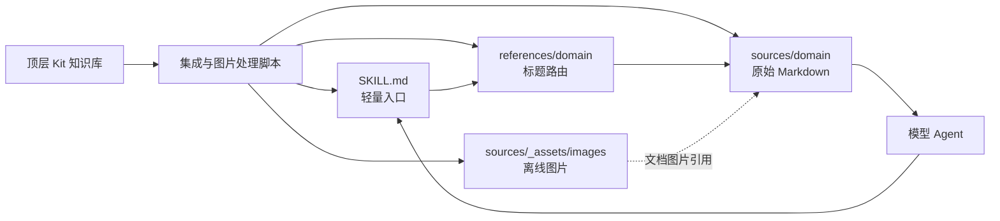
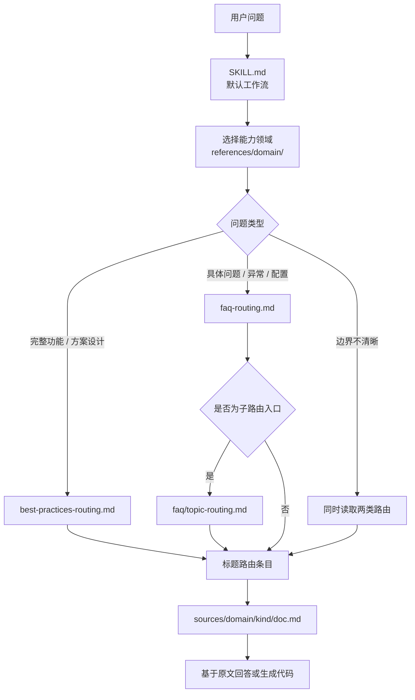
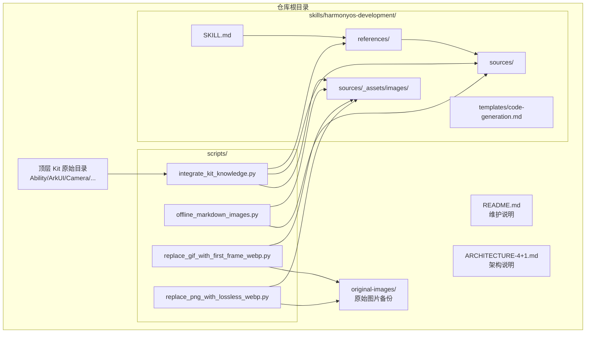
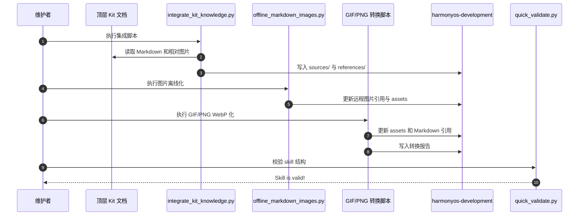
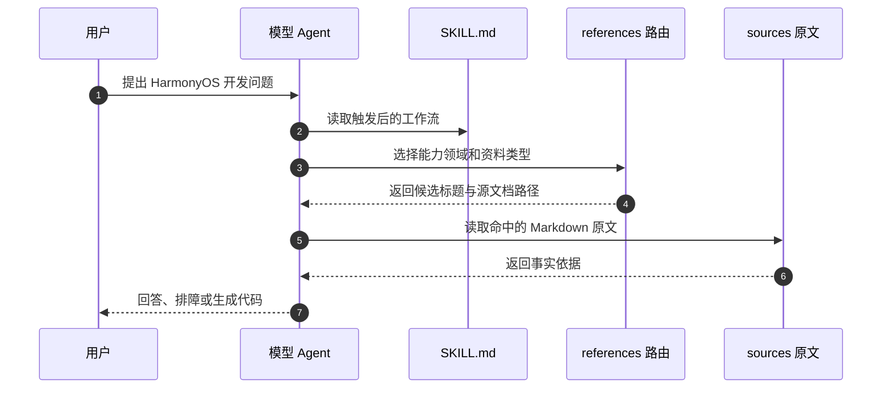
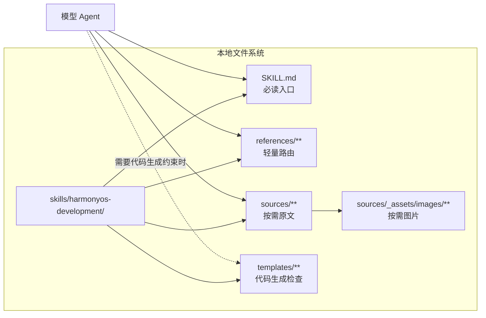
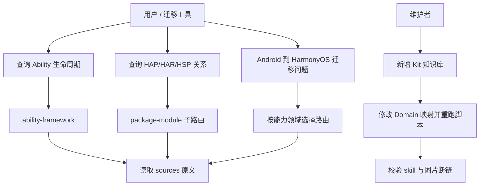

# HarmonyOS Development Skill 4+1 架构视图

本文档用 4+1 视图描述 `harmonyos-development` skill 的设计思路。这里的“系统”不是运行时服务，而是一个面向模型 Agent 的本地知识路由系统：它把整理好的 HarmonyOS Kit 文档转成可检索、可验证、可维护的 skill 结构。

## 0. 架构目标

核心目标是让模型在处理 HarmonyOS 开发任务时，先定位本地资料，再读取原文，最后基于原文回答或生成代码。

设计约束如下：

- 不把所有文档内容塞进 `SKILL.md`，避免每次触发 skill 都加载过多上下文。
- 不按 Kit 名称建立一级路由，避免与产品名、API 名和用户问题混淆。
- 路由文件只指向原文，不承担事实源职责。
- 二级路由关键词只来自 Markdown 一级标题，减少人工总结造成的偏差。
- 图片本地化并压缩，保证离线可用，同时控制 skill 体积。

整体架构可以先从下面这张图理解：原始 Kit 文档经过脚本生成 skill 内部结构，模型使用时只先读取轻量入口和路由，命中后才读取源文档。



## 1. 逻辑视图

逻辑视图描述系统对外呈现的核心概念和职责边界。

### 核心对象

| 对象 | 职责 |
| --- | --- |
| `SKILL.md` | skill 入口，只保存触发条件、默认工作流、资料入口和边界规则。 |
| 能力领域 | 一级路由单元，例如 `arkui-development`、`ability-framework`、`camera-development`。 |
| 资料类型 | 二级分类，包括 `best-practices` 和 `faq`。 |
| 路由文件 | 位于 `references/`，只保存标题到源文档路径的映射。 |
| 源文档 | 位于 `sources/`，作为回答和代码生成的事实源。 |
| assets | 位于 `sources/_assets/images/`，保存离线化后的图片资源。 |
| 生成脚本 | 将顶层 Kit 知识库转换为 skill 内部结构。 |

### 路由层次



### 关键设计取舍

- 一级路由使用“开发能力领域”，例如 `Ability/程序框架`，而不是 `Ability Kit`。
- 最佳实践和 FAQ 分开，分别服务“完整方案”和“具体问题排障”。
- 路由文件不写摘要、不写 API 线索、不扩展同义词，只保留标题和读取路径。
- 对 ArkUI、ArkTS、Ability 等 FAQ 较多的领域使用子路由，避免单个路由文件过长。

## 2. 开发视图

开发视图描述代码、文档和生成资产如何组织，方便维护者理解修改位置。

开发视图重点看“维护入口”和“生成产物”的关系。维护者主要改脚本配置和少量入口说明，`sources/`、`references/` 作为可重建产物管理。



### 目录组织

```text
.
  README.md
  ARCHITECTURE-4+1.md
  scripts/
    integrate_kit_knowledge.py
    offline_markdown_images.py
    replace_gif_with_first_frame_webp.py
    replace_png_with_lossless_webp.py
  skills/
    harmonyos-development/
      SKILL.md
      references/
        <domain>/
      sources/
        <domain>/
        _assets/
      templates/
        code-generation.md
  original-images/
```

### 主要模块

| 模块 | 维护内容 |
| --- | --- |
| `scripts/integrate_kit_knowledge.py` | Kit 原始目录到能力领域的映射、文档复制、路由生成、FAQ 子路由拆分。 |
| `scripts/offline_markdown_images.py` | 将 Markdown 中可离线化的图片引用转为本地 assets 引用。 |
| `scripts/replace_gif_with_first_frame_webp.py` | 将 GIF 替换为首帧 WebP，并备份原始 GIF。 |
| `scripts/replace_png_with_lossless_webp.py` | 将 PNG 替换为 lossless WebP，并备份原始 PNG。 |
| `skills/harmonyos-development/SKILL.md` | 模型触发和使用 skill 时直接读取的最小工作流。 |
| `README.md` | 维护规则、当前规模和设计说明。 |

### 维护边界

- 新增 Kit 时优先改 `DOMAINS` 映射，不直接手写 `sources/` 和 `references/`。
- FAQ 路由超过阈值时，在 `SPLIT_ROUTE_SECTIONS` 中配置子路由。
- 如果原始资料更新，重新执行脚本生成，不手工修补生成物。
- `original-images/` 是原始图片备份目录，不参与模型常规读取。

## 3. 进程视图

进程视图描述系统在两类流程中的动态行为：构建维护流程和模型使用流程。

### 构建维护流程



### 模型使用流程



### 异常处理原则

- 路由未命中时，说明本地标题路由未覆盖，不强行编造资料来源。
- 多个标题相近时，读取多个候选原文再判断。
- 图片引用断链时，先修复 assets 生成链路，再回答涉及图片的文档问题。
- 生成脚本失败时，优先修复脚本或原始资料路径，避免手工改生成结果。

## 4. 物理视图

物理视图描述文件实际落盘方式、规模和运行环境假设。

### 部署形态

该 skill 是本地文件系统中的静态资源包，没有常驻进程和远程服务依赖。模型通过文件读取按需加载：



### 当前规模

| 指标 | 当前值 |
| --- | --- |
| 覆盖领域 | 25 个能力领域 |
| 业务源文档 | 1004 篇 |
| 路由文件 | 57 个 |
| 离线图片 | 1205 个 |
| assets 图片目录 | 约 155M |
| 原始图片备份 | 1168 个，约 2.6G |

### 体积控制

- `SKILL.md` 保持短小，只保存入口和规则。
- 大量文档放在 `sources/`，只有路由命中后才读取。
- `references/` 只保存轻量路由信息。
- GIF 转首帧 WebP，因为当前场景主要依赖文字理解，动态图语义收益有限。
- PNG 转 lossless WebP，减少 assets 体积，同时尽量保留截图细节。

## 5. 场景视图

场景视图是 “+1” 视图，用典型用例串联前四个视图。

四个典型场景可以放到同一张用例图里看：查询类场景走“路由 -> 原文”，维护类场景走“脚本 -> 重生成 -> 校验”。



### 场景一：查询 Ability 生命周期问题

1. 用户问：“UIAbility 的生命周期怎么处理？”
2. 模型触发 `harmonyos-development`。
3. 选择 `references/ability-framework/`。
4. 判断是具体能力点，读取 `faq-routing.md`。
5. 进入 `faq/ability-lifecycle-context-routing.md`。
6. 命中相关标题后读取 `sources/ability-framework/faq/<doc>.md`。
7. 基于原文解释生命周期或给出代码建议。

### 场景二：查询 HAP、HAR、HSP 关系

1. 用户问：“HAP、HAR、HSP 的关系是什么？”
2. 选择 `ability-framework`。
3. 读取 Ability FAQ 子路由中的 `package-module-routing.md`。
4. 命中程序包结构相关标题。
5. 读取源文档并回答模块关系、限制和推荐使用场景。

### 场景三：新增一个 Kit 知识库

1. 将新 Kit 原始资料放到仓库顶层目录。
2. 在 `integrate_kit_knowledge.py` 中增加 `Domain(...)` 映射。
3. 必要时增加 FAQ 子路由拆分规则。
4. 执行集成和图片处理脚本。
5. 更新 `SKILL.md` 资料入口和 `README.md` 当前规模。
6. 执行结构校验和图片断链检查。

### 场景四：Android 到 HarmonyOS 迁移工具调用 skill

1. 迁移工具遇到平台差异问题，例如页面跳转、文件访问、媒体播放、权限弹窗。
2. 模型先按问题选择能力领域，而不是直接按 Kit 名称搜索。
3. 对完整迁移方案读取最佳实践，对报错和配置问题读取 FAQ。
4. 读取原文后生成迁移建议或代码片段。
5. 如果未命中本地标题路由，显式说明缺少对应资料，避免把通用经验伪装成本地文档结论。

## 6. 视图间一致性

| 约束 | 关联视图 |
| --- | --- |
| 路由文件不替代原文 | 逻辑视图、进程视图 |
| `SKILL.md` 保持轻量 | 开发视图、物理视图 |
| FAQ 大领域拆子路由 | 逻辑视图、物理视图 |
| 图片离线化和压缩 | 开发视图、物理视图 |
| 新资料通过脚本重生成 | 开发视图、进程视图 |

这套 4+1 视图的核心结论是：`harmonyos-development` 不是一个大而全的知识文件，而是一个分层路由系统。它用轻量入口触发、标题路由定位、原文读取取证、脚本化维护生成，来平衡模型读取效率、资料可验证性和后续扩展成本。
