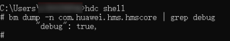
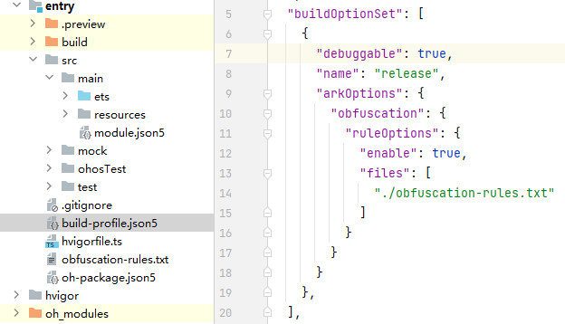

# 安装HAP包报“failed to install bundle. install debug type not same”错误

**原因**

HAP包与设备上已安装的HAP的debug信息不一致导致的问题。

**解决措施**

1. 查看设备上应用的debug配置，如下图所示：     

2. 检查当前应用代码工程中module下的build-profile.json5文件中的debuggable字段配置（该字段可缺省，缺省值为false），确保与设备上本应用的debug配置一致。如果不一致，需要进行修改。     
