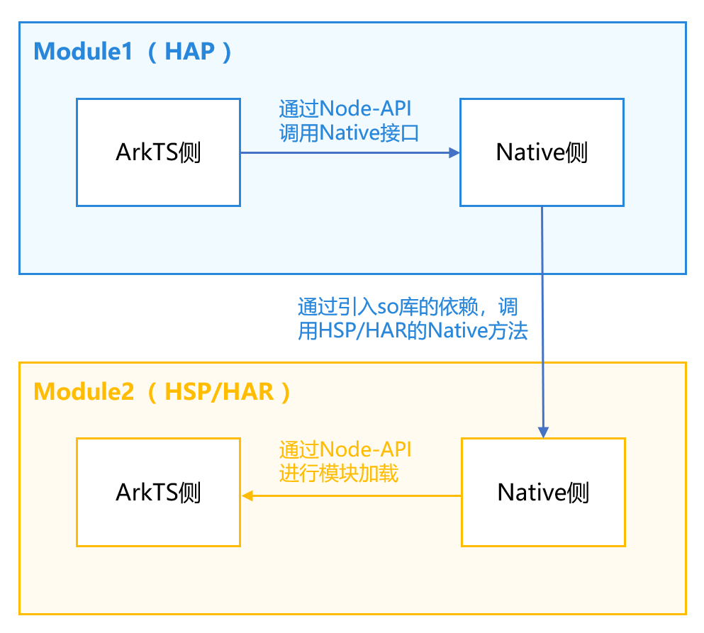
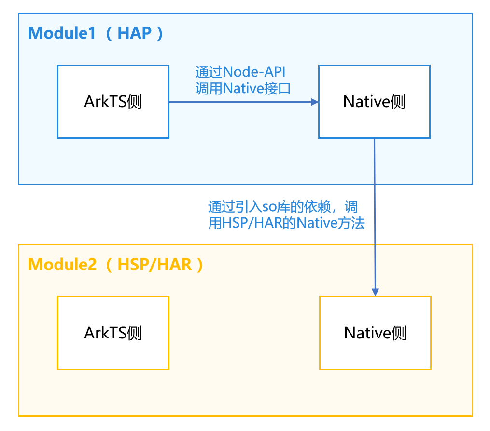
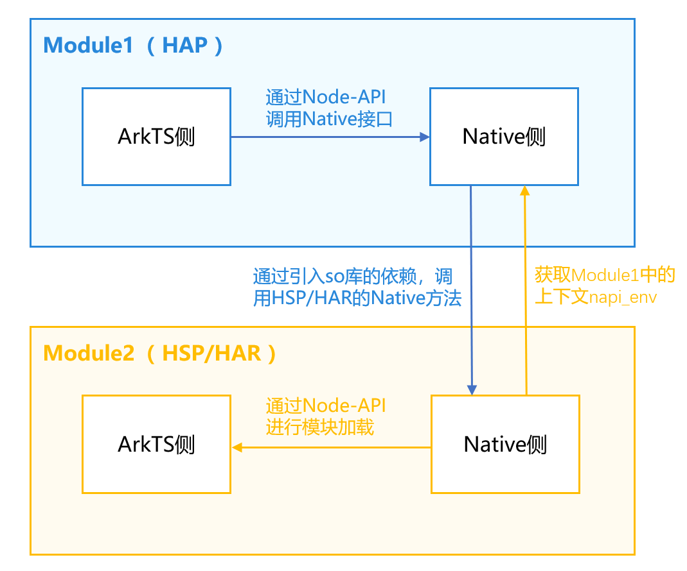
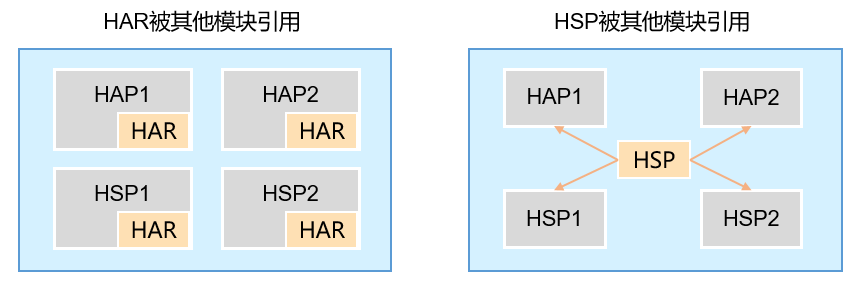

# Native侧跨HAR/HSP模块接口调用

## 概述

在大型应用开发中，应用通常会分为多个业务模块，业务模块常会以HSP或HAR包的形式提供SDK能力，这些SDK往往会提供Native接口给HAP模块的Native层直接调用，从而实现应用的复杂功能。而如何在Native侧跨HAR/HSP模块进行接口调用，是开发者经常遇到的问题。本文将介绍Native侧跨HAR/HSP模块调用两种典型场景，包括调用Native方法和调用ArkTS方法，以方便开发者更好的掌握Native侧跨模块调用的能力。


- [Native侧跨HAR/HSP模块调用Native方法](https://developer.huawei.com/consumer/cn/doc/best-practices/bpta-cross-module-reference#section470062115417)
- [Native侧跨HAR/HSP模块调用ArkTS方法](https://developer.huawei.com/consumer/cn/doc/best-practices/bpta-cross-module-reference#section1485574818153)


## 实现原理

如图1所示，Native侧跨HAR/HSP模块调用原理主要包括以下步骤。


1. 在Module1（HAP）模块中，ArkTS侧通过Node-API调用Native接口。
2. Module1（HAP）模块Native侧调用Module2（HSP/HAR）模块Native方法。
  1. 被调用方
    1. 在Module2（HSP/HAR）模块中，创建头文件，并在build-profile.json5中配置头文件导出。
    2. 在Module2（HSP/HAR）模块的CMakeLists.txt中进行配置，将源文件配置到so中。
  2. 调用方
    1. 在Module1（HAP）模块的oh-package.json5文件配置引入Module2（HSP/HAR）模块。
    2. 在Module1（HAP）模块的CMakeLists.txt中，配置引入Module2的so文件。
    3. 引入Module2（HSP/HAR）模块的头文件后，就可以调用Module2（HSP/HAR）模块的Native方法。
3. 在Module2（HSP/HAR）模块中，Native侧通过Node-API接口进行模块加载，从而调用ArkTS方法。


**图1** Native侧跨HAR/HSP模块调用原理图  


## Native侧跨HAR/HSP模块调用Native方法


如下图所示，Native侧跨HAR/HSP模块调用Native方法的调用链路为Module1 ArkTS -> Module1 Native -> Module2 Native。在HarmonyOS项目中，Native侧跨模块调用Native方法实际就是C++侧调用，需要配置编译链接依赖。其实现的关键是在Module2（HSP/HAR）模块的build-profile.json5中，配置头文件导出，并在CMakeLists.txt中进行配置，将源文件配置到so中。


**图2** Native侧跨HAR/HSP模块调用Native方法  


### 开发流程

Native侧跨HAR/HSP模块调用Native方法时，需要实现Module1（HAP）的ArkTS 侧调用Module1（HSP/HAR）的Native 侧、Module1（HAP）的Native 侧调用Module2（HSP/HAR）的Native 侧。在当前场景下，跨模块调用HAR模块和HSP模块的方式相同，当前以跨模块调用HAR模块为例，详细流程如下所示。


1. 开发者需要创建Module2（HAR）模块staticModule，详细创建流程可以参考[创建库模块](https://developer.huawei.com/consumer/cn/doc/harmonyos-guides/ide-har#section643521083015)。


2. 在Module2中新建C++文件napi_har.cpp，再新建其头文件napi_har.h，并定义Native方法。     napi_har.cpp代码如下所示。


  
  
  

```cpp
1. #include "napi/native_api.h"
2. #include "napi_har.h"
3.
4. double harNativeAdd(double a, double b) {
5.  return a + b;
6. }


```
  [napi_har.cpp](https://gitcode.com/HarmonyOS_Samples/CrossModuleReference/blob/master/staticModule/src/main/cpp/napi_har.cpp#L16-L21)
     napi_har.h代码如下所示。


  
  
  

```cpp
1. // staticModule\src\main\cpp\napi_har.h
2. #ifndef CROSSMODULEREFERENCE_NAPI_HAR_H
3. #define CROSSMODULEREFERENCE_NAPI_HAR_H
4. #include <js_native_api_types.h>
5. // ...
6. double harNativeAdd(double a, double b);
7. napi_value harArkTSAdd(double a, double b);
8. #endif //CROSSMODULEREFERENCE_NAPI_HAR_H


```
  [napi_har.h](https://gitcode.com/HarmonyOS_Samples/CrossModuleReference/blob/master/staticModule/src/main/cpp/napi_har.h#L16-L28)

3. 在Module2中的build-profile.json5中配置头文件导出。如果不做当前headerPath的配置，会导致Module1引用不到Module2的头文件。
  
  
  

```json
1. {
2.  "apiType": "stageMode",
3.  "buildOption": {
4.  "externalNativeOptions": {
5.  "path": "./src/main/cpp/CMakeLists.txt",
6.  "arguments": "",
7.  "cppFlags": "",
8.  "abiFilters": ["x86_64", "arm64-v8a"]
9.  },
10.  "nativeLib": {
11.  "headerPath": "./src/main/cpp"
12.  },
13.  // ...
14. }

```
  [build-profile.json5](https://gitcode.com/HarmonyOS_Samples/CrossModuleReference/blob/master/staticModule/build-profile.json5#L3-L61)

4. 在Module2的CMakeLists.txt中配置将源文件打包到so。
  
  
  

```scss
1. # staticModule\src\main\cpp\CMakeLists.txt
2. add_library(add SHARED napi_init.cpp napi_har.cpp)

```
  [CMakeLists.txt](https://gitcode.com/harmonyos_samples/CrossModuleReference/blob/master/staticModule/src/main/cpp/CMakeLists.txt#L15-L16)

5. 在Module2模块创建后，需要在Module1的oh-package.json5文件中配置对应的依赖。如下所示，staticModule为新创建的HAR模块的文件名，static_module为HAR模块的名称。
  
  
  

```json
1. {
2.  "name": "entry",
3.  "version": "1.0.0",
4.  "description": "Please describe the basic information.",
5.  "main": "",
6.  "author": "",
7.  "license": "",
8.  "dependencies": {
9.  "libentry.so": "file:./src/main/cpp/types/libentry",
10.  "static_module": "file:../staticModule",
11.  // ...
12.  }
13. }

```
  [oh-package.json5](https://gitcode.com/HarmonyOS_Samples/CrossModuleReference/blob/master/entry/oh-package.json5#L2-L16)

6. 在Module1中的CMakeLists.txt中配置so依赖。
  
  
  

```cangjie
1. # entry\src\main\cpp\CMakeLists.txt
2. target_link_libraries(entry PUBLIC libace_napi.z.so static_module::add shared_module::calc)

```
  [CMakeLists.txt](https://gitcode.com/harmonyos_samples/CrossModuleReference/blob/master/entry/src/main/cpp/CMakeLists.txt#L17-L18)

  
  
  说明
      static_module::add中第一个参数static_module是module2的模块名称，第二个参数add是module2编译出来的so名称（不需要带上lib）。默认情况下，module2的模块名称与so名称相同，为了方便说明，在本案例中将so名称修改成了add。

7. 在Module1的napi_init.cpp中导入Module2的头文件napi_har.h，并调用其Native方法harNativeAdd()。


8. 在Module1的Native侧调用Module2的invokeHarNative()方法。
  
  
  

```cpp
1. // entry\src\main\cpp\napi_init.cpp
2. static napi_value invokeHarNative(napi_env env, napi_callback_info info)
3. {
4.  size_t argc = 2;
5.  napi_value args[2] = {nullptr};
6.
7.  napi_get_cb_info(env, info, &argc, args , nullptr, nullptr);
8.
9.  napi_valuetype valuetype0;
10.  napi_typeof(env, args[0], &valuetype0);
11.
12.  napi_valuetype valuetype1;
13.  napi_typeof(env, args[1], &valuetype1);
14.
15.  double value0;
16.  napi_get_value_double(env, args[0], &value0);
17.
18.  double value1;
19.  napi_get_value_double(env, args[1], &value1);
20.
21.  napi_value sum;
22.
23.  napi_create_double(env, harNativeAdd(value0, value1), &sum);
24.
25.  return sum;
26. }

```
  [napi_init.cpp](https://gitcode.com/HarmonyOS_Samples/CrossModuleReference/blob/master/entry/src/main/cpp/napi_init.cpp#L46-L71)

9. 在Module1的ArkTS侧调用Native侧的invokeHarNative()方法。
  
  
  

```typescript
1. Button($r('app.string.call_har_native_method'))
2.  .fontSize(16)
3.  .width('100%')
4.  .margin({ top: 12 })
5.  .onClick(() => {
6.  this.getUIContext().getPromptAction().showToast({
7.  message: 'HarNative method call succeed, result is ' + napi.invokeHarNative(2, 3).toString()
8.  });
9.  })

```
  [Index.ets](https://gitcode.com/HarmonyOS_Samples/CrossModuleReference/blob/master/entry/src/main/ets/pages/Index.ets#L43-L51)


### 实现效果

**图3** Native侧调用HAR模块的Native方法  


## Native侧跨HAR/HSP模块调用ArkTS方法

如下图所示，Native侧跨HAR/HSP模块调用ArkTS方法是[Native侧跨HAR/HSP模块调用Native方法](https://developer.huawei.com/consumer/cn/doc/best-practices/bpta-cross-module-reference#section470062115417)的基础上调用ArkTS方法。其关键是在Module2中获取Module1中的上下文napi_env，并根据上下文napi_env加载模块、调用对应的ArkTS方法。


**图4** Native侧跨HAR/HSP模块调用ArkTS方法




### 开发流程

Native侧跨HAR/HSP模块调用ArkTS方法具体实现方法如下所示。


1. 在完成[Native侧跨HAR/HSP模块调用Native方法](https://developer.huawei.com/consumer/cn/doc/best-practices/bpta-cross-module-reference#section470062115417)后，在Module1中新增invokeHarArkTS()方法以准备调用HAR模块的ArkTS方法。

2. 在Module2的Native侧，新增setHarEnv()方法，用以传递napi_env，并在头文件中进行配置，代码如下所示。     napi_har.h代码如下所示。


  
  
  

```cpp
1. // staticModule\src\main\cpp\napi_har.h
2. #ifndef CROSSMODULEREFERENCE_NAPI_HAR_H
3. #define CROSSMODULEREFERENCE_NAPI_HAR_H
4. #include <js_native_api_types.h>
5. napi_env g_main_env;
6. void setHarEnv(napi_env env);
7. double harNativeAdd(double a, double b);
8. napi_value harArkTSAdd(double a, double b);
9. #endif //CROSSMODULEREFERENCE_NAPI_HAR_H


```
  [napi_har.h](https://gitcode.com/HarmonyOS_Samples/CrossModuleReference/blob/master/staticModule/src/main/cpp/napi_har.h#L17-L27)
     napi_har.cpp代码如下所示。


  
  
  

```cpp
1. // staticModule\src\main\cpp\napi_har.cpp
2. void setHarEnv(napi_env env) {
3.  g_main_env = env;
4. }


```
  [napi_har.cpp](https://gitcode.com/HarmonyOS_Samples/CrossModuleReference/blob/master/staticModule/src/main/cpp/napi_har.cpp#L25-L28)

3. 在Module1中的napi_init.cpp中的Init()方法中调用setHarEnv()方法将Module1中的napi_env传递到Module2中。
  
  
  

```cpp
1. // entry\src\main\cpp\napi_init.cpp
2. EXTERN_C_START
3. static napi_value Init(napi_env env, napi_value exports)
4. {
5.  napi_property_descriptor desc[] = {
6.  { "add", nullptr, Add, nullptr, nullptr, nullptr, napi_default, nullptr },
7.  { "invokeHarNative", nullptr, invokeHarNative, nullptr, nullptr, nullptr, napi_default, nullptr },
8.  { "invokeHarArkTS", nullptr, invokeHarArkTS, nullptr, nullptr, nullptr, napi_default, nullptr },
9.  { "invokeHspNative", nullptr, invokeHspNative, nullptr, nullptr, nullptr, napi_default, nullptr },
10.  { "invokeHspArkTS", nullptr, invokeHspArkTS, nullptr, nullptr, nullptr, napi_default, nullptr }
11.  };
12.  napi_define_properties(env, exports, sizeof(desc) / sizeof(desc[0]), desc);
13.  setHarEnv(env);
14.  // ...
15.  return exports;
16. }
17. EXTERN_C_END

```
  [napi_init.cpp](https://gitcode.com/harmonyos_samples/CrossModuleReference/blob/master/entry/src/main/cpp/napi_init.cpp#L148-L166)

4. 在Module2中创建ArkTS方法，提供给Module2的Native侧调用。
  
  
  

```typescript
1. // staticModule\src\main\ets\utils\Util.ets
2. export function add(a: number, b: number): number {
3.  return a + b;
4. }

```
  [Util.ets](https://gitcode.com/HarmonyOS_Samples/CrossModuleReference/blob/master/staticModule/src/main/ets/utils/Util.ets#L17-L20)

5. 在Module2模块的build-profile.json5文件中进行以下配置。
  
  
  

```json
1. {
2.  "apiType": "stageMode",
3.  "buildOption": {
4.  // ...
5.  "arkOptions" : {
6.  "runtimeOnly" : {
7.  "sources": [
8.  "./src/main/ets/utils/Util.ets"
9.  ]
10.  }
11.  }
12.  },
13.  // ...
14. }

```
  [build-profile.json5](https://gitcode.com/harmonyos_samples/CrossModuleReference/blob/master/staticModule/build-profile.json5#L2-L62)

6. 在Module2的Native侧调用ArkTS方法，并配置到头文件中。详细步骤如下所示。
  1. 通过napi_load_module_with_info()加载模块，其中，第二个参数是待加载的ets文件的路径，第三个参数是bundleName+模块名。
  2. 使用napi_get_named_property()获取模块导出的add()方法。
  3. 使用napi_call_function()调用add()方法。

     napi_har.cpp代码如下所示。


  
  
  

```cpp
1. // staticModule\src\main\cpp\napi_har.cpp
2. napi_value harArkTSAdd(double a, double b) {
3.  napi_env env = g_main_env;
4.  napi_value module;
5.  napi_status status = napi_load_module_with_info(env, "static_module/src/main/ets/utils/Util", "com.example.crossmodulereference/entry", &module);
6.  if (napi_ok != status) {
7.  return 0;
8.  }
9.
10.  napi_value addFunc;
11.  napi_get_named_property(env, module, "add", &addFunc);
12.
13.  napi_value addResult;
14.  napi_value argv[2] = {nullptr, nullptr};
15.  napi_create_double(env, a, &argv[0]);
16.  napi_create_double(env, b, &argv[1]);
17.  napi_call_function(env, module, addFunc, 2, argv, &addResult);
18.
19.  return addResult;
20. }


```
  [napi_har.cpp](https://gitcode.com/harmonyos_samples/CrossModuleReference/blob/master/staticModule/src/main/cpp/napi_har.cpp#L32-L51)

7. 在module1的Native侧调用module2的harArkTSAdd()方法。
  
  
  

```cpp
1. // entry\src\main\cpp\napi_init.cpp
2. static napi_value invokeHarArkTS(napi_env env, napi_callback_info info)
3. {
4.  size_t argc = 2;
5.  napi_value args[2] = {nullptr};
6.
7.  napi_get_cb_info(env, info, &argc, args , nullptr, nullptr);
8.
9.  napi_valuetype valuetype0;
10.  napi_typeof(env, args[0], &valuetype0);
11.
12.  napi_valuetype valuetype1;
13.  napi_typeof(env, args[1], &valuetype1);
14.
15.  double value0;
16.  napi_get_value_double(env, args[0], &value0);
17.
18.  double value1;
19.  napi_get_value_double(env, args[1], &value1);
20.
21.  return harArkTSAdd(value0, value1);
22. }

```
  [napi_init.cpp](https://gitcode.com/harmonyos_samples/CrossModuleReference/blob/master/entry/src/main/cpp/napi_init.cpp#L75-L96)

8. 在Module1的ArkTS侧调用Native侧的invokeHarArkTS()方法。
  
  
  

```typescript
1. Button($r('app.string.call_har_ArkTS_method'))
2.  .fontSize(16)
3.  .width('100%')
4.  .margin({ top: 12 })
5.  .onClick(() => {
6.  this.getUIContext().getPromptAction().showToast({ message: 'HarArkTS method call succeed, result is '
7.  + napi.invokeHarArkTS(2, 3).toString() });
8.  })

```
  [Index.ets](https://gitcode.com/harmonyos_samples/CrossModuleReference/blob/master/entry/src/main/ets/pages/Index.ets#L55-L62)


### 实现效果

**图5** Native侧调用HAR模块的ArkTS方法  


## 常见问题


### 跨HSP模块调用和跨HAR模块调用的区别

HSP模块和HAR模块被调用时，主要的区别在Module2 Native调用Module2 ArkTS中，在调用napi_load_module_with_info加载模块时的入参有一些区别，其他的流程都是一样的。


1. 被调用模块Module2是HAR


如图所示，编译构建后，HAR模块被打包到各个模块之中，所以其入口模块仍然是HAP模块，napi_load_module_with_info中第2个参数的模块名称要填HAP模块中oh-package.json5中定义的依赖HAR的名称，而不是HAR模块的实际名称。





2. 被调用模块Module2是HSP


当被调用模块Module2是HSP，HSP是独立的模块，其入口模块就是HSP本模块，所以napi_load_module_with_info第2个参数的模块名就是它自己的模块名。


### 是否支持直接依赖HAR模块和HSP模块的三方so（即依赖传递问题）？

当前HAR模块和HSP模块都不支持依赖传递。


### 多包依赖同一so时，最终打包后的so有多少份？

如果多个HAR模块同时依赖commonHar的so，同一模块的同名so在打包后可以通过覆盖策略只保留一份。


如果多个HSP模块同时依赖commonHar的so，在编译构建时，会将依赖的so编译打包到最终的编译产物里，所以每一个.hsp文件都会有一个so。


### 报错找不到HAR/HSP模块的ArkTS文件

**问题现象**


调用HAR/HSP模块的ArkTS文件时，可能会遇到以下报错：


```cangjie
1. Error message:Cannot find module 'staticModule/src/main/ets/utils/Util' imported from 'com.xxxx.crossmodulereference/entry'.

```


**可能原因**


可能原因是工程级的build-profile.json5中的useNormalizedOHMUrl设置参数为false。


**解决措施**


在调用模块Module1的build-profile.json5里面添加如下配置。


```json
1. // ...
2.  "buildOption": {
3.  // ...
4.  "arkOptions" : {
5.  "runtimeOnly" : {
6.  "packages": [
7.  "static_module"
8.  ]
9.  }
10.  }
11.  },
12.  // ...

```


[build-profile.json5](https://gitcode.com/harmonyos_samples/CrossModuleReference/blob/master/entry/build-profile.json5#L2-L54)


## 示例代码

- [Native侧跨HAR/HSP模块调用](https://gitcode.com/harmonyos_samples/CrossModuleReference)
