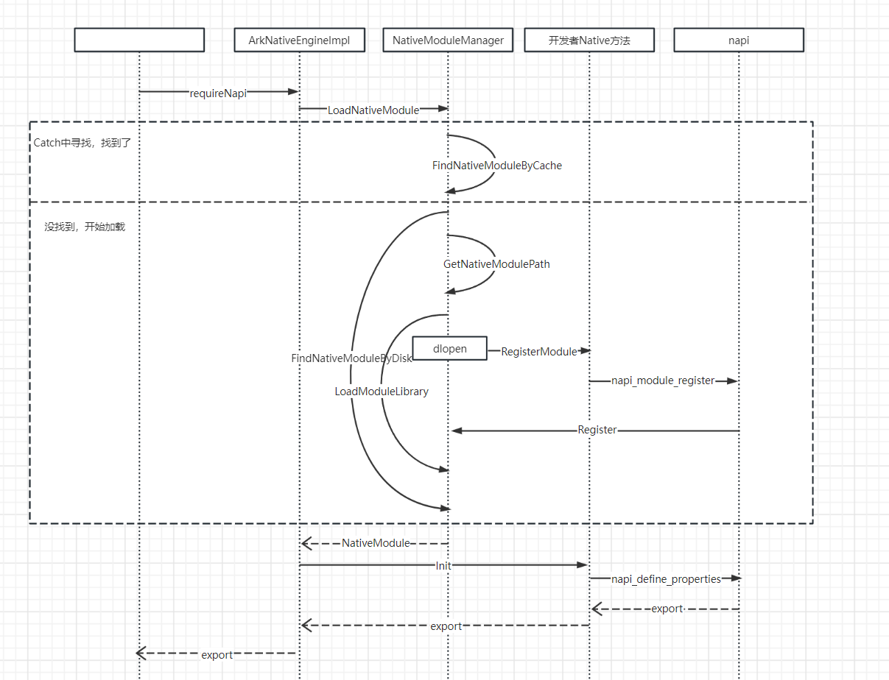

# ModuleManager模块加载流程是什么样的

napi_module结构体包含模块注册所需的信息，具体定义如下：


```cpp
1. static napi_module demoModule = {
2.  .nm_version = 1, // Nm version number, default value is 1, type is int
3.  .nm_flags = 0, // Nm identifier, type unsigned int
4.  .nm_filename = nullptr, // File name, not currently paid attention to, use default value, type is char*
5.  .nm_register_func = Init, // Specify the entry function for nm, type napi_addon_register_func
6.  .nm_modname = "entry", // Specify the module name for TS page import, type char*
7.  .nm_priv = ((void*)0), // Not paying attention for now, just use the default, type is void*
8.  .reserved = { 0 } // Not paying attention for now, just use the default value, type is void*
9. };

```


[DemoModule.cpp](https://gitcode.com/HarmonyOS_Samples/faqsnippets/blob/master/ArkTS/entry/src/main/ets/pages/DemoModule.cpp#L21-L29)


在requireNapi中，loadNativeModule加载模块，会先通过FindNativeModuleByCache在缓存中寻找目标module，如果在缓存中找到，使用GetNativeModulePath拼接so路径，最后用LoadModuleLibrary打开so；如果没有在缓存中找到，则要先查找dlopen打开对应so，打开so后，native中的extern "C" __attribute__((constructor)) void RegisterModule(void)函数进行NativeModule加载，然后完成static napi_value Init(napi_env env, napi_value export)中的实际注册动作，返回一个js对象export，该js对象上挂载了开发者提供的native方法，以便于开发者在js侧调用。模块加载流程简介如下图：



