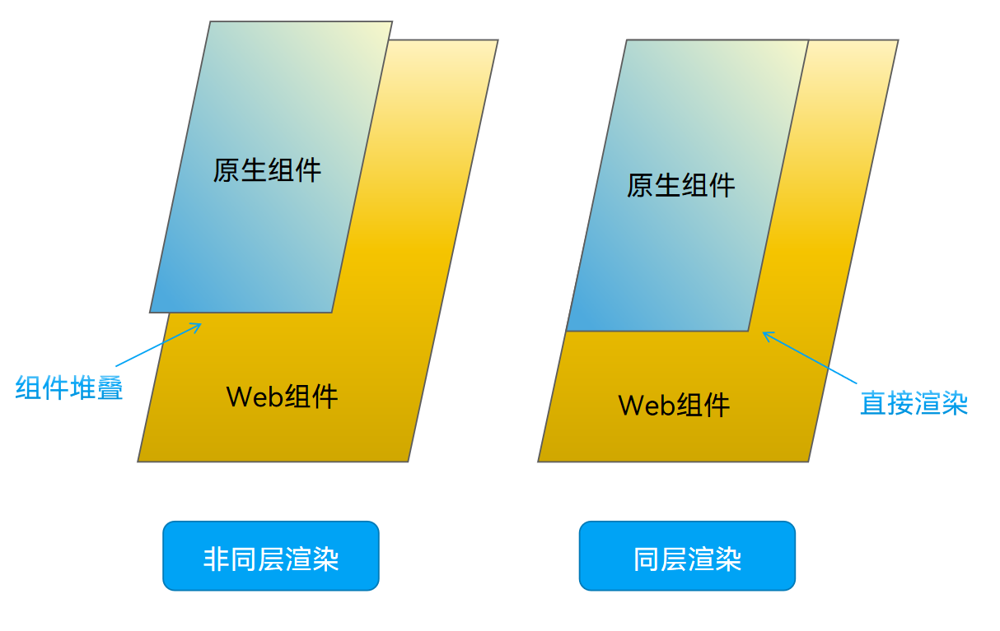
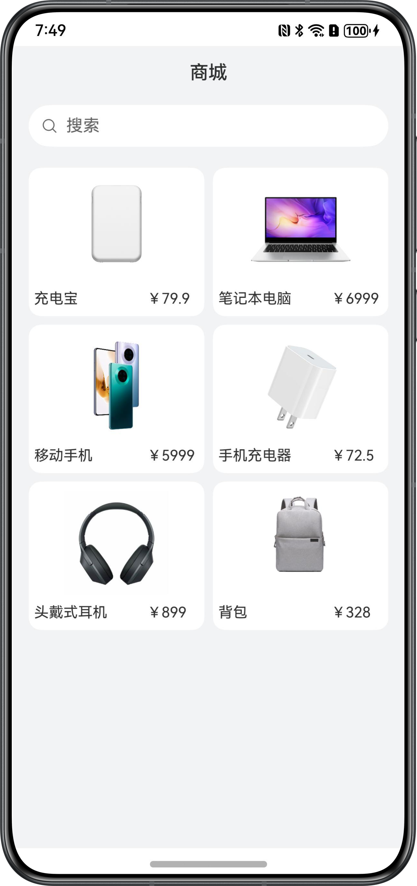
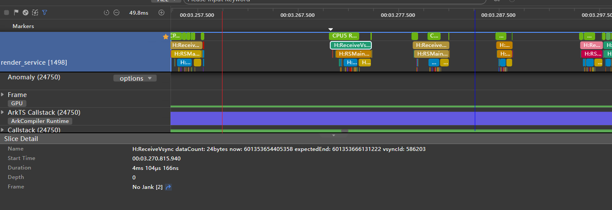
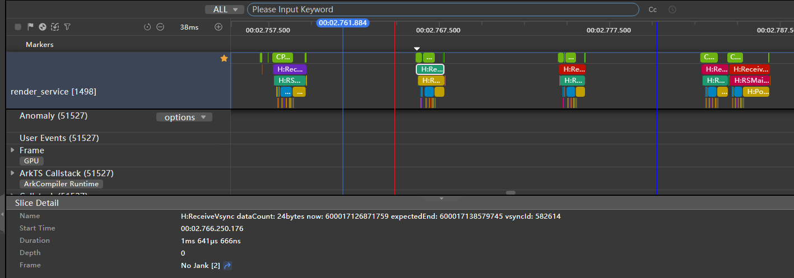
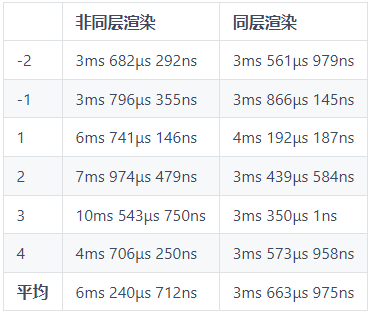
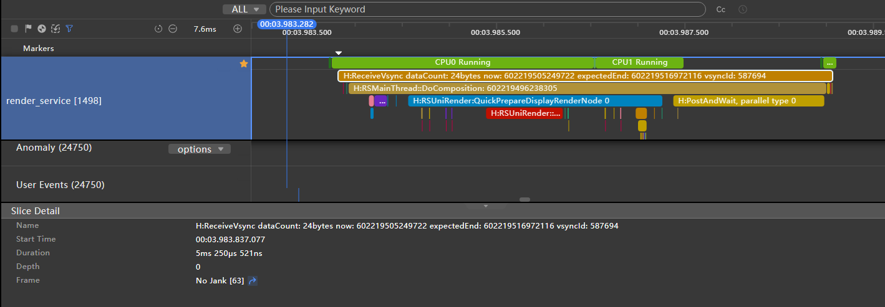
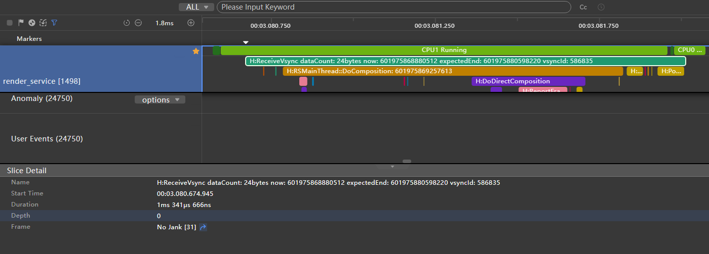

# 同层渲染原生组件

## 概述

在使用[Web](https://developer.huawei.com/consumer/cn/doc/harmonyos-references/ts-basic-components-web)组件加载H5页面时，经常会有输入框、视频的场景，这些场景在H5中的组件性能体验欠佳。想要更加流畅的体验，必须要将原生组件放到Web组件上。在以下场景应在Web组件上使用原生组件：


- 需要高性能，流畅体验。
- 需要使用原生组件功能。
- 原生组件已经实现，复用以减少开发成本。


目前要实现在Web组件上使用原生组件（详情查看[组件介绍](https://developer.huawei.com/consumer/cn/doc/harmonyos-guides/ui-js-building-ui-component)）有两种方案：


方案一：直接使用[Stack](https://developer.huawei.com/consumer/cn/doc/harmonyos-references/ts-container-stack)将组件堆叠到H5页面上。


方案二：使用同层渲染，使用Web组件和原生组件交互的方式，将原生组件替代Web组件中部分组件，提升交互体验和性能。


以上两种方案经过性能对比后，同层渲染比非同层渲染的性能要更好。


## 什么是同层渲染

[同层渲染](https://developer.huawei.com/consumer/cn/doc/harmonyos-guides/web-same-layer)是一种混合渲染技术，通过将原生组件嵌入到Web组件的DOM树中同一层级，实现原生组件与Web组件的无缝集成。


同层渲染和非同层渲染的区别如下：


- 非同层渲染：通过Z轴的层级关系堆叠在Web组件页面上。此方式实现方式简单，用于原生组件大小位置固定场景。
- 同层渲染：通过同层渲染的方式直接渲染到H5页面Embed标签区域上。此方式实现相对复杂，用于原生组件大小位置需要跟随Web组件页面变化场景。


**图1** 同层渲染和非同层渲染区别





## 场景示例

以下分别采用非同层渲染和同层渲染的两种方式，加载相同的商城组件到相同的H5页面上，并抓取Trace对比两者之间的区别，页面效果与场景实例源码的核心部分如下：


**图2** 页面效果图





提供承载的H5页面代码如下：


```xml
1. <div>
2.  <div id="bodyId">
3.  <!-- On the H5 interface, the same layer elements are identified by the embedded tag, and the native components are rendered to the location of the embedded tag on the H5 page on the application side.-->
4.  <embed id="nativeSearch" type = "native/component" width="100%" height="100%" src="view"/>
5.  </div>
6. </div>

```


[nativeembed_view.html](https://gitcode.com/harmonyos_samples/BestPracticeSnippets/blob/master/NonSameLayerRendering/entry/src/main/resources/rawfile/nativeembed_view.html#L10-L15)


商品数据代码如下：


```typescript
1. export const PRODUCT_DATA: Array<ProductDataModel> = [
2.  new ProductDataModel(0, $r('app.media.nativeembed_product000'), $r('app.string.nativeembed_product_title000'),
3.  $r("app.string.nativeembed_product_price000")),
4.  new ProductDataModel(1, $r('app.media.nativeembed_product001'), $r('app.string.nativeembed_product_title001'),
5.  $r('app.string.nativeembed_product_price001')),
6.  new ProductDataModel(2, $r('app.media.nativeembed_product002'), $r('app.string.nativeembed_product_title002'),
7.  $r('app.string.nativeembed_product_price002')),
8.  new ProductDataModel(4, $r('app.media.nativeembed_product003'), $r('app.string.nativeembed_product_title004'),
9.  $r('app.string.nativeembed_product_price004')),
10.  new ProductDataModel(0, $r('app.media.nativeembed_product000'), $r('app.string.nativeembed_product_title000'),
11.  $r("app.string.nativeembed_product_price000")),
12.  new ProductDataModel(1, $r('app.media.nativeembed_product001'), $r('app.string.nativeembed_product_title001'),
13.  $r('app.string.nativeembed_product_price001')),
14.  new ProductDataModel(2, $r('app.media.nativeembed_product002'), $r('app.string.nativeembed_product_title002'),
15.  $r('app.string.nativeembed_product_price002')),
16.  new ProductDataModel(4, $r('app.media.nativeembed_product003'), $r('app.string.nativeembed_product_title004'),
17.  $r('app.string.nativeembed_product_price004')),
18.  new ProductDataModel(0, $r('app.media.nativeembed_product000'), $r('app.string.nativeembed_product_title000'),
19.  $r("app.string.nativeembed_product_price000")),
20.  new ProductDataModel(1, $r('app.media.nativeembed_product001'), $r('app.string.nativeembed_product_title001'),
21.  $r('app.string.nativeembed_product_price001')),
22.  new ProductDataModel(2, $r('app.media.nativeembed_product002'), $r('app.string.nativeembed_product_title002'),
23.  $r('app.string.nativeembed_product_price002')),
24.  new ProductDataModel(4, $r('app.media.nativeembed_product003'), $r('app.string.nativeembed_product_title004'),
25.  $r('app.string.nativeembed_product_price004')),
26.  new ProductDataModel(0, $r('app.media.nativeembed_product000'), $r('app.string.nativeembed_product_title000'),
27.  $r("app.string.nativeembed_product_price000")),
28.  new ProductDataModel(1, $r('app.media.nativeembed_product001'), $r('app.string.nativeembed_product_title001'),
29.  $r('app.string.nativeembed_product_price001')),
30.  new ProductDataModel(2, $r('app.media.nativeembed_product002'), $r('app.string.nativeembed_product_title002'),
31.  $r('app.string.nativeembed_product_price002')),
32.  new ProductDataModel(4, $r('app.media.nativeembed_product003'), $r('app.string.nativeembed_product_title004'),
33.  $r('app.string.nativeembed_product_price004')),
34. ];

```


[GoodsMock.ets](https://gitcode.com/harmonyos_samples/BestPracticeSnippets/blob/master/NonSameLayerRendering/entry/src/main/ets/mock/GoodsMock.ets#L20-L53)


商城组件代码如下：


```typescript
1. @Component
2. struct SearchComponent {
3.  @Prop searchWidth: number;
4.  @Prop searchHeight: number;
5.
6.  build() {
7.  Column({ space: 8 }) {
8.  Text($r('app.string.nativeembed_mall'))
9.  .fontSize(16)
10.  Row() {
11.  Image($r('app.media.nativeembed_search_icon'))
12.  .width(14)
13.  .margin({ left: 14 })
14.  Text($r('app.string.nativeembed_search_text_placeholder'))
15.  .fontSize(14)
16.  .opacity(0.6)
17.  .fontColor('#000000')
18.  .margin({ left: 14})
19.  }
20.  .width('100%')
21.  .margin(4)
22.  .height(36)
23.  .backgroundColor(Color.White)
24.  .borderRadius(18)
25.  .onClick(() => {
26.  this.getUIContext().getPromptAction().showToast({
27.  message: $r('app.string.nativeembed_prompt_text')
28.  });
29.  })
30.  Grid() {
31.  ForEach(PRODUCT_DATA, (item: ProductDataModel, index: number) => {
32.  GridItem() {
33.  Column({ space: 8 }) {
34.  Image(item.uri)
35.  .width(100)
36.  .height(100)
37.  Row({ space: 8 }) {
38.  Text(item.title)
39.  .fontSize(12)
40.  Text(item.price)
41.  .fontSize(12)
42.  }
43.  }
44.  .backgroundColor(Color.White)
45.  .alignItems(HorizontalAlign.Center)
46.  .justifyContent(FlexAlign.Center)
47.  .width('100%')
48.  .borderRadius(12)
49.  .padding({ bottom: 12 })
50.  }
51.  }, (item: ProductDataModel) => `${item.id}`)
52.  }
53.  .columnsTemplate('1fr 1fr')
54.  .rowsGap(8)
55.  .columnsGap(8)
56.  .width('100%')
57.  .height('90%')
58.  .backgroundColor('#F1F3F5')
59.  }
60.  .padding(10)
61.  .width(this.searchWidth)
62.  .height(this.searchHeight)
63.  }
64. }

```


[Index.ets](https://gitcode.com/harmonyos_samples/BestPracticeSnippets/blob/master/NonSameLayerRendering/entry/src/main/ets/pages/Index.ets#L77-L140)


## Web组件首次加载原生组件方案对比

首先的想法是，将原生组件内容使用H5实现，直接用Web组件加载页面。但是，用H5开发页面时，需要使用到JS和CSS，甚至一些前端框架进行页面的开发，并且动效和体验都不如原生组件。因此采用同层渲染和非同层渲染两种方案进行对比。


### 使用非同层渲染

底层使用空白的H5页面，用任意标签进行占位，然后在H5页面上方层叠一个原生组件。原生组件需要在Web组件加载完成后，获取到标签大小位置后，在对应位置展示。


需要在H5侧添加getEmbedSize()方法来获取元素大小，代码如下：


```typescript
1. function getEmbedSize() {
2.  let doc = document.getElementById('nativeSearch');
3.  return {
4.  width: doc.offsetWidth,
5.  height: doc.offsetHeight,
6.  }
7. }

```


[nativeembed_view.html](https://gitcode.com/harmonyos_samples/BestPracticeSnippets/blob/master/NonSameLayerRendering/entry/src/main/resources/rawfile/nativeembed_view.html#L19-L25)


使用Stack层叠Web组件和SearchComponent组件，代码如下：


```typescript
1. import { PRODUCT_DATA } from '../mock/GoodsMock';
2. import { webview } from '@kit.ArkWeb';
3.
4. @Entry
5. @Component
6. struct NonSameLayerRendering {
7.  @State searchWidth: number = 0;
8.  @State searchHeight: number = 0;
9.  @State isWebInit: boolean = false;
10.  browserTabController: WebviewController = new webview.WebviewController(); // WebviewController controller
11.
12.  build() {
13.  Stack() {
14.  Web({ src: $rawfile('nativeembed_view.html'), controller: this.browserTabController })
15.  .backgroundColor('#F1F3F5')
16.  .onPageEnd(() => {
17.  this.browserTabController.runJavaScript(
18.  'getEmbedSize()',
19.  (error, result) => {
20.  if (result) {
21.  interface EmbedSize {
22.  width: number,
23.  height: number
24.  }
25.  let embedSize = JSON.parse(result) as EmbedSize;
26.  this.searchWidth = embedSize.width;
27.  this.searchHeight = embedSize.height;
28.  this.isWebInit = true;
29.  }
30.  });
31.  })
32.  if (this.isWebInit){
33.  Column() {
34.  // Because it needs to be displayed according to the actual size of the Web, it needs to wait for the width and height to be obtained after the Web is initialized, and then it needs to be layered on the Web
35.  SearchComponent({ searchWidth: this.searchWidth, searchHeight: this.searchHeight })
36.  }
37.  .zIndex(10)
38.  }
39.  }
40.  }
41. }
42.
43. /**
44.  * Set the data class of the item
45.  */
46. class ProductDataModel {
47.  id: number;
48.  uri: ResourceStr;
49.  title: ResourceStr;
50.  price: ResourceStr;
51.
52.  constructor(id: number, uri: ResourceStr, title: ResourceStr, price: ResourceStr) {
53.  this.id = id;
54.  this.uri = uri;
55.  this.title = title;
56.  this.price = price;
57.  }
58. }
59.
60. @Component
61. struct SearchComponent {
62.  @Prop searchWidth: number;
63.  @Prop searchHeight: number;
64.
65.  build() {
66.  Column({ space: 8 }) {
67.  Text($r('app.string.nativeembed_mall'))
68.  .fontSize(16)
69.  Row() {
70.  Image($r('app.media.nativeembed_search_icon'))
71.  .width(14)
72.  .margin({ left: 14 })
73.  Text($r('app.string.nativeembed_search_text_placeholder'))
74.  .fontSize(14)
75.  .opacity(0.6)
76.  .fontColor('#000000')
77.  .margin({ left: 14})
78.  }
79.  .width('100%')
80.  .margin(4)
81.  .height(36)
82.  .backgroundColor(Color.White)
83.  .borderRadius(18)
84.  .onClick(() => {
85.  this.getUIContext().getPromptAction().showToast({
86.  message: $r('app.string.nativeembed_prompt_text')
87.  });
88.  })
89.  Grid() {
90.  ForEach(PRODUCT_DATA, (item: ProductDataModel, index: number) => {
91.  GridItem() {
92.  Column({ space: 8 }) {
93.  Image(item.uri)
94.  .width(100)
95.  .height(100)
96.  Row({ space: 8 }) {
97.  Text(item.title)
98.  .fontSize(12)
99.  Text(item.price)
100.  .fontSize(12)
101.  }
102.  }
103.  .backgroundColor(Color.White)
104.  .alignItems(HorizontalAlign.Center)
105.  .justifyContent(FlexAlign.Center)
106.  .width('100%')
107.  .borderRadius(12)
108.  .padding({ bottom: 12 })
109.  }
110.  }, (item: ProductDataModel) => `${item.id}`)
111.  }
112.  .columnsTemplate('1fr 1fr')
113.  .rowsGap(8)
114.  .columnsGap(8)
115.  .width('100%')
116.  .height('90%')
117.  .backgroundColor('#F1F3F5')
118.  }
119.  .padding(10)
120.  .width(this.searchWidth)
121.  .height(this.searchHeight)
122.  }
123. }

```


[Index.ets](https://gitcode.com/harmonyos_samples/BestPracticeSnippets/blob/master/NonSameLayerRendering/entry/src/main/ets/pages/Index.ets#L17-L141)


上述的方案只是限于底层H5网页比较简单，如果H5页面比较复杂，就会发现原生组件是很难去定位，而且在性能上，Web组件是整体渲染的，即使被原生组件遮住的部分也需要渲染消耗性能。


### 使用同层渲染

同层渲染简单来说就是，底层使用空白的H5页面，用Embed标签进行占位，ArkTS使用NodeContainer来占位，最后将Web侧的surfaceId和原生组件绑定，渲染在NodeContainer上。这里给出一些大致步骤：


1. 用Stack组件层叠NodeContainer和Web组件，并开启enableNativeEmbedMode模式。
2. 因为要使用NodeContainer，所以封装一个继承自NodeController的类SearchNodeController。
3. 使用Web组件加载nativeembed_view.html文件，Web组件解析到Embed标签后，通过onNativeEmbedLifecycleChange()接口上报Embed标签创建消息通知到应用侧。
4. 在步骤3的回调内，根据embed.status，将配置传入searchNodeController后，执行rebuild()方法重新触发其makeNode()方法。
5. makeNode()方法触发后，NodeContainer组件获取到BuilderNode对象，页面出现原生组件。
  
  
  

```typescript
1. import { PRODUCT_DATA } from '../viewmodel/GoodsViewModel';
2. import { ProductDataModel } from '../model/GoodsModel';
3. import { BuilderNode, FrameNode, NodeController, NodeRenderType } from '@kit.ArkUI';
4. import { webview } from '@kit.ArkWeb';
5.
6. // Margin vertical
7. const MARGIN_VERTICAL: number = 8;
8. // Font weight
9. const FONT_WEIGHT: number = 500;
10. // Placeholder
11. const PLACEHOLDER: ResourceStr = $r('app.string.embed_search');
12.
13. declare class Params {
14.  width: number;
15.  height: number;
16. }
17.
18. declare class NodeControllerParams {
19.  surfaceId: string;
20.  type: string;
21.  renderType: NodeRenderType;
22.  embedId: string;
23.  width: number;
24.  height: number;
25. }
26.
27. class SearchNodeController extends NodeController {
28.  private rootNode: BuilderNode<[Params]> | undefined | null = null;
29.  private embedId: string = "";
30.  private surfaceId: string = "";
31.  private renderType: NodeRenderType = NodeRenderType.RENDER_TYPE_DISPLAY;
32.  private componentWidth: number = 0;
33.  private componentHeight: number = 0;
34.  private componentType: string = "";
35.
36.  /**
37.  * 设置渲染参数
38.  *
39.  * @param params 渲染参数
40.  */
41.  setRenderOption(params: NodeControllerParams): void {
42.  this.surfaceId = params.surfaceId;
43.  this.renderType = params.renderType;
44.  this.embedId = params.embedId;
45.  this.componentWidth = params.width;
46.  this.componentHeight = params.height;
47.  this.componentType = params.type;
48.  }
49.
50.  /**
51.  * 创建节点
52.  *
53.  * @param uiContext UIContext
54.  * @returns 节点
55.  */
56.  makeNode(uiContext: UIContext): FrameNode | null {
57.  this.rootNode = new BuilderNode(uiContext, { surfaceId: this.surfaceId, type: this.renderType });
58.  if (this.componentType === 'native/component') {
59.  this.rootNode.build(wrapBuilder(searchBuilder), { width: this.componentWidth, height: this.componentHeight });
60.  }
61.  return this.rootNode.getFrameNode();
62.  }
63.
64.  setBuilderNode(rootNode: BuilderNode<Params[]> | null): void {
65.  this.rootNode = rootNode;
66.  }
67.
68.  getBuilderNode(): BuilderNode<[Params]> | undefined | null {
69.  return this.rootNode;
70.  }
71.
72.  updateNode(arg: Object): void {
73.  this.rootNode?.update(arg);
74.  }
75.
76.  getEmbedId(): string {
77.  return this.embedId;
78.  }
79.
80.  postEvent(event: TouchEvent | undefined): boolean {
81.  return this.rootNode?.postTouchEvent(event) as boolean;
82.  }
83. }
84. @Component
85. struct SearchComponent {
86.  @Prop params: Params;
87.  controller: SearchController = new SearchController()
88.
89.  build() {
90.  Column({ space: MARGIN_VERTICAL }) {
91.  Text($r("app.string.embed_mall"))
92.  .fontSize($r('app.string.ohos_id_text_size_body4'))
93.  .fontWeight(FONT_WEIGHT)
94.  .fontFamily('HarmonyHeiTi-Medium')
95.  Row() {
96.  Search({ placeholder: PLACEHOLDER, controller: this.controller })
97.  .backgroundColor(Color.White)
98.  }
99.  .width($r("app.string.embed_full_percent"))
100.  .margin($r("app.integer.embed_row_margin"))
101.
102.  Grid() {
103.  ForEach(PRODUCT_DATA, (item: ProductDataModel, index: number) => {
104.  GridItem() {
105.  Column({ space: MARGIN_VERTICAL }) {
106.  Image(item.imageRes).width($r("app.integer.embed_image_size"))
107.  Row({ space: MARGIN_VERTICAL }) {
108.  Text(item.title)
109.  .fontSize($r('app.string.ohos_id_text_size_body1'))
110.  .width(100)
111.  .maxLines(1)
112.  .textOverflow({ overflow: TextOverflow.Ellipsis })
113.  Text(item.price)
114.  .fontSize($r('app.string.ohos_id_text_size_body1'))
115.  .width(50)
116.  .maxLines(1)
117.  }
118.  }
119.  .backgroundColor($r('app.color.ohos_id_color_background'))
120.  .alignItems(HorizontalAlign.Center)
121.  .justifyContent(FlexAlign.Center)
122.  .width($r("app.string.embed_full_percent"))
123.  .height($r("app.string.embed_full_percent"))
124.  .borderRadius($r('app.string.ohos_id_corner_radius_default_m'))
125.  }
126.  }, (item: ProductDataModel, index: number) => index.toString())
127.  }
128.  .columnsTemplate('1fr 1fr')
129.  .rowsTemplate('1fr 1fr 1fr')
130.  .rowsGap($r('app.string.ohos_id_elements_margin_vertical_m'))
131.  .columnsGap($r('app.string.ohos_id_elements_margin_vertical_m'))
132.  .width($r("app.string.embed_full_percent"))
133.  .height($r("app.string.embed_sixty_percent"))
134.  .backgroundColor($r('app.color.ohos_id_color_sub_background'))
135.  }
136.  .padding($r('app.string.ohos_id_card_margin_start'))
137.  .width(this.params.width)
138.  .height(this.params.height)
139.  }
140. }
141. @Builder
142. function searchBuilder(params: Params) {
143.  SearchComponent({ params: params })
144.  .backgroundColor($r('app.color.ohos_id_color_sub_background'))
145. }
146.
147. @Entry
148. @Component
149. struct Index {
150.  browserTabController: WebviewController = new webview.WebviewController();
151.  @State componentIdArr: Array<string> = [];
152.  private nodeControllerMap: Map<string, SearchNodeController> = new Map();
153.
154.  build() {
155.  Stack() {
156.  ForEach(this.componentIdArr, (componentId: string) => {
157.  NodeContainer(this.nodeControllerMap.get(componentId));
158.  }, (embedId: string) => embedId)
159.  Web({ src: $rawfile("embed_view.html"), controller: this.browserTabController })
160.  .backgroundColor($r('app.color.ohos_id_color_sub_background'))
161.  .zoomAccess(false)
162.  .enableNativeEmbedMode(true)
163.  .onNativeEmbedLifecycleChange((embed) => {
164.  const componentId = embed.info?.id?.toString() as string
165.  if (embed.status === NativeEmbedStatus.CREATE) {
166.  let nodeController = new SearchNodeController();
167.  nodeController.setRenderOption({
168.  surfaceId: embed.surfaceId as string,
169.  type: embed.info?.type as string,
170.  renderType: NodeRenderType.RENDER_TYPE_TEXTURE,
171.  embedId: embed.embedId as string,
172.  width: this.getUIContext().px2vp(embed.info?.width),
173.  height: this.getUIContext().px2vp(embed.info?.height)
174.  });
175.  nodeController.rebuild();
176.  this.nodeControllerMap.set(componentId, nodeController);
177.  this.componentIdArr.push(componentId);
178.  } else if (embed.status === NativeEmbedStatus.UPDATE) {
179.  let nodeController = this.nodeControllerMap.get(componentId);
180.  nodeController?.updateNode({
181.  text: 'update',
182.  width: this.getUIContext().px2vp(embed.info?.width),
183.  height: this.getUIContext().px2vp(embed.info?.height)
184.  } as ESObject);
185.  nodeController?.rebuild();
186.  } else {
187.  let nodeController = this.nodeControllerMap.get(componentId);
188.  nodeController?.setBuilderNode(null);
189.  nodeController?.rebuild();
190.  }
191.  })
192.  .onNativeEmbedGestureEvent((touch) => {
193.  this.componentIdArr.forEach((componentId: string) => {
194.  let nodeController = this.nodeControllerMap.get(componentId);
195.  if (nodeController?.getEmbedId() === touch.embedId) {
196.  nodeController?.postEvent(touch.touchEvent);
197.  }
198.  })
199.  })
200.  }
201.  }
202. }

```
  [Index.ets](https://gitcode.com/harmonyos_samples/arkweb-same-level-rendering/blob/master/entry/src/main/ets/pages/Index.ets#L16-L219)


## Web组件加载原生组件性能收益对比

本节以Web组件加载原生组件的场景，抓取Trace图进行分析。下面的Trace图上的红线处Web组件加载完成，蓝线处原生组件加载显示完成。


### 使用非同层渲染加载

**图3** 非同层渲染的Trace图





非同层渲染的分析：


- 在应用侧，红蓝线之间为测量和计算布局，图片加载被延后到了蓝线之外。
- 在render_service侧，蓝线之后每一帧ReceiveVsync的耗时大幅增加。


### 使用同层渲染加载

**图4** 同层渲染的Trace图





同层渲染的分析：


- 在应用侧，红蓝线之间由于NodeContainer的原因，组件布局的测量和绘制划分成了两部分，同时将图片加载提前到了红蓝线之间。
- 在render_service侧，每一帧ReceiveVsync的耗时无明显变化。


### 页面加载场景总结

下表为各种方法完成原生组件加载（蓝线）前后几帧render_service侧的耗时对比（-1为完成前一帧，1为完成后一帧，以此类推）





从此表格可以看出，非同层渲染会导致render_service侧每帧耗时大幅提升，同层渲染相比起非同层渲染，并不影响render_service侧的每帧耗时。


## 列表滑动场景性能收益对比

本节以列表滑动场景，抓取Trace图进行分析。在此场景下，对比同层渲染和非同层渲染的每一帧的结构如下所示：


### 使用非同层渲染

**图5** 非同层渲染滑动时单帧图。





非同层渲染的分析：


- ReceiveVsync表示渲染服务接收到垂直同步信号（Vsync）的事件，此标记的出现意味着渲染服务开始响应新一帧的绘制任务。所以上图表示单帧的渲染绘制情况。
- 单帧ReceiveVsync渲染耗时5ms。


### 使用同层渲染

**图6** 同层渲染滑动时单帧图。





同层渲染的分析：


- 同场景下，单帧ReceiveVsync渲染耗时1ms。


### 列表滑动场景总结

非同层渲染的render_service每一帧的耗时大幅增加，结论与“[页面加载场景总结](https://developer.huawei.com/consumer/cn/doc/best-practices/bpta-render-web-using-same-layer-render#section13531145519460)”一致，再次验证了同样的结果。


## 总结

在Web组件中渲染原生组件时，采用同层渲染方式比起非同层渲染可以将图片渲染提前到原生组件加载完成前，且同层渲染将位于同一个图层的元素一起渲染，降低绘制任务，提升了性能。同时使用同层渲染可以实现更多功能，比如根据尺寸调整组件大小等功能，从而避免繁琐操作。


## 示例代码

- [基于ArkWeb实现系统原生组件渲染至H5页面上](https://gitcode.com/harmonyos_samples/arkweb-same-level-rendering)
