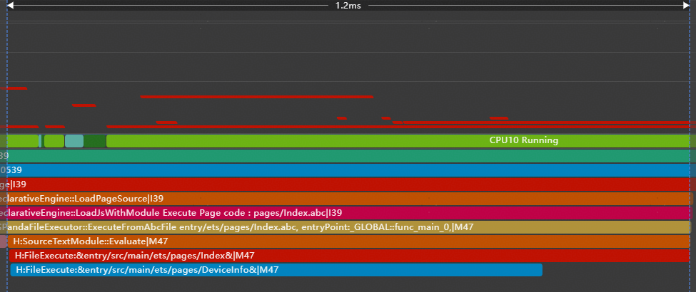
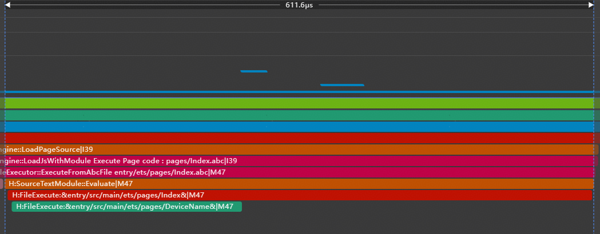
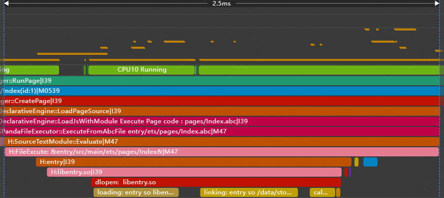
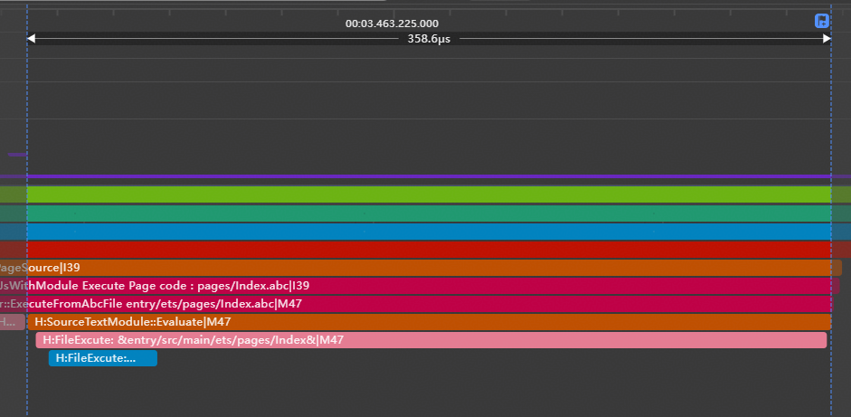

# 操作延时触发

## **延迟加载Lazy-Import与动态加载await import**


随着业务规模不断扩大，很多应用在冷启动时会静态import大量模块，这种静态import会在应用初始化阶段同步加载所有依赖模块，导致冷启动耗时增加。ArkTS 提供了[Lazy-Import](https://developer.huawei.com/consumer/cn/doc/harmonyos-guides-V5/arkts-lazy-import-V5)能力和[动态加载](https://developer.huawei.com/consumer/cn/doc/harmonyos-guides/arkts-dynamic-import)（动态import）能力，使模块可在真正需要时再加载，从而提升应用启动速度，并有效降低资源消耗。


- 动态加载（动态import）是一种异步模块加载机制，允许应用程序在运行时按照实际需求去加载相关模块。例如在用户交互等条件触发时，再动态加载特定模块，可以减少初始化import的加载时间和资源消耗，这将有助于提高应用程序的内存性能和响应速度。
- 延迟加载（Lazy-Import）是一种延缓模块加载的机制，可以使待加载文件在冷启动阶段不被加载，而在后续导出变量被真正使用时再同步加载执行文件，从而节省资源以提高应用冷启动性能。具体案例与实验数据请参阅[延迟加载Lazy-Import使用指导](https://developer.huawei.com/consumer/cn/doc/best-practices/bpta-arkts-high-performance#section12861143418213)。


两种延时加载方案的区别。具体请参阅[Lazy-Import与动态加载的区别](https://developer.huawei.com/consumer/cn/doc/harmonyos-guides/arkts-lazy-import#lazy-import%E4%B8%8E%E5%8A%A8%E6%80%81%E5%8A%A0%E8%BD%BD%E7%9A%84%E5%8C%BA%E5%88%AB)。


注意

延迟加载（lazy-Import）会改变模块执行顺序，可能导致预期的全局变量未定义。具体场景请参阅[Lazy-Import加载副作用](https://developer.huawei.com/consumer/cn/doc/harmonyos-guides-V5/arkts-module-side-effects-V5#%E5%BB%B6%E8%BF%9F%E5%8A%A0%E8%BD%BDlazy-import%E6%94%B9%E5%8F%98%E6%A8%A1%E5%9D%97%E6%89%A7%E8%A1%8C%E9%A1%BA%E5%BA%8F%E5%8F%AF%E8%83%BD%E5%AF%BC%E8%87%B4%E9%A2%84%E6%9C%9F%E7%9A%84%E5%85%A8%E5%B1%80%E5%8F%98%E9%87%8F%E6%9C%AA%E5%AE%9A%E4%B9%89)。


### 延迟加载Lazy-Import


**模块导入延迟到业务附近**


一些应用在冷启动阶段会加载过多未使用模块，针对这种情况导致的启动缓慢问题，开发者可以对冷启动阶段未使用的模块进行 Lazy-Import 改造，使模块导入延迟到对应业务附近加载，从而有效缩短冷启动时间，最终提升用户的启动体验。案例可参考[模块导入延迟到业务附近](https://developer.huawei.com/consumer/cn/doc/harmonyos-guides/arkts-lazy-import#%E4%BD%BF%E7%94%A8%E7%A4%BA%E4%BE%8B)。


**延迟加载非关键路径模块**


下面示例中，所有变量均从DeviceInfo模块中导出。除了冷启动用到的name模块，一些非关键路径模块（如screen和storage）也一起被导出。





```typescript
1. // entry\src\main\ets\pages\Index.ets
2. // Before optimization: All variables are exported from the user info
3. import { hilog } from '@kit.PerformanceAnalysisKit';
4. import { name, screen, storage } from './DeviceInfo';
5.
6. @Entry
7. @Component
8. struct Index {
9.  build() {
10.  RelativeContainer() {
11.  Text(name)
12.  .id('HelloWorld')
13.  .fontSize($r('app.float.page_text_font_size'))
14.  .fontWeight(FontWeight.Bold)
15.  .alignRules({
16.  center: { anchor: '__container__', align: VerticalAlign.Center },
17.  middle: { anchor: '__container__', align: HorizontalAlign.Center }
18.  })
19.  .onClick(() => {
20.  hilog.info(0x0000, 'testTag', 'screen: %{public}s', screen);
21.  hilog.info(0x0000, 'testTag', 'storage: %{public}s', storage);
22.  })
23.  }
24.  .height('100%')
25.  .width('100%')
26.  }
27. }

```


[Index2.ets](https://gitcode.com/HarmonyOS_Samples/BestPracticeSnippets/blob/master/ArkTSModuleHighPerformanceSegment/LazyImport/entry/src/main/ets/pages/Index2.ets#L2-L29)


```typescript
1. // entry\src\main\ets\pages\DeviceInfo.ets
2. import { hilog } from '@kit.PerformanceAnalysisKit';
3.
4. const name = 'Mate 70';
5. hilog.info(0x0000, 'testTag', 'export %{public}s', name);
6. const screen = 'OLED';
7. hilog.info(0x0000, 'testTag', 'export %{public}s', screen);
8. const storage = '512GB';
9. hilog.info(0x0000, 'testTag', 'export %{public}s', storage);
10.
11. export { name, screen, storage };

```


[DeviceInfo.ets](https://gitcode.com/HarmonyOS_Samples/BestPracticeSnippets/blob/master/ArkTSModuleHighPerformanceSegment/LazyImport/entry/src/main/ets/pages/DeviceInfo.ets#L2-L13)


使用体检工具[体检工具](https://developer.huawei.com/consumer/cn/doc/best-practices/bpta-application-cold-start-optimization#section16955857103112)可以查看冷启动阶段未使用的模块和这些模块的加载耗时。将这些未使用模块（storage和screen）从关键路径中剥离，添加lazy标识进行延迟加载。修改后，从下图Trace中可以观察到冷启动阶段仅加载了DeviceName模块。OtherDeviceInfo模块被推迟到用户首次点击文本时才会执行。从修改前后的Trace可以看出，冷启动耗时有所降低。





```typescript
1. // entry\src\main\ets\pages\Index.ets
2. // After optimization: split variables are exported from different modules
3. import { hilog } from '@kit.PerformanceAnalysisKit';
4. import { name } from './DeviceName';
5. import lazy { screen, storage } from './OtherDeviceInfo';
6.
7. @Entry
8. @Component
9. struct Index {
10.  build() {
11.  RelativeContainer() {
12.  Text(name)
13.  .id('HelloWorld')
14.  .fontSize($r('app.float.page_text_font_size'))
15.  .fontWeight(FontWeight.Bold)
16.  .alignRules({
17.  center: { anchor: '__container__', align: VerticalAlign.Center },
18.  middle: { anchor: '__container__', align: HorizontalAlign.Center }
19.  })
20.  .onClick(() => {
21.  hilog.info(0x0000, 'testTag', 'screen: %{public}s', screen);
22.  hilog.info(0x0000, 'testTag', 'storage: %{public}s', storage);
23.  })
24.  }
25.  .height('100%')
26.  .width('100%')
27.  }
28. }

```


[Index.ets](https://gitcode.com/HarmonyOS_Samples/BestPracticeSnippets/blob/master/ArkTSModuleHighPerformanceSegment/LazyImport/entry/src/main/ets/pages/Index.ets#L2-L30)


```typescript
1. // entry\src\main\ets\pages\DeviceName.ets
2. import { hilog } from '@kit.PerformanceAnalysisKit';
3.
4. const name = 'Mate 70';
5. hilog.info(0x0000, 'testTag', 'export %{public}s', name);
6.
7. export { name };

```


[DeviceName.ets](https://gitcode.com/HarmonyOS_Samples/BestPracticeSnippets/blob/master/ArkTSModuleHighPerformanceSegment/LazyImport/entry/src/main/ets/pages/DeviceName.ets#L2-L9)


```typescript
1. // entry\src\main\ets\pages\OtherDeviceInfo.ets
2. import { hilog } from '@kit.PerformanceAnalysisKit';
3.
4. const screen = 'OLED';
5. hilog.info(0x0000, 'testTag', 'export %{public}s', screen);
6. const storage = '512GB';
7. hilog.info(0x0000, 'testTag', 'export %{public}s', storage);
8.
9. export { screen, storage };

```


[OtherDeviceInfo.ets](https://gitcode.com/HarmonyOS_Samples/BestPracticeSnippets/blob/master/ArkTSModuleHighPerformanceSegment/LazyImport/entry/src/main/ets/pages/OtherDeviceInfo.ets#L2-L11)


### 动态加载await import

**动态加载冷启动未用到的so**


下面示例在应用启动时，界面仅需显示基础文本信息，但可以从下图的Trace中看到一个本地so库（libentry.so）被同步导入。该SO库包含数学运算功能，在用户点击界面之前不需要加载和初始化。


```typescript
1. // entry\src\main\ets\pages\Index.ets
2. // Before optimization: statically import the so that is not used in cold start
3. import { hilog } from '@kit.PerformanceAnalysisKit';
4. import testNapi from 'libentry.so';
5. import { title } from './name';
6.
7. @Entry
8. @Component
9. struct Index {
10.  build() {
11.  Row() {
12.  Column() {
13.  Text(title)
14.  .fontSize($r('app.float.page_text_font_size'))
15.  .fontWeight(FontWeight.Bold)
16.  .onClick(() => {
17.  hilog.info(0x0000, 'testTag', 'Test NAPI 2 + 3 = %{public}d', testNapi.add(2, 3));
18.  })
19.  }
20.  .width('100%')
21.  }
22.  .height('100%')
23.  }
24. }

```


[Index2.ets](https://gitcode.com/HarmonyOS_Samples/BestPracticeSnippets/blob/master/ArkTSModuleHighPerformanceSegment/DynamicLoad/entry/src/main/ets/pages/Index2.ets#L2-L26)


```typescript
1. // entry\src\main\ets\pages\name.ets
2. export const title = 'HarmonyOS';

```


[name.ets](https://gitcode.com/HarmonyOS_Samples/BestPracticeSnippets/blob/master/ArkTSModuleHighPerformanceSegment/DynamicLoad/entry/src/main/ets/pages/name.ets#L2-L4)





使用[体检工具](https://developer.huawei.com/consumer/cn/doc/best-practices/bpta-application-cold-start-optimization#section16955857103112)记录冷启动Trace，识别启动阶段未使用的模块及其加载耗时。在该示例中，不需要在用户点击事件前加载[libentry.so](https://libentry.so/)模块，建议删除import testNapi from 'libentry.so'语句，仅在需要使用时通过import()函数动态加载该模块。下图为修改后采集的冷启动Trace，从图中可以看到冷启动阶段不再加载libentry.so。从修改前后的Trace可以看出降低了冷启动的耗时。


```typescript
1. // entry\src\main\ets\pages\Index.ets
2. import { hilog } from '@kit.PerformanceAnalysisKit';
3. import { title } from './name';
4.
5. @Entry
6. @Component
7. struct Index {
8.  build() {
9.  Row() {
10.  Column() {
11.  Text(title)
12.  .fontSize($r('app.float.page_text_font_size'))
13.  .fontWeight(FontWeight.Bold)
14.  .onClick(async () => {
15.  // After optimization: The SO file is dynamically loaded at the point of use.
16.  let ns: ESObject | null = null;
17.  try {
18.  ns = await import('libentry.so');
19.  hilog.info(0x0000, 'testTag', 'Test NAPI 2 + 3 = %{public}d', ns.default.add(2, 3));
20.  } catch (error) {
21.  hilog.error(0x0000, 'testTag', `Load so failed, code is ${error.code}, message is ${error.message}`);
22.  }
23.  })
24.  }
25.  .width('100%')
26.  }
27.  .height('100%')
28.  }
29. }

```


[Index.ets](https://gitcode.com/HarmonyOS_Samples/BestPracticeSnippets/blob/master/ArkTSModuleHighPerformanceSegment/DynamicLoad/entry/src/main/ets/pages/Index.ets#L2-L31)





## **延迟执行资源释放操作**

将资源关闭和释放操作放在[setTimeout](https://developer.huawei.com/consumer/cn/doc/harmonyos-references/js-apis-timer#settimeout)函数中执行，使其延迟到系统相对空闲的时刻进行，可以避免在程序忙碌时段占用关键资源，提升整体性能及响应能力。例如相机正常使用后，[延迟执行释放相机资源](https://developer.huawei.com/consumer/cn/doc/best-practices/bpta-application-latency-optimization-cases#section8783201923819)的相关操作。
