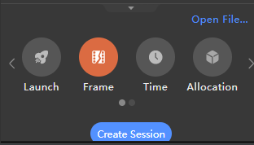
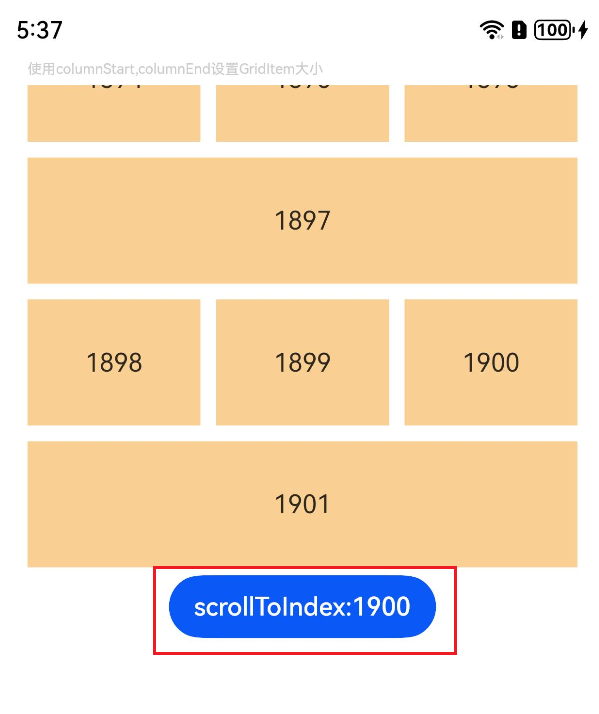
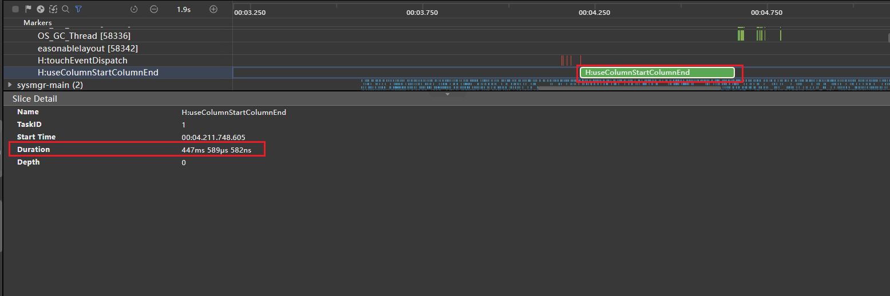
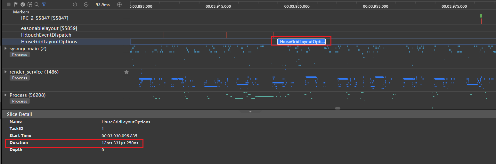
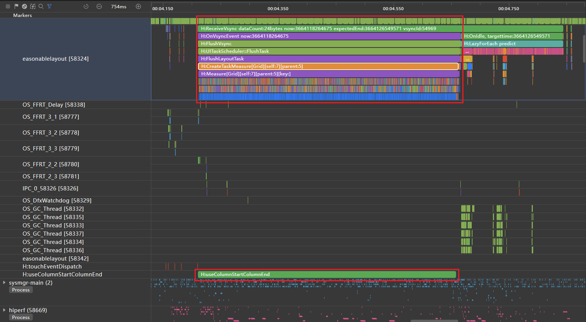
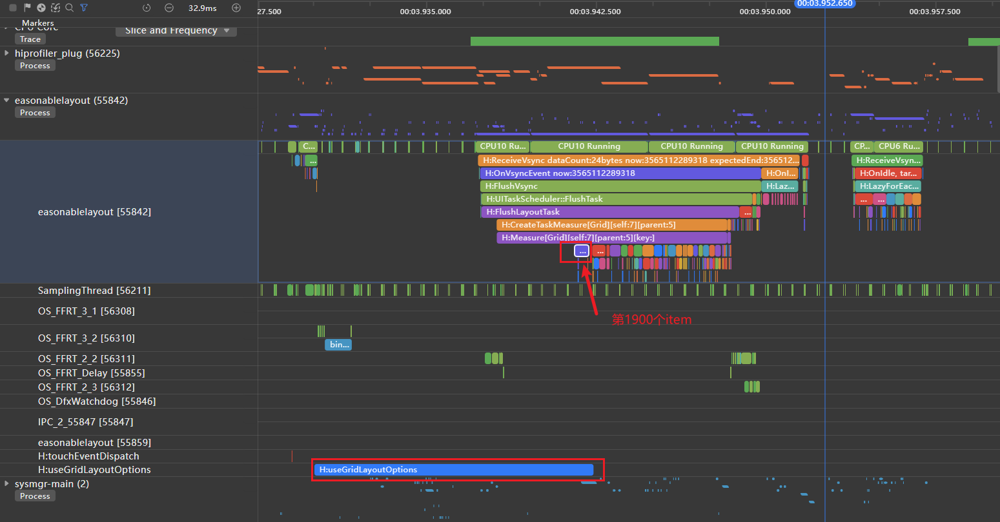

# Grid组件加载丢帧优化

## 概述

网格是应用开发中常见的开发场景。它通过相交的横线和竖线，形成整齐有序的网状布局。网格适用于展示图片、媒体文件、购物商品等多种数据。当网格上下滑动时，子组件会带来测量和绘制的性能消耗。


在网格的高频场景中，性能优化是关键，包括加快渲染速度、提升滑动帧率、降低内存占用等，从而显著提升应用流畅度和用户体验。对于希望快速实现的开发者，可使用ScrollComponents库直接创建流畅滑动的网格，该库内置组件复用、懒加载、复用池共享等优化能力，并支持预创建和预加载，大幅减少开发者的性能调优成本，具体实现细节和最佳实践可参考[基于ScrollComponents实现网格](https://developer.huawei.com/consumer/cn/doc/best-practices/bpta-grid-based-on-scrollcomponents)。


在实现如下图所示可滚动布局效果时，可能会通过columnStart/columnEnd[设置子组件所占行列数](https://developer.huawei.com/consumer/cn/doc/harmonyos-guides/arkts-layout-development-create-grid#%E8%AE%BE%E7%BD%AE%E5%AD%90%E7%BB%84%E4%BB%B6%E6%89%80%E5%8D%A0%E8%A1%8C%E5%88%97%E6%95%B0)，实现不规则的布局效果。


**图1** columnStart/columnEnd实现不规则网格布局  


在以下使用场景中，使用columnStart或columnEnd可能会导致性能问题：


1. **删除或拖拽等改变GridItem位置**
2. **使用scrollToIndex滑动到指定GridItem**


在Grid中存在多个GridItem时，如果使用columnStart/columnEnd或rowStart/rowEnd设置GridItem的大小，可能会导致性能问题。在这种情况下，建议使用GridLayoutOptions来提升性能。使用columnStart/columnEnd或rowStart/rowEnd布局时，如果调用scrollToIndex滑动到指定索引，Grid会遍历所有GridItem以查找位置。而使用GridLayoutOptions布局时，通过计算方式查找位置，效率更高。因此，可以通过设置GridLayoutOptions，并结合rowsTemplate或columnsTemplate来替代使用columnStart/columnEnd控制GridItem占用多列的情况。


## 案例说明


### 场景示例


介绍Grid中使用scrollToIndex滑动到指定位置的场景。案例中，columnStart/columnEnd设置不规则宫格布局的反例，与GridLayoutOption的正例对比，示例代码如下：


**反例：**使用columnStart/columnEnd设置GridItem大小。


```typescript
1. // Import performance dot modules
2. import { hiTraceMeter } from '@kit.PerformanceAnalysisKit';
3.
4. @Component
5. struct TextItem {
6.  @State item: string = '';
7.
8.  build() {
9.  Text(this.item)
10.  .fontSize(16)
11.  .backgroundColor(0xF9CF93)
12.  .width('100%')
13.  .height(80)
14.  .textAlign(TextAlign.Center)
15.  }
16.
17.  aboutToAppear() {
18.  // Finish the task
19.  hiTraceMeter.finishTrace('useColumnStartColumnEnd', 1);
20.  }
21. }
22.
23. class MyDataSource implements IDataSource {
24.  private dataArray: string[] = [];
25.
26.  public pushData(data: string): void {
27.  this.dataArray.push(data);
28.  }
29.
30.  public totalCount(): number {
31.  return this.dataArray.length;
32.  }
33.
34.  public getData(index: number): string {
35.  return this.dataArray[index];
36.  }
37.
38.  registerDataChangeListener(listener: DataChangeListener): void {
39.  }
40.
41.  unregisterDataChangeListener(listener: DataChangeListener): void {
42.  }
43. }
44.
45. @Entry
46. @Component
47. struct GridExample {
48.  private datasource: MyDataSource = new MyDataSource();
49.  scroller: Scroller = new Scroller();
50.
51.  aboutToAppear() {
52.  for (let i = 1; i <= 2000; i++) {
53.  this.datasource.pushData(i + '');
54.  }
55.  }
56.
57.  build() {
58.  Column({ space: 5 }) {
59.  Text('使用columnStart,columnEnd设置GridItem大小').fontColor(0xCCCCCC).fontSize(9).width('90%')
60.  Grid(this.scroller) {
61.  LazyForEach(this.datasource, (item: string, index: number) => {
62.  if ((index % 4) === 0) {
63.  GridItem() {
64.  TextItem({ item: item })
65.  }
66.  .columnStart(0).columnEnd(2)
67.  } else {
68.  GridItem() {
69.  TextItem({ item: item })
70.  }
71.  }
72.  }, (item: string) => item)
73.  }
74.  .columnsTemplate('1fr 1fr 1fr')
75.  .columnsGap(10)
76.  .rowsGap(10)
77.  .width('90%')
78.  .height('40%')
79.
80.  Button('scrollToIndex:1900').onClick(() => {
81.  // Start some tasks.
82.  hiTraceMeter.startTrace('useColumnStartColumnEnd', 1);
83.  this.scroller.scrollToIndex(1900);
84.  })
85.  }.width('100%')
86.  .margin({ top: 5 })
87.  }
88. }

```


[Index.ets](https://gitcode.com/harmonyos_samples/BestPracticeSnippets/blob/master/GridComponentLoadSlow/entry/src/main/ets/pages/Index.ets#L17-L104)


**正例：**使用GridLayoutOptions设置GridItem大小，布局效果和反例保持一致。


```typescript
1. // Import performance dot modules
2. import { hiTraceMeter } from '@kit.PerformanceAnalysisKit';
3.
4. @Component
5. struct TextItem {
6.  @State item: string = '';
7.
8.  build() {
9.  Text(this.item)
10.  .fontSize(16)
11.  .backgroundColor(0xF9CF93)
12.  .width('100%')
13.  .height(80)
14.  .textAlign(TextAlign.Center)
15.  }
16.
17.  aboutToAppear() {
18.  // Finish the task
19.  hiTraceMeter.finishTrace('useGridLayoutOptions', 1);
20.  }
21. }
22.
23. class MyDataSource implements IDataSource {
24.  private dataArray: string[] = [];
25.
26.  public pushData(data: string): void {
27.  this.dataArray.push(data);
28.  }
29.
30.  public totalCount(): number {
31.  return this.dataArray.length;
32.  }
33.
34.  public getData(index: number): string {
35.  return this.dataArray[index];
36.  }
37.
38.  registerDataChangeListener(listener: DataChangeListener): void {
39.  }
40.
41.  unregisterDataChangeListener(listener: DataChangeListener): void {
42.  }
43. }
44.
45. @Entry
46. @Component
47. struct GridExample2 {
48.  private datasource: MyDataSource = new MyDataSource();
49.  scroller: Scroller = new Scroller();
50.  private irregularData: number[] = [];
51.  layoutOptions: GridLayoutOptions = {
52.  regularSize: [1, 1],
53.  irregularIndexes: this.irregularData,
54.  };
55.
56.  aboutToAppear() {
57.  for (let i = 1; i <= 2000; i++) {
58.  this.datasource.pushData(i + '');
59.  if ((i - 1) % 4 === 0) {
60.  this.irregularData.push(i - 1);
61.  }
62.  }
63.  }
64.
65.  build() {
66.  Column({ space: 5 }) {
67.  Text('使用GridLayoutOptions设置GridItem大小')
68.  .fontColor(0xCCCCCC)
69.  .fontSize(9)
70.  .width('90%')
71.  Grid(this.scroller, this.layoutOptions) {
72.  LazyForEach(this.datasource, (item: string, index: number) => {
73.  GridItem() {
74.  TextItem({ item: item })
75.  }
76.  }, (item: string) => item)
77.  }
78.  .columnsTemplate('1fr 1fr 1fr')
79.  .columnsGap(10)
80.  .rowsGap(10)
81.  .width('90%')
82.  .height('40%')
83.
84.  Button('scrollToIndex:1900').onClick(() => {
85.  // Start some tasks.
86.  hiTraceMeter.startTrace('useGridLayoutOptions', 1);
87.  this.scroller.scrollToIndex(1900);
88.  })
89.  }.width('100%')
90.  .margin({ top: 5 })
91.  }
92. }

```


[RightIndex.ets](https://gitcode.com/harmonyos_samples/BestPracticeSnippets/blob/master/GridComponentLoadSlow/entry/src/main/ets/pages/RightIndex.ets#L17-L108)


### 分析步骤


正反例采用相同的操作步骤，收集跳转过程中的性能参数并进行对比：


1. 打开Profiler工具，连接设备，选择对应的应用进程。     

2. 选择Frame，点击Create Session以开始数据测量。     

3. 通过点击按钮，先使用startTrace开始性能打点跟踪，再调用scrollToIndex。     

4. 查看对应应用进程下的自定义打点事件，包括反例代码中定义的“useColumnStartColumnEnd”和正例代码中的“useGridLayoutOptions”下的trace图。
  
  
  说明
      **打点事件说明**：Grid查找到指定GridItem位置，准备渲染节点前，进入GridItem组件的生命周期回调aboutToAppear，使用finishTrace停止性能打点。通过startTrace标记调用scrollToIndex，finishTrace标记查找到指定位置后准备渲染首个GridItem节点，对比正反例场景下的耗时数据。关于性能打点的介绍，请参考[@ohos.hiTraceMeter (性能打点)](https://developer.huawei.com/consumer/cn/doc/harmonyos-references/js-apis-hitracemeter)


### 结果对比

如图所示，使用columnStart和columnEnd设置GridItem大小的布局方式。从自定义打点标签“H:useColumnStartColumnEndGrid”可以看出，从调用scrollToIndex到查找到指定索引并准备构建GridItem节点耗时447ms。


**图2** 使用columnStart，columnEnd的打点信息





如图3所示，使用GridLayoutOptions设置GridItem大小的布局方式。从自定义打点标签“H:useGridLayoutOptions”可以看出，从调用scrollToIndex到查找到指定Index并准备构建GridItem节点耗时12ms。


**图3** 使用GridLayoutOptions的打点信息





通过详细的trace分析可以发现，在“H:useColumnStartColumnEndGrid”打点标签时间段中，存在大量“H:Builder:BuildLazyItem”标签。这表明Grid在查找指定的Index 1900时，是通过依次遍历Index来实现的。


**图4** 使用columnStart，columnEnd的放大trace标签信息  


在使用GridLayoutOptions的示例中，“H:useGridLayoutOptions”打点标签时间段内仅出现一个“H:Builder:BuildLazyItem”标签。这表明Grid在查找指定索引1900时，能够直接一次性找到指定索引。


**图5** 使用GridLayoutOptions的放大trace标签信息  


在相同布局情况下，使用columnStart和columnEnd设置GridItem大小时，Grid在使用scrollToIndex查找指定索引时，会依次遍历GridItem节点，导致查找过程耗时较长。而使用GridLayoutOptions设置GridItem大小时，直接一次性计算找到指定索引，查找过程耗时较短。因此，使用GridLayoutOptions设置GridItem大小可以显著减少Grid加载时间，提升应用性能。
