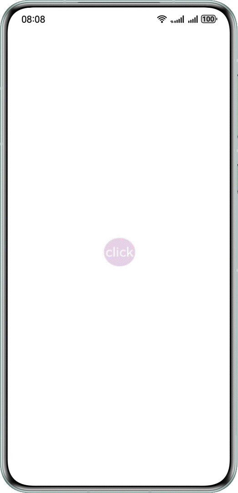
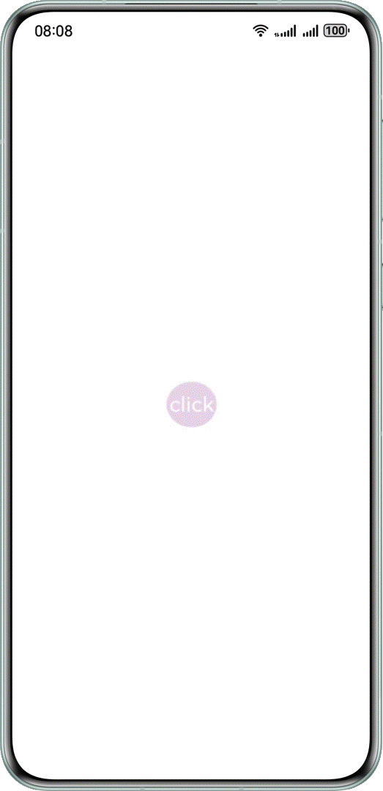
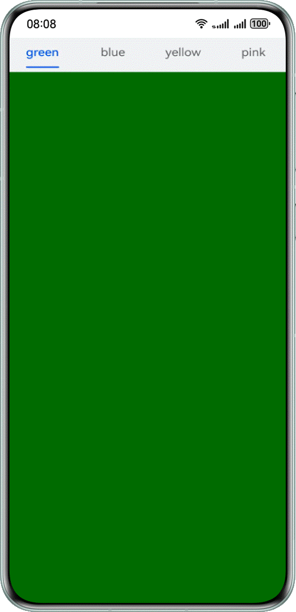
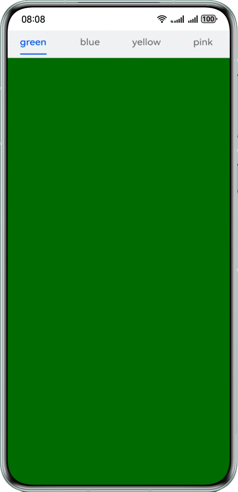
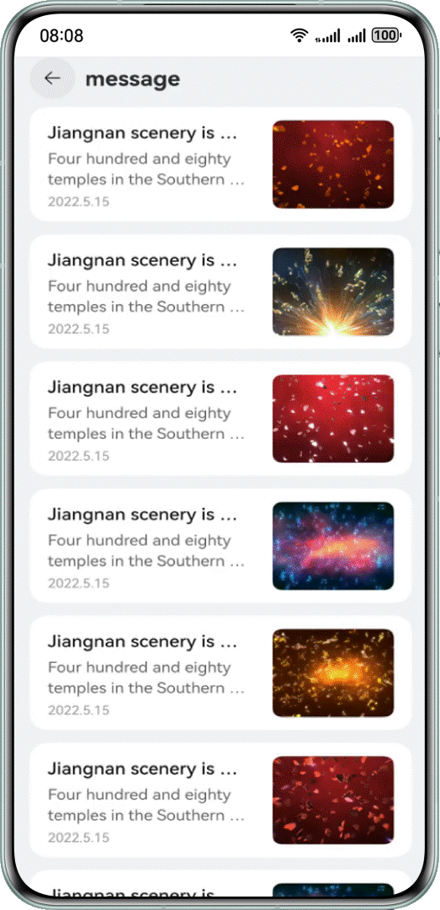
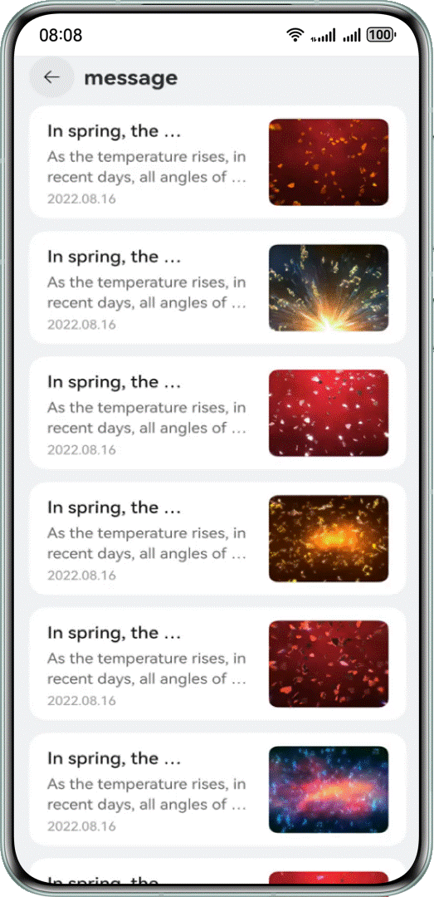

# 应用闪屏解决方案

## 概述

在开发调试过程中，可能会遇到应用出现非预期的闪动，这种现象称为闪屏问题。闪屏问题的触发原因和表现形式各异，但都会影响应用的体验性和流畅度。


本文概述几种常见的闪屏场景，分析其成因，并提供针对性解决方案，帮助开发者有效应对这些问题。


- 动画过程闪屏
- 刷新过程闪屏


## 常见问题


### 动画过程中，应用连续点击场景下的闪屏问题


**问题现象**


连续点击后，图标大小会异常变化，导致闪屏。





```typescript
1. @Entry
2. @Component
3. struct ClickError {
4.  @State scaleValue: number = 0.5; // Pantograph ratio
5.  @State animated: boolean = true; // Control zoom
6.
7.  build() {
8.  Stack() {
9.  Stack() {
10.  Text('click')
11.  .fontSize(45)
12.  .fontColor(Color.White)
13.  }
14.  .borderRadius(50)
15.  .width(100)
16.  .height(100)
17.  .backgroundColor('#e6cfe6')
18.  .scale({ x: this.scaleValue, y: this.scaleValue })
19.  .onClick(() => {
20.  // When the animation is delivered, the count is increased by 1
21.  this.getUIContext().animateTo({
22.  curve: Curve.EaseInOut,
23.  duration: 350,
24.  onFinish: () => {
25.  // At the end of the animation, the count is reduced by 1
26.  // A count of 0 indicates the end of the last animation
27.  // Determine the final zoom size at the end of the animation
28.  const EPSILON: number = 1e-6;
29.  if (Math.abs(this.scaleValue - 0.5) < EPSILON) {
30.  this.scaleValue = 1;
31.  } else {
32.  this.scaleValue = 2;
33.  }
34.  },
35.  }, () => {
36.  this.animated = !this.animated;
37.  this.scaleValue = this.animated ? 0.5 : 2.5;
38.  })
39.  })
40.  }
41.  .height('100%')
42.  .width('100%')
43.  }
44. }

```


[ClickError.ets](https://gitcode.com/harmonyos_samples/BestPracticeSnippets/blob/master/ScreenFlickerSolution/entry/src/main/ets/pages/ClickError.ets#L17-L60)


**可能原因**


在动画结束回调中修改了属性值。图标连续放大和缩小时，动画连续改变属性值，同时结束回调也直接修改属性值，导致过程中属性值异常，效果不符合预期。所有动画结束后，效果通常可恢复正常，但会出现跳变。


**解决措施**


- 如果在动画结束回调中设值，可以通过计数器等方法判断属性上是否还有动画。
- 仅在属性上最后一个动画结束时，结束回调中才设值，避免因动画打断导致异常。
  
  
  

```typescript
1. @Entry
2. @Component
3. struct ClickRight {
4.  @State scaleValue: number = 0.5; // Pantograph ratio
5.  @State animated: boolean = true; // Control zoom
6.  @State cnt: number = 0; // Run counter
7.
8.  build() {
9.  Stack() {
10.  Stack() {
11.  Text('click')
12.  .fontSize(45)
13.  .fontColor(Color.White)
14.  }
15.  .borderRadius(50)
16.  .width(100)
17.  .height(100)
18.  .backgroundColor('#e6cfe6')
19.  .scale({ x: this.scaleValue, y: this.scaleValue })
20.  .onClick(() => {
21.  // When the animation is delivered, the count is increased by 1
22.  this.cnt = this.cnt + 1;
23.  this.getUIContext().animateTo({
24.  curve: Curve.EaseInOut,
25.  duration: 350,
26.  onFinish: () => {
27.  // At the end of the animation, the count is reduced by 1
28.  this.cnt = this.cnt - 1;
29.  // A count of 0 indicates the end of the last animation
30.  if (this.cnt === 0) {
31.  // Determine the final zoom size at the end of the animation
32.  const EPSILON: number = 1e-6;
33.  if (Math.abs(this.scaleValue - 0.5) < EPSILON) {
34.  this.scaleValue = 1;
35.  } else {
36.  this.scaleValue = 2;
37.  }
38.  }
39.  },
40.  }, () => {
41.  this.animated = !this.animated;
42.  this.scaleValue = this.animated ? 0.5 : 2.5;
43.  })
44.  })
45.  }
46.  .height('100%')
47.  .width('100%')
48.  }
49. }

```
  [ClickRight.ets](https://gitcode.com/harmonyos_samples/BestPracticeSnippets/blob/master/ScreenFlickerSolution/entry/src/main/ets/pages/ClickRight.ets#L17-L65)


运行效果如下图。





### 动画过程中，Tabs页签切换场景下的闪屏问题

**问题现象**


滑动Tabs组件时，上方标签不能同步更新。下方内容完全切换后，标签闪动跳转，产生闪屏。





```typescript
1. @Entry
2. @Component
3. struct TabsContainer {
4.  @State currentIndex: number = 0
5.  @State animationDuration: number = 300;
6.  @State indicatorLeftMargin: number = 0;
7.  @State indicatorWidth: number = 0;
8.  private tabsWidth: number = 0;
9.  private textInfos: [number, number][] = [];
10.  private isStartAnimateTo: boolean = false;
11.
12.  @Builder
13.  tabBuilder(index: number, name: string) {
14.  Column() {
15.  Text(name)
16.  .fontSize(16)
17.  .fontColor(this.currentIndex === index ? $r('sys.color.brand') : $r('sys.color.ohos_id_color_text_secondary'))
18.  .fontWeight(this.currentIndex === index ? 500 : 400)
19.  .id(index.toString())
20.  .onAreaChange((_oldValue: Area, newValue: Area) => {
21.  this.textInfos[index] = [newValue.globalPosition.x as number, newValue.width as number];
22.  if (this.currentIndex === index && !this.isStartAnimateTo) {
23.  this.indicatorLeftMargin = this.textInfos[index][0];
24.  this.indicatorWidth = this.textInfos[index][1];
25.  }
26.  })
27.  }
28.  .width('100%')
29.  }
30.
31.  build() {
32.  Stack({ alignContent: Alignment.TopStart }) {
33.  Tabs({ barPosition: BarPosition.Start }) {
34.  TabContent() {
35.  Column()
36.  .width('100%')
37.  .height('100%')
38.  .backgroundColor(Color.Green)
39.  .expandSafeArea([SafeAreaType.SYSTEM], [SafeAreaEdge.TOP, SafeAreaEdge.BOTTOM])
40.  }
41.  .tabBar(this.tabBuilder(0, 'green'))
42.  .expandSafeArea([SafeAreaType.SYSTEM], [SafeAreaEdge.TOP, SafeAreaEdge.BOTTOM])
43.
44.  TabContent() {
45.  Column()
46.  .width('100%')
47.  .height('100%')
48.  .backgroundColor(Color.Blue)
49.  .expandSafeArea([SafeAreaType.SYSTEM], [SafeAreaEdge.TOP, SafeAreaEdge.BOTTOM])
50.  }
51.  .tabBar(this.tabBuilder(1, 'blue'))
52.  .expandSafeArea([SafeAreaType.SYSTEM], [SafeAreaEdge.TOP, SafeAreaEdge.BOTTOM])
53.
54.  TabContent() {
55.  Column()
56.  .width('100%')
57.  .height('100%')
58.  .backgroundColor(Color.Yellow)
59.  .expandSafeArea([SafeAreaType.SYSTEM], [SafeAreaEdge.TOP, SafeAreaEdge.BOTTOM])
60.  }
61.  .tabBar(this.tabBuilder(2, 'yellow'))
62.  .expandSafeArea([SafeAreaType.SYSTEM], [SafeAreaEdge.TOP, SafeAreaEdge.BOTTOM])
63.
64.  TabContent() {
65.  Column()
66.  .width('100%')
67.  .height('100%')
68.  .backgroundColor(Color.Pink)
69.  .expandSafeArea([SafeAreaType.SYSTEM], [SafeAreaEdge.TOP, SafeAreaEdge.BOTTOM])
70.  }
71.  .tabBar(this.tabBuilder(3, 'pink'))
72.  .expandSafeArea([SafeAreaType.SYSTEM], [SafeAreaEdge.TOP, SafeAreaEdge.BOTTOM])
73.  }
74.  .onAreaChange((_oldValue: Area, newValue: Area) => {
75.  this.tabsWidth = newValue.width as number;
76.  })
77.  .barWidth('100%')
78.  .barHeight(56)
79.  .width('100%')
80.  .expandSafeArea([SafeAreaType.SYSTEM], [SafeAreaEdge.TOP, SafeAreaEdge.BOTTOM])
81.  .backgroundColor('#F1F3F5')
82.  .animationDuration(this.animationDuration)
83.  .onChange((index: number) => {
84.  this.currentIndex = index; // Monitor changes in index and switch TAB contents.
85.  })
86.
87.  Column()
88.  .height(2)
89.  .borderRadius(1)
90.  .width(this.indicatorWidth)
91.  .margin({ left: this.indicatorLeftMargin, top: 48 })
92.  .backgroundColor($r('sys.color.brand'))
93.  }
94.  .width('100%')
95.  }
96. }

```


[TabsError.ets](https://gitcode.com/harmonyos_samples/BestPracticeSnippets/blob/master/ScreenFlickerSolution/entry/src/main/ets/pages/TabsError.ets#L17-L112)


**可能原因**


在Tabs左右翻页动画的结束回调中，刷新选中页面的索引值。这导致页面左右转场动画结束时，页签栏中索引对应的页签样式（如字体大小、下划线等）立即改变，从而产生闪屏现象。


**解决措施**


在左右跟手翻页过程中，通过 [TabsAnimationEvent](https://developer.huawei.com/consumer/cn/doc/harmonyos-references/ts-container-tabs#tabsanimationevent11%E5%AF%B9%E8%B1%A1%E8%AF%B4%E6%98%8E) 事件获取手指滑动距离，改变下划线在前后两个子页签间的位置。离手触发翻页动画时，同步触发下划线动画，确保下划线与页面左右转场动画同步。


```typescript
1. build() {
2.  Stack({ alignContent: Alignment.TopStart }) {
3.  Tabs({ barPosition: BarPosition.Start }) {
4.  TabContent() {
5.  Column()
6.  .width('100%')
7.  .height('100%')
8.  .backgroundColor(Color.Green)
9.  .expandSafeArea([SafeAreaType.SYSTEM], [SafeAreaEdge.TOP, SafeAreaEdge.BOTTOM])
10.  }
11.  .tabBar(this.tabBuilder(0, 'green'))
12.  .expandSafeArea([SafeAreaType.SYSTEM], [SafeAreaEdge.TOP, SafeAreaEdge.BOTTOM])
13.
14.  TabContent() {
15.  Column()
16.  .width('100%')
17.  .height('100%')
18.  .backgroundColor(Color.Blue)
19.  .expandSafeArea([SafeAreaType.SYSTEM], [SafeAreaEdge.TOP, SafeAreaEdge.BOTTOM])
20.  }
21.  .tabBar(this.tabBuilder(1, 'blue'))
22.  .expandSafeArea([SafeAreaType.SYSTEM], [SafeAreaEdge.TOP, SafeAreaEdge.BOTTOM])
23.
24.  TabContent() {
25.  Column()
26.  .width('100%')
27.  .height('100%')
28.  .backgroundColor(Color.Yellow)
29.  .expandSafeArea([SafeAreaType.SYSTEM], [SafeAreaEdge.TOP, SafeAreaEdge.BOTTOM])
30.  }
31.  .tabBar(this.tabBuilder(2, 'yellow'))
32.  .expandSafeArea([SafeAreaType.SYSTEM], [SafeAreaEdge.TOP, SafeAreaEdge.BOTTOM])
33.
34.  TabContent() {
35.  Column()
36.  .width('100%')
37.  .height('100%')
38.  .backgroundColor(Color.Pink)
39.  .expandSafeArea([SafeAreaType.SYSTEM], [SafeAreaEdge.TOP, SafeAreaEdge.BOTTOM])
40.  }
41.  .tabBar(this.tabBuilder(3, 'pink'))
42.  .expandSafeArea([SafeAreaType.SYSTEM], [SafeAreaEdge.TOP, SafeAreaEdge.BOTTOM])
43.  }
44.  .onAreaChange((_oldValue: Area, newValue: Area) => {
45.  this.tabsWidth = newValue.width as number;
46.  })
47.  .barWidth('100%')
48.  .barHeight(56)
49.  .width('100%')
50.  .expandSafeArea([SafeAreaType.SYSTEM], [SafeAreaEdge.TOP, SafeAreaEdge.BOTTOM])
51.  .backgroundColor('#F1F3F5')
52.  .animationDuration(this.animationDuration)
53.  .onChange((index: number) => {
54.  this.currentIndex = index; // Monitor changes in index and switch TAB contents.
55.  })
56.  .onAnimationStart((_index: number, targetIndex: number) => {
57.  // The callback is triggered when the switch animation begins. The underline slides along with the page, and the width changes gradually.
58.  this.currentIndex = targetIndex;
59.  this.startAnimateTo(this.animationDuration, this.textInfos[targetIndex][0], this.textInfos[targetIndex][1]);
60.  })
61.  .onAnimationEnd((index: number, event: TabsAnimationEvent) => {
62.  let currentIndicatorInfo: Record<string, number> = this.getCurrentIndicatorInfo(index, event);
63.  this.startAnimateTo(0, currentIndicatorInfo.left, currentIndicatorInfo.width);
64.  })
65.  .onGestureSwipe((index: number, event: TabsAnimationEvent) => {
66.  let currentIndicatorInfo: Record<string, number> = this.getCurrentIndicatorInfo(index, event);
67.  this.currentIndex = currentIndicatorInfo.index;
68.  this.indicatorLeftMargin = currentIndicatorInfo.left;
69.  this.indicatorWidth = currentIndicatorInfo.width;
70.  })
71.
72.  Column()
73.  .height(2)
74.  .borderRadius(1)
75.  .width(this.indicatorWidth)
76.  .margin({ left: this.indicatorLeftMargin, top: 48 })
77.  .backgroundColor($r('sys.color.brand'))
78.  }
79.  .width('100%')
80. }

```


[TabsRight.ets](https://gitcode.com/harmonyos_samples/BestPracticeSnippets/blob/master/ScreenFlickerSolution/entry/src/main/ets/pages/TabsRight.ets#L47-L126)


TabsAnimationEvent方法如下所示。


```typescript
1. private getCurrentIndicatorInfo(index: number, event: TabsAnimationEvent): Record<string, number> {
2.  let nextIndex = index;
3.  if (index > 0 && event.currentOffset > 0) {
4.  nextIndex--;
5.  } else if (index < 3 && event.currentOffset < 0) {
6.  nextIndex++;
7.  }
8.
9.  let indexInfo: [number, number] = this.textInfos[index];
10.  let nextIndexInfo: [number, number] = this.textInfos[nextIndex];
11.  let swipeRatio: number = Math.abs(event.currentOffset / this.tabsWidth);
12.  let currentIndex: number = swipeRatio > 0.5 ? nextIndex :
13.  index; // The page slides more than halfway and the tabBar switches to the next page.
14.  let currentLeft: number = indexInfo[0] + (nextIndexInfo[0] - indexInfo[0]) * swipeRatio;
15.  let currentWidth: number = indexInfo[1] + (nextIndexInfo[1] - indexInfo[1]) * swipeRatio;
16.  return { 'index': currentIndex, 'left': currentLeft, 'width': currentWidth };
17. }
18.
19. private startAnimateTo(duration: number, leftMargin: number, width: number) {
20.  this.isStartAnimateTo = true;
21.  this.getUIContext().animateTo({
22.  duration: duration, // duration
23.  curve: Curve.Linear, // curve
24.  iterations: 1, // iterations
25.  playMode: PlayMode.Normal, // playMode
26.  onFinish: () => {
27.  this.isStartAnimateTo = false;
28.  }
29.  }, () => {
30.  this.indicatorLeftMargin = leftMargin;
31.  this.indicatorWidth = width;
32.  });
33. }

```


[TabsRight.ets](https://gitcode.com/harmonyos_samples/BestPracticeSnippets/blob/master/ScreenFlickerSolution/entry/src/main/ets/pages/TabsRight.ets#L130-L162)


运行效果如下图。





### 刷新过程中，ForEach键值生成函数未设置导致的闪屏问题

**问题现象**


下拉刷新时，应用卡顿，出现闪屏。





```typescript
1. @Builder
2. private getListView() {
3.  List({
4.  space: 12,
5.  scroller: this.scroller
6.  }) {
7.  // Render data using lazy loading components
8.  ForEach(this.newsData, (item: NewsData) => {
9.  ListItem() {
10.  newsItem({
11.  newsTitle: item.newsTitle,
12.  newsContent: item.newsContent,
13.  newsTime: item.newsTime,
14.  img: item.img
15.  })
16.  }
17.  .backgroundColor(Color.White)
18.  .borderRadius(16)
19.  });
20.  }
21.  .width('100%')
22.  .height('100%')
23.  .padding({
24.  left: 16,
25.  right: 16
26.  })
27.  .backgroundColor('#F1F3F5')
28.  // You must set the list to slide to edge to have no effect, otherwise the pullToRefresh component's slide up and drop down method cannot be triggered.
29.  .edgeEffect(EdgeEffect.None)
30. }

```


[PullToRefreshError.ets](https://gitcode.com/harmonyos_samples/BestPracticeSnippets/blob/master/ScreenFlickerSolution/entry/src/main/ets/pages/PullToRefreshError.ets#L215-L244)


**可能原因**


ForEach提供了一个名为keyGenerator的参数，这是一个函数，开发者可以通过它自定义键值生成规则。如果开发者没有定义keyGenerator函数，则ArkUI框架会使用默认的键值生成函数，即(item: Object, index: number) => { return index + '__' + JSON.stringify(item); }。可参考[键值生成规则](https://developer.huawei.com/consumer/cn/doc/harmonyos-guides/arkts-rendering-control-foreach#%E9%94%AE%E5%80%BC%E7%94%9F%E6%88%90%E8%A7%84%E5%88%99)。


在使用ForEach的过程中，若对键值生成规则理解不足，将导致错误的使用方式。错误使用会导致功能问题，如渲染结果非预期，或性能问题，如渲染性能下降。


**解决措施**


在ForEach第三个参数中定义自定义键值的生成规则，即(item: NewsData, index?: number) => item.id，这样可以在渲染时降低重复组件的渲染开销，从而消除闪屏问题。可参考[ForEach组件使用建议](https://developer.huawei.com/consumer/cn/doc/harmonyos-guides/arkts-rendering-control-foreach#%E4%BD%BF%E7%94%A8%E5%BB%BA%E8%AE%AE)。


```typescript
1. @Builder
2. private getListView() {
3.  List({
4.  space: 12,
5.  scroller: this.scroller
6.  }) {
7.  // Render data using lazy loading components
8.  ForEach(this.newsData, (item: NewsData) => {
9.  ListItem() {
10.  newsItem({
11.  newsTitle: item.newsTitle,
12.  newsContent: item.newsContent,
13.  newsTime: item.newsTime,
14.  img: item.img
15.  })
16.  }
17.  .backgroundColor(Color.White)
18.  .borderRadius(16)
19.  }, (item: NewsData) => item.newsId);
20.  }
21.  .width('100%')
22.  .height('100%')
23.  .padding({
24.  left: 16,
25.  right: 16
26.  })
27.  .backgroundColor('#F1F3F5')
28.  // You must set the list to slide to edge to have no effect, otherwise the pullToRefresh component's slide up and drop down method cannot be triggered.
29.  .edgeEffect(EdgeEffect.None)
30. }

```


[PullToRefreshRight.ets](https://gitcode.com/harmonyos_samples/BestPracticeSnippets/blob/master/ScreenFlickerSolution/entry/src/main/ets/pages/PullToRefreshRight.ets#L215-L244)


运行效果如下图所示。





## 总结

当出现应用闪屏问题时，首先确定可能的原因，分别测试每个原因。找到问题后，尝试使用相应的解决方案，以消除问题现象。


- 在应用连续点击场景下，通过计数器优化动画逻辑。
- 在Tabs页签切换场景下，完善动画细粒度，提高流畅表现。
- 在ForEach刷新内容过程中，根据业务场景调整键值生成函数。


## 示例代码

- [解决应用动效闪屏的方案](https://gitcode.com/harmonyos_samples/BestPracticeSnippets/tree/master/ScreenFlickerSolution)
