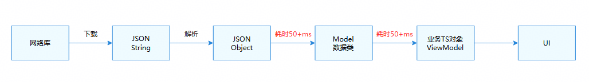
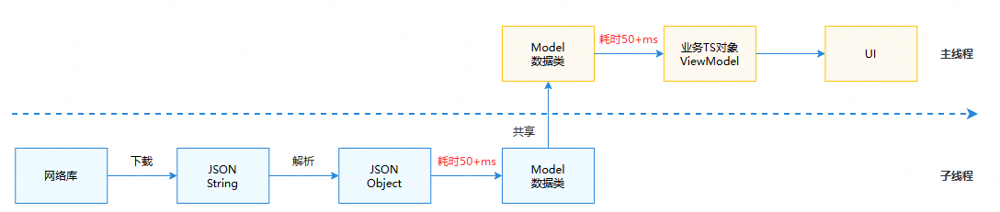
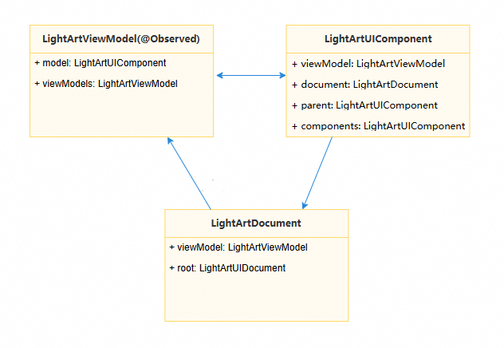
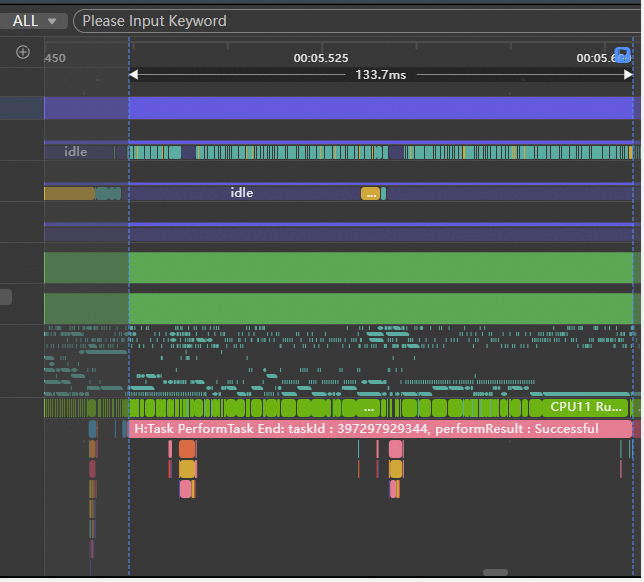
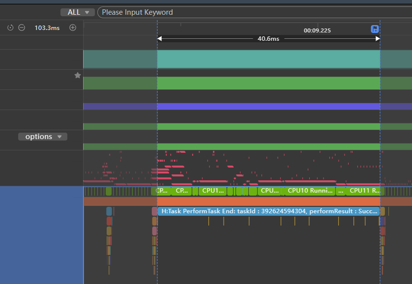
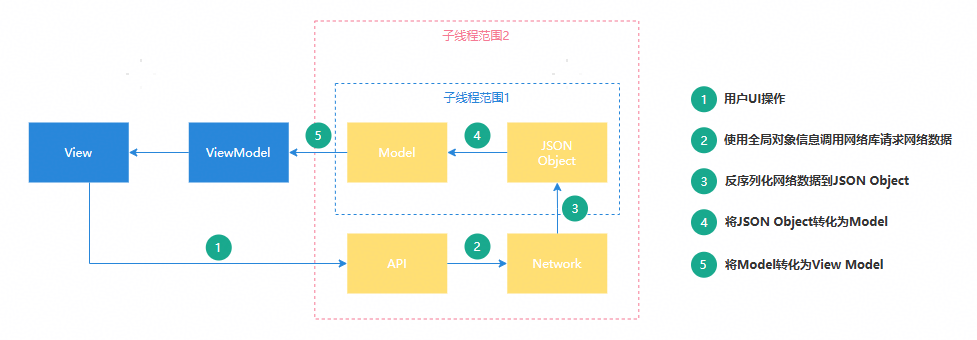

# 并行化性能优化

## 概述


目前，多数应用存在性能优化的诉求，而并行化改造是一项有效的性能优化措施。并行化改造通过合理设计和重构，使原本在主线程中串行执行的任务能够并行执行，从而提升应用性能和处理效率。多个头部应用均已进行针对性的并行化改造，显著提升了性能。


目前并行化改造的主要实现方案有两种：一是使用[TaskPool](https://developer.huawei.com/consumer/cn/doc/harmonyos-references/js-apis-taskpool)或[Worker](https://developer.huawei.com/consumer/cn/doc/harmonyos-references/js-apis-worker)创建子线程，将耗时逻辑迁移至子线程执行；二是使用[Sendable](https://developer.huawei.com/consumer/cn/doc/harmonyos-guides/arkts-sendable)加速数据传递，避免跨线程间的数据拷贝耗时。


本文将通过实际场景介绍并行化改造的过程和思路，为开发者提供性能优化方法。


说明

相关使用说明与注意事项：


1. [TaskPool注意事项](https://developer.huawei.com/consumer/cn/doc/harmonyos-guides/taskpool-introduction#taskpool%E6%B3%A8%E6%84%8F%E4%BA%8B%E9%A1%B9)
2. [Worker简介](https://developer.huawei.com/consumer/cn/doc/harmonyos-guides/worker-introduction)
3. [并发支持的可序列化数据类型](https://developer.huawei.com/consumer/cn/doc/harmonyos-guides/serializable-overview)
4. [Sendable使用约束和限制](https://developer.huawei.com/consumer/cn/doc/harmonyos-guides/sendable-constraints#sendable%E7%B1%BB%E5%BF%85%E9%A1%BB%E7%BB%A7%E6%89%BF%E8%87%AAsendable%E7%B1%BB)
5. [Sendable支持的数据类型](https://developer.huawei.com/consumer/cn/doc/harmonyos-guides/arkts-sendable#sendable%E6%94%AF%E6%8C%81%E7%9A%84%E6%95%B0%E6%8D%AE%E7%B1%BB%E5%9E%8B)


## 数据解析与传递并行化


### 场景描述

某应用首页的业务逻辑如下图所示：首先从网络端获取数据，解析数据，生成数据类，随后与业务对象结合以渲染页面。上述业务逻辑均在主线程执行（耗时100ms+），由于主线程阻塞时间较长，导致出现丢帧现象。





### 实现原理

**逻辑迁移到子线程的改造**：上述业务逻辑中，网络库下载JSON字符串、解析及生成Model数据类这三个阶段均涉及数据操作，且无需在主线程中执行，因此可将上述业务逻辑迁移到子线程中。优化后整体流程如下图所示：





**数据进行线程间共享改造**：业务逻辑迁移到子线程后，为避免跨线程通信导致的数据拷贝消耗，可基于Sendable思想，将通信数据改造成多线程间共享对象。由于UI逻辑无法在子线程中执行，实际操作中需将数据结构解耦，分离数据与UI。将数据抽取为Sendable类，剥离UI相关部分，从而在子线程中完成数据的请求、解析和生成。


### 开发步骤


如下图所示，在原实际场景中，业务逻辑存在三个主要类结构，并且相互持有。组件LightArtUIComponent可获取上下文说明document，并调用其中的方法。LightArtViewModel使用了装饰器@Observed，该UI装饰器无法在子线程中执行，导致并行化难以实现。


应用业务逻辑为：首先生成LightArtDocument对象。该对象作为组件树的上下文，包含树结构和方法等信息。接着，通过LightArtDocument记录的节点和方法，递归生成树，即对LightArtUIComponent填充数据，形成数据模型。最后递归生成LightArtViewModel。因此，数据结构中存在互相持有及数据与UI耦合的情况。





针对上述三大主要结构的整改，主要是将数据生成部分迁移至子线程，在子线程中完成数据下载与解析，并封装成Sendable数据，返回主线程后将数据组装到UI中进行渲染。


如下是相关修改的伪代码：


```typescript
1. // LightArt.ets
2. import { lang } from '@kit.ArkTS';
3.
4. /*
5.  * The data to be shared is encapsulated into four Sendable classes: LightArtDataModel,
6.  * LightArtDataDocument, LightArtViewModel, and LightArtDataComponent.
7.  * UI data is encapsulated into the UI class.
8.  * The data of the Sendable class is generated in a child thread.
9.  */
10. @Sendable
11. class LightArtDataModel {}
12.
13. @Sendable
14. class LightArtDataDocument {}
15.
16. @Sendable
17. class LightArtViewModel {}
18.
19. class UI {}
20.
21. interface ISerializableType<T> extends lang.ISendable {}
22.
23. @Sendable
24. class LightArtDataComponent {
25.  public dataModel?: LightArtDataModel;
26.  public document?: LightArtDataDocument;
27.  public parent?: LightArtDataComponent;
28.  public components?: LightArtDataComponent;
29.  // ...
30.  public fromJson(jsonObj: object) {
31.  // ...
32.  }
33.
34.  public mergeFrom(jsonObj: object) {
35.  // ...
36.  }
37. }
38.
39. /*
40.  * Assemble the Sendable class and the UI data class into LightArtUIComponent.
41.  * LightArtUIComponent assembles the data based on the data returned by the child thread.
42.  */
43. class LightArtUIComponent {
44.  public data?: LightArtDataComponent;
45.  public model?: LightArtViewModel;
46.  public parent?: LightArtUIComponent;
47.  public components?: LightArtUIComponent;
48.  // ...
49.  public uiData?: UI;
50. }
51.
52. // Fill in the data to LightArtDataComponent.
53. @Sendable
54. export class LightArtDataComponentType implements ISerializableType<LightArtDataComponent> {
55.  public fromJson(jsonObj: object): LightArtDataComponent {
56.  let ans = new LightArtDataComponent();
57.  ans.mergeFrom(jsonObj);
58.  return ans;
59.  }
60.  public static instance: LightArtDataComponentType = new LightArtDataComponentType();
61. }

```


[LightArt.ets](https://gitcode.com/HarmonyOS_Samples/BestPracticeSnippets/blob/master/TaskPoolPractice/entry/src/main/ets/pages/sample7/LightArt.ets#L16-L80)


### 实现效果


优化前，数据下载至解析生成Model数据类的耗时有130ms+。





优化后，数据下载至解析生成Model数据类的操作已全部移至子线程执行，主线程耗时下降至40ms，共优化90ms+。





说明

1. Sendable对象及其成员必须均为Sendable类型。


2. 若类中包含非Sendable属性，可将该类拆分，将支持Sendable的属性组合成一个Sendable类，挂载于该类上，再进行序列化传递。


## 数据网络请求并行化


### 场景描述

当应用频繁使用网络库进行网络请求，并希望在全局范围内使用同一网络请求时，可对该网络请求进行并行化改造。将网络相关操作置于子线程中，能有效避免在主线程中调用耗时网络请求导致的卡顿。


### 实现原理

首先，对于端侧应用而言，主线程的非UI操作耗时大多与网络数据驱动相关，流程如下图所示，因此并行化改造主要集中在网络数据的请求和处理上。在改造前，需对图中各步骤的时间开销进行合理评估，依据改造的投入产出比，确定改造范围。


1. 在子线程范围1进行改造：如果Network下发的数据为JSON格式，且网络库能够将数据以ArrayBuffer形式返回，则可以在此范围内进行改造。改造时，可使用[ASON.parse](https://developer.huawei.com/consumer/cn/doc/harmonyos-references/arkts-apis-arkts-utils-ason#parse)将Network下发的字符串反序列化成可共享的JSON对象。还需对部分Model对象进行Sendable处理，使其能够在子线程中完成JSON对象到Model对象的转换。

2. 在子线程范围2进行改造：在此改造范围内，网络请求需在子线程发起，因此网络请求所需的全局对象数据必须在子线程中可访问，这部分数据需进行相应的Sendable改造。     


其次，在改造过程中，应先尝试并行化改造，再考虑Sendable改造。仅在需要跨线程传递方法或传递较大对象时，才需进行Sendable改造。


最后，此处的并行化和Sendable改造均是基于ArkTS改造，因此并不适用于一些特别底层的场景，比如小程序框架。


注意

TS/JS（ArkTS默认继承了这种行为）多线程之间默认内存隔离，在多线程之间传递信息时，非sendable的普通对象存在以下限制：


1. 不同线程之间只能传递数据，函数无法在多线程间传递。
2. 包含Function成员变量的类型也不能在多线程间传递（将Function作为成员变量的对象在跨线程传递时会直接失败）。
3. JS的private properties也不能跨线程传递（以#开头的成员变量）。


### 开发步骤


本案例主要描述子线程范围2中使用全局对象信息调用网络库请求网络数据的场景。以[Axios](https://ohpm.openharmony.cn/#/cn/detail/@ohos%2Faxios)(基于Promise的网络请求库，需要安装后使用)为例，进行相关并行化改造。


1. 抽取网络库相关配置并封装为一个Sendable类。
  
  
  

```typescript
1. // AxiosConfig.ets
2. import { collections, lang } from '@kit.ArkTS';
3. import { AxiosResponse, InternalAxiosRequestConfig } from '@ohos/axios';
4.
5. // Transforming the Request Interceptor into a Sendable interface
6. export interface IRequestInterceptor extends lang.ISendable {
7.  handle(data: InternalAxiosRequestConfig<object>): InternalAxiosRequestConfig<object> |
8.  Promise<InternalAxiosRequestConfig<object>>;
9.  handleError(error: object): object;
10. }
11.
12. // Transforming the Response Interceptor into a Sendable interface
13. export interface IResponseInterceptor extends lang.ISendable {
14.  handle(data: AxiosResponse<object, object>): AxiosResponse<object, object> |
15.  Promise<AxiosResponse<object, object>>;
16.  handleError(error: object): object;
17. }
18.
19. // Transforming the Auth into a Sendable interface
20. export interface IAuth extends lang.ISendable {
21.  username: string;
22.  password: string;
23. }
24.
25. // Transforming the HttpProxy into a Sendable interface
26. export interface IHttpProxy extends lang.ISendable {
27.  protocol: string;
28.  host: string;
29.  port: number;
30.  auth: IAuth;
31.  exclusionList: collections.Array<string>;
32. }
33.
34. // Encapsulate Axios configuration, which needs to be initialized on the main thread
35. @Sendable
36. export class AxiosGlobalConfig {
37.  private constructor() {
38.  this.requestInterceptors = new collections.Array<IRequestInterceptor>();
39.  this.responseInterceptors = new collections.Array<IResponseInterceptor>();
40.  this.headers = new collections.Map<string, string>();
41.  }
42.
43.  public baseURL?: string;
44.  public headers: collections.Map<string, string>;
45.  public timeout?: number;
46.  public proxy?: IHttpProxy;
47.  public xsrfCookieName?: string;
48.  public xsrfHeaderName?: string;
49.  public maxContentLength?: number;
50.  public maxBodyLength?: number;
51.  // ...
52.
53.  public requestInterceptors: collections.Array<IRequestInterceptor>;
54.  public responseInterceptors: collections.Array<IResponseInterceptor>;
55.  public static instance: AxiosGlobalConfig = new AxiosGlobalConfig();
56. }

```
  [AxiosConfig.ets](https://gitcode.com/HarmonyOS_Samples/BestPracticeSnippets/blob/master/TaskPoolPractice/entry/src/main/ets/pages/sample7/AxiosConfig.ets#L16-L72)

2. 结合配置类生成Axios对象。
  
  
  

```typescript
1. // AxiosAdapter.ets
2. import axios, { Axios, AxiosInstance, AxiosProxyConfig, AxiosResponse, InternalAxiosRequestConfig } from '@ohos/axios';
3. import { AxiosGlobalConfig } from './AxiosConfig';
4.
5. // Initialize axios object according to configuration and return the object.
6. export function getAxios(): Axios {
7.  let instance: AxiosInstance = axios.create();
8.  if (AxiosGlobalConfig.instance.baseURL) {
9.  instance.defaults.url = AxiosGlobalConfig.instance.baseURL;
10.  }
11.  for (let entry of AxiosGlobalConfig.instance.headers.entries()) {
12.  instance.defaults.headers[entry[0]] = entry[1];
13.  }
14.  if (AxiosGlobalConfig.instance.timeout) {
15.  instance.defaults.timeout = AxiosGlobalConfig.instance.timeout;
16.  }
17.  if (AxiosGlobalConfig.instance.proxy) {
18.  let config: AxiosProxyConfig = {
19.  host: AxiosGlobalConfig.instance.proxy.host,
20.  port: AxiosGlobalConfig.instance.proxy.port,
21.  exclusionList: []
22.  };
23.  instance.defaults.proxy = config;
24.  }
25.  for (let interceptor of AxiosGlobalConfig.instance.requestInterceptors.values()) {
26.  axios.interceptors.request.use((config: InternalAxiosRequestConfig<object>): InternalAxiosRequestConfig<object> |
27.  Promise<InternalAxiosRequestConfig<object>> => interceptor.handle(config),
28.  (error: object) => interceptor.handleError(error));
29.  }
30.  for (let interceptor of AxiosGlobalConfig.instance.responseInterceptors.values()) {
31.  axios.interceptors.response.use((response: AxiosResponse<object, object>): AxiosResponse<object, object> |
32.  Promise<AxiosResponse<object, object>> => interceptor.handle(response),
33.  (error: object) => interceptor.handleError(error));
34.  }
35.  return axios;
36. }

```
  [AxiosAdapter.ets](https://gitcode.com/HarmonyOS_Samples/BestPracticeSnippets/blob/master/TaskPoolPractice/entry/src/main/ets/pages/sample7/AxiosAdapter.ets#L16-L51)

3. 对相关类进行Sendable改造。
  
  
  

```typescript
1. // Interceptor.ets
2. import { AxiosResponse, InternalAxiosRequestConfig } from '@ohos/axios';
3. import { IRequestInterceptor, IResponseInterceptor } from './AxiosConfig';
4.
5. // Request interceptor encapsulated as sendable
6. @Sendable
7. export class RequestInterceptor implements IRequestInterceptor {
8.  handle(data: InternalAxiosRequestConfig<object>): InternalAxiosRequestConfig<object> |
9.  Promise<InternalAxiosRequestConfig<object>> {
10.  return data;
11.  }
12.  handleError(error: object): object {
13.  return error;
14.  }
15. }
16.
17. // Response interceptor encapsulated as sendable
18. @Sendable
19. export class ResponseInterceptor implements IResponseInterceptor {
20.  handle(data: AxiosResponse<object, object>): AxiosResponse<object, object> |
21.  Promise<AxiosResponse<object, object>> {
22.  return data;
23.  }
24.  handleError(error: object): object {
25.  return error;
26.  }
27. }

```
  [Interceptor.ets](https://gitcode.com/HarmonyOS_Samples/BestPracticeSnippets/blob/master/TaskPoolPractice/entry/src/main/ets/pages/sample7/Interceptor.ets#L16-L42)

4. 在子线程中执行相关逻辑。     结合TaskPool，使Axios在主线程初始化，并在子线程中执行相关逻辑。


  
  
  

```typescript
1. // Sample7.ets
2. import { taskpool } from '@kit.ArkTS';
3. import { AxiosError, AxiosResponse } from '@ohos/axios';
4. import { getAxios } from './AxiosAdapter';
5. import { AxiosGlobalConfig, IRequestInterceptor, IResponseInterceptor } from './AxiosConfig';
6. import { RequestInterceptor, ResponseInterceptor } from './Interceptor';
7.
8. function initAxios(url: string): void {
9.  // init axios config
10.  AxiosGlobalConfig.instance.baseURL = url;
11.  let requestInterceptors: IRequestInterceptor = new RequestInterceptor();
12.  let responseInterceptors: IResponseInterceptor = new ResponseInterceptor();
13.  AxiosGlobalConfig.instance.requestInterceptors.push(requestInterceptors);
14.  AxiosGlobalConfig.instance.responseInterceptors.push(responseInterceptors);
15.  AxiosGlobalConfig.instance.timeout = 1000;
16. }
17.
18. @Concurrent
19. function testAxios(config: AxiosGlobalConfig) {
20.  // taskpool function
21.  AxiosGlobalConfig.instance = config;
22.  let adapter = getAxios();
23.  adapter.get(AxiosGlobalConfig.instance.baseURL).then((res: AxiosResponse) => {
24.  console.log('testAxios: ' + JSON.stringify(res.data));
25.  }).catch((error: AxiosError) => {
26.  console.error('error: ' + error.message);
27.  });
28. }
29.
30. function demo() {
31.  let url = ''; // internet url
32.  initAxios(url);
33.  for (let i = 0; i < 5; i++) {
34.  // TaskPool thread use Axios
35.  let task: taskpool.Task = new taskpool.Task(testAxios, AxiosGlobalConfig.instance);
36.  taskpool.execute(task);
37.  }
38. }
39.
40. @Entry
41. @Component
42. struct Sample7 {
43.  @State message: string = 'Hello World';
44.
45.  build() {
46.  Row() {
47.  Column({ space: 12 }) {
48.  Button('test')
49.  .height(40)
50.  .width('100%')
51.  .onClick(() => {
52.  demo();
53.  })
54.  }
55.  .height('100%')
56.  .width('100%')
57.  .padding(16)
58.  .justifyContent(FlexAlign.Center)
59.  }
60.  .height('100%')
61.  }
62. }


```
  [Sample7.ets](https://gitcode.com/HarmonyOS_Samples/BestPracticeSnippets/blob/master/TaskPoolPractice/entry/src/main/ets/pages/sample7/Sample7.ets#L16-L77)
