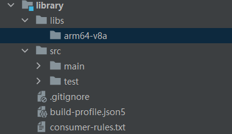

# HSP/HAR包中如何引用外部编译的so库文件

1. libxxx.so库文件放入HAR或HSP的libs/arm64-v8a目录。设备类型不同时，需添加对应子目录。新版的arm64为libs/arm64-v8a，老版的arm64为libs/armeabi-v7a，x86模拟器为libs/x86_64。     

2. 在src/main/cpp/CMakeLists.txt文件中链接so库文件。例如：target_link_libraries(entry PUBLIC libxxx)
