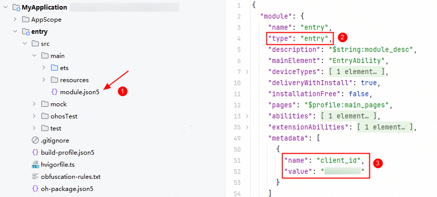
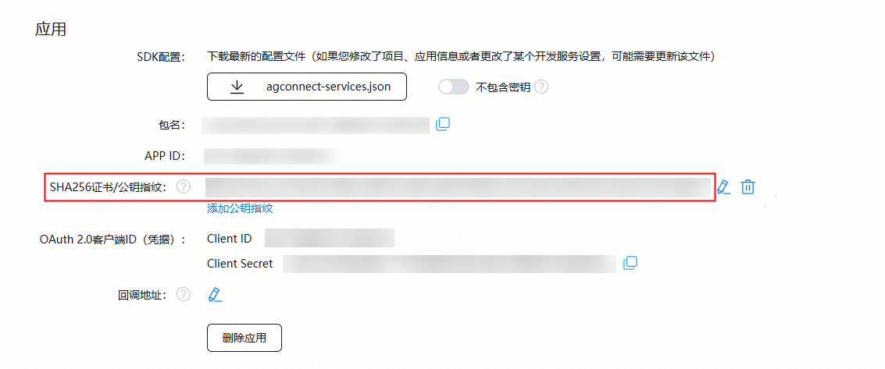

# 1001500001 应用指纹证书校验失败的可能原因和解决办法

**问题现象**

调用接口报错1001500001 应用指纹证书校验失败。

**可能原因**

1. client_id配置错误（例如：错配成项目的Client ID）。

2. 应用的指纹证书未配置或配置错误。

3. 更换证书后未重新配置证书指纹。

4. 指纹证书添加完成后，公钥指纹仍未生效。

5. 安装调试证书签名包后再安装相同版本的发布证书签名包，或安装发布证书签名包后再安装相同版本的调试证书签名包。

6. 使用自动签名方式签名，未使用手动签名。

**解决措施**

1. 检查module type为entry的模块下的module.json5配置文件中的Client ID是否正确，请参考[配置Client ID](https://developer.huawei.com/consumer/cn/doc/harmonyos-guides/account-client-id)。

     

2. 检查AppGallery Connect上是否正确配置应用的指纹证书，详情请见[添加公钥指纹](https://developer.huawei.com/consumer/cn/doc/app/agc-help-cert-fingerprint-0000002278002933#section7398154810570)。

     

3. 证书更换后，重新配置更换后的证书指纹。

4. 配置公钥指纹10分钟后，您可通过修改应用工程 > app.json5中的versionCode触发公钥指纹生效。具体修改方法见下图所示。

5. 调试证书切换为发布证书或发布证书切换为调试证书，需要升级应用的版本号（修改应用工程 > app.json5中的versionCode），具体修改方法见下图所示。

     **图1** 修改前

     

     **图2** 修改后

     

6. 请使用手动签名方式进行签名，详情请参考[配置签名和指纹](https://developer.huawei.com/consumer/cn/doc/harmonyos-guides/account-sign-fingerprints)章节。
