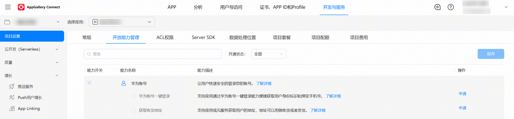
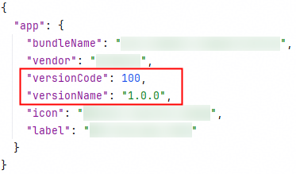
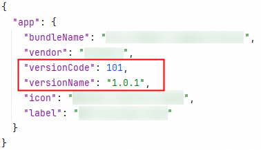

# 1001502014 应用未申请scopes或permissions权限的可能原因和解决方法

**问题现象**

调用接口报错1001502014 应用未申请scopes或permissions权限。

**可能原因**

1. 没有申请对应的账号权限。

2. 权限申请成功后，最迟会在25小时后生效。

3. 使用[获取风险等级](https://developer.huawei.com/consumer/cn/doc/harmonyos-guides/account-get-risklevel-introduction)能力，但未申请获取风险等级权限。

**解决措施**

1. 申请对应权限，请见[申请账号权限](https://developer.huawei.com/consumer/cn/doc/harmonyos-guides/account-config-permissions)章节。

     

2. 权限申请通过后，您可通过修改应用工程 > app.json5中的versionCode触发权限生效。

     **图1** 修改前

     

     **图2** 修改后

     

3. 确认是否需要使用获取风险等级能力，如需使用，请参考[获取风险等级](https://developer.huawei.com/consumer/cn/doc/harmonyos-guides/account-get-risklevel-introduction)申请对应权限。
