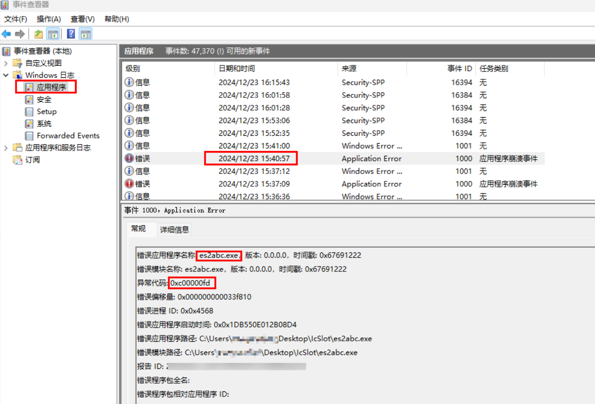
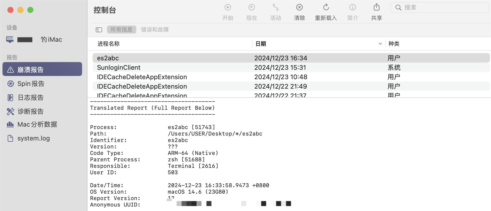
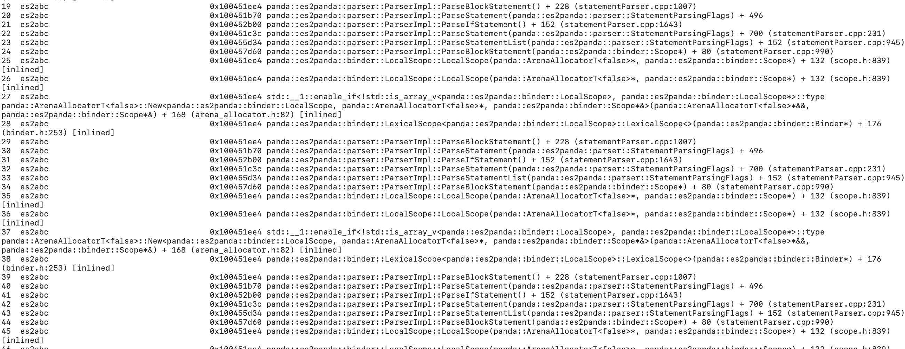

# 编译异常，无具体错误日志，难以定位问题

**问题现象**


出现Failed to execute es2abc错误，但未提供具体的错误日志，导致问题难以定位和分析。


**问题场景**


在源码中使用了大量深度嵌套的代码，例如几百层的if-else、类型转换和括号嵌套，这在编译时会导致递归调用超出栈容量上限，从而引发es2abc闪退，并且没有生成相关错误日志。


**定位方案**


在Windows上，可以打开事件管理器，找到Windows日志中的应用程序日志，查看对应的时间。如果找到es2abc.exe的崩溃日志，并且异常代码为0xc00000fd，表示该程序因栈溢出而崩溃。





在mac上，可以进入控制台，点击崩溃报告，找到es2abc,双击查看崩溃日志。





如果出现下图中所示，调用栈出现大量反复的调用相同的函数，那么极有可能是出现了大量递归导致栈溢出。





**解决措施**


排查代码中是否存在大量重复嵌套的场景，例如几百层的 if-else 语句、类型转换或括号嵌套，并对其进行拆分或优化。


问题代码示例：


以下问题场景包括但不限于：


```typescript
1. if (condition) {
2.  if (condition) {
3.  if (condition) {
4.  if (condition) {
5.  if (condition) {
6.  if (condition) {
7.  ...
8.  }
9.  }
10.  }
11.  }
12.  }
13.  }
14. [
15.  [
16.  [
17.  [
18.  [
19.  [
20.  [
21.  [
22.  ...
23.  ]
24.  ]
25.  ]
26.  ]
27.  ]
28.  ]
29.  ]
30.  ]
31.

```


```plaintext
1. !!!!!!!!!!
2. !!!!!!!!!!
3. ...
4. !!!!!a

```


```typescript
1. var a = 1
2. a as Int as Int as Int as Int as Int ...

```
