# 常见导航样式案例

---

## 概述

不同的页签导航在基本功能上，会因产品形态的不同衍生出不同样式的UI效果。本文为满足开发者对于不同导航样式的需求，介绍了多种导航的实现。


本文基于常见应用的页签导航效果，给出对应的实现方案。不同页签导航效果如下图所示。


**图1** 底部导航效果示意图  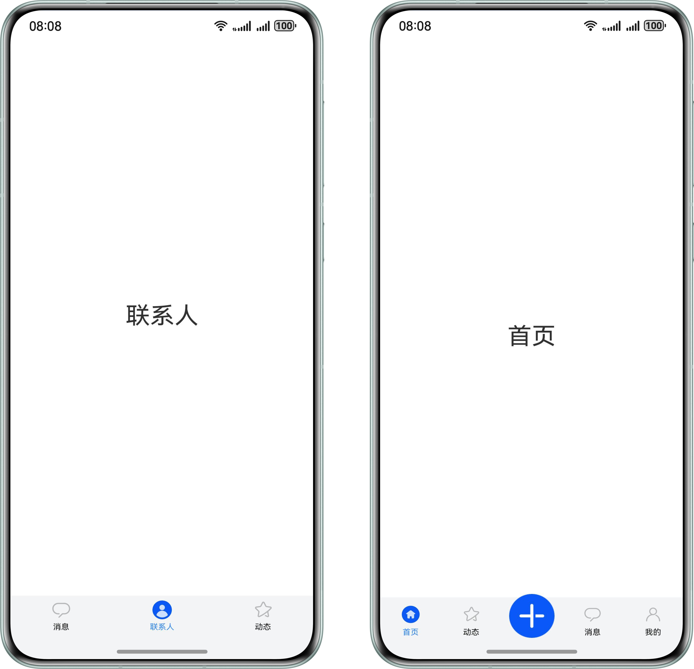


**图2** 顶部导航效果示意图  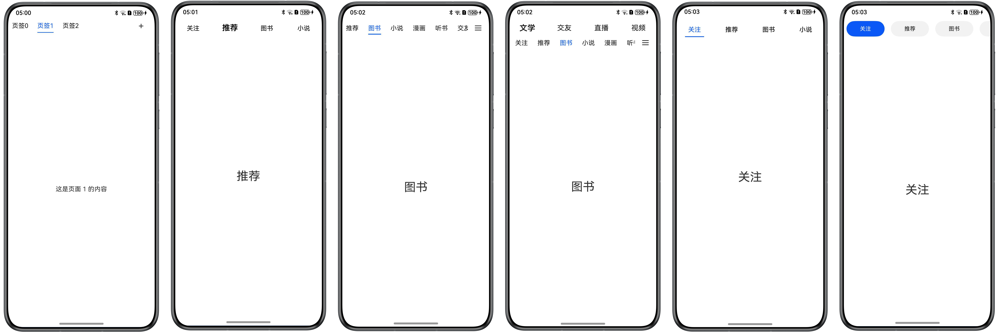


**图3** 侧边导航效果示意图  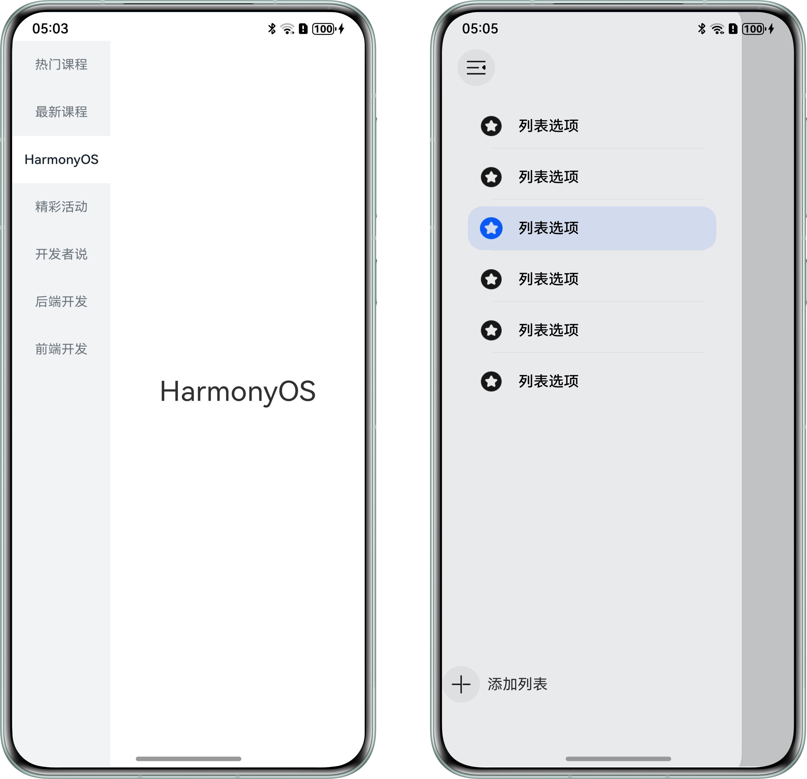


## 底部导航


### 基础底部导航

基础底部导航属于常规导航，一般以图标加文字的形式展示。


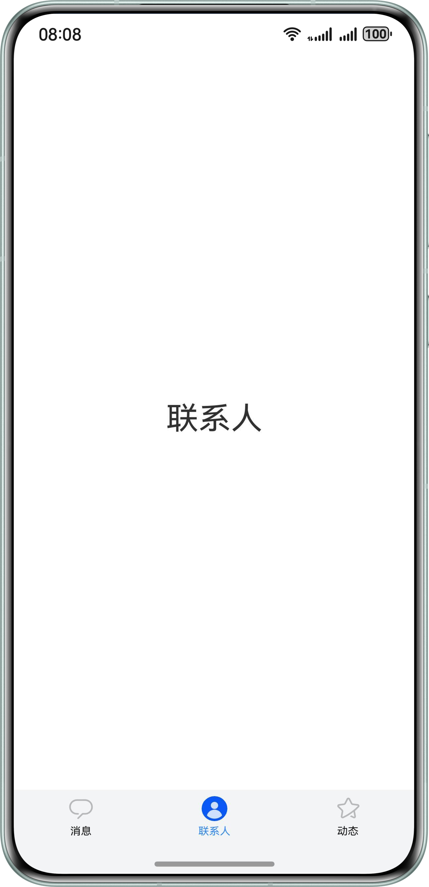


1. 使用Tabs组件，设置barPosition为BarPosition.End控制导航条底部展示。Tabs组件嵌套tabContentBuilder自定义组件。
  
  
  

```typescript
1. build() {
2.  Tabs({
3.  barPosition: BarPosition.End,
4.  controller: this.tabsController
5.  }) {
6.  this.tabContentBuilder($r('app.string.message'),
7.  Constants.TAB_INDEX_ZERO, $r('app.media.activeMessage'), $r('app.media.message'))
8.  this.tabContentBuilder($r('app.string.people'),
9.  Constants.TAB_INDEX_ONE, $r('app.media.activePeople'), $r('app.media.people'))
10.  this.tabContentBuilder($r('app.string.activity'),
11.  Constants.TAB_INDEX_TWO, $r('app.media.activeStar'), $r('app.media.star'))
12.  }
13.  .width('100%')
14.  .backgroundColor('#F3F4F5')
15.  .barHeight(52)
16.  .barMode(BarMode.Fixed)
17.  .onAnimationStart((index: number, targetIndex: number) => {
18.  hilog.info(0x0000, 'index', index.toString());
19.  this.currentIndex = targetIndex;
20.  })
21. }

```
  [BottomTab.ets](https://gitcode.com/HarmonyOS_Samples/multi-tab-navigation/blob/master/entry/src/main/ets/pages/BottomTab.ets#L95-L115)

2. tabContentBuilder自定义组件嵌套TabContent组件实现内容区，并设置tabBar属性实现导航条。
  
  
  

```typescript
1. @Builder
2. tabContentBuilder(text: Resource, index: number, selectedImg: Resource, normalImg: Resource) {
3.  TabContent() {
4.  Row() {
5.  Text(text)
6.  .height(300)
7.  .fontSize(30)
8.  }
9.  .width('100%')
10.  .justifyContent(FlexAlign.Center)
11.  }
12.  .padding({ left: 12, right: 12 })
13.  .backgroundColor(Color.White)
14.  .tabBar(this.tabBuilder(text, index, selectedImg, normalImg))
15. }

```
  [BottomTab.ets](https://gitcode.com/HarmonyOS_Samples/multi-tab-navigation/blob/master/entry/src/main/ets/pages/BottomTab.ets#L78-L92)

3. 导航布局代码如下所示：
  
  
  

```typescript
1. @Builder
2. tabBuilder(title: Resource, index: number, selectedImg: Resource, normalImg: Resource) {
3.  Column() {
4.  if (index === 0) {
5.  Badge({
6.  count: this.msgNum,
7.  style: { badgeSize: 14 },
8.  maxCount: 999,
9.  position: BadgePosition.RightTop
10.  }) {
11.  Image(this.currentIndex === index ? selectedImg : normalImg)
12.  .width(24)
13.  .height(24)
14.  .objectFit(ImageFit.Contain)
15.  }
16.  .width(30)
17.  } else if (index === 1) {
18.  Image(this.currentIndex === index ? selectedImg : normalImg)
19.  .width(24)
20.  .height(24)
21.  .objectFit(ImageFit.Contain)
22.  } else {
23.  Badge({
24.  value: '',
25.  style: { badgeSize: 6 },
26.  position: BadgePosition.RightTop
27.  }) {
28.  Image(this.currentIndex === index ? selectedImg : normalImg)
29.  .width(24)
30.  .height(24)
31.  .objectFit(ImageFit.Contain)
32.  }
33.  .width(30)
34.  }
35.
36.  Text(title)
37.  .margin({ top: 4 })
38.  .fontSize(10)
39.  .fontColor(this.currentIndex === index ? '#3388ff' : '#E6000000')
40.  }
41.  .justifyContent(FlexAlign.Center)
42.  .height(52)
43.  .width('100%')
44.  .onClick(() => {
45.  this.currentIndex = index;
46.  this.tabsController.changeIndex(this.currentIndex);
47.  })
48. }

```
  [BottomTab.ets](https://gitcode.com/HarmonyOS_Samples/multi-tab-navigation/blob/master/entry/src/main/ets/pages/BottomTab.ets#L27-L74)


### 舵式底部导航

舵式导航是基础底部导航的一种扩展，中间按钮一般为核心功能，并且在设计效果上中心图标可以超出导航条的高度，两侧为普通操作按钮。


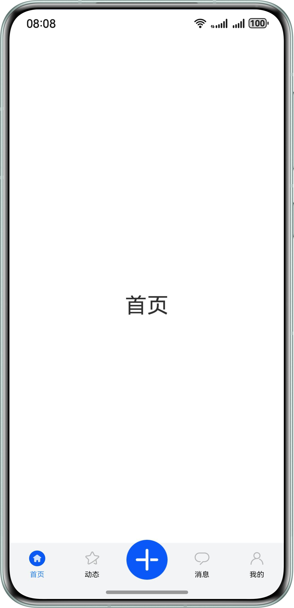


1. 使用Tabs组件，设置barPosition为BarPosition.End控制导航条底部展示。Tabs组件嵌套TabContent组件实现内容区。
  
  
  

```typescript
1. Tabs({ barPosition: BarPosition.End, controller: this.controller }) {
2.  ForEach(this.tabArray, (item: BottomTabModel, index: number) => {
3.  if (index === Constants.TAB_INDEX_TWO) {
4.  TabContent()
5.  .backgroundColor(Color.White)
6.  } else {
7.  TabContent() {
8.  Row() {
9.  Text(item.title)
10.  .fontSize(30)
11.  }
12.  .height(300)
13.  .width('100%')
14.  .justifyContent(FlexAlign.Center)
15.  }
16.  .backgroundColor(Color.White)
17.  }
18.  }, (item: BottomTabModel, index: number) => JSON.stringify(item) + index)
19. }

```
  [RudderStyleTab.ets](https://gitcode.com/HarmonyOS_Samples/multi-tab-navigation/blob/master/entry/src/main/ets/pages/RudderStyleTab.ets#L78-L96)

2. 导航条通过自定义布局实现，替代tabBar属性设置。
  
  
  

```typescript
1. Flex() {
2.  ForEach(this.tabArray, (item: BottomTabModel, index: number) => {
3.  this.Tab(item.selectImage, item.defaultImage, item.title, item.middleMode, index)
4.  }, (item: BottomTabModel, index: number) => JSON.stringify(item) + index)
5. }

```
  [RudderStyleTab.ets](https://gitcode.com/HarmonyOS_Samples/multi-tab-navigation/blob/master/entry/src/main/ets/pages/RudderStyleTab.ets#L102-L106)

3. 实现导航条布局，通过offset控制中心图标与两侧图标的位置。
  
  
  

```typescript
1. @Builder
2. Tab(selectImage: Resource, defaultImage: Resource, title: string | Resource, middleMode: boolean, index: number) {
3.  Column() {
4.  if (index === Constants.TAB_INDEX_TWO) {
5.  Image(defaultImage)
6.  .size({ width: 56, height: 56 })
7.  .offset({ y: -15 })
8.  } else {
9.  Image(this.currentIndex === index ? selectImage : defaultImage)
10.  .size({ width: 22, height: 22 })
11.  .offset({
12.  y: (this.currentIndex === index && this.currentIndex !== Constants.TAB_INDEX_TWO)
13.  ? this.iconOffset : this.initNumber
14.  })
15.  .objectFit(ImageFit.Contain)
16.  .animation({
17.  duration: Constants.ANIMATION_DURATION,
18.  curve: Curve.Ease,
19.  playMode: PlayMode.Normal
20.  })
21.  }
22.
23.  if (!middleMode) {
24.  Text(title)
25.  .fontSize(10)
26.  .margin({ top: 6 })
27.  .fontColor(this.currentIndex === index ? '#3388ff' : '#E6000000')
28.  }
29.  }
30.  .padding({ top: 11 })
31.  .width('100%')
32.  .backgroundColor('#F3F4F5')
33.  .height(90)
34.  .translate({ y: 40 })
35.  .onClick(() => {
36.  if (index !== Constants.TAB_INDEX_TWO) {
37.  this.currentIndex = index;
38.  this.controller.changeIndex(index);
39.  this.iconOffset = Constants.ICON_Offset;
40.  }
41.  })
42. }

```
  [RudderStyleTab.ets](https://gitcode.com/HarmonyOS_Samples/multi-tab-navigation/blob/master/entry/src/main/ets/pages/RudderStyleTab.ets#L30-L71)


## 顶部导航


### 居左对齐样式

居左对齐导航属于常规导航，由于Tabs组件导航只能居中展示，无法通过tabBar属性设置导航条。为实现居左对齐样式，可使用自定义布局替代tabBar控制按钮对齐方向。


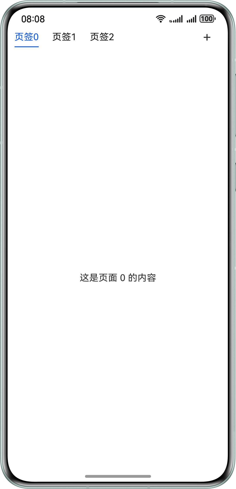


1. Stack组件中嵌套Row组件和Column组件，实现导航条文字和下划线两部分。
  
  
  

```typescript
1. Stack({ alignContent: Alignment.TopStart }) {
2.  // The text of tab.
3.  Row() {
4.  ForEach(this.tabArray, (item: number, index: number) => {
5.  this.tab(this.tabStr + item, item, index);
6.  }, (item: number, _index: number) => item.toString())
7.  Blank()
8.  Text('+')
9.  .width(24)
10.  .height(24)
11.  .fontSize(24)
12.  .textAlign(TextAlign.Center)
13.  .margin({ right: 24 })
14.  }
15.  .justifyContent(FlexAlign.Start)
16.  .width('100%')
17.
18.  // The underline of tab.
19.  Column()
20.  .width(this.indicatorWidth)
21.  .height(1.5)
22.  .backgroundColor('#0A59F7')
23.  .borderRadius(1)
24.  .margin({ left: this.indicatorLeftMargin, top: 35 })
25.
26. }
27. .height(56)
28. .margin({ left: this.tabLeftOffset })

```
  [LeftTab.ets](https://gitcode.com/HarmonyOS_Samples/multi-tab-navigation/blob/master/entry/src/main/ets/pages/LeftTab.ets#L81-L108)

2. 在onAreaChange()中计算当前激活Tab距离屏幕左侧的偏移量，赋值给indicatorLeftMargin变量，控制下划线的位置。
  
  
  

```typescript
1. @Builder
2. tab(tabName: string, _tabItem: number, tabIndex: number) {
3.  Row() {
4.  Text(tabName)
5.  .fontSize(16)
6.  .lineHeight(22)
7.  .fontColor(tabIndex === this.currentIndex ? '#0A59F7' : '#E6000000')
8.  .id(tabIndex.toString())
9.  .onAreaChange((_, newValue: Area) => {
10.  if (this.currentIndex === tabIndex && (this.indicatorLeftMargin === 0 || this.indicatorWidth === 0)) {
11.  let positionX: number;
12.  let width: number = Number.parseFloat(newValue.width.toString());
13.  if (newValue.position.x !== undefined) {
14.  positionX = Number.parseFloat(newValue.position.x?.toString())
15.  this.indicatorLeftMargin = Number.isNaN(positionX) ? 0 : positionX;
16.  }
17.  this.indicatorWidth = width;
18.  }
19.  })
20.  }
21.  .justifyContent(FlexAlign.Center)
22.  .constraintSize({ minWidth: 35 })
23.  .width(64)
24.  .height(35)
25.  .onClick(() => {
26.  this.controller.changeIndex(tabIndex);
27.  this.currentIndex = tabIndex;
28.  })
29. }

```
  [LeftTab.ets](https://gitcode.com/HarmonyOS_Samples/multi-tab-navigation/blob/master/entry/src/main/ets/pages/LeftTab.ets#L47-L75)

3. 在点击页签过程中，实时计算选中页签距离左侧的偏移量和页签的宽度，并更新下划线的位置和宽度。
  
  
  

```typescript
1.  .onAnimationStart((_index: number, targetIndex: number, _event: TabsAnimationEvent) => {
2.  this.currentIndex = targetIndex;
3.  let targetIndexInfo = this.getTextInfo(targetIndex);
4.  this.startAnimateTo(this.animationDuration, targetIndexInfo.left, targetIndexInfo.width);
5.  })
6. private getTextInfo(index: number): Record<string, number> {
7.  let modePosition: componentUtils.ComponentInfo | null = null;
8.  try {
9.  modePosition = this.getUIContext().getComponentUtils().getRectangleById(index.toString());
10.  } catch (error) {
11.  hilog.error(0x0000, 'testTag',`getRectangleById failed, Code:${error.code}, message:${error.message}`);
12.  }
13.  return { 'left': this.getUIContext().px2vp(modePosition?.windowOffset.x), 'width': this.getUIContext().px2vp(modePosition?.size.width) };
14. }
15.
16. private startAnimateTo(duration: number, leftMargin: number, width: number) {
17.  this.getUIContext().animateTo({
18.  duration: duration,
19.  curve: Curve.Linear,
20.  iterations: 1,
21.  playMode: PlayMode.Normal,
22.  }, () => {
23.  this.indicatorLeftMargin = leftMargin;
24.  this.indicatorWidth = width;
25.  })
26. }

```
  [LeftTab.ets](https://gitcode.com/HarmonyOS_Samples/multi-tab-navigation/blob/master/entry/src/main/ets/pages/LeftTab.ets#L141-L196)

4. 在左右滑动页面过程中，当滑动距离超出屏幕宽度一半时，更新下划线的位置和宽度。
  
  
  

```cangjie
1.  .onGestureSwipe((index: number, event: TabsAnimationEvent) => {
2.  let currentIndicator = this.getCurrentIndicatorInfo(index, event);
3.  this.currentIndex = currentIndicator.index;
4.  this.indicatorLeftMargin = currentIndicator.left;
5.  this.indicatorWidth = currentIndicator.width;
6.  })
7.
8. private getCurrentIndicatorInfo(index: number, event: TabsAnimationEvent): Record<string, number> {
9.  let nextIndex = index;
10.  if (index > 0 && event.currentOffset > 0) {
11.  // swipe to left.
12.  nextIndex--;
13.  } else if (index < this.tabArray.length - 1 && event.currentOffset < 0) {
14.  // swipe to right.
15.  nextIndex++;
16.  } else {
17.  // error condition.
18.  hilog.info(0x0000, 'leftTab', 'the index is out of boundary: %{public}s', index);
19.  }
20.  let indexInfo = this.getTextInfo(index);
21.  let nextIndexInfo = this.getTextInfo(nextIndex);
22.
23.  let swipeRatio = Math.abs(event.currentOffset / this.tabsWidth);
24.  let currentIndex = swipeRatio > 0.5 ? nextIndex : index;
25.  let currentIndicatorLeft: number = indexInfo.left + (nextIndexInfo.left - indexInfo.left) * swipeRatio;
26.  let currentIndicatorWidth: number = indexInfo.width + (nextIndexInfo.width - indexInfo.width) * swipeRatio;
27.  return { 'index': currentIndex, 'left': currentIndicatorLeft, 'width': currentIndicatorWidth };
28. }

```
  [LeftTab.ets](https://gitcode.com/HarmonyOS_Samples/multi-tab-navigation/blob/master/entry/src/main/ets/pages/LeftTab.ets#L132-L172)


### 可滑动居左对齐样式

可滑动导航样式在居左对齐基础上增加滑动功能，适合页签数较多场景。


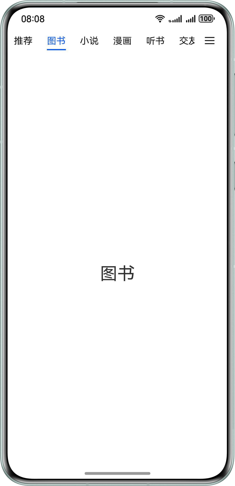


实现方式与居左对齐样式相同，唯一区别在于导航布局中嵌套List组件实现可滑动效果。


```typescript
1. Row() {
2.  List({ initialIndex: 0, scroller: this.listScroller }) {
3.  ForEach(this.tabArray, (item: TabItem, index: number) => {
4.  this.Tab(item.name, index)
5.  }, (item: TabItem, index: number) => JSON.stringify(item) + index)
6.  }
7.  .listDirection(Axis.Horizontal)
8.  .height(30)
9.  .scrollBar(BarState.Off)
10.  .width('85%')
11.  .friction(0.6)
12.  .onWillScroll((xOffset: number) => {
13.  this.indicatorLeftMargin -= xOffset;
14.  })
15.
16.  Image($r('app.media.more'))
17.  .width(20)
18.  .height(15)
19.  .margin({ left: 16 })
20. }
21. .height(52)
22. .width('100%')

```


[SlideAndMoreTab.ets](https://gitcode.com/HarmonyOS_Samples/multi-tab-navigation/blob/master/entry/src/main/ets/pages/SlideAndMoreTab.ets#L73-L94)


### 下划线样式

下划线导航样式属于常规导航，以文字加下划线的形式展示。


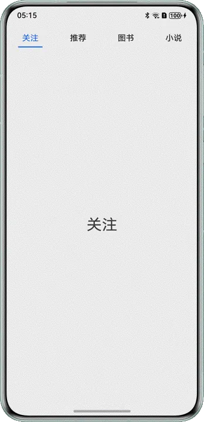


1. 使用Tabs组件，设置barPosition为BarPosition.Start控制导航条顶部展示。通过tabBar属性和Builder装饰器实现导航。
  
  
  

```typescript
1. Tabs({ barPosition: BarPosition.Start }) {
2.  ForEach(this.tabArray.slice(0, 4), (item: TabItem) => {
3.  TabContent() {
4.  Row() {
5.  Text(item.name)
6.  .height(300)
7.  .fontSize(30)
8.  }
9.  .width('100%')
10.  .justifyContent(FlexAlign.Center)
11.  .height('100%')
12.  }.tabBar(this.tabBuilder(item.id, item.name))
13.  }, (item: TabItem, index: number) => JSON.stringify(item) + index)
14. }

```
  [UnderlineTab.ets](https://gitcode.com/HarmonyOS_Samples/multi-tab-navigation/blob/master/entry/src/main/ets/pages/UnderlineTab.ets#L49-L62)

2. 使用Divider组件实现下划线。
  
  
  

```typescript
1. @Builder
2. tabBuilder(index: number, name: string | Resource) {
3.  Column() {
4.  Text(name)
5.  .fontColor(this.currentIndex === index ? '#0A59F7' : '#E6000000')
6.  .fontSize(16)
7.  .fontWeight(this.currentIndex === index ? FontWeight.Normal : FontWeight.Medium)
8.  .lineHeight(22)
9.  .margin({ top: 17, bottom: 7 })
10.  Divider()
11.  .width(48)
12.  .strokeWidth(Constants.STROKE_WIDTH)
13.  .color('#0A59F7')
14.  .opacity(this.currentIndex === index ? 1 : 0)
15.  }
16. }

```
  [UnderlineTab.ets](https://gitcode.com/HarmonyOS_Samples/multi-tab-navigation/blob/master/entry/src/main/ets/pages/UnderlineTab.ets#L28-L43)


### 背景高亮式

背景高亮导航样式属于常规导航，通过背景色突出选中页签。


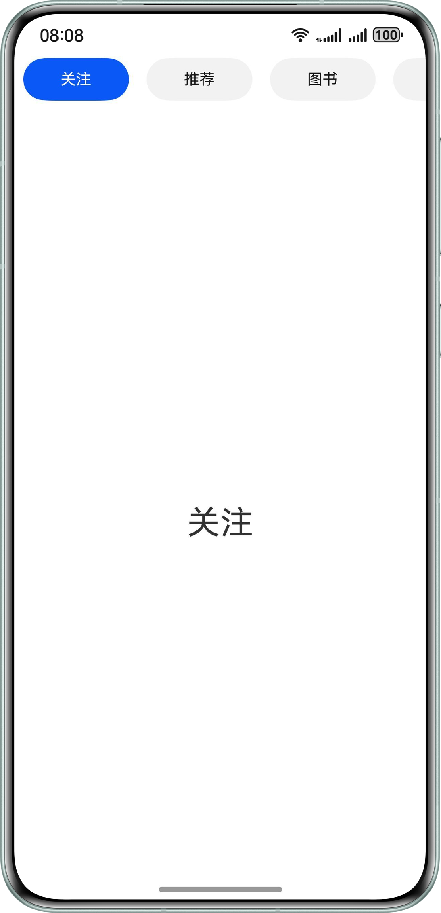


1. 使用Tabs组件，设置barPosition为BarPosition.Start控制导航条顶部展示。通过自定义布局实现导航背景高亮样式。
  
  
  

```typescript
1. Tabs({ barPosition: BarPosition.Start, controller: this.controller }) {
2.  ForEach(this.tabArray.slice(0, 6),
3.  (item: TabItem) => {
4.  TabContent() {
5.  Row() {
6.  Text(item.name)
7.  .height(300)
8.  .fontSize(30)
9.  }
10.  .width('100%')
11.  .justifyContent(FlexAlign.Center)
12.  }
13.  .backgroundColor(Color.White)
14.  }, (item: TabItem, index: number) => JSON.stringify(item) + index)
15. }
16. .width('100%')

```
  [BackgroundLightTab.ets](https://gitcode.com/HarmonyOS_Samples/multi-tab-navigation/blob/master/entry/src/main/ets/pages/BackgroundLightTab.ets#L71-L86)

2. 使用List组件实现可滑动效果。
  
  
  

```typescript
1. List({ scroller: this.listScroller }) {
2.  ForEach(this.tabArray.slice(0, 6),
3.  (item: TabItem, index: number) => {
4.  this.tabBuilder(item.name, index);
5.  }, (item: TabItem, index: number) => JSON.stringify(item) + index)
6. }

```
  [BackgroundLightTab.ets](https://gitcode.com/HarmonyOS_Samples/multi-tab-navigation/blob/master/entry/src/main/ets/pages/BackgroundLightTab.ets#L55-L60)

3. 其中在tabBuilder组件中判断tab的索引值与激活tab索引是否相同，控制背景色的变化。
  
  
  

```typescript
1. @Builder
2. tabBuilder(tabName: string | Resource, tabIndex: number) {
3.  Row() {
4.  Text(tabName)
5.  .fontSize(14)
6.  .fontColor(tabIndex === this.focusIndex ? Color.White : '#E6000000')
7.  .id(tabIndex.toString())
8.  }
9.  .justifyContent(FlexAlign.Center)
10.  .width(96)
11.  .backgroundColor(tabIndex === this.focusIndex ? '#0A59F7' : '#0D000000')
12.  .borderRadius(21)
13.  .height(40)
14.  .margin({ left: 8, right: 8 })
15.  .onClick(() => {
16.  this.controller.changeIndex(tabIndex);
17.  this.listScroller.scrollToIndex(tabIndex, true, ScrollAlign.CENTER);
18.  })
19. }

```
  [BackgroundLightTab.ets](https://gitcode.com/HarmonyOS_Samples/multi-tab-navigation/blob/master/entry/src/main/ets/pages/BackgroundLightTab.ets#L32-L50)


### 文字缩放式

文字缩放式导航样式属于常规导航，通过字体加粗放大突出选中页签。


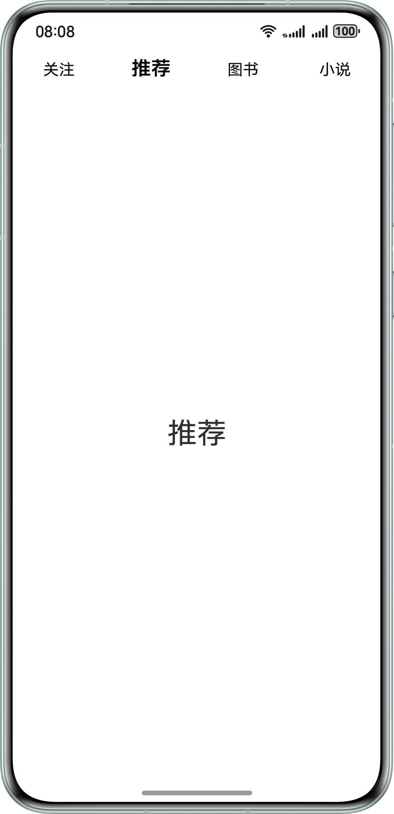


1. 使用Tabs组件，设置barPosition为BarPosition.Start。通过tabBar属性和Builder装饰器实现导航。
  
  
  

```typescript
1. Tabs({ barPosition: BarPosition.Start }) {
2.  ForEach(this.tabArray.slice(0, 4), (item: TabItem) => {
3.  TabContent() {
4.  Row() {
5.  Text(item.name)
6.  .height(300)
7.  .fontSize(30)
8.  }
9.  .width('100%')
10.  .justifyContent(FlexAlign.Center)
11.  .height('100%')
12.  }.tabBar(this.tabBuilder(item.id, item.name))
13.  }, (item: TabItem, index: number) => JSON.stringify(item) + index)
14. }

```
  [WordTab.ets](https://gitcode.com/HarmonyOS_Samples/multi-tab-navigation/blob/master/entry/src/main/ets/pages/WordTab.ets#L40-L53)

2. 其中在tabBuilder组件判断tab的索引值与选中tab索引是否相同，控制字体大小的变化。
  
  
  

```typescript
1. @Builder
2. tabBuilder(index: number, name: string | Resource) {
3.  Text(name)
4.  .fontColor(Color.Black)
5.  .fontSize(this.currentIndex === index ? 20 : 16)
6.  .fontWeight(this.currentIndex === index ? 600 : FontWeight.Normal)
7.  .lineHeight(22)
8.  .id(index.toString())
9. }

```
  [WordTab.ets](https://gitcode.com/HarmonyOS_Samples/multi-tab-navigation/blob/master/entry/src/main/ets/pages/WordTab.ets#L27-L35)


### 双层嵌套式

双层嵌套样式拥有两层导航，外层嵌套内层，与单层导航相比可以容纳更多页签。


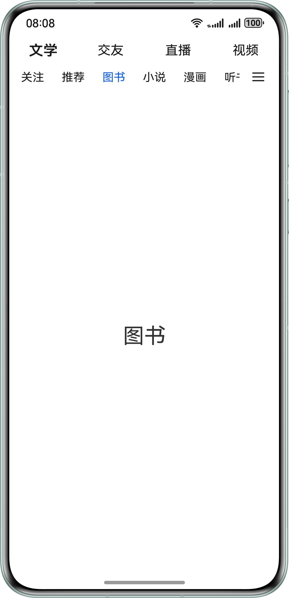


外层导航通过在TabContent组件设置tabBar属性，其中TabContent中嵌套List和子级Tabs。List组件嵌套subTabBuilder自定义组件实现内层导航。子级Tabs组件嵌套TabContent组件实现内容区。


```typescript
1. @Builder
2. subTabBuilder(tabName: string | Resource, tabIndex: number) {
3.  Row() {
4.  Text(tabName)
5.  .fontSize(16)
6.  .fontColor(tabIndex === this.focusIndex ? '#0A59F7' : '#E6000000')
7.  .id(tabIndex.toString())
8.  }
9.  .justifyContent(FlexAlign.Center)
10.  .padding({ left: 12, right: 12 })
11.  .height(30)
12.  .onClick(() => {
13.  this.subController.changeIndex(tabIndex);
14.  this.focusIndex = tabIndex;
15.  })
16. }
17.  TabContent() {
18.  Column() {
19.  Column() {
20.  Row() {
21.  List({ initialIndex: Constants.TAB_INDEX_ZERO, scroller: this.listScroller }) {
22.  ForEach(this.tabArray, (item: TabItem, index: number) => {
23.  this.subTabBuilder(item.name, index)
24.  }, (item: TabItem, index: number) => JSON.stringify(item) + index)
25.  }
26.  .listDirection(Axis.Horizontal)
27.  .height(30)
28.  .scrollBar(BarState.Off)
29.  .width('85%')
30.  .friction(0.6)
31.
32.  Image($r('app.media.more'))
33.  .width(20)
34.  .height(15)
35.  .margin({ left: 16 })
36.  }
37.  .height(25)
38.  .width('100%')
39.  }
40.  .alignItems(HorizontalAlign.Center)
41.  .width('100%')
42.  .padding({ left: 4 })
43.  Tabs({ barPosition: BarPosition.Start, controller: this.subController }) {
44.  // ...
45.  }
46.  .barHeight(0)
47.  .animationDuration(Constants.ANIMATION_DURATION)
48.  .onAnimationStart((index: number, targetIndex: number) => {
49.  hilog.info(0x0000, 'index', index.toString());
50.  this.focusIndex = targetIndex;
51.  this.listScroller.scrollToIndex(targetIndex, true, ScrollAlign.CENTER);
52.  })
53.  }
54.  }
55.  .tabBar(this.tabBuilder(Constants.TAB_INDEX_ZERO, this.topTabData[Constants.TAB_INDEX_ZERO]))

```


[DoubleNestingTabOne.ets](https://gitcode.com/HarmonyOS_Samples/multi-tab-navigation/blob/master/entry/src/main/ets/pages/DoubleNestingTabOne.ets#L45-L155)


## 侧边导航


### 基础侧边导航

属于侧边导航类，通过List去实现左侧导航条区域。


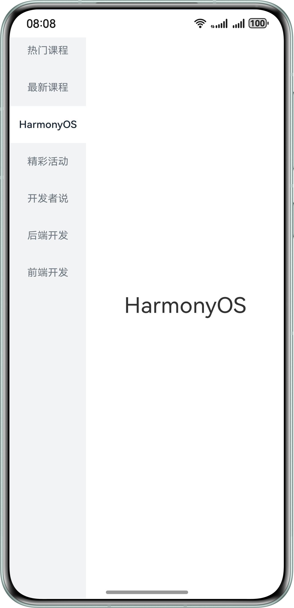


基础侧边导航使用左右布局：左侧通过List组件与ListItem组件实现导航布局，右侧实现导航内容区。


```typescript
1. List({ scroller: this.classifyScroller }) {
2.  ForEach(this.ClassifyArray, (item: ClassifyModel, index?: number) => {
3.  ListItem() {
4.  ClassifyItem({
5.  classifyName: item.classifyName,
6.  isSelected: this.currentClassify === index,
7.  onClickAction: () => {
8.  if (index !== undefined) {
9.  this.classifyChangeAction(index, true);
10.  }
11.  }
12.  })
13.  }
14.  }, (item: ClassifyModel, index: number) => JSON.stringify(item) + index)
15. }
16. .height('110%')
17. .width('27.8%')
18. .backgroundColor($r('app.color.side_background_color'))
19. .scrollBar(BarState.Off)
20. .margin({ top: 74 })
21.
22. Column() {
23.  ForEach(this.ClassifyArray, (item: ClassifyModel, index: number) => {
24.  Text(this.currentClassify === index ? item.classifyName : '')
25.  .fontSize(30)
26.  },(item: ClassifyModel, index: number) => JSON.stringify(item) + index)
27. }
28. .width('72.2%')

```


[SideTab.ets](https://gitcode.com/HarmonyOS_Samples/multi-tab-navigation/blob/master/entry/src/main/ets/pages/SideTab.ets#L62-L89)


### 抽屉式侧边导航

抽屉式导航属于侧边导航类，核心思路是“隐藏”，点击入口或侧滑可以像“抽屉”一样拉出菜单。


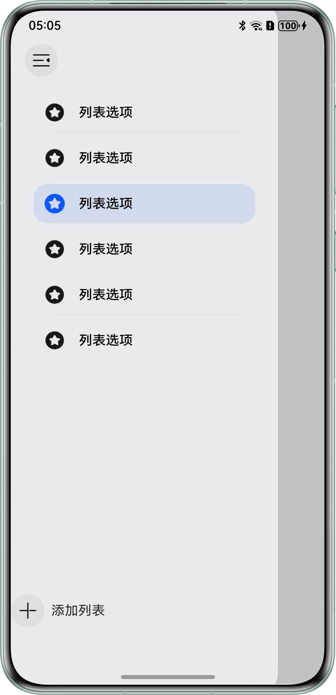


1. 使用[SideBarContainer组件](https://developer.huawei.com/consumer/cn/doc/harmonyos-references/ts-container-sidebarcontainer#%E7%A4%BA%E4%BE%8B)实现侧边导航，并且通过设置该组件的showSideBar控制显示隐藏。在SideBarContainer实现左侧导航样式和右侧内容区。controlButton属性控制侧边导航按钮位置。
  
  
  

```typescript
1. SideBarContainer(SideBarContainerType.Overlay) {
2.  Column() {
3.  // ...
4.  }
5.  .height('100%')
6.  .padding({ top: 104 })
7.  .backgroundColor('#E9EAEC')
8.  .width(272)
9.  .height(344)
10.  .backgroundColor(Color.White)
11.  .borderRadius(20)
12.  Column() {
13.  // ...
14.  }
15.  .onClick(() => {
16.  this.getUIContext().animateTo({
17.  duration: Constants.ANIMATION_DURATION,
18.  curve: Curve.EaseOut,
19.  playMode: PlayMode.Normal,
20.  }, () => {
21.  this.show = false;
22.  })
23.  })
24.  .width('100%')
25.  .height('110%')
26.  .backgroundColor(this.show ? '#c1c2c4' : '')
27. }
28. .showSideBar(this.show)
29. .controlButton({
30.  left: 16,
31.  top: 48,
32.  height: 40,
33.  width: 40,
34.  icons: {
35.  shown: $r('app.media.changeBack'),
36.  hidden: $r('app.media.change'),
37.  switching: $r('app.media.change')
38.  }
39. })
40. .onChange((value: boolean) => {
41.  this.show = value;
42. })

```
  [DrawerTab.ets](https://gitcode.com/HarmonyOS_Samples/multi-tab-navigation/blob/master/entry/src/main/ets/pages/DrawerTab.ets#L27-L125)

2. 左侧导航使用Image和Text实现图标加文字的效果。
  
  
  

```typescript
1. Column() {
2.  ForEach(this.navList, (item: number, index: number) => {
3.  Column() {
4.  Row() {
5.  Image(this.active === item ? $r('app.media.activeList') : $r('app.media.list'))
6.  .width(24)
7.  .height(24)
8.  Text($r('app.string.list_name'))
9.  .fontSize(16)
10.  .fontColor(Color.Black)
11.  .fontWeight(FontWeight.Medium)
12.  .margin({ left: 17 })
13.  }
14.  .height(48)
15.  .width('100%')
16.
17.  if (this.navList.length - 1 !== index) {
18.  Row()
19.  .height(0.5)
20.  .backgroundColor('#0D000000')
21.  .width('90%')
22.  }
23.  }
24.  .onClick(() => {
25.  this.active = item;
26.  })
27.  .margin({
28.  top: 4,
29.  left: 4,
30.  right: 4,
31.  bottom: 4
32.  })
33.  .justifyContent(FlexAlign.Center)
34.  .width(264)
35.  .height(48)
36.  .padding({ left: 13 })
37.  .borderRadius(16)
38.  .backgroundColor(this.active === item ? '#1A0A59F7' : '')
39.  }, (item: number, index: number) => JSON.stringify(item) + index)
40.
41.  Row() {
42.  Image($r('app.media.add'))
43.  .width(40)
44.  .height(40)
45.  Text($r('app.string.add_list')).margin({ left: 8 })
46.  }
47.  .width('100%')
48.  .margin({ top: 284 })
49. }
50. .height('100%')
51. .padding({ top: 104 })
52. .backgroundColor('#E9EAEC')
53. .width(272)
54. .height(344)
55. .backgroundColor(Color.White)
56. .borderRadius(20)

```
  [DrawerTab.ets](https://gitcode.com/HarmonyOS_Samples/multi-tab-navigation/blob/master/entry/src/main/ets/pages/DrawerTab.ets#L29-L86)


## 示例代码

- [基于Tabs组件实现常见导航样式](https://gitcode.com/harmonyos_samples/multi-tab-navigation)
