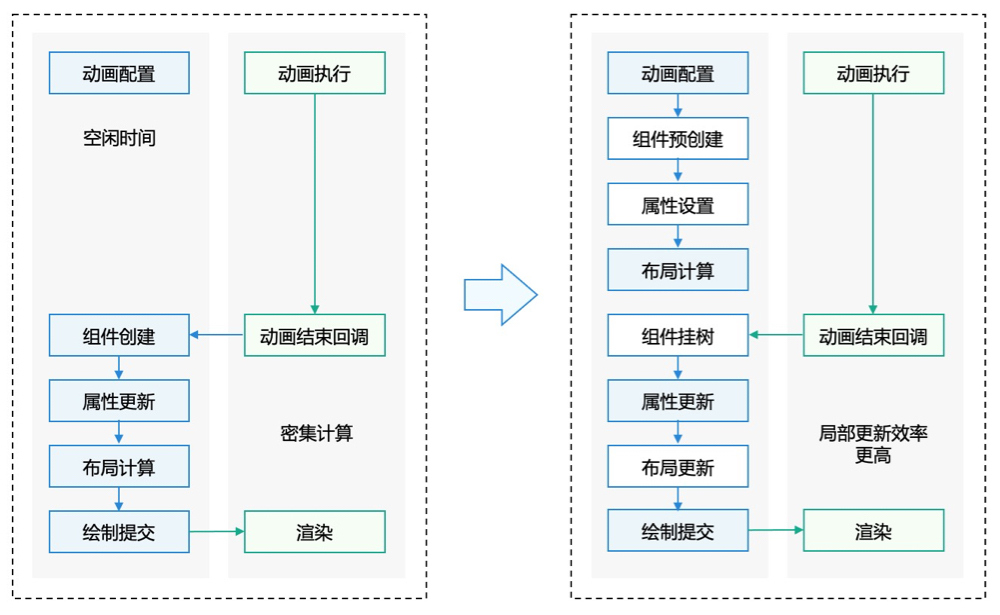
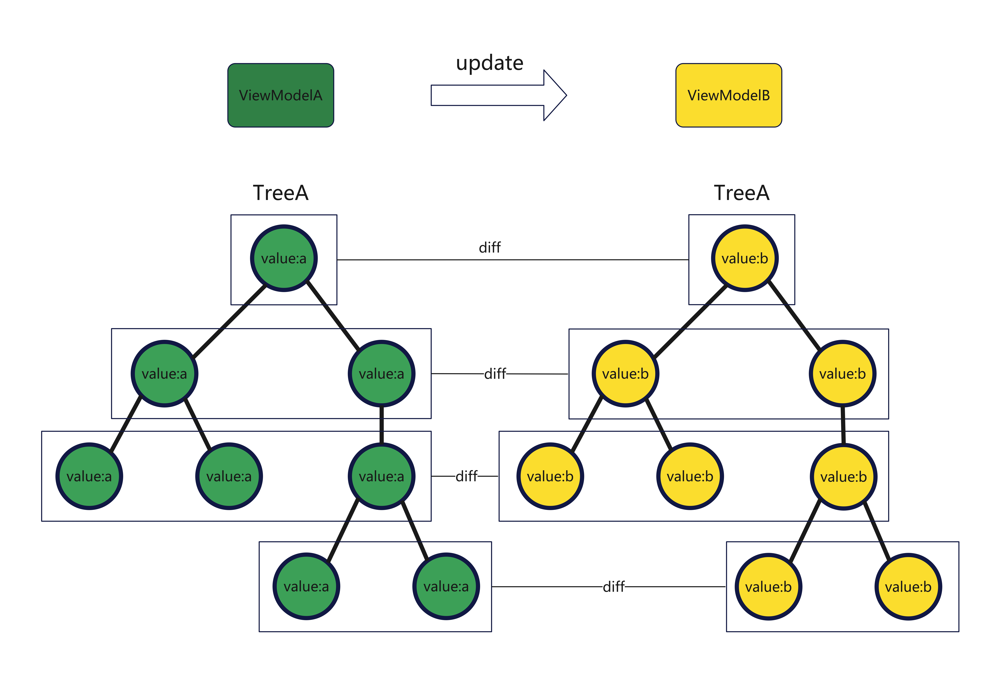
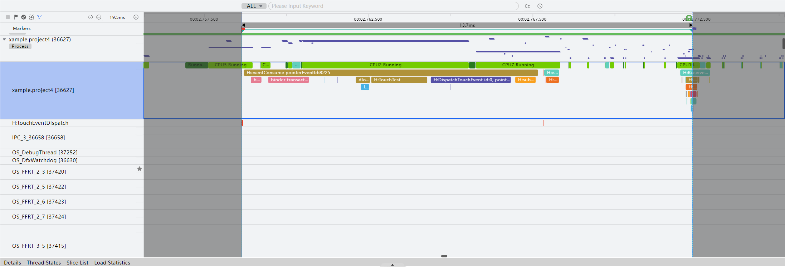
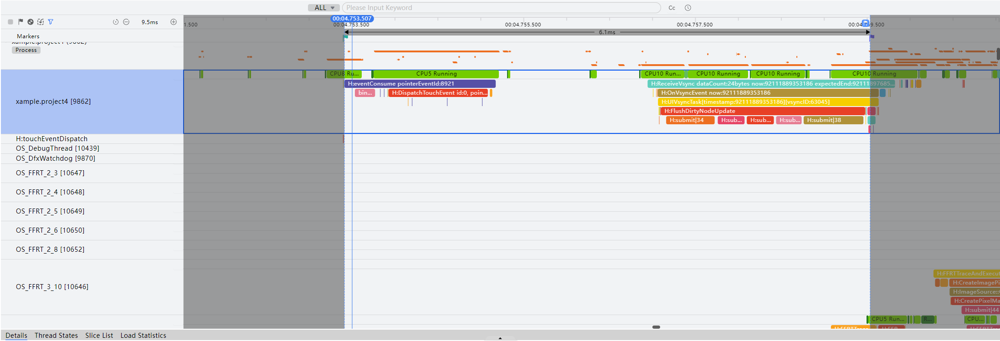

# 组件动态创建

---

## 概述

为了解决页面、组件加载缓慢的问题，ArkUI框架提供了动态操作以实现组件预创建，并允许应用在运行时根据实际需要加载渲染相应的组件。动态操作包含动态创建组件（动态添加组件）、动态卸载组件（动态删除组件）等相关操作。动态创建组件指在非build生命周期中进行组件创建，即在build生命周期前提前创建组件。通过动态创建组件，不但可以节省组件创建的时间，提升用户体验，还可以将独立的逻辑进行封装，有助于应用模块化开发。动态卸载组件是对动态创建的组件进行卸载、删除。


## 组件预创建原理

在声明式范式中，组件仅在build环节中被创建，开发者无法在其他生命周期阶段进行组件的创建，从而引起页面加载慢等问题。与声明式范式不同，ArkUI框架提供的UI动态操作支持组件的预创建。组件预创建可以满足开发者在非build生命周期中进行组件创建，创建后的组件可以进行属性设置、布局计算等操作。之后在页面加载时进行使用，可以极大提升页面响应速度。


如下图所示，利用组件预创建机制，可以利用动画执行过程空闲时间进行组件预创建和属性设置。在动画结束后，再进行属性和布局的更新，节省了组件创建的时间，从而加快了页面渲染。


**图1** 组件预创建原理图  


## FrameNode自定义节点在动态布局场景下的优势


### 减少自定义组件创建开销

在采用声明式开发范式中，若使用ArkUI的自定义组件对节点树中的每个节点进行定义，往往会遇到节点创建效率低下的问题。


这主要是因为每个节点在ArkTS引擎中都需要分配内存空间来存储应用程序的自定义组件和状态变量。在节点创建过程中，还必须执行组件ID、组件闭包以及状态变量之间的依赖关系收集等操作。


相比之下，使用ArkUI的[FrameNode](https://developer.huawei.com/consumer/cn/doc/harmonyos-guides/arkts-user-defined-arktsnode-framenode)，可以避免创建自定义组件对象和状态变量对象，无需进行依赖收集，从而显著提升组件创建的速度。


### 组件更新更快

在动态布局类框架的更新场景中，通常存在一个由树形数据结构ViewModelA创建的UI组件树TreeA。当需要使用新的数据结构ViewModelB来更新TreeA时，尽管声明式开发范式可以实现数据驱动的自动更新，但这一过程中却伴随着大量的diff操作，如下图所示。对于ArkTS引擎而言，在对一个复杂组件树（深度超过30层，包含100至200个组件）执行diff算法时，几乎无法在120Hz的刷新率下保持满帧运行。然而，使用ArkUI的FrameNode扩展，框架能够自主掌控更新流程，实现高效的按需剪枝。特别是针对那些仅服务于少数特定业务的动态布局框架，利用这一扩展，可以实现快速的更新操作。





### 直接操作组件树

使用声明式开发范式还存在组件树结构更新操作困难的痛点，比如将组件树中的一个子树从当前子节点完整移到另一个子节点，使用声明式开发范式无法直接调整组件实例的结构关系，只能通过重新渲染整棵组件树的方式实现上述操作。而使用ArkUI的FrameNode扩展，则可以通过操作FrameNode来很方便的操控该子树，将其移植到另一个节点，这样只会进行局部渲染刷新，性能更优。


## 组件动态添加、更新和删除：


### 动态添加组件

动态添加组件包括以下步骤：


1. 创建自定义节点。
2. 实现[NodeController](https://developer.huawei.com/consumer/cn/doc/harmonyos-references/js-apis-arkui-nodecontroller)，用于自定义节点的创建、显示、更新等操作的管理，并负责将自定义节点挂载到[NodeContainer](https://developer.huawei.com/consumer/cn/doc/harmonyos-references/ts-basic-components-nodecontainer#nodecontainer-1)上。
3. 实现NodeController的makeNode()方法，makeNode()会在NodeController实例绑定NodeContainer的时候进行回调，并将返回的节点挂载至NodeContainer。
4. 使用NodeContainer显示自定义节点。


- 创建自定义节点     首先，准备好需要挂载的节点，代码如下所示。


  
  
  

```typescript
1. import { BuilderNode, FrameNode, NodeController } from '@kit.ArkUI';
2.
3. class Params {
4.  text: string = 'Hello World';
5.  constructor(text: string) {
6.  this.text = text;
7.  }
8. }
9.
10. @Builder
11. function testBuilder(params: Params) {
12.  Column() {
13.  Text(params.text)
14.  .fontSize(50)
15.  .fontWeight(FontWeight.Bold)
16.  .margin({bottom: 36})
17.  }
18. }
19. // ...


```
  [segment.ets](https://gitcode.com/harmonyos_samples/DynamicComponent/blob/master/entry/src/main/ets/segment/segment.ets#L2-L21)


- 实现NodeController     NodeController为抽象类，需要继承并实现NodeController，代码如下所示。


  
  
  

```typescript
1. // ...
2. class TextNodeController extends NodeController {
3.  private textNode: BuilderNode<[Params]> | null = null;
4.  private message: string = '';
5.
6.  constructor(message: string) {
7.  super();
8.  this.message = message;
9.  }
10.
11.  makeNode(context: UIContext): FrameNode | null {
12.  return null;
13.  }
14. }


```
  [segment.ets](https://gitcode.com/harmonyos_samples/DynamicComponent/blob/master/entry/src/main/ets/segment/segment.ets#L25-L38)


- 实现NodeController的makeNode()方法     首先，使用构造函数创建BuilderNode实例。创建BuilderNode对象的时候必须要传入对应的UIContext对象。若BuilderNode作为RenderNode的子节点存在，要求设置RenderOptions的selfIdealSize属性。

     然后，使用BuilderNode的build()方法，构建组件树。方法build()需要传入两个参数，第一个参数为通过wrapBuilder()封装的全局@Builder方法。第二个参数为对应的@Builder方法所需的参数对象。若@Builder方法不带参数或者存在默认参数，则build()的第二个参数可以不设置。


  
  
  

```typescript
1. // ...
2. class TextNodeController extends NodeController {
3.  private textNode: BuilderNode<[Params]> | null = null;
4.  private message: string = '';
5.
6.  constructor(message: string) {
7.  super();
8.  this.message = message;
9.  }
10.
11.  makeNode(context: UIContext): FrameNode | null {
12.  // Creating a BuilderNode instance
13.  this.textNode = new BuilderNode(context);
14.  // Set the selfIdealSize property
15.  // this.textNode = new BuilderNode(context, {selfIdealSize: {width: 100, height :100}});
16.  // Build the component tree using the build method
17.  this.textNode.build(wrapBuilder<[Params]>(testBuilder), new Params(this.message));
18.  // Returns the node to be displayed
19.  return this.textNode.getFrameNode();
20.  }
21. }


```
  [segment2.ets](https://gitcode.com/HarmonyOS_Samples/DynamicComponent/blob/master/entry/src/main/ets/segment/segment2.ets#L2-L41)


- 显示自定义节点     显示自定义节点依赖声明式渲染容器NodeContainer以及对应的控制类NodeController。

     NodeController的makeNode()方法返回的节点会显示在对应的NodeContainer中。由于makeNode()需要返回的为一个FrameNode，因此如果预期显示BuilderNode的时候需要调用对应的BuilderNode的getFrameNode()方法，获取其根节点，详细代码如上TextNodeController中所示。

     然后，在页面内新增声明式渲染容器NodeContainer，创建工具类NodeController。通过NodeController将MakeNode中返回的节点在声明式渲染容器中进行显示。


  
  
  

```typescript
1. // ...
2. @Entry
3. @Component
4. struct Index {
5.  @State message: string = "hello";
6.  private textNodeController: TextNodeController = new TextNodeController(this.message);
7.
8.  build() {
9.  Row() {
10.  Column() {
11.  NodeContainer(this.textNodeController)
12.  .width('100%')
13.  .height(100)
14.  .backgroundColor('#FFF0F0F0')
15.  }
16.  .width('100%')
17.  .height('100%')
18.  }
19.  .height('100%')
20.  }
21. }


```
  [segment3.ets](https://gitcode.com/HarmonyOS_Samples/DynamicComponent/blob/master/entry/src/main/ets/segment/segment3.ets#L2-L63)


- 更新自定义节点     更新自定义节点，可参考BuilderNode的[update()](https://developer.huawei.com/consumer/cn/doc/harmonyos-references/js-apis-arkui-buildernode#update)方法。


### 动态删除组件


通过条件控制语句可以将NodeContainer节点进行移除或者显示。如示例代码，将this.isShow更改为false则将节点从界面上移除。


```typescript
1. // ...
2. @Entry
3. @Component
4. struct Index {
5.  @State message: string = "hello";
6.  @State isShow: boolean = true;
7.  private textNodeController: TextNodeController = new TextNodeController(this.message);
8.
9.  build() {
10.  Row() {
11.  Column() {
12.  if (this.isShow) {
13.  NodeContainer(this.textNodeController)
14.  .width('100%')
15.  .height(100)
16.  .backgroundColor('#FFF0F0F0')
17.  }
18.  Button('isShow')
19.  .onClick(() => {
20.  this.isShow = false;
21.  })
22.  }
23.  .width('100%')
24.  .height('100%')
25.  }
26.  .height('100%')
27.  }
28. }

```


[segment4.ets](https://gitcode.com/HarmonyOS_Samples/DynamicComponent/blob/master/entry/src/main/ets/segment/segment4.ets#L2-L70)


### 动态更新组件

动态将NodeContainer上的节点替换，依赖于NodeController的makeNode()和rebuild()方法。rebuild方法会触发makeNode的回调，刷新NodeContainer上显示的节点；makeNode()方法返回的为null，则移除NodeContainer下挂载的节点。


```typescript
1. // ...
2.
3. class TextNodeController extends NodeController {
4.  private textNode: BuilderNode<[Params]> | null = null;
5.  private message: string = '';
6.
7.  constructor(message: string) {
8.  super();
9.  this.message = message;
10.  }
11.
12.  makeNode(context: UIContext): FrameNode | null {
13.  // With the addition of null handling, the following code is executed only when the BuilderNode is created for the first time; when replacing a node, textNode is not null
14.  if (this.textNode == null) {
15.  this.textNode = new BuilderNode(context);
16.  this.textNode.build(wrapBuilder<[Params]>(testBuilder), new Params(this.message));
17.  }
18.
19.  return this.textNode.getFrameNode();
20.  }
21.
22.  replaceBuilderNode(newNode: BuilderNode<Object[]>) {
23.  this.textNode = newNode;
24.  // The rebuild method re-calls the makeNode method.
25.  this.rebuild();
26.  }
27. }
28.
29. // ...

```


[segment5.ets](https://gitcode.com/HarmonyOS_Samples/DynamicComponent/blob/master/entry/src/main/ets/segment/segment5.ets#L2-L52)


开发者可以根据实际情况创建新的节点，参考示例代码如下所示：


```typescript
1. // ...
2. @Entry
3. @Component
4. struct Index {
5.  @State message: string = "hello";
6.  @State isShow: boolean = true;
7.  private textNodeController: TextNodeController = new TextNodeController(this.message);
8.  // private count = 0;
9.
10.  build() {
11.  Row() {
12.  Column() {
13.  if (this.isShow) {
14.  NodeContainer(this.textNodeController)
15.  .width('100%')
16.  .height(100)
17.  .backgroundColor('#FFF0F0F0')
18.  }
19.  Button('replaceNode')
20.  .onClick(() => {
21.  this.textNodeController.replaceBuilderNode(this.buildNewNode());
22.  })
23.  }
24.  .width('100%')
25.  .height('100%')
26.  }
27.  .height('100%')
28.  }
29.
30.  buildNewNode(): BuilderNode<[Params]> {
31.  let uiContext: UIContext = this.getUIContext();
32.  let message = 'newNode';
33.  let textNode = new BuilderNode<[Params]>(uiContext);
34.  textNode.build(wrapBuilder<[Params]>(testBuilder), new Params(message))
35.  return textNode;
36.  }
37. }

```


[segment6.ets](https://gitcode.com/harmonyos_samples/DynamicComponent/blob/master/entry/src/main/ets/segment/segment6.ets#L2-L83)


### NodeController生命周期

NodeController用于控制和反馈对应的NodeContainer上的节点的行为，需要与NodeContainer一起使用。下面，对其常用生命周期函数进行说明。


- makeNode()：必须要重写的方法，用于构建节点树、返回节点挂载在对应NodeContainer中。在对应NodeContainer创建绑定当前NodeController的时候调用、或者通过rebuild()方法调用刷新。
- aboutToResize()：当controller对应的NodeContainer在Measure的时候进行回调，入参为节点的布局大小。
- aboutToAppear()：当controller对应的NodeContainer在onAppear()的时候进行回调。
- aboutToDisappear()：当controller对应的NodeContainer在onDisappear()的时候进行回调。
- onTouchEvent()：当NodeController绑定的NodeContainer收到Touch事件时触发此回调。
  
  
  

```typescript
1. export abstract class NodeController {
2.  abstract makeNode(uiContext: UIContext): FrameNode | null;
3.  aboutToResize?(size: Size): void;
4.  aboutToAppear?(): void;
5.  aboutToDisappear?(): void;
6.  abstract rebuild(): void;
7.  onTouchEvent?(event: TouchEvent): void;
8. }

```
  [TestCode.ets](https://gitcode.com/HarmonyOS_Samples/DynamicComponent/blob/master/entry/src/main/ets/pages/TestCode.ets#L4-L11)


## 列表流广告组件实践案例


### 场景描述

App广告有一种场景是列表流广告，即在应用的列表流中穿插展示广告条目，旨在将广告无缝融入用户的浏览体验中，使其看起来像是正常的内容（广告条目需要加标记区别展示），从而吸引用户的注意力并提高参与度，例如新闻列表中的广告条目、商品列表中的广告条目等。


这种广告的布局和内容在开发阶段不确定（可能是图文、视频等形式中的一种），其通常是在运行阶段，依赖服务器下发的数据进行逻辑映射后，再执行布局的构建、内容的加载显示。所以在实际的开发中，应用需要使用动态创建组件的能力去实现该列表流广告。


### 实现方案

1. 使用列表数据构建List布局，根据数据类型分别执行对应逻辑，如果是广告类型，使用NodeContainer进行预占位。
2. 当NodeContainer渲染时，发起请求获取广告信息等数据。解析数据明确广告类型后，构建具体的广告布局，比如图文布局、视频布局等。
3. 布局构建完成后，返回rootNode实现组件上树，最后在容器中渲染显示。


### 开发步骤

1. 加载列表数据：模拟从服务器端获取列表数据，分别生成列表数据对象和广告数据对象。  

  
  
  

```typescript
1. aboutToAppear() {
2.  for (let i = 0; i <= 100; i++) {
3.  let id = i.toString();
4.  // In actual services, data is obtained from the cloud, a card list is generated,
5.  // and the node where the advertisement is located is marked.
6.  if (i % 7 === 6) {
7.  // Node where the advertisement is located
8.  this.data.pushData(new CardData(true, id));
9.  try {
10.  this.idList.add(id);
11.  } catch (error) {
12.  let err = error as BusinessError
13.  if (err.code) {
14.  hilog.error(0x0000, 'ImperativeView', 'Failed to add id. Cause: %{public}s', JSON.stringify(err) ?? '');
15.  }
16.  }
17.  } else {
18.  this.data.pushData(new CardData(false, id));
19.  }
20.  }
21. }


```
  [MainPage.ets](https://gitcode.com/HarmonyOS_Samples/DynamicComponent/blob/master/entry/src/main/ets/pages/MainPage.ets#L35-L55)
     示例代码中用CardData(true, id)表示广告数据对象。


  
  
  

```typescript
1. export class CardData {
2.  private id: string = '';
3.  private mIsAdCard: boolean = false;
4.
5.  constructor(isAdCard: boolean, id: string) {
6.  this.mIsAdCard = isAdCard;
7.  this.id = id;
8.  }
9.  // ...
10. }


```
  [CardData.ets](https://gitcode.com/HarmonyOS_Samples/DynamicComponent/blob/master/entry/src/main/ets/model/CardData.ets#L19-L36)
  

2. 构建广告组件：封装广告组件AdComponent，它通过模拟获取的广告类型去判断，进一步构建图文广告组件，或视频广告组件。  

  
  
  

```typescript
1. @Builder
2. export function adBuilder(param: AdParams) {
3.  AdComponent({ params: param });
4. }
5.
6. @Component
7. struct AdComponent {
8.  params ?: AdParams;
9.  closeAdDialogController: CustomDialogController = new CustomDialogController({
10.  builder: CloseAdDialog({
11.  adId: this.params!.id
12.  }),
13.  backgroundBlurStyle: BlurStyle.COMPONENT_THICK,
14.  });
15.
16.  build() {
17.  if (this.params!.isVideo) {
18.  videoAdBuilder(this.closeAdDialogController);
19.  } else {
20.  picAdBuilder(this.closeAdDialogController);
21.  }
22.  }
23. }


```
  [AdBuilder.ets](https://gitcode.com/HarmonyOS_Samples/DynamicComponent/blob/master/entry/src/main/ets/components/AdBuilder.ets#L20-L42)
  

3. 广告占位节点逻辑：实现占位结点AdNodeController，它继承自NodeController，其中的initAd()方法通过this.adNode.build()接口将广告组件添加到rootNode上。当NodeContainer进行绘制时，会调用makeNode()方法，将构建好的rootNode返回实现组件上树。  

  
  
  

```typescript
1. export class AdNodeController extends NodeController {
2.  private rootNode: FrameNode | null = null;
3.  private adNode: BuilderNode<[AdParams]> | null = null;
4.  private isRemove: boolean = false;
5.  private uiContext ?: UIContext;
6.
7.  makeNode(): FrameNode | null {
8.  if (this.isRemove) {
9.  return null;
10.  }
11.  if (this.rootNode != null) {
12.  return this.rootNode;
13.  }
14.  return null;
15.  }
16.
17.  // This function is user-defined and can be used as an initialization function.
18.  // Initialize BuilderNode through UIContext, and then initialize the content
19.  // in @Builder through the build interface in BuilderNode.
20.  initAd(uiContext: UIContext, id: string, adType: string) {
21.  this.uiContext = uiContext;
22.  // uiContext is required for creating a node.
23.  this.rootNode = new FrameNode(this.uiContext);
24.  // uiContext is required for creating a node.
25.  this.adNode = new BuilderNode(this.uiContext);
26.  this.adNode.build(wrapBuilder(adBuilder), { id: id, isVideo: adType === 'video' });
27.  this.rootNode.getRenderNode()?.appendChild(this.adNode.getFrameNode()?.getRenderNode());
28.  }
29.
30.  remove() {
31.  this.isRemove = true;
32.  }
33. }


```
  [AdController.ets](https://gitcode.com/HarmonyOS_Samples/DynamicComponent/blob/master/entry/src/main/ets/components/AdController.ets#L24-L56)
  

4. 加载广告布局：getAdNodeController()方法是通过queryAdById()模拟广告类型信息的获取，并在完成信息获取后构建相应的NodeController。  

  
  
  

```typescript
1. // Customizing the Interface for Obtaining the NodeController
2. export const getAdNodeController = (uiContext: UIContext, id: string): AdNodeController | undefined => {
3.  let baseNode = new AdNodeController();
4.  nodeMap.set(id, baseNode);
5.  baseNode.initAd(uiContext, id, queryAdById(id));
6.  return nodeMap.get(id);
7. }
8.
9. function queryAdById(id: string): string {
10.  if (Number(id) % 2 === 0) {
11.  return 'pic';
12.  } else {
13.  return 'video';
14.  }
15. }


```
  [AdController.ets](https://gitcode.com/HarmonyOS_Samples/DynamicComponent/blob/master/entry/src/main/ets/components/AdController.ets#L60-L74)
  

5. 列表及广告项布局：在ListItem布局逻辑中，需要判断该项是否为广告节点：若是广告项，通过getAdNodeController()方法预埋NodeContainer容器占位；若不是，通过CardComponent()进行列表内容项的布局及渲染。  

  
  
  

```typescript
1. List({ space: 3 }) {
2.  // Iteratively generating a node tree
3.  LazyForEach(this.data, (item: CardData) => {
4.  ListItem() {
5.  if (item.isAdCard()) {
6.  // Creates a NodeContainer placeholder for an ad node. When the component is loaded,
7.  // the corresponding ad card Controller is obtained.
8.  NodeContainer(getAdNodeController(this.getUIContext(), item.getId())).width($r('app.string.percent_100'));
9.  } else {
10.  CardComponent({ cardData: item });
11.  }
12.  }
13.  .margin({
14.  left: $r('app.string.spacing_xxl'),
15.  right: $r('app.string.spacing_xxl')
16.  })
17.  }, (item: CardData) => item.getId())
18. }
19. .width($r('app.string.percent_100'))
20. .height($r('app.string.percent_100'))
21. .cachedCount(5)


```
  [MainPage.ets](https://gitcode.com/HarmonyOS_Samples/DynamicComponent/blob/master/entry/src/main/ets/pages/MainPage.ets#L61-L81)
  

6. 关闭/屏蔽广告功能：广告组件需要提供关闭功能，当点击确认屏蔽按钮后，通过node.remove()通知AdNodeController标记该广告移除，设置this.isRemove为true，再通过node.rebuild()接口触发组件重绘，此时系统会再次执行makeNode接口，根据this.isRemove标记返回null结点，实现广告组件下树。  

  
  
  

```typescript
1. Button($r('app.string.text_dialog_shield'))
2.  .onClick(() => {
3.  let node: AdNodeController | undefined = nodeMap.get(this.adId);
4.  if (node !== undefined) {
5.  node.remove();
6.  node.rebuild();
7.  }
8.  this.dialogController.close();
9.  })


```
  [AdBuilder.ets](https://gitcode.com/HarmonyOS_Samples/DynamicComponent/blob/master/entry/src/main/ets/components/AdBuilder.ets#L202-L210)
  


## 动态生成页面实践案例


### 场景描述

下面使用视频首页刷新图片资源作为场景，来介绍如何使用ArkUI的FrameNode来实现动态布局。


### ArkUI的声明式扩展使用

一个简化的动态布局类框架的DSL一般会使用JSON、XML等数据交换格式来描述UI，下面使用JSON为例进行说明。本案例相关核心字段含义如下表所示：


展开

| 标签 | 含义 |
| --- | --- |
| type | 描述UI组件的类型，通常与原生组件存在一一对应的关系，也可能是封装的某种组件 |
| content | 文本，图片类组件的内容 |
| css | 描述UI组件的布局特性 |
| children | 当前组件的子组件 |


1. 定义视频应用首页UI描述数据，在resources/rawfile目录下创建structure.json文件，内容如下。
  
  

```cangjie
1. {
2.  "type": "Column",
3.  "css": {
4.  "width": "100%"
5.  },
6.  "children": [
7.  // ...
8.  ]
9. }

```

2. 定义相应数据结构用于接收UI描述数据，代码示例如下。
  
  
  

```typescript
1. class VM {
2.  type?: string;
3.  content?: string;
4.  css?: ESObject;
5.  children?: VM[];
6.  id?: string;
7. }

```
  [ImperativeView.ets](https://gitcode.com/HarmonyOS_Samples/DynamicComponent/blob/master/entry/src/main/ets/view/ImperativeView.ets#L25-L31)

3. 自定义DSL解析逻辑，且使用carouselNodes保存轮播图节点，方便后续操作节点更新，代码示例如下。
  
  
  

```typescript
1. let carouselNodes: typeNode.Image[] = [];
2.
3. function FrameNodeFactory(vm: VM, context: UIContext): FrameNode | null {
4.  if (vm.type === "Column") {
5.  let node = typeNode.createNode(context, "Column");
6.  setColumnNodeAttr(node, vm.css);
7.  vm.children?.forEach(kid => {
8.  let child = FrameNodeFactory(kid, context);
9.  node.appendChild(child);
10.  });
11.  return node;
12.  } else if (vm.type === "Row") {
13.  // ...
14.  } else if (vm.type === "Swiper") {
15.  // ...
16.  } else if (vm.type === "Image") {
17.  // ...
18.  } else if (vm.type === "Text") {
19.  // ...
20.  }
21.  return null;
22. }
23.
24. function setColumnNodeAttr(node: typeNode.Column, css: ESObject) {
25.  node.attribute.width(css.width);
26.  node.attribute.height(css.height);
27.  node.attribute.backgroundColor(css.backgroundColor);
28.  node.attribute.justifyContent(FlexAlign.End);
29.
30.  if (css.alignItems === "HorizontalAlign.Start") {
31.  node.attribute.alignItems(HorizontalAlign.Start);
32.  }
33.  if (css.padding !== undefined) {
34.  node.attribute.padding(css.padding as Padding);
35.  }
36.  if (css.margin !== undefined) {
37.  node.attribute.margin(css.margin as Padding);
38.  }
39. }
40.
41. function setRowNodeAttr(node: typeNode.Row, css: ESObject) {
42.  node.attribute.width(css.width);
43.  node.attribute.height(css.height);
44.  if (css.padding !== undefined) {
45.  node.attribute.padding(css.padding as Padding);
46.  }
47.  if (css.margin !== undefined) {
48.  node.attribute.margin(css.margin as Padding);
49.  }
50.  node.attribute.justifyContent(FlexAlign.SpaceBetween);
51. }

```
  [ImperativeView.ets](https://gitcode.com/HarmonyOS_Samples/DynamicComponent/blob/master/entry/src/main/ets/view/ImperativeView.ets#L35-L142)

4. 使用NodeContainer组件嵌套ArkUI的FrameNode扩展和ArkUI的声明式语法。
  
  
  

```scss
1. class ImperativeController extends NodeController {
2.  // ...
3.  makeNode(uiContext: UIContext): FrameNode | null {
4.  return frameNodeFactory(data, uiContext);
5.  }
6. }
7.
8. @Component
9. export struct ImperativePage {
10.  private controller: ImperativeController = new ImperativeController();
11.
12.  build() {
13.  Column() {
14.  NodeContainer(this.controller)
15.  }
16.  .height('100%')
17.  .width('100%')
18.  .backgroundColor(Color.Black)
19.  }
20. }

```
  [TestCode.ets](https://gitcode.com/HarmonyOS_Samples/DynamicComponent/blob/master/entry/src/main/ets/pages/TestCode.ets#L16-L39)


### 性能对比

以场景示例中的两种方案实现，通过DevEco Studio的Profile工具抓取Trace进行性能分析比对。


1. 以上示例场景在声明式开发范式下的完成时延为13.7ms（根据设备和场景不同，数据会有差异，本数据仅供参考），如下图所示。     

2. 以上示例场景在FrameNode扩展模式下的完成时延为6.1ms（根据设备和场景不同，数据会有差异，本数据仅供参考），如下图所示。     


## 示例代码

- [实现组件的动态创建功能](https://gitcode.com/harmonyos_samples/DynamicComponent)
