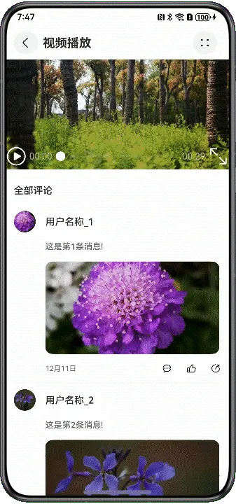

# 页面亮度设置

---

## 概述

在“视频播放”和“付款码展示”这两种典型场景下，应用需要在不同的页面分别设置不同的屏幕亮度，用户也可以自定义调节屏幕亮度，并且随着页面跳转而自动恢复系统亮度设置。


本文将这两种典型场景拆分为三个功能，帮助开发者掌握页面亮度设置的开发流程与细节。


- [视频播放页面亮度调节](https://developer.huawei.com/consumer/cn/doc/best-practices/bpta-page-brightness-settings#section02121449165218)
- [视频播放时页面常亮设置](https://developer.huawei.com/consumer/cn/doc/best-practices/bpta-page-brightness-settings#section13735111620212)
- [付款码页面高亮设置](https://developer.huawei.com/consumer/cn/doc/best-practices/bpta-page-brightness-settings#section689872941418)


## 实现原理

当前亮度设置的能力由窗口提供，设置亮度后，如果没有再次修改，亮度将不会发生变化（仅在应用内生效，退出应用恢复系统默认亮度）。


窗口作为亮度设置的媒介，窗口的改变会使得该窗口下所有页面的亮度都跟随改变，所以需要一套记录页面和监听页面变化的机制，动态设置不同页面下的亮度。


- 监听机制：[uiObserver.on('navDestinationUpdate')](https://developer.huawei.com/consumer/cn/doc/harmonyos-references/js-apis-arkui-observer#uiobserveronnavdestinationupdate)
- 亮度设置：[setWindowBrightness](https://developer.huawei.com/consumer/cn/doc/harmonyos-references/arkts-apis-window-window#setwindowbrightness9)
- 屏幕常亮：[setWindowKeepScreenOn](https://developer.huawei.com/consumer/cn/doc/harmonyos-references/arkts-apis-window-window#setwindowkeepscreenon9)


## 视频播放页面亮度调节


### 场景描述

视频播放场景，支持用户在视频页调节屏幕亮度，调整完亮度退出页面后其他页面仍为系统亮度，再次进入视频页，屏幕亮度会自动恢复成页面之前保存的亮度。


### 开发步骤

调节屏幕亮度：


1. 维护页面与亮度的映射关系。  

  
  
  

```typescript
1. private static brightnessMap: Map<string, number> =
2.  new Map([[Constants.NAV_DESTINATION_DEFAULT, this.DEFAULT_BRIGHTNESS],
3.  [Constants.NAV_DESTINATION_ITEM_PAY_CODE, this.MAX_BRIGHTNESS]]);


```
  [BrightnessUtil.ets](https://gitcode.com/HarmonyOS_Samples/AdjustBrightness/blob/e708f559086adb44a288ebe485ca1c96c1f7a92f/entry/src/main/ets/util/BrightnessUtil.ets#L28-L30)
  

2. 在视频播放器组件上添加滑动组件Slider。  

  
  
  

```cangjie
1. build() {
2.  Stack({ alignContent: Alignment.Start }) {
3.  Video({
4.  src: $rawfile('video1.mp4'),
5.  previewUri: $r('app.media.img_preview'),
6.  })
7.  .loop(true)
8.  .width(Constants.FULL_PERCENT)
9.  .height(Constants.FULL_PERCENT)
10.  .onStart(() => {
11.  this.brightnessViewModel.setWindowKeepScreenState(true);
12.  })
13.  .onPause(() => {
14.  this.brightnessViewModel.setWindowKeepScreenState(false);
15.  })
16.  Slider({
17.  value: this.currentBrightness,
18.  min: 0,
19.  max: 1,
20.  step: 0.01,
21.  style: SliderStyle.InSet,
22.  direction: Axis.Vertical,
23.  reverse: true
24.  })
25.  .trackColor('#66A0A0A4')
26.  .blockColor(Color.Transparent)
27.  .selectedColor(Color.White)
28.  .height('80%')
29.  .margin({ left: 24, bottom: 24 })
30.  .onChange((value: number, mode: SliderChangeMode) => { // Slider onChange callback
31.  if (mode === SliderChangeMode.Moving) {
32.  this.sliderOpacity = 1;
33.  this.brightnessViewModel.updateVideoBrightness(value);
34.  } else if (mode === SliderChangeMode.End) {
35.  this.sliderOpacity = 0;
36.  }
37.  })
38.  .opacity(this.sliderOpacity)
39.  .animation({
40.  duration: 300
41.  })
42.  }
43.  .width(Constants.FULL_PERCENT)
44.  .height(184)
45. }


```
  [VideoView.ets](https://gitcode.com/HarmonyOS_Samples/AdjustBrightness/blob/e708f559086adb44a288ebe485ca1c96c1f7a92f/entry/src/main/ets/view/VideoView.ets#L25-L71)
  

3. 通过滑动组件调节屏幕亮度，并将调节的亮度值缓存。  

  
  
  

```csharp
1. /**
2.  * Video playback page brightness adjustment execution function
3.  *
4.  * @param brightness Brightness value
5.  */
6. public static updateVideoBrightness(brightness: number): void {
7.  BrightnessUtil.setBrightness(brightness, Constants.SET_BRIGHTNESS_SLIDE);
8.  BrightnessUtil.brightnessMap.set(Constants.NAV_DESTINATION_ITEM_VIDEO, brightness);
9. }


```
  [BrightnessUtil.ets](https://gitcode.com/HarmonyOS_Samples/AdjustBrightness/blob/e708f559086adb44a288ebe485ca1c96c1f7a92f/entry/src/main/ets/util/BrightnessUtil.ets#L43-L51)
  

4. 返回首页，恢复屏幕默认亮度，重新进入视频播放页，恢复最后一次在视频播放页设置的亮度。  

  
  
  

```csharp
1. // Switch and listen to the routing page, and set the brightness of the cached page.
2. private navDestinationUpdateCallBack: Callback<NavDestinationInfo> = (info: NavDestinationInfo): void => {
3.  switch (info.state) {
4.  case uiObserver.NavDestinationState.ON_SHOWN:
5.  BrightnessUtil.setBrightness(info.name as string, Constants.SET_BRIGHTNESS_CLICK);
6.  BrightnessUtil.setStateBarContentColor(info.name as string, '#FFFFFF');
7.  break;
8.  case uiObserver.NavDestinationState.ON_HIDDEN:
9.  case uiObserver.NavDestinationState.ON_BACKPRESS:
10.  BrightnessUtil.setBrightness(Constants.NAV_DESTINATION_DEFAULT, Constants.SET_BRIGHTNESS_CLICK);
11.  BrightnessUtil.setStateBarContentColor(info.name as string, '#000000');
12.  break;
13.  default:
14.  break;
15.  }
16. };
17.
18. public registerNavigationListener(): void {
19.  uiObserver.on('navDestinationUpdate', this.navDestinationUpdateCallBack);
20. }
21.
22. public unRegisterNavigationListener(): void {
23.  uiObserver.off('navDestinationUpdate', this.navDestinationUpdateCallBack);
24. }


```
  [BrightnessViewModel.ets](https://gitcode.com/HarmonyOS_Samples/AdjustBrightness/blob/e708f559086adb44a288ebe485ca1c96c1f7a92f/entry/src/main/ets/viewmodel/BrightnessViewModel.ets#L23-L46)
  


### 实现效果

**图1** 视频播放页面





注：录屏无法录制亮度变化，以真机为准。


## 视频播放时页面常亮设置


### 场景描述

视频播放场景，在视频播放期间，即使用户没有屏幕交互操作，也希望保持屏幕常亮，直至视频播放完成或退出视频播放页。


### 开发步骤

1. 视频播放时保持屏幕常亮，暂停或退出页面，取消屏幕常亮。  

  
  
  

```javascript
1. Video({
2.  src: $rawfile('video1.mp4'),
3.  previewUri: $r('app.media.img_preview'),
4. })
5.  .loop(true)
6.  .width(Constants.FULL_PERCENT)
7.  .height(Constants.FULL_PERCENT)
8.  .onStart(() => {
9.  this.brightnessViewModel.setWindowKeepScreenState(true);
10.  })
11.  .onPause(() => {
12.  this.brightnessViewModel.setWindowKeepScreenState(false);
13.  })


```
  [VideoView.ets](https://gitcode.com/HarmonyOS_Samples/AdjustBrightness/blob/e708f559086adb44a288ebe485ca1c96c1f7a92f/entry/src/main/ets/view/VideoView.ets#L28-L40)
  

2. 设置屏幕常亮接口。  

  
  
  

```typescript
1. /**
2.  * Keep screen brightness
3.  *
4.  * @param isKeepOn true：keep；false:cancel keep
5.  */
6. public static setWindowKeepScreenState(isKeepOn: boolean): void {
7.  try {
8.  BrightnessUtil.windowClass?.setWindowKeepScreenOn(isKeepOn, (err: BusinessError) => {
9.  const errCode: number = err.code;
10.  if (errCode) {
11.  hilog.error(0x0000, TAG, `Failed set window keep screen state, errorCode: ${err.code}`);
12.  return;
13.  }
14.  hilog.info(0x0000, TAG, `Success set window keep screen state`);
15.  });
16.  } catch (err) {
17.  hilog.error(0x0000, TAG, `Failed set window keep screen state, errorCode: ${err.code}`);
18.  }
19. }


```
  [BrightnessUtil.ets](https://gitcode.com/HarmonyOS_Samples/AdjustBrightness/blob/e708f559086adb44a288ebe485ca1c96c1f7a92f/entry/src/main/ets/util/BrightnessUtil.ets#L75-L93)
  


### 实现效果

见图1 视频播放


注：录屏无法录制亮度变化，以真机为准。


## 付款码页面高亮设置


### 场景描述

一些包含支付功能的应用，用户进入付款码页面，应用自动设置屏幕最高亮度，退出付款码页面，恢复屏幕默认亮度。


### 开发步骤

1. 内存中维护一个页面与亮度的映射关系。  

  
  
  

```typescript
1. private static brightnessMap: Map<string, number> =
2.  new Map([[Constants.NAV_DESTINATION_DEFAULT, this.DEFAULT_BRIGHTNESS],
3.  [Constants.NAV_DESTINATION_ITEM_PAY_CODE, this.MAX_BRIGHTNESS]]);


```
  [BrightnessUtil.ets](https://gitcode.com/HarmonyOS_Samples/AdjustBrightness/blob/e708f559086adb44a288ebe485ca1c96c1f7a92f/entry/src/main/ets/util/BrightnessUtil.ets#L28-L30)
  

2. 监听页面切换事件，进入付款码页面，设置高亮，返回首页，恢复屏幕默认亮度。  

  
  
  

```csharp
1. // Switch and listen to the routing page, and set the brightness of the cached page.
2. private navDestinationUpdateCallBack: Callback<NavDestinationInfo> = (info: NavDestinationInfo): void => {
3.  switch (info.state) {
4.  case uiObserver.NavDestinationState.ON_SHOWN:
5.  BrightnessUtil.setBrightness(info.name as string, Constants.SET_BRIGHTNESS_CLICK);
6.  BrightnessUtil.setStateBarContentColor(info.name as string, '#FFFFFF');
7.  break;
8.  case uiObserver.NavDestinationState.ON_HIDDEN:
9.  case uiObserver.NavDestinationState.ON_BACKPRESS:
10.  BrightnessUtil.setBrightness(Constants.NAV_DESTINATION_DEFAULT, Constants.SET_BRIGHTNESS_CLICK);
11.  BrightnessUtil.setStateBarContentColor(info.name as string, '#000000');
12.  break;
13.  default:
14.  break;
15.  }
16. };
17.
18. public registerNavigationListener(): void {
19.  uiObserver.on('navDestinationUpdate', this.navDestinationUpdateCallBack);
20. }
21.
22. public unRegisterNavigationListener(): void {
23.  uiObserver.off('navDestinationUpdate', this.navDestinationUpdateCallBack);
24. }


```
  [BrightnessViewModel.ets](https://gitcode.com/HarmonyOS_Samples/AdjustBrightness/blob/e708f559086adb44a288ebe485ca1c96c1f7a92f/entry/src/main/ets/viewmodel/BrightnessViewModel.ets#L23-L46)
  


### 实现效果

**图2** 付款码页面


注：录屏无法录制亮度变化，以真机为准。


## 示例代码

- [实现页面亮度调节的功能](https://gitcode.com/harmonyos_samples/AdjustBrightness)
