# 页面间转场

---

## 概述

页面间转场是用户从一个页面切换到另一个页面时的过程，一个无缝流畅的转场动效可以提升用户的交互体验。从主页到详情页、从列表页到结果页都需要去设置一些转场动效，使得用户体验更加流畅。基于用户行为和应用设计模式，总结出了一些常见的转场场景，包括层级转场、搜索转场、新建转场、编辑转场、通用转场、跨应用转场。针对这些转场场景，根据“人因研究”（在 HarmonyOS 中，通过大量的人因研究为UX设计提供了系统性的科学指导），给各位开发者推荐一些适合本场景下的转场动效，常见的转场动效有左右位移遮罩动效、一镜到底动效等。


HarmonyOS为开发者提供了丰富的转场能力，如UIAbility转场、页面路由转场、组件转场。同时，HarmonyOS提供了一些基于场景化封装的相关高级模板化转场，如导航转场、模态转场、共享元素转场，来实现页面之间的转场效果。


在实际开发过程中，需要把上述UX设计视角转换为开发实现视角，即使用HarmonyOS提供的转场能力和动画能力来实现UX设计的场景和动效。在视角转化上，包含了分析UX设计视角、设计转场方案、使用转场与动画能力、使用高级模板化转场、调试和优化，详细可以参考[《合理使用动画》](https://developer.huawei.com/consumer/cn/doc/best-practices/bpta-fair-use-animation)。通过以上步骤，开发者可以将UX设计视角转换为开发实现视角，并将设计师提供的转场场景和动效转化为具体的代码实现。这样可以确保应用在实际使用中达到设计的预期效果，并提供良好的用户体验。


**图1** 合理使用导航组件和转场动效  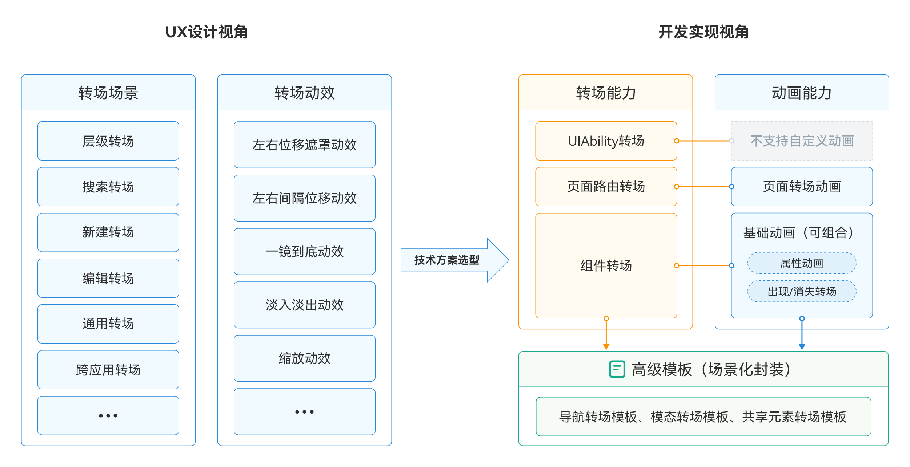


## 转场场景设计


### 转场动效

HarmonyOS系统为开发者提供了丰富的转场动效库，使开发者能够轻松实现各种转场动画效果。以下是一些在HarmonyOS系统中提供的转场动效：


- 左右位移遮罩动效：这种效果在转场过程中，页面元素会以左右方向进行位移，并且使用遮罩效果来过渡。这种转场效果常用于切换不同页面或者展示不同内容的情况，能够给用户带来明显的页面变化感。
- 左右间隔位移动效：这种效果在转场过程中，页面元素会以左右方向进行位移，但是与左右位移遮罩转场不同的是，元素之间会有一定的间隔。这种转场效果常用于展示多个相关页面之间的切换，能够给用户带来清晰的页面切换感。
- 一镜到底动效：这种效果在转场过程中，整个页面会以一种平滑的方式从一个场景过渡到另一个场景，仿佛是通过一镜到底的方式切换。这种转场效果常用于展示不同页面之间的关联性，能够给用户带来流畅的视觉体验。
- 淡入淡出动效：这种效果在转场过程中，页面元素会以逐渐淡入或淡出的方式进行过渡。这种转场效果常用于切换不同页面或者展示不同内容的情况，能够给用户带来柔和的视觉过渡效果。
- 缩放动效：这种效果在转场过程中，页面元素会以放大或缩小的方式进行过渡。这种转场效果常用于突出某个元素或者展示不同页面之间的层次感，能够给用户带来视觉上的冲击和焦点转移。


开发者可以根据具体需求，在应用的不同场景中应用这些转场动效，以提升用户体验和界面的吸引力。需要注意的是，为了最佳的用户体验，开发者应根据界面的功能和特点，合理选择转场动效，并遵循动效的使用准则，以确保转场动效在视觉和交互上的一致性。具体实现效果，请参考下一章节案例。


### 转场场景

**层级转场**


层级转场是指在用户界面中，从一个层级结构的界面状态转换到另一个层级结构的界面状态的过程，它通常用于在应用中进行页面间的导航和视图层级的变化。层级转场的场景可以划分为卡片、图表展开和列表展开：


- 列表展开：通常是完整的页面替换，开发者可以使用左右位移遮罩动效完成这类变化，见图2。


**图2** 左右位移遮罩在列表展开场景下的用例


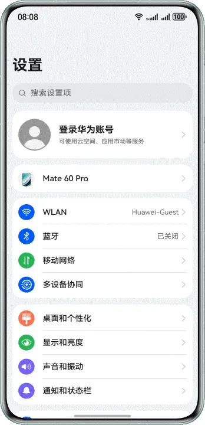


- 卡片/图表展开：单体独立卡片展开推荐使用一镜到底动效，见图3；相对复杂的组合卡片样式则需要由开发者以更为符合用户视觉流畅感为标准，根据实际情况选择左右位移遮罩动效或一镜到底动效。


**图3** 一镜到底在单体卡片场景下的用例  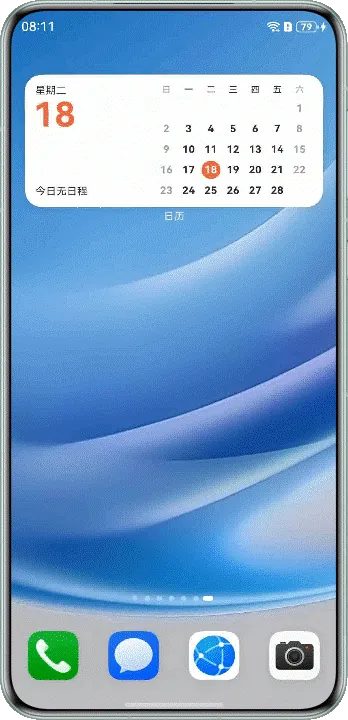


对于层级转场，推荐使用系统转场，页面转场采用左右位移的运动方式，不应单帧直接切换或上下位移切换，曲线优先使用弹簧曲线。


**搜索转场**


搜索转场是指在用户执行搜索操作，如在搜索栏中输入关键词并按下搜索按钮，或者直接触摸搜索图标时，应用改变页面以显示搜索结果的过程。它包含了固定搜索区域和非固定搜索区域两种情况：


- 固定搜索区域：在固定搜索区域中，大部分空间是不需要变化的，只是在上面增加了一层蒙版。主要变化区域集中在页眉，即搜索框和返回按键。当用户触发搜索操作时，页面可以使用淡入淡出动效来优化搜索体验，搜索框和返回按键通过渐变的方式进入视图，从而吸引用户的注意力，见图4。


**图4** 淡入淡出在固定搜索区域场景下的用例  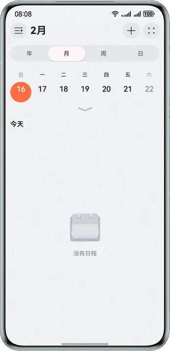


- 非固定搜索区域：在非固定搜索区域中，页面的变化更加复杂。为了保持用户的注意力和流畅的体验，可以使用一镜到底的动效，让搜索框始终保持在用户视线焦点中，相对忽视页面中其余变动较大的部分，见图5。


**图5** 一镜到底在非固定搜索区域场景下的用例  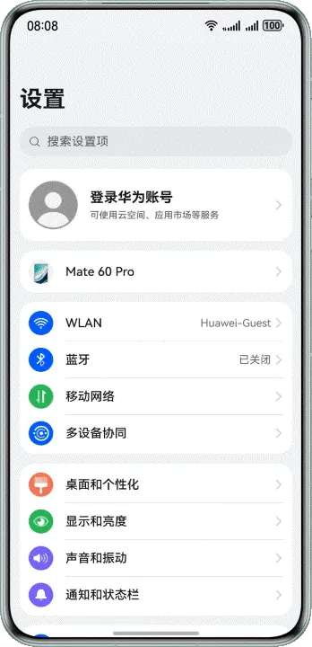


对于搜索转场，推荐使用共享元素转场，搜索框作为持续存在的元素串联前后两个界面，其他元素可采用淡入淡出或者其他过渡方式，不应单帧切换或非共享元素的方式转场。


**新建转场**


新建转场是指用户创建新内容或实体时，应用页面发生的过渡效果，它可以让用户感知到新的事物的添加或创建，并提供一种连贯和引人注目的视觉切换。由于新建页面中需要完成整个页面的替换，推荐开发者使用左右位移遮罩作为转场动效，如下图所示。


**图6** 左右位移遮罩在新建文本场景下的用例  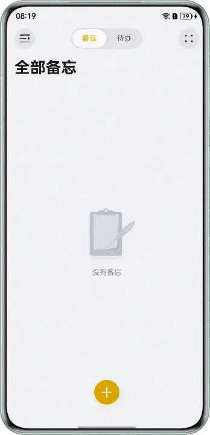


对于新建转场，推荐使用系统转场，页面转场采用左右位移的运动方式，不应单帧直接切换或上下位移切换，曲线优先使用弹簧曲线。


**编辑转场**


用户对现有内容或实体进行编辑时，例如点击“编辑”按钮，选择要编辑的项目或内容，或者执行其他与编辑相关的动作，应用应提供动效引导用户进入一个用于编辑现有内容的页面，修改所需的信息。在这个场景下，开发者需要达成的视觉效果是从编辑按键处弹出编辑页面，类似于单体卡片展开的效果。但由于一般的编辑按键并没有分明的外框，并不适用一镜到底的动效，此时淡入淡出能够提供类似于一镜到底的效果，如下图所示。


**图7** 淡入淡出在编辑联系人信息场景下的用例  


对于编辑转场，推荐使用系统转场，页面转场采用淡入淡出的过渡方式，不应单帧直接切换或位移切换。


**通用转场**


通用转场是一种广泛适用于不同情境和应用类型的页面过渡效果，目的是提供一种通用的、可重复使用的方式，以改善用户页面之间的切换，增强用户体验。其关键点在于要适用各种应用情境，包括不同类型的应用（例如社交媒体、电子商务、新闻等）和不同操作（例如导航、搜索、编辑等）。这就需要一种通用的、不需要复杂操作的动效来完成跳转任务，而缩放能够满足绝大多数用户的需求和视觉体验感受，如下图所示。


**图8** 缩放在单体卡片场景下的用例  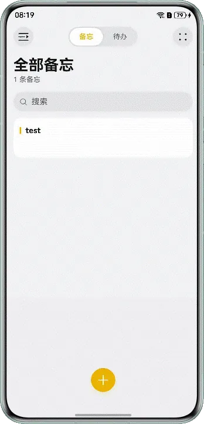


**跨应用转场**


跨应用转场是指用户从一个应用程序切换到另一个应用程序，用户能够无缝地从一个应用切换到另一个应用，而不会感到中断或不适。和以上几类转场都不同的是，用户点击应用内的链接、按钮或执行其他与外部应用交互的动作后，页面的跳转已经不仅仅存在于页面与页面之间，而是应用与应用之间，为此，推荐开发者使用专为此设计的左右间隔位移动效，跳转效果如下图所示。


**图9** 左右间隔位移在跨应用跳转场景下的用例  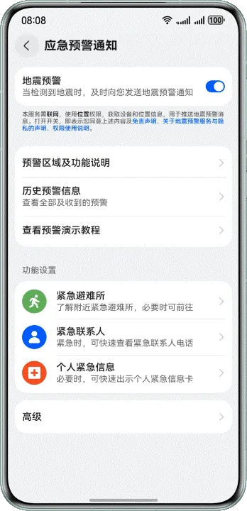


### 场景解构

转场是由交互行为引起的界面变化，分析界面元素在过程中的意义，定义其在转场中所在的类型，并将它们进行分类，元素所属的类别会影响它们使用怎样的转场能力，同时也将决定用什么类型的曲线和时长。


- 进场元素：转场中新出现的元素，一般是结果界面上的构成元素。

- 出场元素：转场中消失的元素，一般是上一界面中的构成元素。

- 持续元素：转场中持续存在的元素，可以是元素在布局上的变化，也可以是某种连续性的动画效果，整个过程无中断。

- 静止元素：转场中无任何变化的元素。
  **图10** 分析元素示例  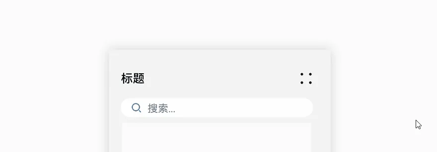
     如上图中示例，①是进场元素，②是出场元素，③是持续元素，④是静止元素。

     接下来，开发者需要根据分析的元素类型选择合适的转场能力，并综合考虑元素和页面的整体感官效果。不同的元素类型可能需要不同的转场方式来展现其特定的特征和交互效果。


## 转场场景开发


### 转场能力

开发人员接收到设计需求后，需要选择合适的转场能力完成该设计。HarmonyOS为开发者提供了UIAbility转场、页面路由和组件转场三种方式，在选择转场方式时，开发者需要考虑用户体验、界面一致性和业务需求，确保所选导航组件能够提供直观、易用的导航方式，帮助应用实现更好的转场效果。


- [UIAbility组件间交互](https://developer.huawei.com/consumer/cn/doc/harmonyos-guides/uiability-intra-device-interaction)：UIAbility是系统调度的最小单元。通过调用startAbility()方法启动UIAbility实现在设备内的功能模块之间的跳转。该UIAbility可以是应用内的其他UIAbility，也可以是其他应用的UIAbility（例如启动三方支付UIAbility）。
- 组件转场：组件转场是指通过HarmonyOS提供的各类组件来实现转场效果，以便更加便捷地展示不同的内容或功能模块。在组件转场中，可以使用诸如页面切换动画、过渡效果、布局变化等方式来实现页面之间的平滑切换。


### 动画能力

转场动画是指对将要出现或消失的组件做动画，对始终出现的组件做动画应使用属性动画。转场动画主要为了让开发者从繁重的消失节点管理中解放出来，如果用属性动画做组件转场，开发者需要在动画结束回调中删除组件节点。同时，由于动画结束前已经删除的组件节点可能会重新出现，还需要在结束回调中增加对节点状态的判断。


转场动画分为基础转场和高级模板化转场，[出现/消失转场](https://developer.huawei.com/consumer/cn/doc/harmonyos-guides/arkts-enter-exit-transition)是一种基础转场，是对新增、消失的控件实现动画效果的能力。为了简化开发者工作，HarmonyOS提供了以下高级模板，将属性动画和出现消失动画封装，开发者只需调用接口，可以轻松的完成页面转场：


- [导航转场](https://developer.huawei.com/consumer/cn/doc/harmonyos-guides/arkts-navigation-navigation)：页面的路由转场方式，对应一个界面消失，另外一个界面出现的动画效果，如设置应用一级菜单切换到二级界面。
- [模态转场](https://developer.huawei.com/consumer/cn/doc/harmonyos-guides/arkts-modal-transition)：新的界面覆盖在旧的界面之上的动画，旧的界面不消失，新的界面出现，如弹框就是典型的模态转场动画。
- [共享元素转场](https://developer.huawei.com/consumer/cn/doc/harmonyos-guides/arkts-shared-element-transition)：共享元素转场是一种界面切换时对相同或者相似的元素做的一种位置和大小匹配的过渡动画效果。


说明

在实现组件出现和消失的动画效果时，相比于组件动画（animateTo），推荐优先使用transition。因为animateTo需要在动画前后做两次属性更新，而transition只需做一次条件改变更新，性能更好。此外，使用transition可以避免在结束回调中做复杂逻辑处理，开发实现更容易。


建议开发者优先使用[Code Linter扫描工具](https://developer.huawei.com/consumer/cn/doc/harmonyos-guides/ide-code-linter)进行代码检查，重点关注[@performance/hp-arkui-use-transition-to-replace-animateto](https://developer.huawei.com/consumer/cn/doc/harmonyos-guides/ide_hp-arkui-use-transition-to-replace-animateto)规则。若扫描结果中出现该规则相关问题，可参考本章节提供的优化建议进行调整。


## 最佳实践案例


### 共享元素转场实现搜索转场

**场景描述**


在日常的各类应用交互场景中，搜索转场是极为常见的页面转场。通过点击当前页面的搜索栏会跳转进入搜索输入页面，详细效果如下所示。


**图11** 共享元素转场实现搜索转场  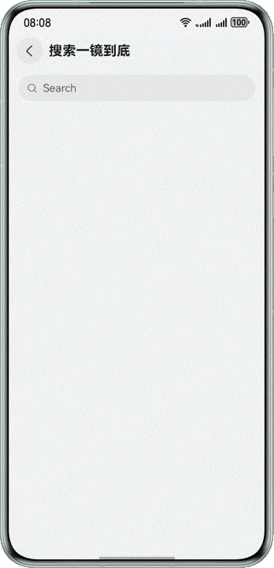


**实现原理**


在本案例中，搜索框会在转场中持续存在，且在转场前后有位置上的变化，可以使用共享元素转场让搜索框在转场过程中进行丝滑的上下文过渡。其实现步骤如下所示。


1. 在转场前的页面中，在搜索组件上设置geometryTransition属性和唯一ID。同时，需要配合显示动画animateTo才能实现动画效果。
2. 在转场后的页面中，在搜索组件上设置geometryTransition属性，并绑定唯一ID。


**开发步骤**


在转场前页面的搜索组件Search上设置geometryTransition属性，并在Search的onTouch中设置显示动画animateTo，其中curve为动画曲线。


```typescript
1. @Entry
2. @Component
3. struct SearchLongTakeTransitionPageOne {
4.  @State translateY: number = 0;
5.  @State transitionEffect: TransitionEffect = TransitionEffect.IDENTITY;
6.  private pageInfos: NavPathStack = new NavPathStack();
7.
8.  build() {
9.  NavDestination() {
10.  Column({ space: 20 }) {
11.  Search({ placeholder: 'Search' })
12.  .height(40)
13.  .placeholderColor($r('sys.color.mask_secondary'))
14.  .width('100%')
15.  // set geometry transition
16.  .geometryTransition('SEARCH_ONE_SHOT_DEMO_TRANSITION_ID', { follow: true })
17.  .backgroundColor('#0D000000')
18.  .defaultFocus(false)
19.  .focusOnTouch(false)
20.  .focusable(false)
21.  .onTouch((event: TouchEvent) => {
22.  if (event.type === TouchType.Up) {
23.  // set search animation
24.  this.showSearchPage();
25.  }
26.  })
27.  }
28.  .size({
29.  width: '90%',
30.  height: '100%'
31.  })
32.  }
33.  .transition(TransitionEffect.OPACITY)
34.  .backgroundColor('#F1F3F5')
35.  .title(getResourceString(this.getUIContext(), $r('app.string.search_title'), this))
36.  .onReady((context: NavDestinationContext) => {
37.  this.pageInfos = context.pathStack;
38.  })
39.  .onBackPressed(() => {
40.  this.transitionEffect = TransitionEffect.IDENTITY;
41.  this.pageInfos.pop(true);
42.  return true;
43.  })
44.  }
45.
46.  // Search animation
47.  private showSearchPage(): void {
48.  this.transitionEffect = TransitionEffect.OPACITY;
49.  this.getUIContext().animateTo({
50.  curve: curves.interpolatingSpring(0, 1, 342, 38)
51.  }, () => {
52.  this.pageInfos.pushPath({ name: 'SearchLongTakeTransitionPageTwo' }, false);
53.  })
54.  }
55. }

```


[SearchLongTakeTransitionPageOne.ets](https://gitcode.com/harmonyos_samples/transitions-collection/blob/master/entry/src/main/ets/feature/SearchLongTakeTransition/SearchLongTakeTransitionPageOne.ets#L25-L83)


在转场后的页面的搜索组件Search上绑定唯一ID。


```typescript
1. @Component
2. export default struct SearchLongTakeTransitionPageTwo {
3.  @Prop param: SearchPageExtraInfo;
4.  private pageInfos: NavPathStack = new NavPathStack();
5.
6.  build() {
7.  NavDestination() {
8.  Column() {
9.  Row({ space: 8 }) {
10.  Image($r('app.media.img'))
11.  .width(40)
12.  .height(40)
13.  .onClick(() => {
14.  this.onArrowClicked();
15.  })
16.  .transition(TransitionEffect.asymmetric(
17.  TransitionEffect.OPACITY
18.  .animation({ duration: 200, delay: 150, curve: curves.cubicBezierCurve(0.33, 0, 0.67, 1) }),
19.  TransitionEffect.OPACITY
20.  .animation({ duration: 200, curve: curves.cubicBezierCurve(0.33, 0, 0.67, 1) })
21.  ))
22.
23.  Search({ placeholder: 'DevEco Studio' })
24.  .height(40)
25.  .placeholderColor($r('sys.color.mask_secondary'))
26.  .width('85%')
27.  .backgroundColor('#0D000000')
28.  .height(40)
29.  // bind geometry id
30.  .geometryTransition('SEARCH_ONE_SHOT_DEMO_TRANSITION_ID')
31.  .transition(TransitionEffect.opacity(0.99))
32.  .defaultFocus(true)
33.  .focusOnTouch(true)
34.  }
35.  .width('100%')
36.  .height(50)
37.  .alignItems(VerticalAlign.Center)
38.  .padding(16)
39.  }
40.  .size({
41.  width: '100%',
42.  height: '100%'
43.  })
44.  .margin({ top: 16 })
45.  }
46.  .transition(TransitionEffect.OPACITY)
47.  .hideTitleBar(true)
48.  .backgroundColor('#F1F3F5')
49.  .onReady((context: NavDestinationContext) => {
50.  this.pageInfos = context.pathStack;
51.  })
52.  .onBackPressed(() => {
53.  this.getUIContext().animateTo({
54.  curve: curves.interpolatingSpring(0, 1, 342, 38),
55.  }, () => {
56.  this.pageInfos.pop(false);
57.  })
58.  return true;
59.  })
60.  }
61.
62.  private onArrowClicked(): void {
63.  this.getUIContext().animateTo({
64.  curve: curves.interpolatingSpring(0, 1, 342, 38)
65.  }, () => {
66.  this.pageInfos.pop(false);
67.  })
68.  }
69. }

```


[SearchLongTakeTransitionPageTwo.ets](https://gitcode.com/harmonyos_samples/transitions-collection/blob/master/entry/src/main/ets/feature/SearchLongTakeTransition/SearchLongTakeTransitionPageTwo.ets#L25-L93)


### 模态转场模板实现通用转场

**场景描述**


如图所示，在进入第一个页面时为半模态转场，通过半模态展现多种登录的方式。点击进入第二个页面时为全模态转场，展示了手机验证码登录页面。


**图12** 模态转场实现通用转场  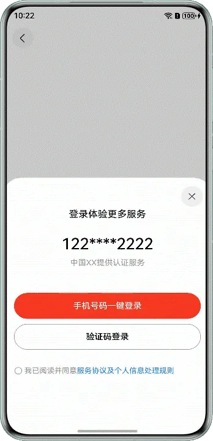


**实现原理**


在半模态转场和全模态转场中，两者实现的步骤基本相同，具体调用的接口有差异，详细实现步骤如下所示。


1. 定义模态展示界面，即提前准备需要展示的页面。
2. 通过模态接口调起模态展示界面。半模态转场使用bindSheet接口，全模态转场使用bindContentCover接口。通过模态接口绑定模态展示界面。
3. 设置接口参数，选择转场动画。


**开发步骤**


- 在半模态转场中，首先需要准备模态展示的页面，再通过bindSheet绑定模态展示界面。
  
  
  

```typescript
1. @Component
2. export struct HalfModalWindow {
3.  @Consume('NavPathStack') pageInfos: NavPathStack;
4.  // Whether to display the half-screen modal page.
5.  @State isPresent: boolean = false;
6.  // half-mode height
7.  @State sheetHeight: number = Constants.FONT_WEIGHT;
8.  // Whether to display the control bar
9.  @State showDragBar: boolean = true;
10.  // Determine whether to agree with the agreement
11.  @State isConfirmed: boolean = false;
12.  // Controlling Full-Modal Presentation
13.  @State isPresentInLoginView: boolean = false;
14.  // Transparency of the button for sending a verification code
15.  @State op: number = Constants.HALF_OPACITY;
16.  // Specifies the transition type
17.  // The value is false when the component is redirected from the semi-modal component to the mobile verification code component
18.  // and the value is true when the component is redirected from the account password component to the mobile verification code component
19.  @State isShowTransition: boolean = false;
20.  @State isCenter: boolean = true;
21.  @State screenW: number = 0;
22.  // According to the mode attribute description of Navigation
23.  // if Auto is used and the window width is greater than or equal to 600 vp, the Split mode is used for display
24.  curFoldStatus: display.FoldStatus | undefined = undefined;
25.  // Folded state of the current screen (valid only for devices with folded screens)
26.  // When the window width is less than 600 vp, the window is displayed in stack mode
27.  private deviceSize: number = Constants.DEFAULT_DEVICE_SIZE;
28.
29.  // ...
30.
31.  @Builder
32.  defaultLogin() {
33.  Column() {
34.  // CheckBox to control, semi-modal, full-modal, and semi-modal confirmations in the login page
35.  CaptchaLogin({
36.  isPresent: $isPresent,
37.  isPresentInLoginView: $isPresentInLoginView,
38.  isShowTransition: $isShowTransition
39.  })
40.  }
41.  }
42.
43.  @Builder
44.  halfModalLogin() {
45.  // semi-modal window page
46.  Column() {
47.  Text($r('app.string.multimodaltransion_after_login_more_service'))
48.  .fontColor(Color.Black)
49.  .fontSize($r('app.integer.font_size_normal'))
50.  .padding({ top: $r('app.integer.padding_top_large') })
51.
52.  Text($r('app.string.multimodaltransion_user_phone_number'))
53.  .fontColor(Color.Black)
54.  .fontSize($r('app.integer.font_size_large'))
55.  .fontWeight(Constants.FONT_WEIGHT_SM)
56.  .padding({
57.  top: $r('app.integer.font_size_large'),
58.  bottom: $r('app.integer.multimodaltransion_margin_default')
59.  })
60.
61.  Text($r('app.string.multimodaltransion_get_service'))
62.  .fontColor($r('app.color.multimodaltransion_grey_9'))
63.  .fontSize($r('app.integer.multimodaltransion_row_text_font_size'))
64.  .padding({ bottom: $r('app.integer.multimodaltransion_height_fifty') })
65.
66.  Button($r('app.string.multimodaltransion_phone_start_login'))
67.  .fontColor(Color.White)
68.  .type(ButtonType.Normal)
69.  .backgroundColor($r('app.color.multimodaltransion_red'))
70.  .onClick(() => {
71.  try {
72.  if (this.isConfirmed) {
73.  this.getUIContext()
74.  .getPromptAction()
75.  .showToast({ message: $r('app.string.multimodaltransion_login_success') });
76.  AppStorage.set('login', true);
77.  this.pageInfos.pop();
78.  } else {
79.  this.getUIContext()
80.  .getPromptAction()
81.  .showToast({ message: $r('app.string.multimodaltransion_please_read_and_agree') });
82.  }
83.  } catch (err) {
84.  let error = err as BusinessError;
85.  hilog.error(0x0000, 'HalfModalWindow', `login failed. error code=${error.code}, message=${error.message}`);
86.  }
87.  })
88.  .width($r('app.string.multimodaltransion_size_ninety_percent'))
89.  .height($r('app.integer.multimodaltransion_height_fifty'))
90.  .margin({
91.  left: $r('app.integer.main_page_padding2'),
92.  right: $r('app.integer.main_page_padding2'),
93.  bottom: $r('app.integer.multimodaltransion_row_padding_bottom')
94.  })
95.
96.  Button($r('app.string.multimodaltransion_captcha_login_text'))
97.  .fontColor(Color.Black)
98.  .borderRadius($r('app.integer.multimodaltransion_border_radius'))
99.  .type(ButtonType.Normal)
100.  .backgroundColor($r('app.color.multimodaltransion_btn_bgc'))
101.  .border({
102.  color: $r('app.color.multimodaltransion_half_modal_btn_bgc'),
103.  width: Constants.DEFAULT_ONE
104.  })
105.  .onClick(() => {
106.  if (this.isConfirmed) {
107.  this.isPresentInLoginView = true;
108.  this.isConfirmed = false;
109.  this.isShowTransition = false;
110.  } else {
111.  try {
112.  this.getUIContext()
113.  .getPromptAction()
114.  .showToast({ message: $r('app.string.multimodaltransion_please_read_and_agree') });
115.  } catch (err) {
116.  let error = err as BusinessError;
117.  hilog.error(0x0000, 'HalfModalWindow',
118.  `code login failed. error code=${error.code}, message=${error.message}`);
119.  }
120.  }
121.  })
122.  .width($r('app.string.multimodaltransion_size_ninety_percent'))
123.  .height($r('app.integer.multimodaltransion_height_fifty'))
124.  .margin({ bottom: $r('app.integer.font_size_large') })
125.  Blank()
126.
127.  Row() {
128.  Checkbox({ name: Constants.CHECK_BOX_NAME1 })
129.  .select(this.isConfirmed)
130.  .width($r('app.integer.font_size_sm'))
131.  .onChange((value: boolean) => {
132.  this.isConfirmed = value;
133.  })
134.  Text() {
135.  Span($r('app.string.multimodaltransion_read_and_agree'))
136.  .fontColor($r('app.color.multimodaltransion_grey_9'))
137.  Span($r('app.string.multimodaltransion_server_proxy_rule_detail'))
138.  .fontColor($r('app.color.multimodaltransion_note_color'))
139.  .onClick(() => {
140.  try {
141.  this.getUIContext()
142.  .getPromptAction()
143.  .showToast({ message: $r('app.string.multimodaltransion_only_show_ui') });
144.  } catch (err) {
145.  let error = err as BusinessError;
146.  hilog.error(0x0000, 'HalfModalWindow',
147.  `rule detail. error code=${error.code}, message=${error.message}`);
148.  }
149.  })
150.  }.fontSize($r('app.integer.font_size_sm'))
151.  }
152.  .margin({ left: $r('app.integer.multimodaltransion_other_ways_icon_height') })
153.  .width($r('app.string.multimodaltransion_size_full'))
154.  }
155.  }
156.
157.  build() {
158.  NavDestination() {
159.  Column() {
160.  //The Text component is bound for semi-modal display
161.  Text()
162.  .bindSheet($$this.isPresent, this.halfModalLogin(), {
163.  height: this.sheetHeight,
164.  dragBar: this.showDragBar,
165.  preferType: this.isCenter ? SheetType.CENTER : SheetType.POPUP,
166.  backgroundColor: $r('app.color.multimodaltransion_btn_bgc'),
167.  showClose: true,
168.  shouldDismiss: ((sheetDismiss: SheetDismiss) => {
169.  sheetDismiss.dismiss();
170.  this.pageInfos.pop();
171.  })
172.  })
173.  // ...
174.  }
175.  .expandSafeArea([SafeAreaType.SYSTEM], [SafeAreaEdge.TOP, SafeAreaEdge.BOTTOM])
176.  .justifyContent(FlexAlign.Center)
177.  .size({
178.  width: $r('app.string.multimodaltransion_size_full'),
179.  height: $r('app.string.multimodaltransion_size_full')
180.  })
181.  .padding($r('app.integer.multimodaltransion_padding_default'))
182.  }
183.  }
184. }

```
  [HalfModalWindow.ets](https://gitcode.com/harmonyos_samples/transitions-collection/blob/master/entry/src/main/ets/feature/MultiModalTransition/HalfModalWindow.ets#L28-L278)


- 在全模态转场中，其实现步骤与半模态转场类似，代码如下所示。
  
  
  

```typescript
1. @Component
2. export struct HalfModalWindow {
3.  @Consume('NavPathStack') pageInfos: NavPathStack;
4.  // Whether to display the half-screen modal page.
5.  @State isPresent: boolean = false;
6.  // half-mode height
7.  @State sheetHeight: number = Constants.FONT_WEIGHT;
8.  // Whether to display the control bar
9.  @State showDragBar: boolean = true;
10.  // Determine whether to agree with the agreement
11.  @State isConfirmed: boolean = false;
12.  // Controlling Full-Modal Presentation
13.  @State isPresentInLoginView: boolean = false;
14.  // Transparency of the button for sending a verification code
15.  @State op: number = Constants.HALF_OPACITY;
16.  // Specifies the transition type
17.  // The value is false when the component is redirected from the semi-modal component to the mobile verification code component
18.  // and the value is true when the component is redirected from the account password component to the mobile verification code component
19.  @State isShowTransition: boolean = false;
20.  @State isCenter: boolean = true;
21.  @State screenW: number = 0;
22.  // According to the mode attribute description of Navigation
23.  // if Auto is used and the window width is greater than or equal to 600 vp, the Split mode is used for display
24.  curFoldStatus: display.FoldStatus | undefined = undefined;
25.  // Folded state of the current screen (valid only for devices with folded screens)
26.  // When the window width is less than 600 vp, the window is displayed in stack mode
27.  private deviceSize: number = Constants.DEFAULT_DEVICE_SIZE;
28.
29.  // ...
30.
31.  @Builder
32.  defaultLogin() {
33.  Column() {
34.  // CheckBox to control, semi-modal, full-modal, and semi-modal confirmations in the login page
35.  CaptchaLogin({
36.  isPresent: $isPresent,
37.  isPresentInLoginView: $isPresentInLoginView,
38.  isShowTransition: $isShowTransition
39.  })
40.  }
41.  }
42.
43.  // ...
44.
45.  build() {
46.  NavDestination() {
47.  Column() {
48.  //The Text component is bound for semi-modal display
49.  // ...
50.  //The Text component is bound as the full-screen modal display of the mobile phone verification code component and the account and password component
51.  Text()
52.  .bindContentCover($$this.isPresentInLoginView, this.defaultLogin())
53.  }
54.  .expandSafeArea([SafeAreaType.SYSTEM], [SafeAreaEdge.TOP, SafeAreaEdge.BOTTOM])
55.  .justifyContent(FlexAlign.Center)
56.  .size({
57.  width: $r('app.string.multimodaltransion_size_full'),
58.  height: $r('app.string.multimodaltransion_size_full')
59.  })
60.  .padding($r('app.integer.multimodaltransion_padding_default'))
61.  }
62.  }
63. }

```
  [HalfModalWindow.ets](https://gitcode.com/harmonyos_samples/transitions-collection/blob/master/entry/src/main/ets/feature/MultiModalTransition/HalfModalWindow.ets#L27-L279)


## 总结与回顾

合理使用页面间转场是提升用户体验的重要技术之一，在应用开发过程中，通过动效的运用，可以使应用界面更加生动、流畅，并且能够引导用户的注意力，提高用户的操作效率。合理使用动效需要考虑以下几点：


- 符合界面设计需求：动效应该与应用的整体设计风格和用户期望相匹配，不应过于炫目或过于简单。动效的设计应该与应用的功能和交互逻辑相符，能够提供有意义的反馈和引导。
- 提高用户体验：动效可以增强用户对界面操作的反馈感知，使用户能够更直观地理解应用的状态和变化。例如，在页面切换时使用渐变效果或位移动画，可以使用户感到界面的流畅性和连贯性，提高用户的满意度和使用体验。
- 控制动效的频率和时长：动效的过度使用可能会让用户感到疲劳或干扰用户的操作。因此，在设计动效时需要注意控制动效的频率和时长，避免过多的动效干扰用户的操作和阅读。
- 考虑性能和流畅度：在使用动效时，需要考虑应用的性能和流畅度。过多或复杂的动效可能会导致应用的性能下降，影响用户的体验。因此，在设计动效时需要合理权衡动效的效果和应用的性能，确保动效的运行流畅和稳定。


在应用开发过程中，开发者可以借助HarmonyOS中提供的导航组件和转场动效，简化开发流程，提高开发效率，实现符合规范要求的转场动效效果。


## 示例代码

- [实现转场动效功能合集](https://gitcode.com/harmonyos_samples/transitions-collection)
