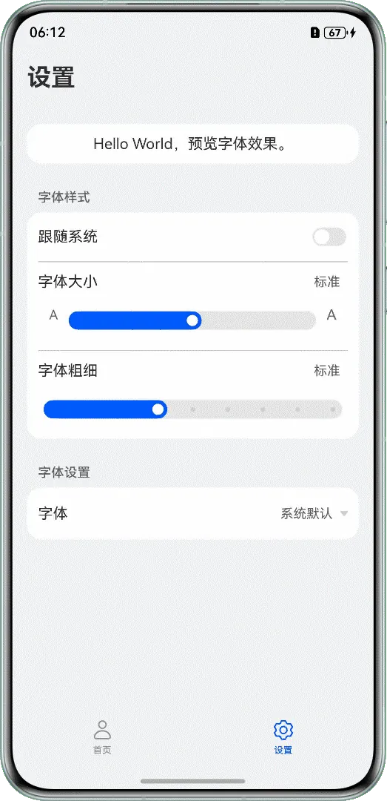
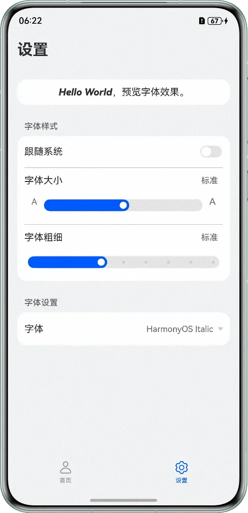
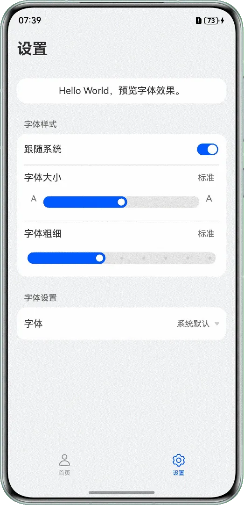

# 自定义字体设置

---

## 概述

在应用开发中，字体是用户界面的核心视觉元素之一，也是构建良好用户体验的关键要素之一，直接影响应用界面的美观性、可读性和用户体验。


ArkUI提供了全面的字体控制能力，如自定义设置字体大小和字重；支持通过[registerFont()](https://developer.huawei.com/consumer/cn/doc/harmonyos-references/arkts-apis-uicontext-font#registerfont)方法注册TTF和OTF自定义字体文件，或下载字体文件到沙箱内注册使用，实现字体的动态切换；支持省略号、自动缩放和换行控制等多种文本内容溢出处理策略，使开发者能够精细调整应用中的字体表现，满足应用多样化的设计需求。


本文将介绍以下字体设置场景的实现：


- [使用自定义字体显示文本](https://developer.huawei.com/consumer/cn/doc/best-practices/bpta-custom-font-settings#section148766114477)
- [从自定义字体恢复为系统字体](https://developer.huawei.com/consumer/cn/doc/best-practices/bpta-custom-font-settings#section994084874710)
- [使字体大小跟随系统设置](https://developer.huawei.com/consumer/cn/doc/best-practices/bpta-custom-font-settings#section1635772719497)
- [使字体大小不跟随系统设置](https://developer.huawei.com/consumer/cn/doc/best-practices/bpta-custom-font-settings#section161251820115015)


## 使用自定义字体显示文本

**场景描述**


在字体设置中，点击选择字体列表中的某个字体后，页面的字体样式会发生变化。在退出应用重新进入后，默认显示退出前选择的字体样式。





**实现原理**


registerFont()方法可以在字体管理器中注册自定义字体，支持注册TTF格式和OTF格式的字体文件。


[preferences (用户首选项)](https://developer.huawei.com/consumer/cn/doc/harmonyos-references/js-apis-data-preferences)则为应用提供了处理Key-Value键值型数据的能力，支持应用持久化轻量级数据，以及数据的修改和查询。


**开发步骤**


1. 创建首选项工具类PreferenceUtils，在类中定义如下方法：
  - getTextFontPreference()方法：在其中通过[getPreferencesSync()](https://developer.huawei.com/consumer/cn/doc/harmonyos-references/js-apis-data-preferences#preferencesgetpreferencessync10)方法获取首选项实例。
  - saveModifyFont()方法：在其中通过[putSync()](https://developer.huawei.com/consumer/cn/doc/harmonyos-references/js-apis-data-preferences#putsync10)方法将传入的字体信息数据写入首选项实例中，再使用[flush()](https://developer.huawei.com/consumer/cn/doc/harmonyos-references/js-apis-data-preferences#flush)方法将数据持久化存储。
  - getFont()方法：在其中通过[getSync()](https://developer.huawei.com/consumer/cn/doc/harmonyos-references/js-apis-data-preferences#getsync10)方法从首选项实例中获取存储的数据。


  
  
  

```typescript
1. export class PreferenceUtils {
2.  preference?: preferences.Preferences;
3.
4.  // Get Preferences instance
5.  getTextFontPreference(context: Context) {
6.  try {
7.  this.preference = preferences.getPreferencesSync(context, { name: 'TextFontPreference' });
8.  hilog.info(0x0000, TAG, 'create preference success');
9.  } catch (err) {
10.  let error = err as BusinessError;
11.  hilog.error(0x0000, TAG, `create preference failed. code: ${error.code}, message:${err.message}`);
12.  }
13.  }
14.
15.  // ...
16.
17.  // Save Font
18.  saveModifyFont(textFont: string) {
19.  try {
20.  this.preference?.putSync(TEXT_FONT, textFont);
21.  this.preference?.flush((err: BusinessError) => {
22.  if (err) {
23.  hilog.error(0x0000, TAG, `Failed to flush. code:${err.code}, message:${err.message}`);
24.  return;
25.  }
26.  hilog.info(0x0000, TAG, 'Succeeded in flushing.');
27.  })
28.  } catch (err) {
29.  let error = err as BusinessError;
30.  hilog.error(0x0000, TAG,
31.  `putSync or flush font preference data failed. code: ${error.code}, message:${err.message}`);
32.  }
33.  }
34.
35.  // Get Font
36.  getFont(): string {
37.  let textFont: string = '';
38.  try {
39.  textFont = this.preference?.getSync(TEXT_FONT, '') as string;
40.  } catch (err) {
41.  let error = err as BusinessError;
42.  hilog.error(0x0000, TAG, `getSync font preference data failed. code: ${error.code}, message:${err.message}`);
43.  }
44.  return textFont;
45.  }
46. }
47.
48. export default new PreferenceUtils();


```
  [CommonUtils.ets](https://gitcode.com/harmonyos_samples/text-display-font/blob/master/entry/src/main/ets/common/CommonUtils.ets#L27-L134)

2. 在EntryAbility的onCreate()生命周期中，调用getTextFontPreference()方法获取首选项实例。
  
  
  

```typescript
1. export default class EntryAbility extends UIAbility {
2.  onCreate(_want: Want, _launchParam: AbilityConstant.LaunchParam): void {
3.  // Get preference instance
4.  PreferenceUtils.getTextFontPreference(this.context);
5.  // ...
6.  }
7.
8.  // ...
9. }


```
  [EntryAbility.ets](https://gitcode.com/harmonyos_samples/text-display-font/blob/master/entry/src/main/ets/entryability/EntryAbility.ets#L31-L104)

3. 定义registerMyFont()方法注册自定义字体。     在使用时，需要通过UIContext中的[getFont()](https://developer.huawei.com/consumer/cn/doc/harmonyos-references/arkts-apis-uicontext-uicontext#getfont)方法获取当前UI上下文关联的Font对象，再通过该对象调用registerFont()方法注册字体。


  
  
  

```typescript
1. // Register font
2. export function registerMyFont(uiContext: UIContext) {
3.  try {
4.  // Register HarmonyOS Italic font through registrant Font
5.  uiContext.getFont().registerFont({
6.  familyName: $r('app.string.HarmonyOS_Italic'),
7.  familySrc: $rawfile('HarmonyOS_SansItalic.ttf')
8.  });
9.  // Register HarmonyOS Condensed font through registrant Font
10.  uiContext.getFont().registerFont({
11.  familyName: $r('app.string.HarmonyOS_Condensed'),
12.  familySrc: $rawfile('HarmonyOS_Condensed.ttf')
13.  });
14.  } catch (err) {
15.  let error = err as BusinessError;
16.  hilog.error(0x0000, TAG, `registerFont failed. code: ${error.code}, message:${err.message}`);
17.  }
18. }


```
  [CommonUtils.ets](https://gitcode.com/harmonyos_samples/text-display-font/blob/master/entry/src/main/ets/common/CommonUtils.ets#L138-L155)

4. 通过@StorageLink装饰变量fontOffset，标识当前选择的字体。在页面aboutToAppear()生命周期中，调用registerMyFont()方法并传入UIContext，注册自定义字体，并通过PreferenceUtils类调用getFont()方法，获取首选项中存储的数据，赋值给fontOffset，实现退出重新进入应用后显示退出前选择的字体。
  
  
  

```typescript
1. @StorageLink('fontOffset') fontOffset: string = '';
2. // ...
3.
4. aboutToAppear() {
5.  // ...
6.  // Get font data from preferences
7.  this.fontOffset = PreferenceUtils.getFont();
8.  // Register font
9.  registerMyFont(this.getUIContext());
10. }


```
  [SettingsPage.ets](https://gitcode.com/harmonyos_samples/text-display-font/blob/master/entry/src/main/ets/view/SettingsPage.ets#L23-L41)

5. 在MenuItem的onChange()事件中修改fontOffset的值，并通过saveModifyFont()方法，将选择的字体数据写入首选项并持久化存储。
  
  
  

```typescript
1. MenuItem({
2.  content: item === '' ? $r('app.string.system_default') : item,
3.  endIcon: this.fontOffset === item ? $r('app.media.checkmark') : ''
4. })
5.  .onChange(() => {
6.  this.fontOffset = item;
7.  PreferenceUtils.saveModifyFont(item);
8.  })


```
  [SettingsPage.ets](https://gitcode.com/harmonyos_samples/text-display-font/blob/master/entry/src/main/ets/view/SettingsPage.ets#L50-L57)

6. 通过fontFamily属性传入变量fontOffset，使用注册的自定义字体改变字体样式。
  
  
  

```typescript
1. // Example Text Content
2. Column() {
3.  Text($r('app.string.preview_text'))
4.  // ...
5.  .fontFamily(this.fontOffset)
6. }
7. .width('100%')
8. .padding(12)
9. .margin({ top: 35 })
10. .backgroundColor('#FFF')
11. .borderRadius(16)


```
  [SettingsPage.ets](https://gitcode.com/harmonyos_samples/text-display-font/blob/master/entry/src/main/ets/view/SettingsPage.ets#L80-L98)


## 从自定义字体恢复为系统字体

**场景描述**


在应用设置页面的字体设置中，点击选择系统默认字体，首页和设置页顶部的字体样式变为系统默认。退出并重新进入应用后，仍会显示系统默认字体。





**实现原理**


系统默认字体为无衬线字体HarmonyOS Sans，当fontFamily属性被显式设置为空字符串时，实际生效字体与不设置fontFamily时的效果一致，会回退到默认字体，字体样式、字重等其它属性可正常应用。


**开发步骤**


1. 方法定义参考：[使用自定义字体显示文本](https://developer.huawei.com/consumer/cn/doc/best-practices/bpta-custom-font-settings#li1099532613615)。
2. 在MenuItem的onChange()事件中修改fontOffset的值，并调用saveModifyFont()方法修改首选项的值。
  
  
  

```typescript
1. Menu() {
2.  ForEach(this.menuItemArr, (item: string) => {
3.  MenuItem({
4.  content: item === '' ? $r('app.string.system_default') : item,
5.  endIcon: this.fontOffset === item ? $r('app.media.checkmark') : ''
6.  })
7.  .onChange(() => {
8.  this.fontOffset = item;
9.  PreferenceUtils.saveModifyFont(item);
10.  })
11.  }, (item: string) => item)
12. }
13. // ...

```
  [SettingsPage.ets](https://gitcode.com/harmonyos_samples/text-display-font/blob/master/entry/src/main/ets/view/SettingsPage.ets#L47-L67)

3. 通过fontFamily属性传入变量fontOffset，使用注册的自定义字体改变字体样式。
  
  
  

```typescript
1. Text($r('app.string.preview_text'))
2.  // ...
3.  .fontFamily(this.fontOffset)

```
  [SettingsPage.ets](https://gitcode.com/harmonyos_samples/text-display-font/blob/master/entry/src/main/ets/view/SettingsPage.ets#L83-L90)


## 使字体大小跟随系统设置

**场景描述**


在设置页面中，点击打开Toggle按钮，使页面字体大小跟随系统设置发生变化。此时，自定义字体大小和字重的Slider将被禁用，无法滑动或点击。





**实现原理**


在应用的[app.json5](https://developer.huawei.com/consumer/cn/doc/harmonyos-guides/app-configuration-file)配置文件中，configuration标签是用于标识应用字体大小跟随系统变更的配置文件。当configuration的fontSizeScale属性取值为followSystem，且字体大小fontSize属性使用fp为像素单位时，在改变系统设置中的字体大小缩放比例后，应用中的字体也会相应变化。


**开发步骤**


1. 在AppScope/resources/base/profile下面定义配置文件xxx.json。     fontSizeScale属性取值（默认为nonFollowSystem不跟随系统）：


  - followSystem：跟随系统。
  - nonFollowSystem：不跟随系统。


  fontSizeMaxScale属性：用于设置应用字体大小在选择跟随系统后，相比系统字体的最大比例。
  
  

```cangjie
1. {
2.  "configuration": {
3.  "fontSizeScale": "followSystem",
4.  "fontSizeMaxScale": "2"
5.  }
6. }


```

2. 在app.json5配置文件中通过configuration字段，标识当前应用字体大小是否跟随系统配置。
  
  
  

```json
1. {
2.  "app": {
3.  "bundleName": "com.example.textdisplayfont",
4.  "vendor": "example",
5.  "versionCode": 1000000,
6.  "versionName": "1.0.0",
7.  "icon": "$media:layered_image",
8.  "label": "$string:app_name",
9.  "configuration": "$profile:configuration"
10.  }
11. }


```
  [app.json5](https://gitcode.com/harmonyos_samples/text-display-font/blob/master/AppScope/app.json5#L2-L12)

3. 配置完成后应用字体大小和字重即可随系统设置发生变化。

4. 在Toggle组件的onChange()方法中，修改变量toggleState的值。
  
  
  

```typescript
1. Toggle({ type: ToggleType.Switch, isOn: this.toggleState })
2.  .onChange((isOn: boolean) => {
3.  this.toggleState = isOn;
4.  })


```
  [SettingsPage.ets](https://gitcode.com/harmonyos_samples/text-display-font/blob/master/entry/src/main/ets/view/SettingsPage.ets#L113-L116)

5. 根据toggleState的值，控制Slider组件是否可交互。     当toggleState为true时，表示跟随系统，Slider不可点击或滑动；为false时，表示不跟随系统，Slider可以点击或滑动。


  
  
  

```typescript
1. Slider({
2.  min: -4,
3.  max: 4,
4.  value: this.fontSizeOffset,
5.  style: SliderStyle.InSet
6. })
7.  .width('90%')
8.  .margin({ top: 12 })
9.  .enabled(!this.toggleState)


```
  [SettingsPage.ets](https://gitcode.com/harmonyos_samples/text-display-font/blob/master/entry/src/main/ets/view/SettingsPage.ets#L145-L153)


## 使字体大小不跟随系统设置

**场景描述**


在设置页中点击关闭Toggle按钮，通过Slider组件可以调整页面字体大小。在系统设置中调整字体大小，页面字体不会发生变化。


**实现原理**


在应用的[app.json5](https://developer.huawei.com/consumer/cn/doc/harmonyos-guides/app-configuration-file)配置文件中，通过configuration标签标识了应用字体跟随系统设置，当字体大小fontSize属性使用屏幕物理像素单位px时，页面字体大小将不再受系统设置的影响。


**开发步骤**


1. 使用[getDefaultDisplaySync()](https://developer.huawei.com/consumer/cn/doc/harmonyos-references/js-apis-display#displaygetdefaultdisplaysync9)方法获取display屏幕实例对象，然后通过该display对象获取设备的物理像素密度[densityDPI](https://developer.huawei.com/consumer/cn/doc/harmonyos-references/js-apis-display#display)。将字体大小fp为单位的数值传入fp2pxUtil()方法，将其转换为对应的px数值。
  
  
  

```typescript
1. // Convert fp to px
2. export function fp2pxUtil(fp: number): string {
3.  const pxStr: string = 'px';
4.  let pxVal: number = 0;
5.  let displayClass: display.Display | null = null;
6.  try {
7.  displayClass = display.getDefaultDisplaySync();
8.  pxVal = fp * (displayClass.densityDPI / 160);
9.  } catch (err) {
10.  let error = err as BusinessError;
11.  hilog.error(0x0000, TAG, `get densityDPI failed. code: ${error.code}, message:${err.message}`);
12.  }
13.  return pxVal + pxStr;
14. }

```
  [CommonUtils.ets](https://gitcode.com/harmonyos_samples/text-display-font/blob/master/entry/src/main/ets/common/CommonUtils.ets#L159-L172)

2. 在页面中通过判断toggleState变量的值，控制字体单位的切换，实现页面字体是否跟随系统设置。
  - 当toggleState为true时：使用number类型的值，以fp为像素单位，页面字体跟随系统设置。
  - 当toggleState为false时：调用fp2pxUtil()方法，传入具体数值转为以px为单位的值，使页面字体不跟随系统设置。

  
  
  

```typescript
1. Text($r('app.string.setting'))
2.  .width('100%')
3.  .fontWeight(700)
4.  .fontSize(this.toggleState ? 26 : fp2pxUtil(26))

```
  [SettingsPage.ets](https://gitcode.com/harmonyos_samples/text-display-font/blob/master/entry/src/main/ets/view/SettingsPage.ets#L74-L77)


## 常见问题


### 如何获取系统缩放比例系数来修改应用内字体大小

1. 在app.json5中不配置configuration标签，或者在configuration标签指定的文件中，将fontSizeScale属性取值为nonFollowSystem不跟随系统，使应用字体大小不随系统设置发生变化。
2. 通过[onConfigurationUpdated()](https://developer.huawei.com/consumer/cn/doc/harmonyos-references/js-apis-app-ability-environmentcallback#onconfigurationupdated)获取系统设置中字体大小缩放比例fontSizeScale、字体粗细缩放比例fontWeightScale等变化的信息，再通过ApplicationContext.on('environment')对系统环境变化进行监听，可参考如下示例：
  
  
  

```typescript
1. // System environment change information
2. let envCallback: EnvironmentCallback = {
3.  onConfigurationUpdated(config) {
4.  envFont.fontSizeScale = config.fontSizeScale; // Font size scaling ratio
5.  envFont.fontWeightScale = config.fontWeightScale; // Font thickness scaling ratio
6.  },
7.  onMemoryLevel(level) {
8.  hilog.info(DOMAIN, TAG, `onMemoryLevel level: ${level}`);
9.  }
10. }
11. let appContext = this.context.getApplicationContext();
12. // Register to monitor changes in the system environment
13. callbackId = appContext.on('environment', envCallback);

```
  [EntryAbility.ets](https://gitcode.com/harmonyos_samples/text-display-font/blob/master/entry/src/main/ets/entryability/EntryAbility.ets#L37-L49)

3. 在需要修改字体大小的位置，将基础字体大小 * 字体大小缩放系数的值，传入fontSize()属性即可。


## 示例代码

- [实现字体设置功能](https://gitcode.com/harmonyos_samples/text-display-font)
