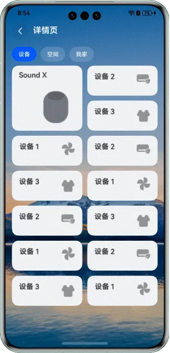

# Grid网格元素拖拽交换

---

## 概述

Grid网格元素拖拽交换功能在应用中经常会被使用，如当编辑九宫格图片需要拖拽图片改变排序时，就会使用到该功能。当网格中图片进行拖拽交换时，元素排列会跟随图片拖拽的位置而发生变化，并且会有对应的动画效果，以达到良好的用户体验。


Grid网格布局一般由[Grid](https://developer.huawei.com/consumer/cn/doc/harmonyos-references/ts-container-grid)容器组件和子组件[GridItem](https://developer.huawei.com/consumer/cn/doc/harmonyos-references/ts-container-griditem)构建组成，Grid用于设置网格布局相关参数，GridItem定义子组件相关特征。网格布局中含有网格元素，当给Grid容器组件设置[editMode](https://developer.huawei.com/consumer/cn/doc/harmonyos-references/ts-container-grid#editmode8)属性为true时，可开启Grid组件的编辑模式。首先，开启编辑模式。然后，给[GridItem](https://developer.huawei.com/consumer/cn/doc/harmonyos-references/ts-container-griditem)组件绑定[长按](https://developer.huawei.com/consumer/cn/doc/harmonyos-references/ts-basic-gestures-longpressgesture)、[拖拽](https://developer.huawei.com/consumer/cn/doc/harmonyos-references/ts-basic-gestures-pangesture)等手势。最后，需要添加动画属性[animateTo](https://developer.huawei.com/consumer/cn/doc/harmonyos-references/arkts-apis-uicontext-uicontext#animateto)，并设置相应的动画效果。最终，呈现出网格元素拖拽交换的动效过程，如下示意图。


## 实现原理


### 关键技术

Grid网格元素拖拽交换功能实现是通过[Grid](https://developer.huawei.com/consumer/cn/doc/harmonyos-references/ts-container-grid)容器组件、[组合手势](https://developer.huawei.com/consumer/cn/doc/harmonyos-references/ts-combined-gestures)、动画属性[animateTo](https://developer.huawei.com/consumer/cn/doc/harmonyos-references/arkts-apis-uicontext-uicontext#animateto)结合来实现的。


- Grid组件可以构建网格元素布局。
- 组合手势可以实现元素拖拽交换的效果。
- 显式动画可以给元素拖拽交换的过程中，添加动画效果。


注意

Grid组件当前支持GridItem拖拽动画，通过给Grid容器组件设置[supportAnimation](https://developer.huawei.com/consumer/cn/doc/harmonyos-references/ts-container-grid#supportanimation8)为true，即可开启动画效果。但仅支持在滚动模式下（设置[rowsTemplate](https://developer.huawei.com/consumer/cn/doc/harmonyos-references/ts-container-grid#rowstemplate)、[columnsTemplate](https://developer.huawei.com/consumer/cn/doc/harmonyos-references/ts-container-grid#columnstemplate)其中一个）支持动画。且仅在大小规则的Grid中支持拖拽动画，跨行或跨列场景不支持。因此，在跨行或跨列场景下，需要通过自定义Grid布局、自定义手势和显式动画来实现拖拽交换的效果。


### 开发流程

在需要拖拽交换的场景中：


- 实现Grid布局，启动[editMode](https://developer.huawei.com/consumer/cn/doc/harmonyos-references/ts-container-grid#editmode8)编辑模式，进入编辑模式可以拖拽Grid组件内部[GridItem](https://developer.huawei.com/consumer/cn/doc/harmonyos-references/ts-container-griditem)。
- 给网格元素[GridItem](https://developer.huawei.com/consumer/cn/doc/harmonyos-references/ts-container-griditem)绑定相关手势，实现可拖拽操作。
- 使用显式动画[animateTo](https://developer.huawei.com/consumer/cn/doc/harmonyos-references/arkts-apis-uicontext-uicontext#animateto)，实现[GridItem](https://developer.huawei.com/consumer/cn/doc/harmonyos-references/ts-container-griditem)拖拽过程中的动画效果。


## 相同大小网格元素，长按拖拽


### 场景描述


在编辑九宫格等多图的场景中，长按图片（网格元素）可以拖拽交换排序，拖拽图片的过程中，旁边的图片也会即时移动，以产生新的宫格排布。


示意效果图如下。


### 开发步骤


1. Grid布局及相同大小的GridItem界面开发。其中，[scrollBar](https://developer.huawei.com/consumer/cn/doc/harmonyos-references/ts-container-grid#scrollbar)可设置滚动条状态，值为BarState.Off时，表示不显示滚动条；[columnsTemplate](https://developer.huawei.com/consumer/cn/doc/harmonyos-references/ts-container-grid#columnstemplate)可设置当前网格布局列的数量、固定列宽或最小列宽值；[columnsGap](https://developer.huawei.com/consumer/cn/doc/harmonyos-references/ts-container-grid#columnsgap)可设置列与列的间距；[rowsGap](https://developer.huawei.com/consumer/cn/doc/harmonyos-references/ts-container-grid#rowsgap)可设置行与行的间距。
  
  
  

```typescript
1. Grid() {
2.  ForEach(this.numbers, (item: number) => {
3.  GridItem() {
4.  Image($r(`app.media.image${item}`))
5.  .width('100%')
6.  .height(this.curBp === 'md' ? 131 : 105)
7.  .draggable(false)
8.  .animation({ curve: Curve.Sharp, duration: 300 })
9.  }
10.  }, (item: number) => item.toString())
11. }
12. .width(this.curBp === 'md' ? '66%' : '100%')
13. .scrollBar(BarState.Off)
14. .columnsTemplate('1fr 1fr 1fr')
15. .columnsGap(this.curBp === 'md' ? 6 : 4)
16. .rowsGap(this.curBp === 'md' ? 6 : 4)
17. .height(this.curBp === 'md' ? 406 : 323)

```
  [SameItemDrag.ets](https://gitcode.com/HarmonyOS_Samples/grid-drag-sort/blob/master/entry/src/main/ets/pages/SameItemDrag.ets#L124-L140)

2. 给Grid组件设置[editMode](https://developer.huawei.com/consumer/cn/doc/harmonyos-references/ts-container-grid#editmode8)为true，即Grid进入编辑模式，进入编辑模式可以拖拽Grid组件内部[GridItem](https://developer.huawei.com/consumer/cn/doc/harmonyos-references/ts-container-griditem)。设置[supportAnimation](https://developer.huawei.com/consumer/cn/doc/harmonyos-references/ts-container-grid#supportanimation8)为true，即Grid拖拽元素时支持动画。
  
  
  

```typescript
1. .editMode(true)
2. .supportAnimation(true)

```
  [SameItemDrag.ets](https://gitcode.com/HarmonyOS_Samples/grid-drag-sort/blob/master/entry/src/main/ets/pages/SameItemDrag.ets#L144-L145)

3. 定义拖拽过程中的数组交换逻辑。
  
  
  

```typescript
1. changeIndex(index1: number, index2: number) {
2.  let tmp = this.numbers.splice(index1, 1);
3.  this.numbers.splice(index2, 0, tmp[0])
4. }

```
  [SameItemDrag.ets](https://gitcode.com/HarmonyOS_Samples/grid-drag-sort/blob/master/entry/src/main/ets/pages/SameItemDrag.ets#L57-L60)

4. 给Grid组件绑定[onItemDragStart](https://developer.huawei.com/consumer/cn/doc/harmonyos-references/ts-container-grid#onitemdragstart8)和[onItemDrop](https://developer.huawei.com/consumer/cn/doc/harmonyos-references/ts-container-grid#onitemdrop8)事件，在[onItemDragStart](https://developer.huawei.com/consumer/cn/doc/harmonyos-references/ts-container-grid#onitemdragstart8)回调中设置拖拽过程中显示的图片，并在[onItemDrop](https://developer.huawei.com/consumer/cn/doc/harmonyos-references/ts-container-grid#onitemdrop8)中完成交换数组位置的逻辑。
  [onItemDragStart](https://developer.huawei.com/consumer/cn/doc/harmonyos-references/ts-container-grid#onitemdragstart8)回调在开始拖拽网格元素时触发，[onItemDrop](https://developer.huawei.com/consumer/cn/doc/harmonyos-references/ts-container-grid#onitemdrop8)回调当在网格元素内停止拖拽时触发。
  
  
  

```typescript
1. .onItemDragStart((_, itemIndex: number) => {
2.  this.imageNum = this.numbers[itemIndex];
3.  return this.pixelMapBuilder();
4. })
5. .onItemDrop((_, itemIndex: number, insertIndex: number, isSuccess: boolean) => {
6.  if (!isSuccess || insertIndex >= this.numbers.length) {
7.  return;
8.  }
9.  this.changeIndex(itemIndex, insertIndex);
10. })

```
  [SameItemDrag.ets](https://gitcode.com/HarmonyOS_Samples/grid-drag-sort/blob/master/entry/src/main/ets/pages/SameItemDrag.ets#L149-L158)


## 不同大小网格元素，长按拖拽


### 场景描述


在一些展示设备的场景中，会有大小不同的网格元素。当用户想改变设备排序时，可以长按设备图片（网格元素）拖拽交换排序，拖拽的过程中，也会改变排列顺序，以产生新的宫格排布。


示意效果图如下。





说明

当前方案仅适用于页面包含一个较大网格元素的布局。


### 开发步骤


1. Grid布局及不同大小的GridItem界面开发。
  
  
  

```typescript
1. Grid() {
2.  ForEach(this.numbers, (item: number) => {
3.  GridItem() {
4.  Stack({ alignContent: Alignment.TopEnd }) {
5.  Image(this.changeImage(item))
6.  .width('100%')
7.  .borderRadius(16)
8.  .objectFit(this.curBp === 'md' ? ImageFit.Fill : ImageFit.Cover)
9.  .draggable(false)
10.  .animation({ curve: Curve.Sharp, duration: 300 })
11.  }
12.  }
13.  .rowStart(0)
14.  .rowEnd(this.getRowEnd(item))
15.  .scale({ x: this.scaleItem === item ? 1.02 : 1, y: this.scaleItem === item ? 1.02 : 1 })
16.  .zIndex(this.dragItem === item ? 1 : 0)
17.  .translate(this.dragItem === item ? { x: this.offsetX, y: this.offsetY } : { x: 0, y: 0 })
18.  .hitTestBehavior(this.isDraggable(this.numbers.indexOf(item)) ? HitTestMode.Default : HitTestMode.None)
19.  // ...
20.  }, (item: number) => item.toString())
21. }
22. .width('100%')
23. .height('100%')
24. .editMode(true)
25. .scrollBar(BarState.Off)
26. .columnsTemplate('1fr 1fr')
27. .supportAnimation(true)
28. .columnsGap(12)
29. .rowsGap(12)
30. .enableScrollInteraction(true)

```
  [DifferentItemDrag.ets](https://gitcode.com/HarmonyOS_Samples/grid-drag-sort/blob/master/entry/src/main/ets/pages/DifferentItemDrag.ets#L274-L359)

2. 定义网格元素移动过程中的相关计算函数，其中itemMove()方法是实现元素交换重新排序的方法。
  
  
  

```typescript
1. itemMove(index: number, newIndex: number): void {
2.  if (!this.isDraggable(newIndex)) {
3.  return;
4.  }
5.  let tmp = this.numbers.splice(index, 1);
6.  this.numbers.splice(newIndex, 0, tmp[0]);
7.  this.bigItemIndex = this.numbers.findIndex((item) => item === 0);
8. }
9.
10. isInLeft(index: number) {
11.  if (index === this.bigItemIndex) {
12.  return index % 2 == 0;
13.  }
14.  if (this.bigItemIndex % 2 === 0) {
15.  if (index - this.bigItemIndex === 2 || index - this.bigItemIndex === 1) {
16.  return false;
17.  }
18.  } else {
19.  if (index - this.bigItemIndex === 1) {
20.  return false;
21.  }
22.  }
23.  if (index > this.bigItemIndex) {
24.  return index % 2 == 1;
25.  } else {
26.  return index % 2 == 0;
27.  }
28. }
29.
30. down(index: number): void {
31.  if ([this.numbers.length - 1, this.numbers.length - 2].includes(index)) {
32.  return;
33.  }
34.  if (this.bigItemIndex - index === 1) {
35.  return;
36.  }
37.  if ([14, 15].includes(this.bigItemIndex) && this.bigItemIndex === index) {
38.  return;
39.  }
40.  this.offsetY -= this.FIX_VP_Y;
41.  this.dragRefOffSetY += this.FIX_VP_Y;
42.  if (index - 1 === this.bigItemIndex) {
43.  this.itemMove(index, index + 1);
44.  } else {
45.  this.itemMove(index, index + 2);
46.  }
47. }
48.
49. up(index: number): void {
50.  if (!this.isDraggable(index - 2)) {
51.  return;
52.  }
53.  if (index - this.bigItemIndex === 3) {
54.  return;
55.  }
56.  this.offsetY += this.FIX_VP_Y;
57.  this.dragRefOffSetY -= this.FIX_VP_Y;
58.  if (this.bigItemIndex === index) {
59.  this.itemMove(index, index - 2);
60.  } else {
61.  if (index - 2 === this.bigItemIndex) {
62.  this.itemMove(index, index - 1);
63.  } else {
64.  this.itemMove(index, index - 2);
65.  }
66.  }
67. }
68.
69. left(index: number): void {
70.  if (this.bigItemIndex % 2 === 0) {
71.  if (index - this.bigItemIndex === 2) {
72.  return;
73.  }
74.  }
75.  if (this.isInLeft(index)) {
76.  return;
77.  }
78.  if (!this.isDraggable(index - 1)) {
79.  return;
80.  }
81.  this.offsetX += this.FIX_VP_X;
82.  this.dragRefOffSetX -= this.FIX_VP_X;
83.  this.itemMove(index, index - 1)
84. }
85.
86. right(index: number): void {
87.  if (this.bigItemIndex % 2 === 1) {
88.  if (index - this.bigItemIndex === 1) {
89.  return;
90.  }
91.  }
92.  if (!this.isInLeft(index)) {
93.  return;
94.  }
95.  if (!this.isDraggable(index + 1)) {
96.  return;
97.  }
98.  this.offsetX -= this.FIX_VP_X;
99.  this.dragRefOffSetX += this.FIX_VP_X;
100.  this.itemMove(index, index + 1)
101. }
102.
103. isDraggable(index: number): boolean {
104.  return index >= 0;
105. }

```
  [DifferentItemDrag.ets](https://gitcode.com/HarmonyOS_Samples/grid-drag-sort/blob/master/entry/src/main/ets/pages/DifferentItemDrag.ets#L76-L180)

3. GridItem绑定组合手势：长按，拖拽。并在手势的回调函数中设置显式动画。
  
  
  

```kotlin
1. .gesture(
2.  GestureGroup(GestureMode.Sequence,
3.  LongPressGesture({ repeat: true })
4.  .onAction(() => {
5.  this.getUIContext().animateTo({ curve: Curve.Friction, duration: 300 }, () => {
6.  this.scaleItem = item;
7.  })
8.  })
9.  .onActionEnd(() => {
10.  this.getUIContext().animateTo({ curve: Curve.Friction, duration: 300 }, () => {
11.  this.scaleItem = -1;
12.  })
13.  }),
14.  PanGesture({ fingers: 1, direction: null, distance: 0 })
15.  .onActionStart(() => {
16.  this.dragItem = item;
17.  this.dragRefOffSetX = 0;
18.  this.dragRefOffSetY = 0;
19.  })
20.  .onActionUpdate((event: GestureEvent) => {
21.  this.offsetX = event.offsetX - this.dragRefOffSetX;
22.  this.offsetY = event.offsetY - this.dragRefOffSetY;
23.  this.getUIContext().animateTo({ curve: curves.interpolatingSpring(0, 1, 400, 38) }, () => {
24.  let index = this.numbers.indexOf(this.dragItem);
25.  if (this.offsetY >= this.FIX_VP_Y / 2 && (this.offsetX <= 44 && this.offsetX >= -44)) {
26.  this.down(index);
27.  } else if (this.offsetY <= -this.FIX_VP_Y / 2 && (this.offsetX <= 44 && this.offsetX >= -44)) {
28.  this.up(index);
29.  } else if (this.offsetX >= this.FIX_VP_X / 2 && (this.offsetY <= 50 && this.offsetY >= -50)) {
30.  this.right(index);
31.  } else if (this.offsetX <= -this.FIX_VP_X / 2 && (this.offsetY <= 50 && this.offsetY >= -50)) {
32.  this.left(index);
33.  }
34.  })
35.  })
36.  .onActionEnd(() => {
37.  this.getUIContext().animateTo({ curve: curves.interpolatingSpring(0, 1, 400, 38) }, () => {
38.  this.dragItem = -1;
39.  })
40.  this.getUIContext().animateTo({ curve: curves.interpolatingSpring(14, 1, 170, 17), delay: 150 }, () => {
41.  this.scaleItem = -1;
42.  })
43.  })
44.  )
45.  .onCancel(() => {
46.  this.getUIContext().animateTo({ curve: curves.interpolatingSpring(0, 1, 400, 38) }, () => {
47.  this.dragItem = -1;
48.  })
49.  this.getUIContext().animateTo({ curve: curves.interpolatingSpring(14, 1, 170, 17), delay: 150 }, () => {
50.  this.scaleItem = -1;
51.  })
52.  })
53. )

```
  [DifferentItemDrag.ets](https://gitcode.com/HarmonyOS_Samples/grid-drag-sort/blob/master/entry/src/main/ets/pages/DifferentItemDrag.ets#L294-L346)


## 两个Grid之间网格元素交换


当场景涉及两个Grid之间的网格元素交换时，可使用[GridObjectSortComponent](https://developer.huawei.com/consumer/cn/doc/harmonyos-references/ohos-arkui-advanced-gridobjectsortcomponent)组件来实现。可以点击添加或者移除按钮，对网格元素进行交换。详细实现步骤请参见：[示例](https://developer.huawei.com/consumer/cn/doc/harmonyos-references/ohos-arkui-advanced-gridobjectsortcomponent#%E7%A4%BA%E4%BE%8B)。开发者也可以在[GridObjectSortComponent](https://developer.huawei.com/consumer/cn/doc/harmonyos-references/ohos-arkui-advanced-gridobjectsortcomponent)组件的[源码](https://gitcode.com/openharmony/arkui_ace_engine/blob/master/advanced_ui_component/gridobjectsortcomponent/source/GridObjectSortComponent.ets)基础上进行相应修改，实现更加丰富的功能。


## 网格元素直接拖拽，不需长按


### 场景描述


在不需要长按拖拽的场景下，开发者可以将元素设置成直接拖拽，无需长按，即可完成元素的拖拽交换。


示意效果图如下。


### 开发步骤


1. 使用Grid布局及GridItem界面开发。
  
  
  

```typescript
1. Grid() {
2.  ForEach(this.numbers, (item: number) => {
3.  GridItem() {
4.  Column() {
5.  Image($r(`app.media.space${item}`))
6.  .width(44)
7.  .height(44)
8.  .draggable(false)
9.  Image($r('app.media.space_bottom'))
10.  .width(16)
11.  .height(16)
12.  .draggable(false)
13.  }
14.  .width('100%')
15.  .height(73)
16.  .justifyContent(FlexAlign.Center)
17.  .borderRadius(10)
18.  .backgroundColor('#F1F3F5')
19.  .animation({ curve: Curve.Sharp, duration: 300 })
20.  }
21.  .scale({ x: this.scaleItem === item ? 1.05 : 1, y: this.scaleItem === item ? 1.05 : 1 })
22.  .zIndex(this.dragItem === item ? 1 : 0)
23.  .translate(this.dragItem === item ? { x: this.offsetX, y: this.offsetY } : { x: 0, y: 0 })
24.  // ...
25.  }, (item: number) => item.toString())
26. }
27. .width('100%')
28. .editMode(true)
29. .scrollBar(BarState.Off)
30. .columnsTemplate(this.curBp === 'md' ? '1fr 1fr 1fr 1fr 1fr' : '1fr 1fr 1fr 1fr')
31. .columnsGap(12)
32. .rowsGap(12)
33. .margin({ top: 5 })

```
  [DirectDragItem.ets](https://gitcode.com/HarmonyOS_Samples/grid-drag-sort/blob/master/entry/src/main/ets/pages/DirectDragItem.ets#L235-L322)

2. 定义网格元素移动过程中的相关计算函数。
  
  
  

```typescript
1. itemMove(index: number, newIndex: number): void {
2.  if (!this.isDraggable(newIndex)) {
3.  return;
4.  }
5.  let tmp = this.numbers.splice(index, 1);
6.  this.numbers.splice(newIndex, 0, tmp[0]);
7. }
8.
9. down(index: number): void {
10.  if (!this.isDraggable(index + 5)) {
11.  return;
12.  }
13.  this.offsetY -= this.FIX_VP_Y;
14.  this.dragRefOffSetY += this.FIX_VP_Y;
15.  this.itemMove(index, index + 5)
16. }
17.
18. up(index: number): void {
19.  if (this.curBp === 'md') {
20.  if (!this.isDraggable(index - 5)) {
21.  return;
22.  }
23.  this.offsetY += this.FIX_VP_Y;
24.  this.dragRefOffSetY -= this.FIX_VP_Y;
25.  this.itemMove(index, index - 5)
26.  } else {
27.  if (!this.isDraggable(index - 4)) {
28.  return;
29.  }
30.  this.offsetY += this.FIX_VP_Y;
31.  this.dragRefOffSetY -= this.FIX_VP_Y;
32.  this.itemMove(index, index - 4)
33.  }
34. }
35.
36. left(index: number): void {
37.  if (!this.isDraggable(index - 1)) {
38.  return;
39.  }
40.  this.offsetX += this.FIX_VP_X;
41.  this.dragRefOffSetX -= this.FIX_VP_X;
42.  this.itemMove(index, index - 1)
43. }
44.
45. right(index: number): void {
46.  if (!this.isDraggable(index + 1)) {
47.  return;
48.  }
49.  this.offsetX -= this.FIX_VP_X;
50.  this.dragRefOffSetX += this.FIX_VP_X;
51.  this.itemMove(index, index + 1)
52. }
53.
54. lowerRight(index: number): void {
55.  if (!this.isDraggable(index + 3)) {
56.  return;
57.  }
58.  this.offsetX -= this.FIX_VP_X;
59.  this.dragRefOffSetX += this.FIX_VP_X;
60.  this.offsetY -= this.FIX_VP_Y;
61.  this.dragRefOffSetY += this.FIX_VP_Y;
62.  this.itemMove(index, index + 3);
63. }
64.
65. upperRight(index: number): void {
66.  if (!this.isDraggable(index - 3)) {
67.  return;
68.  }
69.  this.offsetX -= this.FIX_VP_X;
70.  this.dragRefOffSetX += this.FIX_VP_X;
71.  this.offsetY += this.FIX_VP_Y;
72.  this.dragRefOffSetY -= this.FIX_VP_Y;
73.  this.itemMove(index, index - 3);
74. }
75.
76. lowerLeft(index: number): void {
77.  if (!this.isDraggable(index + 3)) {
78.  return;
79.  }
80.  this.offsetX += this.FIX_VP_X;
81.  this.dragRefOffSetX -= this.FIX_VP_X;
82.  this.offsetY -= this.FIX_VP_Y;
83.  this.dragRefOffSetY += this.FIX_VP_Y;
84.  this.itemMove(index, index + 3);
85. }
86.
87. upperLeft(index: number): void {
88.  if (!this.isDraggable(index - 3)) {
89.  return;
90.  }
91.  this.offsetX += this.FIX_VP_X;
92.  this.dragRefOffSetX -= this.FIX_VP_X;
93.  this.offsetY += this.FIX_VP_Y;
94.  this.dragRefOffSetY -= this.FIX_VP_Y;
95.  this.itemMove(index, index - 3);
96. }
97.
98. isDraggable(index: number): boolean {
99.  return index >= 0;
100. }

```
  [DirectDragItem.ets](https://gitcode.com/HarmonyOS_Samples/grid-drag-sort/blob/master/entry/src/main/ets/pages/DirectDragItem.ets#L75-L174)

3. GridItem绑定拖拽手势，并在手势的回调函数中设置显式动画。
  
  
  

```typescript
1. .gesture(
2.  PanGesture({ fingers: 1, direction: null, distance: 0 })
3.  .onActionStart(() => {
4.  this.dragItem = item;
5.  this.dragRefOffSetX = 0;
6.  this.dragRefOffSetY = 0;
7.  })
8.  .onActionUpdate((event: GestureEvent) => {
9.  this.offsetX = event.offsetX - this.dragRefOffSetX;
10.  this.offsetY = event.offsetY - this.dragRefOffSetY;
11.  this.getUIContext().animateTo({ curve: curves.interpolatingSpring(0, 1, 400, 38) }, () => {
12.  let index = this.numbers.indexOf(this.dragItem);
13.  if (this.curBp === 'md') {
14.  if (this.offsetX >= this.FIX_VP_X / 2 && (this.offsetY <= 50 && this.offsetY >= -50) &&
15.  ![4].includes(index)) {
16.  this.right(index);
17.  } else if (this.offsetX <= -this.FIX_VP_X / 2 && (this.offsetY <= 50 && this.offsetY >= -50)) {
18.  this.left(index);
19.  }
20.  } else {
21.  if (this.offsetY >= this.FIX_VP_Y / 2 && (this.offsetX <= 44 && this.offsetX >= -44) &&
22.  ![1, 2, 3, 4].includes(index)) {
23.  this.down(index);
24.  } else if (this.offsetY <= -this.FIX_VP_Y / 2 && (this.offsetX <= 44 && this.offsetX >= -44)) {
25.  this.up(index);
26.  } else if (this.offsetX >= this.FIX_VP_X / 2 && (this.offsetY <= 50 && this.offsetY >= -50) &&
27.  ![3, 4].includes(index)) {
28.  this.right(index);
29.  } else if (this.offsetX <= -this.FIX_VP_Y / 2 && (this.offsetY <= 50 && this.offsetY >= -50) &&
30.  ![4].includes(index)) {
31.  this.left(index);
32.  } else if (this.offsetX >= this.FIX_VP_X / 2 && this.offsetY >= this.FIX_VP_Y / 2) {
33.  this.lowerRight(index);
34.  } else if (this.offsetX >= this.FIX_VP_X / 2 && this.offsetY <= -this.FIX_VP_Y / 2) {
35.  this.upperRight(index);
36.  } else if (this.offsetX <= -this.FIX_VP_X / 2 && this.offsetY >= this.FIX_VP_Y / 2) {
37.  this.lowerLeft(index);
38.  } else if (this.offsetX <= -this.FIX_VP_X / 2 && this.offsetY <= -this.FIX_VP_Y / 2) {
39.  this.upperLeft(index);
40.  }
41.  }
42.  })
43.  })
44.  .onActionEnd(() => {
45.  this.getUIContext().animateTo({ curve: curves.interpolatingSpring(0, 1, 400, 38) }, () => {
46.  this.dragItem = -1;
47.  })
48.  this.getUIContext().animateTo({ curve: curves.interpolatingSpring(14, 1, 170, 17), delay: 150 }, () => {
49.  this.scaleItem = -1;
50.  })
51.  })
52. )

```
  [DirectDragItem.ets](https://gitcode.com/HarmonyOS_Samples/grid-drag-sort/blob/master/entry/src/main/ets/pages/DirectDragItem.ets#L260-L311)


## 网格元素长按后，显示抖动动画


### 场景描述


在设备列表页面时，如果想要移除设备，在选中设备并长按后，可对网格元素进行编辑。此时，设备图片会有抖动的效果。


示意效果图如下。


### 开发步骤


1. 使用Grid布局及GridItem界面开发。
  
  
  

```typescript
1. Grid() {
2.  ForEach(this.numbers, (item: number) => {
3.  GridItem() {
4.  Stack({ alignContent: Alignment.TopEnd }) {
5.  Column() {
6.  Image($r(`app.media.space${item}`))
7.  .width(44)
8.  .height(44)
9.  .draggable(false)
10.  Image($r('app.media.space_bottom'))
11.  .width(16)
12.  .height(16)
13.  .draggable(false)
14.  }
15.  .width('100%')
16.  .height(73)
17.  .justifyContent(FlexAlign.Center)
18.  .borderRadius(10)
19.  .backgroundColor('#F1F3F5')
20.  .animation({ curve: Curve.Sharp, duration: 300 })
21.  .onClick(() => {
22.  return;
23.  })
24.
25.  if (this.isEdit) {
26.  Image($r('app.media.close'))
27.  .width(20)
28.  .height(20)
29.  .objectFit(ImageFit.Contain)
30.  .draggable(false)
31.  .position({
32.  x: this.isFoldAble && this.foldStatus === 2 ? 60 :
33.  this.isFoldAble && this.foldStatus === 1 ? 86 : 70,
34.  y: -8
35.  })
36.  .onClick(() => {
37.  this.getUIContext().animateTo({ duration: 300 }, () => {
38.  this.numbers = this.numbers.filter((element) => element !== item);
39.  })
40.  })
41.  }
42.  }
43.  }
44.  .rotate({
45.  z: this.rotateZ,
46.  angle: 1,
47.  centerX: '50%',
48.  centerY: '50%'
49.  })
50.  .width('100%')
51.  .zIndex(this.dragItem === item ? 1 : 0)
52.  .translate(this.dragItem === item ? { x: this.offsetX, y: this.offsetY } : { x: 0, y: 0 })
53.  // ...
54.  }, (item: number) => item.toString())
55. }
56. .width('100%')
57. .height('100%')
58. .editMode(true)
59. .clip(false)
60. .scrollBar(BarState.Off)
61. .columnsTemplate(this.curBp === 'md' ? '1fr 1fr 1fr 1fr 1fr' : '1fr 1fr 1fr 1fr')
62. .columnsGap(12)
63. .rowsGap(12)
64. .margin({ top: 5 })

```
  [JitterAnimation.ets](https://gitcode.com/HarmonyOS_Samples/grid-drag-sort/blob/master/entry/src/main/ets/pages/JitterAnimation.ets#L242-L373)

2. 添加抖动动画。
  
  
  

```typescript
1. private jumpWithSpeed(speed: number) {
2.  if (this.isEdit) {
3.  this.rotateZ = -1;
4.  this.getUIContext().animateTo({
5.  delay: 0,
6.  tempo: speed,
7.  duration: 1000,
8.  curve: Curve.Smooth,
9.  playMode: PlayMode.Normal,
10.  iterations: -1
11.  }, () => {
12.  this.rotateZ = 1;
13.  })
14.  } else {
15.  this.stopJump();
16.  }
17. }

```
  [JitterAnimation.ets](https://gitcode.com/HarmonyOS_Samples/grid-drag-sort/blob/master/entry/src/main/ets/pages/JitterAnimation.ets#L161-L177)

3. 定义stopJump()方法，执行后，能使网格元素停止抖动。
  
  
  

```typescript
1. private stopJump() {
2.  this.getUIContext().animateTo({
3.  delay: 0,
4.  tempo: 5,
5.  duration: 0,
6.  curve: Curve.Smooth,
7.  playMode: PlayMode.Normal,
8.  iterations: 1
9.  }, () => {
10.  this.rotateZ = 0;
11.  })
12. }

```
  [JitterAnimation.ets](https://gitcode.com/HarmonyOS_Samples/grid-drag-sort/blob/master/entry/src/main/ets/pages/JitterAnimation.ets#L146-L157)

4. GridItem绑定组合手势：长按、拖拽。并在手势的回调函数中设置显式动画。
  
  
  

```typescript
1. .gesture(
2.  GestureGroup(GestureMode.Sequence,
3.  LongPressGesture({ repeat: true })
4.  .onAction(() => {
5.  if (!this.isEdit) {
6.  this.isEdit = true;
7.  this.jumpWithSpeed(5);
8.  }
9.  }),
10.  PanGesture({ fingers: 1, direction: null, distance: 0 })
11.  .onActionStart(() => {
12.  this.dragItem = item;
13.  this.dragRefOffSetX = 0;
14.  this.dragRefOffSetY = 0;
15.  })
16.  .onActionUpdate((event: GestureEvent) => {
17.  this.offsetX = event.offsetX - this.dragRefOffSetX;
18.  this.offsetY = event.offsetY - this.dragRefOffSetY;
19.  this.getUIContext().animateTo({ curve: curves.interpolatingSpring(0, 1, 400, 38) }, () => {
20.  let index = this.numbers.indexOf(this.dragItem);
21.  if (this.curBp === 'md') {
22.  if (this.offsetX >= this.FIX_VP_X / 2 && (this.offsetY <= 50 && this.offsetY >= -50) &&
23.  ![4].includes(index)) {
24.  this.right(index);
25.  this.stopJump();
26.  this.jumpWithSpeed(5);
27.  } else if (this.offsetX <= -this.FIX_VP_X / 2 &&
28.  (this.offsetY <= 50 && this.offsetY >= -50)) {
29.  this.left(index);
30.  this.stopJump();
31.  this.jumpWithSpeed(5);
32.  }
33.  } else {
34.  if (this.offsetY >= this.FIX_VP_Y / 2 && (this.offsetX <= 44 && this.offsetX >= -44) &&
35.  [...this.downArr].includes(index)) {
36.  this.down(index);
37.  this.stopJump();
38.  this.jumpWithSpeed(5);
39.  } else if (this.offsetY <= -this.FIX_VP_Y / 2 &&
40.  (this.offsetX <= 44 && this.offsetX >= -44)) {
41.  this.up(index);
42.  this.stopJump();
43.  this.jumpWithSpeed(5);
44.  } else if (this.offsetX >= this.FIX_VP_X / 2 && (this.offsetY <= 50 && this.offsetY >= -50) &&
45.  ![...this.rightArr].includes(index)) {
46.  this.right(index);
47.  this.stopJump();
48.  this.jumpWithSpeed(5);
49.  } else if (this.offsetX <= -this.FIX_VP_Y / 2 &&
50.  (this.offsetY <= 50 && this.offsetY >= -50) &&
51.  ![...this.leftArr].includes(index)) {
52.  this.left(index);
53.  this.stopJump();
54.  this.jumpWithSpeed(5);
55.  }
56.  }
57.  })
58.  })
59.  .onActionEnd(() => {
60.  this.getUIContext().animateTo({ curve: curves.interpolatingSpring(0, 1, 400, 38) }, () => {
61.  this.dragItem = -1;
62.  })
63.  })
64.  )
65. )

```
  [JitterAnimation.ets](https://gitcode.com/HarmonyOS_Samples/grid-drag-sort/blob/master/entry/src/main/ets/pages/JitterAnimation.ets#L296-L360)


## 示例代码

- [实现Grid网格元素拖拽交换排序能力](https://gitcode.com/harmonyos_samples/grid-drag-sort)
