# 基于colorFilter实现图片滤镜效果

---

## 概述

在美颜类应用开发中，图片处理和美化功能已成为提升用户体验的关键要素。通过对原始图像进行不同参数的色彩滤镜调整，开发者可以创造出复杂多样的美图滤镜效果。


ArkUI框架在[Image](https://developer.huawei.com/consumer/cn/doc/harmonyos-references/ts-basic-components-image)组件中提供了[colorFilter](https://developer.huawei.com/consumer/cn/doc/harmonyos-references/ts-basic-components-image#colorfilter9)属性，该属性是实现图片滤镜效果的核心。此属性允许开发者通过数学矩阵或底层图形对象来操纵像素的颜色通道。


本文将基于原始图像，使用[colorFilter](https://developer.huawei.com/consumer/cn/doc/harmonyos-references/ts-basic-components-image#colorfilter9)属性实现复古、反色、增强饱和度及美白等常见滤镜效果，并详细解析[colorFilter](https://developer.huawei.com/consumer/cn/doc/harmonyos-references/ts-basic-components-image#colorfilter9)的4×5 RGBA转换矩阵和颜色滤波器两种使用方式，同时提供针对性的优化建议与常见问题解答。


## 实现原理

[colorFilter](https://developer.huawei.com/consumer/cn/doc/harmonyos-references/ts-basic-components-image#colorfilter9)属性本质上是对像素的RGBA通道进行线性变换，该变换通常在渲染管线的片元着色阶段执行，最终影响渲染输出的颜色结果。ArkUI框架提供了4×5颜色矩阵和颜色滤波器两种方式来实现这种变换。


说明

渲染管线的片元着色阶段是计算机图形处理中的关键环节，负责计算屏幕上每个像素点的最终颜色。


### 4×5颜色矩阵

颜色矩阵是业界通用的方法，通过[colorFilter](https://developer.huawei.com/consumer/cn/doc/harmonyos-references/ts-basic-components-image#colorfilter9)传入一个4×5的RGBA转换矩阵来实现，该矩阵是实现图片滤镜效果的核心。数学原理上，这是一个4×5的二维矩阵，但在ArkTS的接口实现中，需将其按行优先展开，封装为包含20个数值的一维数组（number[]）。数组的前5个元素对应矩阵的第一行（R通道变换），接下来的5个元素对应第二行（G通道变换），依此类推。


**颜色矩阵的数学语义**


在图形学中，像素由RGBA（红色、绿色、蓝色以及透明度）四个通道组成。颜色转换矩阵的定义公式如下：


其中：


- **R, G, B, A**：原始像素的红、绿、蓝、透明度分量，取值范围[0,255]。
- **R', G', B', A'**：变换后的颜色分量，取值范围[0,255]。
- **mxy****(0≤x≤3, 0≤y≤3)**：颜色通道间的转换系数。
- **m04, m14, m24, m34**：颜色偏移量（会乘以255得到实际偏移值）。


**颜色矩阵参数详细解析**


为了构造出所需的滤镜效果，需要理解矩阵中每个位置的具体含义：


展开

| 行（Row） | 决定输出的通道 | 计算公式 |
| --- | --- | --- |
| **Row 0** | **红色（Red'）** |  |
| **Row 1** | **绿色（Green'）** |  |
| **Row 2** | **蓝色（Blue'）** |  |
| **Row 3** | **透明度（Alpha'）** |  |


- **对角元素（m00，m11，m22，m33）**：控制对应通道的缩放。例如，m00 = 1表示保留原始红色值；m00 = 2表示红色加倍。
  * 等于1：保持原色。
  * 大于1：增强该通道。
  * 小于1：减弱该通道。
  * 等于0：完全移除该通道。

  
  
  
  展开
    | **滤镜效果** | 移除红色通道(m00 = 0) | 减弱红色通道（m00 = 0.5） | 保持原色（m00 = 1） | 增强红色通道（m00 = 2） |
    | --- | --- | --- | --- | --- |
    | **矩阵值** | [<br>0, 0, 0, 0, 0,<br>0, 1, 0, 0, 0,<br>0, 0, 1, 0, 0,<br>0, 0, 0, 1, 0<br>]; | [<br>0.5, 0, 0, 0, 0,<br>0, 1, 0, 0, 0,<br>0, 0, 1, 0, 0,<br>0, 0, 0, 1, 0<br>]; | [<br>1, 0, 0, 0, 0,<br>0, 1, 0, 0, 0,<br>0, 0, 1, 0, 0,<br>0, 0, 0, 1, 0<br>]; | [<br>2, 0, 0, 0, 0,<br>0, 1, 0, 0, 0,<br>0, 0, 1, 0, 0,<br>0, 0, 0, 1, 0<br>]; |
    | **效果图** | 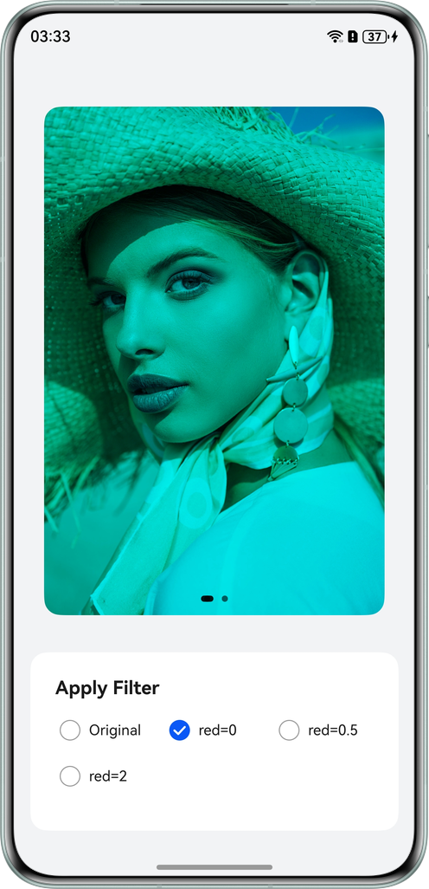 | 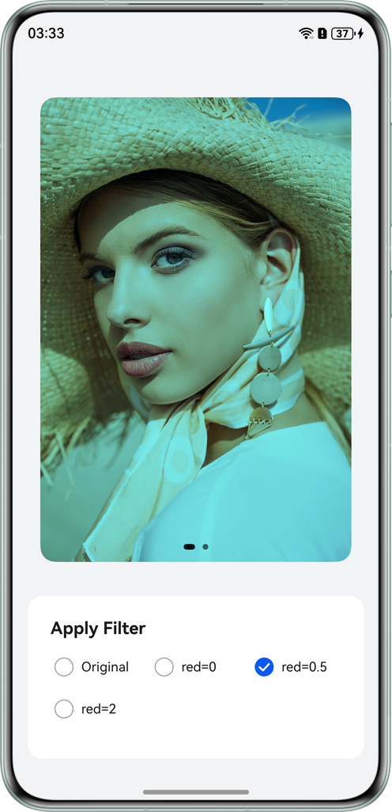 | 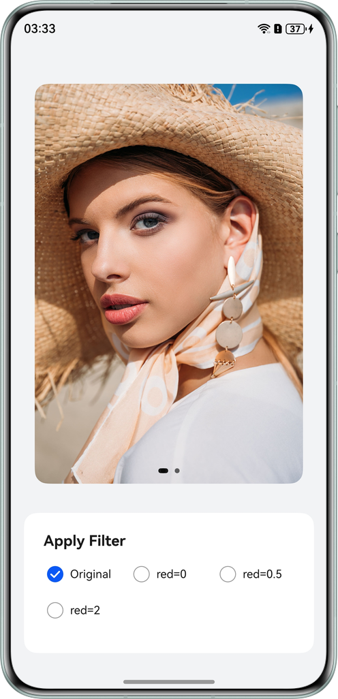 | 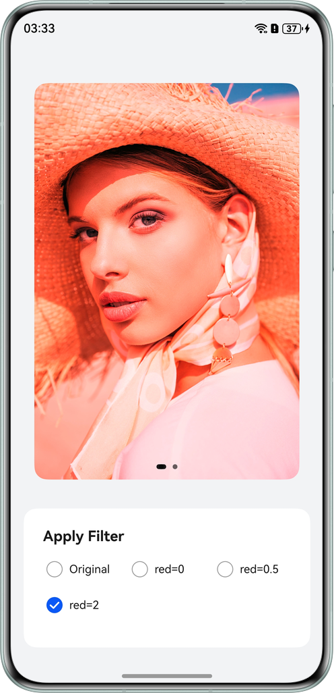 |

- **非对角线元素**：控制**通道混合**，用于实现色相偏移、去色等效果。例如，在红色行（Row 0）设置 m01（绿色列）的值，表示“将源像素的绿色分量添加到输出的红色通道中”，这是实现灰度滤镜的基础。
  * 正值：增加其他通道对当前通道的贡献。
  * 负值：实现反向混合。

  
  
  
  展开
    | **滤镜效果** | 原图 | 黑白胶片（利用人眼对绿色的敏感度（BT.709标准），将 RGB 混合，消除色相，只保留亮度） | 红蓝反转（红色的东西变蓝，蓝色的东西变红） |
    | --- | --- | --- | --- |
    | **矩阵值** | [<br>1, 0, 0, 0, 0,<br>0, 1, 0, 0, 0,<br>0, 0, 1, 0, 0,<br>0, 0, 0, 1, 0<br>]; | // Classic grayscale blending coefficients<br>[<br>0.213, 0.715, 0.072, 0, 0, // R' blends r, g, b<br>0.213, 0.715, 0.072, 0, 0, // G' blends r, g, b<br>0.213, 0.715, 0.072, 0, 0, // B' blends r, g, b<br>0, 0, 0, 1, 0 // A' (alpha channel) remains unchanged<br>]; | // R row reads B value, B row reads R value<br>[<br>// R' = B (R channel takes the value of the blue channel entirely)<br>0, 0, 1, 0, 0,<br>// G' = G (Green channel remains unchanged)<br>0, 1, 0, 0, 0,<br>// B' = R (B channel takes the value of the red channel entirely)<br>1, 0, 0, 0, 0,<br>// A' = A (Alpha channel remains unchanged)<br>0, 0, 0, 1, 0<br>]; |
    | **效果图** | 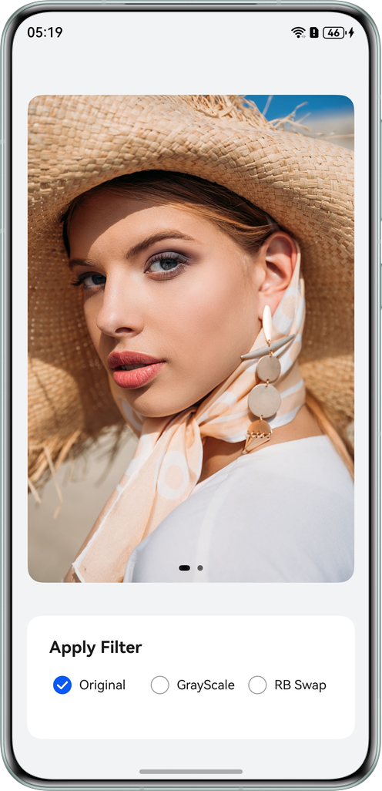 | 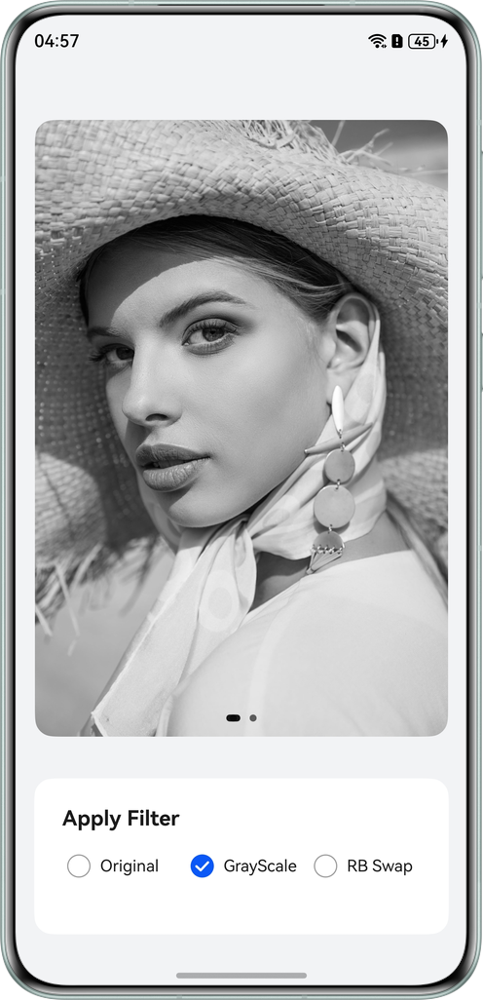 | 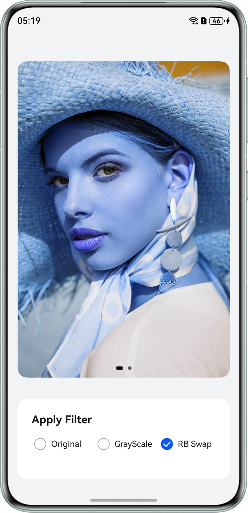 |

- **第5列（mx4，0≤x≤3）**：控制色彩偏移，用于整体提亮、压暗、色调偏移等。在HarmonyOS中，该值已归一化，范围为[0,1]，例如反色滤镜示例中的值1表示255/255（完全偏移）。
  * 范围[0,1]，实际偏移为该值乘以255。

  
  
  
  展开
    | **滤镜效果** | 原图 | 通过对所有通道添加固定值（如0.1），以增强图像亮度，产生泛白或雾化的效果 | 通过增强红色通道并适度提升绿色通道，模拟暖黄色滤镜效果，同时保留原始图像结构 |
    | --- | --- | --- | --- |
    | **矩阵值** | [<br>1, 0, 0, 0, 0,<br>0, 1, 0, 0, 0,<br>0, 0, 1, 0, 0,<br>0, 0, 0, 1, 0<br>]; | // Add 0.1 to each RGB channel (approximately 25.5 brightness value)<br>[<br>1, 0, 0, 0, 0.1, // R' = R + 25.5<br>0, 1, 0, 0, 0.1, // G' = G + 25.5<br>0, 0, 1, 0, 0.1, // B' = B + 25.5<br>0, 0, 0, 1, 0<br>]; | // R increased by 0.2, G increased by 0.1, B unchanged<br>[<br>1, 0, 0, 0, 0.2, // Enhances red channel for warmer tone<br>0, 1, 0, 0, 0.1, // Subtle green enhancement creates orange-yellow balance<br>0, 0, 1, 0, 0, // Blue channel preserved as-is<br>0, 0, 0, 1, 0<br>]; |
    | **效果图** |  | 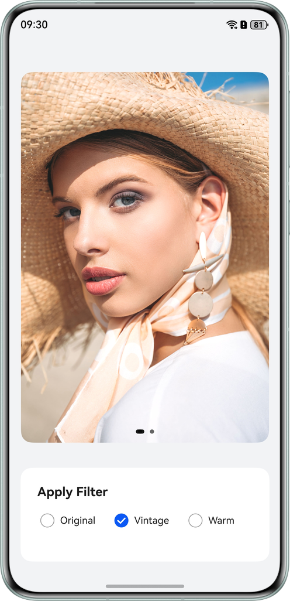 | 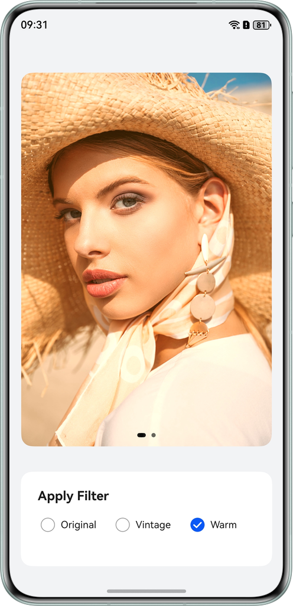 |


### 颜色滤波器

从API 12开始，ArkUI开放了[@ohos.graphics.drawing](https://developer.huawei.com/consumer/cn/doc/harmonyos-references/js-apis-graphics-drawing)模块中的颜色滤波器（[DrawingColorFilter](https://developer.huawei.com/consumer/cn/doc/harmonyos-references/ts-basic-components-image#drawingcolorfilter12)接口类型，表示[ColorFilter](https://developer.huawei.com/consumer/cn/doc/harmonyos-references/arkts-apis-graphics-drawing-colorfilter)类型的别名）。使用颜色滤波器作为参数的方法提供了更高级、语义化、简便的滤镜创建方式。开发者可根据所需实现的滤镜效果指定ARGB格式（参考如下说明）的颜色值，并选用系统预设的[BlendMode](https://developer.huawei.com/consumer/cn/doc/harmonyos-references/arkts-apis-graphics-drawing-e#blendmode)混合模式创建颜色滤波器，以实现不同混合算法下的颜色滤镜效果。


- **接口**：[static createBlendModeColorFilter(color: common2D.Color | number, mode: BlendMode) : ColorFilter](https://developer.huawei.com/consumer/cn/doc/harmonyos-references/arkts-apis-graphics-drawing-colorfilter#createblendmodecolorfilter18)
- **参数语义**：
  * color：用于混合的目标颜色（16进制ARGB格式的无符号整数或[common2D.Color](https://developer.huawei.com/consumer/cn/doc/harmonyos-references/js-apis-graphics-common2d#color)类型颜色值）。
  * mode：系统预设的颜色混合模式算法，常用的混合模式包括但不限于：
    + BlendMode.SRC_IN：常用于改变图标颜色（保留透明度）。
    + BlendMode.DST_OVER：在图片下方绘制背景色。
    + BlendMode.MODULATE：颜色相乘，使图片变暗或着色。


说明

在HarmonyOS开发中，ARGB和RGBA是两种不同的颜色通道顺序表示方式。


- **本质上相同**：两者均包含红、绿、蓝、透明度四个通道。
- **使用场景的差异在于**：
  * **ARGB**多用于十六进制和[common2D.Color](https://developer.huawei.com/consumer/cn/doc/harmonyos-references/js-apis-graphics-common2d#color)类型颜色表示（如#FFFF0000和{ alpha: 255, red: 255, green: 0, blue: 0 }均表示不透明的红色），是HarmonyOS开发中颜色资源的常见格式；
  * **RGBA**多用于CSS样式、SVG解析及API参数（如rgba(r, g, b, a)），ArkUI的Image组件的颜色矩阵计算需依赖RGBA归一化值。


### 颜色矩阵和颜色滤波器的区别和使用场景对比


展开

| 对比维度 | 颜色矩阵 | **颜色滤波器（createBlendModeColorFilter混合模式）** |
| --- | --- | --- |
| 核心原理 | 4×5矩阵线性变换像素RGB/Alpha值 | 源图与目标图按混合规则融合 |
| 使用场景 | 适合图像编辑中的精细参数控制（亮度、饱和度等）和特殊色彩变换，优点是灵活可控、支持线性变换效果 | 适合简单的UI染色、叠加、蒙版等场景 |


## 滤镜实现


### 原图显示，初始化单位矩阵

在滤镜列表中，首个选项通常为“原图”或“无效果”。技术实现上，使用单位矩阵对应此状态。


**颜色矩阵定义：**


```typescript
1. /**
2.  * Original color matrix
3.  */
4. export const ORIGINAL_MATRIX: number[] = [
5.  1, 0, 0, 0, 0,
6.  0, 1, 0, 0, 0,
7.  0, 0, 1, 0, 0,
8.  0, 0, 0, 1, 0
9. ];

```


[CommonConstants.ets](https://gitcode.com/HarmonyOS_Samples/image-filter/blob/master/entry/src/main/ets/constants/CommonConstants.ets#L29-L37)


**原理解析：**


这是一个标准的单位矩阵，根据矩阵乘法原理，它不会改变像素的任何RGBA值，从而起到“保持原图效果”或“重置”的作用。


**效果图：**


### 实现复古灰度滤镜功能

**颜色矩阵定义：**


```typescript
1. /**
2.  * Retro/Vintage matrix (Adjust offsets 15/10/-5 to control warm tone intensity)
3.  */
4. const RETRO_COLOR_MATRIX: number[] = [
5.  0.213, 0.715, 0.072, 0, 0, // R' = Sepia calculation for Red
6.  0.213, 0.715, 0.072, 0, 0, // G' = Sepia calculation for Green
7.  0.213, 0.715, 0.072, 0, 0, // B' = Sepia calculation for Blue
8.  0, 0, 0, 1, 0 // Alpha unchanged
9. ];

```


[CommonConstants.ets](https://gitcode.com/HarmonyOS_Samples/image-filter/blob/master/entry/src/main/ets/constants/CommonConstants.ets#L85-L93)


**原理解析:**


- RGB三通道使用相同的权重系数（0.213, 0.715, 0.072），这是标准的灰度转换系数，源自ITU-R BT.709国际标准（高清视频色彩空间标准）中的亮度计算公式，具体公式如下：     

     灰度图的特点是每个像素的R、G、B值相等，因此通过转换矩阵使R' = G' = B'时，图片颜色将失去色相，仅保留亮度。基于此原理，使用上述灰度值转换公式，将R'、G'、B'均设置为L即可实现复古灰度滤镜效果。

- 每个通道都基于相同的亮度值，产生单色调的灰度效果。

- 实现复古效果时，为保留原图的透明度，第四行的值保持不变。


说明

这里以一张纯色图片为例，展示灰度滤镜的实现：


假设纯色原始图片的RGBA颜色值为：rgba(255, 255, 0, 255)，即原始的[R, G, B, A]。颜色转换矩阵为上述定义的RETRO_COLOR_MATRIX。


根据颜色转换矩阵的定义公式，可以计算得出：


R' = 0.213 * 255 + 0.715 * 255 + 0.072 * 0 + 0 * 255 + 0 * 255 = 236.64（红），


G' = 0.213 * 255 + 0.715 * 255 + 0.072 * 0 + 0 * 255 + 0 * 255 = 236.64（绿），


B' = 0.213 * 255 + 0.715 * 255 + 0.072 * 0 + 0 * 255 + 0 * 255 = 236.64（蓝），


A' = 0 * 255 + 0 * 255 + 0 * 0 + 1 * 255 + 0 * 255 = 255（透明度）。


转换后的像素颜色分量（取整后）为：rgba(237, 237, 237, 255)


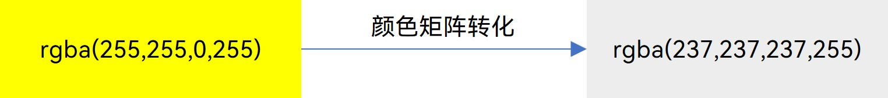


**效果图：**


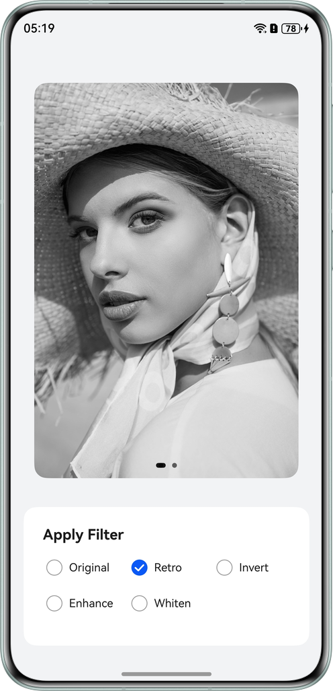


### 实现反色滤镜功能

**颜色矩阵定义：**


```typescript
1. /**
2.  * Invert/Reverse color matrix (Ready to use, no adjustment needed)
3.  */
4. const REVERSE_COLOR_MATRIX: number[] = [
5.  -1, 0, 0, 0, 1, // R' = -1*R + 0*G + 0*B + 0*A + 1*255
6.  0, -1, 0, 0, 1, // G' = 0*R + -1*G + 0*B + 0*A + 1*255
7.  0, 0, -1, 0, 1, // B' = 0*R + 0*G + -1*B + 0*A + 1*255
8.  0, 0, 0, 1, 0 // A' = 0*R + 0*G + 0*B + 1*A + 0*255, Alpha unchanged
9. ];

```


[CommonConstants.ets](https://gitcode.com/HarmonyOS_Samples/image-filter/blob/master/entry/src/main/ets/constants/CommonConstants.ets#L41-L49)


**原理解析：**


- 每个颜色通道的系数为-1，实现颜色取反。
- 第5列的偏移量为1（即255），补偿负值，使结果处于[0,255]范围内。
- 数学公式：新颜色=255 - 原颜色，实现颜色反转效果。


**效果图：**


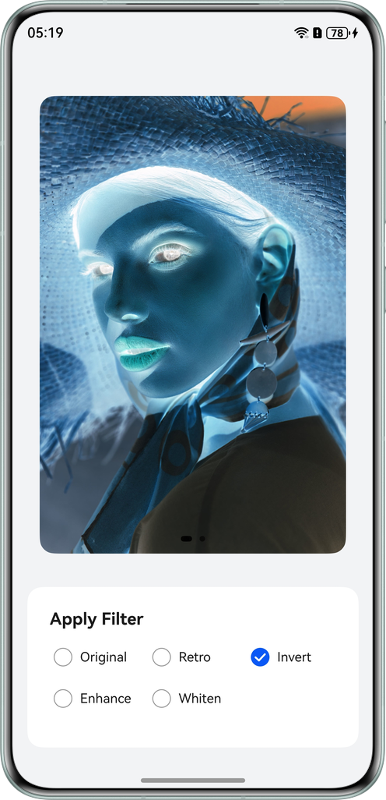


### 实现饱和度增强滤镜功能

**颜色矩阵定义：**


```typescript
1. /**
2.  * Saturation Enhancement matrix (Approx 1.8x saturation, coefficients control intensity)
3.  */
4. const ENHANCE_COLOR_MATRIX: number[] = [
5.  1.63, -0.5723, -0.0577, 0, 0, // R' = High weight Red + Low weight Green/Blue
6.  -0.17, 1.2277, -0.0577, 0, 0, // G' = High weight Green + Low weight Red/Blue
7.  -0.17, -0.5723, 1.7423, 0, 0, // B' = High weight Blue + Low weight Red/Green
8.  0, 0, 0, 1, 0 // Alpha unchanged
9. ];

```


[CommonConstants.ets](https://gitcode.com/HarmonyOS_Samples/image-filter/blob/master/entry/src/main/ets/constants/CommonConstants.ets#L73-L81)


**原理解析：**


- 对角线元素增大（1.63, 1.2277, 1.7423），以增强各通道的颜色强度。
- 非对角线负值减少其他通道的干扰，使颜色更加纯净。
- 整体效果：饱和度提升约1.8倍，色彩更加鲜艳。


说明

对角线魔数值取值说明：


- **核心算法**：基于线性插值原理，在“灰度图像”与“原图”之间进行加权混合。公式为：     

     其中，S表示饱和度系数，本例中S ≈ 1.8，即提升饱和度约80%；Gray表示像素的亮度值，基于ITU-R BT.709国际标准（高清视频色彩空间标准）中的[亮度计算公式](https://developer.huawei.com/consumer/cn/doc/best-practices/bpta-implementing-image-filters#li1220719235212)。

- **系数推导**：以红色通道的主对角线元素（1.63）为例：
  * 公式展开：         

  * 合并系数：         

- **效果**：通过公式计算出的矩阵，既保留了图像的亮度信息，又显著增强了RGB通道的差异，从而实现色彩鲜艳通透的效果。


**效果图：**


### 实现美白滤镜功能

**颜色滤波器定义：**


```typescript
1. /**
2.  * Whitening color matrix configurations
3.  * (Note: This specific filter uses a BlendMode rather than a pure matrix array)
4.  */
5. const WHITENING_COLOR_CONFIG: common2D.Color = {
6.  alpha: 30, // Low opacity for the blend
7.  red: 255,
8.  green: 255,
9.  blue: 255
10. };
11.
12. /**
13.  * Creates a color filter specifically for the whitening effect.
14.  * It uses the 'PLUS' blend mode to superimpose the configuration color onto the image, making it brighter.
15.  */
16. const WHITENING_COLOR_FILTER =
17.  drawing.ColorFilter.createBlendModeColorFilter(WHITENING_COLOR_CONFIG, drawing.BlendMode.PLUS);

```


[CommonConstants.ets](https://gitcode.com/HarmonyOS_Samples/image-filter/blob/master/entry/src/main/ets/constants/CommonConstants.ets#L53-L69)


**原理解析：**


- 使用[createBlendModeColorFilter](https://developer.huawei.com/consumer/cn/doc/harmonyos-references/arkts-apis-graphics-drawing-colorfilter#createblendmodecolorfilter18)创建混合模式滤镜。
- 颜色配置为低透明度的白色（alpha = 30/255 ≈ 12%）。
- 采用[BlendMode.PLUS](https://developer.huawei.com/consumer/cn/doc/harmonyos-references/arkts-apis-graphics-drawing-e#blendmode)混合模式，将白色叠加至原图。
- 最终实现整体提亮效果，使肤色更显白皙，同时保留细节。


**效果图：**


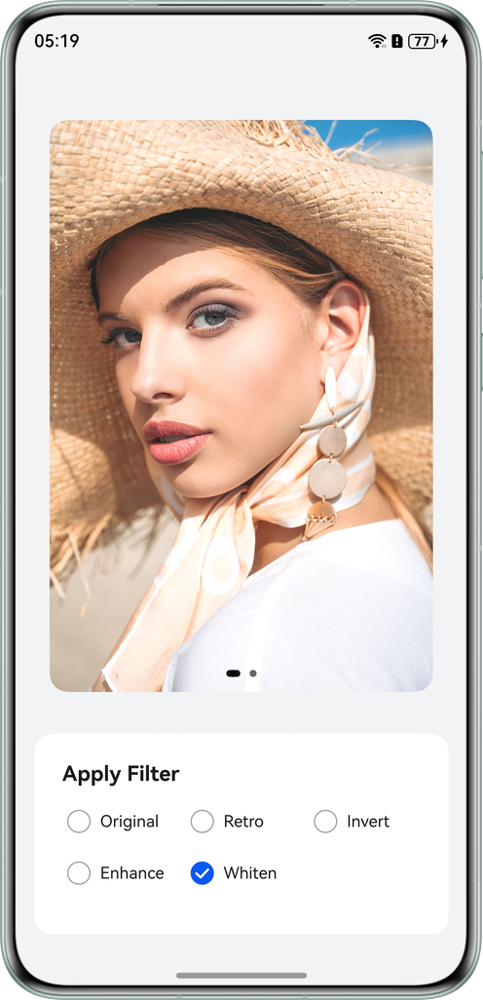


## 开发步骤

1. 定义滤镜数据结构     首先定义图片滤镜选项的接口，便于管理和扩展：


  
  
  

```typescript
1. /**
2.  * Interface definition for Filter Options.
3.  */
4. export interface FilterOption {
5.  label: string; // Display text for the UI
6.  value: string; // Unique identifier for logic
7.  filter: ColorFilter | number[]; // The actual Matrix or Drawing Object
8. }


```
  [CommonConstants.ets](https://gitcode.com/HarmonyOS_Samples/image-filter/blob/master/entry/src/main/ets/constants/CommonConstants.ets#L18-L25)

2. 初始化滤镜配置     在组件中定义各种滤镜矩阵和滤镜选项列表：


  - 滤镜矩阵定义见上文的[滤镜实现](https://developer.huawei.com/consumer/cn/doc/best-practices/bpta-implementing-image-filters#section16113751174913)。
  - 滤镜选项列表定义如下：
  
  
  

```typescript
1. /**
2.  * List of available filter options for the Radio Group
3.  */
4. export const FILTER_OPTIONS: FilterOption[] = [
5.  { label: 'Original', value: 'original', filter: ORIGINAL_MATRIX },
6.  { label: 'Retro', value: 'retro', filter: RETRO_COLOR_MATRIX },
7.  { label: 'Invert', value: 'invert', filter: REVERSE_COLOR_MATRIX },
8.  { label: 'Enhance', value: 'enhance', filter: ENHANCE_COLOR_MATRIX },
9.  { label: 'Whiten', value: 'whitening', filter: WHITENING_COLOR_FILTER }
10. ];

```
    [CommonConstants.ets](https://gitcode.com/HarmonyOS_Samples/image-filter/blob/master/entry/src/main/ets/constants/CommonConstants.ets#L97-L106)

3. 初始化滤镜状态     在组件生命周期中初始化每张图片的滤镜状态：


  
  
  

```typescript
1. aboutToAppear(): void {
2.  // Initialize all images to 'original' filter.
3.  this.imageFilterTags = new Array<string>(CAROUSEL_DATA_SOURCE.length).fill('original');
4. }


```
  [Index.ets](https://gitcode.com/HarmonyOS_Samples/image-filter/blob/master/entry/src/main/ets/pages/Index.ets#L27-L30)

4. 应用滤镜效果到图片     在Image组件上使用[colorFilter](https://developer.huawei.com/consumer/cn/doc/harmonyos-references/ts-basic-components-image#colorfilter9)应用滤镜，该步骤是核心实现：


  
  
  

```typescript
1. Image(imgRes)
2.  .width('100%')
3.  .height('100%')
4.  .objectFit(ImageFit.Contain)
5.  .borderRadius(16)
6.  // Apply the filter corresponding to THIS specific image index
7.  .colorFilter(this.getFilterByTag(this.imageFilterTags[index]))


```
  [Index.ets](https://gitcode.com/HarmonyOS_Samples/image-filter/blob/master/entry/src/main/ets/pages/Index.ets#L43-L49)
     由于轮播图需切换不同的图片并对每张图片添加滤镜效果，故需根据每张图片记录的滤镜标签获取对应的滤镜对象，关键辅助方法如下：


  
  
  

```typescript
1. // Helper: Retrieves the actual filter object based on the tag string
2. private getFilterByTag(tag: string): ColorFilter | number[] {
3.  const option = FILTER_OPTIONS.find(opt => opt.value === tag);
4.  return option ? option.filter : ORIGINAL_MATRIX;
5. }


```
  [Index.ets](https://gitcode.com/HarmonyOS_Samples/image-filter/blob/master/entry/src/main/ets/pages/Index.ets#L142-L146)


## 常见问题


### SVG图片设置colorFilter未生效

**问题现象**


PNG、JPG图片应用滤镜正常，但更换为SVG图片后，滤镜不起作用。


**可能原因**


这与API版本及SVG内部结构有关：


- API 11及之前版本，SVG类型图源不支持[colorFilter](https://developer.huawei.com/consumer/cn/doc/harmonyos-references/ts-basic-components-image#colorfilter9)。
- API 12及以上版本，支持[DrawingColorFilter](https://developer.huawei.com/consumer/cn/doc/harmonyos-references/ts-basic-components-image#drawingcolorfilter12)，但仅在SVG设置了stroke属性时生效。
- API 21及以上版本，当[supportSvg2(true)](https://developer.huawei.com/consumer/cn/doc/harmonyos-references/ts-basic-components-image#supportsvg221)时，[colorFilter](https://developer.huawei.com/consumer/cn/doc/harmonyos-references/ts-basic-components-image#colorfilter9)才对整个SVG图源起作用。


**解决方案**


若需在低版本中对SVG变色，建议将SVG转换为PNG或PixelMap后再应用[colorFilter](https://developer.huawei.com/consumer/cn/doc/harmonyos-references/ts-basic-components-image#colorfilter9)，或使用[fillColor](https://developer.huawei.com/consumer/cn/doc/harmonyos-references/ts-basic-components-image#fillcolor)属性（适用于单色图标，图源中需包含fill属性的参数配置，且fill属性不为 'none'）。


### 设置了colorFilter，但renderMode属性未生效

**问题现象**


原本设置了[renderMode: ImageRenderMode.Template](https://developer.huawei.com/consumer/cn/doc/harmonyos-references/ts-basic-components-image#imagerendermode)以将图标染成黑色，后来为了添加滤镜使用了[colorFilter](https://developer.huawei.com/consumer/cn/doc/harmonyos-references/ts-basic-components-image#colorfilter9)，导致Template效果消失，颜色显示异常。


**可能原因**


未遵循系统规格，系统规格指出：设置[colorFilter](https://developer.huawei.com/consumer/cn/doc/harmonyos-references/ts-basic-components-image#colorfilter9)属性时，[renderMode](https://developer.huawei.com/consumer/cn/doc/harmonyos-references/ts-basic-components-image#rendermode)属性设置不生效。


**解决方案**


不要混用[colorFilter](https://developer.huawei.com/consumer/cn/doc/harmonyos-references/ts-basic-components-image#colorfilter9)和[renderMode](https://developer.huawei.com/consumer/cn/doc/harmonyos-references/ts-basic-components-image#rendermode)属性。若需染色，直接使用[colorFilter](https://developer.huawei.com/consumer/cn/doc/harmonyos-references/ts-basic-components-image#colorfilter9)模拟Template模式（即忽略原图像素颜色，仅保留Alpha通道，全部染为目标色），例如要染成红色，其对应的单色染色矩阵如下：


```typescript
1. [
2.  0, 0, 0, 0, 1, // Max out red channel (Offset)
3.  0, 0, 0, 0, 0, // Zero out green channel
4.  0, 0, 0, 0, 0, // Zero out blue channel
5.  0, 0, 0, 1, 0 // Preserve original alpha channel
6. ]

```


## 示例代码

- [基于colorFilter实现图片滤镜效果](https://gitcode.com/HarmonyOS_Samples/image-filter)
