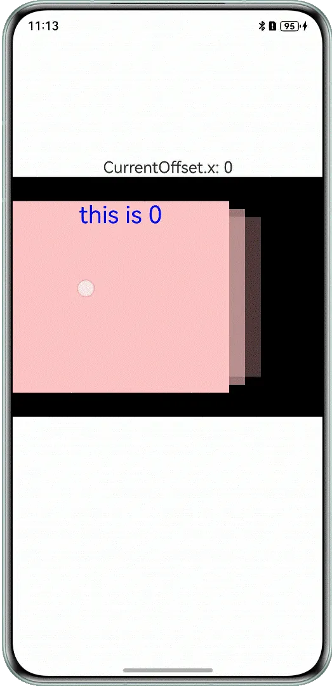

# 使用Swiper组件实现轮播图

---

## 概述

在各类应用和网站中，轮播图的使用非常广泛，它在信息展示和用户交互方面扮演着重要角色。轮播图不仅能在有限的屏幕区域内展示更多内容，还能有效地将关键的信息传递给用户。在开发应用或网站时，可以通过轮播图优先展示重要内容，次要内容则随后呈现，用户能够自主控制浏览节奏，滑动交互也能为用户带来发现内容的愉悦感，从而提升用户体验。


本文将通过以下两个场景介绍如何使用Swiper组件实现不同的轮播效果。


[使用Swiper实现图文作品合集](https://developer.huawei.com/consumer/cn/doc/best-practices/bpta-carousel-graphic-works#section1461474222812)：图文作品合集由图片和文字组合而成，通过Swiper组件来动态展示图片，实现图片的轮播效果。


[实现轮播图片叠加效果](https://developer.huawei.com/consumer/cn/doc/best-practices/bpta-carousel-graphic-works#section45251227153219)：轮播图的叠加效果（多层轮播图视觉叠加）可以创造独特的视觉层次和交互体验。


## 使用Swiper实现图文作品合集


### 场景描述

在一些短视频平台上，经常能看到由图片和文字组合而成的作品集。这些作品集通常由多张图片构成，支持自动轮播或手动切换。


1. 当作品自动播放时，图片会每隔几秒自动切换到下一张，且下方的进度条进度与每张图片的停留时间相匹配。
2. 当用户主动触发播放操作时，下方进度条会跟着图片的滑动切换而改变成未完成状态或已完成状态。


效果如图所示。


### 实现原理

图文作品轮播可以通过Swiper组件及其指示器的联动效果来实现。由于Swiper组件的指示器不可自定义，因此需要分开实现。


图片区域需要使用[Swiper](https://developer.huawei.com/consumer/cn/doc/harmonyos-references/ts-container-swiper)组件来实现。将图片合集的数据传入Swiper组件后，需要对Swiper组件设置一些属性，来完成图片自动轮播效果。


1. 通过设置[loop](https://developer.huawei.com/consumer/cn/doc/harmonyos-references/ts-container-swiper#loop)属性控制是否循环播放，该属性默认值为true。当loop为true时，在显示第一页或最后一页时，可以继续往前切换到前一页或者往后切换到后一页。如果loop为false，则在第一页或最后一页时，无法继续向前或者向后切换页面。
2. 通过设置[autoPlay](https://developer.huawei.com/consumer/cn/doc/harmonyos-references/ts-container-swiper#autoplay)属性，控制是否自动轮播子组件。该属性默认值为false。autoPlay为true时，会自动切换播放子组件。
3. 通过设置[interval](https://developer.huawei.com/consumer/cn/doc/harmonyos-references/ts-container-swiper#interval)属性，控制子组件与子组件之间的播放间隔。interval属性默认值为3000，单位毫秒。
4. 通过设置[indicator](https://developer.huawei.com/consumer/cn/doc/harmonyos-references/ts-container-swiper#indicator)属性为false，来关闭Swiper组件自带的导航点指示器样式。


底部导航点（进度条）有三种样式：未完成状态的样式、已完成状态的样式和正在进行进度增长的样式。


1. 进度条布局：开发者可以使用[层叠布局 (Stack)](https://developer.huawei.com/consumer/cn/doc/harmonyos-guides/arkts-layout-development-stack-layout)，配合Row容器来实现进度条的布局。
2. 图文播放时间与进度条匹配：要实现进度条缓慢增长至完成状态且用时与图片播放时间相匹配的效果，可以给Row容器组件添加[属性动画 (animation)](https://developer.huawei.com/consumer/cn/doc/harmonyos-references/ts-animatorproperty)，设置duration（动画持续时间）与图片播放时间匹配即可。
3. 进度条状态切换：通过比较当前图片的currentIndex与进度条的index，当currentIndex大于index时，应将进度条样式设置为已完成状态；反之，则设置为未完成状态。可以通过将进度条的背景颜色设置为Color.White或Color.Grey来实现这两种状态的切换。


### 开发步骤

1. 为Swiper组件设置[loop](https://developer.huawei.com/consumer/cn/doc/harmonyos-references/ts-container-swiper#loop)、[autoPlay](https://developer.huawei.com/consumer/cn/doc/harmonyos-references/ts-container-swiper#autoplay)、[interval](https://developer.huawei.com/consumer/cn/doc/harmonyos-references/ts-container-swiper#interval)和[indicator](https://developer.huawei.com/consumer/cn/doc/harmonyos-references/ts-container-swiper#indicator)属性。在手指未滑动的情况下，图片每3秒会进行一次切换，并且自动进行轮播。  

  
  
  

```typescript
1. Swiper(this.swiperController) {
2.  LazyForEach(this.data, (item: PhotoData, index: number) => {
3.  Image($r(`app.media.` + item.id))
4.  .width(this.foldStatus === 2 ? '100%' : '70%')
5.  .height('100%')
6.  }, (item: PhotoData) => JSON.stringify(item))
7. }
8. .loop(true)
9. .autoPlay(true)
10. //.autoPlay(this.slide ? false : true)
11. .interval(3000)
12. .indicator(false)


```
  [ImageSwitch.ets](https://gitcode.com/HarmonyOS_Samples/MultipleImage/blob/master/entry/src/main/ets/pages/ImageSwitch.ets#L157-L171)
     示意效果如下图所示。

     

  

2. 创建进度条自定义组件progressComponent。代码中，this.progressData为图片集合的数组，this.currentIndex为当前播放的图片在图片集合数组中的索引，index为进度条对应的图片在图片集合数组中的索引。当this.currentIndex > index时，表示图片集合数组中索引0-index的进度条都是已完成状态。  

  
  
  

```typescript
1. @Builder
2. progressComponent() {
3.  Row({ space: 5 }) {
4.  ForEach(this.progressData, (item: PhotoData, index: number) => {
5.  Stack({ alignContent: Alignment.Start }) {
6.  // Use the cascading component to stack progress bars of different styles together
7.  // ...
8.  Row()
9.  .zIndex(1)
10.  .width(this.currentIndex === index ? '100%' : '0')
11.  .height(2)
12.  .borderRadius(2)
13.  .backgroundColor(Color.White)
14.  // Add a growth animation to the progress bar
15.  .animation({
16.  duration: this.currentIndex === index ? this.duration : 0,
17.  curve: Curve.Linear,
18.  iterations: 1,
19.  playMode: PlayMode.Normal
20.  })
21.  // ...
22.  }
23.  .layoutWeight(1)
24.  }, (item: PhotoData) => JSON.stringify(item))
25.  }
26.  .width('100%')
27.  .height(50)
28. }


```
  [ImageSwitch.ets](https://gitcode.com/HarmonyOS_Samples/MultipleImage/blob/master/entry/src/main/ets/pages/ImageSwitch.ets#L91-L134)
     示意效果如下图所示。

     

  

3. 滑动切换图片后，关闭自动轮播与循环轮播。此时，开发者需要给Swiper组件添加[onGestureSwipe](https://developer.huawei.com/consumer/cn/doc/harmonyos-references/ts-container-swiper#ongestureswipe10)事件，来判断页面是否跟手滑动。其中slide为布尔值，用来判断页面是否跟手滑动。默认值为false，当页面跟手滑动时，slide的值为true。当进行滑动切换时，autoPlay、loop属性的取值为false，即关闭自动轮播与循环播放功能。若想实现滑动图片后仍自动循环轮播，直接去掉slide相关代码片段即可。  

  
  
  

```typescript
1. Swiper(this.swiperController) {
2.  // ...
3. }
4. // ...
5. .onGestureSwipe((index: number, extraInfo: SwiperAnimationEvent) => {
6.  this.slide = true;
7. })


```
  [ImageSwitch.ets](https://gitcode.com/HarmonyOS_Samples/MultipleImage/blob/master/entry/src/main/ets/pages/ImageSwitch.ets#L159-L194)
     示意效果如下图所示。

     

  

4. 适配折叠屏，在aboutToAppear生命周期函数中获取设备是否可折叠，并且同时获取折叠状态，通过设备类型以及折叠状态设置Swiper的宽高值。同时绑定change回调事件，当页面变化时，触发回调实时刷新折叠状态值。  

  
  
  

```typescript
1. aboutToAppear(): void {
2.  try {
3.  this.isFoldable = display.isFoldable();
4.  // Get the foldable screen status
5.  let foldStatus: display.FoldStatus = display.getFoldStatus();
6.  if (this.isFoldable) {
7.  this.foldStatus = foldStatus;
8.  let callback: Callback<number> = () => {
9.  let data: display.FoldStatus = display.getFoldStatus();
10.  this.foldStatus = data;
11.  }
12.  // Monitor the changes in the unfolded status of the foldable screen
13.  display.on('change', callback);
14.  }
15.  } catch (error) {
16.  let err = error as BusinessError;
17.  hilog.error(0x0000, 'ImageSwitch', `getFoldStatus failed. code=${err.code}, message=${err.message}`);
18.  }
19.  let list: PhotoData[] = [];
20.  for (let i = 1; i <= 7; i++) {
21.  let newPhotoData = new PhotoData();
22.  newPhotoData.id = i;
23.  list.push(newPhotoData);
24.  }
25.  this.progressData = list;
26.  this.data = new DataSource(list);
27.
28.  // ...
29. }


```
  [ImageSwitch.ets](https://gitcode.com/HarmonyOS_Samples/MultipleImage/blob/master/entry/src/main/ets/pages/ImageSwitch.ets#L39-L76)
     当折叠状态取值为2时，表示当前折叠状态为折叠。

  


## 实现轮播图的叠加效果


### 场景描述

轮播图的叠加效果通过视觉层叠、内容交互动画，能显著提升信息传达的丰富性和用户体验的沉浸感。通常情况下，轮播图是按照顺序依次轮播，但是有时候也希望能够以一种重叠的方式进行展示，即当前展示的图片覆盖在前一个图片上方，给用户一种更加流畅的切换体验。


效果如图所示。





### 实现原理

使用[层叠布局 (Stack)](https://developer.huawei.com/consumer/cn/doc/harmonyos-guides/arkts-layout-development-stack-layout)可以实现图片的叠加，结合滑动手势来实现图片的切换，并通过[animateTo](https://developer.huawei.com/consumer/cn/doc/harmonyos-references/arkts-apis-uicontext-uicontext#animateto)添加相应的切换动画。通过给图片添加以下属性来实现。


- [zIndex](https://developer.huawei.com/consumer/cn/doc/harmonyos-references/ts-universal-attributes-z-order#zindex)属性来设置组件的堆叠顺序，Index值越大，显示层级越高，即zIndex值大的组件会覆盖在zIndex值小的组件上方。
- [visibility](https://developer.huawei.com/consumer/cn/doc/harmonyos-references/ts-universal-attributes-visibility#visibility)属性来控制显示或隐藏，值为Visibility.Hidden时，表示隐藏，但参与布局进行占位；值为Visibility.Visible时，表示显示；值为Visibility.None时，表示隐藏，但不参与布局，不进行占位。
- [scale](https://developer.huawei.com/consumer/cn/doc/harmonyos-references/ts-universal-attributes-transformation#scale)属性来控制是否缩放，可以分别设置X轴、Y轴、Z轴的缩放比例，默认值为1。


### 开发步骤

1. 使用Stack组件将图片进行层叠布局，并给其设置zIndex、visibility、scale等属性。  

  
  
  

```typescript
1. Stack({ alignContent: Alignment.Start }) {
2.  ForEach(this.data, (item: string, index: number) => {
3.  Column() {
4.  Text(item)
5.  .fontSize(30)
6.  .fontColor(Color.Blue)
7.  }
8.  .zIndex(this.zIndexArray[index])
9.  .visibility(this.visibleArray[index])
10.  .opacity(this.opacityArray[index])
11.  .backgroundColor(Color.Pink)
12.  .width(this.sizeArray[index].width)
13.  .height(this.sizeArray[index].height)
14.  .offset({ x: this.offsetXArray[index], y: 0 })
15.  .scale(this.scaleArray[index])
16.  }, (item: string, index: number) => `${item}index`)
17. }
18. .onAppear(() => { // It is called only once after mounting
19.  this.isAppear = true;
20. })


```
  [StackSwitch.ets](https://gitcode.com/HarmonyOS_Samples/MultipleImage/blob/master/entry/src/main/ets/pages/StackSwitch.ets#L156-L175)
  

2. 在Stack上监听左右滑动手势，在手势的回调里面进行图片的动效切换。  

  
  
  

```typescript
1. .gesture(
2.  PanGesture(this.panOption)
3.  .onActionStart((event: GestureEvent) => {
4.  clearInterval(timerId); // Stop looping playback
5.  this.isStart = false;
6.  this.visibleArray[this.currentIndexArray[3]] = Visibility.Visible;
7.  })
8.  .onActionUpdate((event: GestureEvent) => {
9.  if (!event) {
10.  return;
11.  }
12.  let distanceScl: number = 0;
13.  let index0 = this.currentIndexArray[PageIndex.FIRSTPAGE];
14.  // The animation effect of the top card
15.  this.offsetXArray[index0] = event.offsetX;
16.  if (this.offsetXArray[index0] < 0) { // 左
17.  distanceScl = this.offsetXArray[index0] > -OFFSET_DISTANCE_4_FADE_THREHOLD ?
18.  1.0 + this.offsetXArray[index0] / OFFSET_DISTANCE_4_FADE_THREHOLD : 0;
19.  } else { // right
20.  distanceScl = this.offsetXArray[index0] < OFFSET_DISTANCE_4_FADE_THREHOLD ?
21.  1.0 - this.offsetXArray[index0] / OFFSET_DISTANCE_4_FADE_THREHOLD : 0;
22.  }
23.
24.  // The animation effect of the second-layer card
25.  let index1 = this.currentIndexArray[PageIndex.SCENDPAGE];
26.  this.changeSubPageWhenUpdate(index1, PageIndex.SCENDPAGE, distanceScl, true, true);
27.
28.  // The animation effect of three layers of cards
29.  let index2 = this.currentIndexArray[PageIndex.THRIDPAGE];
30.  this.changeSubPageWhenUpdate(index1, PageIndex.THRIDPAGE, distanceScl, true, true);
31.
32.  // The animation effect of four layers of cards
33.  let index3 = this.currentIndexArray[PageIndex.FOURTHPAGE];
34.  this.changeSubPageWhenUpdate(index1, PageIndex.FOURTHPAGE, distanceScl, false, true);
35.  })
36.  .onActionEnd((event: GestureEvent) => { // Lift your finger
37.  if (!event) {
38.  return;
39.  }
40.  this.getUIContext().animateTo({
41.  duration: 200,
42.  curve: Curve.Linear,
43.  onFinish: () => { // After the animation effect ends, assign status values to each card to ensure that every component is in the correct state
44.  // Within the range that triggers the switch page
45.  if (Math.abs(this.offsetXArray[this.currentIndexArray[PageIndex.FIRSTPAGE]]) <
46.  OFFSET_DISTANCE_4_SWICH_THREHOLD) {
47.  this.visibleArray[this.currentIndexArray[PageIndex.FIRSTPAGE]] = Visibility.Visible;
48.  this.visibleArray[this.currentIndexArray[PageIndex.FOURTHPAGE]] = Visibility.None;
49.  } else { // Update the status outside the range that triggers the switch page
50.  this.changePagePropertyWhenFinished();
51.  }
52.  }
53.  }, () => {
54.  if (this.offsetXArray[this.currentIndexArray[PageIndex.FIRSTPAGE]] > OFFSET_DISTANCE_4_SWICH_THREHOLD ||
55.  event.velocityX > SWITCH_PAGE_VELOCITY_THREHOLD) { // Fade out of the page to the right
56.  this.changePageWhenEnd(OFFSET_DISTANCE_4_FADE_THREHOLD, true, true);
57.  } else if (this.offsetXArray[this.currentIndexArray[PageIndex.FIRSTPAGE]] <
58.  -OFFSET_DISTANCE_4_SWICH_THREHOLD || event.velocityX < -SWITCH_PAGE_VELOCITY_THREHOLD) { // Fade out of the page to the left
59.  this.changePageWhenEnd(OFFSET_DISTANCE_4_FADE_THREHOLD, true, false);
60.  } else {
61.  this.changePageWhenEnd(0, false, true); // Return
62.  }
63.  })
64.  })
65. )


```
  [StackSwitch.ets](https://gitcode.com/HarmonyOS_Samples/MultipleImage/blob/master/entry/src/main/ets/pages/StackSwitch.ets#L178-L242)
  


## 常见问题


### Swiper如何实现左滑加载更多效果

可以通过监听滑动到边缘后超过距离多少来实现左滑加载更多效果，当超过一定距离时添加对应业务逻辑。


例如，在onGestureSwipe()回调中，判断下标以及偏移量，当偏移量超过一定距离时填充数据。


```typescript
1. @Entry
2. @Component
3. struct MySwiper {
4.  private swiperController: SwiperController = new SwiperController();
5.  private ind: number = 1;
6.  @State list: number[] = [];
7.
8.  aboutToAppear(): void {
9.  for (let i = 0; i <= 3; i++) {
10.  this.list.push(this.ind);
11.  this.ind += 1;
12.  }
13.  }
14.
15.  build() {
16.  Column({ space: 5 }) {
17.  Swiper(this.swiperController) {
18.  ForEach(this.list, (item: string) => {
19.  Text(item.toString())
20.  .width('90%')
21.  .height(160)
22.  .backgroundColor(0xAFEEEE)
23.  .textAlign(TextAlign.Center)
24.  .fontSize(30)
25.  }, (item: string) => item)
26.  }
27.  .cachedCount(2)
28.  .index(1)
29.  .autoPlay(false)
30.  .interval(4000)
31.  .loop(false)
32.  .indicatorInteractive(true)
33.  .duration(1000)
34.  .itemSpace(0)
35.  .curve(Curve.Linear)
36.  .onGestureSwipe((index: number, extraInfo: SwiperAnimationEvent) => {
37.  if (index === this.list.length - 1) {
38.  if (extraInfo.currentOffset < -50) {
39.  this.getUIContext().getPromptAction().showToast({ message: '< -50' });
40.  for (let i = 4; i <= 6; i++) {
41.  this.list.push(this.ind);
42.  this.ind += 1;
43.  }
44.  }
45.  }
46.  })
47.  }
48.  .width('100%')
49.  .margin({ top: 5 })
50.  }
51. }

```


[SwipeLeftToLoadMore.ets](https://gitcode.com/HarmonyOS_Samples/BestPracticeSnippets/blob/master/MultipleImage/entry/src/main/FAQ/SwipeLeftToLoadMore.ets#L21-L72)


### 如何解决swiper嵌套swiper滑动手势冲突

父组件有机制可以干预子组件的手势响应，可以通过手势拦截增强能力解决手势冲突，在回调onGestureRecognizerJudgeBegin()中进行滑动手势判断，处理对应业务逻辑。


```typescript
1. @Component
2. struct MySwiper {
3.  @State swiperIndex: number = 0;
4.  @State item: number = 0;
5.
6.  build() {
7.  Swiper() {
8.  ForEach([0, 1, 2], (item2: number) => {
9.  Text(this.item.toString() + item2.toString())
10.  .width('100%')
11.  .height(160)
12.  .backgroundColor(0xAFEEEE)
13.  .textAlign(TextAlign.Center)
14.  .fontSize(30)
15.  })
16.  }
17.  .onGestureRecognizerJudgeBegin((event: BaseGestureEvent, current: GestureRecognizer) => {
18.  if (current.isBuiltIn() && current.getType() == GestureControl.GestureType.PAN_GESTURE) {
19.  let panEvent = event as PanGestureEvent;
20.  if (this.swiperIndex === 0) {
21.  if (panEvent.velocityX > 0) {
22.  return GestureJudgeResult.REJECT
23.  }
24.  } else if (this.swiperIndex === 2) {
25.  if (panEvent.velocityX < 0) {
26.  return GestureJudgeResult.REJECT
27.  }
28.  }
29.  }
30.  return GestureJudgeResult.CONTINUE;
31.  })
32.  .index($$this.swiperIndex)
33.  }
34. }

```


[SlidingConflict.ets](https://gitcode.com/HarmonyOS_Samples/BestPracticeSnippets/blob/master/MultipleImage/entry/src/main/FAQ/SlidingConflict.ets#L21-L54)


## 示例代码

- [使用Swiper组件实现轮播布局](https://gitcode.com/harmonyos_samples/MultipleImage)
