# 基于DialogHub的通用弹窗

---

## 概述

在HarmonyOS开发中，弹窗是每个应用都会遇到的场景，其重要性不容忽视。一方面，弹窗可以作为一种即时反馈机制，向用户传递重要的信息或提示，如登录提示、网络请求状态、操作确认等。这些弹窗通常具有模态或半模态特性，能够暂时阻断用户的其他操作，确保用户能够注意到并处理这些信息。另一方面，弹窗还可以用于展示广告、推广内容或引导用户进行下一步操作。例如，在App首页或某些关键页面，通过弹窗展示全屏广告或引导用户参与某项活动，可以有效地提升用户参与度。为了方便开发者在HarmonyOS上高效使用不同的弹窗能力，DialogHub解决方案应运而生。


DialogHub作为ArkUI弹窗能力的解决方案，提供了以下功能特性：


1. **页面级弹窗能力**     确保弹窗与页面生命周期紧密绑定，页面销毁时自动清理弹窗资源。

     在页面切换或导航时，自动检查并隐藏旧页面的弹窗。

2. **弹窗管理能力**     提供弹窗状态管理，区分弹窗是否正在显示、是否已关闭。

     提供监听机制，允许开发者在弹窗状态变化时执行自定义逻辑，包括弹出、即将弹出、关闭、即将关闭4种状态。

3. **简化创建弹窗流程**     精简链式调用的API设计，确保常用弹窗可以通过简洁的语法创建。

     提供默认配置，减少不必要的参数设置，提高调用效率。

4. **自定义弹窗模板提升易用性**     允许开发者自定义模板并保存到模板库中，便于后续复用。

5. **层级管理、手势透传等多种自定义配置属性**     提供更灵活的层级管理机制，允许开发者动态调整弹窗的Z轴顺序。

     提供层级冲突的解决策略，如新旧置顶弹窗的解决策略。

     允许开发者自定义手势透传的行为，如是否允许手势穿透弹窗作用到底层页面。

     提供更多自定义属性，如弹窗的动画效果、背景颜色、圆角半径等。

6. **弹窗刷新机制**     提供属性值的动态更新机制，允许开发者在弹窗显示过程中修改属性。


本文主要以实际开发中的各项场景为例，介绍DialogHub的使用。


## 实现原理

- **弹窗能力****：**基于ArkUI框架中的OverlayManager和BindSheet能力实现。[OverlayManager](https://developer.huawei.com/consumer/cn/doc/harmonyos-references/arkts-apis-uicontext-overlaymanager)为弹窗提供一个可以覆盖在其他UI元素之上的显示层，而[BindSheet](https://developer.huawei.com/consumer/cn/doc/harmonyos-references/ts-universal-attributes-sheet-transition#bindsheet)则支持将弹窗与特定的页面或组件绑定，实现更精细的控制。
- **页面级弹窗控制：**通过[UIObserver](https://developer.huawei.com/consumer/cn/doc/harmonyos-references/arkts-apis-uicontext-uiobserver)实时监听应用内的路由变化，当路由发生变化时，触发相应的回调，从而允许DialogHub根据当前页面的状态来决定是否显示或隐藏弹窗。


## 开发流程

**前提**


开发者参考[DialogHub简介](https://gitcode.com/openharmony-sig/dialoghub/blob/master/README.md)进行安装配置。


开发者调用init()接口并传入UIContext以初始化DialogHub。

```typescript
1. DialogHub.init(this.getUIContext());

```


[Index.ets](https://gitcode.com/harmonyos_samples/DialogHub/blob/master/entry/src/main/ets/pages/Index.ets#L29-L29)


### 弹窗能力开发流程

通过DialogHub直接创建弹窗然后进行显示或者销毁。


1. **获取弹窗构造器：**  

    调用 DialogHub 的 getToast()等接口，获取不同类型的弹窗构造器 DialogBuilder。


  
  
  

```typescript
1. DialogHub.getToast()


```
  [DocsCodeSteps.ets](https://gitcode.com/harmonyos_samples/DialogHub/blob/master/entry/src/main/ets/pages/others/DocsCodeSteps.ets#L23-L23)
  

2. **配置弹窗内容：**  

    调用 DialogBuilder 的 setContent()、setAnimation()等接口，配置弹窗的具体内容、动画效果、样式等。


  
  
  

```typescript
1. DialogHub.getToast()
2.  .setContent(wrapBuilder(TextToastBuilder), new TextToastParams(CommonConstant.TOAST_TITLE))
3.  .setAnimation({ dialogAnimation: AnimationType.UP_DOWN })
4.  .setConfig({ dialogBehavior: { isModal: true } })
5.  .setStyle({ backgroundColor: Color.White })


```
  [DocsCodeSteps.ets](https://gitcode.com/harmonyos_samples/DialogHub/blob/master/entry/src/main/ets/pages/others/DocsCodeSteps.ets#L27-L31)
  

3. **创建弹窗实例：**  

    调用 DialogBuilder 的 build() 接口，创建弹窗实例 InfDialog 对象。


  
  
  

```typescript
1. let dialog:InfToast = DialogHub.getToast()
2.  // ...
3.  .build()


```
  [DocsCodeSteps.ets](https://gitcode.com/harmonyos_samples/DialogHub/blob/master/entry/src/main/ets/pages/others/DocsCodeSteps.ets#L35-L42)
  

4. **显示与销毁弹窗：**  

    调用 InfDialog 对象的 show() 方法显示弹窗。


  
  
  

```typescript
1. dialog.show()


```
  [DocsCodeSteps.ets](https://gitcode.com/harmonyos_samples/DialogHub/blob/master/entry/src/main/ets/pages/others/DocsCodeSteps.ets#L46-L46)
     调用 InfDialog 对象的 dismiss() 方法销毁弹窗。


  
  
  

```typescript
1. dialog.dismiss()


```
  [DocsCodeSteps.ets](https://gitcode.com/harmonyos_samples/DialogHub/blob/master/entry/src/main/ets/pages/others/DocsCodeSteps.ets#L50-L50)
  


### 模板复用能力开发流程

开发者自定义模板并注册到模板库中，便于后续复用。


1. **创建弹窗模板构造器：**  

    调用 DialogHub 的 createToastTemplate()等接口，创建不同类型弹窗的模板构造器 DialogTemplate。


  
  
  

```typescript
1. DialogHub.createToastTemplate('SimpleToast')


```
  [DocsCodeSteps.ets](https://gitcode.com/harmonyos_samples/DialogHub/blob/master/entry/src/main/ets/pages/others/DocsCodeSteps.ets#L54-L54)
  

2. **配置模板内容：**  

    调用 DialogTemplate 的 setContent()、setAnimation()等接口，配置模板的具体内容、动画效果、样式等。


  
  
  

```typescript
1. DialogHub.createToastTemplate('SimpleToast')
2.  .setContent(wrapBuilder(TextToastBuilder), new TextToastParams(CommonConstant.TOAST_TITLE))
3.  .setAnimation({ dialogAnimation: AnimationType.UP_DOWN })
4.  .setConfig({ dialogBehavior: { isModal: true } })
5.  .setStyle({ backgroundColor: Color.White })


```
  [DocsCodeSteps.ets](https://gitcode.com/harmonyos_samples/DialogHub/blob/master/entry/src/main/ets/pages/others/DocsCodeSteps.ets#L58-L62)
  

3. **注册模板：**  

    调用 DialogTemplate 的 register() 接口，将配置好的模板注册并存储。


  
  
  

```typescript
1. DialogHub.createToastTemplate('SimpleToast')
2.  // ...
3.  .register()


```
  [DocsCodeSteps.ets](https://gitcode.com/harmonyos_samples/DialogHub/blob/master/entry/src/main/ets/pages/others/DocsCodeSteps.ets#L66-L73)
  

4. **获取并使用弹窗模板：**  

    调用 DialogHub 的 getToastTemplate()等接口，根据模板名称获取对应的 DialogBuilder。

     然后按照弹窗能力开发流程中的步骤2~4，使用 DialogBuilder 配置并显示弹窗。


  
  
  

```typescript
1. DialogHub.getToastTemplate('SimpleToast')
2.  ?.setAnimation({dialogAnimation:AnimationType.FADE_IN_AND_OUT})
3.  .build()
4.  .show()


```
  [DocsCodeSteps.ets](https://gitcode.com/harmonyos_samples/DialogHub/blob/master/entry/src/main/ets/pages/others/DocsCodeSteps.ets#L77-L80)

  
  
  说明
      获取模板后配置的属性(如动画、位置等)只针对当前弹窗对象生效，不会修改模板内容。

  

5. **(可选) 更新模板：**  

    调用 DialogHub 的 updateToastTemplate()、updatePopupTemplate() 等接口，更新对应模板名称的配置，并重新注册。


  
  
  

```typescript
1. DialogHub.updateToastTemplate('SimpleToast')
2.  ?.setStyle({backgroundColor:Color.Blue})
3.  .register()


```
  [DocsCodeSteps.ets](https://gitcode.com/harmonyos_samples/DialogHub/blob/master/entry/src/main/ets/pages/others/DocsCodeSteps.ets#L84-L86)
  

6. **(可选) 删除模板：**  

    调用 DialogHub 的 removeTemplate() 接口，删除对应模板名称的弹窗模板。


  
  
  

```typescript
1. DialogHub.removeTemplate('SimpleToast')


```
  [DocsCodeSteps.ets](https://gitcode.com/harmonyos_samples/DialogHub/blob/master/entry/src/main/ets/pages/others/DocsCodeSteps.ets#L90-L90)
  

7. **(可选) 判断模板是否存在：**  

    调用 DialogHub 的 isTemplateExist() 接口，判断指定模板名称的弹窗模板是否已被注册。


  
  
  

```typescript
1. DialogHub.isTemplateExist('SimpleToast')


```
  [DocsCodeSteps.ets](https://gitcode.com/harmonyos_samples/DialogHub/blob/master/entry/src/main/ets/pages/others/DocsCodeSteps.ets#L94-L94)
  


## 常见业务弹窗


### 纯文本有持续时间的提示窗

一个简单的文本Toast弹窗，到达指定时间后消失。setDuration()设置Toast持续时间。


```scss
1. DialogHub.getToast()
2.  .setContent(wrapBuilder(TextToastBuilder))
3.  // ...
4.  .setDuration(CommonConstant.DURATION_3000)
5.  .build()
6.  .show();

```


[CommonExamples.ets](https://gitcode.com/harmonyos_samples/DialogHub/blob/master/entry/src/main/ets/pages/CommonExamples.ets#L143-L155)


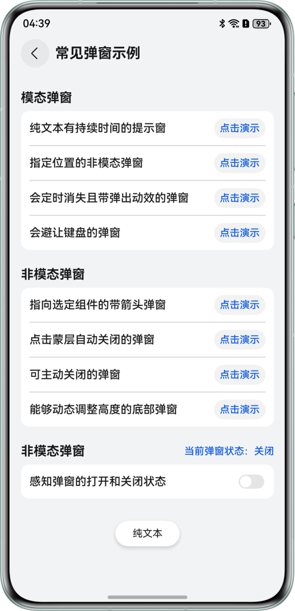


### 指定位置弹窗的非模态弹窗

在屏幕底部弹出SnackBar，该弹窗可以响应用户点击跳转页面或者关闭弹窗。


```cangjie
1. this.specifiedLocationDialog = this.specifiedLocationDialog ?? DialogHub.getCustomDialog()
2.  .setOperableContent(wrapBuilder(SnackbarBuilder), (action: DialogAction) => {
3.  let param = new SnackbarParams(() => {
4.  action.dismiss()
5.  }, this.pageInfos)
6.  return param
7.  })
8.  // ...
9.  .setConfig({
10.  dialogBehavior: { isModal: false, passThroughGesture: true },
11.  dialogPosition: {
12.  alignment: DialogAlignment.Bottom,
13.  offset: { dx: 0, dy: $r('app.float.specified_location_offset') }
14.  }
15.  })
16.  .build();
17. this.specifiedLocationDialog.show();

```


[CommonExamples.ets](https://gitcode.com/harmonyos_samples/DialogHub/blob/master/entry/src/main/ets/pages/CommonExamples.ets#L171-L192)


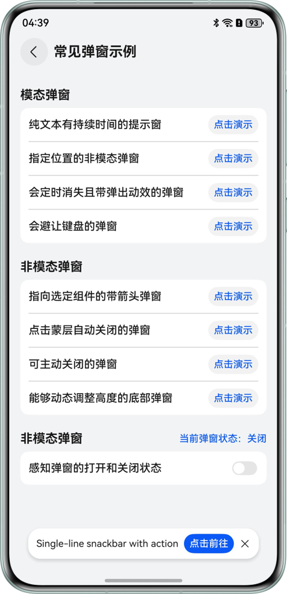


### 会定时消失且带弹出动效的弹窗

实现一个定时弹窗，6s自动关闭。


- 通过setAnimation()设置弹窗弹出动效。
- 通过dialog实例的updateContent()，定时动态刷新弹窗内容。
  
  
  

```cangjie
1. this.intervalsDisappearsDialog = this.intervalsDisappearsDialog ?? DialogHub.getCustomDialog()
2.  .setContent(wrapBuilder(TimeToastBuilder), params)
3.  .setStyle({
4.  radius: $r('app.float.popup_disappears_intervals_radius'),
5.  shadow: CommonConstant.CUSTOM_SAMPLE_STYLE_SHADOW
6.  })
7.  .setAnimation({ dialogAnimation: AnimationType.UP_DOWN })
8.  .setConfig({
9.  dialogBehavior: { isModal: false, passThroughGesture: true },
10.  dialogPosition: {
11.  alignment: DialogAlignment.Top,
12.  offset: { dy: $r('app.float.popup_disappears_intervals_offset'), dx: 0 }
13.  }
14.  })
15.  .build();
16.
17. this.intervalsDisappearsDialog.show();
18.
19. intervalID = setInterval(() => {
20.  time -= 1;
21.  params.content = time + CommonConstant.TIMED_CLOSED;
22.  this.intervalsDisappearsDialog?.updateContent(params)
23.  if (time <= 0 && intervalID) {
24.  this.intervalsDisappearsDialog?.dismiss();
25.  clearInterval(intervalID);
26.  }
27. }, CommonConstant.DURATION_1000);

```
  [CommonExamples.ets](https://gitcode.com/harmonyos_samples/DialogHub/blob/master/entry/src/main/ets/pages/CommonExamples.ets#L212-L238)


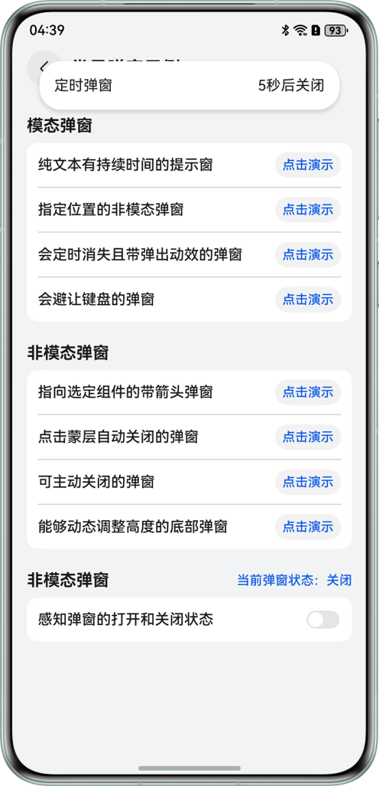


### 会避让键盘的弹窗

通过setConfig()的keyboardAvoidMode可以配置避让模式，CustomKeyboardAvoidMode.CONTENT_AVOID为弹窗内容避让。


requestFocusWhenShow配置为true，弹窗显示时，弹窗自动获焦。


```cangjie
1. this.avoidKeyboardDialog = this.avoidKeyboardDialog ?? DialogHub.getCustomDialog()
2.  .setContent(wrapBuilder(InputBuilder), param)
3.  // ...
4.  .setConfig({
5.  dialogBehavior: {
6.  isModal: false,
7.  passThroughGesture: true,
8.  requestFocusWhenShow: true,
9.  keyboardAvoidMode: CustomKeyboardAvoidMode.CONTENT_AVOID
10.  },
11.  dialogPosition: { alignment: DialogAlignment.Bottom }
12.  })
13.  .build();
14. this.avoidKeyboardDialog.show();

```


[CommonExamples.ets](https://gitcode.com/harmonyos_samples/DialogHub/blob/master/entry/src/main/ets/pages/CommonExamples.ets#L262-L280)


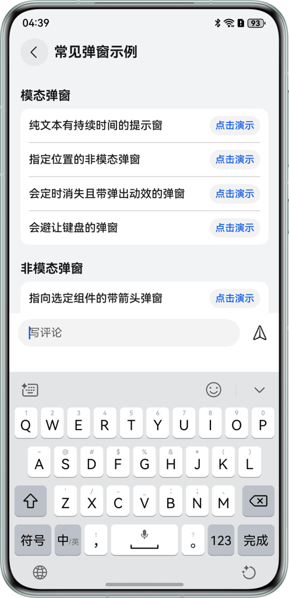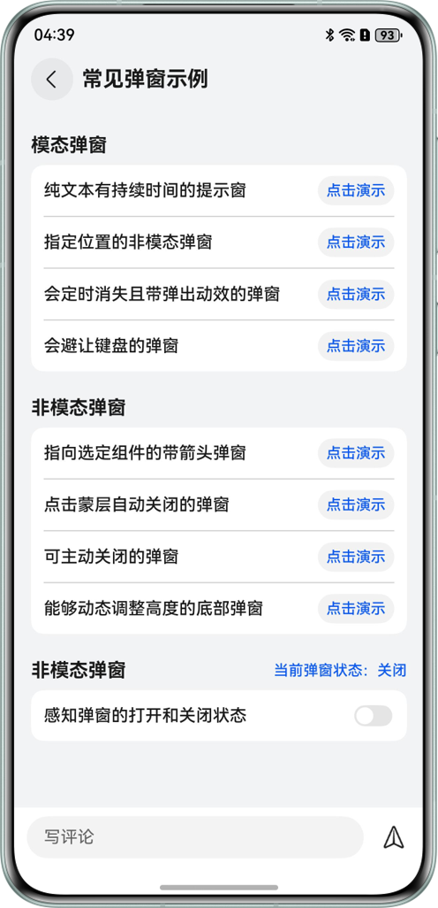


### 指向选定组件的带箭头弹窗

通过getPopup()构造Popup弹窗实例，setStyle()中enableArrow、arrowOffset、arrowWidth、arrowHeight可配置箭头属性；


setConfig()中preferPlacement可配置箭头偏向。


说明

绑定组件需要调用setComponentTargetId(targetCompId)，targetCompId组件id标识确保唯一，否则会报错且弹窗位置异常。


```typescript
1. DialogHub.getPopup()
2.  // ...
3.  .setComponentTargetId('PopupDialog1')
4.  .setStyle({
5.  radius: $r('app.float.image_popup_builder_borderRadius'),
6.  backgroundColor: Color.White,
7.  shadow: {
8.  radius: $r('app.float.image_popup_shadow_radius'),
9.  color: $r('app.color.image_popup_shadow_color')
10.  },
11.  })
12.  .setConfig({
13.  dialogPosition: {
14.  preferPlacement: Placement.Bottom
15.  }
16.  })
17.  .build()
18.  .show();

```


[CommonExamples.ets](https://gitcode.com/harmonyos_samples/DialogHub/blob/master/entry/src/main/ets/pages/CommonExamples.ets#L294-L318)


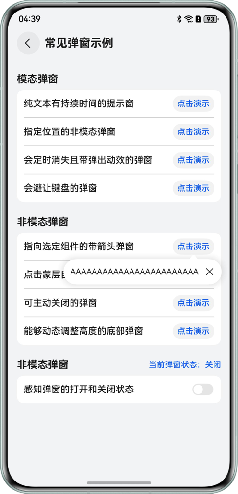


### 点击蒙层自动关闭的弹窗

弹出此类型弹窗需要打开isModal蒙层开关，并将autoDismiss设置为true


```typescript
1. this.maskCloseDialog = this.maskCloseDialog ?? DialogHub.getCustomDialog()
2.  // ...
3.  .setConfig({ dialogBehavior: { isModal: true, autoDismiss: true, passThroughGesture: false } })
4.  .build();
5. this.maskCloseDialog.show();

```


[CommonExamples.ets](https://gitcode.com/harmonyos_samples/DialogHub/blob/master/entry/src/main/ets/pages/CommonExamples.ets#L366-L382)


### 可主动关闭的弹窗

能够通过点击弹窗按钮关闭弹窗，设置弹窗Content时，调用setOperableContent()，并将DialogHub的Dismiss事件作为参数传递给Builder。


```typescript
1. this.activelyCloseDialog = this.activelyCloseDialog ?? DialogHub.getCustomDialog()
2.  .setOperableContent(wrapBuilder(ActiveCloseBuilder), (action: DialogAction) => {
3.  let param =
4.  new ActiveCloseParams(CommonConstant.LOGOUT, CommonConstant.LOGOUT_TIPS,
5.  CommonConstant.CANCEL, CommonConstant.OUT, () => {
6.  action.dismiss();
7.  }, () => {
8.  this.activelyCloseDialog?.dismiss();
9.  })
10.  return param;
11.  })
12.  .setConfig({ dialogBehavior: { isModal: true, autoDismiss: false, passThroughGesture: false } })
13.  .setStyle({
14.  radius: $r('app.float.active_close_builder_borderRadius'),
15.  backgroundColor: Color.White,
16.  })
17.  .build();
18. this.activelyCloseDialog.show();

```


[CommonExamples.ets](https://gitcode.com/harmonyos_samples/DialogHub/blob/master/entry/src/main/ets/pages/CommonExamples.ets#L398-L415)


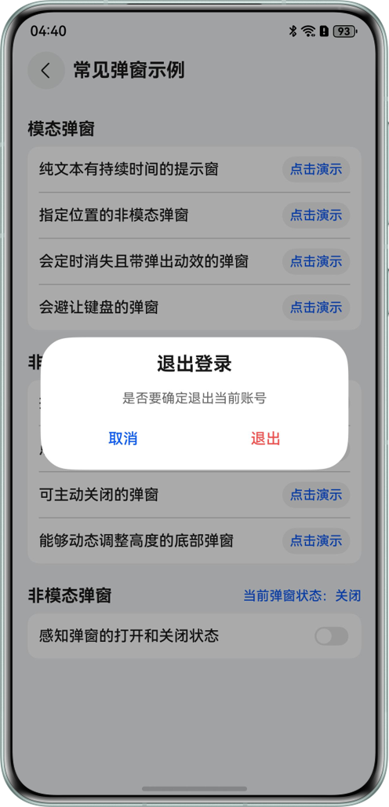


### 能够动态调整高度的底部弹窗

实现动态调整弹窗高度，不同高度展示不同弹窗内容。


- 获取DialogHub的Sheet类型弹窗实例
  
  
  

```typescript
1. this.adjustSheetDialog = DialogHub.getSheet()
2.  .setContent(wrapBuilder(SheetBuilder), sheetParams)
3.  .setStyle({ preferType:SheetType.BOTTOM, detents: [CommonConstant.SHEET_MIDDLE, CommonConstant.SHEET_LARGE] })
4.  .setConfig({ enableOutsideInteractive: false, scrollSizeMode: ScrollSizeMode.CONTINUOUS })
5.  .setComponentTargetId(CommonConstant.ADJUST_SHEET_DIALOG_ID)
6.  .build();

```
  [CommonExamples.ets](https://gitcode.com/harmonyos_samples/DialogHub/blob/master/entry/src/main/ets/pages/CommonExamples.ets#L85-L90)

- 弹窗实例增加Sheet高度监听onHeightDidChange()，当高度变化到一定程度，updateContent()刷新弹窗内容
  
  
  

```typescript
1. this.adjustSheetDialog.addLifeCycleListener({
2.  onHeightDidChange: (h: number) => {
3.  let vpValue = this.getUIContext().px2vp(h)
4.  if (vpValue <= CommonConstant.SHEET_MIDDLE && sheetParams.type != 0) {
5.  sheetParams.type = 0
6.  this.adjustSheetDialog?.updateContent(sheetParams)
7.  } else if (vpValue > CommonConstant.SHEET_MIDDLE && sheetParams.type != 1) {
8.  sheetParams.type = 1
9.  this.adjustSheetDialog?.updateContent(sheetParams)
10.  }
11.  },
12.  // ...
13. });
14.  this.adjustSheetDialog?.show();

```
  [CommonExamples.ets](https://gitcode.com/harmonyos_samples/DialogHub/blob/master/entry/src/main/ets/pages/CommonExamples.ets#L94-L432)


说明

sheet类型弹窗须调用setComponentTargetId(targetCompId)以实现页面级弹窗，并且保证绑定的组件id存在。


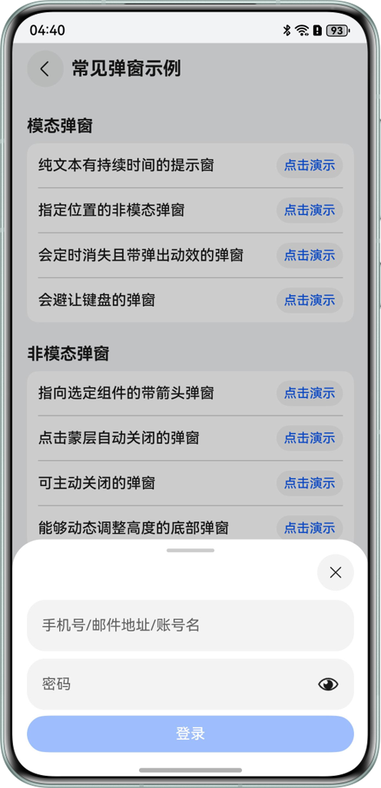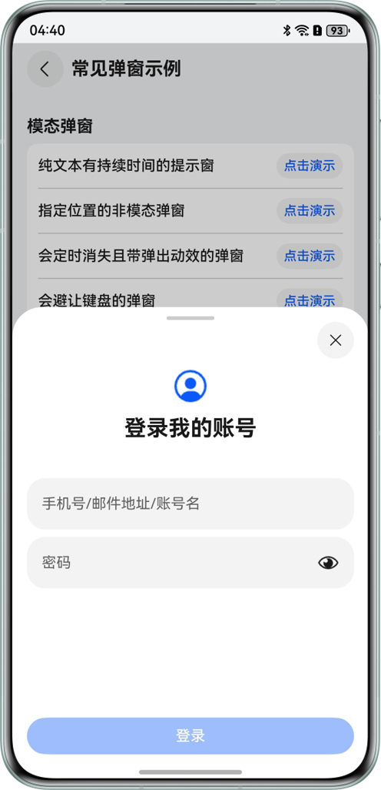


### 应用感知弹窗的打开、关闭

- 对弹窗实例增加生命周期，拦截弹窗的展示与销毁。
  
  
  

```typescript
1. this.sensorDialog?.addLifeCycleListener({
2.  onWillShow: () => {
3.  this.isSensorDialogShow = true
4.  return true;
5.  },
6.  onWillDismiss: (reason: DialogDismissReason) => {
7.  this.isSensorDialogShow = false
8.  return true;
9.  }
10. })

```
  [CommonExamples.ets](https://gitcode.com/harmonyos_samples/DialogHub/blob/master/entry/src/main/ets/pages/CommonExamples.ets#L65-L74)

- 直接获取弹窗状态
  
  
  

```typescript
1. // SHOW: 显示，HIDE: 隐藏， DEFAULT: 默认状态
2. this.sensorDialog?.getStatus();

```
  [CommonExamples.ets](https://gitcode.com/harmonyos_samples/DialogHub/blob/master/entry/src/main/ets/pages/CommonExamples.ets#L78-L79)


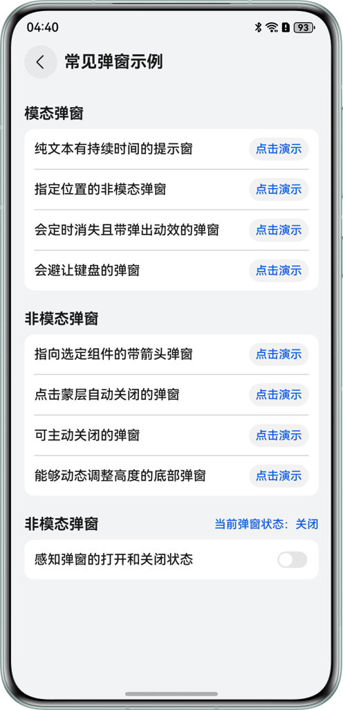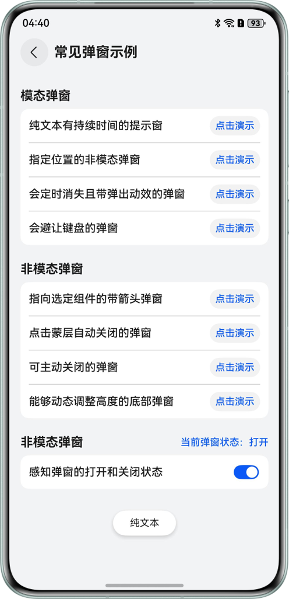


## 弹窗与周边的交互


### 弹窗存在时如何定义返回手势是退出页面或关闭弹窗

配置状态变量backCloseDialog，设置true表示返回手势作用于弹窗，false表示作用于页面。


```typescript
1. @State backCloseDialog: boolean = false;

```


[OperableExample.ets](https://gitcode.com/harmonyos_samples/DialogHub/blob/master/entry/src/main/ets/pages/OperableExample.ets#L54-L54)


在onBackPressed()中拦截手势并选择是退出页面还是关闭最上层弹窗


```typescript
1. .onBackPressed(() => {
2.  if (this.backCloseDialog) {
3.  let tmp: DialogBackPressResult = DialogHub.dispatchBackPressToDialog();
4.  if (tmp !== DialogBackPressResult.NO_DIALOG) {
5.  return true;
6.  }
7.  }
8.  this.pageInfos.pop();
9.  return true;
10. })

```


[OperableExample.ets](https://gitcode.com/harmonyos_samples/DialogHub/blob/master/entry/src/main/ets/pages/OperableExample.ets#L581-L590)


### 用户可以透过弹窗内容操作页面

弹出Toast类型的弹窗，或者主动调用setConfig()设置passThroughGesture为true，可实现弹窗内容透传手势。


```typescript
1. this.passThroughGestureDialog = DialogHub.getToast()
2.  .setContent(wrapBuilder(IconToastBuilder))
3.  // ...
4.  .setDuration(CommonConstant.DURATION_2000)
5.  .build();
6. this.passThroughGestureDialog.show();

```


[OperableExample.ets](https://gitcode.com/harmonyos_samples/DialogHub/blob/master/entry/src/main/ets/pages/OperableExample.ets#L246-L257)


```typescript
1. DialogHub.createCustomTemplate(CommonConstant.CUSTOM_TEMPLATE_SIMPLE)
2.  .setContent(wrapBuilder(TextToastBuilder))
3.  .setStyle({ backgroundColor: Color.White })
4.  .setConfig({ dialogBehavior: { passThroughGesture: true, isModal: false } })

```


[Index.ets](https://gitcode.com/harmonyos_samples/DialogHub/blob/master/entry/src/main/ets/pages/Index.ets#L33-L36)


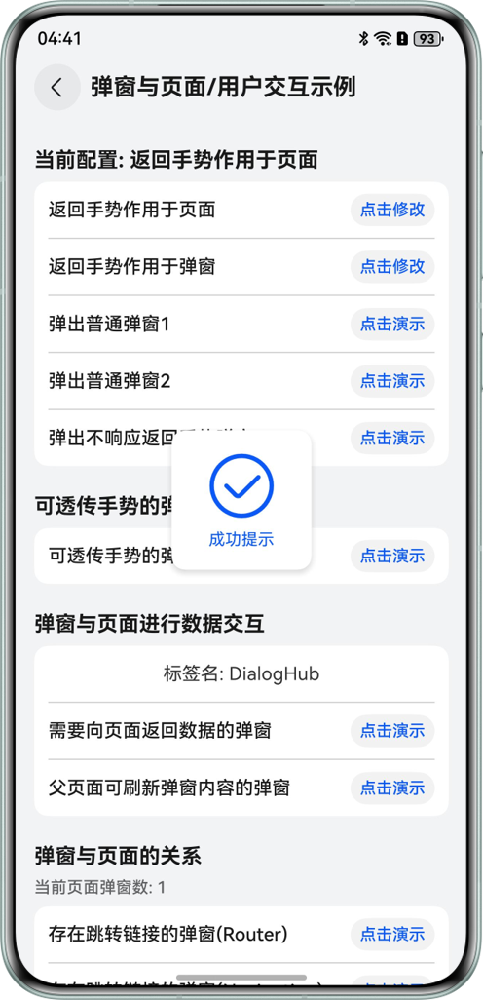


### 需要向页面返回数据的弹窗

给Builder参数传递修改页面数据的回调函数，在Builder里面进行调用。


```typescript
1. this.returnDataDialog = DialogHub.getCustomDialog()
2.  .setOperableContent(wrapBuilder(InputCallbackBuilder), (action: DialogAction) => {
3.  let parms = new InputCallbackParams(CommonConstant.UPDATE_TAG, () => {
4.  action.dismiss();
5.  }, (value) => {
6.  this.tagName = value;
7.  })
8.  return parms;
9.  })
10.  .setStyle({
11.  radius: $r('app.float.InputCallbackBuilderBorderRadius')
12.  })
13.  .setConfig({ dialogBehavior: { isModal: true, autoDismiss: false } })
14.  .build();
15. this.returnDataDialog.show();

```


[OperableExample.ets](https://gitcode.com/harmonyos_samples/DialogHub/blob/master/entry/src/main/ets/pages/OperableExample.ets#L298-L312)


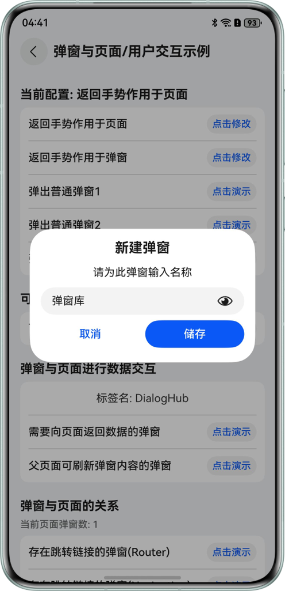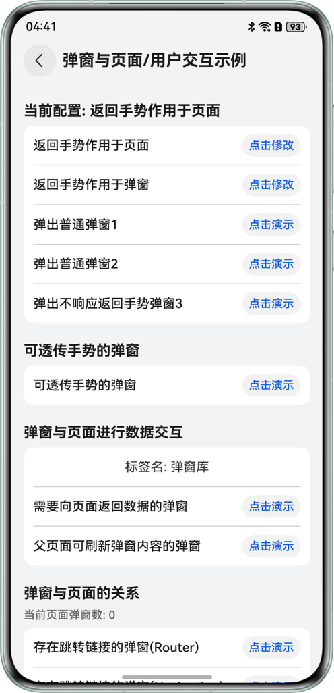


### 父页面刷新正在展示的弹窗内容

修改Builder参数内容，再调用updateContent()进行修改。


```typescript
1. let params = new ProgressParams(CommonConstant.ProgressName, CommonConstant.ProgressNameStart,
2.  CommonConstant.ProgressNameTotal);
3.
4. this.updateByParentDialog = DialogHub.getCustomDialog()
5.  .setContent(wrapBuilder(ProgressBuilder), params)
6.  .setStyle({ radius: $r('app.float.ProgressBuilderProgressBorderRadius') })
7.  .setConfig({ dialogBehavior: { isModal: true, autoDismiss: false } })
8.  .build();
9. this.updateByParentDialog.show();
10.
11. this.intervalID = setInterval(() => {
12.  params.value += 1
13.  if (params.value >= CommonConstant.ProgressNameTotal && this.intervalID >= 0) {
14.  this.updateByParentDialog?.dismiss();
15.  clearInterval(this.intervalID);
16.  }
17.  this.updateByParentDialog?.updateContent(params);
18. }, CommonConstant.Interval_20);

```


[OperableExample.ets](https://gitcode.com/harmonyos_samples/DialogHub/blob/master/entry/src/main/ets/pages/OperableExample.ets#L328-L345)


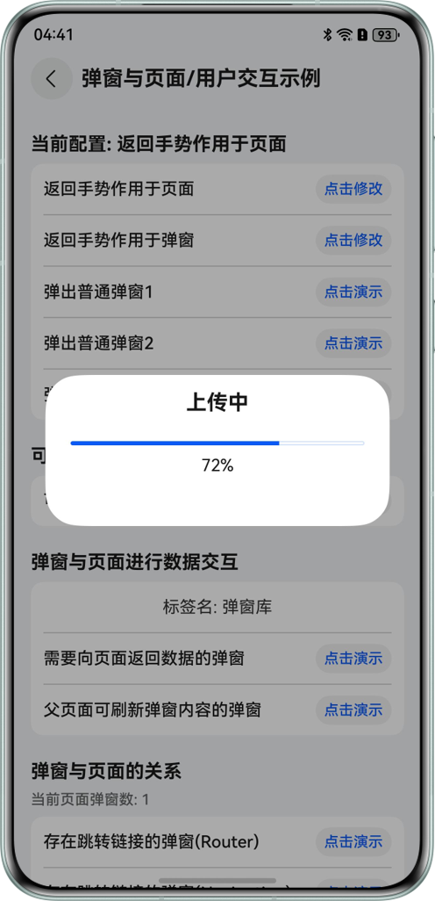


### 页面需要感知当前页面是否存在弹窗

DialogHub注册页面弹窗数监听，当前页面弹窗数量发生变化会触发。


```typescript
1. DialogHub.addEventListener({
2.  OnCurentPageDialogNumberChange: (newNum: number, oldNum: number) => {
3.  this.dialogNum = newNum;
4.  }
5. })

```


[OperableExample.ets](https://gitcode.com/harmonyos_samples/DialogHub/blob/master/entry/src/main/ets/pages/OperableExample.ets#L87-L91)


### 存在跳转链接的弹窗

点击弹窗上特定内容，跳转到其他页面。


router：在弹窗Builder里通过router模板跳转。


Navigation：将pageInfos传入弹窗Builder，然后在弹窗里进行push页面。


```typescript
1. let parms = new SkipParams(() => {
2.  this.skipDialog?.dismiss();
3. }, 1, this.pageInfos);
4. this.skipDialog?.updateContent(parms);
5. this.skipDialog?.updateConfig({
6.  dialogPosition: { offset: { dx: 0, dy: 0 } }
7. });
8. this.skipDialog?.show();

```


[OperableExample.ets](https://gitcode.com/harmonyos_samples/DialogHub/blob/master/entry/src/main/ets/pages/OperableExample.ets#L405-L412)


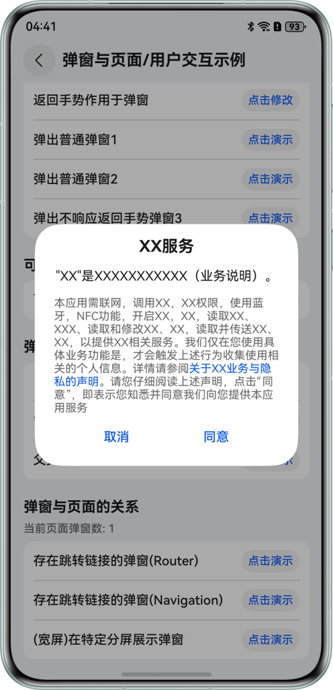


### 折叠屏展开态不同位置的弹窗

弹窗默认在屏幕中间；通过设置弹窗偏移量可以在不同位置进行弹窗。


弹窗在左半屏：


```typescript
1. let parms = new SkipParams(() => {
2.  this.skipDialog?.dismiss()
3. }, 1, this.pageInfos);
4. this.skipDialog?.updateContent(parms);
5. this.skipDialog?.updateConfig({
6.  dialogPosition: { offset: CommonConstant.LEFT_DIALOG_OFFSET }
7. });
8. this.skipDialog?.show();

```


[OperableExample.ets](https://gitcode.com/harmonyos_samples/DialogHub/blob/master/entry/src/main/ets/pages/OperableExample.ets#L532-L539)


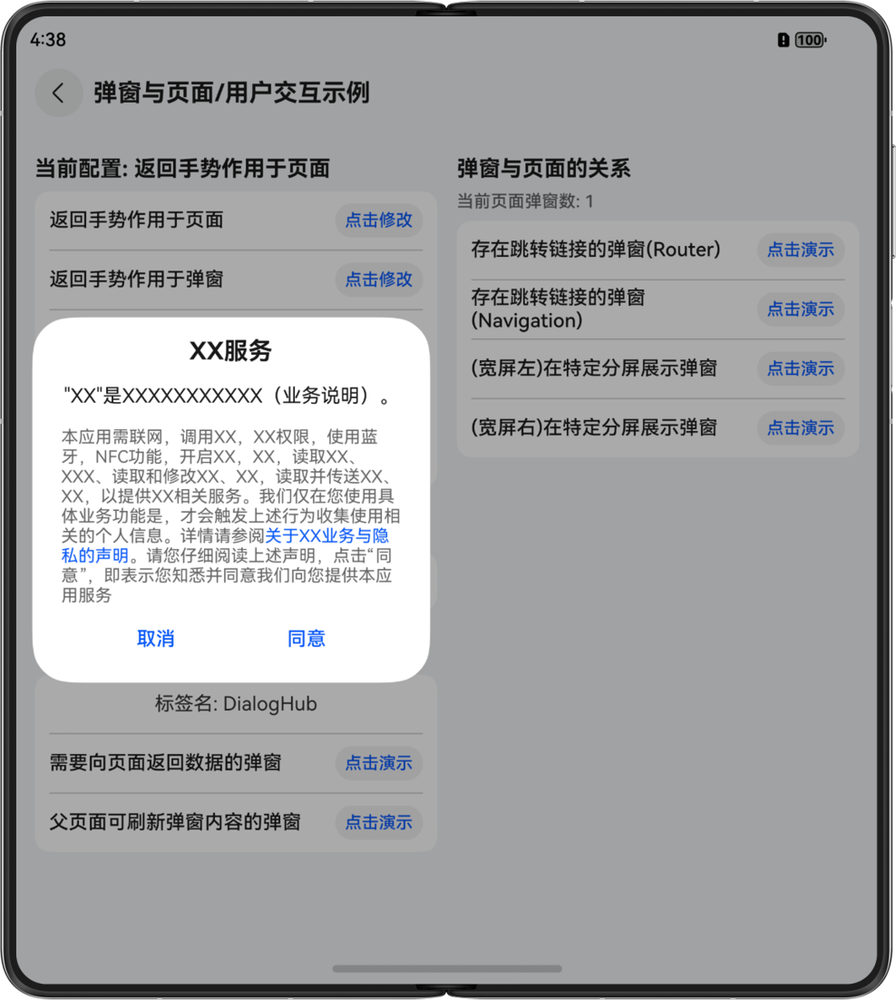


弹窗在右半屏：


```typescript
1. let parms = new SkipParams(() => {
2.  this.skipDialog?.dismiss();
3. }, 1, this.pageInfos);
4. this.skipDialog?.updateContent(parms);
5. this.skipDialog?.updateConfig({
6.  dialogPosition: { offset: CommonConstant.RIGHT_DIALOG_OFFSET }
7. });
8. this.skipDialog?.show();

```


[OperableExample.ets](https://gitcode.com/harmonyos_samples/DialogHub/blob/master/entry/src/main/ets/pages/OperableExample.ets#L555-L562)


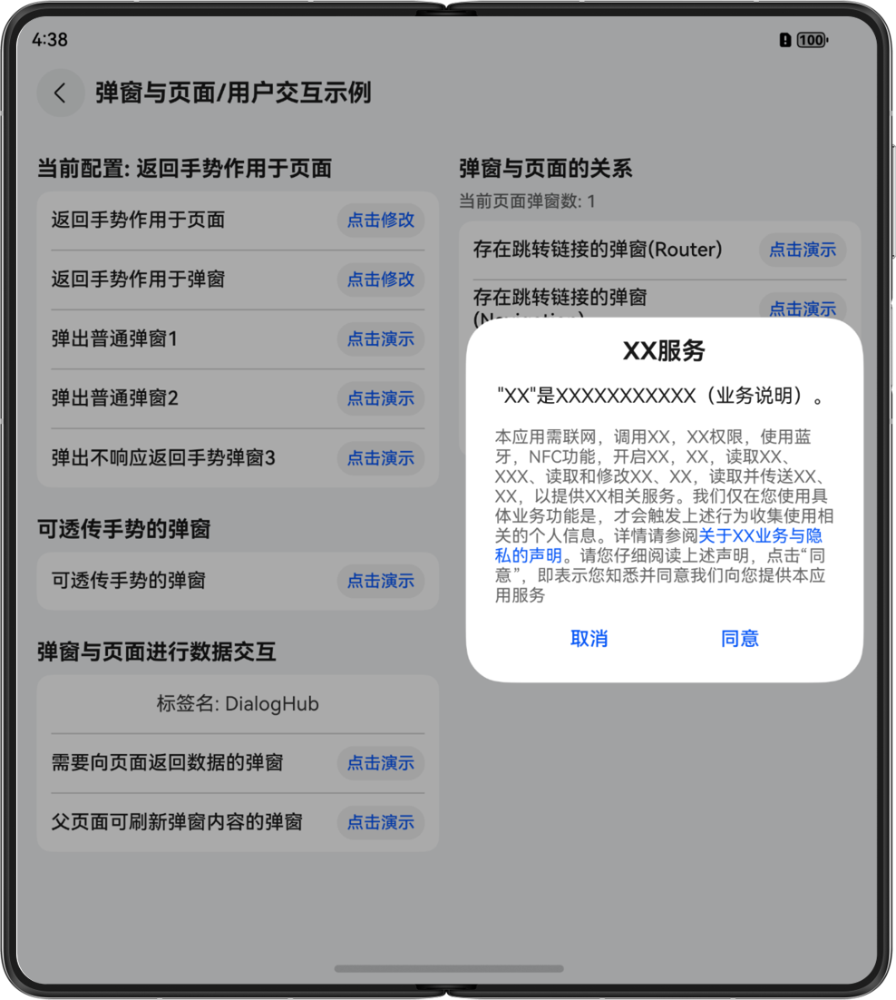


## 弹窗内容复用场景


### 通过自定义弹窗模版进行弹窗

- 创建弹窗模板
  
  
  

```typescript
1. DialogHub.createToastTemplate(CommonConstant.MY_TEMPLATE_NAME)
2.  .setTextContent(CommonConstant.TOAST_DISPLAYED_CONTENT)
3.  // ...
4.  .setDuration(CommonConstant.TOAST_DISPLAY_DURATION)
5.  .register();

```
  [ReuseExample.ets](https://gitcode.com/harmonyos_samples/DialogHub/blob/master/entry/src/main/ets/pages/ReuseExample.ets#L58-L77)

- 直接弹出模板
  
  
  

```typescript
1. DialogHub.getToastTemplate(CommonConstant.MY_TEMPLATE_NAME)?.build().show();

```
  [ReuseExample.ets](https://gitcode.com/harmonyos_samples/DialogHub/blob/master/entry/src/main/ets/pages/ReuseExample.ets#L139-L139)

- 删除弹窗模板
  
  
  

```typescript
1. DialogHub.removeTemplate(CommonConstant.MY_TEMPLATE_NAME);

```
  [ReuseExample.ets](https://gitcode.com/harmonyos_samples/DialogHub/blob/master/entry/src/main/ets/pages/ReuseExample.ets#L99-L99)

- 随机修改弹窗模板背景色
  
  
  

```typescript
1. let r = (Math.ceil(Math.random() * 239 + 16) % 255).toString(16);
2. let g = (Math.ceil(Math.random() * 239 + 16) % 255).toString(16);
3. let b = (Math.ceil(Math.random() * 239 + 16) % 255).toString(16);
4. let color = '#ff' + r + g + b;
5. DialogHub.updateToastTemplate(CommonConstant.MY_TEMPLATE_NAME)?.setStyle({
6.  backgroundColor: color
7. }).register();

```
  [ReuseExample.ets](https://gitcode.com/harmonyos_samples/DialogHub/blob/master/entry/src/main/ets/pages/ReuseExample.ets#L116-L122)

- (可选)通过弹窗模板，定义本次弹出动画后弹出
  
  
  

```typescript
1. DialogHub.getToastTemplate(CommonConstant.MY_TEMPLATE_NAME)?.setAnimation({
2.  dialogAnimation: AnimationType.UP_DOWN
3. }).build().show();

```
  [ReuseExample.ets](https://gitcode.com/harmonyos_samples/DialogHub/blob/master/entry/src/main/ets/pages/ReuseExample.ets#L156-L158)


### 定义一个可复用的弹窗

将弹窗实例对象记录，下次弹窗复用。


```typescript
1. originalTemplateDialog?: InfToast;

```


[ReuseExample.ets](https://gitcode.com/harmonyos_samples/DialogHub/blob/master/entry/src/main/ets/pages/ReuseExample.ets#L31-L31)


```typescript
1. this.originalTemplateDialog =
2.  DialogHub.getToastTemplate(CommonConstant.MY_TEMPLATE_NAME)?.build();

```


[ReuseExample.ets](https://gitcode.com/harmonyos_samples/DialogHub/blob/master/entry/src/main/ets/pages/ReuseExample.ets#L81-L82)


```typescript
1. this.originalTemplateDialog?.show();

```


[ReuseExample.ets](https://gitcode.com/harmonyos_samples/DialogHub/blob/master/entry/src/main/ets/pages/ReuseExample.ets#L203-L203)


## 多个弹窗并存场景


### 新弹窗被已有弹窗抑制

- **弹窗A弹出时抑制弹窗B的弹出**     可以通过弹窗A对象的getStatus()方法获取弹窗A的状态，以判断是否允许弹窗B弹出。


  
  
  

```typescript
1. if (this.dialogA?.getStatus() != DialogStatus.SHOW) {
2.  this.dialogB?.show();
3. }


```
  [MultiDialogExample.ets](https://gitcode.com/harmonyos_samples/DialogHub/blob/master/entry/src/main/ets/pages/MultiDialogExample.ets#L143-L145)


- **当前页面存在弹窗时抑制弹窗C的弹出**     通过调用DialogHub的getCurrentPageDialogs()方法获取当前页面的弹窗数量，判断数量是否为0，并据此控制弹窗C的弹出。


  
  
  

```typescript
1. if (DialogHub.getCurrentPageDialogs().length === 0) {
2.  this.dialogC?.show();
3. }


```
  [MultiDialogExample.ets](https://gitcode.com/harmonyos_samples/DialogHub/blob/master/entry/src/main/ets/pages/MultiDialogExample.ets#L166-L168)


### 开发者可以控制弹窗层级实现弹窗的相互覆盖

- 设置弹窗层级setLayerIndex()
  
  
  

```typescript
1. this.dialogF = this.dialogF ??
2. this.createMessageBuilder(CommonConstant.DIALOG_F, CommonConstant.DIALOG_F_CONTENT)
3.  .setLayerIndex(CommonConstant.DIALOG_F_LAYER_INDEX)
4.  .build();

```
  [MultiDialogExample.ets](https://gitcode.com/harmonyos_samples/DialogHub/blob/master/entry/src/main/ets/pages/MultiDialogExample.ets#L231-L234)


- 设置置顶弹窗OLD_FIRST (老置顶弹窗优先，新的置顶弹窗无法弹出)
  
  
  

```typescript
1. this.dialogG = this.dialogG ??
2. this.createMessageBuilder(CommonConstant.DIALOG_G, CommonConstant.DIALOG_G_CONTENT).setConfig({
3.  dialogBehavior: {
4.  layerPolicy: { alwaysTop: true, topDialogPriority: TopDialogPriority.OLD_FIRST }
5.  }
6. }).build();

```
  [MultiDialogExample.ets](https://gitcode.com/harmonyos_samples/DialogHub/blob/master/entry/src/main/ets/pages/MultiDialogExample.ets#L252-L257)


- 设置置顶弹窗NEW_FIRST (新弹窗优先，新的置顶弹窗弹出，老置顶弹窗被覆盖)
  
  
  

```typescript
1. this.dialogH = this.dialogH ??
2. this.createMessageBuilder(CommonConstant.DIALOG_H, CommonConstant.DIALOG_H_CONTENT).setConfig({
3.  dialogBehavior: {
4.  layerPolicy: { alwaysTop: true, topDialogPriority: TopDialogPriority.NEW_FIRST }
5.  }
6. }).build();

```
  [MultiDialogExample.ets](https://gitcode.com/harmonyos_samples/DialogHub/blob/master/entry/src/main/ets/pages/MultiDialogExample.ets#L275-L280)


## 常见问题


### 如何处理弹窗的获焦问题

- 对于Sheet类别的弹窗，弹窗弹出后的焦点行为与系统BindSheet保持一致；

- DialogHub提供的其他类别弹窗，如CustomDialg，在弹窗弹出时父页面的焦点默认不会转移到弹窗上。     开发者可以配置弹窗的requestFocusWhenShow属性实现：弹窗弹出时，将页面的焦点转移到弹窗中。进而实现[会避让键盘的弹窗](https://developer.huawei.com/consumer/cn/doc/best-practices/bpta-hadss_dialoghub#section395448164119)的效果。


### Popup绑定组件，id报错

[组件标识id](https://developer.huawei.com/consumer/cn/doc/harmonyos-references/ts-universal-attributes-component-id#id)需要开发者保证唯一性。setComponentTargetId()设置绑定的组件id后，如果id有问题，会导致在show的时候报错且弹窗位置异常。


- id不存在：不存在此id的节点，排查绑定组件是否设置该id属性。错误码70000001。


### 调用build()与show()接口后，无法继续添加属性

调用build()接口后返回的是Dialog实例，只提供更新配置的接口。


### removeTemplate()后，使用模板创建的弹窗实例可以继续显示

删除模板不影响之前通过模板已经创建的弹窗的显示和相关调用。


### 调用isTemplateExist()判断模板存在，getxxxTemplate模板报错50000003

模板创建和获取时，需要保证弹窗类型一致，否则无法获取模板并报错，错误码50000003。


可在获取模板前调用queryTemplate()查询模板的弹窗类型。


### Toast弹窗置顶策略

Toast弹窗默认为置顶弹窗，且置顶冲突策略为TopDialogPriority.NEW_FIRST。


### 键盘避让模式变化

在使用DialogHub进行弹窗后，会将页面键盘避让模式修改为RESIZE，当页面无弹窗或者页面跳转时，避让模式还原。


### 弹窗如何处理用户的返回手势

开发者可以通过Dialoghub.init(xxx，xx)设置不同的[弹窗模式](https://gitcode.com/openharmony-sig/dialoghub/blob/master/docs/Reference.md#dialogmode%E6%9E%9A%E4%B8%BE%E8%AF%B4%E6%98%8E)，不同的模式下处理措施不同。


- DialogMode.OverlayManager（默认）模式下，返回手势会优先作用于页面，由页面消费该事件。
  处理方法如下：
  1. 在页面的onBackPress()中调用dispatchBackPressToDialog()方法将事件传递给弹窗。
  2. 在弹窗的onWillDismiss()方法中，针对【DialogDismissReason.PRESS_BACK】原因，对返回手势进行处理。


- DialogMode.CustomDialog模式下，返回手势会作用于弹窗，由弹窗消费该事件。     处理方法如下：


  1. 直接在弹窗的onWillDismiss()方法中，针对【DialogDismissReason.PRESS_BACK】原因，对返回手势进行处理
  2. 在弹窗的onWillDismiss()方法中继续处理页面操作，如通过页面栈进行处理。


## 示例代码

- [基于DialogHub实现通用弹窗库案例](https://gitcode.com/harmonyos_samples/DialogHub)
