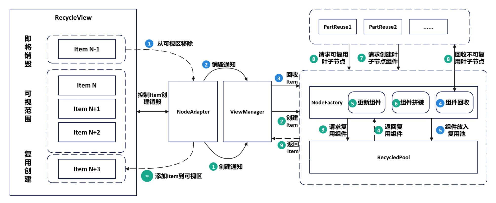
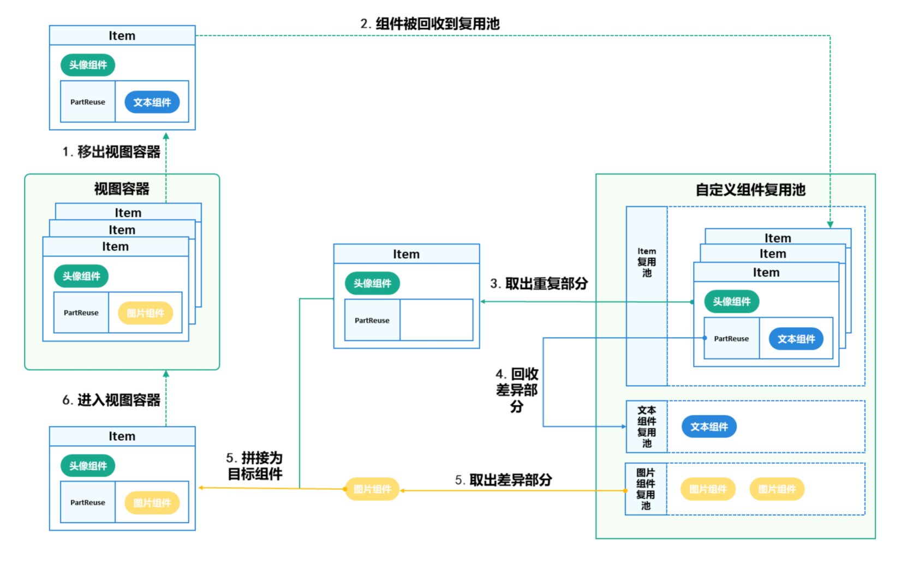
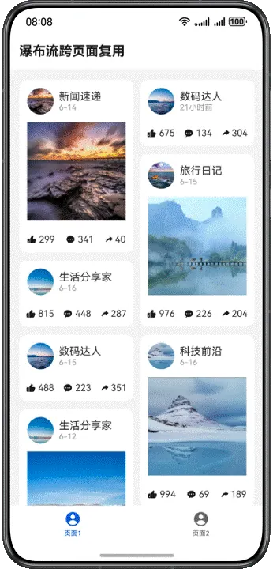
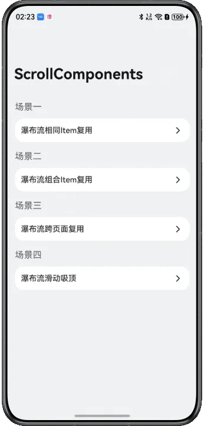
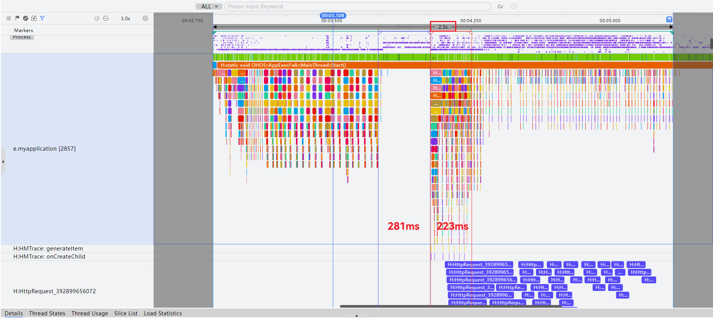
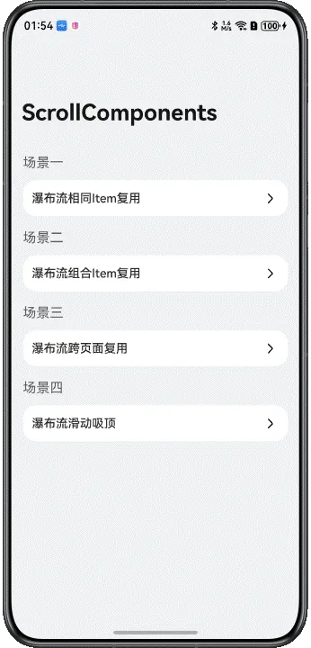
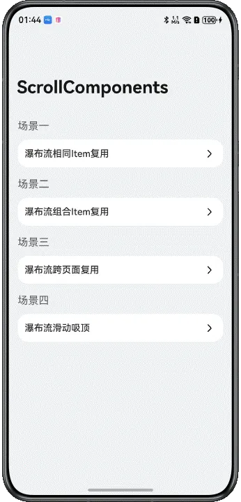

# 基于ScrollComponents实现瀑布流

---

## 概述

瀑布流是应用开发中常见的开发场景。通过容器的布局规则，将元素自上而下排列，形成多列不齐的界面，内容像瀑布一样从上而下倾泻。


瀑布流适用于展示图片资讯、购物商品、直播视频等多种数据。当瀑布流上下滑动时，无限加载特性使其能展示大量数据；不同大小的子元素会带来测量和绘制的性能消耗。本文通过跨页面复用、加速首屏渲染、无限滑动、下拉刷新、上拉加载等场景，介绍ScrollComponents库创建高流畅滑动的瀑布流页面。


ScrollComponents作为高性能滑动解决方案，主要解决组件复用的问题，支持通过少量的代码实现高性能滑动，同时开发者无需关注复用池管理和其他性能优化方案的交互细节。可以参考[ScrollComponents使用说明](https://gitcode.com/openharmony-sig/scroll_components/blob/master/README.md#%E5%BF%AB%E9%80%9F%E5%BC%80%E5%A7%8B)进行安装配置与快速上手。ScrollComponents框架提供了下列功能特性：


- 支持WaterFlow页面的流畅滑动
- 默认支持懒加载，开发者不用使用[LazyForEach](https://developer.huawei.com/consumer/cn/doc/harmonyos-references/ts-rendering-control-lazyforeach)和定义IDataSource数据源，减少一定的代码量
- 支持组件复用，解决滑动丢帧，提升滑动性能
- 支持复用池共享，满足跨页面跨父组件复用能力
- 支持预创建，减少冷启动首次滑动丢帧，提升滑动性能
- 支持预加载，滑动过程提前加载数据，提升浏览体验


ScrollComponents三方库基于系统[NodeAdapter](https://developer.huawei.com/consumer/cn/doc/harmonyos-references/js-apis-arkui-framenode#nodeadapter12)、[BuilderNode](https://developer.huawei.com/consumer/cn/doc/harmonyos-references/js-apis-arkui-buildernode)、[FrameNode](https://developer.huawei.com/consumer/cn/doc/harmonyos-references/js-apis-arkui-framenode)、[Prefetcher](https://developer.huawei.com/consumer/cn/doc/harmonyos-references/js-apis-arkui-prefetcher)、[FrameCallback](https://developer.huawei.com/consumer/cn/doc/harmonyos-references/arkts-apis-uicontext-framecallback)的能力，通过高效率组件复用、组件分帧预创建、内容动态预创建、懒加载等方式，实现高性能滑动。同时基于系统FrameNode创建WaterFlow组件的能力，提供了WaterFlowManager接口支持瀑布流页面渲染，为开发者提供WaterFlow组件的其他各种能力，在满足开发者正常开发的前提下简化用法，便于后续能力扩展。


## 实现原理


### 关键技术


ScrollComponents三方库底层封装NodeContainer+FrameNode，结合NodeAdapter+BuilderNode+自定义复用池实现懒加载、组件复用、组件预创建等能力，同时为开发者提供WaterFlowManager视图管理组件，为开发者提供系统滑动组件的其他各种能力，在满足开发者正常开发的前提下提供高性能的滑动能力，只需传入数据源和viewManager即可快速实现懒加载和组件复用的开发，可以更加聚焦业务实现。


如图1是RecyclerView整体流程图，当节点从可视区移除时，NodeAdapter会通知视图管理器将组件回收，经NodeFactory回收处理之后，组件最终被存入到组件复用池。当节点需要创建时，NodeAdapter通知视图管理器开始创建，NodeFactory会向复用池请求复用节点，获取到节点之后经过一系列更新组件、组件拼接之后返回，最后由NodeAdapter将节点添加到可视区。


**图1** RecyclerView整体流程图  


### 开发流程

1. 创建瀑布流视图管理器。     WaterFlowManager仅具备基础的视图能力，开发者需自定义一个继承自WaterFlowManager的类，可以实现onWillCreateItem()方法，从复用池获取组件，开启复用能力，具体参考[复用子节点模板](https://developer.huawei.com/consumer/cn/doc/best-practices/bpta-waterflow-based-on-scrollcomponents#li18448145318540)。

     创建视图管理器的实例对象中，defaultNodeItem属性表示默认节点模板名称，context属性表示UI上下文。


  
  
  

```cangjie
1. import { NodeItem, RecyclerView, WaterFlowManager } from '@hadss/scroll_components';
2. class MyWaterFlowManager extends WaterFlowManager {
3.  onWillCreateItem(index: number, data: BlogData) {
4.  // ...
5.  }
6. }
7. @Entry
8. @Component
9. struct StandardWaterFlowPage {
10.  waterFlowView: MyWaterFlowManager = new MyWaterFlowManager({
11.  defaultNodeItem: 'StandardGridImageContainer',
12.  context: this.getUIContext()
13.  });
14.  // ...
15. }


```
  [StandardWaterFlowPage.ets](https://gitcode.com/harmonyos_samples/WaterFlowScrollComponent/blob/master/entry/src/main/ets/pages/StandardWaterFlowPage.ets#L18-L176)

  
  
  说明
      如果开发者想通过ScrollComponents快速创建瀑布流，方便使用懒加载、预创建等提升滑动效率的能力，而不考虑组件复用，则直接使用ScrollComponents库提供的WaterFlowManager创建瀑布流视图管理器即可。具体可参考[ScrollComponents使用说明-快速开始](https://gitcode.com/openharmony-sig/scroll_components/blob/master/README.md#%E5%BF%AB%E9%80%9F%E5%BC%80%E5%A7%8B)。

2. WaterFlow组件初始化     页面初始化时，开发者通过视图管理器的setViewStyle()方法，给瀑布流组件设置属性。


  
  
  

```typescript
1. this.waterFlowView.setViewStyle({ scroller: this.scroller })
2.  .height(CommonConstants.FULL_HEIGHT)
3.  .columnsTemplate(CommonConstants.WATER_FLOW_COLUMNS_TEMPLATE)
4.  .columnsGap(CommonConstants.COLUMNS_GAP)
5.  .rowsGap(CommonConstants.ROWS_GAP)
6.  .padding({
7.  top: CommonConstants.PADDING,
8.  left: CommonConstants.PADDING,
9.  right: CommonConstants.PADDING
10.  })
11.  .fadingEdge(true, { fadingEdgeLength: LengthMetrics.vp(80) })


```
  [StandardWaterFlowPage.ets](https://gitcode.com/harmonyos_samples/WaterFlowScrollComponent/blob/master/entry/src/main/ets/pages/StandardWaterFlowPage.ets#L134-L144)

3. 设置数据源渲染组件
  1. 通过视图管理器的setDataSource()方法设置数据。ScrollComponents库默认支持懒加载，提供了基于懒加载的数据增删改查能力，开发者无需关心LazyForEach的使用限制，无需定义DataSource，引入即用。懒加载接口可参考：[基于NodeAdapter为视图管理器提供懒加载能力](https://gitcode.com/openharmony-sig/scroll_components/blob/master/docs/Reference.md#lazynodeadapter-%E7%B1%BB)。
  2. 通过视图管理器的registerNodeItem方法注册item子节点模板，需要传入模板名称和子节点@Builder构造函数。
  3. ScrollComponents提供了视图占位组件 RecyclerView，RecyclerView绑定视图容器实例即可渲染瀑布流列表。


  
  
  

```typescript
1. import { NodeItem, RecyclerView, WaterFlowManager } from '@hadss/scroll_components';
2. @Entry
3. @Component
4. struct StandardWaterFlowPage {
5.  waterFlowView: MyWaterFlowManager = new MyWaterFlowManager({
6.  defaultNodeItem: 'StandardGridImageContainer',
7.  context: this.getUIContext()
8.  });
9.  // ...
10.  @State dataArray: BlogData[] = [] // Bind data source for data iteration
11.
12.  aboutToAppear(): void {
13.  // ...
14.  generateRandomBlogData().then((data: BlogData[]) => {
15.  this.waterFlowView.setDataSource(data);
16.  this.dataArray = data;
17.  });
18.  this.waterFlowView.registerNodeItem('StandardGridImageContainer', wrapBuilder(StandardGridImageContainer));
19.  // ...
20.  }
21.
22.  // ...
23.  build() {
24.  Column() {
25.  // ...
26.
27.  RecyclerView({
28.  viewManager: this.waterFlowView
29.  })
30.
31.  }
32.  .height(CommonConstants.FULL_HEIGHT)
33.  .backgroundColor($r('app.color.home_background_color'))
34.  }
35. }
36. // Define an item template
37. @Builder
38. function StandardGridImageContainer($$: Params) {
39.  GridImageView({ blogItem: $$.blogItem })
40. }


```
  [StandardWaterFlowPage.ets](https://gitcode.com/harmonyos_samples/WaterFlowScrollComponent/blob/master/entry/src/main/ets/pages/StandardWaterFlowPage.ets#L17-L187)

  
  
  说明
      1. 注册子节点模板registerNodeItem()方法中使用的@Builder函数目前仅支持全局定义。

     2. 开发者如果使用this.waterFlowView.preCreate()实现组件预创建，则需要在registerNodeItem()方法注册节点模板后使用。

4. 复用子节点模板
  开发者自定义模板后，在定义瀑布流视图管理器时需要实现onWillCreateItem接口，并在此接口中通过dequeueReusableNodeByType()获取可复用node，实现组件复用，同时也需要在复用组件的aboutToReuse生命期中，对数据进行更新。
  1. 列表项结构类型相同         如果复用的FlowItem组件结构相同，直接注册节点模板。


  
  
  

```typescript
1. class MyWaterFlowManager extends WaterFlowManager {
2.  onWillCreateItem(index: number, data: BlogData) {
3.  let node: NodeItem<Params> | null = this.dequeueReusableNodeByType('StandardGridImageContainer');
4.  node?.setData({ blogItem: data });
5.  return node;
6.  }
7. }
8. @Entry
9. @Component
10. struct StandardWaterFlowPage {
11.  waterFlowView: MyWaterFlowManager = new MyWaterFlowManager({
12.  defaultNodeItem: 'StandardGridImageContainer',
13.  context: this.getUIContext()
14.  });
15.  // ...
16.
17.  aboutToAppear(): void {
18.  // ...
19.  this.waterFlowView.registerNodeItem('StandardGridImageContainer', wrapBuilder(StandardGridImageContainer));
20.  // ...
21.  }
22.
23.  // ...
24. }
25. // Define an item template
26. @Builder
27. function StandardGridImageContainer($$: Params) {
28.  GridImageView({ blogItem: $$.blogItem })
29. }


```
    [StandardWaterFlowPage.ets](https://gitcode.com/harmonyos_samples/WaterFlowScrollComponent/blob/master/entry/src/main/ets/pages/StandardWaterFlowPage.ets#L35-L188)

  2. 列表项内子组件可拆分组合         如果复用的FlowItem组件结构基本相同，存在部分差异，比如头部和尾部组件展示相同，中间内容有渲染Text组件或者Image组件，通常需要定义两个不同的@Builder函数与之对应实现复用。在这个场景下，ScrollComponents提供了PartReuse来保证命中组件复用，只需要定义一个@Builder函数。具体可参考[组件复用-列表项子组件可拆分](https://gitcode.com/openharmony-sig/scroll_components/blob/master/README.md#%E5%88%97%E8%A1%A8%E9%A1%B9%E5%86%85%E5%AD%90%E7%BB%84%E4%BB%B6%E5%8F%AF%E6%8B%86%E5%88%86)。

         当组件将要被销毁时，会移出视图容器并进入到item复用池。当组件将要被创建时，会向item复用池获取item节点，当item节点和目标节点类型存在差异时，会先将差异部分即PartReuse中的组件回收到对应的组件复用池，然后将目标组件所需要的差异组件从对应组件复用池中取出，并和item节点拼接，成为目标组件，并进入到视图容器中。


    **图2** 可拆分组件复用创建流程图  
         开发者可参考图3日志打印"generateItem reuse "表示复用，检验是否复用成功。


    **图3** 日志效果图  

  
  
    说明
            日志默认不开启，开启日志需要在WaterFlowManager的初始化方法中设置Config参数，将debug设置为true。

  


  
  
  

```cangjie
1. import { NodeItem, PartReuse, RecyclerView, WaterFlowManager } from '@hadss/scroll_components';
2. @Component
3. struct BlogItem {
4.  @State blogItem: BlogData = new BlogData()
5.
6.  // In reusable components, you must use aboutToReuse to update data, just like native recycling.
7.  aboutToReuse(params: ESObject): void {
8.  this.blogItem = params.blogItem;
9.  }
10.
11.  aboutToRecycle(): void {
12.  this.blogItem.callback = undefined;
13.  this.blogItem.fetchUrl = ImageContent.EMPTY;
14.  }
15.
16.  build() {
17.  Column({ space: 12 }) {
18.  HeaderComponent({ blogItem: this.blogItem })
19.  if (this.blogItem?.content.length > 0) {
20.  // cache component.
21.  PartReuse({
22.  type: 'AdaptiveTextComponent',
23.  builder: wrapBuilder(AdaptiveTextComponentContainer),
24.  data: { blogItem: this.blogItem }
25.  })
26.  }
27.  if (this.blogItem?.images && this.blogItem.images.length > 0) {
28.  PartReuse({
29.  type: 'GridImageViewContainer',
30.  builder: wrapBuilder(GridImageViewContainer),
31.  data: { blogItem: this.blogItem }
32.  })
33.  }
34.
35.  BottomContent({ blogItem: this.blogItem })
36.  }
37.  .padding(12)
38.  .backgroundColor(Color.White)
39.  .borderRadius(12)
40.  }
41. }
42. @Builder
43. export function AdaptiveTextComponentContainer($$: Params) {
44.  AdaptiveTextComponent({ blogItem: $$.blogItem })
45. }
46. @Builder
47. function GridImageViewContainer($$: Params) {
48.  GridImageView({ blogItem: $$.blogItem })
49. }


```
    [CombineWaterFlowPage.ets](https://gitcode.com/harmonyos_samples/WaterFlowScrollComponent/blob/master/entry/src/main/ets/pages/CombineWaterFlowPage.ets#L17-L405)
  

  3. 列表项结构类型不同         如果FlowItem结构差异较大，包括布局差异大、差异的组件数量较多、组件类型不同等因素，导致直接复用同一个FlowItem困难，则可定义多个复用模板。


  
  
  

```typescript
1. class MyWaterFlowManager extends WaterFlowManager {
2.  onWillCreateItem(index: number, data: BlogData) {
3.  let node: NodeItem<Params>
4.  if (index % 2 === 0) {
5.  node = this.dequeueReusableNodeByType('ImageContainer');
6.  } else {
7.  node = this.dequeueReusableNodeByType('TextContainer');
8.  }
9.  node?.setData({ blogItem: data });
10.  return node;
11.  }
12. }
13. @Entry
14. @Component
15. struct MultiFlowItemPage {
16.  waterFlowView: MyWaterFlowManager = new MyWaterFlowManager({
17.  defaultNodeItem: 'ImageContainer',
18.  context: this.getUIContext()
19.  });
20.  scroller: Scroller = new Scroller();
21.  @State dataArray: BlogData[] = [] // Bind data source for data iteration
22.
23.  aboutToAppear(): void {
24.  this.initView();
25.  taskpool.execute(generateRandomBlogData).then((data: ESObject) => {
26.  this.dataArray = data;
27.  this.waterFlowView.setDataSource(data);
28.  })
29.
30.  this.waterFlowView.registerNodeItem('ImageContainer', wrapBuilder(ImageContainer));
31.  this.waterFlowView.registerNodeItem('TextContainer', wrapBuilder(TextContainer));
32.
33.  // ...
34.  }
35.
36.  initView() {
37.  this.waterFlowView.setViewStyle({ scroller: this.scroller })
38.  // ...
39.  }
40.
41.  build() {
42.  Column() {
43.  RecyclerView({
44.  viewManager: this.waterFlowView
45.  })
46.  }
47.  .height(CommonConstants.FULL_HEIGHT)
48.  .backgroundColor($r('app.color.home_background_color'))
49.  }
50. }
51. // Reusable Image Component Template.
52. @Builder
53. function ImageContainer($$: Params) {
54.  ImageContainerView({ blogItem: $$.blogItem })
55. }
56. // Reusable Text Component Template.
57. @Builder
58. function TextContainer($$: Params) {
59.  TextContainerView({ blogItem: $$.blogItem })
60. }


```
    [MultiFlowItemPage.ets](https://gitcode.com/HarmonyOS_Samples/WaterFlowScrollComponent/blob/master/entry/src/main/ets/pages/MultiFlowItemPage.ets#L37-L145)


## 瀑布流跨页面复用场景


### 场景描述

开发者可能存在多个页面间复用WaterFlow，比如Tab栏切换。ScrollComponents提供了全局复用能力。


**图4** 效果图  


### 开发步骤

1. 定义复用池单例。     ScrollComponents默认会生成一个RecycledPool对象，通过定义复用池单例存储该pool对象，提供跨页面使用。以下单例仅做参考，开发者可自行封装。


  
  
  

```typescript
1. import { RecycledPool } from '@hadss/scroll_components';
2.
3. export class Utils {
4.  // ...
5.  private static utils_: Utils;
6.  nodePool: RecycledPool | null = null;
7.  // ...
8. }


```
  [Utils.ets](https://gitcode.com/harmonyos_samples/WaterFlowScrollComponent/blob/master/entry/src/main/ets/common/util/Utils.ets#L17-L34)

2. 在首个瀑布流页面使用复用池单例保存RecycledPool对象。     WaterFlowManager提供getRecyclePool()方法可获取RecyclePool对象，然后存储到全局单例中。


  
  
  

```typescript
1. if (Utils.getInstance().nodePool) {
2.  // Registration Reuse Pool
3.  this.waterFlowView.registerRecyclePool(Utils.getInstance().nodePool!);
4. } else {
5.  Utils.getInstance().nodePool = this.waterFlowView.getRecyclePool();
6. }


```
  [SharedPoolPage.ets](https://gitcode.com/harmonyos_samples/WaterFlowScrollComponent/blob/master/entry/src/main/ets/pages/SharedPoolPage.ets#L61-L66)

3. 跨页面共享单例中的RecyclePool对象。     跨页面使用registerRecyclePool()方法，将全局单例中的RecyclePool对象注册到该页面定义的WaterFlow视图类对象上，实现跨页面不同RecyclerView视图的复用池共享。


  
  
  

```typescript
1. @Component
2. export struct SharedPoolSecondPage {
3.  waterFlowView: MyWaterFlowManager = new MyWaterFlowManager({
4.  defaultNodeItem: 'TestBlogItemContainer',
5.  context: this.getUIContext()
6.  });
7.  // ...
8.
9.  aboutToAppear(): void {
10.  // ...
11.  if (Utils.getInstance().nodePool) {
12.  // Registration Reuse Pool.
13.  this.waterFlowView.registerRecyclePool(Utils.getInstance().nodePool!);
14.  } else {
15.  Utils.getInstance().nodePool = this.waterFlowView.getRecyclePool();
16.  }
17.  // ...
18.  }
19.
20.  // ...
21. }


```
  [SharedPoolSecondPage.ets](https://gitcode.com/harmonyos_samples/WaterFlowScrollComponent/blob/master/entry/src/main/ets/pages/SharedPoolSecondPage.ets#L39-L143)


## 瀑布流加速首屏渲染场景


### 场景描述

冷启动后首次打开瀑布流页面，由于页面的图片或者视频等媒体资源过多，出现白屏或者白块，等好几秒才慢慢刷出内容。ScrollComponents库支持组件预创建，能打开页面后瞬间看到文字、图片骨架，减少卡顿。


**图5** 效果图  


### 开发步骤

通过preCreate()方法对复用模板进行预创建，核心代码参考如下：


```typescript
1. aboutToAppear(): void {
2.  // ...
3.  // register components.
4.  this.waterFlowView.registerNodeItem('BlogItemContainer', wrapBuilder(BlogItemContainer));
5.  this.waterFlowView.registerNodeItem('AdaptiveTextComponent', wrapBuilder(AdaptiveTextComponentContainer));
6.  this.waterFlowView.registerNodeItem('GridImageViewContainer', wrapBuilder(GridImageViewContainer));
7.
8.  this.waterFlowView.preCreate('BlogItemContainer', 30);
9.  this.waterFlowView.preCreate('AdaptiveTextComponent', 30);
10.  this.waterFlowView.preCreate('GridImageViewContainer', 30);
11.  // ...
12. }

```


[CombineWaterFlowPage.ets](https://gitcode.com/harmonyos_samples/WaterFlowScrollComponent/blob/master/entry/src/main/ets/pages/CombineWaterFlowPage.ets#L112-L145)


### 性能测试


加载相同数据冷启动场景完成时延情况，通过延迟1s模拟冷启动后网络请求场景。


@Reusable：网络请求期间主线程大段空闲，请求结束后首屏组件绘帧耗时较长。


**图6** @Reusable测试结果  


ScrollComponents：网络请求期间主线程空闲较少，请求结束后首屏组件绘帧耗时较短


**图7** ScrollComponents测试结果  


**表1** 首屏组件创建时间对比表

展开

|  | 冷启动完成时延 | 主线程空闲时间 | 首屏组件创建时间 |
| --- | --- | --- | --- |
| ScrollComponents | 2.5s | 281ms | 223ms |
| @Reusable | 2.8s | 997ms | 467ms |


可以看出，ScrollComponents在冷启动场景下，完成时延优于原生@Reusable。整体完成时延优化300ms。


## 瀑布流无限滑动场景


### 场景描述

当瀑布流页面存在大量图片或视频时，下滑到列表最底端，再快速下滑可能会引起“滑动白块”的现象。尤其用户使用大量在线数据，在弱网和快速滑动的情况下，滑动过程中白块现象更明显。


为了减少快速滑动过程中网络不好产生的白块，ScrollComponents内置了内容预取能力Prefetcher，支持动态自适应网络状态。通过提前下载图片或资源，确保资源在需要时立即显示，减少白块出现。动态预加载适用于数据请求耗时较长的场景，如滑动列表中包含大量图片资源。


**图8** 效果图  


### 开发步骤

1. 创建组件实例时，注册fetch和cancel回调到视图管理器，并设置数据源。
  
  
  

```typescript
1. // Registers the callback that prefetcher invokes when a data referenced by a data source item needs to be fetched.
2. this.waterFlowView.registerFetchCallback(this.fetchCallback);
3. /**
4.  * Registers the callback that prefetcher invokes when a specific fetch should be
5.  * canceled to avoid wasting system resources, such as network bandwidth.
6.  */
7. this.waterFlowView.registerCancelCallback(this.cancelCallback);
8. taskpool.execute(generateRandomBlogData).then((data: ESObject) => {
9.  this.data = data;
10.  this.waterFlowView.setDataSource(data);
11. }).catch((err: Error) => {
12.  const error = err as BusinessError
13.  Logger.error(`generateRandomBlogData failed, code = ${error.code} message = ${error.message}`)
14. });


```
  [CombineWaterFlowPage.ets](https://gitcode.com/harmonyos_samples/WaterFlowScrollComponent/blob/master/entry/src/main/ets/pages/CombineWaterFlowPage.ets#L116-L129)

2. 实现fetchCallback()和cancelCallback()方法。
  
  
  

```typescript
1. fetchCallback: (item: ESObject, fetchId: number) => Promise<void> = (item: ESObject, fetchId: number) => {
2.  let data = item as BlogData;
3.  if (data.images.length == 0) {
4.  return Promise.resolve();
5.  }
6.  let url = data.images[0];
7.  if (this.imageCaches.has(url)) {
8.  // If cached, skip re-downloading and load the data directly.
9.  if (data.callback) {
10.  data.callback(this.imageCaches.get(url));
11.  } else {
12.  data.fetchUrl = this.imageCaches.get(url) as string
13.  }
14.  return Promise.resolve();
15.  }
16.  this.fetches.set(fetchId, data);
17.  this.fetchAgent.postMessageWithSharedSendable({
18.  type: 'fetch',
19.  cachePath: this.cachePath,
20.  url: data.images[0],
21.  fetchId: fetchId
22.  });
23.  return Promise.resolve();
24. }
25. cancelCallback: (fetchId: number) => void = (fetchId: number) => {
26.  this.fetches.delete(fetchId);
27.  this.fetchAgent.postMessageWithSharedSendable({ type: 'cancel', fetchId: fetchId });
28. }


```
  [CombineWaterFlowPage.ets](https://gitcode.com/harmonyos_samples/WaterFlowScrollComponent/blob/master/entry/src/main/ets/pages/CombineWaterFlowPage.ets#L240-L267)
  

3. 监听滑动组件子组件变化事件。
  
  
  

```typescript
1. this.waterFlowView.setViewStyle({
2.  scroller: this.scroller
3. })
4.  // ...
5.  .onScrollIndex((start: number, end: number) => {
6.  if (end > 0) {
7.  /**
8.  * Call this method when the visible area boundaries change.
9.  * The prefetcher will start prefetching after the first call to this method
10.  * in all cases where the autoStart option is not set to false.
11.  */
12.  this.waterFlowView.visibleAreaChanged(start, end);
13.  }
14.  // ...
15.  })
16.  .onVisibleAreaChange([0.0, 1.0], (isVisible: boolean) => {
17.  /**
18.  * By default, the prefetcher begins invoking user code to fetch data with the first call to the visibleAreaChanged method.
19.  * Sometimes, this can waste resources because, in practice, onScrollIndex triggers the callback even when the component is not actually visible to the user.
20.  * To avoid this, subscribe to the onVisibleAreaChange event.
21.  */
22.  if (isVisible) {
23.  // Call this method to start prefetching.
24.  this.waterFlowView.nodeAdapter.prefetcher?.start();
25.  } else {
26.  // Call this method to stop prefetching. For instance, this should be done if a related component becomes invisible.
27.  this.waterFlowView.nodeAdapter.prefetcher?.stop();
28.  }
29.  })


```
  [CombineWaterFlowPage.ets](https://gitcode.com/harmonyos_samples/WaterFlowScrollComponent/blob/master/entry/src/main/ets/pages/CombineWaterFlowPage.ets#L161-L209)

4. 修改数据结构。
  
  
  

```typescript
1. // Preload images using prefetch.
2. Image(this.fetchUrl)
3.  .sourceSize({ width: 100, height: 100 })
4.  .width(CommonConstants.FULL_WIDTH)
5.  .aspectRatio(1)
6.  .objectFit(ImageFit.Cover)


```
  [CombineWaterFlowPage.ets](https://gitcode.com/HarmonyOS_Samples/WaterFlowScrollComponent/blob/master/entry/src/main/ets/pages/CombineWaterFlowPage.ets#L434-L439)


### 性能测试

中网和弱网下，瀑布流页面使用相同数据上拉加载滑动，ScrollComponents提供的prefetch能力和不使用prefetch能力，时长超过100ms和超过40ms的白块结果如表2：


- 中网：使用ScrollComponents提供prefetch能力的白块率降低10%；
- 弱网: 使用ScrollComponents提供prefetch能力的白块率降低17%；


**表2** 不同网络白块率对比表

- 白块加载时长 白块率 降低值
- 原生 prefetch
- 中网 超100ms 18.89% 8.27% 10.62%
- 超40ms 19.23% 8.47% 10.76%
- 弱网 超100ms 55.38% 38.03% 17.35%
- 超40ms 55.43% 38.05% 17.38%


## 瀑布流下拉刷新场景


### 场景描述

下拉刷新是提升用户体验的关键功能，既要保证数据无缝加载，又要维持流畅的交互效果。推荐使用懒加载刷新数据避免媒体资源加载造成UI渲染阻塞。实现逻辑可参考[实现下拉刷新上拉加载更多](https://developer.huawei.com/consumer/cn/doc/harmonyos-references/ts-container-refresh#%E7%A4%BA%E4%BE%8B6%E5%AE%9E%E7%8E%B0%E4%B8%8B%E6%8B%89%E5%88%B7%E6%96%B0%E4%B8%8A%E6%8B%89%E5%8A%A0%E8%BD%BD%E6%9B%B4%E5%A4%9A)。


**图9** 效果图  


### 开发步骤

可通过PullToRefresh组件包裹瀑布流页面，实现下拉加载效果。使用onRefresh()方法新增数据。核心代码参考如下：


1. 定义刷新监听函数，模拟数据更新。
  
  
  

```typescript
1. generateRandomBlogData().then((data: ESObject) => {
2.  this.data = data;
3.  this.waterFlowView.setDataSource(data);
4. });


```
  [SharedPoolPage.ets](https://gitcode.com/harmonyos_samples/WaterFlowScrollComponent/blob/master/entry/src/main/ets/pages/SharedPoolPage.ets#L126-L129)

2. 将瀑布流页面绑定到PullToRefresh刷新组件上。
  
  
  

```typescript
1. @Builder
2. getWaterFlow() {
3.  RecyclerView({
4.  viewManager: this.waterFlowView
5.  })
6. }


```
  [SharedPoolPage.ets](https://gitcode.com/harmonyos_samples/WaterFlowScrollComponent/blob/master/entry/src/main/ets/pages/SharedPoolPage.ets#L92-L97)
  


  
  
  

```typescript
1. PullToRefresh({
2.  data: $data,
3.  scroller: this.scroller,
4.  customList: () => {
5.  this.getWaterFlow()
6.  },
7.  // ...
8.  onLoadMore: () => {
9.  return new Promise<string>((resolve) => {
10.  resolve('');
11.  generateRandomBlogData().then((data: ESObject) => {
12.  this.waterFlowView.nodeAdapter.pushData(data);
13.  });
14.  })
15.  }
16. })
17.  .layoutWeight(1)


```
  [SharedPoolPage.ets](https://gitcode.com/harmonyos_samples/WaterFlowScrollComponent/blob/master/entry/src/main/ets/pages/SharedPoolPage.ets#L114-L146)


## 瀑布流上拉加载场景

当开发瀑布流页面涉及大量数据，需要进行分页请求时，结合ScrollComponents提供的懒加载能力实现上拉分页加载的效果。


**图10** 效果图  


核心代码参考如下：


```typescript
1. PullToRefresh({
2.  data: $data,
3.  scroller: this.scroller,
4.  customList: () => {
5.  this.getWaterFlow()
6.  },
7.  onRefresh: () => {
8.  return new Promise<string>((resolve) => {
9.  isChinese() ? resolve('刷新成功') : resolve('Refresh successful')
10.  generateRandomBlogData().then((data: ESObject) => {
11.  this.data = data;
12.  this.waterFlowView.setDataSource(data);
13.  });
14.  })
15.  },
16.  // ...
17. })
18.  .layoutWeight(1)

```


[SharedPoolPage.ets](https://gitcode.com/harmonyos_samples/WaterFlowScrollComponent/blob/master/entry/src/main/ets/pages/SharedPoolPage.ets#L115-L145)


说明

FrameNode创建WaterFlow目前暂不支持设置[footer和footerContent](https://developer.huawei.com/consumer/cn/doc/harmonyos-references/ts-container-waterflow#waterflowoptions%E5%AF%B9%E8%B1%A1%E8%AF%B4%E6%98%8E)。


## 瀑布流长按删除场景

长按时显示删除按钮，点击按钮可以删除对应item。


**图11** 效果图  


1. 绑定长按手势。
  
  
  

```typescript
1. Stack() {
2.  Image(this.blogItem.images[0])
3.  // ...
4. }
5. // ...
6. .priorityGesture(
7.  GestureGroup(GestureMode.Exclusive,
8.  LongPressGesture().onAction(() => {
9.  this.showMenu = true;
10.  }))
11. )

```
  [StandardWaterFlowPage.ets](https://gitcode.com/harmonyos_samples/WaterFlowScrollComponent/blob/master/entry/src/main/ets/pages/StandardWaterFlowPage.ets#L205-L239)

2. 从数据源中删除目标数据，删除组件。
  
  
  

```typescript
1.  this.context.eventHub.on(CommonConstants.EVENT_REMOVE_ITEM, (blogItem: BlogData) => {
2.
3.  let foundIndex =
4.  this.dataArray.findIndex((value: BlogData) => JSON.stringify(value) ===
5.  JSON.stringify(blogItem))
6.  if (foundIndex !== CommonConstants.NOT_FOUND_INDEX) {
7.  this.getUIContext().animateTo({ duration: 200 }, () => {
8.  this.waterFlowView.nodeAdapter.deleteData(foundIndex)
9.  })
10.  }
11.  })
12. @Builder
13. popUpBuilder() {
14.  Row({ space: 2 }) {
15.  Text($r('app.string.not_interested_button_text'))
16.  }
17.  .width(100)
18.  .height(50)
19.  .padding(5)
20.  .justifyContent(FlexAlign.Center)
21.  .onClick(() => {
22.  this.context.eventHub.emit(CommonConstants.EVENT_REMOVE_ITEM, this.blogItem)
23.  this.showMenu = false;
24.  })
25. }

```
  [StandardWaterFlowPage.ets](https://gitcode.com/harmonyos_samples/WaterFlowScrollComponent/blob/master/entry/src/main/ets/pages/StandardWaterFlowPage.ets#L105-L256)


## 瀑布流分组混合布局场景


### 场景描述

分组混排瀑布流中，不同区域展示不同的item效果，例如前三个每行一个item，中间每行两个item，每个item保持高度一致，后面的每行两个item，每个item高度不一致。瀑布流分组功能参考：[《创建瀑布流：分组混合布局》](https://developer.huawei.com/consumer/cn/doc/harmonyos-guides/arkts-layout-development-create-waterflow#%E5%88%86%E7%BB%84%E6%B7%B7%E5%90%88%E5%B8%83%E5%B1%80)。


**图12** 效果图  


### 开发步骤

需要创建一个瀑布流分组类型WaterFlowSections对象；然后为该对象绑定不同的FlowItem配置信息，可以指定不同的数量、行列数、间距等参数，具体根据 SectionOptions需要自定义。相关代码如下：


1. 设置多个SectionOptions。
  
  
  

```typescript
1. @State sections: WaterFlowSections = new WaterFlowSections();
2. oneColumnSection: SectionOptions = {
3.  itemsCount: 3,
4.  crossCount: 1,
5.  columnsGap: 5,
6.  rowsGap: 10,
7.  margin: {
8.  top: 8,
9.  left: 0,
10.  bottom: 8,
11.  right: 0
12.  },
13.  onGetItemMainSizeByIndex: (index: number) => {
14.  if (index === 1) {
15.  return 100;
16.  } else {
17.  return 200;
18.  }
19.  }
20. };
21. twoColumnSection: SectionOptions = {
22.  itemsCount: 2,
23.  crossCount: 2,
24.  onGetItemMainSizeByIndex: () => {
25.  return 250;
26.  }
27. };


```
  [StickyWaterFlowPage.ets](https://gitcode.com/harmonyos_samples/WaterFlowScrollComponent/blob/master/entry/src/main/ets/pages/StickyWaterFlowPage.ets#L108-L141)

2. 初始化时为section绑定SectionOptions，并且绑定到WaterFlow上。
  
  
  

```typescript
1. initView() {
2.  let sectionOptions: SectionOptions[] = [];
3.  let count = 0;
4.  let oneOrTwo = 0;
5.  while (count < this.dataCount) {
6.  if (oneOrTwo++ % 2 == 0) {
7.  sectionOptions.push(this.oneColumnSection);
8.  count += this.oneColumnSection.itemsCount;
9.  } else {
10.  sectionOptions.push(this.twoColumnSection);
11.  count += this.twoColumnSection.itemsCount;
12.  }
13.  }
14.  this.sections.splice(-1, 0, sectionOptions);
15.  this.waterFlowView.setViewStyle({ scroller: this.scroller, sections: this.sections })
16.  // ...
17.
18.  // ...
19. }


```
  [StickyWaterFlowPage.ets](https://gitcode.com/harmonyos_samples/WaterFlowScrollComponent/blob/master/entry/src/main/ets/pages/StickyWaterFlowPage.ets#L195-L265)
  

3. 滚动时更新section。FrameNode创建的WaterFlow组件，在分组section更新之后必须使用[initialize](https://developer.huawei.com/consumer/cn/doc/harmonyos-references/js-apis-arkui-framenode#typedframenode12)更新组件，section的更新才会生效。
  
  
  

```typescript
1. this.waterFlowView.setViewStyle({ scroller: this.scroller, sections: this.sections })
2.  // ...
3.  .onScrollIndex((_first: number, last: number) => {
4.  if (last + 20 >= this.waterFlowView.nodeAdapter.totalNodeCount) {
5.  let dataArray: number[] = [];
6.  for (let i = 0; i < 100; i++) {
7.  dataArray.push(i)
8.  }
9.  // update data when the page is scrolling.
10.  this.waterFlowView.nodeAdapter.pushData(dataArray)
11.  let newSection: SectionOptions = {
12.  itemsCount: 100,
13.  crossCount: 2,
14.  onGetItemMainSizeByIndex: () => {
15.  return 100;
16.  }
17.  }
18.  // update section
19.  this.sections.push(newSection);
20.  this.waterFlowView.setViewStyle({
21.  scroller: this.scroller, // it's very important to do initialize that makes section update.
22.  sections: this.sections,
23.  })
24.  }
25.  })
26.  // ...


```
  [StickyWaterFlowPage.ets](https://gitcode.com/harmonyos_samples/WaterFlowScrollComponent/blob/master/entry/src/main/ets/pages/StickyWaterFlowPage.ets#L211-L254)


## 瀑布流滑动吸顶场景


### 场景描述

向上滑动瀑布流，当横向列表组件滑动到顶部，达到吸顶效果时，其下方的瀑布流列表可以继续滑动。


**图13** 效果图  


### 开发步骤

在瀑布流分组中为吸顶的部分预留出位置，监听瀑布流滚动事件，吸顶部分基于瀑布流滚动后的偏移量设置位置，让吸顶部分跟随瀑布流一起滚动，吸顶部分到顶后固定不动。


1. 设置SectionOptions信息。
  
  
  

```typescript
1. @State sections: WaterFlowSections = new WaterFlowSections();
2. oneColumnSection: SectionOptions = {
3.  itemsCount: 3,
4.  crossCount: 1,
5.  columnsGap: 5,
6.  rowsGap: 10,
7.  margin: {
8.  top: 8,
9.  left: 0,
10.  bottom: 8,
11.  right: 0
12.  },
13.  onGetItemMainSizeByIndex: (index: number) => {
14.  if (index === 1) {
15.  return 100;
16.  } else {
17.  return 200;
18.  }
19.  }
20. };
21. twoColumnSection: SectionOptions = {
22.  itemsCount: 2,
23.  crossCount: 2,
24.  onGetItemMainSizeByIndex: () => {
25.  return 250;
26.  }
27. };

```
  [StickyWaterFlowPage.ets](https://gitcode.com/harmonyos_samples/WaterFlowScrollComponent/blob/master/entry/src/main/ets/pages/StickyWaterFlowPage.ets#L108-L141)

2. 初始化时为section绑定SectionOptions，并且绑定到WaterFlow上。
  
  
  

```typescript
1. initView() {
2.  let sectionOptions: SectionOptions[] = [];
3.  let count = 0;
4.  let oneOrTwo = 0;
5.  while (count < this.dataCount) {
6.  if (oneOrTwo++ % 2 == 0) {
7.  sectionOptions.push(this.oneColumnSection);
8.  count += this.oneColumnSection.itemsCount;
9.  } else {
10.  sectionOptions.push(this.twoColumnSection);
11.  count += this.twoColumnSection.itemsCount;
12.  }
13.  }
14.  this.sections.splice(-1, 0, sectionOptions);
15.  this.waterFlowView.setViewStyle({ scroller: this.scroller, sections: this.sections })
16.  // ...
17.
18.  // ...
19. }

```
  [StickyWaterFlowPage.ets](https://gitcode.com/harmonyos_samples/WaterFlowScrollComponent/blob/master/entry/src/main/ets/pages/StickyWaterFlowPage.ets#L195-L265)

3. 在预留位置中添加吸顶组件，同时渲染FlowItem排除吸顶组件的索引。
  
  
  

```typescript
1.  this.waterFlowView.setViewStyle({ scroller: this.scroller, sections: this.sections })
2.  // ...
3.  .onWillScroll((offset: number) => {
4.  // Dynamically get the offset position of a waterfall flow
5.  this.scrollOffset = this.scroller.currentOffset().yOffset + offset;
6.  })
7. build() {
8.  Stack({ alignContent: Alignment.TopStart }) {
9.  RecyclerView({
10.  viewManager: this.waterFlowView
11.  })
12.  Stack() {
13.  // ...
14.  }
15.  .width(CommonConstants.FULL_WIDTH)
16.  .height(100)
17.  .padding({ left: CommonConstants.PADDING, right: CommonConstants.PADDING })
18.  .backgroundColor(Color.White)
19.  .hitTestBehavior(HitTestMode.Transparent)
20.  // Set the sticky component's offset.
21.  .position({ x: 0, y: this.scrollOffset >= 220 ? 0 : 220 - this.scrollOffset })
22.  }
23. }

```
  [StickyWaterFlowPage.ets](https://gitcode.com/HarmonyOS_Samples/WaterFlowScrollComponent/blob/master/entry/src/main/ets/pages/StickyWaterFlowPage.ets#L210-L414)


## 瀑布流动态切换列数场景


通过动态调整瀑布流的列数，应用能够实现在列表模式与瀑布流模式间的切换，或适应屏幕宽度的变化。WaterFlow视图是继承FrameNode，需要使用节点的[attribute](https://developer.huawei.com/consumer/cn/doc/harmonyos-references/js-apis-arkui-framenode#typedframenode12)属性修改WaterFlow的属性，具体代码参考如下：


```typescript
1. aboutToAppear(): void {
2.  let orientation = window.Orientation.AUTO_ROTATION;
3.  this.windowClass.setPreferredOrientation(orientation, (err: BusinessError) => {
4.  const errCode: number = err.code;
5.  if (errCode) {
6.  Logger.error('Failed to set window orientation. Cause:' + JSON.stringify(err));
7.  return;
8.  }
9.  Logger.info('Succeed to setting window orientation');
10.  })
11.  this.windowClass.on('windowSizeChange', (size) => {
12.  let viewWidth = size.width;
13.  let viewHeight = size.height;
14.
15.  if (viewWidth > viewHeight) {
16.  this.waterFlowView.setViewStyle().columnsTemplate('1fr 1fr 1fr');
17.  } else {
18.  this.waterFlowView.setViewStyle().columnsTemplate('1fr 1fr');
19.  }
20.  })
21.  this.initView();
22.  // ...
23. }
24. initView() {
25.  this.waterFlowView.setViewStyle({ scroller: this.scroller })
26.  .height(CommonConstants.FULL_HEIGHT)
27.  .columnsTemplate(CommonConstants.WATER_FLOW_COLUMNS_TEMPLATE)
28.  .columnsGap(CommonConstants.COLUMNS_GAP)
29.  .rowsGap(CommonConstants.ROWS_GAP)
30.  .padding({
31.  top: CommonConstants.PADDING,
32.  left: CommonConstants.PADDING,
33.  right: CommonConstants.PADDING
34.  })
35.  .fadingEdge(true, { fadingEdgeLength: LengthMetrics.vp(80) })
36. }

```


[StandardWaterFlowPage.ets](https://gitcode.com/harmonyos_samples/WaterFlowScrollComponent/blob/master/entry/src/main/ets/pages/StandardWaterFlowPage.ets#L69-L147)


## 瀑布流动效场景


### 边缘渐隐效果

通过[fadingEdge](https://developer.huawei.com/consumer/cn/doc/harmonyos-references/ts-container-scrollable-common#fadingedge14)实现了WaterFlow组件开启边缘渐隐效果，并通过fadingEdgeLength参数设置边缘渐隐长度。效果参考：[WaterFlow设置边缘渐隐效果](https://developer.huawei.com/consumer/cn/doc/harmonyos-references/ts-container-waterflow#%E7%A4%BA%E4%BE%8B5%E8%AE%BE%E7%BD%AE%E8%BE%B9%E7%BC%98%E6%B8%90%E9%9A%90%E6%95%88%E6%9E%9C)。


```typescript
1. this.waterFlowView.setViewStyle({ scroller: this.scroller })
2.  .height(CommonConstants.FULL_HEIGHT)
3.  .columnsTemplate(CommonConstants.WATER_FLOW_COLUMNS_TEMPLATE)
4.  .columnsGap(CommonConstants.COLUMNS_GAP)
5.  .rowsGap(CommonConstants.ROWS_GAP)
6.  .padding({
7.  top: CommonConstants.PADDING,
8.  left: CommonConstants.PADDING,
9.  right: CommonConstants.PADDING
10.  })
11.  .fadingEdge(true, { fadingEdgeLength: LengthMetrics.vp(80) })

```


[StandardWaterFlowPage.ets](https://gitcode.com/harmonyos_samples/WaterFlowScrollComponent/blob/master/entry/src/main/ets/pages/StandardWaterFlowPage.ets#L134-L144)


### 删除滑动错位效果

在组件删除时添加动画效果[animateTo](https://developer.huawei.com/consumer/cn/doc/harmonyos-references/arkts-apis-uicontext-uicontext#animateto)即可实现删除过渡效果。


```typescript
1. this.context.eventHub.on(CommonConstants.EVENT_REMOVE_ITEM, (blogItem: BlogData) => {
2.
3.  let foundIndex =
4.  this.dataArray.findIndex((value: BlogData) => JSON.stringify(value) ===
5.  JSON.stringify(blogItem))
6.  if (foundIndex !== CommonConstants.NOT_FOUND_INDEX) {
7.  this.getUIContext().animateTo({ duration: 200 }, () => {
8.  this.waterFlowView.nodeAdapter.deleteData(foundIndex)
9.  })
10.  }
11. })

```


[StandardWaterFlowPage.ets](https://gitcode.com/harmonyos_samples/WaterFlowScrollComponent/blob/master/entry/src/main/ets/pages/StandardWaterFlowPage.ets#L106-L116)


## 示例代码

- [基于ScrollComponents实现瀑布流](https://gitcode.com/harmonyos_samples/WaterFlowScrollComponent)
