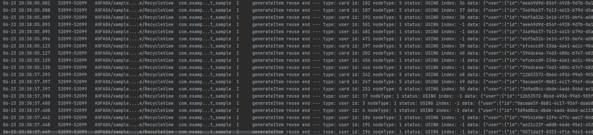

# 基于ScrollComponents实现网格

---

## 概述

网格是应用开发中常见的开发场景。它通过相交的横线和竖线，形成整齐有序的网状布局。网格适用于展示图片、媒体文件、购物商品等多种数据。当网格上下滑动时，子组件会带来测量和绘制的性能消耗。本文通过跨页面复用、加速首屏渲染、下拉刷新等场景，介绍ScrollComponents库创建高流畅滑动的网格页面。


ScrollComponents作为高性能滑动解决方案，主要解决组件复用的问题，支持通过少量的代码实现高性能滑动，同时开发者无需关注复用池管理和其他性能优化方案的交互细节。可以参考[ScrollComponents使用说明](https://gitcode.com/openharmony-sig/scroll_components/blob/master/README.md#%E5%BF%AB%E9%80%9F%E5%BC%80%E5%A7%8B)进行安装配置与快速上手。ScrollComponents框架提供了下列功能特性：


- 支持List，WaterFlow，Grid三种常见复杂页面的流畅滑动
- 默认支持懒加载，开发者不用使用[LazyForEach](https://developer.huawei.com/consumer/cn/doc/harmonyos-references/ts-rendering-control-lazyforeach)和定义IDataSource数据源，减少一定的代码量
- 支持组件复用，解决滑动丢帧，提升滑动性能
- 支持复用池共享，满足跨页面跨父组件复用能力
- 支持预创建，减少冷启动首次滑动丢帧，提升滑动性能
- 支持预加载，滑动过程提前加载数据，提升浏览体验


## 约束与限制

- 不支持[设置子组件所占行列数](https://developer.huawei.com/consumer/cn/doc/harmonyos-guides/arkts-layout-development-create-grid#%E8%AE%BE%E7%BD%AE%E5%AD%90%E7%BB%84%E4%BB%B6%E6%89%80%E5%8D%A0%E8%A1%8C%E5%88%97%E6%95%B0)
- 不支持捏合手势识别


## 实现原理


### 关键技术

ScrollComponents三方库底层封装NodeContainer+FrameNode，结合NodeAdapter+BuildNode+自定义复用池实现懒加载、组件复用、组件预创建等能力，同时为开发者提供WaterFlowManager、ListManager、GridManager等视图管理组件，为开发者提供系统滑动组件的其他各种能力，在满足开发者正常开发的前提下提供高性能的滑动能力，只需要传入数据源和viewManager即可快速实现懒加载和组件复用的开发，可以更加聚焦业务实现。


如图1是RecyclerView整体流程图，当节点从可视区移除时，NodeAdapter会通知视图管理器将组件回收，经NodeFactory回收处理之后，组件最终被存入到组件复用池。当节点需要创建时，NodeAdapter通知视图管理器开始创建，NodeFactory会向复用池请求复用节点，获取到节点之后经过一系列更新组件、组件拼接之后返回，最后由NodeAdapter将节点添加到可视区。


**图1** RecyclerView整体流程图  


### 开发流程


1. 自定义网格的视图管理器     GridManager仅具备基础的视图能力，开发者需要使用组件复用能力，需定义一个继承自GridManager的类，并实现onWillCreateItem()接口，具体可参考[4.注册子节点模板](https://developer.huawei.com/consumer/cn/doc/best-practices/bpta-grid-based-on-scrollcomponents#li616965082419)。核心代码如下：


  
  
  

```typescript
1. import { GridManager, NodeItem, RecyclerView } from "@hadss/scroll_components";
2. // ...
3.
4. @Component
5. export default struct WordGridComponent {
6.  gridViewManager: GridViewManager = new GridViewManager({ defaultNodeItem: 'word', context: this.getUIContext() });
7.  // ...
8. }
9.
10. class GridViewManager extends GridManager {
11.  onWillCreateItem(index: number, data: WordViewModel) {
12.  // get node based on identifier 'word' from recycle pool.
13.  let node: NodeItem<WordCellData> | null = this.dequeueReusableNodeByType('word');
14.  node.setData({ word: data })
15.  return node;
16.  }
17. }


```
  [WordGridComponent.ets](https://gitcode.com/harmonyos_samples/GridScrollComponent/blob/master/entry/src/main/ets/view/WordGridComponent.ets#L17-L110)
  


  
  
  说明
      如果开发者想通过ScrollComponents快速创建网格，方便使用懒加载、预创建等提升滑动效率的能力，而不考虑组件复用，则直接使用ScrollComponents库提供的GridManager创建网格视图管理器即可。具体可参考[ScrollComponents使用说明](https://gitcode.com/openharmony-sig/scroll_components/blob/master/README.md#%E5%BF%AB%E9%80%9F%E5%BC%80%E5%A7%8B)。

2. 网格组件初始化     页面初始化时，开发者通过视图管理器的setViewStyle()接口，给视图设置对应的视图属性。


  
  
  

```typescript
1. aboutToAppear(): void {
2.  this.gridViewManager.setViewStyle()
3.  .alignItems(GridItemAlignment.STRETCH);
4.  this.gridViewManager.setViewStyle()
5.  .columnsTemplate('repeat(auto-fill, 70)')
6.  .columnsGap(5)
7.  .rowsGap(5);
8.  // ...
9. }


```
  [WordGridComponent.ets](https://gitcode.com/harmonyos_samples/GridScrollComponent/blob/master/entry/src/main/ets/view/WordGridComponent.ets#L47-L84)

3. 设置数据源并渲染组件
  1. 开发者通过自定义的视图管理器调用setDataSource()方法设置数据。ScrollComponents库默认支持懒加载，提供了基于懒加载的数据增删改查能力，开发者无需关心LazyForEach的使用限制，无需定义DataSource，引入即用。懒加载接口可参考：[基于NodeAdapter为视图管理器提供懒加载能力](https://gitcode.com/openharmony-sig/scroll_components/blob/master/docs/Reference.md#lazynodeadapter-%E7%B1%BB)。

  2. 开发者通过自定义的视图管理器调用registerNodeItem()接口，注册item子节点模板，传入模板名称和节点构建函数。
  
  
  

```typescript
1. import { GridManager, NodeItem, RecyclerView } from "@hadss/scroll_components";
2. import WordGridViewModel from "../viewModel/WordGridViewModel";
3. import WordViewModel from "../viewModel/WordViewModel";
4. // ...
5.
6. @Component
7. export default struct WordGridComponent {
8.  gridViewManager: GridViewManager = new GridViewManager({ defaultNodeItem: 'word', context: this.getUIContext() });
9.  viewModel: WordGridViewModel = new WordGridViewModel(this.gridViewManager);
10.
11.  aboutToAppear(): void {
12.  // ...
13.  // associates the builder with the identifier 'word'.
14.  this.gridViewManager.registerNodeItem('word', wrapBuilder(buildWordCell));
15.  this.viewModel.loadData();
16.  }
17.
18.  build() {
19.  Column() {
20.  // place the grid in a column.
21.  RecyclerView({
22.  viewManager: this.gridViewManager
23.  })
24.  }
25.  .width('100%')
26.  }
27. }


```
    [WordGridComponent.ets](https://gitcode.com/harmonyos_samples/GridScrollComponent/blob/master/entry/src/main/ets/view/WordGridComponent.ets#L18-L99)
  


  
  
  

```typescript
1. @Observed
2. export default class WordGridViewModel {
3.  @Track data: WordViewModel[] = [];
4.  gridViewManager?: GridManager;
5.  // ...
6.
7.  async loadData() {
8.  // simulated request data.
9.  for (let index = 0; index < 15; index++) {
10.  let viewModel: WordViewModel = new WordViewModel();
11.  // ...
12.  this.data.push(viewModel);
13.  }
14.  this.gridViewManager?.setDataSource(this.data);
15.  }
16. }


```
    [WordGridViewModel.ets](https://gitcode.com/harmonyos_samples/GridScrollComponent/blob/master/entry/src/main/ets/viewModel/WordGridViewModel.ets#L21-L45)
  


  
  
    说明
            1. 注册子节点模板方法registerNodeItem()中使用@builder函数目前仅支持全局。

         2. 开发者如果使用this.gridViewManager.preCreate()实现组件预创建，则需要在注册节点模板后预创建组件。

4. 注册子节点模板     开发者自定义模板后，在定义视图管理器时需要实现onWillCreateItem()接口，并在此接口中通过dequeueReusableNodeByType()获取可复用node，实现组件复用，同时也需要在复用组件的aboutToReuse生命期中，对数据进行更新。


  1. 单元格结构类型相同         如果复用的单元格组件结构相同，数据不同时，直接注册节点模板。


  
  
  

```typescript
1. import WordCell from "./WordCellComponent";
2.
3. /**
4.  * define item template.
5.  *
6.  * @param data data of node
7.  */
8. @Builder
9. function buildWordCell(data: WordCellData) {
10.  WordCell({ word: data.word })
11. }
12.
13. @Component
14. export default struct WordGridComponent {
15.  // ...
16.  aboutToAppear(): void {
17.  // ...
18.  // associates the builder with the identifier 'word'.
19.  this.gridViewManager.registerNodeItem('word', wrapBuilder(buildWordCell));
20.  // ...
21.  }
22.  // ...
23. }
24.
25. class GridViewManager extends GridManager {
26.  onWillCreateItem(index: number, data: WordViewModel) {
27.  // get node based on identifier 'word' from recycle pool.
28.  let node: NodeItem<WordCellData> | null = this.dequeueReusableNodeByType('word');
29.  node.setData({ word: data })
30.  return node;
31.  }
32. }


```
    [WordGridComponent.ets](https://gitcode.com/harmonyos_samples/GridScrollComponent/blob/master/entry/src/main/ets/view/WordGridComponent.ets#L24-L109)

  2. 单元格内子组件可拆分组合         如果复用的单元格组件结构基本相同，存在部分差异，差异的部分会复用失效。ScrollComponents提供了PartReuse来保证命中组件复用。


    **图2** 可拆分组件复用创建流程图  
         开发者可参考图3日志打印"generateItem reuse "表示复用，检验是否复用成功。


    **图3** 日志效果图  
         子组件1：


  
  
  

```typescript
1. // child component in item
2. @Component
3. export default struct UserCardComponent {
4.  @State user: UserInfoViewModel = new UserInfoViewModel();
5.
6.  aboutToReuse(params: Record<string, ESObject>) {
7.  let input = params as CardCellData;
8.  this.user = input.user;
9.  }
10.
11.  build() {
12.  // ...
13.  }
14. }
15.
16. @Builder
17. export function buildUserCard(params: CardCellData) {
18.  UserCardComponent({ user: params.user })
19. }


```
    [UserCardComponent.ets](https://gitcode.com/harmonyos_samples/GridScrollComponent/blob/master/entry/src/main/ets/view/UserCardComponent.ets#L20-L97)
         子组件2：


  
  
  

```typescript
1. // child component in item
2. @Component
3. export default struct ManagerCardComponent {
4.  @State user: UserInfoViewModel = new UserInfoViewModel();
5.
6.  aboutToReuse(params: Record<string, ESObject>) {
7.  let input = params as CardCellData;
8.  this.user = input.user;
9.  }
10.
11.  build() {
12.  // ...
13.  }
14. }
15.
16. @Builder
17. export function buildManagerCard(params: CardCellData) {
18.  ManagerCardComponent({ user: params.user })
19. }


```
    [ManagerCardComponent.ets](https://gitcode.com/harmonyos_samples/GridScrollComponent/blob/master/entry/src/main/ets/view/ManagerCardComponent.ets#L20-L100)
         单元格组件：


  
  
  

```typescript
1. // item component
2. @Component
3. export default struct CardComponent {
4.  @State user: UserInfoViewModel = new UserInfoViewModel();
5.
6.  aboutToReuse(params: Record<string, ESObject>) {
7.  let input = params as CardCellData;
8.  this.user = input.user;
9.  }
10.
11.  // ...
12.  build() {
13.  Column() {
14.  if (this.user.role === 'manager') {
15.  // when need to reuse a subcomponent, use PartReuse to encapsulate it.
16.  PartReuse({
17.  type: 'manager',
18.  builder: wrapBuilder(buildManagerCard),
19.  data: {
20.  user: this.user
21.  }
22.  })
23.  } else {
24.  PartReuse({
25.  type: 'user',
26.  builder: wrapBuilder(buildUserCard),
27.  data: {
28.  user: this.user
29.  }
30.  })
31.  }
32.  }
33.  .bindContextMenu(this.optMenu(), ResponseType.LongPress)
34.  .width('90%')
35.  .height(80)
36.  }
37. }
38.
39. @Builder
40. export function buildCard(data: CardCellData) {
41.  CardComponent({ user: data.user })
42. }


```
    [CardComponent.ets](https://gitcode.com/harmonyos_samples/GridScrollComponent/blob/master/entry/src/main/ets/view/CardComponent.ets#L24-L97)
         组件注册：


  
  
  

```typescript
1. // card grid view
2. @Component
3. export default struct CardGridComponent {
4.  // ...
5.
6.  aboutToAppear(): void {
7.  // ...
8.  // register the reusable template.
9.  this.gridViewManager.registerNodeItem("card", wrapBuilder(buildCard));
10.  this.gridViewManager.registerNodeItem("user", wrapBuilder(buildUserCard));
11.  this.gridViewManager.registerNodeItem("manager", wrapBuilder(buildManagerCard));
12.  // ...
13.  }
14.  // ...
15.
16.  build() {
17.  Stack({ alignContent: Alignment.Bottom }) {
18.  // main grid
19.  RecyclerView({
20.  viewManager: this.gridViewManager
21.  })
22.  // ...
23.  }
24.  }
25. }
26.
27. /**
28.  * grid manager class
29.  */
30. class GridViewManager extends GridManager {
31.  onWillCreateItem(index: number, data: UserInfoViewModel): NodeItem<CardCellData> | null {
32.  let node: NodeItem<CardCellData> | null = this.dequeueReusableNodeByType('card');
33.  node?.setData({ user: data });
34.  return node;
35.  }
36. }


```
    [CardGridComponent.ets](https://gitcode.com/harmonyos_samples/GridScrollComponent/blob/master/entry/src/main/ets/view/CardGridComponent.ets#L25-L212)

  3. 单元格结构类型不同         如果GridItem结构差异较大，包括布局差异大、差异的组件数量较多、组件类型不同等因素，导致直接复用GridItem困难，则可定义多个复用模板。


  
  
  

```typescript
1. @Component
2. export default struct WorkComponent {
3.  // ...
4.
5.  aboutToAppear(): void {
6.  // ...
7.  this.gridViewManager.registerNodeItem("video", wrapBuilder(buildVideoWork));
8.  this.gridViewManager.registerNodeItem("picture", wrapBuilder(buildPictureWork));
9.  this.gridViewManager.registerNodeItem("photoContainer", wrapBuilder(buildPhoto));
10.  // ...
11.  }
12.
13.  // ...
14. }
15.
16. /**
17.  * grid manager class
18.  */
19. class GridViewManager extends GridManager {
20.  onWillCreateItem(index: number, data: WorkViewModel): NodeItem<WorkCellData> | null {
21.  // select the corresponding template according to the data type.
22.  let node: NodeItem<WorkCellData> | null = this.dequeueReusableNodeByType(data.type);
23.  node?.setData({ work: data });
24.  return node;
25.  }
26. }


```
    [WorkComponent.ets](https://gitcode.com/harmonyos_samples/GridScrollComponent/blob/master/entry/src/main/ets/view/WorkComponent.ets#L27-L242)


## 网格跨页面复用场景


### 场景描述

开发者可能存在多个页面间复用Grid，比如tab栏切换。ScrollComponents提供了全局复用能力。


### 开发步骤


1. 定义复用池单例     RecyclerView默认会生成一个RecycledPool，通过定义复用池单例存储该pool，提供跨页面使用。以下单例仅做参考，开发者可自行封装。


  
  
  

```typescript
1. import { RecycledPool } from '@hadss/scroll_components';
2.
3. export class Utils {
4.  // ...
5.  private static utils_: Utils;
6.  nodePool: RecycledPool | null = null;
7.  // ...
8. }


```
  [Utils.ets](https://gitcode.com/harmonyos_samples/GridScrollComponent/blob/master/entry/src/main/ets/common/util/Utils.ets#L17-L37)

2. 复用池单例保存RecycledPool     GridManager提供getRecyclePool()方法可获取RecycledPool，然后存储在全局单例中。


  
  
  

```typescript
1. @Component
2. export default struct WorkComponent {
3.  // ...
4.
5.  aboutToAppear(): void {
6.  if (Utils.getInstance().nodePool) {
7.  this.gridViewManager.registerRecyclePool(Utils.getInstance().nodePool!);
8.  } else {
9.  // save recycle pool.
10.  Utils.getInstance().nodePool = this.gridViewManager.getRecyclePool();
11.  }
12.  // ...
13.  }
14.
15.  // ...
16. }


```
  [WorkComponent.ets](https://gitcode.com/harmonyos_samples/GridScrollComponent/blob/master/entry/src/main/ets/view/WorkComponent.ets#L28-L227)

3. 跨页面共享单例中的RecycledPool     跨页面使用registerRecyclePool，将全局单例中的RecyclePool注册到该页面定义的Grid视图类对象上，实现跨页面不同RecyclerView视图的复用池共享。


  
  
  

```typescript
1. @Component
2. export default struct PhotoGridComponent {
3.  // ...
4.
5.  aboutToAppear(): void {
6.  // ...
7.  if (Utils.getInstance().nodePool) {
8.  // register recycle pool.
9.  this.gridViewManager.registerRecyclePool(Utils.getInstance().nodePool!);
10.  } else {
11.  Utils.getInstance().nodePool = this.gridViewManager.getRecyclePool();
12.  }
13.  // ...
14.  // register template after register recycle pool.
15.  this.gridViewManager.registerNodeItem('photoContainer', wrapBuilder(buildPhoto));
16.  // ...
17.  }
18.
19.  // ...
20. }


```
  [PhotoGridComponent.ets](https://gitcode.com/harmonyos_samples/GridScrollComponent/blob/master/entry/src/main/ets/view/PhotoGridComponent.ets#L25-L138)


## 网格加速首屏渲染场景


### 场景描述

冷启动后首次打开网格页面，由于页面的图片或者视频等媒体资源过多，出现白屏或者白块，等好几秒才缓慢刷出内容。ScrollComponents库支持组件预创建，能打开页面后瞬间看到文字、图片骨架，减少卡顿。


### 开发步骤

核心代码参考如下：


```typescript
1. aboutToAppear(): void {
2.  // ...
3.  // register the reusable template.
4.  this.gridViewManager.registerNodeItem("card", wrapBuilder(buildCard));
5.  this.gridViewManager.registerNodeItem("user", wrapBuilder(buildUserCard));
6.  this.gridViewManager.registerNodeItem("manager", wrapBuilder(buildManagerCard));
7.  // key point: `preCreate()` pre-creates the reusable template,
8.  // which must be registered before the reusable template.
9.  this.gridViewManager.preCreate("card", 25);
10.  this.gridViewManager.preCreate("user", 10);
11.  this.gridViewManager.preCreate("manager", 30);
12.  // ...
13. }

```


[CardGridComponent.ets](https://gitcode.com/harmonyos_samples/GridScrollComponent/blob/master/entry/src/main/ets/view/CardGridComponent.ets#L36-L122)


### 性能测试

加载相同数据冷启动场景完成时延情况，通过延迟1s模拟冷启动后网络请求场景


@Reusable：网络请求期间主线程大段空闲，请求结束后首屏组件绘帧耗时较长


**图4** @Reusable测试结果  


ScrollComponents：网络请求期间主线程空闲较少，请求结束后首屏组件绘帧耗时较短


**图5** ScrollComponents测试结果  


**表1**

展开

| 实现方式 | 冷启动完成时延 | 主线程空闲时间 | 首屏组件创建时间 |
| --- | --- | --- | --- |
| ScrollComponents | 2.5s | 281ms | 223ms |
| @Reusable | 2.8s | 997ms | 467ms |


结论：ScrollComponents在冷启动场景下，完成时延优于原生@Reusable。整体完成时延优化300ms。


## 网格下拉刷新场景


### 场景描述

下拉刷新是提升用户体验的关键功能，既要保证数据无缝加载，又要维持流畅的交互效果。下拉刷新场景下使用懒加载刷新避免媒体资源加载造成UI渲染阻塞。效果参考：[Refresh示例6实现下拉刷新上拉加载更多](https://developer.huawei.com/consumer/cn/doc/harmonyos-references/ts-container-refresh#%E7%A4%BA%E4%BE%8B6%E5%AE%9E%E7%8E%B0%E4%B8%8B%E6%8B%89%E5%88%B7%E6%96%B0%E4%B8%8A%E6%8B%89%E5%8A%A0%E8%BD%BD%E6%9B%B4%E5%A4%9A)。


### 开发步骤

1. 使用Refresh组件扩展下拉刷新状态回调。
  
  
  

```typescript
1. @Component
2. export default struct WorkComponent {
3.  // ...
4.  gridViewManager: GridViewManager = new GridViewManager({ defaultNodeItem: 'video', context: this.getUIContext() });
5.  @State viewModel: WorkGridViewModel = new WorkGridViewModel(this.gridViewManager);
6.  // ...
7.
8.  build() {
9.  Refresh({ refreshing: $$this.viewModel.isRefresh, builder: this.refreshBuilder() }) {
10.  // ...
11.  // main grid
12.  RecyclerView({
13.  viewManager: this.gridViewManager
14.  })
15.  // ...
16.  }
17.  // ...
18.  .onRefreshing(() => {
19.  this.viewModel.refreshData();
20.  })
21.  }
22. }

```
  [WorkComponent.ets](https://gitcode.com/harmonyos_samples/GridScrollComponent/blob/master/entry/src/main/ets/view/WorkComponent.ets#L29-L228)

2. 接收回调后触发数据刷新
  
  
  

```typescript
1. @Observed
2. export default class WorkGridViewModel {
3.  // ...
4.  @Track isRefresh: boolean = false;
5.  // ...
6.  gridViewManager?: GridManager;
7.
8.  constructor(gridViewManager: GridManager) {
9.  this.gridViewManager = gridViewManager;
10.  }
11.
12.  loadData() {
13.  // ...
14.  // refresh data source
15.  this.gridViewManager?.nodeAdapter.deleteData(0, lastLength);
16.  this.gridViewManager?.setDataSource(this.data);
17.  }
18.
19.  /**
20.  * refresh display data
21.  */
22.  refreshData() {
23.  setTimeout(() => {
24.  this.loadData();
25.  this.isRefresh = false;
26.  }, 1000);
27.  }
28.  // ...
29. }

```
  [WorkGridViewModel.ets](https://gitcode.com/harmonyos_samples/GridScrollComponent/blob/master/entry/src/main/ets/viewModel/WorkGridViewModel.ets#L22-L148)


## 网格上拉加载更多场景


### 场景描述

当开发网格页面涉及大量数据，需要进行分页或分批次进行请求时，结合ScrollComponents提供的懒加载能力实现加载更多的效果。效果参考：[Refresh示例6实现下拉刷新上拉加载更多](https://developer.huawei.com/consumer/cn/doc/harmonyos-references/ts-container-refresh#%E7%A4%BA%E4%BE%8B6%E5%AE%9E%E7%8E%B0%E4%B8%8B%E6%8B%89%E5%88%B7%E6%96%B0%E4%B8%8A%E6%8B%89%E5%8A%A0%E8%BD%BD%E6%9B%B4%E5%A4%9A)。


### 开发步骤

1. 增加监听事件onScrollIndex()
  
  
  

```typescript
1. @Component
2. export default struct WorkComponent {
3.  // ...
4.  gridViewManager: GridViewManager = new GridViewManager({ defaultNodeItem: 'video', context: this.getUIContext() });
5.  @State viewModel: WorkGridViewModel = new WorkGridViewModel(this.gridViewManager);
6.  // ...
7.
8.  aboutToAppear(): void {
9.  // ...
10.  this.gridViewManager.setViewStyle()
11.  .onReachEnd(() => {
12.  // listen the scroll position.
13.  this.viewModel.loadMore();
14.  });
15.  // ...
16.  }
17.  // ...
18. }

```
  [WorkComponent.ets](https://gitcode.com/harmonyos_samples/GridScrollComponent/blob/master/entry/src/main/ets/view/WorkComponent.ets#L30-L229)

2. 触发回调，请求数据并追加到数据源
  
  
  

```typescript
1. @Observed
2. export default class WorkGridViewModel {
3.  // ...
4.  @Track isLoading = false;
5.  gridViewManager?: GridManager;
6.
7.  // ...
8.  /**
9.  * mock load more data when reach end
10.  */
11.  loadMore() {
12.  if (this.worksCount <= this.data.length) {
13.  return;
14.  }
15.  this.isLoading = true;
16.
17.  setTimeout(() => {
18.  if (this.worksCount > this.data.length) {
19.  for (let index = 0; index < 20; index++) {
20.  if (this.data.length < this.worksCount) {
21.  this.gridViewManager?.nodeAdapter.pushData([this.generateData()]);
22.  this.isLoading = false;
23.  }
24.  }
25.  }
26.  this.isLoading = false;
27.  }, 500);
28.  }
29.
30.  // ...
31.  /**
32.  * generate mock Work
33.  *
34.  * @returns work data
35.  */
36.  generateData(): WorkViewModel {
37.  // ...
38.  }
39. }

```
  [WorkGridViewModel.ets](https://gitcode.com/harmonyos_samples/GridScrollComponent/blob/master/entry/src/main/ets/viewModel/WorkGridViewModel.ets#L23-L149)


## 网格设置排列方式场景


### 场景描述

- 通过设置行列数量与尺寸占比可以确定网格布局的整体排列方式
- 通过layoutDirection设置网格布局的主轴方向


### 开发步骤


### 设置行列数量与占比

通过设置行列数量与尺寸占比可以确定网格布局的整体排列方式。效果参考：[Grid设置行列数量与占比](https://developer.huawei.com/consumer/cn/doc/harmonyos-guides/arkts-layout-development-create-grid#%E8%AE%BE%E7%BD%AE%E8%A1%8C%E5%88%97%E6%95%B0%E9%87%8F%E4%B8%8E%E5%8D%A0%E6%AF%94)。

```typescript
1. aboutToAppear(): void {
2.  // ...
3.  this.gridViewManager.setViewStyle()
4.  .columnsTemplate(this.viewModel.columnsTemplate);
5.  // ...
6. }

```


[PhotoGridComponent.ets](https://gitcode.com/harmonyos_samples/GridScrollComponent/blob/master/entry/src/main/ets/view/PhotoGridComponent.ets#L35-L80)


### 设置主轴方向

通过layoutDirection设置网格布局的主轴方向，决定子组件的排列方式。效果参考：[Grid设置主轴方向](https://developer.huawei.com/consumer/cn/doc/harmonyos-guides/arkts-layout-development-create-grid#%E8%AE%BE%E7%BD%AE%E4%B8%BB%E8%BD%B4%E6%96%B9%E5%90%91)。

```typescript
1. aboutToAppear(): void {
2.  // ...
3.  this.gridViewManager.setViewStyle()
4.  .layoutDirection(GridDirection.Row);
5.  // ...
6. }

```


[PhotoGridComponent.ets](https://gitcode.com/harmonyos_samples/GridScrollComponent/blob/master/entry/src/main/ets/view/PhotoGridComponent.ets#L36-L79)


## 网格布局中显示数据的场景


### 场景描述

可以通过在单元格组件中添加文本等组件在网格中显示数据。效果参考：[Grid在网格布局中显示数据](https://developer.huawei.com/consumer/cn/doc/harmonyos-guides/arkts-layout-development-create-grid#%E5%9C%A8%E7%BD%91%E6%A0%BC%E5%B8%83%E5%B1%80%E4%B8%AD%E6%98%BE%E7%A4%BA%E6%95%B0%E6%8D%AE)。


### 开发步骤

在单元格组件中添加文本组件进行数据显示。


```typescript
1. // item component
2. @Component
3. export default struct WordCell {
4.  @State word: WordViewModel = new WordViewModel();
5.
6.  aboutToReuse(params: Record<string, ESObject>) {
7.  let input = params as WordCellData;
8.  this.word = input.word;
9.  }
10.
11.  build() {
12.  // ...
13.  // define a text component that displays data in a cell after receiving it.
14.  Text(this.word.value)
15.  .height(80)
16.  // ...
17.  }
18. }

```


[WordCellComponent.ets](https://gitcode.com/harmonyos_samples/GridScrollComponent/blob/master/entry/src/main/ets/view/WordCellComponent.ets#L20-L45)


## 网格设置行列间距场景


### 场景描述

在两个网格单元之间的网格横向间距称为行间距，网格纵向间距称为列间距。通过rowsGap和columnsGap可以设置网格布局的行列间距。效果参考：[Grid设置行列间距](https://developer.huawei.com/consumer/cn/doc/harmonyos-guides/arkts-layout-development-create-grid#%E8%AE%BE%E7%BD%AE%E8%A1%8C%E5%88%97%E9%97%B4%E8%B7%9D)。


### 开发步骤

分别设置columnsGap和rowsGap为8vp。


```typescript
1. aboutToAppear(): void {
2.  // ...
3.  this.gridViewManager.setViewStyle()
4.  .columnsGap(8) // set column spacing to 8vp.
5.  .rowsGap(8); // set row spacing to 8vp.
6.  // ...
7. }

```


[CardGridComponent.ets](https://gitcode.com/harmonyos_samples/GridScrollComponent/blob/master/entry/src/main/ets/view/CardGridComponent.ets#L37-L121)


## 网格构建可滚动的布局场景


### 场景描述

通过columnsTemplate和rowsTemplate可以让网格拥有滚动能力。效果参考：[Grid构建可滚动的网格布局](https://developer.huawei.com/consumer/cn/doc/harmonyos-guides/arkts-layout-development-create-grid#%E6%9E%84%E5%BB%BA%E5%8F%AF%E6%BB%9A%E5%8A%A8%E7%9A%84%E7%BD%91%E6%A0%BC%E5%B8%83%E5%B1%80)。


### 开发步骤

通过columnsTemplate设置网格为三列等份网格。


```typescript
1. aboutToAppear(): void {
2.  // ...
3.  // only set the columnsTemplate property. when the content exceeds the grid area, it can be scrolled vertically.
4.  this.gridViewManager.setViewStyle()
5.  .columnsTemplate("1fr 1fr 1fr");
6.  // ...
7. }

```


[CardGridComponent.ets](https://gitcode.com/harmonyos_samples/GridScrollComponent/blob/master/entry/src/main/ets/view/CardGridComponent.ets#L38-L120)


## 网格控制滚动位置场景


### 场景描述

通过对设置[Scroller](https://developer.huawei.com/consumer/cn/doc/harmonyos-references/ts-container-scroll#scroller)对象，可以进行滚动控制。效果参考：[Grid控制滚动位置](https://developer.huawei.com/consumer/cn/doc/harmonyos-guides/arkts-layout-development-create-grid#%E6%8E%A7%E5%88%B6%E6%BB%9A%E5%8A%A8%E4%BD%8D%E7%BD%AE)。


### 开发步骤

1. 绑定Scroller对象
  
  
  

```typescript
1. // card grid view
2. @Component
3. export default struct CardGridComponent {
4.  scroller: Scroller = new Scroller();
5.  gridViewManager: GridViewManager = new GridViewManager({ defaultNodeItem: "card", context: this.getUIContext() });
6.  @State viewModel: CardGridViewModel = new CardGridViewModel(this.gridViewManager, this.scroller);
7.
8.  aboutToAppear(): void {
9.  // ...
10.  this.gridViewManager.setViewStyle(this.scroller);
11.  // ...
12.  }
13.
14.  // ...
15.  build() {
16.  Stack({ alignContent: Alignment.Bottom }) {
17.  // main grid
18.  RecyclerView({
19.  viewManager: this.gridViewManager
20.  })
21.
22.  Row() {
23.  // button goto pre page
24.  Button() {
25.  // ...
26.  }
27.  // ...
28.  .onClick(() => {
29.  this.viewModel.prePage();
30.  })
31.
32.  // button goto next page
33.  Button() {
34.  // ...
35.  }
36.  // ...
37.  .onClick(() => {
38.  this.viewModel.nextPage();
39.  })
40.  }
41.  // ...
42.  }
43.  }
44. }

```
  [CardGridComponent.ets](https://gitcode.com/harmonyos_samples/GridScrollComponent/blob/master/entry/src/main/ets/view/CardGridComponent.ets#L26-L200)

2. 通过Scroller对象的scrollPage方法进行翻页。
  
  
  

```typescript
1. @Observed
2. export default class CardGridViewModel {
3.  // ...
4.  gridViewManager?: GridManager;
5.  scroller?: Scroller;
6.
7.  constructor(gridViewManager: GridManager, scroller: Scroller) {
8.  this.gridViewManager = gridViewManager;
9.  this.scroller = scroller;
10.  }
11.
12.  // ...
13.  /**
14.  * goto pre page
15.  */
16.  prePage() {
17.  this.scroller?.scrollPage({
18.  next: false,
19.  animation: true
20.  });
21.  }
22.
23.  /**
24.  * goto next page.
25.  */
26.  nextPage() {
27.  this.scroller?.scrollPage({
28.  next: true,
29.  animation: true
30.  });
31.  }
32. }

```
  [CardGridViewModel.ets](https://gitcode.com/harmonyos_samples/GridScrollComponent/blob/master/entry/src/main/ets/viewModel/CardGridViewModel.ets#L23-L163)


## 网格嵌套滚动场景


### 场景描述

通过nestedScroll和onScrollFrameBegin设置嵌套滚动效果。效果参考：[Grid示例4grid嵌套滚动](https://developer.huawei.com/consumer/cn/doc/harmonyos-references/ts-container-grid#%E7%A4%BA%E4%BE%8B4grid%E5%B5%8C%E5%A5%97%E6%BB%9A%E5%8A%A8)。


### 开发步骤

通过nestedScroll设置前后两个方向的嵌套滚动模式，实现与父组件的滚动联动。


```typescript
1. aboutToAppear(): void {
2.  // ...
3.  this.gridViewManager.setViewStyle(this.scroller)
4.  .nestedScroll({
5.  scrollForward: NestedScrollMode.PARENT_FIRST,
6.  scrollBackward: NestedScrollMode.SELF_FIRST
7.  });
8.  // ...
9. }

```


[WorkComponent.ets](https://gitcode.com/harmonyos_samples/GridScrollComponent/blob/master/entry/src/main/ets/view/WorkComponent.ets#L53-L124)


## 网格拖拽场景


### 场景描述

通过对拖拽事件处理和数据交换逻辑可以实现单元格拖拽效果。效果参考：[Grid示例5grid拖拽场景](https://developer.huawei.com/consumer/cn/doc/harmonyos-references/ts-container-grid#%E7%A4%BA%E4%BE%8B5grid%E6%8B%96%E6%8B%BD%E5%9C%BA%E6%99%AF)。


### 开发步骤

1. 设置属性editMode(true)设置网格是否进入编辑模式，进入编辑模式可以拖拽网格组件内部单元格。

2. 在[onItemDragStart](https://developer.huawei.com/consumer/cn/doc/harmonyos-references/ts-container-grid#onitemdragstart8)回调中设置拖拽过程中显示的图片。

3. 在[onItemDrop](https://developer.huawei.com/consumer/cn/doc/harmonyos-references/ts-container-grid#onitemdrop8)中获取拖拽起始位置，和拖拽插入位置，并在[onItemDrop](https://developer.huawei.com/consumer/cn/doc/harmonyos-references/ts-container-grid#onitemdrop8)中完成转移数组位置逻辑。
  
  
  

```typescript
1. @Component
2. export default struct WorkComponent {
3.  // ...
4.  @State workModel: WorkViewModel = new WorkViewModel();
5.
6.  aboutToAppear(): void {
7.  // ...
8.  this.gridViewManager.setViewStyle()
9.  .editMode(true)
10.  .onItemDragStart((event: ItemDragInfo, itemIndex: number) => {
11.  let model = this.viewModel.getItemData(itemIndex);
12.  this.workModel = model;
13.  return this.buildDrag();
14.  })
15.  .onItemDrop((event: ItemDragInfo, itemIndex: number, insertIndex: number, isSuccess: boolean) => {
16.  if (!isSuccess) {
17.  return;
18.  }
19.  this.viewModel.move(itemIndex, insertIndex);
20.  });
21.  // ...
22.  }
23.
24.  @Builder
25.  buildDrag() {
26.  Column() {
27.  buildVideoWork({ work: this.workModel });
28.  }
29.  .width(125)
30.  }
31.  // ...
32. }


```
  [WorkComponent.ets](https://gitcode.com/harmonyos_samples/GridScrollComponent/blob/master/entry/src/main/ets/view/WorkComponent.ets#L31-L226)
  


  
  
  

```typescript
1. @Observed
2. export default class WorkGridViewModel {
3.  // ...
4.  gridViewManager?: GridManager;
5.
6.  // ...
7.  /**
8.  * move work index
9.  *
10.  * @param fromIndex source index
11.  * @param toIndex target index
12.  */
13.  move(fromIndex: number, toIndex: number) {
14.  if (toIndex >= this.data.length) {
15.  return;
16.  }
17.  this.gridViewManager?.nodeAdapter.moveData(fromIndex, toIndex);
18.  }
19.  // ...
20. }


```
  [WorkGridViewModel.ets](https://gitcode.com/harmonyos_samples/GridScrollComponent/blob/master/entry/src/main/ets/viewModel/WorkGridViewModel.ets#L24-L147)


## 网格自适应场景


### 场景描述

通过layoutDirection、maxCount、minCount、cellLength实现自适应效果。rowsTemplate、columnsTemplate都不设置layoutDirection、maxCount、minCount、cellLength才生效。效果参考：[Grid示例6自适应grid](https://developer.huawei.com/consumer/cn/doc/harmonyos-references/ts-container-grid#%E7%A4%BA%E4%BE%8B6%E8%87%AA%E9%80%82%E5%BA%94grid)。


### 开发步骤

通过设置maxCount、minCount、cellLength实现自适应。


```typescript
1. aboutToAppear() {
2.  this.gridViewManager.setViewStyle()
3.  .width("90%")
4.  .columnsGap(10)
5.  .rowsGap(5)
6.  .maxCount(10)
7.  .minCount(2)
8.  .cellLength(0)
9.  .border({ color: Color.Black, width: 1 });
10.
11.  // ...
12. }

```


[NumberGridComponent.ets](https://gitcode.com/harmonyos_samples/GridScrollComponent/blob/master/entry/src/main/ets/view/NumberGridComponent.ets#L27-L47)


## 网格自适应列数场景


### 场景描述

通过属性columnsTemplate中auto-fill、auto-fit和auto-stretch实现列数自适应效果。效果参考：[Grid示例8设置自适应列数](https://developer.huawei.com/consumer/cn/doc/harmonyos-references/ts-container-grid#%E7%A4%BA%E4%BE%8B8%E8%AE%BE%E7%BD%AE%E8%87%AA%E9%80%82%E5%BA%94%E5%88%97%E6%95%B0)。


### 开发步骤

通过设置columnsTemplate为repeat(auto-fill, 70)实现自适应列数。


```typescript
1. aboutToAppear(): void {
2.  // ...
3.  this.gridViewManager.setViewStyle()
4.  .columnsTemplate('repeat(auto-fill, 70)')
5.  .columnsGap(5)
6.  .rowsGap(5);
7.  // ...
8. }

```


[WordGridComponent.ets](https://gitcode.com/harmonyos_samples/GridScrollComponent/blob/master/entry/src/main/ets/view/WordGridComponent.ets#L48-L83)


## 网格以当前行最高的单元格的高度为其他单元格的高度场景


### 场景描述

可以通过alignItems设置当前行最高单元格高度为其他单元格的高度。效果参考：[Grid示例9以当前行最高的griditem的高度为其他griditem的高度](https://developer.huawei.com/consumer/cn/doc/harmonyos-references/ts-container-grid#%E7%A4%BA%E4%BE%8B9%E4%BB%A5%E5%BD%93%E5%89%8D%E8%A1%8C%E6%9C%80%E9%AB%98%E7%9A%84griditem%E7%9A%84%E9%AB%98%E5%BA%A6%E4%B8%BA%E5%85%B6%E4%BB%96griditem%E7%9A%84%E9%AB%98%E5%BA%A6)。


### 开发步骤

设置alignItems为GridItemAlignment.STRETCH时，以当前行最高的单元格高度为其他单元格的高度。


```typescript
1. aboutToAppear(): void {
2.  this.gridViewManager.setViewStyle()
3.  .alignItems(GridItemAlignment.STRETCH);
4.  // ...
5. }

```


[WordGridComponent.ets](https://gitcode.com/harmonyos_samples/GridScrollComponent/blob/master/entry/src/main/ets/view/WordGridComponent.ets#L49-L82)


## 网格设置边缘渐隐场景


### 场景描述

通过[fadingEdge](https://developer.huawei.com/consumer/cn/doc/harmonyos-references/ts-container-scrollable-common#fadingedge14)属性来设置边缘渐隐效果。效果参考：[Grid示例10设置边缘渐隐](https://developer.huawei.com/consumer/cn/doc/harmonyos-references/ts-container-grid#%E7%A4%BA%E4%BE%8B10%E8%AE%BE%E7%BD%AE%E8%BE%B9%E7%BC%98%E6%B8%90%E9%9A%90)。


### 开发步骤

开启边缘渐隐，并设置边缘渐隐长度为40vp。


```typescript
1. aboutToAppear(): void {
2.  // ...
3.  this.gridViewManager.setViewStyle()
4.  .fadingEdge(true, { fadingEdgeLength: LengthMetrics.vp(40) })
5.  // ...
6. }

```


[WorkComponent.ets](https://gitcode.com/harmonyos_samples/GridScrollComponent/blob/master/entry/src/main/ets/view/WorkComponent.ets#L54-L123)


## 网格设置单元格样式场景


### 场景描述

可以使用gridViewManager.setItemViewStyle()接口设置单元格样式。效果参考：[GridItem示例2设置griditem样式](https://developer.huawei.com/consumer/cn/doc/harmonyos-references/ts-container-griditem#%E7%A4%BA%E4%BE%8B2%E8%AE%BE%E7%BD%AEgriditem%E6%A0%B7%E5%BC%8F)。


### 开发步骤

使用gridViewManager.setItemViewStyle()设置单元格样式和属性。


```typescript
1. aboutToAppear(): void {
2.  // ...
3.  this.gridViewManager.setItemViewStyle((gridItem) => {
4.  gridItem({ style: GridItemStyle.PLAIN })
5.  .width(80) // set the cell width to 80vp.
6.  .backgroundColor($r('app.color.home_background_color'))
7.  .selectable(false)
8.  });
9.  // ...
10. }

```


[CardGridComponent.ets](https://gitcode.com/harmonyos_samples/GridScrollComponent/blob/master/entry/src/main/ets/view/CardGridComponent.ets#L39-L119)


## 网格长按删除单元格场景


### 场景描述

长按时显示删除按钮，点击按钮可以删除对应item。


### 开发步骤

1. 绑定长按手势
  
  
  

```typescript
1. // item component
2. @Component
3. export default struct CardComponent {
4.  @State user: UserInfoViewModel = new UserInfoViewModel();
5.
6.  // ...
7.  @Builder
8.  optMenu() {
9.  Row() {
10.  Button() {
11.  // ...
12.  }
13.  .backgroundColor(Color.Red)
14.  .onClick(() => {
15.  this.getUIContext().getHostContext()?.eventHub.emit(CommonConstants.EVENT_REMOVE_ITEM, this.user.id);
16.  })
17.  }
18.  // ...
19.  }
20.
21.  build() {
22.  Column() {
23.  // ...
24.  }
25.  .bindContextMenu(this.optMenu(), ResponseType.LongPress)
26.  // ...
27.  }
28. }

```
  [CardComponent.ets](https://gitcode.com/harmonyos_samples/GridScrollComponent/blob/master/entry/src/main/ets/view/CardComponent.ets#L25-L91)

2. 响应删除事件
  
  
  

```typescript
1. aboutToAppear(): void {
2.  // ...
3.  // register 'delete' event listener.
4.  this.getUIContext().getHostContext()?.eventHub.on(CommonConstants.EVENT_REMOVE_ITEM, (id: number) => {
5.  animateToImmediately({ duration: 500 }, () => {
6.  this.viewModel.deleteData(id);
7.  })
8.  });
9.  // ...
10. }
11.
12. aboutToDisappear(): void {
13.  // when the page is destroyed, cancel the deletion listener.
14.  this.getUIContext().getHostContext()?.eventHub.off(CommonConstants.EVENT_REMOVE_ITEM);
15.  this.viewModel.destroy();
16. }

```
  [CardGridComponent.ets](https://gitcode.com/harmonyos_samples/GridScrollComponent/blob/master/entry/src/main/ets/view/CardGridComponent.ets#L40-L131)

3. 通过this.gridViewManager?.nodeAdapter.deleteData()删除数据及组件
  
  
  

```typescript
1. /**
2.  * delete data by user id
3.  *
4.  * @param id user id
5.  */
6. deleteData(id: number) {
7.  for (let index = 0; index < this.data.length; index++) {
8.  let model = this.data[index];
9.  if (model.id === id) {
10.  // delete components and data
11.  this.gridViewManager?.nodeAdapter.deleteData(index);
12.  return;
13.  }
14.  }
15. }

```
  [CardGridViewModel.ets](https://gitcode.com/harmonyos_samples/GridScrollComponent/blob/master/entry/src/main/ets/viewModel/CardGridViewModel.ets#L126-L140)


## 示例代码

- [基于ScrollComponents实现网格](https://gitcode.com/HarmonyOS_Samples/GridScrollComponent)
