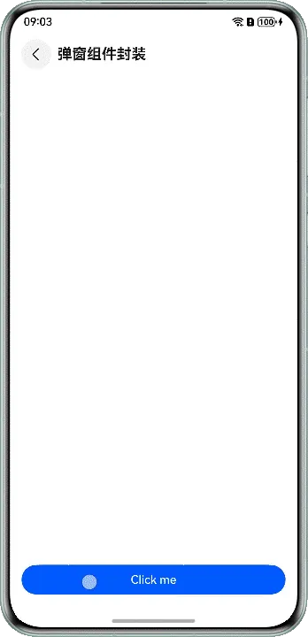

# 弹窗组件封装

---

## 概述

在应用开发中，通常会遇到自定义弹窗的场景，这些业务场景可能需要实现自定义弹窗的结构和样式。这时提供方可以封装一个传入自定义构建函数的工具类，将类对外导出。使用方可以引入该类，将自定义弹窗结构的@Builder函数作为参数传给封装好的静态类函数中，实现自定义弹窗。


## 实现原理

通过使用UIContext中获取到的PromptAction对象来实现自定义弹窗工具类的封装。首先通过UIContext实例中的getPromptAction函数获取到promptAction对象，然后通过创建[ComponentContent](https://developer.huawei.com/consumer/cn/doc/harmonyos-references/js-apis-arkui-componentcontent)定义自定义弹窗的内容，将自定义弹窗内容作为参数传入promptAction对象的openCustomDialog函数中。使用方通过PromptAction对象封装的工具类接口打开弹窗就会显示自定义弹窗的内容，从而实现自定义的弹窗结构与样式。


## 开发步骤

以使用方点击按钮后展示自定义弹窗场景为例，若需实现下图效果，基于promptAction封装弹窗工具类和使用步骤如下：





1. 使用方通过全局@Builder封装弹窗结构。  

  
  
  

```typescript
1. @Builder
2. export function buildText(_obj: Object) {
3.  Column({ space: 16 }) {
4.  Text($r('app.string.tips'))
5.  .fontSize($r('app.float.font_size_l'))
6.  .fontWeight(FontWeight.Bold)
7.  Text($r('app.string.content'))
8.  .fontSize($r('app.float.font_size_l'))
9.  Row() {
10.  Button($r('app.string.cancel'))
11.  .fontColor($r('app.color.blue'))
12.  .backgroundColor(Color.White)
13.  .margin({ right: $r('app.float.margin_right') })
14.  .width('42%')
15.  .onClick(() => {
16.  PopViewUtils.closePopView();
17.  })
18.  Button($r('app.string.confirm'))
19.  .width('42%')
20.  .onClick(() => {
21.  PopViewUtils.closePopView();
22.  })
23.  }
24.  .justifyContent(FlexAlign.Center)
25.  .width($r('app.float.dialog_width'))
26.  }
27.  .width($r('app.float.dialog_width'))
28.  .padding($r('app.float.padding_l'))
29.  .justifyContent(FlexAlign.Center)
30.  .alignItems(HorizontalAlign.Center)
31.  .backgroundColor(Color.White)
32.  .borderRadius($r('app.float.border_radius'))
33. }


```
  [DialogComponent.ets](https://gitcode.com/harmonyos_samples/ComponentEncapsulation/blob/master/entry/src/main/ets/pages/DialogComponent.ets#L24-L56)
  

2. 提供方通过promptAction对象封装弹窗工具类的步骤如下：  

  1. 在EntryAbility的onWindowStageCreate()方法中，通过AppStorage.setOrCreate()设置全局UIContext对象。
  
  
  

```javascript
1. onWindowStageCreate(windowStage: window.WindowStage): void {
2.  // ...
3.  windowStage.loadContent('pages/Index', (err) => {
4.  // ...
5.  try {
6.  AppStorage.setOrCreate('uiContext', windowStage.getMainWindowSync().getUIContext());
7.  } catch (err) {
8.  let error = err as BusinessError;
9.  hilog.error(0x0000, 'testTag', `aboutToAppear err, code: ${error.code}, message: ${error.message}`);
10.  }
11.  });
12. }

```
    [EntryAbility.ets](https://gitcode.com/HarmonyOS_Samples/ComponentEncapsulation/blob/master/entry/src/main/ets/entryability/EntryAbility.ets#L30-L50)

  2. 通过openCustomDialog创建打开弹窗的showDialog函数。
  
  
  

```typescript
1. import { ComponentContent, promptAction } from '@kit.ArkUI';
2. import { hilog } from '@kit.PerformanceAnalysisKit';
3. import { BusinessError } from '@kit.BasicServicesKit';
4.
5. export enum PopViewShowType {
6.  OPEN
7. }
8.
9. interface PopViewModel {
10.  com: ComponentContent<object>;
11.  popType: PopViewShowType;
12. }
13.
14. export class PopViewUtils {
15.  private static popShare: PopViewUtils;
16.  private infoList: PopViewModel[] = new Array<PopViewModel>();
17.
18.  static shareInstance(): PopViewUtils {
19.  if (!PopViewUtils.popShare) {
20.  PopViewUtils.popShare = new PopViewUtils();
21.  }
22.  return PopViewUtils.popShare;
23.  }
24.
25.  static showDialog<T extends object>(type: PopViewShowType, contentView: WrappedBuilder<[T]>, args: T,
26.  options?: promptAction.BaseDialogOptions):void {
27.  let uiContext = AppStorage.get<UIContext>('uiContext');
28.  if (uiContext) {
29.  // The promptAction object was obtained.
30.  let prompt = uiContext.getPromptAction();
31.  let componentContent = new ComponentContent(uiContext, contentView, args);
32.  let customOptions: promptAction.BaseDialogOptions = {
33.  alignment: options?.alignment || DialogAlignment.Bottom
34.  };
35.  // Open pop-ups using openCustomDialog
36.  prompt.openCustomDialog(componentContent, customOptions).catch((err: BusinessError) => {
37.  hilog.error(0x0000, 'PopViewUtils', `openCustomDialog failed. code=${err.code}, message=${err.message}`);
38.  });
39.  let infoList = PopViewUtils.shareInstance().infoList;
40.  let info: PopViewModel = {
41.  com: componentContent,
42.  popType: type
43.  };
44.  infoList[0] = info;
45.  }
46.  }
47.
48.  // ...
49. }

```
    [PopViewUtils.ets](https://gitcode.com/harmonyos_samples/ComponentEncapsulation/blob/master/entry/src/main/ets/model/PopViewUtils.ets#L17-L103)

  3. 通过closeCustomDialog创建关闭弹窗的closeDialog函数。
  
  
  

```typescript
1. static closeDialog(type: PopViewShowType): void {
2.  let uiContext = AppStorage.get<UIContext>('uiContext');
3.  if (uiContext) {
4.  // The promptAction object was obtained.
5.  let prompt = uiContext.getPromptAction();
6.  let sameTypeList = PopViewUtils.shareInstance().infoList.filter((model) => {
7.  return model.popType === type;
8.  })
9.  let info = sameTypeList[sameTypeList.length - 1];
10.  if (info && info.com) {
11.  PopViewUtils.shareInstance().infoList = PopViewUtils.shareInstance().infoList.filter((model) => {
12.  return model.com !== info.com;
13.  })
14.  // Close pop-ups using closeCustomDialog.
15.  prompt.closeCustomDialog(info.com).catch((err: BusinessError) => {
16.  hilog.error(0x0000, 'PopViewUtils', `closeCustomDialog failed. code=${err.code}, message=${err.message}`);
17.  });
18.  }
19.  }
20. }

```
    [PopViewUtils.ets](https://gitcode.com/harmonyos_samples/ComponentEncapsulation/blob/master/entry/src/main/ets/model/PopViewUtils.ets#L68-L88)

  4. 封装对外的打开和关闭弹窗接口函数。
  
  
  

```typescript
1. static showPopView<T extends object>(contentView: WrappedBuilder<[T]>, args: T,
2.  options?: promptAction.BaseDialogOptions):void {
3.  PopViewUtils.showDialog(PopViewShowType.OPEN, contentView, args, options);
4. }
5.
6. static closePopView():void {
7.  PopViewUtils.closeDialog(PopViewShowType.OPEN);
8. }

```
    [PopViewUtils.ets](https://gitcode.com/harmonyos_samples/ComponentEncapsulation/blob/master/entry/src/main/ets/model/PopViewUtils.ets#L91-L99)

  

3. 使用方调用弹窗工具类传入封装好的弹窗结构实现自定义弹窗。  

  
  
  

```typescript
1. import { PopViewUtils } from '../model/PopViewUtils';
2. // ...
3. @Entry
4. @Component
5. struct DialogComponent {
6.  build() {
7.  NavDestination() {
8.  Column() {
9.  Button('Click me')
10.  .width('100%')
11.  .onClick(() => {
12.  PopViewUtils.showPopView<Object>(wrapBuilder(buildText), new Object(), { alignment: DialogAlignment.Center });
13.  })
14.  }
15.  .justifyContent(FlexAlign.End)
16.  .padding({
17.  left: $r('app.float.padding'),
18.  right: $r('app.float.padding'),
19.  bottom: $r('app.float.padding')
20.  })
21.  .width('100%')
22.  .height('100%')
23.  }
24.  .title(getResourceString($r('app.string.dialog'), this))
25.  }
26. }


```
  [DialogComponent.ets](https://gitcode.com/harmonyos_samples/ComponentEncapsulation/blob/master/entry/src/main/ets/pages/DialogComponent.ets#L17-L82)
  


## 示例代码

- [实现组件的封装](https://gitcode.com/harmonyos_samples/ComponentEncapsulation)
