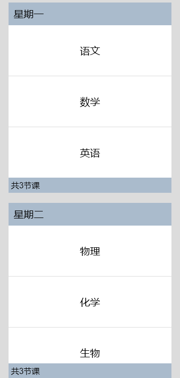

# 如何在List组件中分组展示不同种类的数据

---

**问题现象**


根据数据种类为ListItem设置不同样式。例如，标题和标题对应的子类等，应分别应用相应的样式。


**解决措施**


可以通过在List组件中使用ListItemGroup组件来展示ListItem分组，并单独设置ListItemGroup中的header参数以自定义每组的头部组件样式。参考代码如下：


```typescript
1. // xxx.ets
2. @Entry
3. @Component
4. struct ListItemGroupExample {
5.  private timetable: TimeTable[] = [
6.  {
7.  title: 'Monday',
8.  projects: ['language', 'mathematics', 'English']
9.  },
10.  {
11.  title: 'Tuesday',
12.  projects: ['physics', 'chemistry', 'biology']
13.  },
14.  {
15.  title: 'Wednesday',
16.  projects: ['history', 'geography', 'politics']
17.  },
18.  {
19.  title: 'Thursday',
20.  projects: ['the fine arts', 'music', 'sport']
21.  }
22.  ]
23.
24.  @Builder
25.  itemHead(text: string) {
26.  Text(text)
27.  .fontSize(20)
28.  .backgroundColor(0xAABBCC)
29.  .width('100%')
30.  .padding(10)
31.  }
32.
33.  @Builder
34.  itemFoot(num: number) {
35.  Text('common' + num + 'period')
36.  .fontSize(16)
37.  .backgroundColor(0xAABBCC)
38.  .width('100%')
39.  .padding(5)
40.  }
41.
42.  build() {
43.  Column() {
44.  List({ space: 20 }) {
45.  ForEach(this.timetable, (item: TimeTable) => {
46.  ListItemGroup({ header: this.itemHead(item.title), footer: this.itemFoot(item.projects.length) }) {
47.  ForEach(item.projects, (project: string) => {
48.  ListItem() {
49.  Text(project)
50.  .width('100%')
51.  .height(100)
52.  .fontSize(20)
53.  .textAlign(TextAlign.Center)
54.  .backgroundColor(0xFFFFFF)
55.  }
56.  }, (item: string) => item)
57.  }
58.  .divider({ strokeWidth: 1, color: Color.Blue }) // The boundary line between each row
59.  })
60.  }
61.  .width('90%')
62.  .height('100%')
63.  .sticky(StickyStyle.Header | StickyStyle.Footer)
64.  .scrollBar(BarState.Off)
65.  }.width('100%').height('100%').backgroundColor(0xDCDCDC).padding({ top: 5 })
66.  }
67. }
68.
69. interface TimeTable {
70.  title: string;
71.  projects: string[];
72. }

```


[ListComponentDisplaysDifferentData.ets](https://gitcode.com/HarmonyOS_Samples/faqsnippets/blob/master/ArkUI/entry/src/main/ets/pages/ListComponentDisplaysDifferentData.ets#L21-L92)


效果如图所示：





**参考链接**


[ListItemGroup](https://developer.huawei.com/consumer/cn/doc/harmonyos-references/ts-container-listitemgroup)
