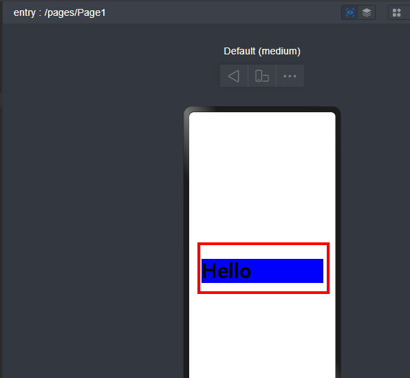

# 通用属性width是否支持设置变量

---

通用属性width支持设置变量。


```scss
1. @Entry
2. @Component
3. struct Page1 {
4.  @State message: string = 'Hello';
5.  @State widthNum: number = 300;
6.
7.  build() {
8.  Row() {
9.  Column() {
10.  Text(this.message)
11.  .fontSize(50)
12.  .fontWeight(FontWeight.Bold)
13.  .width(this.widthNum)
14.  .backgroundColor(Color.Blue)
15.  }
16.  .width('100%')
17.  }
18.  .height('100%')
19.  }
20. }

```


[DoesWidthSupportSettingVariables.ets](https://gitcode.com/HarmonyOS_Samples/faqsnippets/blob/master/ArkUI/entry/src/main/ets/pages/DoesWidthSupportSettingVariables.ets#L21-L40)


效果如下所示：



