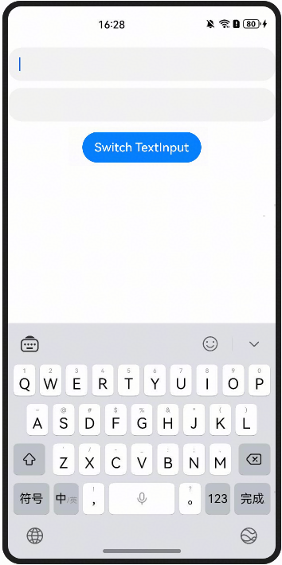
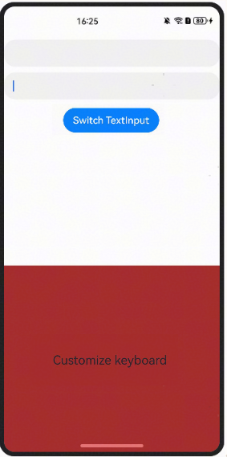

# 如何动态控制键盘绑定在不同的TextInput上

---

软键盘的收起和弹出与输入框的获焦和失焦相关。可以通过 focusControl 动态控制输入框焦点的转移，从而控制软键盘的显示和隐藏。将焦点转移到目标输入框可以实现键盘的动态切换。参考代码如下：


```typescript
1. @Entry
2. @Component
3. struct DynamicControlKeyboard {
4.  // Whether focus is on "key1" TextInput
5.  private flag: boolean = true;
6.  @Builder
7.  customKeyboardBuilder() {
8.  Row() {
9.  Text('Customize keyboard')
10.  }
11.  .justifyContent(FlexAlign.Center)
12.  .width('1260px')
13.  .height('1161px')
14.  .backgroundColor(Color.Brown)
15.  }
16.  build() {
17.  Column({space: 10}) {
18.  TextInput()
19.  .key('key1')
20.  .onAppear(() => {
21.  focusControl.requestFocus('key1');
22.  })
23.  .defaultFocus(true)
24.  TextInput()
25.  .key('key2')
26.  .customKeyboard(this.customKeyboardBuilder())
27.  Button('Switch TextInput')
28.  .onClick(() => {
29.  if (this.flag) {
30.  console.info('TextInput2 ==> ' + focusControl.requestFocus('key2'));
31.  } else {
32.  console.info('TextInput1 ==> ' + focusControl.requestFocus('key1'));
33.  }
34.  this.flag = !this.flag;
35.  })
36.  Button()
37.  .width(0)
38.  .height(0)
39.  .key('key3')
40.  }
41.  .padding({ top: 20 })
42.  .width('100%')
43.  .height('100%')
44.  .onClick(() => {
45.  focusControl.requestFocus('key3');
46.  })
47.  }
48. }

```


[DynamicallyControlKeyboardBinding.ets](https://gitcode.com/HarmonyOS_Samples/faqsnippets/blob/master/ArkUI/entry/src/main/ets/pages/DynamicallyControlKeyboardBinding.ets#L21-L68)


效果如图所示：





**参考链接**


[focusControl](https://developer.huawei.com/consumer/cn/doc/harmonyos-references/ts-universal-attributes-focus#focuscontrol9)
