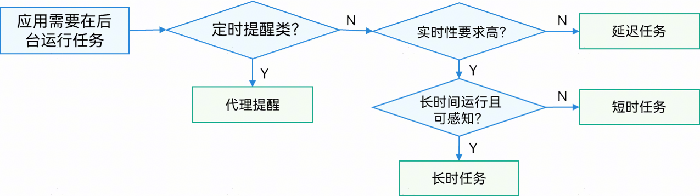
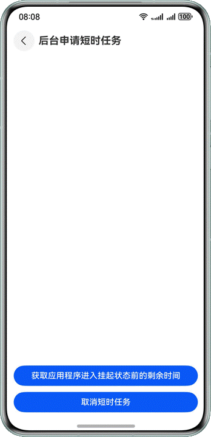
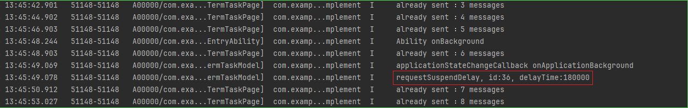
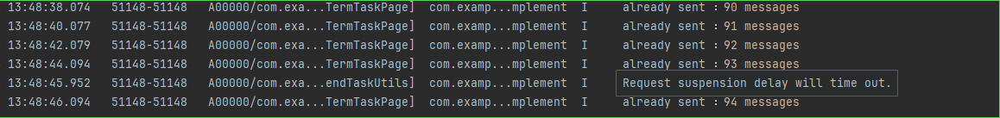
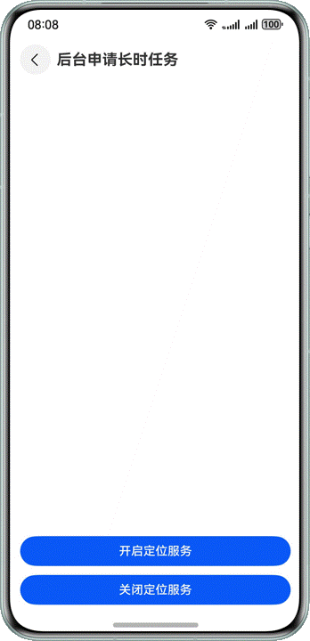
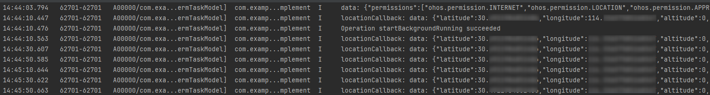
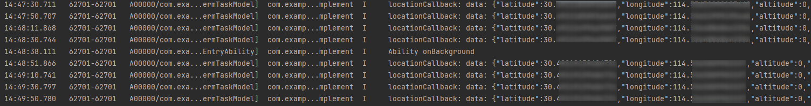

# 应用后台运行

## 概述

为有效降低设备耗电量并确保用户体验流畅，系统会对后台应用进行管理，包括进程挂起和终止。当应用处于音乐播放或地图导航等场景时，如果用户将应用退至后台、锁屏或切换应用，系统会自动将应用转入后台运行。为确保应用在后台期间仍能正常使用，系统提供了符合规范的后台任务机制。本文将介绍应用切后台的常见问题及解决方案，并通过分析应用短暂切换前后台和后台长时间运行的开发实践案例，指导开发者如何有效使用后台任务处理冻结场景，从而确保应用在前后台之间能够流畅切换。


**应用后台规格建议**


当前系统将对切换至后台的应用程序所使用的资源进行严格管控，具体措施包括挂起和终止进程。如果不进行后台处理，可能会导致应用程序功能异常。请参考官网指南和最佳实践文档，了解具体的限制条件和建议。


- [后台硬件资源使用建议](https://developer.huawei.com/consumer/cn/doc/harmonyos-guides/standard-background-hardware)、[后台硬件资源最佳实践](https://developer.huawei.com/consumer/cn/doc/best-practices/bpta-use-of-background-hardware-resources)：后台进程CPU负载约束（长时任务、短时任务）；应用退到后台无长时任务时使用蓝牙、网络资源、麦克风或者扬声器、GPS资源；退到后台禁止使用传感器。
- [后台软件资源使用建议](https://developer.huawei.com/consumer/cn/doc/harmonyos-guides/standard-background-software)、[后台软件资源最佳实践](https://developer.huawei.com/consumer/cn/doc/best-practices/bpta-use-of-background-software-resources)：后台合理使用上传下载、使用音频服务、使用定位导航服务、使用系统资源。
- [Background Tasks Kit简介（后台任务开发服务指南）](https://developer.huawei.com/consumer/cn/doc/harmonyos-guides/background-task-overview)：后台任务的功能介绍、资源使用约束、后台任务类型。


## 实现原理


### 后台任务类型

标准系统支持规范内受约束的后台任务，包括短时任务、长时任务、延迟任务、代理提醒。开发者可以根据如下介绍，选择合适的[后台任务](https://developer.huawei.com/consumer/cn/doc/harmonyos-guides/background-task-overview#%E5%90%8E%E5%8F%B0%E4%BB%BB%E5%8A%A1%E7%B1%BB%E5%9E%8B)，以满足应用退至后台后继续运行的需求。





以下表格对比总结了各类后台任务的概念、适用场景以及任务执行过程中的应用状态。


展开

| 适用场景 | 概念 | 常见问题 | 应用退至后台状态 | 任务类型 |
| --- | --- | --- | --- | --- |
| 不执行任何任务的后台场景：直接退至后台。 | 不执行任何任务，直接退至后台。 | - | 几秒后应用挂起。 | 无后台 |
| 任务类型：小文件下载、缓存、信息发送等时效性高、需要临时占用资源的任务。 | 任务类型：实时性要求高、耗时不长的任务。 | 应用短暂切换前后台，进程被挂起。 | 在单次配额内，应用不会被挂起直到取消任务。单次配额超时不取消，应用进程会被终止。 | 短时任务 |
| 任务类型：数据传输、音频播放、录音、定位导航、蓝牙、WLAN相关、多设备互联、音视频通话、计算任务。 | 任务类型：长时间运行在后台且用户可感知的任务。 | 应用后台长时间运行后会中断。 | 应用不会被挂起，直到任务取消。如果任务结束时不取消应用进程，进程会被终止。 | 长时任务 |
| 任务类型：软件更新、信息收集、数据处理等。 | 任务类型：实时性要求不高、可延迟执行的任务。满足条件后，任务将放入执行队列，系统会根据内存和功耗进行统一调度。 | - | 应用退到后台时会挂起，满足任务设定条件时由系统统一调度拉起应用，创建Extension进程执行任务。单次回调最长运行时间为2分钟，如果超时未取消，系统会终止对应的Extension进程。 | 延迟任务 |
| 任务类型：闹钟、倒计时、日历。 | 任务类型：系统代理应用做出相应提醒。 | - | 应用挂起或进程终止时，满足条件后系统会自动进行相应的提醒。 | 代理提醒 |


## 场景示例


### 应用短暂切换前后台，避免进程挂起

在应用进行小文件下载、缓存、信息发送等业务场景时，如果应用短暂退至后台导致进程被挂起，重新切换到前台，可能因应用的前后台周期回调中存在业务代码逻辑，导致应用使用状态异常。此时，可以申请短时任务作为解决方案。以下示例展示了如何使用ApplicationContext订阅应用前后台切换的回调，以在应用切后台时申请短时任务，解决因短暂切换前后台导致的消息发送异常问题。





1. 定义短时任务信息SuspendTaskInfo()接口，包括短时任务的ID和获取对应短时任务的剩余时间delayTime。
  
  
  

```typescript
1. export interface SuspendTaskInfo {
2.  id: number; // Short-time task ID
3.  delayTime: number; // The remaining time of this request short assignment
4. }

```
  [SuspendTaskInfo.ets](https://gitcode.com/harmonyos_samples/BackTaskImplement/blob/master/entry/src/main/ets/viewModel/SuspendTaskInfo.ets#L17-L20)

2. 在信息发送的场景中，当应用处于前台时，在onAppear()回调函数中启动一个定时器，每隔2秒发送一条消息，模拟后台业务。
  
  
  

```typescript
1. NavDestination() {
2.  // ...
3. }
4. .title(this.builderTitle())
5. .onAppear(() => {
6.  this.shortTermTaskModel.subscribeStateChange();
7.  this.taskTimer = setInterval(() => {
8.  this.messageCount++;
9.  hilog.info(0x0000, TAG, `already sent ：${this.messageCount} messages`);
10.  }, 2000);
11. })

```
  [ShortTermTaskPage.ets](https://gitcode.com/harmonyos_samples/BackTaskImplement/blob/master/entry/src/main/ets/view/ShortTermTaskPage.ets#L53-L96)

3. 在信息发送的场景中，通过ApplicationContext.on('applicationStateChange')注册对当前应用前后台变化的监听。当应用退至后台时，触发onApplicationBackground()回调函数，在此回调函数中申请短时任务。
  
  
  

```typescript
1. // Apply front - and back-end status monitoring
2. subscribeStateChange() {
3.  let that = this;
4.  // Gets applicationContext
5.  let applicationContext = this.context.getApplicationContext();
6.  let applicationStateChangeCallback: ApplicationStateChangeCallback = {
7.  onApplicationForeground() {
8.  hilog.info(0x0000, TAG, 'applicationStateChangeCallback onApplicationForeground');
9.  },
10.  onApplicationBackground() {
11.  hilog.info(0x0000, TAG, 'applicationStateChangeCallback onApplicationBackground');
12.  // Apply for short-time tasks when the application changes from foreground to background
13.  that.suspendTaskInfo = SuspendTaskUtils.requestSuspendDelay('Suspend Task');
14.  hilog.info(0x0000, TAG,
15.  `requestSuspendDelay, id:${that.suspendTaskInfo.id}, delayTime:${that.suspendTaskInfo.delayTime}`);
16.  }
17.  }
18.  try {
19.  // Registers the background and pre - application status monitoring through applicationContext
20.  applicationContext.on('applicationStateChange', applicationStateChangeCallback);
21.  } catch (paramError) {
22.  hilog.error(0x0000, TAG,
23.  `error: ${(paramError as BusinessError).code}, ${(paramError as BusinessError).message}`);
24.  }
25. }

```
  [ShortTermTaskModel.ets](https://gitcode.com/harmonyos_samples/BackTaskImplement/blob/master/entry/src/main/ets/viewModel/ShortTermTaskModel.ets#L28-L52)

4. 在小文件下载、缓存、信息发送等场景中，应用退至后台时，可使用backgroundTaskManager.requestSuspendDelay()接口，后台应用申请短时任务。短时任务的申请和使用过程中的约束与限制请参考[指南](https://developer.huawei.com/consumer/cn/doc/harmonyos-guides/transient-task#%E7%BA%A6%E6%9D%9F%E4%B8%8E%E9%99%90%E5%88%B6)。
  
  
  

```typescript
1. /**
2.  *
3.  * @param reason Set the delay task suspension reason
4.  * @returns
5.  */
6. requestSuspendDelay(reason: string): SuspendTaskInfo {
7.  let id: number; // Apply for a short-time task ID
8.  let delayTime: number; // The remaining time of this request short assignment
9.  try {
10.  // Request deferred task
11.  let delayInfo = backgroundTaskManager.requestSuspendDelay(reason, () => {
12.  // This function is used to call back the application when a short task requested by the application is about to time out.
13.  hilog.info(0x0000, TAG, `Request suspension delay will time out.`);
14.  backgroundTaskManager.cancelSuspendDelay(delayInfo.requestId);
15.  })
16.  id = delayInfo.requestId;
17.  delayTime = delayInfo.actualDelayTime;
18.  let taskInfo = {
19.  id: id,
20.  delayTime: delayTime
21.  } as SuspendTaskInfo;
22.  return taskInfo;
23.  } catch (err) {
24.  let taskInfo = {
25.  id: 0,
26.  delayTime: 0
27.  } as SuspendTaskInfo;
28.  return taskInfo;
29.  }
30. }

```
  [SuspendTaskUtils.ets](https://gitcode.com/harmonyos_samples/BackTaskImplement/blob/master/entry/src/main/ets/utils/SuspendTaskUtils.ets#L25-L54)

5. 应用返回前台后，调用backgroundTaskManager.getRemainingDelayTime()接口，获取对应短时任务的剩余时间。
  
  
  

```typescript
1. async getRemainingDelayTime(id: number): Promise<number> {
2.  let delayTime: number = -1;
3.  await backgroundTaskManager.getRemainingDelayTime(id).then((res: number) => {
4.  delayTime = res;
5.  hilog.info(0x0000, TAG, 'Operation getRemainingDelayTime succeeded. Data: ' + JSON.stringify(res));
6.  }).catch((err: BusinessError) => {
7.  hilog.error(0x0000, TAG, 'Operation getRemainingDelayTime failed. Cause: ' + err.code);
8.  });
9.  return delayTime;
10. }

```
  [SuspendTaskUtils.ets](https://gitcode.com/harmonyos_samples/BackTaskImplement/blob/master/entry/src/main/ets/utils/SuspendTaskUtils.ets#L58-L67)

6. 应用退至后台，可调用backgroundTaskManager.cancelSuspendDelay()接口取消短时任务。
  
  
  

```typescript
1. cancelSuspendDelay(id: number): boolean {
2.  try {
3.  backgroundTaskManager.cancelSuspendDelay(id);
4.  hilog.info(0x0000, TAG, 'cancelSuspendDelay succeeded.');
5.  } catch (err) {
6.  hilog.error(0x0000, TAG, `cancelSuspendDelay failed. Cause: ${JSON.stringify(err)}`);
7.  return false;
8.  }
9.  return true;
10. }

```
  [SuspendTaskUtils.ets](https://gitcode.com/harmonyos_samples/BackTaskImplement/blob/master/entry/src/main/ets/utils/SuspendTaskUtils.ets#L71-L80)


**实现效果**


- **系统息屏场景/应用置于后台场景：**前台应用在自动息屏后，会被识别为置于后台。此时，应用可以申请短时任务，剩余时长上限为3分钟（如下图所示，delayTime为18000ms）。
- 当短时任务的剩余时间不足时，系统会触发回调，停止任务。


### 应用后台长时间运行不中断

当应用涉及数据传输、音频播放、录音操作、定位导航、蓝牙和WLAN相关应用、多设备互联、音视频通话、复杂计算任务等场景时，需要应用在后台长时间运行。为了确保应用在这些情况下正常运作，可以申请后台长时任务来实现。以下示例展示了如何使用长时任务管理应用的定位服务，以实现应用在后台长时间运行时，持续获取设备位置信息的功能。





1. 在定位、导航类的应用场景下，为了确保应用在后台仍能使用定位服务，需在module.json5配置文件中为EntryAbility声明定位类型的长时任务，并申请定位相关权限。
  
  
  

```json
1. {
2.  "module": {
3.  // ...
4.  "abilities": [
5.  {
6.  "name": "EntryAbility",
7.  "srcEntry": "./ets/entryability/EntryAbility.ets",
8.  // ...
9.  "backgroundModes": [
10.  'location'
11.  ]
12.  }
13.  ],
14.  // ...
15.  "requestPermissions": [
16.  {
17.  "name": "ohos.permission.LOCATION",
18.  // ...
19.  },
20.  {
21.  "name": "ohos.permission.LOCATION_IN_BACKGROUND",
22.  // ...
23.  },
24.  {
25.  "name": "ohos.permission.APPROXIMATELY_LOCATION",
26.  // ...
27.  },
28.  {
29.  "name": "ohos.permission.KEEP_BACKGROUND_RUNNING",
30.  // ...
31.  }
32.  ]
33.  }
34. }

```
  [module.json5](https://gitcode.com/harmonyos_samples/BackTaskImplement/blob/master/entry/src/main/module.json5#L2-L110)

2. 应用跳转到定位功能页面，系统请求定位权限和网络访问权限。
  
  
  

```typescript
1. // Apply for location-related permissions
2. requestPermissionsFromUser(): void {
3.  let atManager: abilityAccessCtrl.AtManager = abilityAccessCtrl.createAtManager();
4.  let permissionList: Permissions[] = [
5.  'ohos.permission.INTERNET',
6.  'ohos.permission.LOCATION',
7.  'ohos.permission.APPROXIMATELY_LOCATION'
8.  ];
9.  atManager.requestPermissionsFromUser(this.context, permissionList)
10.  .then((data: PermissionRequestResult) => {
11.  hilog.info(0x0000, TAG, `data: ${JSON.stringify(data)}`);
12.  })
13.  .catch((err: BusinessError) => {
14.  hilog.error(0x0000, TAG, `requestPermissionsFromUser fail: ${JSON.stringify(err)}`);
15.  });
16. }

```
  [LongTermTaskModel.ets](https://gitcode.com/harmonyos_samples/BackTaskImplement/blob/master/entry/src/main/ets/viewModel/LongTermTaskModel.ets#L28-L43)

3. 应用需获取位置信息，使用geoLocationManager.on('locationChange')接口，开启位置变化订阅并发起定位请求。
  
  
  

```typescript
1. locationCallback = async (location: geoLocationManager.Location) => {
2.  hilog.info(0x0000, TAG, `locationCallback: data: ${JSON.stringify(location)}`);
3. };
4.
5. // Get the location
6. async getLocation() {
7.  let request: geoLocationManager.LocationRequest = {
8.  priority: geoLocationManager.LocationRequestPriority.FIRST_FIX, // Quick location acquisition is preferred
9.  scenario: geoLocationManager.LocationRequestScenario.UNSET, // Indicates that no scenario information is set
10.  timeInterval: 1, // Interval for reporting the location information
11.  distanceInterval: 0, // Distance for reporting location information
12.  maxAccuracy: 100 // The precision value required when the application requests location information from the system
13.  };
14.  try {
15.  geoLocationManager.on('locationChange', request, this.locationCallback);
16.  } catch (err) {
17.  hilog.error(0x0000, TAG, `errCode: ${JSON.stringify(err)}`);
18.  }
19. }

```
  [LongTermTaskModel.ets](https://gitcode.com/harmonyos_samples/BackTaskImplement/blob/master/entry/src/main/ets/viewModel/LongTermTaskModel.ets#L47-L65)

4. 应用退至后台需持续运行时，应调用backgroundTaskManager.startBackgroundRunning()接口申请长时任务。
  
  
  

```typescript
1. // Start a long task
2. startLongTask(): void {
3.  let wantAgentInfo: wantAgent.WantAgentInfo = {
4.  wants: [
5.  {
6.  bundleName: this.context.abilityInfo.bundleName,
7.  abilityName: this.context.abilityInfo.name
8.  }
9.  ],
10.  actionType: wantAgent.OperationType.START_ABILITY,
11.  requestCode: 0,
12.  wantAgentFlags: [wantAgent.WantAgentFlags.UPDATE_PRESENT_FLAG]
13.  };
14.
15.  try {
16.  // wantAgent object is obtained by getWantAgent method in WantAgent module
17.  wantAgent.getWantAgent(wantAgentInfo).then((wantAgentObj: WantAgent) => {
18.  backgroundTaskManager.startBackgroundRunning(this.context, backgroundTaskManager.BackgroundMode.LOCATION,
19.  wantAgentObj)
20.  .then(() => {
21.  hilog.info(0x0000, TAG, `Operation startBackgroundRunning succeeded`);
22.  })
23.  .catch((error: BusinessError) => {
24.  hilog.error(0x0000, TAG,
25.  `Operation startBackgroundRunning failed. code is ${error.code} message is ${error.message}`);
26.  });
27.  });
28.  } catch (error) {
29.  hilog.error(0x0000, TAG, `Operation getWantAgent failed. error is ${JSON.stringify(error)} `);
30.  }
31. }

```
  [LongTermTaskModel.ets](https://gitcode.com/harmonyos_samples/BackTaskImplement/blob/master/entry/src/main/ets/viewModel/LongTermTaskModel.ets#L69-L99)

5. 在定位和导航类的应用场景中，当应用退出时，需调用geoLocationManager.off('locationChange')接口，关闭位置变化订阅。
  
  
  

```typescript
1. geoLocationManager.off('locationChange');

```
  [LongTermTaskPage.ets](https://gitcode.com/harmonyos_samples/BackTaskImplement/blob/master/entry/src/main/ets/view/LongTermTaskPage.ets#L77-L77)

6. 应用退出时，调用backgroundTaskManager.stopBackgroundRunning()接口，取消长时任务。
  
  
  

```typescript
1. // Stop a long task
2. stopLongTask(): void {
3.  backgroundTaskManager.stopBackgroundRunning(this.context).then(() => {
4.  hilog.info(0x0000, TAG, `Operation stopBackgroundRunning succeeded`);
5.  }).catch((error: BusinessError) => {
6.  hilog.error(0x0000, TAG, `Operation stopBackgroundRunning failed. error is ${JSON.stringify(error)} `);
7.  });
8. }

```
  [LongTermTaskModel.ets](https://gitcode.com/harmonyos_samples/BackTaskImplement/blob/master/entry/src/main/ets/viewModel/LongTermTaskModel.ets#L103-L110)


**实现效果**


- 在定位和导航应用场景中，应用前台运行时开启位置订阅，控制台定期打印位置信息。


- 在定位和导航应用场景中，应用退至后台持续运行，控制台日志定时打印位置信息。


## 示例代码

- [基于后台任务实现应用流畅体验](https://gitcode.com/harmonyos_samples/BackTaskImplement)
