# 自定义相机预览

---

## 概述

在移动设备普及的今天，相机已成为人们生活中不可或缺的工具。在移动端开发中，自定义相机具有极高的实用价值，开发者能够根据不同的应用场景和用户需求，定制独特的拍摄功能与交互体验。


如果开发者仅需调用系统相机拍摄照片或录制视频，可直接使用[CameraPicker](https://developer.huawei.com/consumer/cn/doc/harmonyos-references/js-apis-camerapicker)。但构建高度自定义的相机应用或实现对相机数据流进行实时分析等复杂功能时，则需要使用[Camera Kit](https://developer.huawei.com/consumer/cn/doc/harmonyos-references/camera-api)（相机服务）访问和操作相机硬件来实现。


相机预览是相机镜头采集画面的实时展示，为后续的拍照、录像等操作提供基础。本文将对实现基础预览、预览画面的调整（如镜头切换、设置闪光灯、调焦、对焦等）、预览进阶功能（网格线、水平仪等）、获取预览帧数据四个章节进行讲解，提供自定义相机预览部分由基础到进阶的开发实践。


## 实现基础预览


### 场景描述

基础预览是自定义相机核心的功能，用户打开相机应用后，首先看到的就是实时的预览画面，该功能为画面调整、拍摄等操作提供基础。


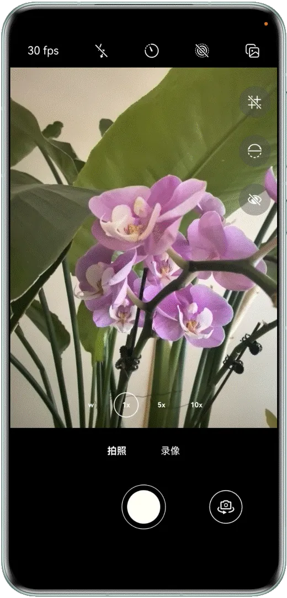


### 实现原理

**关键技术**


- Surface：图像数据缓冲区的抽象概念。


- [XComponent](https://developer.huawei.com/consumer/cn/doc/harmonyos-references/ts-basic-components-xcomponent)：用于满足开发者较为复杂的自定义渲染需求的渲染组件。为相机提供Surface，相机将预览流数据写入Surface，[XComponent](https://developer.huawei.com/consumer/cn/doc/harmonyos-references/ts-basic-components-xcomponent)从Surface读取数据并显示。
- [Camera Kit](https://developer.huawei.com/consumer/cn/doc/harmonyos-references/camera-api)：用于相机设备管理，相机输出流管理以及相机会话管理。相机会话用于配置输入流和输出流，以及设置闪光灯、焦距等参数。


**开发流程**


1. 申请权限。
2. 获取相机设备，创建并启动相机输入流。
3. 使用XComponent创建Surface，并获取surfaceId。
4. 创建预览输出流。
5. 配置相机会话Session并启动。


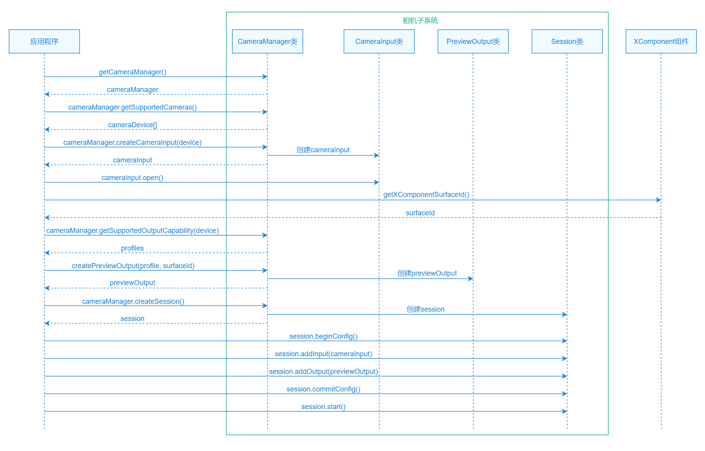


### 开发步骤

1. 在使用相机相关功能前，需要申请ohos.permission.CAMERA相机权限。申请权限分为以下两步。     在module.json5中配置该权限，更多相机权限参考[相机开发准备](https://developer.huawei.com/consumer/cn/doc/harmonyos-guides-V5/camera-preparation-V5#%E7%94%B3%E8%AF%B7%E6%9D%83%E9%99%90)。


  
  
  

```cangjie
1. "requestPermissions": [
2.  {
3.  "name": "ohos.permission.CAMERA",
4.  "reason": "$string:permission_CAMERA",
5.  "usedScene": {
6.  "abilities": [
7.  "EntryAbility"
8.  ]
9.  }
10.  },
11.  // ...
12. ]


```
  [module.json5](https://gitcode.com/harmonyos_samples/CustomCamera/blob/master/entry/src/main/module.json5#L37-L106)
     使用[AtManager.requestPermissionsFromUser()](https://developer.huawei.com/consumer/cn/doc/harmonyos-references/js-apis-abilityaccessctrl#requestpermissionsfromuser9)方法拉起弹窗请求用户授权，若用户拒绝则使用[requestPermissionOnSetting()](https://developer.huawei.com/consumer/cn/doc/harmonyos-references/js-apis-abilityaccessctrl#requestpermissiononsetting12)方法拉起权限设置弹窗，二次向用户申请授权。具体授权逻辑可根据业务自行调整，可参考[应用权限申请](https://developer.huawei.com/consumer/cn/doc/best-practices/bpta-permission-application)。


  
  
  

```typescript
1. class PermissionManager {
2.  private static atManager: abilityAccessCtrl.AtManager = abilityAccessCtrl.createAtManager();
3.
4.  static async request(permissions: Permissions[], context: Context): Promise<void> {
5.  try {
6.  const data = await PermissionManager.atManager.requestPermissionsFromUser(context, permissions);
7.  const grantStatus: number[] = data.authResults;
8.  const deniedPermissions = permissions.filter((_, i) => grantStatus[i] !== 0);
9.  for (const permission of deniedPermissions) {
10.  const secondGrantStatus = await PermissionManager.atManager.requestPermissionOnSetting(context, [permission]);
11.  if (secondGrantStatus[0] !== 0) {
12.  Logger.error(TAG, 'permission denied');
13.  throw new Error('permission denied');
14.  }
15.  }
16.  } catch (exception) {
17.  Logger.error(TAG, `request failed, code is ${exception.code}, message is ${exception.message}`);
18.  throw new Error('permission failed');
19.  }
20.  }
21. }


```
  [PermissionManager.ets](https://gitcode.com/harmonyos_samples/CustomCamera/blob/master/entry/src/main/ets/utils/PermissionManager.ets#L22-L43)

2. 获取相机设备，创建并启动相机输入流。     使用[camera.getCameraManager()](https://developer.huawei.com/consumer/cn/doc/harmonyos-references/arkts-apis-camera-f#cameragetcameramanager)方法获取cameraManager实例。


  
  
  

```ini
1. this.cameraManager = camera.getCameraManager(context);


```
  [CameraManager.ets](https://gitcode.com/harmonyos_samples/CustomCamera/blob/master/camera/src/main/ets/cameramanagers/CameraManager.ets#L35-L35)
     使用[camera.getSupportedCameras()](https://developer.huawei.com/consumer/cn/doc/harmonyos-references/arkts-apis-camera-cameramanager#getsupportedcameras)方法获取相机设备列表。通过[camera.CameraPosition](https://developer.huawei.com/consumer/cn/doc/harmonyos-references/arkts-apis-camera-e#cameraposition)类型获取对应的相机设备。CAMERA_POSITION_BACK表示后置镜头，CAMERA_POSITION_FRONT表示前置镜头。


  
  
  

```javascript
1. getCameraDevice(cameraPosition: camera.CameraPosition): camera.CameraDevice | undefined {
2.  const cameraDevices = this.cameraManager?.getSupportedCameras();
3.  if (!cameraDevices) {
4.  Logger.error(TAG, `Failed to get camera device. cameraPosition: ${cameraPosition}}`);
5.  return undefined;
6.  }
7.  const device = cameraDevices?.find(device => device.cameraPosition === cameraPosition) || cameraDevices[0];
8.  if (!device) {
9.  Logger.error(TAG, `Failed to get camera device. cameraPosition: ${cameraPosition}}`);
10.  }
11.  return device;
12. }


```
  [CameraManager.ets](https://gitcode.com/harmonyos_samples/CustomCamera/blob/master/camera/src/main/ets/cameramanagers/CameraManager.ets#L142-L154)
     使用[camera.createCameraInput()](https://developer.huawei.com/consumer/cn/doc/harmonyos-references/arkts-apis-camera-cameramanager#createcamerainput)方法创建该相机设备的输入流并打开相机。


  
  
  

```kotlin
1. this.cameraInput = this.cameraManager?.createCameraInput(device);
2. await this.cameraInput?.open();


```
  [CameraManager.ets](https://gitcode.com/harmonyos_samples/CustomCamera/blob/master/camera/src/main/ets/cameramanagers/CameraManager.ets#L72-L73)

3. 创建Surface。     使用[XComponent](https://developer.huawei.com/consumer/cn/doc/harmonyos-references/ts-basic-components-xcomponent)组件渲染预览画面。指定其type属性为SURFACE。

     使用[getXComponentSurfaceId()](https://developer.huawei.com/consumer/cn/doc/harmonyos-references/ts-basic-components-xcomponent#getxcomponentsurfaceid9)方法获取surfaceId。

     使用[setXComponentSurfaceRect()](https://developer.huawei.com/consumer/cn/doc/harmonyos-references/ts-basic-components-xcomponent#setxcomponentsurfacerect12)方法设置surface的宽高属性为预览画面显示区域的宽高。

     使用[setXComponentSurfaceRotation()](https://developer.huawei.com/consumer/cn/doc/harmonyos-references/ts-basic-components-xcomponent#setxcomponentsurfacerotation12)方法锁定surface在屏幕旋转时的方向。


  
  
  说明
      未设置surface宽高时其取值为XComponent组件宽高。建议显式设置surface宽高而不是依赖XComponent宽高，防止surface宽高不对导致画面畸变。


  
  
  

```kotlin
1. XComponent({
2.  type: XComponentType.SURFACE,
3.  controller: this.previewVM.xComponentController
4. })
5.  .onLoad(async () => {
6.  // ...
7.  this.previewVM.surfaceId = this.previewVM.xComponentController.getXComponentSurfaceId();
8.  this.previewVM.setPreviewSize();
9.  this.previewVM.xComponentController.setXComponentSurfaceRotation({ lock: true });
10.  // ...
11.  })


```
  [PreviewScreenView.ets](https://gitcode.com/harmonyos_samples/CustomCamera/blob/master/entry/src/main/ets/views/PreviewScreenView.ets#L136-L159)

  
  
  

```cangjie
1. setPreviewSize(): void {
2.  const displaySize: Size = WindowUtil.getMaxDisplaySize(this.getPreviewRatio());
3.  this.previewSize = displaySize;
4.  this.xComponentController.setXComponentSurfaceRect({
5.  surfaceWidth: displaySize.width,
6.  surfaceHeight: displaySize.height
7.  });
8. }


```
  [PreviewViewModel.ets](https://gitcode.com/harmonyos_samples/CustomCamera/blob/master/entry/src/main/ets/viewmodels/PreviewViewModel.ets#L274-L281)

4. 创建预览输出流。
  1. 选择对应的[camera.SceneMode](https://developer.huawei.com/consumer/cn/doc/harmonyos-references/arkts-apis-camera-e#scenemode11)。拍照模式下的预览选择SceneMode.NORMAL_PHOTO，录像模式下的预览选择SceneMode.NORMAL_VIDEO。
  2. 根据[camera.SceneMode](https://developer.huawei.com/consumer/cn/doc/harmonyos-references/arkts-apis-camera-e#scenemode11)获取相机设备的输出能力。
  3. 在输出能力[CameraOutputCapability](https://developer.huawei.com/consumer/cn/doc/harmonyos-references/arkts-apis-camera-i#cameraoutputcapability)类的previewProfiles属性中查找所需规格的预览输出能力previewProfile。在profile的选择上需要注意以下两点：
    - 分辨率选择。所选择分辨率要保证宽高比与surface的宽高比一致，避免画面产生畸变。同时根据业务需求和设备性能选择合适的分辨率大小，过小可能导致画面模糊，过大可能导致资源浪费，功耗和内存过高等风险。
    - format格式选择。开发者在选择format格式时需要与后续处理相机buffer数据的像素格式保持一致，避免画面产生异常。
  4. 使用[CameraManager.createPreviewOutput()](https://developer.huawei.com/consumer/cn/doc/harmonyos-references/arkts-apis-camera-cameramanager#createpreviewoutput)方法创建预览输出流。


  
  
  

```javascript
1. async createOutput(config: CreateOutputConfig): Promise<camera.PreviewOutput | undefined> {
2.  const cameraOutputCap = config.cameraManager?.getSupportedOutputCapability(config.device, config.sceneMode);
3.  const displayRatio = config.profile.size.width / config.profile.size.height;
4.  const profileWidth = config.profile.size.width;
5.  const previewProfile = cameraOutputCap?.previewProfiles
6.  .sort((a, b) => Math.abs(a.size.width - profileWidth) - Math.abs(b.size.width - profileWidth))
7.  .find(pf => {
8.  const pfDisplayRatio = pf.size.width / pf.size.height;
9.  return pf.format === config.profile.format &&
10.  Math.abs(pfDisplayRatio - displayRatio) <= CameraConstant.PROFILE_DIFFERENCE;
11.  });
12.  if (!previewProfile) {
13.  Logger.error(TAG_LOG, 'Failed to get preview profile');
14.  return undefined;
15.  }
16.  try {
17.  this.output = config.cameraManager?.createPreviewOutput(previewProfile, config.surfaceId);
18.  if (this.output) {
19.  this.addOutputListener(this.output);
20.  }
21.  } catch (exception) {
22.  Logger.error(TAG_LOG, `createPreviewOutput failed, code is ${exception.code}, message is ${exception.message}`);
23.  }
24.  return this.output;
25. }


```
  [PreviewManager.ets](https://gitcode.com/harmonyos_samples/CustomCamera/blob/master/camera/src/main/ets/cameramanagers/PreviewManager.ets#L39-L64)

  
  
  说明
      以直板机后置相机为例，在设备自然方向下，相机的后置镜头安装角度为90度（不同设备的相机安装角度可通过[CameraDevice.cameraOrientation](https://developer.huawei.com/consumer/cn/doc/harmonyos-references/arkts-apis-camera-i#cameradevice)获取），屏幕旋转角度为0度。所以输出能力profile中的宽高与预览显示区域或surface的宽高比例是倒置的。例如在显示区域宽高为1080*1920，所需查找profile的宽高为1920*1080。横屏显示方向下，profile宽高与预览显示区域或surface的宽高比例保持一致。


  
  
  

```cangjie
1. // Get the camera's width, height, and format params.
2. public getProfile: (cameraOrientation: number) => camera.Profile = cameraOrientation => {
3.  const displaySize: Size = WindowUtil.getMaxDisplaySize(this.getPreviewRatio());
4.  let displayDefault: display.Display | null = null;
5.  try {
6.  displayDefault = display.getDefaultDisplaySync();
7.  } catch (exception) {
8.  Logger.error(TAG, `getDefaultDisplaySync failed, code is ${exception.code}, message is ${exception.message}`);
9.  }
10.  // Get actual rotation angle.
11.  const displayRotation = (displayDefault?.rotation ?? 0) * 90;
12.  const isRevert = (cameraOrientation + displayRotation) % 180 !== 0;
13.  return {
14.  format: camera.CameraFormat.CAMERA_FORMAT_YUV_420_SP,
15.  size: {
16.  height: isRevert ? displaySize.width : displaySize.height,
17.  width: isRevert ? displaySize.height : displaySize.width
18.  }
19.  };
20. };


```
  [PreviewViewModel.ets](https://gitcode.com/harmonyos_samples/CustomCamera/blob/master/entry/src/main/ets/viewmodels/PreviewViewModel.ets#L75-L94)

5. 配置并启动相机会话。     使用[CameraManager.createSession()](https://developer.huawei.com/consumer/cn/doc/harmonyos-references/arkts-apis-camera-cameramanager#createsession11)方法创建相机会话Session。

     使用[Session.beginConfig()](https://developer.huawei.com/consumer/cn/doc/harmonyos-references/arkts-apis-camera-session#beginconfig11)方法开始相机会话配置。

     使用[Session.addInput()](https://developer.huawei.com/consumer/cn/doc/harmonyos-references/arkts-apis-camera-session#addinput11)方法和[Session.addOutput()](https://developer.huawei.com/consumer/cn/doc/harmonyos-references/arkts-apis-camera-session#addoutput11)方法分别将相机的输入流和预览输出流配置到相机会话中。

     使用[Session.commitConfig()](https://developer.huawei.com/consumer/cn/doc/harmonyos-references/arkts-apis-camera-session#commitconfig11-1)方法提交相机会话配置信息。

     使用[Session.start()](https://developer.huawei.com/consumer/cn/doc/harmonyos-references/arkts-apis-camera-session#start11-1)方法启动相机会话。


  
  
  

```kotlin
1. const session = this.cameraManager?.createSession(sceneMode);
2. session?.beginConfig();
3. session?.addInput(this.cameraInput);
4. // ...
5. for (const outputManager of this.outputManagers) {
6.  if (outputManager.isActive) {
7.  const output = await outputManager.createOutput(config);
8.  session?.addOutput(output);
9.  }
10. }
11. await session?.commitConfig();
12. if (sceneMode === camera.SceneMode.NORMAL_VIDEO && session) {
13.  this.setVideoStabilizationMode(isStabilizationEnabled, session as camera.VideoSession);
14. }
15. await session?.start();


```
  [CameraManager.ets](https://gitcode.com/harmonyos_samples/CustomCamera/blob/master/camera/src/main/ets/cameramanagers/CameraManager.ets#L76-L100)

  
  
  

```cangjie
1. export interface OutputManager {
2.  output?: camera.CameraOutput;
3.  isActive: boolean;
4.  createOutput: (config: CreateOutputConfig) => Promise<camera.CameraOutput | undefined>;
5.  release: () => Promise<void>;
6. }


```
  [OutputManager.ets](https://gitcode.com/harmonyos_samples/CustomCamera/blob/master/camera/src/main/ets/cameramanagers/OutputManager.ets#L28-L33)

6. 释放资源，注意释放的顺序。     使用[CameraOutput.release()](https://developer.huawei.com/consumer/cn/doc/harmonyos-references/arkts-apis-camera-cameraoutput#release-1)方法释放预览输出流。


  
  
  

```javascript
1. async release(): Promise<void> {
2.  try {
3.  await this.output?.release();
4.  } catch (exception) {
5.  Logger.error(TAG_LOG, `release failed, code is ${exception.code}, message is ${exception.message}`);
6.  }
7.  this.output = undefined;
8. }


```
  [PreviewManager.ets](https://gitcode.com/harmonyos_samples/CustomCamera/blob/master/camera/src/main/ets/cameramanagers/PreviewManager.ets#L97-L105)
     使用[CameraInput.close()](https://developer.huawei.com/consumer/cn/doc/harmonyos-references/arkts-apis-camera-camerainput#close-1)方法关闭相机，使用[Session.release()](https://developer.huawei.com/consumer/cn/doc/harmonyos-references/arkts-apis-camera-session#release11-1)方法释放相机会话资源。


  
  
  

```csharp
1. async release(): Promise<void> {
2.  try {
3.  await this.session?.stop();
4.  for (const outputManager of this.outputManagers) {
5.  if (outputManager.isActive) {
6.  await outputManager.release();
7.  }
8.  }
9.  await this.cameraInput?.close();
10.  await this.session?.release();
11.  } catch (exception) {
12.  Logger.error(TAG, `release failed, code is ${exception.code}, message is ${exception.message}`);
13.  }
14. }


```
  [CameraManager.ets](https://gitcode.com/harmonyos_samples/CustomCamera/blob/master/camera/src/main/ets/cameramanagers/CameraManager.ets#L124-L138)

7. 监听预览流状态。     注册[frameStart](https://developer.huawei.com/consumer/cn/doc/harmonyos-references/arkts-apis-camera-previewoutput#onframestart)预览帧启动和[frameEnd](https://developer.huawei.com/consumer/cn/doc/harmonyos-references/arkts-apis-camera-previewoutput#onframeend)预览帧结束的事件，在事件回调中做对应的业务处理。


  
  
  

```cangjie
1. addFrameStartEventListener(output: camera.PreviewOutput): void {
2.  output.on('frameStart', (err: BusinessError) => {
3.  if (err !== undefined && err.code !== 0) {
4.  Logger.error(TAG_LOG, `FrameStart callback Error, errorMessage: ${err.message}`);
5.  return;
6.  }
7.  Logger.info(TAG_LOG, 'Preview frame started');
8.  this.onPreviewStart();
9.  });
10. }
11.
12. addFrameEndEventListener(output: camera.PreviewOutput): void {
13.  output.on('frameEnd', (err: BusinessError) => {
14.  if (err !== undefined && err.code !== 0) {
15.  Logger.error(TAG_LOG, `frameEnd callback Error, errorMessage: ${err.message}`);
16.  return;
17.  }
18.  Logger.info(TAG_LOG, 'Preview frame end');
19.  });
20. }


```
  [PreviewManager.ets](https://gitcode.com/harmonyos_samples/CustomCamera/blob/master/camera/src/main/ets/cameramanagers/PreviewManager.ets#L73-L93)


## 预览画面调整

在基础预览功能之上，自定义相机通常需要具备调整预览画面的能力，包括前后置镜头的切换、调焦、对焦、切换闪光灯模式等核心功能。


### 切换前后置镜头

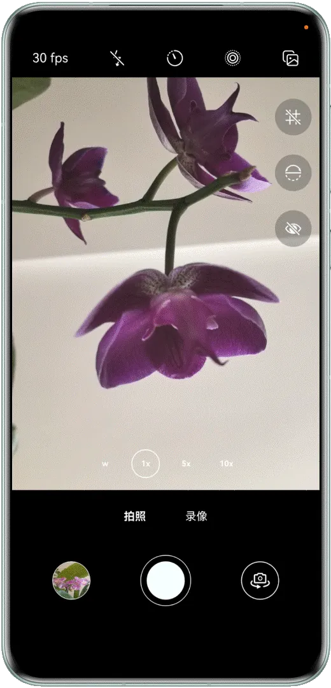


预览页面中用isFront属性标识前置还是后置镜头，根据isFront获取[camera.CameraPosition](https://developer.huawei.com/consumer/cn/doc/harmonyos-references/arkts-apis-camera-e#cameraposition)的值。关于折叠屏CameraPosition的选择可参考[相机硬件差异](https://developer.huawei.com/consumer/cn/doc/best-practices/bpta-multi-device-camera#section13854163154917)。


```cangjie
1. public isFront: boolean = false;
2. // ...
3. getCameraPosition(): camera.CameraPosition {
4.  return this.isFront
5.  ? camera.CameraPosition.CAMERA_POSITION_FRONT
6.  : camera.CameraPosition.CAMERA_POSITION_BACK;
7. }

```


[PreviewViewModel.ets](https://gitcode.com/harmonyos_samples/CustomCamera/blob/master/entry/src/main/ets/viewmodels/PreviewViewModel.ets#L41-L258)


给切换镜头按钮绑定点击事件，在回调函数中先切换isFront属性的状态，获取新的CameraPosition，释放掉输入输出流等相机资源，再重新创建新镜头的输入输出流，并启动相机。参考[实现基础预览](https://developer.huawei.com/consumer/cn/doc/best-practices/bpta-custom-camera-preview#section422717541386)中的2、4、5步骤。


说明

在本示例中，相机和基础预览的启动流程封装在自定义的CameraManager类的start()方法中，相机资源及输入输出流的释放封装在release()方法中。


```typescript
1. @Builder
2. toggleCameraPositionButton() {
3.  Image($r('app.media.toggle_position'))
4.  .width(48)
5.  .height(48)
6.  .onClick(async () => {
7.  // ...
8.  this.previewVM.isFront = !this.previewVM.isFront;
9.  await this.previewVM.cameraManagerRelease();
10.  await this.previewVM.cameraManagerStart();
11.  // ...
12.  })
13. }

```


[OperateButtonsView.ets](https://gitcode.com/harmonyos_samples/CustomCamera/blob/master/entry/src/main/ets/views/OperateButtonsView.ets#L297-L315)


实现前后置切换转场动效可参考[相机基础动效](https://developer.huawei.com/consumer/cn/doc/harmonyos-guides/camera-animation)。


### 设置相机焦距

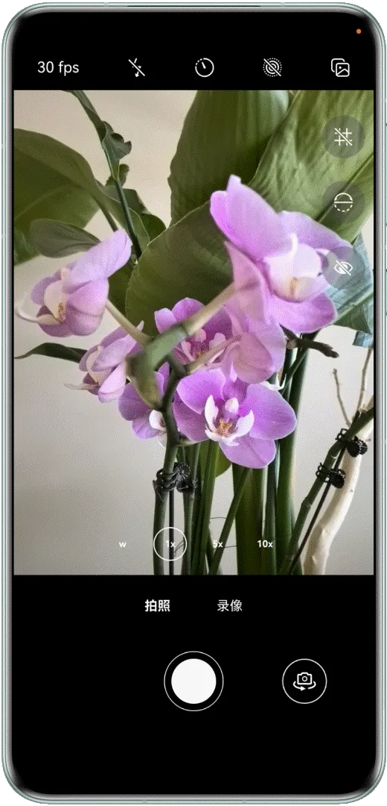


使用[getZoomRatioRange()](https://developer.huawei.com/consumer/cn/doc/harmonyos-references/arkts-apis-camera-zoomquery#getzoomratiorange11)方法获取当前相机设备支持设置的焦距范围，根据业务需求在页面上生成相应焦距的按钮。


```kotlin
1. getZoomRange(): number[] {
2.  try {
3.  return this.session!.getZoomRatioRange();
4.  } catch (exception) {
5.  Logger.error(TAG, `getZoomRange failed, code is ${exception.code}, message is ${exception.message}`);
6.  return [];
7.  }
8. }

```


[CameraManager.ets](https://gitcode.com/harmonyos_samples/CustomCamera/blob/master/camera/src/main/ets/cameramanagers/CameraManager.ets#L158-L166)


在点击焦距按钮事件的回调函数中使用[setSmoothZoom()](https://developer.huawei.com/consumer/cn/doc/harmonyos-references/arkts-apis-camera-zoom#setsmoothzoom11)方法平滑变焦到按钮对应的焦距。


```typescript
1. setSmoothZoom(zoom: number): void {
2.  try {
3.  this.session?.setSmoothZoom(zoom);
4.  } catch (e) {
5.  Logger.error(TAG, 'setSmoothZoom error ' + JSON.stringify(e));
6.  }
7. }

```


[CameraManager.ets](https://gitcode.com/harmonyos_samples/CustomCamera/blob/master/camera/src/main/ets/cameramanagers/CameraManager.ets#L232-L239)


### 设置闪光灯

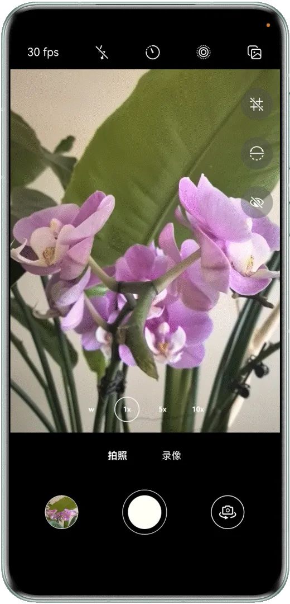


使用[setFlashMode()](https://developer.huawei.com/consumer/cn/doc/harmonyos-references/arkts-apis-camera-flash#setflashmode11)方法设置闪光灯模式，在设置前需使用[isFlashModeSupported()](https://developer.huawei.com/consumer/cn/doc/harmonyos-references/arkts-apis-camera-flashquery#isflashmodesupported11)方法检测设备是否支持设置所选闪光灯模式。


```javascript
1. setFlashMode(flashMode: camera.FlashMode): void {
2.  try {
3.  const isSupported = this.session?.isFlashModeSupported(flashMode);
4.  if (!isSupported) {
5.  Logger.error(TAG, `setFlashMode error: flash mode ${flashMode} is not supported`);
6.  return;
7.  }
8.  this.session?.setFlashMode(flashMode);
9.  } catch (e) {
10.  Logger.error(TAG, 'setFlashMode error ' + JSON.stringify(e));
11.  }
12. }

```


[CameraManager.ets](https://gitcode.com/harmonyos_samples/CustomCamera/blob/master/camera/src/main/ets/cameramanagers/CameraManager.ets#L243-L255)


### 实现点击对焦

点击预览区域，以点击处为焦点进行对焦，并显示对焦框。


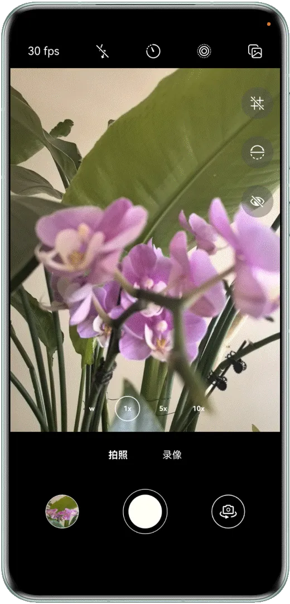


设置焦点[camera.Point](https://developer.huawei.com/consumer/cn/doc/harmonyos-references/arkts-apis-camera-i#point)的坐标是以充电口在右侧时横向设备方向为基准，该坐标系左上角为{ 0，0 }，右下角为{ 1，1 }。


设备自然方向上，触碰获取的坐标是以充电口在下方时的竖向方向为基准，因此需要进行坐标系的转换。


设触碰点为{ x, y }，预览区域宽高为{ w, h }。


- 屏幕旋转角度为0：由下图可知，在焦点所处相机画面坐标系中，触碰点距原点在x轴方向的距离为y，在y轴方向的距离为w - x。由于该坐标系为0-1坐标系，所以实际焦点坐标为{ y / h, (w - x) / w }，即{ y / h, 1 - x / w }。


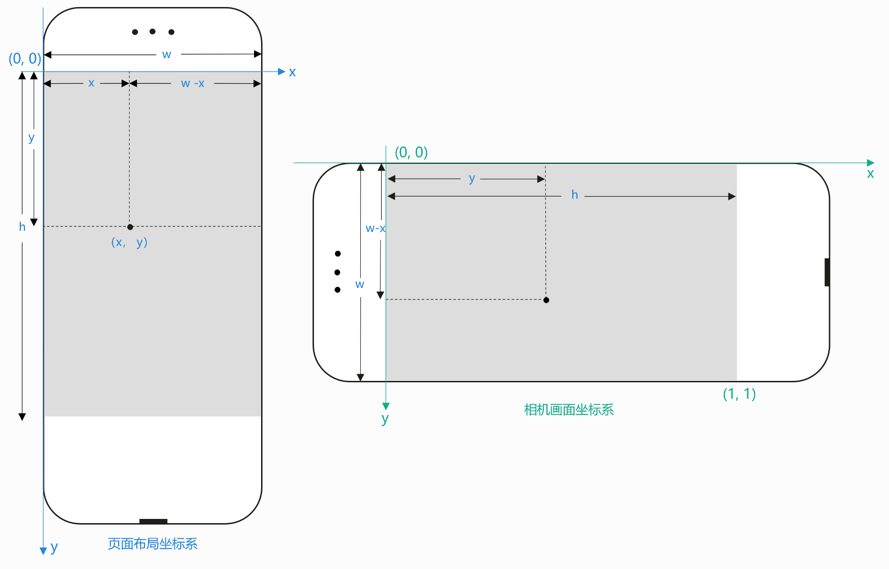


同理，其他屏幕旋转方向上焦点坐标同可以计算出：


- 屏幕旋转角度为90：焦点坐标为{ 1 - x / w, 1 - y / h }。
- 屏幕旋转角度为180：焦点坐标为{ 1 - y / h, x / w }。
- 屏幕旋转角度为270：焦点坐标为{ x / w, y / h }。


```cangjie
1. export function calCameraPoint(eventX: number, eventY: number, width: number, height: number): camera.Point {
2.  let displayDefault: display.Display | null = null;
3.  try {
4.  displayDefault = display.getDefaultDisplaySync();
5.  } catch (exception) {
6.  Logger.error('calCameraPoint', `calCameraPoint failed, code is ${exception.code}, message is ${exception.message}`);
7.  }
8.  const displayRotation = (displayDefault?.rotation ?? 0) * 90;
9.  if (displayRotation === 0) {
10.  return { x: eventY / height, y: 1 - eventX / width };
11.  }
12.  if (displayRotation === 90) {
13.  return { x: 1 - eventX / width, y: 1 - eventY / height };
14.  }
15.  if (displayRotation === 180) {
16.  return { x: 1 - eventY / height, y: eventX / width };
17.  }
18.  return { x: eventX / width, y: eventY / height };
19. }

```


[CommonUtil.ets](https://gitcode.com/harmonyos_samples/CustomCamera/blob/master/entry/src/main/ets/utils/CommonUtil.ets#L139-L158)


在相机会话启动后，使用[setFocusMode()](https://developer.huawei.com/consumer/cn/doc/harmonyos-references/arkts-apis-camera-focus#setfocusmode11)方法设置对焦模式为FOCUS_MODE_CONTINUOUS_AUTO，当点击预览画面对焦时，设置对焦模式为FOCUS_MODE_AUTO，以支持对焦点设置。在设置前需检测相机是否支持该对焦模式。手动对焦结束后将对焦模式切换为FOCUS_MODE_CONTINUOUS_AUTO，以获得更好的对焦体验。


```javascript
1. setFocusMode(focusMode: camera.FocusMode): void {
2.  try {
3.  const isSupported = this.session?.isFocusModeSupported(focusMode);
4.  if (!isSupported) {
5.  Logger.error(TAG, `setFocusMode error: focus mode ${focusMode} is not supported`);
6.  return;
7.  }
8.  this.session?.setFocusMode(focusMode);
9.  } catch (e) {
10.  Logger.error(TAG, 'setFocusMode error ' + JSON.stringify(e));
11.  }
12. }

```


[CameraManager.ets](https://gitcode.com/harmonyos_samples/CustomCamera/blob/master/camera/src/main/ets/cameramanagers/CameraManager.ets#L170-L182)


使用[setFoucusPoint()](https://developer.huawei.com/consumer/cn/doc/harmonyos-references/arkts-apis-camera-focus#setfocuspoint11)方法实现点击对焦。


```javascript
1. setFocusPoint(point: camera.Point): void {
2.  try {
3.  this.session?.setFocusPoint(point);
4.  } catch (e) {
5.  Logger.error(TAG, 'setFocusPoint error ' + JSON.stringify(e));
6.  }
7. }

```


[CameraManager.ets](https://gitcode.com/harmonyos_samples/CustomCamera/blob/master/camera/src/main/ets/cameramanagers/CameraManager.ets#L186-L193)


根据预览区域宽高、对焦框宽高以及触碰点的坐标计算对焦框相对预览区域的位置，注意不要超出预览区域的边界。


```cangjie
1. // cal absolute position in parent area
2. export function getClampedChildPosition(childSize: Size, parentSize: Size, point: Point): Edges {
3.  // center point
4.  let left = point.x - childSize.width / 2;
5.  let top = point.y - childSize.height / 2;
6.  // limit in left
7.  if (left < 0) {
8.  left = 0;
9.  }
10.  // limit in right
11.  if (left + childSize.width > parentSize.width) {
12.  left = parentSize.width - childSize.width;
13.  }
14.  // limit in top
15.  if (top < 0) {
16.  top = 0;
17.  }
18.  // limit in bottom
19.  if (top + childSize.height > parentSize.height) {
20.  top = parentSize.height - childSize.height;
21.  }
22.  return { left, top };
23. }

```


[CommonUtil.ets](https://gitcode.com/harmonyos_samples/CustomCamera/blob/master/entry/src/main/ets/utils/CommonUtil.ets#L64-L86)


### 设置曝光区域中心点

点击预览区域，设置点击处为曝光中心点。


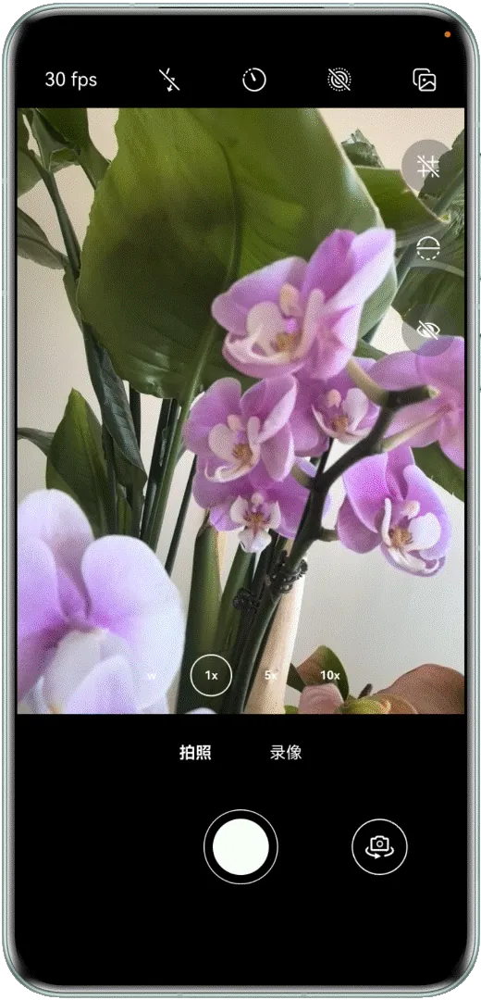


在相机会话启动后，使用[setExposureMode()](https://developer.huawei.com/consumer/cn/doc/harmonyos-references/arkts-apis-camera-autoexposure#setexposuremode11)方法设置曝光模式为EXPOSURE_MODE_CONTINUOUS_AUTO，当点击预览画面时，设置曝光模式为EXPOSURE_MODE_AUTO，以支持曝光区域中心点设置。在设置前需检测相机是否支持该曝光模式。手动设置结束后将曝光模式切换为EXPOSURE_MODE_CONTINUOUS_AUTO，以获得更好的曝光体验。


```javascript
1. setExposureMode(exposureMode: camera.ExposureMode): void {
2.  try {
3.  const isSupported = this.session?.isExposureModeSupported(exposureMode);
4.  if (!isSupported) {
5.  Logger.error(TAG, `setExposureMode error: focus mode ${exposureMode} is not supported`);
6.  return;
7.  }
8.  this.session?.setExposureMode(exposureMode);
9.  } catch (e) {
10.  Logger.error(TAG, 'setExposureMode error ' + JSON.stringify(e));
11.  }
12. }

```


[CameraManager.ets](https://gitcode.com/harmonyos_samples/CustomCamera/blob/master/camera/src/main/ets/cameramanagers/CameraManager.ets#L197-L209)


点击屏幕预览区域，使用[setMeteringPoint()](https://developer.huawei.com/consumer/cn/doc/harmonyos-references/arkts-apis-camera-autoexposure#setmeteringpoint11)方法设置曝光区域中心点。屏幕布局坐标和相机坐标之间的转换逻辑详见[实现点击对焦](https://developer.huawei.com/consumer/cn/doc/best-practices/bpta-custom-camera-preview#section2356188242)小节。


```javascript
1. setMeteringPoint(point: camera.Point): void {
2.  try {
3.  this.session?.setMeteringPoint(point);
4.  } catch (e) {
5.  Logger.error(TAG, 'setMeteringPoint error ' + JSON.stringify(e));
6.  }
7. }

```


[CameraManager.ets](https://gitcode.com/harmonyos_samples/CustomCamera/blob/master/camera/src/main/ets/cameramanagers/CameraManager.ets#L213-L220)


### 设置预览帧率

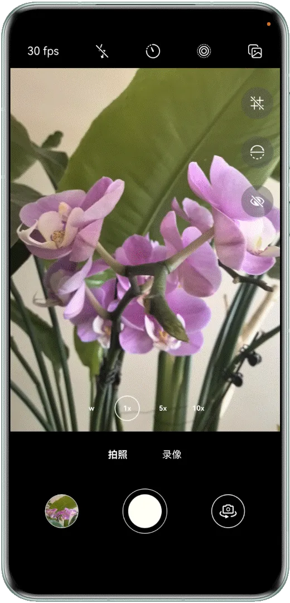


使用[PreviewOutput.getSupportedFrameRates()](https://developer.huawei.com/consumer/cn/doc/harmonyos-references/arkts-apis-camera-previewoutput#getsupportedframerates12)方法获取预览流支持的帧率范围。


```kotlin
1. getSupportedFrameRates(): camera.FrameRateRange[] | undefined {
2.  return this.output?.getSupportedFrameRates();
3. }

```


[PreviewManager.ets](https://gitcode.com/harmonyos_samples/CustomCamera/blob/master/camera/src/main/ets/cameramanagers/PreviewManager.ets#L109-L112)


在帧率切换按钮点击事件的回调函数中，使用[PreviewOutput.setFrameRate()](https://developer.huawei.com/consumer/cn/doc/harmonyos-references/arkts-apis-camera-previewoutput#setframerate12)方法对预览帧率进行动态调整。


```typescript
1. setFrameRate(minFps: number, maxFps: number): void {
2.  try {
3.  this.output?.setFrameRate(minFps, maxFps);
4.  } catch (e) {
5.  Logger.error(TAG_LOG, 'setFrameRate error ' + JSON.stringify(e));
6.  }
7. }

```


[PreviewManager.ets](https://gitcode.com/harmonyos_samples/CustomCamera/blob/master/camera/src/main/ets/cameramanagers/PreviewManager.ets#L116-L123)


## 实现预览进阶功能


### 实现手势缩放

在预览画面进行手势捏合操作，预览画面焦距会随捏合手势进行对应缩放调整。


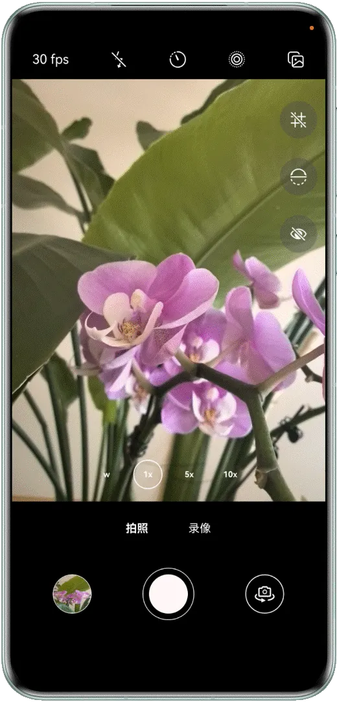


使用[PinchGesture()](https://developer.huawei.com/consumer/cn/doc/harmonyos-references/ts-basic-gestures-pinchgesture)接口给预览区域元素绑定捏合事件。


在捏合手势识别成功onActionStart()事件的回调函数中，记录此次捏合前的焦距。在手势移动过程中onActionUpdate()事件的回调函数中，根据捏合前的焦距以及缩放比例计算出当前的焦距，注意限制在当前相机设备的焦距范围内。


```kotlin
1. XComponent({
2.  type: XComponentType.SURFACE,
3.  controller: this.previewVM.xComponentController
4. })
5. // ...
6.  .gesture(
7.  // Adjust focus with two fingers pinchGesture.
8.  PinchGesture({ fingers: 2 })
9.  .onActionStart(() => {
10.  this.originZoomBeforePinch = this.previewVM.currentZoom;
11.  this.isZoomPinching = true;
12.  this.previewVM.sleepTimer?.refresh();
13.  })
14.  .onActionUpdate((event: GestureEvent) => {
15.  if (this.previewVM.isVideoMode() && this.previewVM.isStabilizationEnabled) {
16.  return;
17.  }
18.  const targetZoom = this.originZoomBeforePinch * event.scale;
19.  this.previewVM.currentZoom = limitNumberInRange(targetZoom, this.previewVM.zoomRange);
20.  this.previewVM.setCameraZoomRatio();
21.  })
22.  .onActionEnd(() => {
23.  this.isZoomPinching = false;
24.  })
25.  )

```


[PreviewScreenView.ets](https://gitcode.com/harmonyos_samples/CustomCamera/blob/master/entry/src/main/ets/views/PreviewScreenView.ets#L137-L180)


### 网格线

将相机预览画面划分为9个等比例区域（3×3宫格），为用户提供精准的构图参考框架。


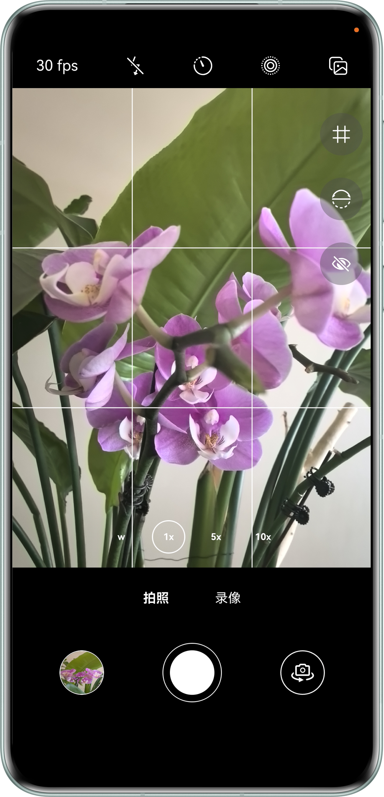


获取预览区域的宽高，通过行数和列数计算出每条网格线的起始坐标，在[Canvas](https://developer.huawei.com/consumer/cn/doc/harmonyos-references/ts-components-canvas-canvas)上进行绘制。注意设置[hitTestBehavior](https://developer.huawei.com/consumer/cn/doc/harmonyos-references/ts-universal-attributes-hit-test-behavior#hittestbehavior)属性为HitTestMode.Transparent，不影响下方预览区域的正常交互。


```kotlin
1. draw(): void {
2.  const ctx = this.context;
3.  ctx.strokeStyle = this.strokeStyle;
4.  ctx.lineWidth = this.lineWidth;
5.  const height = this.context.height;
6.  const width = this.context.width;
7.  // horizontal
8.  for (let i = 1; i < this.cols; i++) {
9.  const x = (width / this.cols) * i;
10.  ctx.beginPath();
11.  ctx.moveTo(x, 0);
12.  ctx.lineTo(x, height);
13.  ctx.stroke();
14.  }
15.  // vertical
16.  for (let i = 1; i < this.rows; i++) {
17.  const y = (height / this.rows) * i;
18.  ctx.beginPath();
19.  ctx.moveTo(0, y);
20.  ctx.lineTo(width, y);
21.  ctx.stroke();
22.  }
23. }
24.
25. build() {
26.  Canvas(this.context)
27.  .width('100%')
28.  .height('100%')
29.  .hitTestBehavior(HitTestMode.Transparent)
30.  .onReady(() => this.draw())
31. }

```


[GridLine.ets](https://gitcode.com/harmonyos_samples/CustomCamera/blob/master/camera/src/main/ets/components/GridLine.ets#L29-L59)


用[Stack](https://developer.huawei.com/consumer/cn/doc/harmonyos-references/ts-container-stack)组件将网格线组件堆叠在预览区域上层。


```scss
1. Stack({
2.  alignContent: Alignment.Center
3. }) {
4.  XComponent({
5.  type: XComponentType.SURFACE,
6.  controller: this.previewVM.xComponentController
7.  })
8.  // ...
9.  if (this.previewVM.isGridLineVisible) {
10.  GridLine();
11.  }
12.  // ...
13.
14.  if (this.isShowBlack) {
15.  Column()
16.  .id('black')
17.  .width('100%')
18.  .height('100%')
19.  .backgroundColor(Color.Black)
20.  .opacity(this.flashBlackOpacity)
21.  }
22. }

```


[PreviewScreenView.ets](https://gitcode.com/harmonyos_samples/CustomCamera/blob/master/entry/src/main/ets/views/PreviewScreenView.ets#L132-L244)


### 水平仪

设备旋转过程中，水平仪指示线始终垂直于重力方向，当设备水平时（[x轴](https://developer.huawei.com/consumer/cn/doc/best-practices/bpta-custom-camera-preview#li1828535618615)或[y轴](https://developer.huawei.com/consumer/cn/doc/best-practices/bpta-custom-camera-preview#li143717461818)垂直于重力方向），水平仪指示线由虚线变为实线。


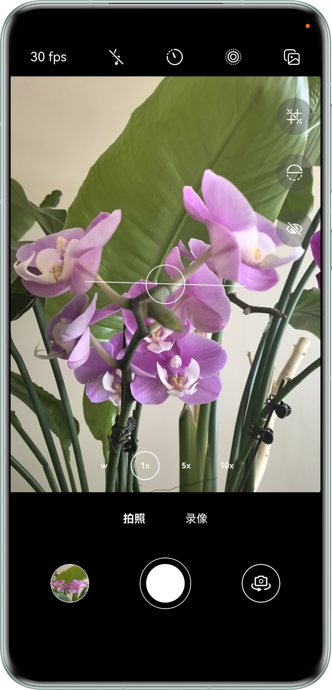


水平仪的实现需要用到重力加速度传感器。通过[sensor](https://developer.huawei.com/consumer/cn/doc/harmonyos-references/js-apis-sensor)模块获取重力加速度在x, y, z轴方向上的分量。以充电口在下的竖屏方向为基准，x, y, z轴的方向如下。


- x轴：水平向右。
- y轴：垂直向上。
- z轴：垂直于屏幕向外。


由下图可知，水平仪指示线与x轴的夹角用θ表示，若要指示线始终垂直重力方向，则tanθ = g(x) / -g(y)。


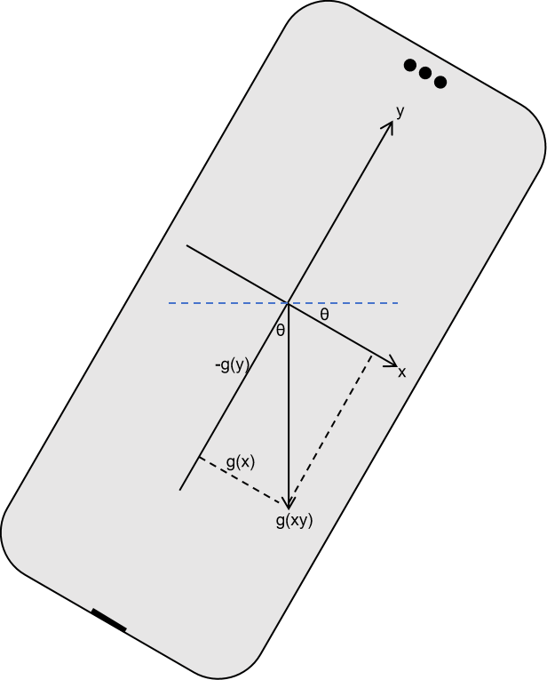


在module.json5中配置加速度传感器权限。


```cangjie
1. "requestPermissions": [
2.  // ...
3.  {
4.  "name": "ohos.permission.ACCELEROMETER",
5.  "reason": "$string:permission_SENSOR",
6.  "usedScene": {
7.  "abilities": [
8.  "EntryAbility"
9.  ]
10.  }
11.  }
12. ]

```


[module.json5](https://gitcode.com/harmonyos_samples/CustomCamera/blob/master/entry/src/main/module.json5#L38-L107)


使用[sensor.on()](https://developer.huawei.com/consumer/cn/doc/harmonyos-references/js-apis-sensor#sensoron)方法订阅重力加速度传感器数据。


```javascript
1. // Add a gravity sensor listener callback function.
2. addGravityEventListener(): void {
3.  try {
4.  sensor.on(sensor.SensorId.GRAVITY, (data) => {
5.  this.previewVM.acc = data;
6.  }, { interval: 100 * 1000 * 1000 }); // 100ms
7.  } catch (exception) {
8.  Logger.error(TAG, `addGravityEventListener failed, code is ${exception.code}, message is ${exception.message}`);
9.  }
10. }

```


[Index.ets](https://gitcode.com/harmonyos_samples/CustomCamera/blob/master/entry/src/main/ets/pages/Index.ets#L73-L83)


计算指示线的旋转角度，以及设备是否水平。设置[hitTestBehavior](https://developer.huawei.com/consumer/cn/doc/harmonyos-references/ts-universal-attributes-hit-test-behavior#hittestbehavior)属性为HitTestMode.Transparent，不影响下层预览区域的正常交互。


```cangjie
1. @Component
2. export struct LevelIndicator {
3.  @Prop acc: sensor.AccelerometerResponse;
4.
5.  getRotate(): number {
6.  let displayDefault: display.Display | null = null;
7.  try {
8.  displayDefault = display.getDefaultDisplaySync();
9.  } catch (exception) {
10.  Logger.error(TAG, `getDefaultDisplaySync failed, code is ${exception.code}, message is ${exception.message}`);
11.  }
12.  const rotation = (displayDefault?.rotation ?? 0) * 90;
13.  if (rotation === 90 || rotation === 270) {
14.  return -Math.atan2(-this.acc.y, this.acc.x) * (180 / Math.PI);
15.  }
16.  return -Math.atan2(-this.acc.x, this.acc.y) * (180 / Math.PI);
17.  }
18.
19.  isAlign(): boolean {
20.  return Math.abs(this.getRotate()) - 0 <= ANGLE_DIFFERENCE ||
21.  Math.abs(Math.abs(this.getRotate()) - 90) <= ANGLE_DIFFERENCE;
22.  }
23.
24.  build() {
25.  Stack({ alignContent: Alignment.Center }) {
26.  Line({
27.  width: 200,
28.  height: 1
29.  })
30.  // ...
31.  .strokeDashArray([3, this.isAlign() ? 0 : 3])
32.  .opacity(this.isAlign() ? 1 : 0.5)
33.  .rotate({ angle: this.getRotate(), centerX: '50%', centerY: '50%' })
34.  .animation({
35.  curve: curves.springMotion(0.6, 0.8),
36.  iterations: 1,
37.  playMode: PlayMode.Normal
38.  })
39.  Circle()
40.  // ...
41.  .opacity(this.isAlign() ? 1 : 0.5)
42.  }
43.  // ...
44.  .hitTestBehavior(HitTestMode.Transparent)
45.  }
46. }

```


[LevelIndicator.ets](https://gitcode.com/harmonyos_samples/CustomCamera/blob/master/camera/src/main/ets/components/LevelIndicator.ets#L27-L84)


### 超时暂停预览

若相机在超过特定时间内未进行任何操作，则会暂停预览并显示遮罩。点击遮罩可重新启动预览，避免相机资源长时间浪费，从而降低功耗。


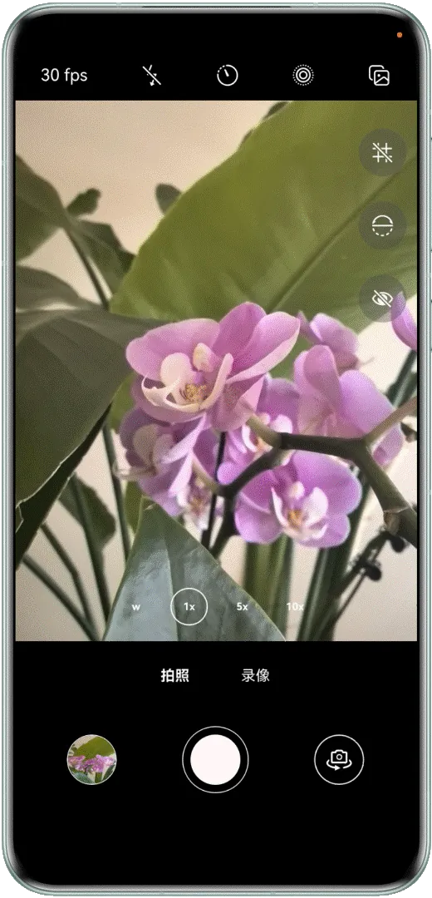


实现带刷新方法的定时器类，初始化时传入计时结束的回调函数。需要重置计时时间，调用refresh()方法实现。


```kotlin
1. class RefreshableTimer {
2.  private timerId?: number;
3.  private readonly timeout: number;
4.  private callback: () => void;
5.  private isActive: boolean = false;
6.
7.  constructor(callback: () => void, timeout: number) {
8.  this.callback = callback;
9.  this.timeout = timeout;
10.  }
11.
12.  start(): void {
13.  clearTimeout(this.timerId);
14.  this.timerId = setTimeout(() => {
15.  this.callback();
16.  this.isActive = false;
17.  }, this.timeout);
18.  this.isActive = true;
19.  }
20.
21.  clear(): void {
22.  clearTimeout(this.timerId);
23.  this.timerId = undefined;
24.  this.isActive = false;
25.  }
26.
27.  refresh(): void {
28.  this.clear();
29.  this.start();
30.  }
31.
32.  isRunning(): boolean {
33.  return this.isActive;
34.  }
35. }

```


[RefreshableTimer.ets](https://gitcode.com/harmonyos_samples/CustomCamera/blob/master/entry/src/main/ets/utils/RefreshableTimer.ets#L17-L51)


预览页面初始化时，启动定时器。使用[UIObserver](https://developer.huawei.com/consumer/cn/doc/harmonyos-references/arkts-apis-uicontext-uicontext#getuiobserver11)监听[willClick()](https://developer.huawei.com/consumer/cn/doc/harmonyos-references/arkts-apis-uicontext-uiobserver#onwillclick12)事件，30s内如果有操作，则重置定时器，直到30s内无任何操作，设置控制遮罩显隐的状态变量isSleeping为true，并释放相机资源。


```kotlin
1. initSleepTimer(): void {
2.  this.previewVM.sleepTimer = new RefreshableTimer(() => {
3.  this.previewVM.openPreviewBlur();
4.  this.previewVM.isSleeping = true;
5.  this.previewVM.cameraManagerRelease();
6.  }, 30 * 1000);
7.  this.previewVM.sleepTimer.start();
8.  const observer = this.getUIContext().getUIObserver();
9.  observer.on('willClick', () => {
10.  this.previewVM.sleepTimer?.refresh();
11.  });
12. }

```


[Index.ets](https://gitcode.com/harmonyos_samples/CustomCamera/blob/master/entry/src/main/ets/pages/Index.ets#L87-L99)


点击遮罩，设置状态变量isSleeping为false并重新启动相机预览。


```kotlin
1. @Builder
2. wakeupMask() {
3.  Column() {
4.  Text($r('app.string.wakeup_text'))
5.  .fontColor(Color.White)
6.  .opacity(0.6)
7.  }
8.  // ...
9.  .onClick(async () => {
10.  this.previewVM.isSleeping = false;
11.  this.previewVM.sleepTimer?.refresh();
12.  await this.previewVM.cameraManagerStart();
13.  this.previewVM.syncButtonSettings();
14.  })
15. }

```


[Index.ets](https://gitcode.com/harmonyos_samples/CustomCamera/blob/master/entry/src/main/ets/pages/Index.ets#L152-L172)


### 前后台切换

当相机应用在退后台之后由于安全策略会被强制断流。当从后台切换至前台时，需要重启相机设备的预览流、拍照流以及相机会话。


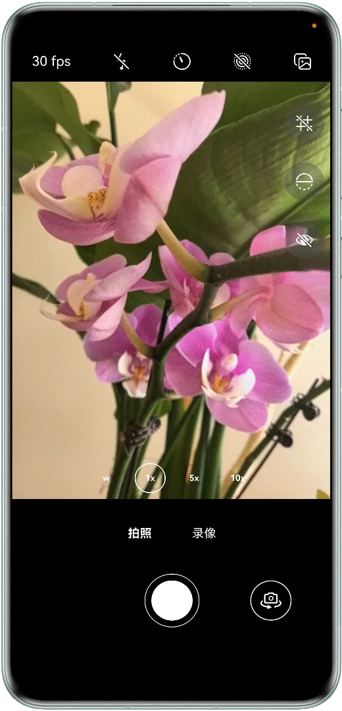


使用[ApplicationContext.on('applicationStateChange')](https://developer.huawei.com/consumer/cn/doc/harmonyos-references/js-apis-inner-application-applicationcontext#applicationcontextonapplicationstatechange10)方法注册对当前应用前后台状态变化的监听。在切换至后台触发的[onApplicationBackground()](https://developer.huawei.com/consumer/cn/doc/harmonyos-references/js-apis-app-ability-applicationstatechangecallback#applicationstatechangecallbackonapplicationbackground)回调函数中释放相机相关资源。在切换至前台触发的[onApplicationForeground()](https://developer.huawei.com/consumer/cn/doc/harmonyos-references/js-apis-app-ability-applicationstatechangecallback#applicationstatechangecallbackonapplicationforeground)回调函数中重新启动相机及预览。


```csharp
1. registerApplicationStateChange(): void {
2.  this.applicationContext.on('applicationStateChange', {
3.  onApplicationForeground: async () => {
4.  await this.previewVM.cameraManagerStart();
5.  // ...
6.  },
7.  onApplicationBackground: () => {
8.  // ...
9.  this.previewVM.cameraManagerRelease();
10.  }
11.  });
12. }

```


[Index.ets](https://gitcode.com/harmonyos_samples/CustomCamera/blob/master/entry/src/main/ets/pages/Index.ets#L103-L118)


### 预览人脸检测

相机拍摄人像时，在预览画面上添加人脸检测框可以辅助对焦和构图。


相机的[元数据](https://developer.huawei.com/consumer/cn/doc/harmonyos-guides/camera-metadata)输出流携带了人脸检测信息，应用可配置元数据输出流并读取检测信息绘制检测框。相较于[基于Core Vision Kit的人脸检测](https://developer.huawei.com/consumer/cn/doc/harmonyos-guides/core-vision-face-detector)能力，元数据输出流在相机预览时返回数据更快，性能更好，具体对比如下：


展开

| 能力 | 人脸检测能力 | 支持的检测数据来源 | 相机预览场景性能 |
| --- | --- | --- | --- |
| 基于相机元数据输出流的人脸检测 | 人脸位置坐标 | 相机预览画面 | 检测结果返回快 |
| 基于Core Vision Kit的人脸检测 | 人脸位置坐标、人脸五官位置、人脸朝向、人脸置信度 | 图像pixelmap | 检测结果返回慢 |


使用元数据输出流实现人脸检测开发步骤如下：


1. 创建相机元数据输出流。
  
  
  

```javascript
1. async createOutput(config: CreateOutputConfig): Promise<camera.CameraOutput | undefined> {
2.  const cameraOutputCap = config.cameraManager?.getSupportedOutputCapability(config.device, config.sceneMode);
3.  if (!cameraOutputCap) {
4.  Logger.error(TAG_LOG, 'Failed to get supported output capability.');
5.  return undefined;
6.  }
7.  let metadataObjectTypes: camera.MetadataObjectType[] = cameraOutputCap!.supportedMetadataObjectTypes;
8.  try {
9.  this.output = config.cameraManager?.createMetadataOutput(metadataObjectTypes);
10.  if (this.output) {
11.  this.addOutputListener(this.output);
12.  }
13.  } catch (error) {
14.  Logger.error(TAG_LOG, `Failed to createMetadataOutput, error code: ${error.code}`);
15.  }
16.  return this.output;
17. }

```
  [MetadataManager.ets](https://gitcode.com/HarmonyOS_Samples/CustomCamera/blob/master/camera/src/main/ets/cameramanagers/MetadataManager.ets#L37-L53)

2. 将元数据输出流添加到会话中。
  
  
  

```typescript
1. for (const outputManager of this.outputManagers) {
2.  if (outputManager.isActive) {
3.  const output = await outputManager.createOutput(config);
4.  session?.addOutput(output);
5.  }
6. }
7. await session?.commitConfig();
8. await session?.start();

```
  [CameraManager.ets](https://gitcode.com/HarmonyOS_Samples/CustomCamera/blob/master/camera/src/main/ets/cameramanagers/CameraManager.ets#L88-L95)

3. 注册[on('metadataObjectsAvailable')](https://developer.huawei.com/consumer/cn/doc/harmonyos-references/arkts-apis-camera-metadataoutput#onmetadataobjectsavailable)回调，监听元数据流中的人脸信息。
  
  
  

```cangjie
1. addMetadataObjectsAvailableListener(metadataOutput: camera.MetadataOutput): void {
2.  metadataOutput.on('metadataObjectsAvailable',
3.  (err: BusinessError, metadataObjectArr: Array<camera.MetadataObject>) => {
4.  if (err && err.code !== 0) {
5.  Logger.error(TAG_LOG, `Metadata output on metadataObjectsAvailable error code: ${err.code}`);
6.  return;
7.  }
8.  let boxRectArr: camera.Rect[] = [];
9.  metadataObjectArr.forEach((obj: camera.MetadataObject)=>{
10.  boxRectArr.push(obj.boundingBox);
11.  });
12.  this.onMetadataObjectsAvailable(boxRectArr);
13.  });
14. }

```
  [MetadataManager.ets](https://gitcode.com/HarmonyOS_Samples/CustomCamera/blob/master/camera/src/main/ets/cameramanagers/MetadataManager.ets#L62-L75)

4. 通过回调接口返回的归一化数据，计算检测框实际坐标。
  
  
  说明

  - 接口返回的坐标数据以预览画面左上角为原点，具体可参考[实现点击对焦](https://developer.huawei.com/consumer/cn/doc/best-practices/bpta-custom-camera-preview#section2356188242)章节中的页面布局坐标系。
  - 元数据输出流最多返回10个人脸检测框信息。

  
  
  

```typescript
1. // Face detection information listener callback.
2. onMetadataObjectsAvailable(faceBoxArr: camera.Rect[]) {
3.  faceBoxArr.forEach((value) => {
4.  // Convert normalized coordinates to actual coordinates.
5.  value.topLeftX *= this.previewVM.getPreviewWidth();
6.  value.topLeftY *= this.previewVM.getPreviewHeight();
7.  value.width *= this.previewVM.getPreviewWidth();
8.  value.height *= this.previewVM.getPreviewHeight();
9.  })
10.  this.previewVM.faceBoundingBoxArr = faceBoxArr;
11. }

```
  [Index.ets](https://gitcode.com/HarmonyOS_Samples/CustomCamera/blob/master/entry/src/main/ets/pages/Index.ets#L145-L155)

5. 计算检测框各边的起点和终点位置坐标。
  
  
  

```cangjie
1. // Calculate the coordinates of the face detection box.
2. export function calFaceBoxLinePoint(faceBoxRect: camera.Rect): LinePoint[] {
3.  // The length of the sides of the box.
4.  let lineLength: number = Math.min(faceBoxRect.width, faceBoxRect.height) * FACE_BOX_LINE_RATIO;
5.  let linePoints: LinePoint[] = [];
6.
7.  // The coordinates of the four vertices of the detection box.
8.  let startPoints: camera.Point[] = [
9.  { x: faceBoxRect.topLeftX, y: faceBoxRect.topLeftY },
10.  { x: faceBoxRect.topLeftX + faceBoxRect.width, y: faceBoxRect.topLeftY },
11.  { x: faceBoxRect.topLeftX, y: faceBoxRect.topLeftY + faceBoxRect.height },
12.  { x: faceBoxRect.topLeftX + faceBoxRect.width, y: faceBoxRect.topLeftY + faceBoxRect.height }];
13.
14.  // Calculate the relative coordinates of each edge.
15.  startPoints.forEach((startPoint: camera.Point) => {
16.  let horizontalLine: LinePoint = {
17.  start: startPoint,
18.  increment: { x: startPoint.x > faceBoxRect.topLeftX ? -lineLength : lineLength, y: 0 }
19.  };
20.
21.  let verticalLine: LinePoint = {
22.  start: startPoint,
23.  increment: { x: 0, y: startPoint.y > faceBoxRect.topLeftY ? -lineLength : lineLength }
24.  };
25.
26.  linePoints.push(horizontalLine, verticalLine);
27.  });
28.  return linePoints;
29. }

```
  [CommonUtil.ets](https://gitcode.com/HarmonyOS_Samples/CustomCamera/blob/master/entry/src/main/ets/utils/CommonUtil.ets#L90-L118)

6. 使用[Line](https://developer.huawei.com/consumer/cn/doc/harmonyos-references/ts-drawing-components-line)组件，将人脸检测框绘制到预览画面中。
  
  
  

```cangjie
1. @Builder
2. // Face detection box component.
3. faceBox(faceBoxRect: camera.Rect) {
4.  ForEach(calFaceBoxLinePoint(faceBoxRect), (linePoint: LinePoint) => {
5.  Line()
6.  .startPoint([0, 0])
7.  .endPoint([linePoint.increment.x, linePoint.increment.y])
8.  .stroke(Color.White)
9.  .position({ x: linePoint.start.x, y: linePoint.start.y })
10.  }, (linePoint: LinePoint) => JSON.stringify(linePoint));
11. }

```
  [PreviewScreenView.ets](https://gitcode.com/HarmonyOS_Samples/CustomCamera/blob/master/entry/src/main/ets/views/PreviewScreenView.ets#L116-L127)


## 获取预览帧数据


### 场景描述

在开发相机应用时，如果预览流仅用于展示，通常使用[XComponent](https://developer.huawei.com/consumer/cn/doc/harmonyos-references/ts-basic-components-xcomponent)组件实现。若需要获取每帧的图像做二次处理（例如二维码识别或人脸识别等场景），则需要通过[ImageReceiver](https://developer.huawei.com/consumer/cn/doc/harmonyos-references/arkts-apis-image-imagereceiver)监听预览流每帧数据，并创建第二路预览流，也称为双路预览。


### 实现原理

**关键技术**


- [ImageReceiver](https://developer.huawei.com/consumer/cn/doc/harmonyos-references/arkts-apis-image-imagereceiver)用于创建Surface接收每帧的图像数据。
- 通过[ImageReceiver](https://developer.huawei.com/consumer/cn/doc/harmonyos-references/arkts-apis-image-imagereceiver)中的imageArrival事件监听预览流每帧数据，解析图像内容。


- 判断图像宽度width与stride是否一致，不一致则进行裁剪（stride指图像的一行数据在内存中实际占用的字节数，为了内存对齐和提高读取效率的要求，通常大于图像的宽度）。可参考[相机预览花屏解决方案](https://developer.huawei.com/consumer/cn/doc/best-practices/bpta-deal-stride-solution)。
- 屏幕处于不同的显示方向时，原始图像数据需旋转不同的角度，以确保图像在合适的方向显示。需考虑屏幕旋转角度、相机镜头安装角度，框架具体的实现机制可参考[屏幕旋转角度](https://developer.huawei.com/consumer/cn/doc/harmonyos-guides/camera-rotation-term#%E5%B1%8F%E5%B9%95%E6%97%8B%E8%BD%AC%E8%A7%92%E5%BA%A6)。在实际开发中，推荐通过[PreviewOutput.getPreviewRotation()](https://developer.huawei.com/consumer/cn/doc/harmonyos-references/arkts-apis-camera-previewoutput#getpreviewrotation12)方法直接获取旋转角度。
- 对于前置镜头，还需要根据业务需求将数据进行水平镜像翻转，以模拟镜像效果。


**开发流程**


1. 创建ImageReceiver。
2. 获取SurfaceId。
3. 创建第二路预览输出流PreviewOutput。
4. 添加到Session。
5. 监听帧到达事件。
6. 处理并释放帧数据。


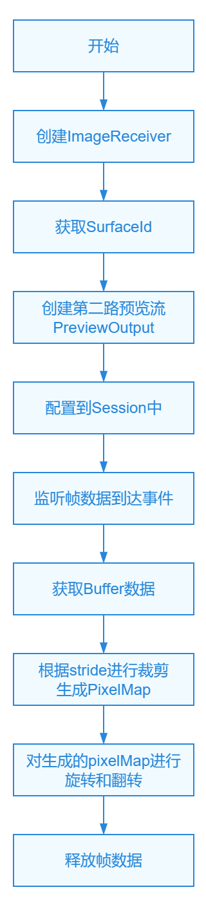


### 开发步骤

1. 创建[ImageReceiver](https://developer.huawei.com/consumer/cn/doc/harmonyos-references/arkts-apis-image-imagereceiver)组件并获取surfaceId。
  
  
  

```csharp
1. async init(size: Size, format = image.ImageFormat.JPEG, capacity = 8): Promise<string> {
2.  const receiver = image.createImageReceiver(size, format, capacity);
3.  const surfaceId = await receiver.getReceivingSurfaceId();
4.  this.onImageArrival(receiver);
5.  return surfaceId;
6. }

```
  [ImageReceiverManager.ets](https://gitcode.com/harmonyos_samples/CustomCamera/blob/master/camera/src/main/ets/cameramanagers/ImageReceiverManager.ets#L75-L81)

2. 创建预览流并配置到相机会话Session中与实现基础预览一致。参考[创建预览输出流。](https://developer.huawei.com/consumer/cn/doc/best-practices/bpta-custom-camera-preview#li24730464385)
3. 使用[ImageReceiver.on()](https://developer.huawei.com/consumer/cn/doc/harmonyos-references/arkts-apis-image-imagereceiver#on9)方法，注册imageArrival事件接收图像数据。使用[ImageReceiver.read()](https://developer.huawei.com/consumer/cn/doc/harmonyos-references/arkts-apis-image-imagereceiver#readnextimage9-1)方法和[image.getComponent()](https://developer.huawei.com/consumer/cn/doc/harmonyos-references/arkts-apis-image-image#getcomponent9-1)方法解析获取图像的Buffer。
  
  
  

```cangjie
1. onImageArrival(receiver: image.ImageReceiver): void {
2.  receiver.on('imageArrival', () => {
3.  Logger.info(TAG, 'image arrival');
4.  receiver.readNextImage((err: BusinessError, nextImage: image.Image) => {
5.  if (err || nextImage === undefined) {
6.  nextImage?.release();
7.  Logger.error(TAG, 'readNextImage failed');
8.  return;
9.  }
10.  nextImage.getComponent(image.ComponentType.JPEG, async (err: BusinessError, imgComponent: image.Component) => {
11.  if (err || imgComponent === undefined) {
12.  Logger.error(TAG, 'getComponent failed');
13.  }
14.  if (imgComponent.byteBuffer) {
15.  // ...
16.  } else {
17.  Logger.error(TAG, 'byteBuffer is null');
18.  }
19.  // ...
20.  });
21.  });
22.  });
23. }

```
  [ImageReceiverManager.ets](https://gitcode.com/harmonyos_samples/CustomCamera/blob/master/camera/src/main/ets/cameramanagers/ImageReceiverManager.ets#L108-L168)

4. 根据stride和图像宽高对Buffer数据进行裁剪。使用[image.createPixelMap()](https://developer.huawei.com/consumer/cn/doc/harmonyos-references/arkts-apis-image-f#imagecreatepixelmap8)方法创建pixelMap数据。
  
  
  说明
      注意在使用createPixelMap()方法处理Buffer数据时，传入的Buffer数据的像素格式[(srcPixelFormat: PixelMapFormat)](https://developer.huawei.com/consumer/cn/doc/harmonyos-references/arkts-apis-image-e#pixelmapformat7)要与获取预览输出流能力Profile中的[(format: CameraFormat)](https://developer.huawei.com/consumer/cn/doc/harmonyos-references/arkts-apis-camera-e#cameraformat)输出格式保持一致，防止出现图像数据显示异常。format格式之间的映射关系可参考[双路预览](https://developer.huawei.com/consumer/cn/doc/harmonyos-guides/camera-dual-channel-preview#%E7%94%A8%E4%BA%8E%E5%A4%84%E7%90%86%E5%9B%BE%E5%83%8F%E7%9A%84%E7%AC%AC%E4%B8%80%E8%B7%AF%E9%A2%84%E8%A7%88%E6%B5%81)。


  
  
  

```cangjie
1. async getPixelMap(imgComponent: image.Component, width: number, height: number,
2.  stride: number): Promise<image.PixelMap> {
3.  if (stride === width) {
4.  return await image.createPixelMap(imgComponent.byteBuffer, {
5.  size: { height: height, width: width },
6.  srcPixelFormat: image.PixelMapFormat.NV21,
7.  });
8.  }
9.  const dstBufferSize = width * height * 1.5;
10.  const dstArr = new Uint8Array(dstBufferSize);
11.  for (let j = 0; j < height * 1.5; j++) {
12.  const srcBuf = new Uint8Array(imgComponent.byteBuffer, j * stride, width);
13.  dstArr.set(srcBuf, j * width);
14.  }
15.  return await image.createPixelMap(dstArr.buffer, {
16.  size: { height: height, width: width },
17.  srcPixelFormat: image.PixelMapFormat.NV21,
18.  });
19. }

```
  [ImageReceiverManager.ets](https://gitcode.com/harmonyos_samples/CustomCamera/blob/master/camera/src/main/ets/cameramanagers/ImageReceiverManager.ets#L85-L104)

5. 使用[PreviewOutput.getPreviewRotation()](https://developer.huawei.com/consumer/cn/doc/harmonyos-references/arkts-apis-camera-previewoutput#getpreviewrotation12)获取图像旋转角度，使用[PixelMap.rotate()](https://developer.huawei.com/consumer/cn/doc/harmonyos-references/arkts-apis-image-pixelmap#rotate9-1)方法对图像数据进行旋转。在使用前置镜头时，存在水平镜像和垂直镜像的差异，为了统一翻转逻辑，在屏幕旋转角度为90度或270度时，需额外旋转180度将图像转正，使用[PixelMap.flip()](https://developer.huawei.com/consumer/cn/doc/harmonyos-references/arkts-apis-image-pixelmap#flip9-1)方法将图像数据进行水平翻转，以达到镜像效果。参考[应用自绘制预览角度处理](https://developer.huawei.com/consumer/cn/doc/harmonyos-guides/camera-rotation-term#%E5%BA%94%E7%94%A8%E8%87%AA%E7%BB%98%E5%88%B6%E9%A2%84%E8%A7%88%E8%A7%92%E5%BA%A6%E5%A4%84%E7%90%86)。
  
  
  

```javascript
1. nextImage.getComponent(image.ComponentType.JPEG, async (err: BusinessError, imgComponent: image.Component) => {
2.  if (err || imgComponent === undefined) {
3.  Logger.error(TAG, 'getComponent failed');
4.  }
5.  if (imgComponent.byteBuffer) {
6.  const width = nextImage.size.width;
7.  const height = nextImage.size.height;
8.  const stride = imgComponent.rowStride;
9.  Logger.info(TAG, `getComponent with width:${width} height:${height} stride:${stride}`);
10.  const pixelMap = await this.getPixelMap(imgComponent, width, height, stride);
11.  let displayDefault: display.Display | null = null;
12.  try {
13.  displayDefault = display.getDefaultDisplaySync();
14.  const displayRotation = (displayDefault?.rotation ?? 0) * camera.ImageRotation.ROTATION_90;
15.  const rotation = this.output?.getPreviewRotation(displayRotation) || 0;
16.  if (this.position === camera.CameraPosition.CAMERA_POSITION_FRONT) {
17.  if (displayRotation === 90 || displayRotation === 270) {
18.  await pixelMap.rotate((rotation + 180) % 360);
19.  } else {
20.  await pixelMap.rotate(rotation);
21.  }
22.  await pixelMap.flip(true, false);
23.  } else {
24.  await pixelMap.rotate(rotation);
25.  }
26.  this.callback(pixelMap);
27.  } catch (exception) {
28.  Logger.error(TAG,
29.  `getDefaultDisplaySync failed, code is ${exception.code}, message is ${exception.message}`);
30.  }
31.  } else {
32.  Logger.error(TAG, 'byteBuffer is null');
33.  }
34.  // ...
35. });

```
  [ImageReceiverManager.ets](https://gitcode.com/harmonyos_samples/CustomCamera/blob/master/camera/src/main/ets/cameramanagers/ImageReceiverManager.ets#L119-L163)

6. 对[ImageReceiver](https://developer.huawei.com/consumer/cn/doc/harmonyos-references/arkts-apis-image-imagereceiver)组件获取到的图像数据处理后，需要将对应的图像Buffer释放，以确保Surface的BufferQueue正常轮转，防止出现缓冲区溢出等问题。如果对Buffer进行异步操作，则需要在异步操作结束后，确保当前Buffer没有使用的情况下再释放该资源。
  
  
  

```cangjie
1. nextImage.getComponent(image.ComponentType.JPEG, async (err: BusinessError, imgComponent: image.Component) => {
2.  // ...
3.  nextImage.release();
4.  Logger.info(TAG, 'image process done');
5. });

```
  [ImageReceiverManager.ets](https://gitcode.com/harmonyos_samples/CustomCamera/blob/master/camera/src/main/ets/cameramanagers/ImageReceiverManager.ets#L118-L162)


## 示例代码

- [实现自定义相机功能](https://gitcode.com/harmonyos_samples/CustomCamera)
