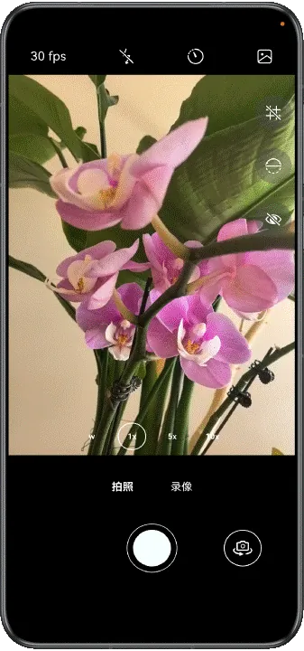
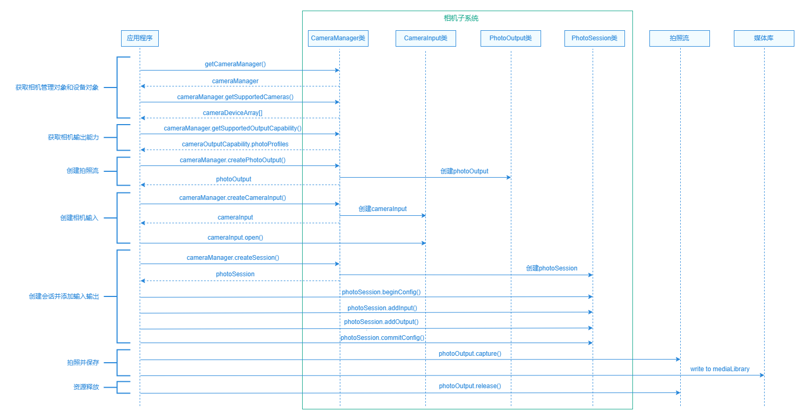
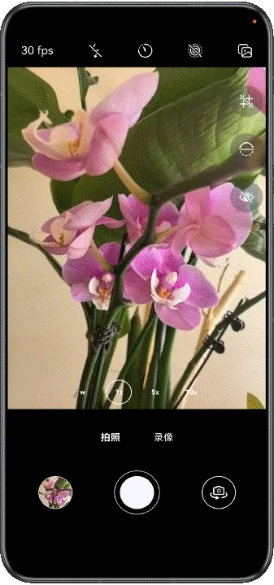
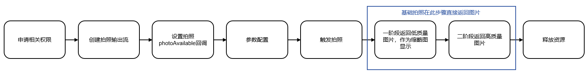
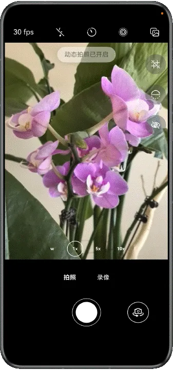

# 自定义相机拍照

---

## 概述


拍照是相机的最重要功能之一，拍照模块依托于相机复杂的逻辑，为确保用户拍摄的照片质量，提供了对分辨率、闪光灯、焦距、照片质量及旋转角度等设置的调整选项。本文将以自定义相机为例，分别介绍基础拍照、参数配置、分段式拍照、HDR Vivid拍照、动图拍摄以及使用音量键拍照等功能。通过多样化的拍摄方式，可以更好地满足用户的个性化需求。


其中，分段式拍照、HDR Vivid拍照和动图拍摄，分别从效率、画质和内容三大核心方面对自定义相机进行了优化。用户可根据实际需求，在追求快速反馈、细节保留或动态记录时，灵活选择单一或多种功能组合使用，最大限度满足个性化拍摄场景，全面提升拍照体验。


## 基础拍照


### 场景描述

基础拍照功能是自定义相机应用的重要功能，用户在切换到拍照模式后可实时预览取景画面，并通过快门按钮快速拍摄照片，此外用户还可以设置不同的拍照参数，应用会将拍到的画面保存为图片。





### 开发步骤





详细的API说明请参考[@ohos.multimedia.camera (相机管理)](https://developer.huawei.com/consumer/cn/doc/harmonyos-references/js-apis-camera)。


1. 申请相关权限     在开发相机应用时，需要先参考[申请相机开发的权限](https://developer.huawei.com/consumer/cn/doc/harmonyos-guides/camera-preparation)。

2. 创建拍照输出流     通过[CameraOutputCapability](https://developer.huawei.com/consumer/cn/doc/harmonyos-references/arkts-apis-camera-i#cameraoutputcapability)类中的photoProfiles属性，能够获取设备当前支持的拍照输出流配置，根据业务场景选择合适的输出流配置。最终，可通过调用[createPhotoOutput()](https://developer.huawei.com/consumer/cn/doc/harmonyos-references/arkts-apis-camera-cameramanager#createphotooutput11)方法，并传入选定的输出流配置，完成拍照输出流的创建。


  
  
  说明
      在profile的选择时需要注意：


  - 必须确保宽高比与预览的[Surface](https://developer.huawei.com/consumer/cn/doc/best-practices/bpta-custom-camera-preview#section2032234892514)的宽高比一致，避免画面失真或裁剪，在此前提下根据业务需求和设备性能选择合适的分辨率大小即可。建议分辨率在1280×720 到 3840×2160之间，分辨率过低可能导致画面模糊，分辨率过高则可能带来资源浪费、功耗增加和内存占用过高等问题。
  - 在处理拍照获取的buffer数据时，应确保相机格式与所选目标的[Camera_Format](https://developer.huawei.com/consumer/cn/doc/harmonyos-references/capi-camera-h#camera_format)严格一致，以避免因为格式不匹配而导致的画面异常。


  
  
  

```cangjie
1. // Create photo output
2. public createPhotoOutput(cameraManager: camera.CameraManager | undefined, cameraDevice: camera.CameraDevice,
3.  profile: camera.Profile): camera.PhotoOutput | undefined {
4.  let cameraPhotoOutput: camera.PhotoOutput | undefined;
5.  const cameraOutputCapability =
6.  cameraManager?.getSupportedOutputCapability(cameraDevice, camera.SceneMode.NORMAL_PHOTO);
7.  let photoProfilesArray: camera.Profile[] | undefined = cameraOutputCapability?.photoProfiles;
8.  if (photoProfilesArray?.length) {
9.  try {
10.  const displayRatio = profile.size.width / profile.size.height;
11.  const profileWidth = profile.size.width;
12.  const photoProfile = photoProfilesArray
13.  .sort((a, b) => Math.abs(a.size.width - profileWidth) - Math.abs(b.size.width - profileWidth))
14.  .find(pf => {
15.  const pfDisplayRatio = pf.size.width / pf.size.height;
16.  return Math.abs(pfDisplayRatio - displayRatio) <= CameraConstant.PROFILE_DIFFERENCE &&
17.  pf.format === camera.CameraFormat.CAMERA_FORMAT_JPEG;
18.  });
19.  if (!photoProfile) {
20.  Logger.error(TAG_LOG, 'Failed to get photo profile');
21.  return undefined;
22.  }
23.  cameraPhotoOutput = cameraManager?.createPhotoOutput(photoProfile);
24.  } catch (error) {
25.  Logger.error(TAG_LOG, `Failed to createPhotoOutput. Error: ${JSON.stringify(error)}`);
26.  }
27.  }
28.  this.output = cameraPhotoOutput;
29.  return cameraPhotoOutput;
30. }


```
  [PhotoManager.ets](https://gitcode.com/harmonyos_samples/CustomCamera/blob/master/camera/src/main/ets/cameramanagers/PhotoManager.ets#L67-L97)

3. 设置拍照photoAvailable回调
  注册全质量图上报监听后，触发拍照操作即可通过回调接收图片数据。具体实现时，需通过[on('photoAvailable')](https://developer.huawei.com/consumer/cn/doc/harmonyos-references/arkts-apis-camera-photooutput#onphotoavailable11)接口监听buffer获取事件。完成回调设置后，调用photoOutput的capture()方法触发拍摄，此时拍照生成的buffer将回传至注册的回调中。
  
  
  说明
      buffer处理完成后需及时释放资源，若未正确释放可能导致后续拍摄无法获取。


  
  
  

```cangjie
1. // Set photo callback single
2. setPhotoOutputCbSingle(photoOutput: camera.PhotoOutput, context: Context): void {
3.  photoOutput.on('photoAvailable', (errCode: BusinessError, photo: camera.Photo): void => {
4.  if (errCode || photo === undefined) {
5.  Logger.error(TAG_LOG, 'getPhoto failed');
6.  return;
7.  }
8.  this.mediaLibSavePhotoSingle(context, photo.main);
9.  });
10. }


```
  [PhotoManager.ets](https://gitcode.com/harmonyos_samples/CustomCamera/blob/master/camera/src/main/ets/cameramanagers/PhotoManager.ets#L160-L170)
     通过相册管理模块photoAccessHelper将其保存至媒体库。


  
  
  

```cangjie
1. // Save photo single
2. mediaLibSavePhotoSingle(context: Context, imageObj: image.Image): void {
3.  imageObj.getComponent(image.ComponentType.JPEG, async (errCode: BusinessError, component: image.Component) => {
4.  if (errCode || component === undefined) {
5.  Logger.error(TAG_LOG, 'getComponent failed');
6.  return;
7.  }
8.  const buffer: ArrayBuffer = component.byteBuffer;
9.  if (!buffer) {
10.  Logger.error(TAG_LOG, 'byteBuffer is null');
11.  return;
12.  }
13.  let photoType: photoAccessHelper.PhotoType = photoAccessHelper.PhotoType.IMAGE;
14.  let extension: string = 'jpg';
15.  let options: photoAccessHelper.CreateOptions = {
16.  title: 'testPhoto'
17.  };
18.  try {
19.  let assetChangeRequest: photoAccessHelper.MediaAssetChangeRequest =
20.  photoAccessHelper.MediaAssetChangeRequest.createAssetRequest(context, photoType, extension, options);
21.  assetChangeRequest.addResource(photoAccessHelper.ResourceType.IMAGE_RESOURCE, buffer);
22.  assetChangeRequest.saveCameraPhoto();
23.  let accessHelper: photoAccessHelper.PhotoAccessHelper =
24.  photoAccessHelper.getPhotoAccessHelper(context);
25.  await accessHelper.applyChanges(assetChangeRequest).catch((err: BusinessError) => {
26.  Logger.error(TAG_LOG, `applyChanges failed, code is ${err.code}, message is ${err.message}`);
27.  });
28.  let imageSource = image.createImageSource(buffer);
29.  let pixelmap = imageSource.createPixelMapSync();
30.  this.callback(pixelmap, assetChangeRequest.getAsset().uri);
31.  accessHelper.release().catch((err: BusinessError) => {
32.  Logger.error(TAG_LOG, `accessHelper.release failed, code is ${err.code}, message is ${err.message}`);
33.  });
34.  imageObj.release();
35.  } catch (exception) {
36.  Logger.error(TAG_LOG,
37.  `mediaLibSavePhotoSingle failed, code is ${exception.code}, message is ${exception.message}`);
38.  }
39.  });
40. }


```
  [PhotoManager.ets](https://gitcode.com/harmonyos_samples/CustomCamera/blob/master/camera/src/main/ets/cameramanagers/PhotoManager.ets#L174-L214)

4. 参数配置     通过配置相机参数可调节闪光灯、变焦、焦距等拍照功能。相关功能的实现主要依托[Interface (PhotoSession)](https://developer.huawei.com/consumer/cn/doc/harmonyos-references/arkts-apis-camera-photosession)（普通拍照模式会话类）的接口方法完成。


  1. 设置闪光灯：[设置闪光灯](https://developer.huawei.com/consumer/cn/doc/best-practices/bpta-custom-camera-preview#section9696119411)。

  2. 设置对焦模式：[实现点击对焦](https://developer.huawei.com/consumer/cn/doc/best-practices/bpta-custom-camera-preview#section2356188242)。

  3. 设置焦点：[实现点击对焦](https://developer.huawei.com/consumer/cn/doc/best-practices/bpta-custom-camera-preview#section2356188242)。

  4. 设置变焦比：[设置相机焦距](https://developer.huawei.com/consumer/cn/doc/best-practices/bpta-custom-camera-preview#section1860863113213)。

  5. 设置拍照旋转角度         拍照的旋转角度与重力方向（即设备旋转角度）相关。调用[PhotoOutput](https://developer.huawei.com/consumer/cn/doc/harmonyos-references/arkts-apis-camera-photooutput)类中的[getPhotoRotation()](https://developer.huawei.com/consumer/cn/doc/harmonyos-references/arkts-apis-camera-photooutput#getphotorotation12)可以获取到拍照的旋转角度。详细请参见[拍照](https://developer.huawei.com/consumer/cn/doc/harmonyos-guides/camera-rotation-angle-adaptation#%E6%8B%8D%E7%85%A7)。

         deviceDegree：设备旋转角度。获取方式请见[计算设备旋转角度](https://developer.huawei.com/consumer/cn/doc/harmonyos-guides/camera-rotation-angle-adaptation#%E8%AE%A1%E7%AE%97%E8%AE%BE%E5%A4%87%E6%97%8B%E8%BD%AC%E8%A7%92%E5%BA%A6)。


  
  
  

```cangjie
1. // Get photo rotation
2. getPhotoRotation(photoOutput: camera.PhotoOutput, deviceDegree: number): camera.ImageRotation {
3.  let photoRotation: camera.ImageRotation = camera.ImageRotation.ROTATION_0;
4.  try {
5.  photoRotation = photoOutput.getPhotoRotation(deviceDegree);
6.  } catch (error) {
7.  Logger.error(TAG_LOG, `The photoOutput.getPhotoRotation call failed. Error code: ${error.code}`);
8.  }
9.  return photoRotation;
10. }


```
    [PhotoManager.ets](https://gitcode.com/harmonyos_samples/CustomCamera/blob/master/camera/src/main/ets/cameramanagers/PhotoManager.ets#L343-L353)

5. 触发拍照     通过photoOutput类的capture()方法，执行拍照任务。

     可以通过参数调整拍照的设置，例如调整拍照质量、拍照旋转角度、位置信息以及是否开启镜像等。


  
  
  

```typescript
1. // Capture photo
2. public async capture(isFront: boolean): Promise<void> {
3.  if (!this.output) {
4.  Logger.error(TAG_LOG, 'Failed to capture the photo due to photo output undefined');
5.  return;
6.  }
7.  const degree = await this.getPhotoDegree();
8.  const rotation = this.getPhotoRotation(this.output, degree);
9.  let settings: camera.PhotoCaptureSetting = {
10.  quality: camera.QualityLevel.QUALITY_LEVEL_HIGH,
11.  rotation,
12.  mirror: isFront
13.  };
14.  this.output.capture(settings, (err: BusinessError) => {
15.  if (err) {
16.  Logger.error(TAG_LOG, `Failed to capture the photo. error: ${JSON.stringify(err)}`);
17.  return;
18.  }
19.  Logger.info(TAG_LOG, 'Callback invoked to indicate the photo capture request success.');
20.  });
21. }


```
  [PhotoManager.ets](https://gitcode.com/harmonyos_samples/CustomCamera/blob/master/camera/src/main/ets/cameramanagers/PhotoManager.ets#L357-L378)

6. 释放资源     调用CameraOutput类的[release()](https://developer.huawei.com/consumer/cn/doc/harmonyos-references/arkts-apis-camera-cameraoutput#release)方法，释放输出资源。


  
  
  

```javascript
1. // Release photo
2. async release(): Promise<void> {
3.  if (this.isSingle) {
4.  this.output?.off('photoAvailable');
5.  } else {
6.  this.output?.off('photoAssetAvailable');
7.  }
8.  try {
9.  await this.output?.release();
10.  } catch (exception) {
11.  Logger.error(TAG_LOG, `release failed, code is ${exception.code}, message is ${exception.message}`);
12.  }
13.  this.output = undefined;
14. }


```
  [PhotoManager.ets](https://gitcode.com/harmonyos_samples/CustomCamera/blob/master/camera/src/main/ets/cameramanagers/PhotoManager.ets#L446-L460)


## 分段式拍照


### 场景描述

分段式拍照是一项能够显著提升用户体验的功能。应用程序可在第一阶段以较快速度获取预览级或经过初步处理的图片，优先展示给用户，从而有效减少等待时间，优化交互体验。随后，在后台或系统空闲时，再补充上传全质量照片，以满足后续处理或长期存档的需求。





分段式拍照是指在应用下发拍照任务后，系统按阶段上报不同质量的图片。在一阶段，系统快速上报低质量图，应用通过[on('photoAssetAvailable')](https://developer.huawei.com/consumer/cn/doc/harmonyos-references/arkts-apis-camera-photooutput#onphotoassetavailable12)接口会收到一个PhotoAsset对象，通过该对象可调用媒体库接口，读取图片或落盘图片。在二阶段，分段式子服务会根据系统压力以及定制化场景进行调度，将后处理好的原图回传给媒体库，替换低质量图。设置拍照photoAssetAvailable的回调来获取photoAsset。





```typescript
1. // Save camera photo
2. async mediaLibSavePhoto(photoAsset: photoAccessHelper.PhotoAsset,
3.  phAccessHelper: photoAccessHelper.PhotoAccessHelper): Promise<void> {
4.  try {
5.  let assetChangeRequest: photoAccessHelper.MediaAssetChangeRequest =
6.  new photoAccessHelper.MediaAssetChangeRequest(photoAsset);
7.  assetChangeRequest.saveCameraPhoto();
8.  await phAccessHelper.applyChanges(assetChangeRequest).catch((err: BusinessError) => {
9.  Logger.error(TAG_LOG, `applyChanges failed, code is ${err.code}, message is ${err.message}`);
10.  });
11.  phAccessHelper.release().catch((err: BusinessError) => {
12.  Logger.error(TAG_LOG, `phAccessHelper.release failed, code is ${err.code}, message is ${err.message}`);
13.  });
14.  } catch (error) {
15.  Logger.error(TAG_LOG, `apply saveCameraPhoto failed with error: ${error.code}, ${error.message}`);
16.  }
17. }
18.
19. async mediaLibRequestBuffer(photoAsset: photoAccessHelper.PhotoAsset, context: Context,
20.  callback: (pixelMap: image.PixelMap, url: string) => void): Promise<void> {
21.  class MediaDataHandler implements photoAccessHelper.MediaAssetDataHandler<ArrayBuffer> {
22.  onDataPrepared(data: ArrayBuffer): void {
23.  if (data === undefined) {
24.  Logger.error(TAG_LOG, 'Error occurred when preparing data');
25.  return;
26.  }
27.  let imageSource = image.createImageSource(data);
28.  imageSource.createPixelMap().then((pixelMap: image.PixelMap) => {
29.  callback(pixelMap, photoAsset.uri);
30.  }).catch((err: BusinessError) => {
31.  Logger.error(TAG_LOG, `createPixelMap err:${err.code}`);
32.  });
33.  }
34.  }
35.
36.  let requestOptions: photoAccessHelper.RequestOptions = {
37.  deliveryMode: photoAccessHelper.DeliveryMode.FAST_MODE,
38.  };
39.  const handler = new MediaDataHandler();
40.  try {
41.  await photoAccessHelper.MediaAssetManager.requestImageData(context, photoAsset, requestOptions, handler);
42.  } catch (exception) {
43.  Logger.error(TAG_LOG, `requestImageData failed, code is ${exception.code}, message is ${exception.message}`);
44.  }
45. }
46.
47. public setPhotoOutputCbDouble(cameraPhotoOutput: camera.PhotoOutput): void {
48.  cameraPhotoOutput.on('photoAssetAvailable',
49.  async (_err: BusinessError, photoAsset: photoAccessHelper.PhotoAsset): Promise<void> => {
50.  let accessHelper: photoAccessHelper.PhotoAccessHelper =
51.  photoAccessHelper.getPhotoAccessHelper(this.context);
52.  this.mediaLibSavePhoto(photoAsset, accessHelper);
53.  this.mediaLibRequestBuffer(photoAsset, this.context, this.callback);
54.  });
55. }

```


[PhotoManager.ets](https://gitcode.com/harmonyos_samples/CustomCamera/blob/master/camera/src/main/ets/cameramanagers/PhotoManager.ets#L101-L156)


## HDR Vivid相机拍照


HDR Vivid是UWA认证的动态HDR视频标准，能够拍摄出层次更丰富、光影细节更鲜明的画面，显著提升画面质感。应用仅需接入媒体领域提供的API，即可集成HarmonyOS的HDR Vivid图片采集、转码和解码显示功能。与基础拍照相比，HDR拍照在提交会话配置前需调用[setColorSpace()](https://developer.huawei.com/consumer/cn/doc/harmonyos-references/arkts-apis-camera-colormanagement#setcolorspace12)方法进行色彩空间设置，而基础拍照则无需此步骤。详细请参见[HDR Vivid相机拍照(ArkTS)](https://developer.huawei.com/consumer/cn/doc/harmonyos-guides/camera-hdr-shooting)。


```typescript
1. // Set color space
2. setColorSpaceBeforeCommitConfig(session: camera.PhotoSession, isHdr: boolean): void {
3.  // The isHdr flag indicates whether HDR mode is enabled, with true representing using the DISPLAY_P3 color space.
4.  let colorSpace: colorSpaceManager.ColorSpace =
5.  isHdr ? colorSpaceManager.ColorSpace.DISPLAY_P3 : colorSpaceManager.ColorSpace.SRGB;
6.  let colorSpaces: colorSpaceManager.ColorSpace[] = [];
7.  try {
8.  colorSpaces = session.getSupportedColorSpaces();
9.  } catch (error) {
10.  Logger.error(TAG_LOG, `The getSupportedColorSpaces call failed. error code: ${error.code}`);
11.  }
12.  if (!colorSpaces.includes(colorSpace)) {
13.  Logger.info(TAG_LOG, `colorSpace: ${colorSpace} is not support`);
14.  return;
15.  }
16.  try {
17.  Logger.info(TAG_LOG, `setColorSpace: ${colorSpace}`);
18.  session.setColorSpace(colorSpace);
19.  } catch (exception) {
20.  Logger.error(TAG_LOG, `setColorSpace failed, code is ${exception.code}, message is ${exception.message}`);
21.  }
22.  try {
23.  let activeColorSpace: colorSpaceManager.ColorSpace = session.getActiveColorSpace();
24.  Logger.info(TAG_LOG, `activeColorSpace: ${activeColorSpace}`);
25.  } catch (error) {
26.  Logger.error(TAG_LOG, `getActiveColorSpace Faild: ${error.message}`);
27.  }
28. }

```


[PhotoManager.ets](https://gitcode.com/harmonyos_samples/CustomCamera/blob/master/camera/src/main/ets/cameramanagers/PhotoManager.ets#L239-L267)


## 拍摄动图





动图拍摄是一项能够记录照片前后短时动态画面的功能，为用户带来更具临场感与故事性的拍摄体验。在进行动图拍摄前，需首先通过[isMovingPhotoSupported()](https://developer.huawei.com/consumer/cn/doc/harmonyos-references/arkts-apis-camera-photooutput#ismovingphotosupported12)接口判断设备是否支持该功能。


```typescript
1. // Check whether support moving photo or not
2. public isMovingPhotoSupported(photoOutput: camera.PhotoOutput): boolean {
3.  let isSupported: boolean = false;
4.  try {
5.  isSupported = photoOutput.isMovingPhotoSupported();
6.  } catch (error) {
7.  Logger.error(TAG_LOG, `The isMovingPhotoSupported call failed. error code: ${error.code}`);
8.  }
9.  return isSupported;
10. }

```


[PhotoManager.ets](https://gitcode.com/harmonyos_samples/CustomCamera/blob/master/camera/src/main/ets/cameramanagers/PhotoManager.ets#L420-L430)


若支持，则可通过调用[enableMovingPhoto()](https://developer.huawei.com/consumer/cn/doc/harmonyos-references/arkts-apis-camera-photooutput#enablemovingphoto12)接口来开启或关闭动图拍摄模式。


```typescript
1. // Enable moving photo
2. public enableMovingPhoto(enabled: boolean): void {
3.  try {
4.  this.output?.enableMovingPhoto(enabled);
5.  } catch (error) {
6.  Logger.error(TAG_LOG, `The enableMovingPhoto call failed. error code: ${error.code}`);
7.  }
8. }

```


[PhotoManager.ets](https://gitcode.com/harmonyos_samples/CustomCamera/blob/master/camera/src/main/ets/cameramanagers/PhotoManager.ets#L434-L442)


## 使用音量键拍照


### 场景描述

在拍照模式下，支持通过音量键（音量增加键或音量减小键）快捷触发拍照，提升单手握持的操作体验。


### 开发步骤

1. 配置按键监听参数：通过[KeyPressedConfig](https://developer.huawei.com/consumer/cn/doc/harmonyos-references/js-apis-inputconsumer#keypressedconfig16)定义音量键的监听配置。
  - key：指定按键类型。使用KEYCODE_VOLUME_UP和KEYCODE_VOLUME_DOWN分别监听音量增加键和音量减小键。
  - action：订阅指定的按键事件。设置action为1，监听按键按下操作。
  - isRepeat：是否上报重复的按键事件。设置isRepeat为false，防止长按时重复触发。

  
  
  

```typescript
1. let volumeUpOptions: inputConsumer.KeyPressedConfig = {
2.  key: KeyCode.KEYCODE_VOLUME_UP,
3.  action: 1, // Key pressed.
4.  isRepeat: false
5. };
6.
7. let volumeDownOptions: inputConsumer.KeyPressedConfig = {
8.  key: KeyCode.KEYCODE_VOLUME_DOWN,
9.  action: 1,
10.  isRepeat: false
11. };

```
  [OperateButtonsView.ets](https://gitcode.com/HarmonyOS_Samples/CustomCamera/blob/master/entry/src/main/ets/views/OperateButtonsView.ets#L65-L75)

2. 实现按键响应逻辑：定义按键触发后的回调函数volumeKeyPressedFunc()。
  - 休眠唤醒：若相机处于休眠状态（isSleeping为true），则唤醒屏幕、刷新休眠定时器并重启相机会话。
  - 拍照模式：调用takePhoto()方法执行拍照。

  
  
  

```typescript
1. async volumeKeyPressedFunc(): Promise<void> {
2.  // Handle sleep wake-up.
3.  if (this.previewVM.isSleeping) {
4.  this.previewVM.isSleeping = false;
5.  this.previewVM.sleepTimer?.refresh();
6.  await this.previewVM.cameraManagerStart();
7.  this.previewVM.syncButtonSettings();
8.  return;
9.  }
10.
11.  // Dispatch operations based on current mode.
12.  if (this.previewVM.isPhotoMode()) {
13.  this.takePhoto(); // Execute photo capture.
14.  }
15.  // ...
16. }

```
  [OperateButtonsView.ets](https://gitcode.com/HarmonyOS_Samples/CustomCamera/blob/master/entry/src/main/ets/views/OperateButtonsView.ets#L106-L129)

3. 注册与反注册监听：在组件生命周期内管理监听器。
  - 在aboutToAppear()方法中使用[inputConsumer.on('keyPressed')](https://developer.huawei.com/consumer/cn/doc/harmonyos-references/js-apis-inputconsumer#inputconsumeronkeypressed16)接口监听音量键按下事件，确保页面显示时按键生效。
  - 在aboutToDisappear()方法中使用[inputConsumer.off('keyPressed')](https://developer.huawei.com/consumer/cn/doc/harmonyos-references/js-apis-inputconsumer#inputconsumeroffkeypressed16)接口注销监听，防止内存泄漏或后台误触。

  
  
  

```typescript
1. aboutToAppear(): void {
2.  // ...
3.  this.setVolumeKeyCallback(); // Register listener.
4. }
5.
6. aboutToDisappear(): void {
7.  try {
8.  inputConsumer.off('keyPressed'); // Unregister listener.
9.  } catch (error) {
10.  Logger.error(TAG, `inputConsumer off keyPressed failed, code is ${error.code}, message is ${error.message}`);
11.  }
12. }
13.
14. setVolumeKeyCallback(): void {
15.  // ...
16.  // Define callbacks.
17.  this.volumeUpCallBackFunc = (event: KeyEvent): void => {
18.  Logger.info(TAG, 'KEYCODE_VOLUME_UP' + JSON.stringify(event));
19.  if (event.keys.length > 1) {
20.  return;
21.  }
22.  this.volumeKeyPressedFunc();
23.  };
24.
25.  this.volumeDownCallBackFunc = (event: KeyEvent): void => {
26.  Logger.info(TAG, 'KEYCODE_VOLUME_DOWN' + JSON.stringify(event));
27.  if (event.keys.length > 1) {
28.  return;
29.  }
30.  this.volumeKeyPressedFunc();
31.  };
32.
33.  // Enable listening.
34.  try {
35.  inputConsumer.on('keyPressed', volumeUpOptions, this.volumeUpCallBackFunc);
36.  inputConsumer.on('keyPressed', volumeDownOptions, this.volumeDownCallBackFunc);
37.  } catch (error) {
38.  Logger.error(TAG, `inputConsumer on keyPressed failed, code is ${error.code}, message is ${error.message}`);
39.  }
40. }

```
  [OperateButtonsView.ets](https://gitcode.com/HarmonyOS_Samples/CustomCamera/blob/master/entry/src/main/ets/views/OperateButtonsView.ets#L46-L102)


## 示例代码

- [实现自定义相机功能](https://gitcode.com/harmonyos_samples/CustomCamera)
