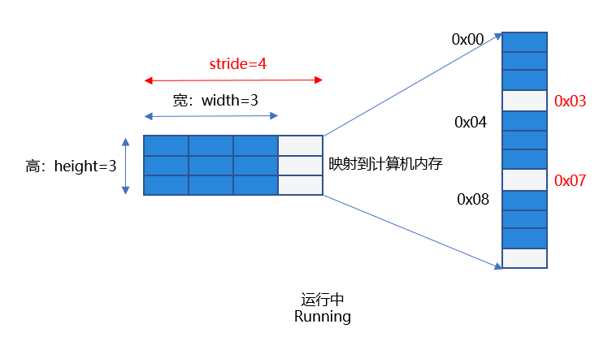
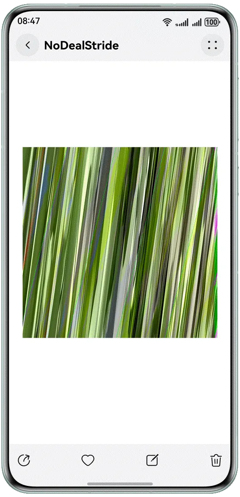
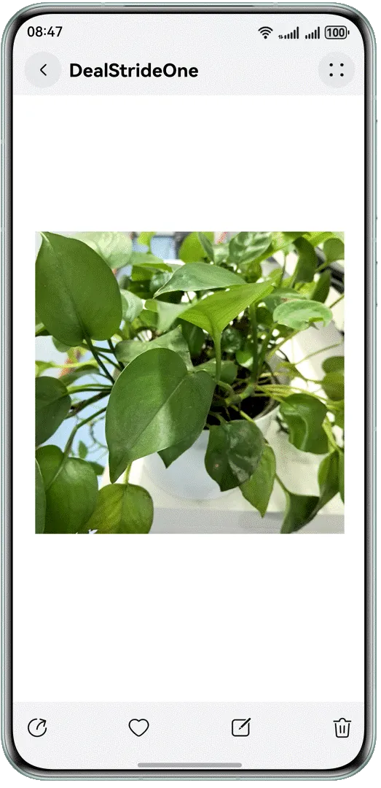
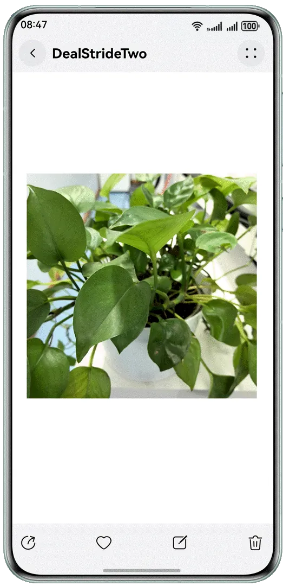

# 相机预览花屏解决方案

---

## 概述

开发者在[使用相机服务](https://developer.huawei.com/consumer/cn/doc/harmonyos-guides/camera-kit)时，如果仅用于预览流展示，通常使用[XComponent](https://developer.huawei.com/consumer/cn/doc/harmonyos-references/ts-basic-components-xcomponent)组件实现，如果需要获取每帧图像做二次处理(例如获取每帧图像完成二维码识别或人脸识别场景)，可以通过[ImageReceiver](https://developer.huawei.com/consumer/cn/doc/harmonyos-references/arkts-apis-image-imagereceiver)中imageArrival事件监听预览流每帧数据，解析图像内容。在解析图像内容时，如果未考虑stride，直接通过使用width*height读取图像内容去解析图像，会导致相机预览异常，从而出现相机预览花屏的现象。


当开发者获取预览流每帧图像buffer后，若发现图片内容出现花屏堆叠状，出现相机预览花屏现象，此时需要排查解析每帧图像，当预览流图像stride与width不一致时，需要对stride进行无效像素的去除处理。


## 实现原理

在计算机图形学和图像处理中，stride通常指的是在内存中存储多维数组（如图像或纹理）时，行与行之间的字节间隔，即每一行的起始地址与下一行的起始地址之间的距离，在本文中stride指的是图像的一行数据在内存中实际占用的字节数，出于内存对齐和提高读取效率的考虑，通常大于图像的宽度。


说明

stride在不同的平台底层上报的值不同，开发者需根据实际业务获取stride后做处理适配。在本文中通过预览流帧数据的返回值image.Component.rowStride获取stride。


如下图：在一个width为3，height为3，stride为4的图片上（例如定义了一个480*480分辨率的图像），实际分配内存并不是width*height即3*3（此处为定义的预览流分辨率的宽高比，即实际分配内存不是480*480），而是stride*height即4*3，这样实现了内存对齐，方便硬件处理。


**图1** 需正确处理stride





如果开发者根据width和height数据去处理像素数据，即把0x00-0x09地址的数据当做像素去处理，就会出现解析了错误的像素数据的问题，并且使用了无效的像素0x03，0x07，会导致图片无法正常显示导致“相机花屏”现象。因此，要根据stride值处理预览数据流，去除无效的像素后送显，才能获取正确的预览流图像。


## 场景案例

以一种高频的用户使用场景为例，应用需要定义一个1080*1080分辨率的预览流图像，此时的stride在相关平台的返回值为1088，此时需要对stride进行处理，处理无效像素后解析出正确的像素数据，避免出现预览流花屏。


【反例】未处理stride：当开发者创建PixelMap解析buffer时，直接按照宽去读取每行数据，没有处理stride，此时若解析了无效像素数据并传给Image组件直接送显，可能会出现预览流花屏现象。


以下为部分示例代码：


1. 应用通过image.ImageReceiver注册imageArrival图像回调方法，获取每帧图像数据实例image.Image，应用通过定义一个width为1080*height为1080分辨率的预览流直接创建pixelMap，此时获取到的stride的值为1088，解析buffer时若直接按照宽去读取每行数据（使用了无效像素数据）并存储到全局变量stridePixel中，传给Image送显，会导致预览流花屏。
  
  
  

```typescript
1. onImageArrival(receiver: image.ImageReceiver): void {
2.  receiver.on('imageArrival', () => {
3.  receiver.readNextImage((err: BusinessError, nextImage: image.Image) => {
4.  if (err || nextImage === undefined) {
5.  Logger.error(TAG, `requestPermissionsFromUser call Failed! error: ${err.code}`);
6.  return;
7.  }
8.  if (nextImage) {
9.  nextImage.getComponent(image.ComponentType.JPEG, async (_err, component: image.Component) => {
10.  let width: number = 1080; // Application create preview stream resolution corresponding to the width
11.  let height: number = 1080; // Application create preview stream resolution corresponding to the height
12.  let pixelMap: image.PixelMap | undefined = await image.createPixelMap(component.byteBuffer, {
13.  size: {
14.  height: height,
15.  width: width
16.  },
17.  // Counter example:width does not pass the stride value,
18.  // create PixelMap parsing buffer directly according to the width to read each line od data,
19.  // may use invalid pixel data,resulting in preview flowScreen.
20.  srcPixelFormat: image.PixelMapFormat.NV21
21.  })
22.  AppStorage.setOrCreate('stridePixel', pixelMap);
23.  nextImage.release();
24.  })
25.  }
26.  });
27.  })
28. }

```
  [CameraServiceThree.ets](https://gitcode.com/HarmonyOS_Samples/BestPracticeSnippets/blob/master/DealStrideSolution/entry/src/main/ets/utils/CameraServiceThree.ets#L47-L74)

2. 在初始相机模块时，调用onImageArrival()，将未处理的width和height作为size，创建PixelMap，通过在Image中传入被@StorageLink修饰的变量stridePixel进行数据刷新，图片送显。
  
  
  

```typescript
1. @Component
2. export struct PageThree {
3.  pathStack: NavPathStack = new NavPathStack();
4.  @State name: string = 'pageOne';
5.  @State isShowStridePixel: boolean = false;
6.  @StorageLink('stridePixel') @Watch('onStridePixel') stridePixel: image.PixelMap | undefined = undefined;
7.  @State imageWidth: number = 1080;
8.  @State imageHeight: number = 1080;
9.  @StorageLink('previewRotation') previewRotate: number = 0;
10.
11.  onStridePixel(): void {
12.  this.isShowStridePixel = true;
13.  }
14.
15.  aboutToAppear(): void {
16.  CameraService.initCamera(0, this.getUIContext());
17.  }
18.
19.  aboutToDisappear(): void {
20.  CameraService.releaseCamera();
21.  }
22.
23.  // ...
24.  build() {
25.  NavDestination() {
26.  // ...
27.  Column() {
28.  if (this.isShowStridePixel) {
29.  Image(this.stridePixel)
30.  .width(this.getUIContext().px2vp(this.imageWidth))
31.  .height(this.getUIContext().px2vp(this.imageHeight))
32.  .margin({ top: 150 })
33.  .rotate({
34.  z: 0.5,
35.  angle: this.previewRotate
36.  })
37.  }
38.  // ...
39.  }
40.  .justifyContent(FlexAlign.Center)
41.  .height('90%')
42.  .width('100%')
43.  }
44.  .backgroundColor(Color.White)
45.  .hideTitleBar(true)
46.  .onBackPressed(() => {
47.  this.pathStack.pop();
48.  return true;
49.  })
50.  .onReady((context: NavDestinationContext) => {
51.  this.pathStack = context.pathStack;
52.  })
53.  }
54. }

```
  [PageThree.ets](https://gitcode.com/HarmonyOS_Samples/BestPracticeSnippets/blob/master/DealStrideSolution/entry/src/main/ets/pages/PageThree.ets#L28-L136)


【正例一】开发者使用width，height，stride三个值，处理相机预览流数据，处理stride方法一如下。


分两种情况：


1. 当stride和width相等时，按宽读取buffer不影响结果。
2. 当stride和width不等时，将相机返回的预览流数据即component.byteBuffer的数据去除stride，拷贝得到新的dstArr数据进行数据处理，将处理后的dstArr数组buffer，通过width和height直接创建pixelMap, 并存储到全局变量stridePixel中，传给Image送显。
  
  
  

```typescript
1. onImageArrival(receiver: image.ImageReceiver): void {
2.  // ...
3.  if (nextImage) {
4.  nextImage.getComponent(image.ComponentType.JPEG,
5.  async (err, component: image.Component) => {
6.  let width: number = 1080; // Application create preview stream resolution corresponding to the width
7.  let height: number = 1080; // Application create preview stream resolution corresponding to the height
8.  let stride: number = component.rowStride; // Get stride by using component.rowStride
9.  Logger.info(TAG, `receiver getComponent width:${width} height:${height} stride:${stride}`);
10.  // Positive example: Case 1.stride and width are equal. Reading buffer by width does not affect the result.
11.  if (stride === width) {
12.  let pixelMap: image.PixelMap | undefined = await image.createPixelMap(component.byteBuffer, {
13.  size: { height: height, width: width },
14.  srcPixelFormat: image.PixelMapFormat.NV21,
15.  })
16.  AppStorage.setOrCreate('stridePixel', pixelMap);
17.  } else {
18.  // Positive example: Case 2.When width and stride are not equal，
19.  // At this time, the camera returned preview stream data component.byteBuffer to remove stride,
20.  // copy the new dstArr data, data processing to other do not support stride interface processing.
21.  const dstBufferSize: number = width * height *
22.  1.5; // Create a dstBufferSize space of width * height * 1.5. This is NV21 data format.
23.  const dstArr: Uint8Array = new Uint8Array(dstBufferSize); // Store the buffer after the stride is removed.
24.  // For each line of data read, the camera supports an even width and height profile, which does not involve rounding.
25.  for (let j = 0; j < height * 1.5; j++) { // Loop each row of dstArr data.
26.  // Copy the first width bytes of each line of data from component.byteBuffer into dstArr
27.  // (remove invalid pixels and get exactly an eight-byte array space of width*height per line).
28.  const srcBuf: Uint8Array = new Uint8Array(component.byteBuffer, j * stride,
29.  width); // The buffer returned by component.byteBuffer traverses each line, starting at the top, with width bytes cut off each line.
30.  dstArr.set(srcBuf, j * width); // Store the width*height data in dstArr.
31.  }
32.  let pixelMap: image.PixelMap | undefined = await image.createPixelMap(dstArr.buffer, {
33.  // The processed dstArr array buffer creates pixelMap directly by width and height,
34.  // and stores it in the global variable stridePixel and passes it to Image for display.
35.  size: { height: height, width: width },
36.  srcPixelFormat: image.PixelMapFormat.NV21,
37.  })
38.  AppStorage.setOrCreate('stridePixel', pixelMap);
39.  }
40.  nextImage.release();
41.  })
42.  }
43.  });
44.  })
45. }

```
  [CameraServiceOne.ets](https://gitcode.com/HarmonyOS_Samples/BestPracticeSnippets/blob/master/DealStrideSolution/entry/src/main/ets/utils/CameraServiceOne.ets#L49-L101)


【正例二】开发者使用width，height，stride三个值，处理相机预览流数据，处理stride方法二如下。


分两种情况：


1. 当stride和width相等时，与正例一情况一致，此处不再赘述。
2. 当stride和width不等时，如果应用想使用byteBuffer预览流数据创建pixelMap直接显示，可以根据stride*height字节的大小先创建pixelMap，然后调用PixelMap的cropSync()方法裁剪掉多余的像素，从而正确处理stride，解决预览流花屏问题。
  
  
  

```cangjie
1. onImageArrival(receiver: image.ImageReceiver): void {
2.  receiver.on('imageArrival', () => {
3.  receiver.readNextImage((err: BusinessError, nextImage: image.Image) => {
4.  // ...
5.  if (nextImage) {
6.  nextImage.getComponent(image.ComponentType.JPEG, async (_err, component: image.Component) => {
7.  let width: number = 1080; // Application create preview stream resolution corresponding to the width
8.  let height: number = 1080; // Application create preview stream resolution corresponding to the height
9.  let stride: number = component.rowStride; // Get stride by using component.rowStride
10.  Logger.info(TAG, `receiver getComponent width:${width} height:${height} stride:${stride}`);
11.  // stride and width are equal. Reading buffer by width does not affect the result
12.  if (stride === width) {
13.  let pixelMap: image.PixelMap | undefined = await image.createPixelMap(component.byteBuffer, {
14.  size: { height: height, width: width },
15.  srcPixelFormat: image.PixelMapFormat.NV21,
16.  })
17.  AppStorage.setOrCreate('stridePixel', pixelMap);
18.  } else {
19.  let pixelMap: image.PixelMap | undefined = await image.createPixelMap(component.byteBuffer, {
20.  // Positive example: 1. width transmission stride when creating PixelMap.
21.  size: { height: height, width: stride },
22.  srcPixelFormat: 8,
23.  })
24.  // 2. then call the cropSync method of PixelMap to crop out the excess pixels.
25.  try {
26.  pixelMap.cropSync({
27.  size: { width: width, height: height },
28.  x: 0,
29.  y: 0
30.  }) // Crop the image according to the size entered, starting with (0,0), crop the area of width*height bytes.
31.  let pixelBefore: PixelMap | undefined = AppStorage.get('stridePixel');
32.  await pixelBefore?.release();
33.  AppStorage.setOrCreate('stridePixel', pixelMap);
34.  } catch (error) {
35.  let err: BusinessError = error as BusinessError;
36.  hilog.warn(0x000, 'testTag', `setColorMode failed, code=${err.code}, message=${err.message}`);
37.  }
38.  }
39.  nextImage.release();
40.  })
41.  }
42.  });
43.  })
44. }

```
  [CameraServiceTwo.ets](https://gitcode.com/HarmonyOS_Samples/BestPracticeSnippets/blob/master/DealStrideSolution/entry/src/main/ets/utils/CameraServiceTwo.ets#L49-L98)


## 效果对比


**表1**

展开

| （反例）未处理stride | （正例）处理stride的方案一 | （正例）处理stride的方案二 |
| --- | --- | --- |
| <br> | <br> | <br> |


## 常见问题


### 如何获取相机预览流帧数据

通过ImageReceiver中imageArrival事件监听获取底层返回的图像数据，详细请参见[双路预览(ArkTS)](https://developer.huawei.com/consumer/cn/doc/harmonyos-guides/camera-dual-channel-preview#%E5%BC%80%E5%8F%91%E6%AD%A5%E9%AA%A4)。


### 如何获取预览流图像的stride的值

可以通过预览流帧数据的返回值image.Component.rowStride获取stride。


## 示例代码

- [处理stride解决相机预览流花屏问题](https://gitcode.com/harmonyos_samples/BestPracticeSnippets/tree/master/DealStrideSolution)
