# 相机硬件差异/多设备相机适配

---

## 概述

在移动端应用开发中，相机页面的多设备适配一直是开发者面临的一大难题。由于不同设备的屏幕尺寸、相机镜头、折叠形态以及系统特性等方面存在较大差异，相机界面的开发往往会遇到一系列[兼容性问题](https://developer.huawei.com/consumer/cn/doc/best-practices/bpta-multi-device-camera#section1684283074912)，影响用户体验。


本文介绍如何将手机相机页面（含预览、拍摄和查看照片功能）适配至双折叠、阔折叠、三折叠和平板等多种设备形态。在基础相机功能（预览、拍照、查看照片）之上，适配折叠屏和平板设备时，需要重点关注以下核心问题：


- [通过断点实现多套页面布局](https://developer.huawei.com/consumer/cn/doc/best-practices/bpta-multi-device-camera#section181143569262)，并设置横竖屏旋转策略。
- [选择相机设备](https://developer.huawei.com/consumer/cn/doc/best-practices/bpta-multi-device-camera#section13854163154917)。
- [设置多设备上相机预览画面比例](https://developer.huawei.com/consumer/cn/doc/best-practices/bpta-multi-device-camera#section882216138497)。
- [设置拍照旋转角度](https://developer.huawei.com/consumer/cn/doc/best-practices/bpta-multi-device-camera#section0752024124911)。
- [实现悬停态相机页面](https://developer.huawei.com/consumer/cn/doc/best-practices/bpta-multi-device-camera#section50639679)。


## 通过断点实现多套页面布局

“两个宽度相近的窗口，页面布局应相同”。首先，根据这条原则，确认要适配窗口的宽度范围，手机、双折叠、阔折叠、三折叠、平板设备共涉及到3种横向断点：sm、md和lg，因此应用首次开发时需要单独设计3种页面布局。


“对于高度相对宽度较小的窗口，呈现横向窗口或类方形窗口时，页面布局需进行差异化设计”。其次根据这条规则，因为阔折叠外屏独特的小方形窗口形态，布局会与手机略有差异。UX设计图如下：

| 断点 | 横向断点sm，纵向断点md | 横向断点sm，纵向断点lg | 横向断点md | 横向断点lg |
| --- | --- | --- | --- | --- |
| UX图 | 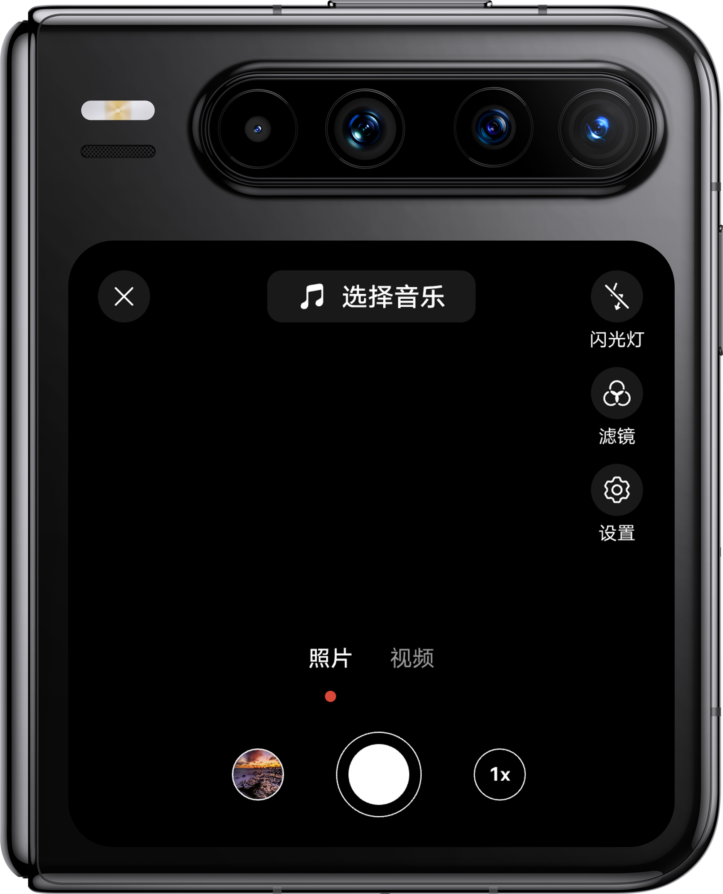 | 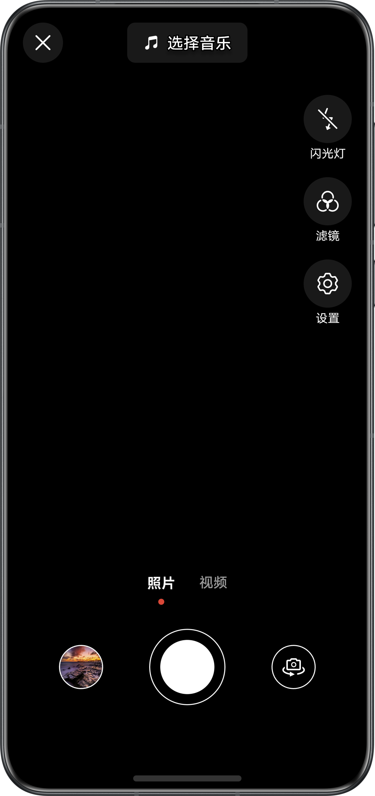 | 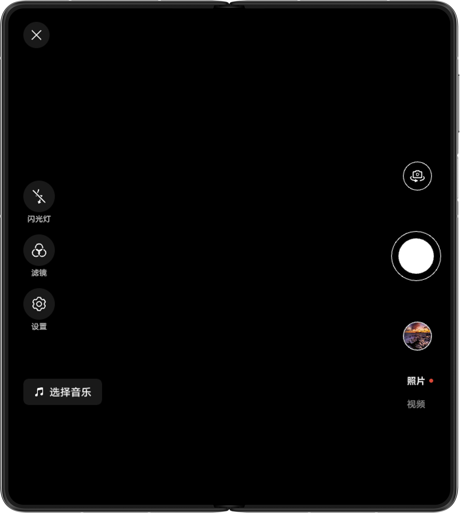 | 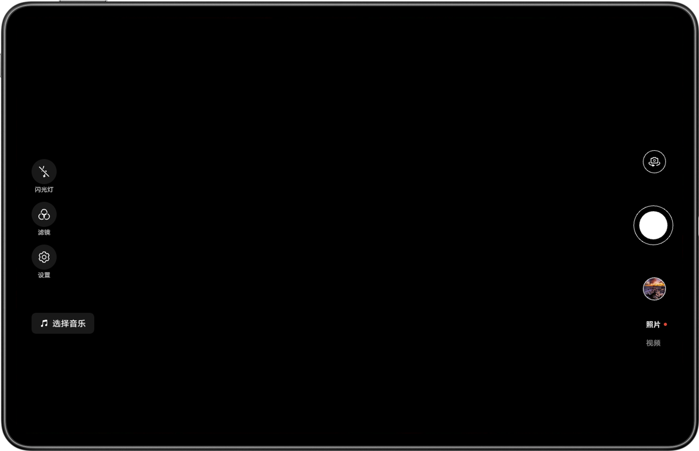 |


### 开发步骤

1. 分析三种横向断点对应的UX设计。sm断点的相机按钮布局分布在上下两侧，需要单独实现，阔折叠外屏与手机布局的差异通过纵向断点进行区分；md、lg断点的相机按钮布局相同，分布在左右两侧，可以使用一套代码实现。使用Stack组件，展示相机预览画面上的控制按钮，并使用断点控制在三折叠不同使用状态下的显示与隐藏。相机页面中XComponent组件宽高均可设置为100%，预览画面的大小可通过设置XComponent组件对应Surface区域的宽高实现，代码可参考[设置多设备上相机预览画面比例](https://developer.huawei.com/consumer/cn/doc/best-practices/bpta-multi-device-camera#section882216138497)。
  
  
  

```less
1. Stack() {
2.  // Camera View.
3.  Column() {
4.  XComponent({
5.  type: XComponentType.SURFACE,
6.  controller: this.xComponentController
7.  }) {}
8.  // ...
9.  }
10.  .width('100%')
11.  .height(this.isHalfFolded ? this.creaseRegion[0] : '')
12.  .layoutWeight(this.isHalfFolded ? 0 : 1)
13.  // ...
14.
15.  // Shooting button view.
16.  Stack() {
17.  // Setting view for sm.
18.  Column() {
19.  // ...
20.  }
21.  .width(this.heightBp === HeightBreakpoint.HEIGHT_MD ? 30 : 48)
22.  .height('100%')
23.  .margin({ right: 16 })
24.  .padding({ top: this.heightBp === HeightBreakpoint.HEIGHT_MD ? 16 : 108 })
25.  .visibility(this.widthBp === WidthBreakpoint.WIDTH_SM ? Visibility.Visible : Visibility.None)
26.
27.  // Choose music for sm.
28.  Row() {
29.  // ...
30.  }
31.  .width('100%')
32.  .height(this.heightBp === HeightBreakpoint.HEIGHT_MD ? 28 : 40)
33.  .position({
34.  x: 0,
35.  y: this.heightBp === HeightBreakpoint.HEIGHT_MD ? 16 : 28
36.  })
37.  .justifyContent(FlexAlign.Center)
38.  .visibility(this.widthBp === WidthBreakpoint.WIDTH_SM ? Visibility.Visible : Visibility.None)
39.
40.  // Shooting button for sm.
41.  Column() {
42.  // ...
43.  }
44.  .visibility(this.widthBp === WidthBreakpoint.WIDTH_SM ? Visibility.Visible : Visibility.None)
45.  .height(this.heightBp === HeightBreakpoint.HEIGHT_MD ? 96 : 132)
46.  .width('100%')
47.  .margin({ bottom: this.heightBp === HeightBreakpoint.HEIGHT_MD ? 16 : 84 })
48.
49.  // Setting view for md/lg.
50.  Column() {
51.  // ...
52.  }
53.  .width(this.widthBp === WidthBreakpoint.WIDTH_MD ? 144 : 152)
54.  .height('100%')
55.  .justifyContent(FlexAlign.Start)
56.  .padding({ left: this.heightBp === HeightBreakpoint.HEIGHT_MD ? 24 : 32 })
57.  .position({ x: 0, y: 0 })
58.  .alignItems(HorizontalAlign.Start)
59.  .visibility(this.widthBp === WidthBreakpoint.WIDTH_MD || this.widthBp === WidthBreakpoint.WIDTH_LG ?
60.  Visibility.Visible : Visibility.None)
61.
62.  // Shooting button for md/lg.
63.  Column() {
64.  // ...
65.  }
66.  .width(92)
67.  .height('100%')
68.  .justifyContent(FlexAlign.Center)
69.  .padding({ right: 16 })
70.  .visibility(this.widthBp === WidthBreakpoint.WIDTH_MD || this.widthBp === WidthBreakpoint.WIDTH_LG ?
71.  Visibility.Visible : Visibility.None)
72.  }
73.  .height('100%')
74.  .width('100%')
75.  .alignContent(Alignment.BottomEnd)
76.  .visibility(this.isHalfFolded ? Visibility.None : Visibility.Visible)
77.  // ...
78. }
79. .height('100%')
80. .width('100%')
81. .alignContent(this.widthBp === WidthBreakpoint.WIDTH_MD ? (this.isHalfFolded ? Alignment.Top : Alignment.Start) :
82.  Alignment.Center)

```
  [Index.ets](https://gitcode.com/harmonyos_samples/MultiDeviceCamera/blob/master/entry/src/main/ets/pages/Index.ets#L145-L407)

2. 相机页面在不同设备上横竖屏旋转，请参考[为多设备配置旋转策略](https://developer.huawei.com/consumer/cn/doc/best-practices/bpta-multi-device-window-direction#section189311691213)。以本应用为例，横向断点为sm时不支持旋转；md、lg时支持旋转。因此，当窗口宽度、高度的最小值大于等于600vp时，窗口支持旋转。
  
  
  

```typescript
1. onWindowSizeChange: (windowSize: window.Size) => void = (windowSize: window.Size) => {
2.  this.setOrientation(this.uiContext!.px2vp(windowSize.width), this.uiContext!.px2vp(windowSize.height));
3.  // ...
4. }
5.
6. setOrientation(width: number, height: number): void {
7.  // When the minimum value of window width and height is greater than the md breakpoint threshold, rotation is supported.
8.  if (Math.min(width, height) >= 600) {
9.  this.windowData?.setPreferredOrientation(window.Orientation.AUTO_ROTATION_RESTRICTED).catch((error: BusinessError) => {
10.  hilog.error(0x0000, `MultiDeviceCamera`,
11.  `Set window orientation failed. Code: ${error.code}, message: ${error.message}`);
12.  });
13.  } else {
14.  this.windowData?.setPreferredOrientation(window.Orientation.PORTRAIT).catch((error: BusinessError) => {
15.  hilog.error(0x0000, `MultiDeviceCamera`,
16.  `Set window orientation failed. Code: ${error.code}, message: ${error.message}`);
17.  });
18.  }
19. }
20.
21. // ...
22. onWindowStageCreate(windowStage: window.WindowStage): void {
23.  // ...
24.  windowStage.loadContent('pages/Index', (err) => {
25.  // ...
26.  windowStage.getMainWindow().then((data: window.Window) => {
27.  // ...
28.  // Monitor window size changes and update breakpoints.
29.  data.on('windowSizeChange', this.onWindowSizeChange);
30.  let rect: window.Rect = data.getWindowProperties().windowRect;
31.  this.setOrientation(this.uiContext.px2vp(rect.width), this.uiContext.px2vp(rect.height));
32.  }).catch((err: BusinessError) => {
33.  hilog.error(0x0000, 'testTag', `Error occured, error code: ${err.code}, error message: ${err.message}`);
34.  })
35.  });
36. }

```
  [EntryAbility.ets](https://gitcode.com/harmonyos_samples/MultiDeviceCamera/blob/master/entry/src/main/ets/entryability/EntryAbility.ets#L35-L146)


## 选择相机设备

完整的相机页面，除了实现页面的按钮组件，还需要实现相机预览画面。在创建相机预览对象之前，首先要使用[createCameraInput()](https://developer.huawei.com/consumer/cn/doc/harmonyos-references/arkts-apis-camera-cameramanager#createcamerainput)确认使用的相机设备。


### 开发步骤

1. 手机、双折叠、阔折叠、三折叠、平板均配有后置相机和前置相机。相机页面显示时，根据isFront变量选择对应CameraPosition的相机，默认使用后置相机。
  
  
  

```kotlin
1. onPageShow(): void {
2.  abilityAccessCtrl.createAtManager().requestPermissionsFromUser(this.context, this.permissions).then(() => {
3.  setTimeout(() => {
4.  // After obtaining permission, load the camera preview stream and ensure it is consistent with the aspect ratio of the surface.
5.  // ...
6.  if (this.isFront) {
7.  this.cameraUtil.cameraShooting(this.surfaceId, this.context!, camera.CameraPosition.CAMERA_POSITION_FRONT);
8.  } else {
9.  this.cameraUtil.cameraShooting(this.surfaceId, this.context!, camera.CameraPosition.CAMERA_POSITION_BACK);
10.  }
11.  }, 200);
12.  }).catch((err: BusinessError) => {
13.  hilog.error(0x0000, 'testTag', `Failed to requestPermissionsFromUser. Code: ${err.code}, message: ${err.message}`);
14.  })
15. }


```
  [Index.ets](https://gitcode.com/harmonyos_samples/MultiDeviceCamera/blob/master/entry/src/main/ets/pages/Index.ets#L112-L128)
     CameraPosition是相对的而不是固定的，例如阔折叠外屏的相机。


  - 在折叠态时CameraPosition为CAMERA_POSITION_FRONT，效果图如下：         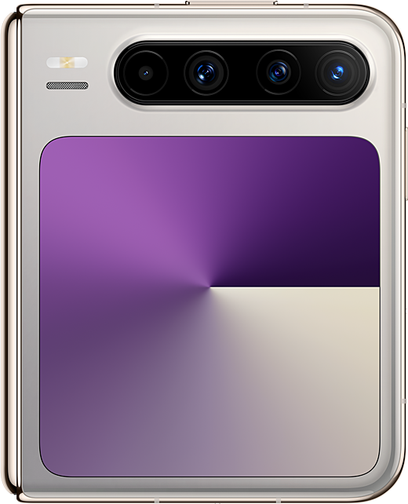

  - 在展开态时CameraPosition为CAMERA_POSITION_BACK，效果图如下：         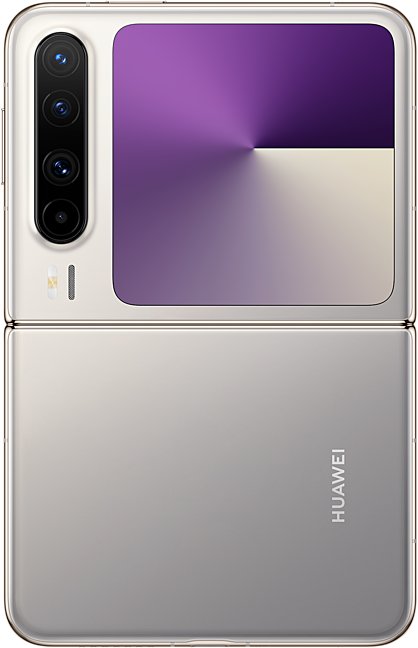

2. 其他需要重置预览流的场景需要开发者单独处理。折叠状态切换（例如双折叠的折叠态切换至半折叠态），会导致显示屏幕变化，需要重新选择相机设备。所以在[display.on('foldStatusChange')](https://developer.huawei.com/consumer/cn/doc/harmonyos-references/js-apis-display#displayonfoldstatuschange10)中判断变化前后的折叠状态，并根据变化前使用的相机位置，选择变化后使用前置相机或后置相机。
  
  
  

```kotlin
1. onFoldStatusChange: (foldStatus: display.FoldStatus) => void = (foldStatus: display.FoldStatus) => {
2.  if (foldStatus === display.FoldStatus.FOLD_STATUS_HALF_FOLDED) {
3.  let orientation: display.Orientation = display.getDefaultDisplaySync().orientation;
4.  // Determine the page layout that has entered half folded status and prohibit portrait orientation.
5.  if (this.widthBp === WidthBreakpoint.WIDTH_MD && (orientation === display.Orientation.LANDSCAPE ||
6.  orientation === display.Orientation.LANDSCAPE_INVERTED)) {
7.  this.isHalfFolded = true;
8.  this.windowUtil.setMainWindowOrientation(window.Orientation.LANDSCAPE);
9.  this.cameraUtil.setHalfFoldedRect(this.windowUtil.getWindowSize());
10.  } else {
11.  if (this.oldFoldStatus === display.FoldStatus.FOLD_STATUS_FOLDED) {
12.  if (this.isFront) {
13.  this.cameraUtil.cameraShooting(this.surfaceId, this.context!, camera.CameraPosition.CAMERA_POSITION_FRONT);
14.  } else {
15.  this.cameraUtil.cameraShooting(this.surfaceId, this.context!, camera.CameraPosition.CAMERA_POSITION_BACK);
16.  }
17.  }
18.  }
19.  return;
20.  }
21.  // ...
22.  // Exit the half folded status page.
23.  if (this.isHalfFolded) {
24.  this.isHalfFolded = false;
25.  this.cameraUtil.setXComponentRect(this.windowUtil.getWindowSize());
26.  } else {
27.  if (foldStatus === display.FoldStatus.FOLD_STATUS_FOLDED ||
28.  (this.oldFoldStatus === display.FoldStatus.FOLD_STATUS_EXPANDED_WITH_SECOND_HALF_FOLDED &&
29.  foldStatus === display.FoldStatus.FOLD_STATUS_EXPANDED) ||
30.  (this.oldFoldStatus === display.FoldStatus.FOLD_STATUS_EXPANDED &&
31.  foldStatus === display.FoldStatus.FOLD_STATUS_EXPANDED_WITH_SECOND_HALF_FOLDED)) {
32.  if (this.isFront) {
33.  this.cameraUtil.cameraShooting(this.surfaceId, this.context!, camera.CameraPosition.CAMERA_POSITION_FRONT);
34.  } else {
35.  this.cameraUtil.cameraShooting(this.surfaceId, this.context!, camera.CameraPosition.CAMERA_POSITION_BACK);
36.  }
37.  }
38.  }
39.  // ...
40. }
41.
42. aboutToAppear(): void {
43.  try {
44.  display.on('foldStatusChange', this.onFoldStatusChange);
45.  } catch (error) {
46.  let err = error as BusinessError;
47.  hilog.error(0x0000, 'MultiDeviceCamera', `Failed to obtain fold status. Code: ${err.code}, message: ${err.message}`);
48.  }
49.  // ...
50. }


```
  [Index.ets](https://gitcode.com/harmonyos_samples/MultiDeviceCamera/blob/master/entry/src/main/ets/pages/Index.ets#L50-L108)
     需要注意，PuraX外屏只存在前置相机。如果在内屏使用的是后置相机，切换外屏后，后置相机将不再可用，则返回可用相机列表中默认的相机。


  
  
  

```cangjie
1. getCamera(cameras: Array<camera.CameraDevice>, cameraPosition: camera.CameraPosition): number {
2.  // Choose front or rear camera.
3.  for (let i: number = 0; i < cameras.length; ++i) {
4.  if (cameras[i].cameraPosition === cameraPosition) {
5.  if (cameraPosition === camera.CameraPosition.CAMERA_POSITION_BACK) {
6.  AppStorage.setOrCreate('isFront', false);
7.  }
8.  if (cameraPosition === camera.CameraPosition.CAMERA_POSITION_FRONT) {
9.  AppStorage.setOrCreate('isFront', true);
10.  }
11.  return i;
12.  }
13.  }
14.  hilog.error(0x0000, 'testLog', `Failed to find the camera with the corresponding position.`);
15.  if (cameras[0].cameraPosition === camera.CameraPosition.CAMERA_POSITION_BACK) {
16.  AppStorage.setOrCreate('isFront', false);
17.  }
18.  if (cameras[0].cameraPosition === camera.CameraPosition.CAMERA_POSITION_FRONT) {
19.  AppStorage.setOrCreate('isFront', true);
20.  }
21.  return 0;
22. }


```
  [CameraUtil.ets](https://gitcode.com/harmonyos_samples/MultiDeviceCamera/blob/master/entry/src/main/ets/utils/CameraUtil.ets#L110-L131)


## 设置多设备上相机预览画面比例

选择相机之后，需要通过[createPreviewOutput()](https://developer.huawei.com/consumer/cn/doc/harmonyos-references/arkts-apis-camera-cameramanager#createpreviewoutput12)创建预览输出对象，绑定至XComponent组件展示预览画面，实现流程可参考[拍照实践](https://developer.huawei.com/consumer/cn/doc/harmonyos-guides/camera-shooting-case)。在开发多设备上相机预览画面时，需要通过以下步骤避免压缩、拉伸、异常旋转的问题。


XComponent组件对应Surface区域的宽高比，取决于用户预览时设备的屏幕顺时针旋转角度。如果display.rotation为0°或180°，则Surface与相机预览流宽高比互为倒数；如果display.rotation为90°或270°，则Surface与相机预览流宽高比一致。


以获取预览流宽高比4:3为例（阔折叠折叠态为1:1），多设备不同状态的Surface宽高比如下表：


- 阔折叠折叠态 手机/双折叠折叠态/三折叠F态/阔折叠展开态 双折叠展开态/三折叠M态 三折叠G态 平板
- 设备方向 以充电口朝右为例 display.rotation=270 以充电口朝下为例 display.rotation=0 以充电口朝下为例 display.rotation=0 以充电口朝下为例 display.rotation=0 以充电口朝下为例 display.rotation=0
- Surface宽高比 1:1 3:4 3:4 3:4 3:4
- 设备方向 页面不支持旋转 页面不支持旋转 以充电口朝右为例 display.rotation=270 以充电口朝右为例 display.rotation=270 以充电口朝右为例 display.rotation=270
- Surface宽高比 4:3 4:3 4:3


多设备不同状态的预览效果图如下表：


| 阔折叠折叠态 | 手机/双折叠折叠态/三折叠F态/阔折叠展开态 | 双折叠展开态/三折叠M态 | 三折叠G态 | 平板 |
| --- | --- | --- | --- | --- |
| 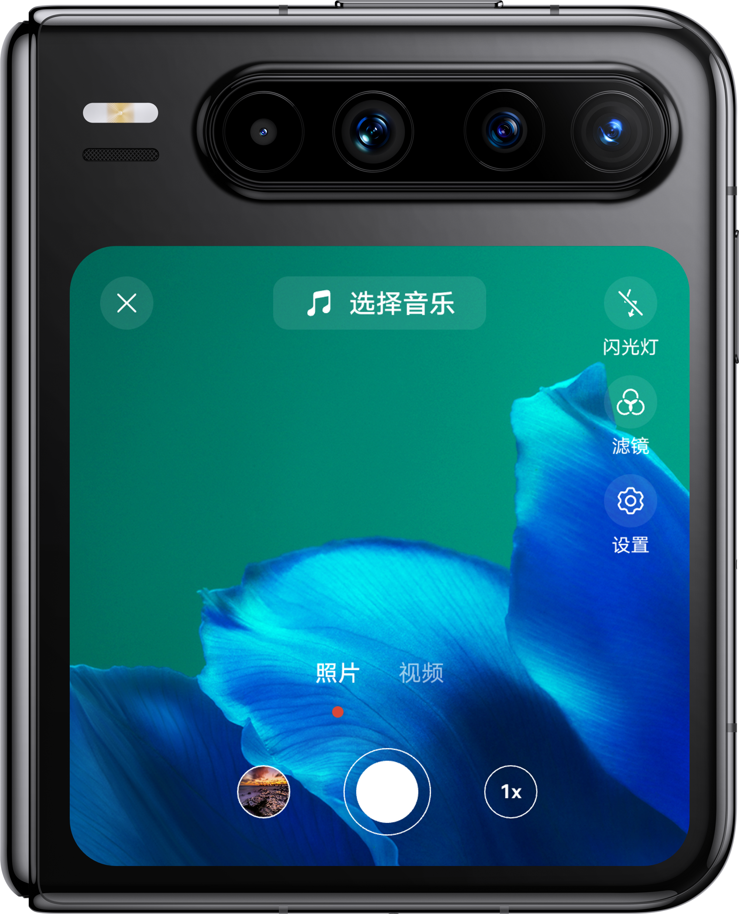 | 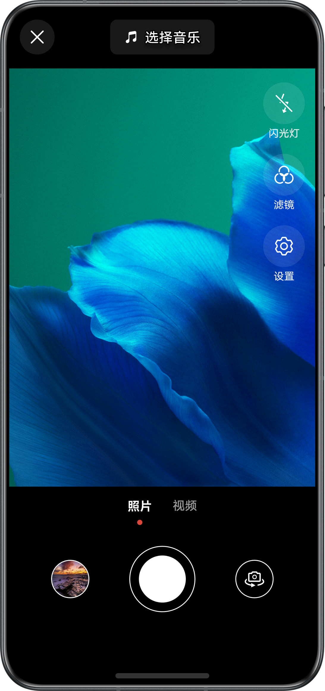 | 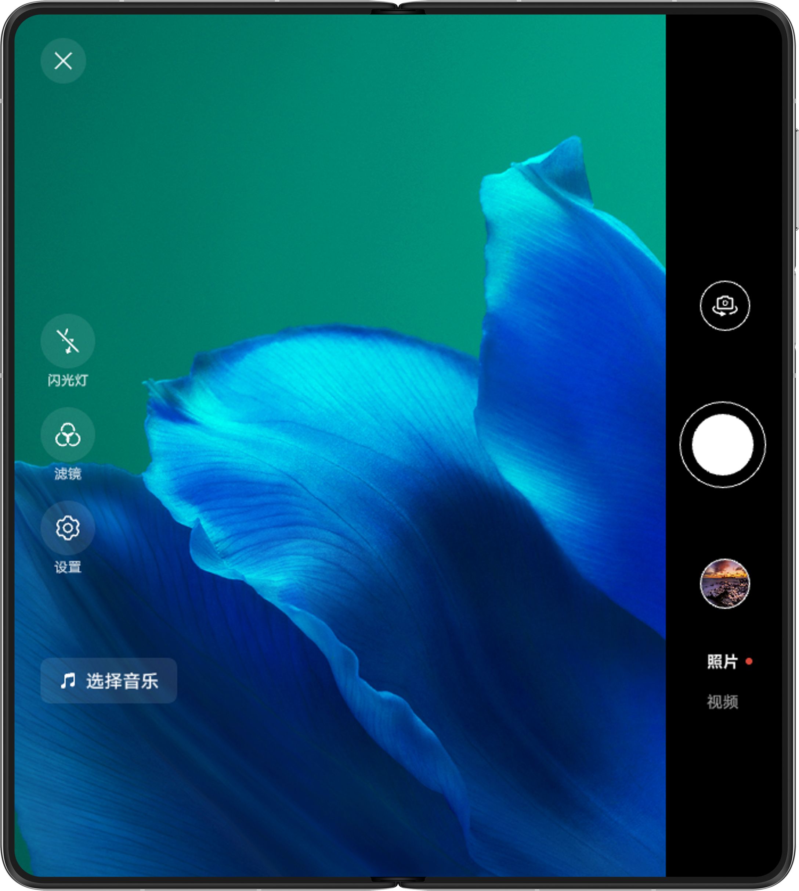 | 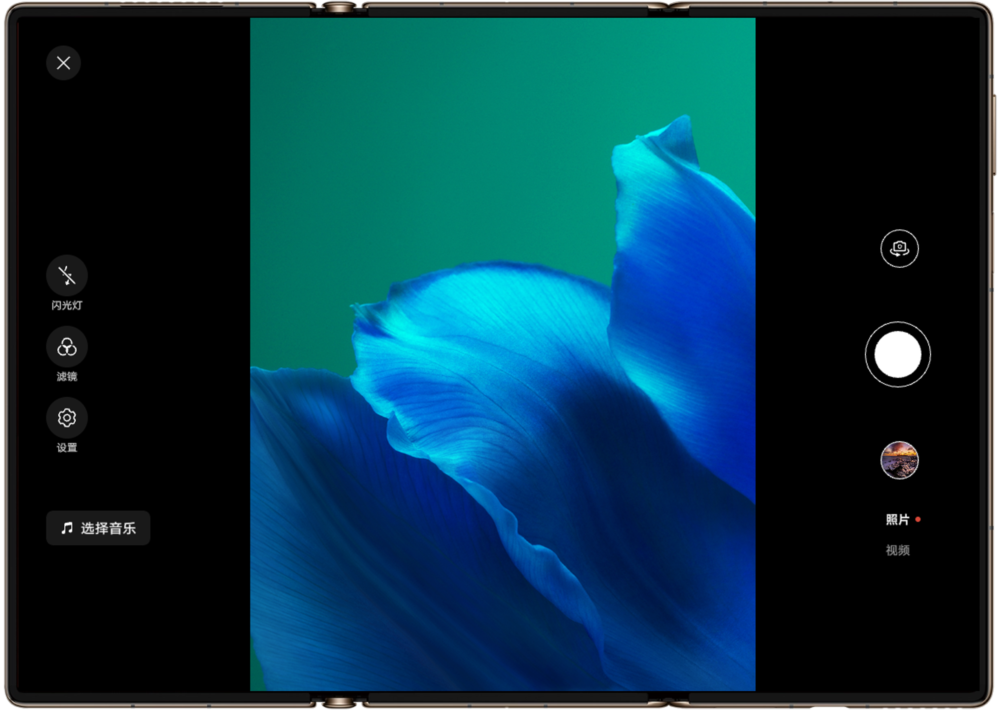 | 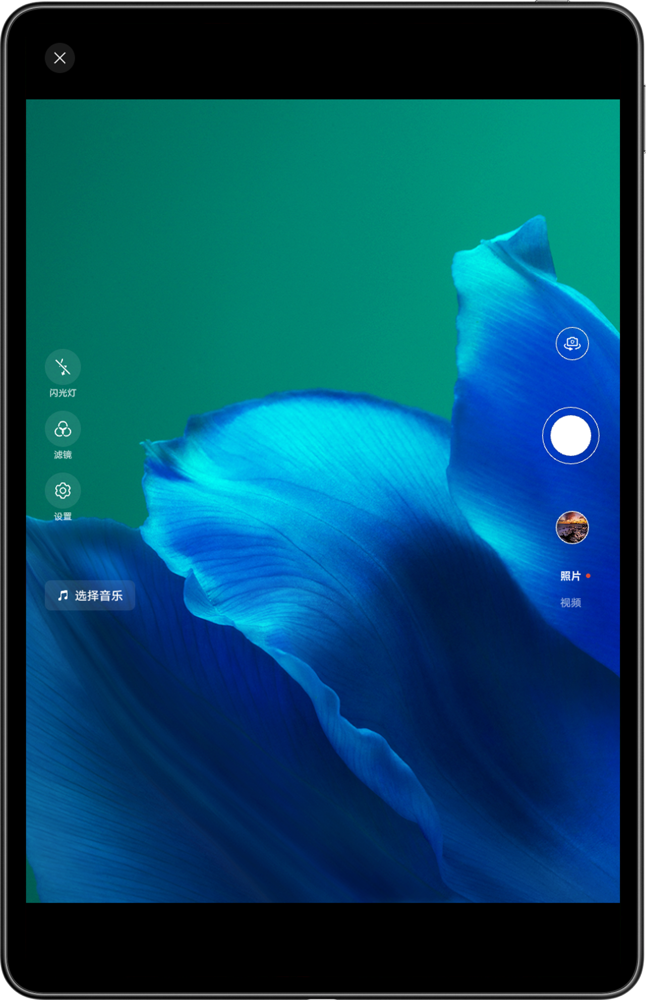 |
| 页面不支持旋转 | 页面不支持旋转 | 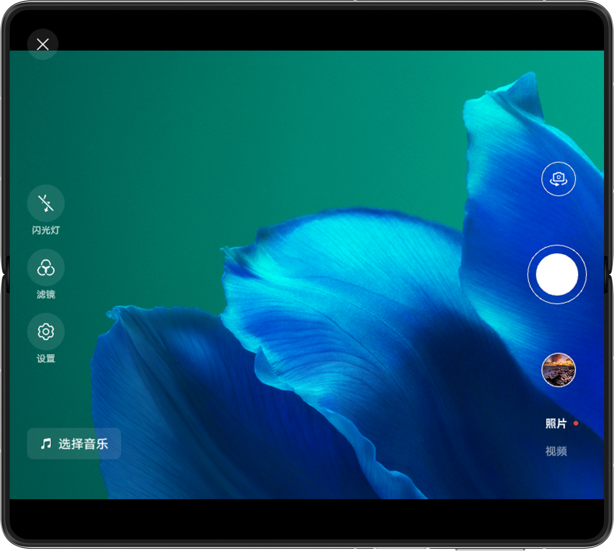 | 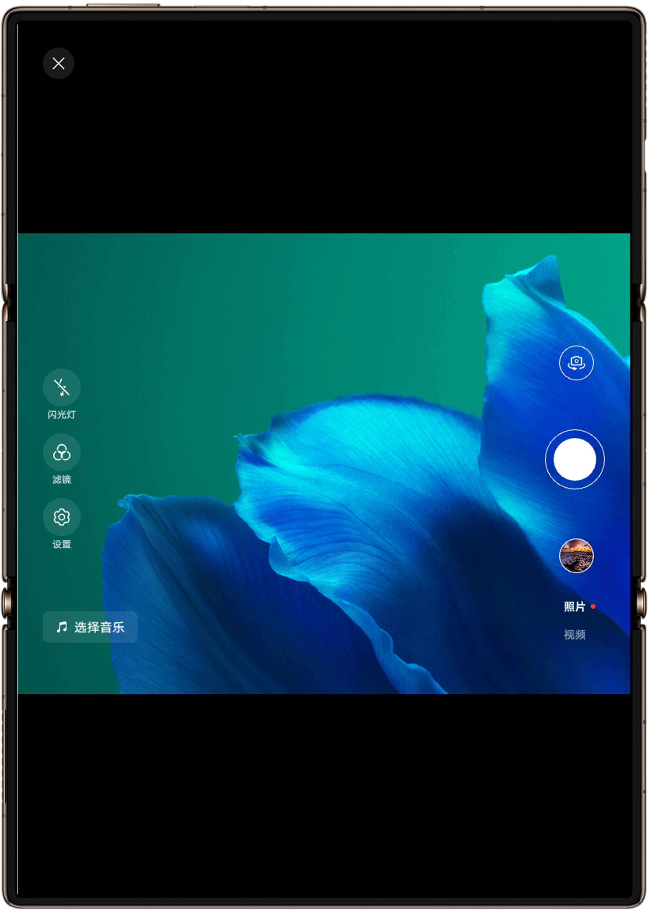 | 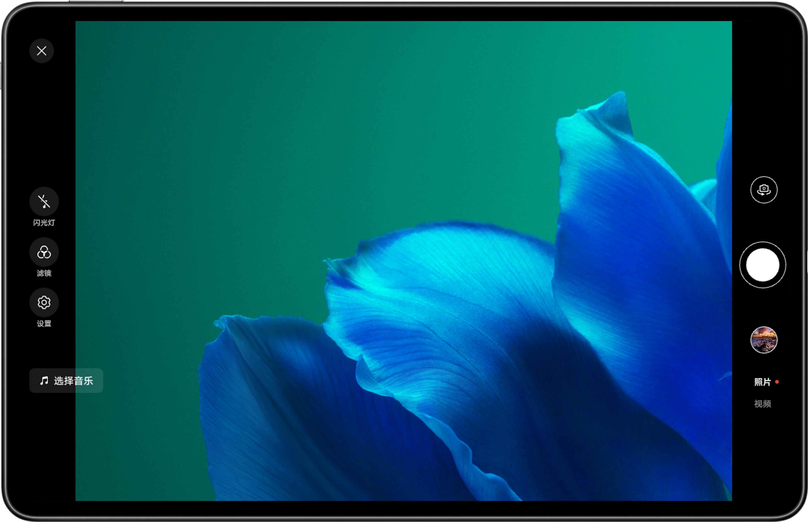 |


### 开发步骤

1. 在窗口横竖屏旋转时，实现[setXComponentSurfaceRect()](https://developer.huawei.com/consumer/cn/doc/harmonyos-references/ts-basic-components-xcomponent#setxcomponentsurfacerect12)方法重新设置XComponent组件中surface区域的宽和高，确保与多设备相机的预览流、拍照流宽高比一致。
  
  
  

```cangjie
1. setXComponentRect(windowSize: window.Size): void {
2.  try {
3.  // Initialize the width and height of the surface to match the full screen of the window.
4.  let rect: SurfaceRect = {
5.  surfaceWidth: windowSize.width,
6.  surfaceHeight: windowSize.height
7.  };
8.  let widthBp: WidthBreakpoint = this.uiContext!.getWindowWidthBreakpoint();
9.  let heightBp: HeightBreakpoint = this.uiContext!.getWindowHeightBreakpoint();
10.  let displayRotation: number = display.getDefaultDisplaySync().rotation * 90;
11.  if (widthBp === WidthBreakpoint.WIDTH_SM && heightBp === HeightBreakpoint.HEIGHT_MD) {
12.  this.xComponentController!.setXComponentSurfaceRect(rect);
13.  return;
14.  }
15.  if (AppStorage.get('isHalfFolded')) {
16.  this.setHalfFoldedRect(windowSize);
17.  return;
18.  }
19.  if (displayRotation === 0 || displayRotation === 180) {
20.  if (windowSize.height * 3 / 4 > windowSize.width) {
21.  rect.surfaceHeight = windowSize.width / 3 * 4;
22.  } else {
23.  rect.surfaceWidth = windowSize.height / 4 * 3;
24.  }
25.  if (widthBp === WidthBreakpoint.WIDTH_MD && heightBp === HeightBreakpoint.HEIGHT_MD) {
26.  rect.offsetX = 0;
27.  rect.offsetY = 0;
28.  }
29.  }
30.  if (displayRotation === 90 || displayRotation === 270) {
31.  if (windowSize.width * 3 / 4 > windowSize.height) {
32.  rect.surfaceWidth = windowSize.height / 3 * 4;
33.  } else {
34.  rect.surfaceHeight = windowSize.width / 4 * 3;
35.  }
36.  }
37.  this.xComponentController!.setXComponentSurfaceRect(rect);
38.  } catch (error) {
39.  let err = error as BusinessError;
40.  hilog.error(0x0000, 'MultiDeviceCamera', `Failed to set XComponent rect. Code: ${err.code}, message: ${err.message}`);
41.  }
42. }

```
  [CameraUtil.ets](https://gitcode.com/harmonyos_samples/MultiDeviceCamera/blob/master/entry/src/main/ets/utils/CameraUtil.ets#L345-L388)

2. 在窗口横竖屏旋转时，会刷新窗口尺寸，需要调用setXComponentRect()方法刷新预览画面比例，避免预览画面异常压缩或拉伸。
  
  
  

```typescript
1. export default class EntryAbility extends UIAbility {
2.  // ...
3.  isFirstTime: boolean = true;
4.  onWindowSizeChange: (windowSize: window.Size) => void = (windowSize: window.Size) => {
5.  // ...
6.  if (!this.isFirstTime) {
7.  this.cameraUtil!.setXComponentRect(this.windowUtil!.getWindowSize());
8.  } else {
9.  this.isFirstTime = false;
10.  }
11.  }
12.  // ...
13.  onWindowStageCreate(windowStage: window.WindowStage): void {
14.  // ...
15.  windowStage.loadContent('pages/Index', (err) => {
16.  // ...
17.  windowStage.getMainWindow().then((data: window.Window) => {
18.  // ...
19.  // Monitor window size changes and update breakpoints.
20.  data.on('windowSizeChange', this.onWindowSizeChange);
21.  // ...
22.  }).catch((err: BusinessError) => {
23.  hilog.error(0x0000, 'testTag', `Error occured, error code: ${err.code}, error message: ${err.message}`);
24.  })
25.  });
26.  }
27.  // ...
28. }

```
  [EntryAbility.ets](https://gitcode.com/harmonyos_samples/MultiDeviceCamera/blob/master/entry/src/main/ets/entryability/EntryAbility.ets#L26-L154)

3. 最后调用[setXComponentSurfaceRotation()](https://developer.huawei.com/consumer/cn/doc/harmonyos-references/ts-basic-components-xcomponent#setxcomponentsurfacerotation12)设置XComponent的Surface区域在屏幕旋转时锁定方向，确保相机预览画面旋转时的用户体验。
  
  
  

```cangjie
1. XComponent({
2.  type: XComponentType.SURFACE,
3.  controller: this.xComponentController
4. }) {}
5. .onLoad(() => {
6.  // ...
7.  // Set surface to lock direction when screen rotates.
8.  this.xComponentController.setXComponentSurfaceRotation({ lock: true });
9. })

```
  [Index.ets](https://gitcode.com/harmonyos_samples/MultiDeviceCamera/blob/master/entry/src/main/ets/pages/Index.ets#L151-L165)


## 设置拍照旋转角度

在横竖屏拍照场景下，需确保图片始终正向显示，避免出现照片方向异常（如旋转90°或倒置）。


### 开发步骤

在[capture()](https://developer.huawei.com/consumer/cn/doc/harmonyos-references/arkts-apis-camera-photooutput#capture-3)方法中，通过重力传感器获取当前拍照的角度，并区分后置相机与前置相机，设置拍照时的旋转角度rotation。


```cangjie
1. capture(): void {
2.  let rotation: number = 0;
3.  let isFront: boolean | undefined = AppStorage.get('isFront');
4.  try {
5.  // Obtain the angle of the gravity sensor during shooting and set the shooting rotation angle.
6.  sensor.once(sensor.SensorId.GRAVITY, (data: sensor.GravityResponse) => {
7.  if (Math.abs(data.z) > OVERLOOKING_GRAVITY_OF_Z_AXIS) {
8.  rotation = this.lastRotation;
9.  }
10.  else {
11.  let degree: number = this.getCalDegree(data.x, data.y, data.z);
12.  if ((degree >= 0 && degree <= 30) || degree >= 300) {
13.  rotation = camera.ImageRotation.ROTATION_0;
14.  } else if (degree > 30 && degree <= 120) {
15.  if (isFront) {
16.  // Use ROTATION_270 when degree range is (30, 120] for front camera.
17.  rotation = camera.ImageRotation.ROTATION_270;
18.  } else {
19.  // Use ROTATION_90 when degree range is (30, 120] for back camera.
20.  rotation = camera.ImageRotation.ROTATION_90;
21.  }
22.  } else if (degree > 120 && degree <= 210) {
23.  // Use ROTATION_180 when degree range is (120, 210].
24.  rotation = camera.ImageRotation.ROTATION_180;
25.  } else if (degree > 210 && degree <= 300) {
26.  if (isFront) {
27.  // Use ROTATION_90 when degree range is (210, 300] for front camera.
28.  rotation = camera.ImageRotation.ROTATION_90;
29.  } else {
30.  // Use ROTATION_270 when degree range is (210, 300] for back camera.
31.  rotation = camera.ImageRotation.ROTATION_270;
32.  }
33.  };
34.  }
35.
36.  let setting: camera.PhotoCaptureSetting = {
37.  quality: camera.QualityLevel.QUALITY_LEVEL_HIGH,
38.  rotation: rotation,
39.  mirror: isFront
40.  }
41.  this.photoOutput?.capture(setting);
42.  })
43.  } catch (error) {
44.  let err = error as BusinessError;
45.  hilog.error(0x0000, 'MultiDeviceCamera', `Capture failed. Code: ${err.code}, message: ${err.message}`);
46.  }
47. }

```


[CameraUtil.ets](https://gitcode.com/harmonyos_samples/MultiDeviceCamera/blob/master/entry/src/main/ets/utils/CameraUtil.ets#L233-L279)


## 实现悬停态相机页面

悬停态对应折叠状态为FOLD_STATUS_HALF_FOLDED。在进入悬停态时，可以设计特殊的用户体验，UX效果图如下：


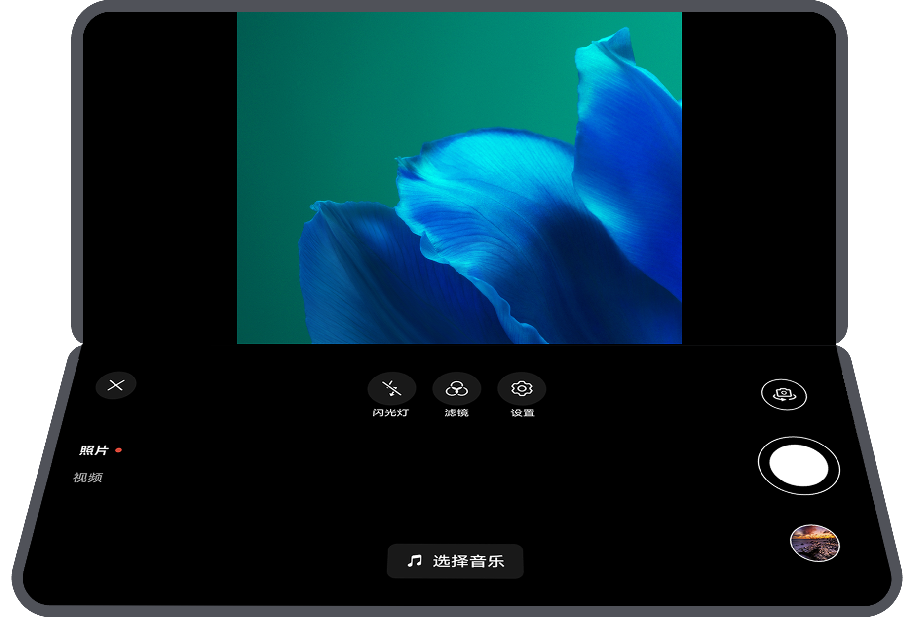


### 开发步骤

使用display.on('foldStatus')监听折叠状态的变化。当折叠状态为半折叠且屏幕显示方向为横屏或反向横屏时，记录悬停状态isHalfFolded为true，重新计算Xcomponent的Surface显示区域宽高并调整旋转策略，展示悬停态的相机页面布局；否则，记录悬停态状态为false。


```kotlin
1. onFoldStatusChange: (foldStatus: display.FoldStatus) => void = (foldStatus: display.FoldStatus) => {
2.  if (foldStatus === display.FoldStatus.FOLD_STATUS_HALF_FOLDED) {
3.  let orientation: display.Orientation = display.getDefaultDisplaySync().orientation;
4.  // Determine the page layout that has entered half folded status and prohibit portrait orientation.
5.  if (this.widthBp === WidthBreakpoint.WIDTH_MD && (orientation === display.Orientation.LANDSCAPE ||
6.  orientation === display.Orientation.LANDSCAPE_INVERTED)) {
7.  this.isHalfFolded = true;
8.  this.windowUtil.setMainWindowOrientation(window.Orientation.LANDSCAPE);
9.  this.cameraUtil.setHalfFoldedRect(this.windowUtil.getWindowSize());
10.  } else {
11.  if (this.oldFoldStatus === display.FoldStatus.FOLD_STATUS_FOLDED) {
12.  if (this.isFront) {
13.  this.cameraUtil.cameraShooting(this.surfaceId, this.context!, camera.CameraPosition.CAMERA_POSITION_FRONT);
14.  } else {
15.  this.cameraUtil.cameraShooting(this.surfaceId, this.context!, camera.CameraPosition.CAMERA_POSITION_BACK);
16.  }
17.  }
18.  }
19.  return;
20.  }
21.  if (this.widthBp !== WidthBreakpoint.WIDTH_SM) {
22.  this.windowUtil.setMainWindowOrientation(window.Orientation.AUTO_ROTATION_RESTRICTED);
23.  }
24.  // Exit the half folded status page.
25.  if (this.isHalfFolded) {
26.  this.isHalfFolded = false;
27.  this.cameraUtil.setXComponentRect(this.windowUtil.getWindowSize());
28.  } else {
29.  if (foldStatus === display.FoldStatus.FOLD_STATUS_FOLDED ||
30.  (this.oldFoldStatus === display.FoldStatus.FOLD_STATUS_EXPANDED_WITH_SECOND_HALF_FOLDED &&
31.  foldStatus === display.FoldStatus.FOLD_STATUS_EXPANDED) ||
32.  (this.oldFoldStatus === display.FoldStatus.FOLD_STATUS_EXPANDED &&
33.  foldStatus === display.FoldStatus.FOLD_STATUS_EXPANDED_WITH_SECOND_HALF_FOLDED)) {
34.  if (this.isFront) {
35.  this.cameraUtil.cameraShooting(this.surfaceId, this.context!, camera.CameraPosition.CAMERA_POSITION_FRONT);
36.  } else {
37.  this.cameraUtil.cameraShooting(this.surfaceId, this.context!, camera.CameraPosition.CAMERA_POSITION_BACK);
38.  }
39.  }
40.  }
41.  this.oldFoldStatus = foldStatus;
42. }

```


[Index.ets](https://gitcode.com/harmonyos_samples/MultiDeviceCamera/blob/master/entry/src/main/ets/pages/Index.ets#L49-L95)


## 常见问题


### 按钮大小异常、被截断

**问题现象**


在不同设备上显示按钮大小异常或被截断。


**可能原因**


未设计不同设备对应的多套相机页面布局。


**解决方案**


针对不同横向断点设计多套相机页面布局并实现。详情请参考[通过断点实现多套页面布局](https://developer.huawei.com/consumer/cn/doc/best-practices/bpta-multi-device-camera#section181143569262)。


### 大屏相机页面的可操作组件不支持旋转

**问题现象**


在三折叠G态、双折叠展开态、平板等大屏幕，相机页面的可操作组件不支持旋转，不易操作。


**可能原因**


未设置窗口支持旋转。


**解决方案**


相机页面的横向断点为sm时，不支持旋转；为md、lg时，支持旋转。因此当窗口宽度、高度的最小值大于等于600vp时，窗口支持旋转。详情请参考[通过断点实现多套页面布局](https://developer.huawei.com/consumer/cn/doc/best-practices/bpta-multi-device-camera#section181143569262)。


### 预览画面压缩、拉伸

**问题现象**


预览画面的显示内容被压缩或拉伸。


**可能原因**


相机预览对象绑定XComponent组件时，未正确设置Surface区域宽高的值，导致宽高比与预览流旋转后的宽高比不一致。


**解决方案**


设置XComponent组件对应Surface区域的宽高比，使其与预览流旋转后的宽高比保持一致。详情请参考[设置多设备上相机预览画面比例](https://developer.huawei.com/consumer/cn/doc/best-practices/bpta-multi-device-camera#section882216138497)。


### 拍完照片显示角度异常

**问题现象**


拍摄完成后，照片的实际内容与预期方向不符，可能发生90°、180°或270°的旋转，导致用户需要手动调整才能正常查看。


**可能原因**


拍照时旋转了设备，且未设置正确的拍照角度。


**解决方案**


设置拍照时的旋转角度。详情请参考[设置拍照旋转角度](https://developer.huawei.com/consumer/cn/doc/best-practices/bpta-multi-device-camera#section0752024124911)。


### 折叠屏切换折叠状态时出现黑屏

**问题现象**


在折叠屏开合，切换折叠状态后，相机预览页面出现黑屏。


**可能原因**


切换折叠状态过程，导致折叠前选择的相机不再可用，预览画面黑屏。


**解决方案**


折叠状态切换过程窗口尺寸会变化，通过监听窗口尺寸变化，重新选择相机生成预览流。详情请参考[选择相机设备](https://developer.huawei.com/consumer/cn/doc/best-practices/bpta-multi-device-camera#section13854163154917)。


## 示例代码

- [基于相机开放能力和一多能力实现多设备相机](https://gitcode.com/harmonyos_samples/MultiDeviceCamera)
