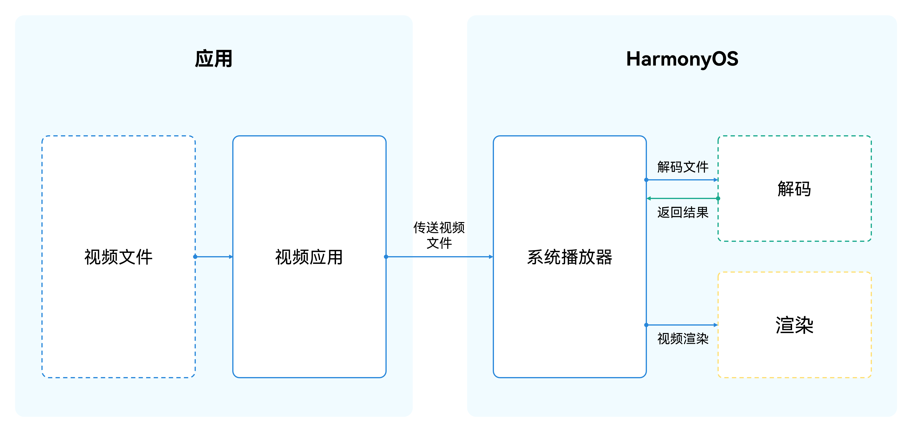
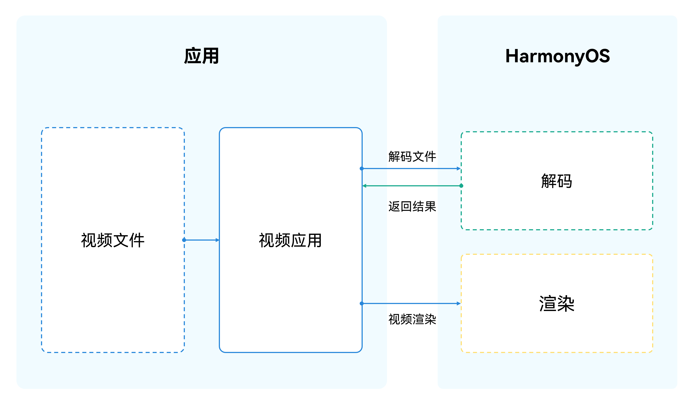
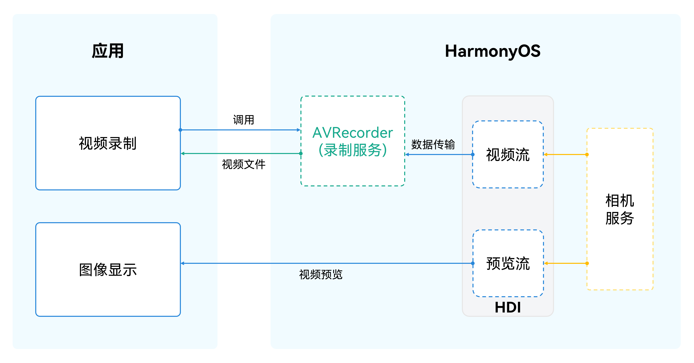
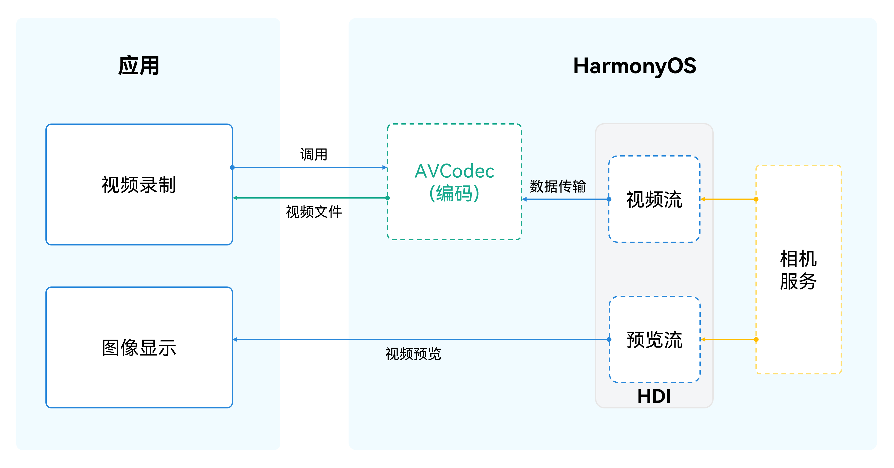

# HDR Vivid视频播放与录制开发实践

---

## 概述

HDR Vivid是高动态范围视频技术标准，中文名为“菁彩影像”。该标准旨在提供更丰富的色彩、更高的亮度和更深的对比度，从而为观众带来更加逼真的视觉体验。与传统的SDR（标准动态范围）视频相比，HDR Vivid视频能够展示更广泛的亮度范围和更细腻的色彩层次，使得画面更加生动和真实。它受亮度、对比度、色深、色域等因素影响，是一种提高画面亮度及对比度的画面处理技术。 其技术特点与优势包括：


- **高动态范围：**HDR Vivid通过更广的色域和更高的动态范围，使得画面能够容纳更多的细节和色彩层次。与传统的SDR相比，HDR Vivid的高光亮度是SDR的40倍，它能够同时呈现更深的黑色和更亮的白色，让画面的亮部和暗部细节更加清晰。
- **色彩丰富：**HDR Vivid支持10bit/12bit的色深，使得色彩过渡更加平滑，色彩表现更加细腻。色域面积相对BT.709标准增加了70%，色域越大证明能显示的颜色越多，HDR Vivid能够呈现更加真实的色彩，让用户感受到更加丰富的视觉体验。
- **智能优化：**作为一种动态HDR标准，HDR Vivid能够根据显示硬件和视频场景，逐帧动态优化画面的亮度、对比度和色彩。HDR Vivid使用动态元数据和智能映射引擎，将母版颜色容积映射到显示设备上，这种映射使得创作者的意图在不同显示设备上都得以保留，并且呈现最优画质效果，解决了传统制作和显示过程中色彩信息和亮度细节丢失的问题。


基于系统不同的能力，本文给开发者提供了以下场景：


- [基于AVPlayer播放HDR Vivid视频](https://developer.huawei.com/consumer/cn/doc/best-practices/bpta-hdrvivid#section14393732191416)
- [基于AVCodec解码播放HDR Vivid视频](https://developer.huawei.com/consumer/cn/doc/best-practices/bpta-hdrvivid#section584353512238)
- [基于AVRecorder录制HDR Vivid视频](https://developer.huawei.com/consumer/cn/doc/best-practices/bpta-hdrvivid#section1957156132414)
- [基于AVCodec编码录制HDR Vivid视频](https://developer.huawei.com/consumer/cn/doc/best-practices/bpta-hdrvivid#section85025284348)


## 基于AVPlayer播放HDR Vivid视频


### 实现原理

[AVPlayer](https://developer.huawei.com/consumer/cn/doc/harmonyos-references/arkts-apis-media-avplayer)提供功能完善的一体化播放能力，应用只需提供流媒体来源，无需数据解析和解码，即可实现播放效果。





### 开发步骤

具体开发步骤可参考最佳实践《[基于AVPlayer基础播控实践](https://developer.huawei.com/consumer/cn/doc/best-practices/bpta-avplayer-basic-control)》。


## 基于AVCodec解码播放HDR Vivid视频


### 实现原理

AVCodec模块中[视频解码](https://developer.huawei.com/consumer/cn/doc/harmonyos-guides/video-decoding)的Native API接口，可以完成视频解码功能，即将媒体数据在系统侧解码成YUV文件并送显至应用上。





### 开发步骤

使用系统解码器AVCodec开发HDR Vivid视频播放功能，主要开发步骤为（详细开发步骤可参考[HDR Vivid视频播放](https://developer.huawei.com/consumer/cn/doc/harmonyos-guides/hdr-vivid-video-player)）：


1. 调用[OH_VideoDecoder_CreateByMime()](https://developer.huawei.com/consumer/cn/doc/harmonyos-references/capi-native-avcodec-videodecoder-h#oh_videodecoder_createbymime)通过HEVC格式创建解码器实例对象。如果需要对HDR Vivid视频进行解码，需要配置MimeType为H265 (即OH_AVCODEC_MIMETYPE_VIDEO_HEVC)。
  
  
  

```cpp
1. // Create a decoder instance object
2. int32_t VideoDecoder::Create(const std::string &videoCodecMime) {
3.  decoder_ = OH_VideoDecoder_CreateByMime(videoCodecMime.c_str());
4.  CHECK_AND_RETURN_RET_LOG(decoder_ != nullptr, AVCODEC_SAMPLE_ERR_ERROR, "Create failed");
5.  return AVCODEC_SAMPLE_ERR_OK;
6. }

```
  [VideoDecoder.cpp](https://gitcode.com/HarmonyOS_Samples/AVCodecVideo/blob/master/entry/src/main/cpp/capbilities/VideoDecoder.cpp#L29-L34)

2. 调用[OH_VideoDecoder_RegisterCallback()](https://developer.huawei.com/consumer/cn/doc/harmonyos-references/capi-native-avcodec-videodecoder-h#oh_videodecoder_registercallback)设置回调函数。
  
  
  

```cpp
1. // Setting the callback function
2. int32_t VideoDecoder::SetCallback(CodecUserData *codecUserData) {
3.  int32_t ret = AV_ERR_OK;
4.  ret = OH_VideoDecoder_RegisterCallback(decoder_,
5.  {SampleCallback::OnCodecError, SampleCallback::OnCodecFormatChange,
6.  SampleCallback::OnNeedInputBuffer, SampleCallback::OnNewOutputBuffer},
7.  codecUserData);
8.  CHECK_AND_RETURN_RET_LOG(ret == AV_ERR_OK, AVCODEC_SAMPLE_ERR_ERROR, "Set callback failed, ret: %{public}d", ret);
9.
10.  return AVCODEC_SAMPLE_ERR_OK;
11. }

```
  [VideoDecoder.cpp](https://gitcode.com/harmonyos_samples/AVCodecVideo/blob/master/entry/src/main/cpp/capbilities/VideoDecoder.cpp#L38-L48)

3. 调用[OH_VideoDecoder_Configure()](https://developer.huawei.com/consumer/cn/doc/harmonyos-references/capi-native-avcodec-videodecoder-h#oh_videodecoder_configure)配置解码器。
  
  
  

```cpp
1. // Setting the Decoder
2. int32_t VideoDecoder::Configure(const SampleInfo &sampleInfo) {
3.  // ...
4.  int ret = OH_VideoDecoder_Configure(decoder_, format);
5.  // ...
6. }

```
  [VideoDecoder.cpp](https://gitcode.com/harmonyos_samples/AVCodecVideo/blob/master/entry/src/main/cpp/capbilities/VideoDecoder.cpp#L52-L76)

4. 从[XComponent](https://developer.huawei.com/consumer/cn/doc/harmonyos-references/ts-basic-components-xcomponent)组件获取window参数，设置Surface，并调用[OH_VideoDecoder_Prepare()](https://developer.huawei.com/consumer/cn/doc/harmonyos-references/capi-native-avcodec-videodecoder-h#oh_videodecoder_prepare)使解码器就绪。
  
  
  

```cpp
1. int32_t VideoDecoder::Config(const SampleInfo &sampleInfo, CodecUserData *codecUserData) {
2.  // ...
3.  // SetSurface from video decoder
4.  if (sampleInfo.window != nullptr) {
5.  int ret = OH_VideoDecoder_SetSurface(decoder_, sampleInfo.window);
6.  CHECK_AND_RETURN_RET_LOG(ret == AV_ERR_OK && sampleInfo.window, AVCODEC_SAMPLE_ERR_ERROR,
7.  "Set surface failed, ret: %{public}d", ret);
8.  }
9.
10.  // ...
11.
12.  // Prepare video decoder
13.  {
14.  int ret = OH_VideoDecoder_Prepare(decoder_);
15.  CHECK_AND_RETURN_RET_LOG(ret == AV_ERR_OK, AVCODEC_SAMPLE_ERR_ERROR, "Prepare failed, ret: %{public}d", ret);
16.  }
17.
18.  return AVCODEC_SAMPLE_ERR_OK;
19. }

```
  [VideoDecoder.cpp](https://gitcode.com/harmonyos_samples/AVCodecVideo/blob/master/entry/src/main/cpp/capbilities/VideoDecoder.cpp#L80-L110)

5. 调用[OH_VideoDecoder_Start()](https://developer.huawei.com/consumer/cn/doc/harmonyos-references/capi-native-avcodec-videodecoder-h#oh_videodecoder_start)启动解码器。
  
  
  

```cpp
1. // Start the Decoder
2. int32_t VideoDecoder::Start() {
3.  CHECK_AND_RETURN_RET_LOG(decoder_ != nullptr, AVCODEC_SAMPLE_ERR_ERROR, "Decoder is null");
4.
5.  int ret = OH_VideoDecoder_Start(decoder_);
6.  CHECK_AND_RETURN_RET_LOG(ret == AV_ERR_OK, AVCODEC_SAMPLE_ERR_ERROR, "Start failed, ret: %{public}d", ret);
7.  return AVCODEC_SAMPLE_ERR_OK;
8. }

```
  [VideoDecoder.cpp](https://gitcode.com/harmonyos_samples/AVCodecVideo/blob/master/entry/src/main/cpp/capbilities/VideoDecoder.cpp#L114-L121)

6. 调用[OH_VideoDecoder_PushInputBuffer()](https://developer.huawei.com/consumer/cn/doc/harmonyos-references/capi-native-avcodec-videodecoder-h#oh_videodecoder_pushinputbuffer)写入解码流。
  
  
  

```cpp
1. // Write the decoded stream
2. int32_t VideoDecoder::PushInputBuffer(CodecBufferInfo &info) {
3.  CHECK_AND_RETURN_RET_LOG(decoder_ != nullptr, AVCODEC_SAMPLE_ERR_ERROR, "Decoder is null");
4.  int32_t ret = OH_VideoDecoder_PushInputBuffer(decoder_, info.bufferIndex);
5.  CHECK_AND_RETURN_RET_LOG(ret == AV_ERR_OK, AVCODEC_SAMPLE_ERR_ERROR, "Push input data failed");
6.  return AVCODEC_SAMPLE_ERR_OK;
7. }

```
  [VideoDecoder.cpp](https://gitcode.com/harmonyos_samples/AVCodecVideo/blob/master/entry/src/main/cpp/capbilities/VideoDecoder.cpp#L125-L131)

7. 调用[OH_VideoDecoder_RenderOutputBuffer()](https://developer.huawei.com/consumer/cn/doc/harmonyos-references/capi-native-avcodec-videodecoder-h#oh_videodecoder_renderoutputbuffer)渲染并释放解码帧。
  
  
  

```cpp
1. // Render and release decoded frames
2. int32_t VideoDecoder::FreeOutputBuffer(uint32_t bufferIndex, bool render) {
3.  CHECK_AND_RETURN_RET_LOG(decoder_ != nullptr, AVCODEC_SAMPLE_ERR_ERROR, "Decoder is null");
4.
5.  int32_t ret = AVCODEC_SAMPLE_ERR_OK;
6.  if (render) {
7.  ret = OH_VideoDecoder_RenderOutputBuffer(decoder_, bufferIndex);
8.  } else {
9.  ret = OH_VideoDecoder_FreeOutputBuffer(decoder_, bufferIndex);
10.  }
11.  CHECK_AND_RETURN_RET_LOG(ret == AV_ERR_OK, AVCODEC_SAMPLE_ERR_ERROR, "Free output data failed");
12.  return AVCODEC_SAMPLE_ERR_OK;
13. }

```
  [VideoDecoder.cpp](https://gitcode.com/harmonyos_samples/AVCodecVideo/blob/master/entry/src/main/cpp/capbilities/VideoDecoder.cpp#L135-L147)

8. 最后调用[OH_VideoDecoder_Destroy()](https://developer.huawei.com/consumer/cn/doc/harmonyos-references/capi-native-avcodec-videodecoder-h#oh_videodecoder_destroy)销毁解码器实例，释放资源。
  
  
  

```cpp
1. // Destroy the decoder instance and release resources
2. int32_t VideoDecoder::Release() {
3.  if (decoder_ != nullptr) {
4.  OH_VideoDecoder_Flush(decoder_);
5.  OH_VideoDecoder_Stop(decoder_);
6.  OH_VideoDecoder_Destroy(decoder_);
7.  decoder_ = nullptr;
8.  }
9.  return AVCODEC_SAMPLE_ERR_OK;
10. }

```
  [VideoDecoder.cpp](https://gitcode.com/harmonyos_samples/AVCodecVideo/blob/master/entry/src/main/cpp/capbilities/VideoDecoder.cpp#L151-L160)


## 基于AVRecorder录制HDR Vivid视频


### 实现原理

应用通过调用[AVRecorder](https://developer.huawei.com/consumer/cn/doc/harmonyos-guides/media-kit-intro#avrecorder)实现视频录制时，先通过Camera接口调用相机服务，通过视频HDI捕获图像数据送显至应用，同时送至AVRecorder的录制服务，录制服务将图像数据编码后封装至文件中，实现视频录制功能。流程图如下：





说明

AVRecorder不支持设置AVMetadata音视频元数据的HDR类型。


使用[Interface (CameraManager)](https://developer.huawei.com/consumer/cn/doc/harmonyos-references/arkts-apis-camera-cameramanager)+[Interface (AVRecorder)](https://developer.huawei.com/consumer/cn/doc/harmonyos-references/arkts-apis-media-avrecorder)录制HDR Vivid视频，与录制普通视频的区别主要在于：


- AVRecorder
  1. AVRecoder需要配置isHdr参数为true，对应的编码格式必须为video/hevc。


- Camera
  1. 相机创建video output实例时，选择yuv 10bit profile（CAMERA_FORMAT_YCRCB_P010）。
  2. HDR录像需要相机支持视频防抖功能。
  3. 相机会话配置颜色空间为BT2020_HLG_LIMIT。


### 开发步骤

针对原理中描述的四点不同，开发视频录制功能时，可参考以下步骤（详细开发步骤可参考[HDR Vivid相机录像(ArkTS)](https://developer.huawei.com/consumer/cn/doc/harmonyos-guides/camera-hdr-recording)）：


1. 调用[media.createAVRecorder()](https://developer.huawei.com/consumer/cn/doc/harmonyos-references/arkts-apis-media-f#mediacreateavrecorder9)创建AVRecorder实例。
  
  
  

```typescript
1. // Creating an AVRecorder Instance
2. try {
3.  this.avRecorder = await media.createAVRecorder();
4. } catch (error) {
5.  let err = error as BusinessError;
6.  Logger.error(TAG, `createAVRecorder call failed. error code: ${err.code}`);
7. }


```
  [Record.ets](https://gitcode.com/harmonyos_samples/camera-kit-avrecorder/blob/master/entry/src/main/ets/pages/Record.ets#L229-L235)

2. 配置预览流与录像输出流的分辨率为16:9，[AVRecorderProfile](https://developer.huawei.com/consumer/cn/doc/harmonyos-references/arkts-apis-media-i#avrecorderprofile9)参数中的变量isHdr为True，videoCodec为VIDEO_HEVC格式，以录制HDR Vivid视频。
  
  
  

```typescript
1. let videoSize: camera.Size = {
2.  width: 1920,
3.  height: 1080
4. }
5.
6. let videoProfile: undefined | camera.VideoProfile = videoProfilesArray.find((profile: camera.VideoProfile) => {
7.  return profile.size.width === videoSize.width && profile.size.height === videoSize.height;
8. });
9. if (!videoProfile) {
10.  Logger.error(TAG, 'videoProfile is not found');
11.  return;
12. }
13.
14. let aVRecorderProfile: media.AVRecorderProfile = {
15.  // ...
16.  videoCodec: media.CodecMimeType.VIDEO_HEVC,
17.  // ...
18. };


```
  [Record.ets](https://gitcode.com/harmonyos_samples/camera-kit-avrecorder/blob/master/entry/src/main/ets/pages/Record.ets#L173-L207)

3. 调用[createVideoOutput()](https://developer.huawei.com/consumer/cn/doc/harmonyos-references/arkts-apis-camera-cameramanager#createvideooutput)创建VideoOutput实例，选择yuv 10bit profile。
  
  
  

```typescript
1. let videoProfile: undefined | camera.VideoProfile = videoProfilesArray.find((profile: camera.VideoProfile) => {
2.  return profile.size.width === videoSize.width && profile.size.height === videoSize.height &&
3.  profile.format === camera.CameraFormat.CAMERA_FORMAT_YCRCB_P010;
4. });
5.
6. let previewProfile: undefined | camera.Profile = previewProfilesArray.find((profile: camera.Profile) => {
7.  return profile.format === camera.CameraFormat.CAMERA_FORMAT_YCRCB_P010 &&
8.  profile.size.width === videoSize.width && profile.size.height == videoSize.height
9. });
10.
11. // ...
12.
13. // ...
14.
15. try {
16.  await this.avRecorder.prepare(avRecorderConfig);
17. } catch (error) {
18.  let err = error as BusinessError;
19.  Logger.error(TAG, `prepare call failed. error code: ${err.code}`);
20. }
21.
22. let videoSurfaceId: string | undefined = undefined;
23. try {
24.  videoSurfaceId = await this.avRecorder.getInputSurface();
25. } catch (error) {
26.  let err = error as BusinessError;
27.  Logger.error(TAG, `getInputSurface call failed. error code: ${err.code}`);
28. }
29. if (videoSurfaceId === undefined) {
30.  return;
31. }
32.
33. try {
34.  this.videoOutput = this.cameraManager.createVideoOutput(videoProfile, videoSurfaceId);
35. } catch (error) {
36.  let err = error as BusinessError;
37.  Logger.error(TAG, `Failed to create the videoOutput instance. error: ${JSON.stringify(err)}`);
38. }


```
  [Record.ets](https://gitcode.com/harmonyos_samples/BestPracticeSnippets/blob/master/HDRVivid/AVRecorder/entry/src/main/ets/pages/Record.ets#L185-L253)

4. 创建并配置普通录像模式（[Interface (VideoSession)](https://developer.huawei.com/consumer/cn/doc/harmonyos-references/arkts-apis-camera-videosession)）的相机会话。
  
  
  

```typescript
1. // Create and configure a camera session
2. try {
3.  this.captureSession = this.cameraManager.createSession(camera.SceneMode.NORMAL_VIDEO) as camera.VideoSession;
4. } catch (error) {
5.  // ...
6. }
7. // ...
8.
9. try {
10.  this.captureSession.beginConfig();
11. } catch (error) {
12.  // ...
13. }
14.
15. // ...
16.
17. try {
18.  await this.captureSession.commitConfig();
19. } catch (error) {
20.  // ...
21. }
22.
23. // ...
24.
25. try {
26.  await this.captureSession.start();
27. } catch (error) {
28.  let err = error as BusinessError;
29.  Logger.error(TAG, `captureSession start error: ${JSON.stringify(err)}`);
30. }


```
  [Record.ets](https://gitcode.com/harmonyos_samples/BestPracticeSnippets/blob/master/HDRVivid/AVRecorder/entry/src/main/ets/pages/Record.ets#L268-L427)
     同时设置视频防抖。


  
  
  

```typescript
1. let mode: camera.VideoStabilizationMode = camera.VideoStabilizationMode.AUTO;
2. // Check whether video anti-shake is supported
3. let isSupported: boolean = false;
4. try {
5.  isSupported = this.captureSession.isVideoStabilizationModeSupported(mode);
6.  Logger.info(TAG, `isVideoStabilizationModeSupported: ${JSON.stringify(isSupported)}`);
7. } catch (error) {
8.  // If the failure occurs, the error code error.code is returned and processed
9.  let err = error as BusinessError;
10.  Logger.error(`The isVideoStabilizationModeSupported call failed. error code: ${err.code}`);
11. }
12. if (isSupported) {
13.  try {
14.  // Setting video anti-shake
15.  this.captureSession.setVideoStabilizationMode(mode);
16.  let activeVideoStabilizationMode = this.captureSession.getActiveVideoStabilizationMode();
17.  Logger.info(`activeVideoStabilizationMode: ${activeVideoStabilizationMode}`);
18.  } catch (error) {
19.  let err = error as BusinessError;
20.  Logger.warn(TAG,
21.  `setVideoStabilizationMode or getActiveVideoStabilizationMode failed, code=${err.code}, message=${err.message}`);
22.  }
23. } else {
24.  Logger.error(`videoStabilizationMode: ${mode} is not support`);
25. }


```
  [Record.ets](https://gitcode.com/harmonyos_samples/BestPracticeSnippets/blob/master/HDRVivid/AVRecorder/entry/src/main/ets/pages/Record.ets#L361-L385)
     设置色彩空间属性。


  
  
  

```typescript
1. // Set the color space of the camera session to BT2020_HLG_LIMIT
2. if (isSupported) {
3.  let colorSpace: colorSpaceManager.ColorSpace = colorSpaceManager.ColorSpace.BT2020_HLG_LIMIT;
4.  let colorSpaces: Array<colorSpaceManager.ColorSpace> = [];
5.  try {
6.  colorSpaces = this.captureSession.getSupportedColorSpaces();
7.  } catch (error) {
8.  let err = error as BusinessError;
9.  Logger.error(`The getSupportedColorSpaces call failed. error code: ${err.code}`);
10.  }
11.  let isSupportedColorSpaces = colorSpaces.indexOf(colorSpace) >= 0;
12.  if (isSupportedColorSpaces) {
13.  Logger.info(`setColorSpace: ${colorSpace}`);
14.  try {
15.  this.captureSession.setColorSpace(colorSpace);
16.  } catch (error) {
17.  let err = error as BusinessError;
18.  Logger.error(`The setColorSpace call failed, error code: ${err.code}`);
19.  }
20.  try {
21.  let activeColorSpace: colorSpaceManager.ColorSpace = this.captureSession.getActiveColorSpace();
22.  Logger.info(`activeColorSpace: ${activeColorSpace}`);
23.  } catch (error) {
24.  let err = error as BusinessError;
25.  Logger.error(`getActiveColorSpace failed, code=${err.code}, message=${err.message}`);
26.  }
27.  } else {
28.  Logger.error(`colorSpace: ${colorSpace} is not support`);
29.  }
30. }


```
  [Record.ets](https://gitcode.com/harmonyos_samples/BestPracticeSnippets/blob/master/HDRVivid/AVRecorder/entry/src/main/ets/pages/Record.ets#L389-L418)

5. 启动video输出流。
  
  
  

```typescript
1. this.videoOutput.start((err: BusinessError) => {
2.  if (err) {
3.  Logger.error(TAG, `Failed to start the video output. error: ${JSON.stringify(err)}`);
4.  return;
5.  }
6.  Logger.info(TAG, 'Callback invoked to indicate the video output start success.');
7. });


```
  [Record.ets](https://gitcode.com/harmonyos_samples/camera-kit-avrecorder/blob/master/entry/src/main/ets/pages/Record.ets#L382-L388)

6. 启动recorder进行录制。
  
  
  

```typescript
1. async startRecord() {
2.  if (this.avRecorder) {
3.  try {
4.  await this.avRecorder.start();
5.  } catch (error) {
6.  let err = error as BusinessError;
7.  Logger.error(TAG, `avRecorder start error: ${JSON.stringify(err)}`);
8.  }
9.  }
10. }


```
  [Record.ets](https://gitcode.com/harmonyos_samples/camera-kit-avrecorder/blob/master/entry/src/main/ets/pages/Record.ets#L393-L403)


## 基于AVCodec编码录制HDR Vivid视频


### 实现原理

应用通过调用AVCodec实现视频录制时，先通过Camera接口调用相机服务，通过视频HDI捕获图像数据送显至应用，同时送至AVCodec的编码模块将图像数据编码后封装至文件中，实现视频录制功能。流程图如下：





使用[Interface (CameraManager)](https://developer.huawei.com/consumer/cn/doc/harmonyos-references/arkts-apis-camera-cameramanager)+AVCodec录制HDR Vivid视频，与录制普通视频的区别主要在于：


- AVCodec
  1. 视频编码器AVCodec需要选择HEVC格式，并配置profile为HEVC_PROFILE_MAIN_10的相机底层。
  2. 编码器AVCodec配置颜色相关参数为COLOR_PRIMARY_BT2020。
- Camera
  1. 相机在创建video output实例时，选择yuv 10bit profile。
  2. HDR录像需要相机支持视频防抖功能，并配置颜色空间为BT2020_HLG_LIMIT。


### 开发步骤

针对以上四点不同，使用Camera+AVCodec开发HDR Vivid视频录制功能时，可参考以下步骤（详细开发步骤可参考[HDR Vivid视频录制](https://developer.huawei.com/consumer/cn/doc/harmonyos-guides/hdr-vivid-video-recorder)）：


1. 调用[OH_VideoEncoder_CreateByMime()](https://developer.huawei.com/consumer/cn/doc/harmonyos-references/capi-native-avcodec-videoencoder-h#oh_videoencoder_createbymime)根据MIME类型创建HEVC格式视频编码器并初始化。
  
  
  

```cpp
1. // Create a video coder and initialize it
2. int32_t VideoEncoder::Create(const std::string &videoCodecMime) {
3.  encoder_ = OH_VideoEncoder_CreateByMime(videoCodecMime.c_str());
4.  CHECK_AND_RETURN_RET_LOG(encoder_ != nullptr, AVCODEC_SAMPLE_ERR_ERROR, "Create failed");
5.  return AVCODEC_SAMPLE_ERR_OK;
6. }


```
  [VideoEncoder.cpp](https://gitcode.com/harmonyos_samples/AVCodecVideo/blob/master/entry/src/main/cpp/capbilities/VideoEncoder.cpp#L24-L29)

2. 配置HDR Vivid相关参数，包括可选配置视频帧宽度、视频帧高度、视频颜色格式，以及必须配置为HEVC_PROFILE_MAIN_10的[OH_HEVCProfile()](https://developer.huawei.com/consumer/cn/doc/harmonyos-references/capi-native-avcodec-base-h#oh_hevcprofile)，表示HEVC编码档次为10bit主档次。
  
  
  

```cpp
1. int32_t VideoEncoder::Configure(const SampleInfo &sampleInfo) {
2.  // ...
3.  // Setting HDRVivid-related parameters
4.  if (sampleInfo.isHDRVivid) {
5.  OH_AVFormat_SetIntValue(format, OH_MD_KEY_I_FRAME_INTERVAL, sampleInfo.iFrameInterval);
6.  OH_AVFormat_SetIntValue(format, OH_MD_KEY_RANGE_FLAG, sampleInfo.rangFlag);
7.  OH_AVFormat_SetIntValue(format, OH_MD_KEY_COLOR_PRIMARIES, sampleInfo.primary);
8.  OH_AVFormat_SetIntValue(format, OH_MD_KEY_TRANSFER_CHARACTERISTICS, sampleInfo.transfer);
9.  OH_AVFormat_SetIntValue(format, OH_MD_KEY_MATRIX_COEFFICIENTS, sampleInfo.matrix);
10.  }
11.  // ...
12. }


```
  [VideoEncoder.cpp](https://gitcode.com/harmonyos_samples/AVCodecVideo/blob/master/entry/src/main/cpp/capbilities/VideoEncoder.cpp#L117-L160)

3. 使用[OH_VideoEncoder_Configure()](https://developer.huawei.com/consumer/cn/doc/harmonyos-references/capi-native-avcodec-videoencoder-h#oh_videoencoder_configure)配置编码器。
  
  
  

```cpp
1. // Setting the Encoder
2. int ret = OH_VideoEncoder_Configure(encoder_, format);


```
  [VideoEncoder.cpp](https://gitcode.com/harmonyos_samples/AVCodecVideo/blob/master/entry/src/main/cpp/capbilities/VideoEncoder.cpp#L151-L152)

4. ArkTS侧调用[createVideoOutput()](https://developer.huawei.com/consumer/cn/doc/harmonyos-references/arkts-apis-camera-cameramanager#createvideooutput)创建VideoOutput实例，选择yuv 10bit profile。
  
  
  

```typescript
1. export function videoProfileCheck(cameraManager: camera.CameraManager,
2.  cameraData: CameraDataModel): undefined | camera.VideoProfile {
3.  let cameraDevices = cameraManager.getSupportedCameras();
4.  // ...
5.
6.  let profiles: camera.CameraOutputCapability =
7.  cameraManager.getSupportedOutputCapability(cameraDevices[0], camera.SceneMode.NORMAL_VIDEO);
8.  // ...
9.
10.  let videoProfiles: Array<camera.VideoProfile> = profiles.videoProfiles;
11.  // ...
12.
13.  let videoProfile: undefined | camera.VideoProfile = videoProfiles.find((profile: camera.VideoProfile) => {
14.  if (cameraData.isHDRVivid) {
15.  // ...
16.  return profile.size.width === cameraData.cameraWidth &&
17.  profile.size.height === cameraData.cameraHeight &&
18.  profile.format === camera.CameraFormat.CAMERA_FORMAT_YCBCR_P010 &&
19.  profile.frameRateRange.min === 1 &&
20.  profile.frameRateRange.max === 30;
21.  // ...
22.  } else {
23.  // ...
24.  }
25.  });
26.  return videoProfile;
27. }


```
  [CameraCheck.ets](https://gitcode.com/HarmonyOS_Samples/AVCodecVideo/blob/master/entry/src/main/ets/common/utils/CameraCheck.ets#L74-L139)

  
  
  

```typescript
1. let videoProfile: undefined | camera.VideoProfile = videoProfileCheck(cameraManager, params);
2. if (!videoProfile) {
3.  Logger.error(TAG, 'videoProfile is not found!');
4.  return;
5. }
6.
7. // ...
8.
9. // Create the encoder output object
10. encoderVideoOutput = cameraManager.createVideoOutput(videoProfile, params.surfaceId);
11. if (encoderVideoOutput === undefined) {
12.  Logger.error(TAG, 'encoderVideoOutput is undefined');
13.  return;
14. }
15. Logger.info(TAG, 'encoderVideoOutput success');


```
  [Recorder.ets](https://gitcode.com/harmonyos_samples/AVCodecVideo/blob/master/entry/src/main/ets/pages/Recorder.ets#L215-L238)

5. 设置视频防抖。
  
  
  

```typescript
1. function isVideoStabilizationModeSupported(session: camera.VideoSession, mode: camera.VideoStabilizationMode): boolean {
2.  let isSupported: boolean = false;
3.  try {
4.  isSupported = session.isVideoStabilizationModeSupported(mode);
5.  } catch (error) {
6.  // Failed to return error code error. code and handle it.
7.  let err = error as BusinessError;
8.  Logger.error(TAG, `The isVideoStabilizationModeSupported call failed. error code: ${err.code}`);
9.  }
10.  return isSupported;
11. }
12.
13. function setVideoStabilizationMode(session: camera.VideoSession): boolean {
14.  let mode: camera.VideoStabilizationMode = camera.VideoStabilizationMode.AUTO;
15.  // Check if video stabilization is supported.
16.  let isSupported: boolean = isVideoStabilizationModeSupported(session, mode);
17.  if (isSupported) {
18.  Logger.info(TAG, `setVideoStabilizationMode: ${mode}`);
19.  try {
20.  // Setting video anti-shake
21.  session.setVideoStabilizationMode(mode);
22.  let activeVideoStabilizationMode = session.getActiveVideoStabilizationMode();
23.  Logger.info(TAG, `activeVideoStabilizationMode: ${activeVideoStabilizationMode}`);
24.  } catch (error) {
25.  hilog.error(0x0000, TAG, `setVideoStabilizationMode catch error, code: ${error.code}, message: ${error.message}`);
26.  }
27.  } else {
28.  Logger.info(TAG, `videoStabilizationMode: ${mode} is not support`);
29.  }
30.  return isSupported;
31. }


```
  [Recorder.ets](https://gitcode.com/harmonyos_samples/AVCodecVideo/blob/master/entry/src/main/ets/pages/Recorder.ets#L71-L101)
     设置色彩空间。


  
  
  

```typescript
1. function getSupportedColorSpaces(session: camera.VideoSession): Array<colorSpaceManager.ColorSpace> {
2.  let colorSpaces: Array<colorSpaceManager.ColorSpace> = [];
3.  try {
4.  colorSpaces = session.getSupportedColorSpaces();
5.  } catch (error) {
6.  let err = error as BusinessError;
7.  Logger.error(TAG, `The getSupportedColorSpaces call failed. error code: ${err.code}`);
8.  }
9.  return colorSpaces;
10. }
11.
12. // Set the color space
13. function setColorSpaceBeforeCommitConfig(session: camera.VideoSession, isHdr: number): void {
14.  try {
15.  let colorSpace: colorSpaceManager.ColorSpace =
16.  isHdr ? colorSpaceManager.ColorSpace.BT2020_HLG_LIMIT : colorSpaceManager.ColorSpace.BT709_LIMIT;
17.  let colorSpaces: Array<colorSpaceManager.ColorSpace> = getSupportedColorSpaces(session);
18.  let isSupportedColorSpaces = colorSpaces.indexOf(colorSpace) >= 0;
19.  if (isSupportedColorSpaces) {
20.  Logger.info(TAG, `setColorSpace: ${colorSpace}`);
21.  session.setColorSpace(colorSpace);
22.  let activeColorSpace: colorSpaceManager.ColorSpace = session.getActiveColorSpace();
23.  Logger.info(TAG, `activeColorSpace: ${activeColorSpace}`);
24.  } else {
25.  Logger.info(TAG, `colorSpace: ${colorSpace} is not support`);
26.  }
27.  } catch (error) {
28.  hilog.error(0x0000, TAG, `setColorSpace catch error, code: ${error.code}, message: ${error.message}`);
29.  }
30. }


```
  [Recorder.ets](https://gitcode.com/harmonyos_samples/AVCodecVideo/blob/master/entry/src/main/ets/pages/Recorder.ets#L105-L134)

6. 创建并配置相机会话。
  
  
  

```typescript
1. let XComponentPreviewProfile: camera.Profile | undefined = previewProfileCameraCheck(cameraManager, params);
2. if (XComponentPreviewProfile === undefined) {
3.  Logger.error(TAG, 'XComponentPreviewProfile is not found');
4.  return;
5. }
6. // ...
7.
8. // Create a session flow
9. try {
10.  videoSession = cameraManager.createSession(camera.SceneMode.NORMAL_VIDEO) as camera.VideoSession;
11. } catch (error) {
12.  let err = error as BusinessError;
13.  Logger.error(TAG, `Failed to create the session instance. error: ${JSON.stringify(err)}`);
14. }
15. // ...
16.
17. // Start Configuring the session.
18. try {
19.  videoSession.beginConfig();
20. } catch (error) {
21.  // ...
22. }
23. // ...
24.  let err = error as BusinessError;
25.  Logger.error(TAG, `Failed to add cameraInput. error: ${JSON.stringify(err)}`);
26.  // ...
27. // Add the XComponent preview stream to the session.
28. try {
29.  videoSession.addOutput(XComponentPreviewOutput);
30. } catch (error) {
31.  // ...
32. }
33.
34. // Add the encoder video stream to the session.
35. try {
36.  videoSession.addOutput(encoderVideoOutput);
37. } catch (error) {
38.  // ...
39. }
40.
41. // Submit configuration information.
42. try {
43.  await videoSession.commitConfig();
44. } catch (error) {
45.  // ...
46. }
47.
48. // Set video stabilization.
49. if (setVideoStabilizationMode(videoSession)) {
50.  // Set color space.
51.  setColorSpaceBeforeCommitConfig(videoSession, params.isHDRVivid);
52. }
53.
54. // Session start.
55. try {
56.  await videoSession.start();
57. } catch (error) {
58.  // ...
59. }
60.
61. // Start the video output stream
62. encoderVideoOutput.start((err: BusinessError) => {
63.  // ...
64. });


```
  [Recorder.ets](https://gitcode.com/harmonyos_samples/AVCodecVideo/blob/master/entry/src/main/ets/pages/Recorder.ets#L224-L363)

7. 调用[OH_AVMuxer_Create()](https://developer.huawei.com/consumer/cn/doc/harmonyos-references/capi-native-avmuxer-h#oh_avmuxer_create)创建AVMuxer封装器实例对象，设置封装格式及封装路径，配置HDR Vivid相关参数。
  
  
  

```cpp
1. // Create an encapsulator instance object and set the encapsulation format to mp4
2. int32_t Muxer::Create(int32_t fd) {
3.  muxer_ = OH_AVMuxer_Create(fd, AV_OUTPUT_FORMAT_MPEG_4);
4.  CHECK_AND_RETURN_RET_LOG(muxer_ != nullptr, AVCODEC_SAMPLE_ERR_ERROR, "Muxer create failed, fd: %{public}d", fd);
5.  return AVCODEC_SAMPLE_ERR_OK;
6. }
7.
8. int32_t Muxer::Config(SampleInfo &sampleInfo) {
9.  CHECK_AND_RETURN_RET_LOG(muxer_ != nullptr, AVCODEC_SAMPLE_ERR_ERROR, "Muxer is null");
10.
11.  OH_AVFormat *formatAudio = OH_AVFormat_CreateAudioFormat(sampleInfo.audioCodecMime.data(),
12.  sampleInfo.audioSampleRate, sampleInfo.audioChannelCount);
13.  CHECK_AND_RETURN_RET_LOG(formatAudio != nullptr, AVCODEC_SAMPLE_ERR_ERROR, "Create audio format failed");
14.  OH_AVFormat_SetIntValue(formatAudio, OH_MD_KEY_PROFILE, AAC_PROFILE_LC);
15.  int32_t ret = OH_AVMuxer_AddTrack(muxer_, &audioTrackId_, formatAudio);
16.  OH_AVFormat_Destroy(formatAudio);
17.
18.  OH_AVFormat *formatVideo =
19.  OH_AVFormat_CreateVideoFormat(sampleInfo.videoCodecMime.data(), sampleInfo.videoWidth, sampleInfo.videoHeight);
20.  CHECK_AND_RETURN_RET_LOG(formatVideo != nullptr, AVCODEC_SAMPLE_ERR_ERROR, "Create video format failed");
21.
22.  OH_AVFormat_SetDoubleValue(formatVideo, OH_MD_KEY_FRAME_RATE, sampleInfo.frameRate);
23.  OH_AVFormat_SetIntValue(formatVideo, OH_MD_KEY_WIDTH, sampleInfo.videoWidth);
24.  OH_AVFormat_SetIntValue(formatVideo, OH_MD_KEY_HEIGHT, sampleInfo.videoHeight);
25.  OH_AVFormat_SetStringValue(formatVideo, OH_MD_KEY_CODEC_MIME, sampleInfo.videoCodecMime.data());
26.  if (sampleInfo.isHDRVivid) {
27.  OH_AVFormat_SetIntValue(formatVideo, OH_MD_KEY_VIDEO_IS_HDR_VIVID, 1);
28.  OH_AVFormat_SetIntValue(formatVideo, OH_MD_KEY_RANGE_FLAG, sampleInfo.rangFlag);
29.  OH_AVFormat_SetIntValue(formatVideo, OH_MD_KEY_COLOR_PRIMARIES, sampleInfo.primary);
30.  OH_AVFormat_SetIntValue(formatVideo, OH_MD_KEY_TRANSFER_CHARACTERISTICS, sampleInfo.transfer);
31.  OH_AVFormat_SetIntValue(formatVideo, OH_MD_KEY_MATRIX_COEFFICIENTS, sampleInfo.matrix);
32.  }
33.
34.  ret = OH_AVMuxer_AddTrack(muxer_, &videoTrackId_, formatVideo);
35.  OH_AVFormat_Destroy(formatVideo);
36.  formatVideo = nullptr;
37.  OH_AVMuxer_SetRotation(muxer_, CAMERA_ANGLE);
38.  CHECK_AND_RETURN_RET_LOG(ret == AV_ERR_OK, AVCODEC_SAMPLE_ERR_ERROR, "AddTrack failed");
39.  return AVCODEC_SAMPLE_ERR_OK;
40. }


```
  [Muxer.cpp](https://gitcode.com/HarmonyOS_Samples/AVCodecVideo/blob/master/entry/src/main/cpp/capbilities/Muxer.cpp#L31-L70)

8. 调用[OH_VideoEncoder_Start()](https://developer.huawei.com/consumer/cn/doc/harmonyos-references/capi-native-avcodec-videoencoder-h#oh_videoencoder_start)启动编码器。
  
  
  

```cpp
1. // Start Encoder
2. int32_t VideoEncoder::Start() {
3.  CHECK_AND_RETURN_RET_LOG(encoder_ != nullptr, AVCODEC_SAMPLE_ERR_ERROR, "Encoder is null");
4.
5.  int ret = OH_VideoEncoder_Start(encoder_);
6.  CHECK_AND_RETURN_RET_LOG(ret == AV_ERR_OK, AVCODEC_SAMPLE_ERR_ERROR, "Start failed, ret: %{public}d", ret);
7.  return AVCODEC_SAMPLE_ERR_OK;
8. }


```
  [VideoEncoder.cpp](https://gitcode.com/harmonyos_samples/AVCodecVideo/blob/master/entry/src/main/cpp/capbilities/VideoEncoder.cpp#L57-L64)


## 常见问题


### 在播放HDR Vivid视频时，如何调节视频的亮度

方案1：可以参考文档使用[hdrBrightness()](https://developer.huawei.com/consumer/cn/doc/harmonyos-references/ts-basic-components-xcomponent#hdrbrightness20)实现用于调整组件播放HDR视频的亮度。


方案2：参考《[基于AVPlayer播放长视频实践](https://developer.huawei.com/consumer/cn/doc/best-practices/bpta-avplayer-long-video)》中[亮度控制](https://developer.huawei.com/consumer/cn/doc/best-practices/bpta-avplayer-long-video#section512331617222)章节。


### 在播放视频前，如何判断一个视频是否为HDR类型视频

可通过avMetadataExtractor.fetchMetadata()获取视频信息AVMetadata，该信息中hdrType字段为AV_HDR_TYPE_NONE或者AV_HDR_TYPE_VIVID，以此来判断是不是HDR Vivid类型视频。


## 示例代码

- [实现HDR视频转码SDR视频功能](https://gitcode.com/harmonyos_samples/hdr2sdr/tree/master/)
