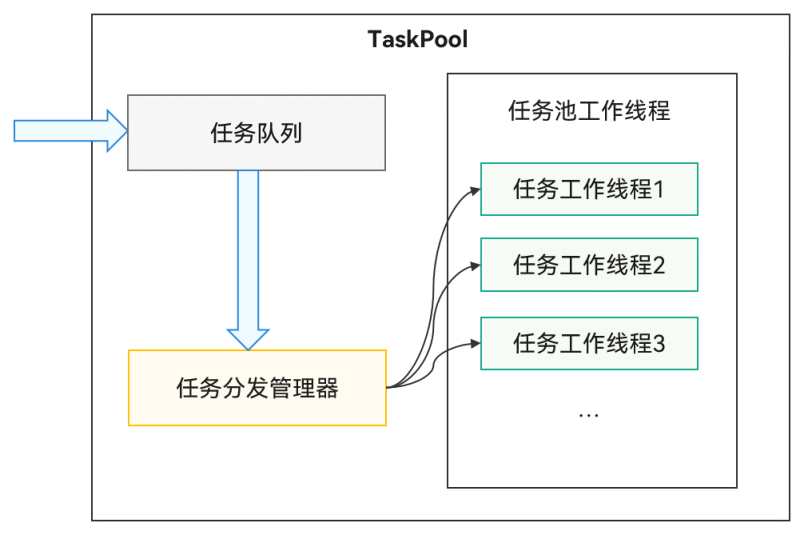
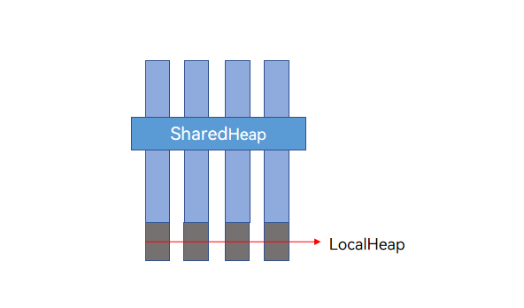

# 多线程操作密集型关系型数据库和文件读写

## 概述

应用中的每个进程都会有一个主线程，主线程主要承担执行UI绘制操作、管理ArkTS引擎实例的创建和销毁、分发和处理事件、管理Ability生命周期等职责，具体可参见[线程模型概述](https://developer.huawei.com/consumer/cn/doc/harmonyos-guides/thread-model-stage)。在主线程中执行耗时操作将会引起UI绘制卡顿，因此，开发应用时应当尽量避免将耗时的操作放在主线程中执行。ArkTS提供了多线程并发能力，多线程并发允许在同一时间段内同时执行多段代码，本文介绍如何利用多线程解决密集型文件和数据库读写时造成主线程阻塞的问题。


## 实现原理

在密集型读写操作时，由于系统会进行大量任务分发和数据拷贝，这两项任务均会阻塞主线程，系统提供了TaskPool和Sendable避免阻塞。


其中，任务池（TaskPool）旨在为应用程序构建多线程运行环境，它具有易用性，并且可以避免对于主线程的占用；Sendable对象则提供了并发实例间高效的通信效率，凭借其引用传递的能力，在多并发实例的数据交互等场景中可避免传统通信方式的效率低下问题，从而进一步提升系统在密集型读写这类复杂场景下的性能表现，为系统的高效稳定运行提供有力支持。


## 使用TaskPool进行读写

本章介绍使用TaskPool进行读写的方案，以及讨论其对于性能的提升。


### 实现原理

任务池（TaskPool）作用是为应用程序提供一个多线程的运行环境，降低整体资源的消耗、提高系统的整体性能，且开发者无需关心线程实例的生命周期。更多原理请详见[TaskPool简介](https://developer.huawei.com/consumer/cn/doc/harmonyos-guides/taskpool-introduction)。





TaskPool在执行密集型I/O读写方面具有以下优势：


1. 自动任务分发：当调用TaskPool执行密集型读写时，其线程池会自动将任务分发到子线程完成，无需人工干预，实现了高效的任务分配流程。
2. 不阻塞主线程：通过在子线程完成任务，有效避免了对主线程的阻塞，确保主线程能够继续执行其他操作，维持系统整体的流畅运行。
3. 资源节约：TaskPool本身通过系统统一线程管理，结合动态调度及负载均衡算法可节约系统资源，这也为执行密集型读写提供了更优的系统资源环境，保障操作的顺利进行。


### TaskPool文件读写

**开发步骤**


1. 封装write()函数，使用@Concurrent进行装饰，执行的并发函数需要使用该装饰器修饰，否则无法通过相关校验。
  
  
  

```typescript
1. @Concurrent
2. function writeFile(fd: number[], content: string, times: number) {
3.  for (let i: number = 0; i < times; i++) {
4.  fileIo.write(fd[i], content).catch(() => {
5.  hilog.error(0x0000, 'FileTaskPool', '%{public}s', 'writeFile error');
6.  });
7.  }
8. }

```
  [FileTaskPool.ets](https://gitcode.com/HarmonyOS_Samples/MultiThreadIO/blob/master/entry/src/main/ets/common/utils/FileTaskPool.ets#L22-L29)

2. 封装read()函数，同样地，也使用@Concurrent进行装饰。在读文件时使用循环读取，这也是大文件读取时常用的方法，使用Array<ArrayBuffer>存储一个大文件中的信息。
  
  
  

```typescript
1. @Concurrent
2. function readFile(fd: number[], path: string, fileName: string, times: number): Array<Array<ArrayBuffer>> {
3.  let result: Array<Array<ArrayBuffer>> = [];
4.  for (let i = 0; i < times; i++) {
5.  let buffSize: number = 4096;
6.  try {
7.  let state = fileIo.statSync(path + fileName + JSON.stringify(i) + CommonConstants.FILE_SUFFIX);
8.  if (state.size === 0){
9.  return result;
10.  }
11.  let buffer: ArrayBuffer = new ArrayBuffer(Math.min(buffSize, state.size));
12.  let off: number = 0;
13.  let len: number = fileIo.readSync(fd[i], buffer, { offset: off, length: buffSize });
14.  let readLen: number = 0;
15.  let bufferList: Array<ArrayBuffer> = [];
16.  while (len > 0) {
17.  readLen += len;
18.  bufferList.push(buffer);
19.  off = off + len;
20.  if ((state.size - readLen) < buffSize) {
21.  buffSize = state.size - readLen;
22.  }
23.  len = fileIo.readSync(fd[i], buffer, { offset: off, length: buffSize });
24.  }
25.  result.push(bufferList);
26.  } catch (error) {
27.  hilog.error(0x0000, 'FileTaskPool', '%{public}s', 'readFile error');
28.  }
29.  }
30.  return result;
31. }

```
  [FileTaskPool.ets](https://gitcode.com/HarmonyOS_Samples/MultiThreadIO/blob/master/entry/src/main/ets/common/utils/FileTaskPool.ets#L33-L63)

3. 使用taskpool.execute()执行任务时，传入的第一个参数是调用的函数名，其余参数则是该函数的参数。
  
  
  

```typescript
1. async write(): Promise<void> {
2.  try {
3.  await taskpool.execute(writeFile, this.fd, this.content, this.times);
4.  } catch (error) {
5.  hilog.error(0x0000, 'FileTaskPool', '%{public}s', 'write error');
6.  }
7.  // ...
8.  return;
9. }
10.
11. async read(): Promise<number> {
12.  try {
13.  let value = await taskpool.execute(readFile, this.fd, this.path, this.fileName,
14.  this.times) as object as Array<Array<ArrayBuffer>>;
15.  // ...
16.  return value.length;
17.  } catch (error) {
18.  hilog.error(0x0000, 'FileTaskPool', '%{public}s', 'read error');
19.  return 0;
20.  }
21. }

```
  [FileTaskPool.ets](https://gitcode.com/HarmonyOS_Samples/MultiThreadIO/blob/master/entry/src/main/ets/common/utils/FileTaskPool.ets#L98-L122)


### TaskPool关系型数据库读写

**开发步骤**


1. 封装关系型数据库的写数据库的函数，使用@Concurrent进行装饰。
  
  
  

```typescript
1. @Concurrent
2. async function insert(context: common.UIAbilityContext, valueBucket: Array<relationalStore.ValuesBucket>,
3.  config: relationalStore.StoreConfig) {
4.  try {
5.  const store = await relationalStore.getRdbStore(context, config);
6.  store.batchInsert('EMPLOYEE', valueBucket).catch(() => {
7.  hilog.error(0x0000, 'DatabaseTaskPool', '%{public}s', 'batchInsert error');
8.  });
9.  } catch (error) {
10.  hilog.error(0x0000, 'DatabaseTaskPool', '%{public}s', 'batchInsert error');
11.  }
12. }

```
  [DatabaseTaskPool.ets](https://gitcode.com/HarmonyOS_Samples/MultiThreadIO/blob/master/entry/src/main/ets/common/utils/DatabaseTaskPool.ets#L30-L41)

2. 封装数据库读出的函数，使用getRow()和goToNextRow()循环读出符合查询条件的数据，这里读出所有数据。
  
  
  

```typescript
1. @Concurrent
2. async function read(context: common.UIAbilityContext, config: relationalStore.StoreConfig) {
3.  try {
4.  const store = await relationalStore.getRdbStore(context, config);
5.  const predicates = new relationalStore.RdbPredicates('EMPLOYEE');
6.  const resultSet = store.querySync(predicates);
7.  let ValuesBucketArray: ValuesBucket[] = [];
8.  if (resultSet.rowCount === 0) {
9.  return ValuesBucketArray;
10.  }
11.  resultSet.goToFirstRow();
12.  do {
13.  const ValuesBucket = resultSet.getRow() as ValuesBucket;
14.  ValuesBucketArray.push(ValuesBucket);
15.  } while (resultSet.goToNextRow());
16.  resultSet.close();
17.  return ValuesBucketArray;
18.  } catch (error) {
19.  hilog.error(0x0000, 'DatabaseTaskPool', '%{public}s', 'batchInsert error');
20.  return;
21.  }
22. }

```
  [DatabaseTaskPool.ets](https://gitcode.com/HarmonyOS_Samples/MultiThreadIO/blob/master/entry/src/main/ets/common/utils/DatabaseTaskPool.ets#L45-L66)

3. taskpool.execute()执行任务。
  
  
  

```typescript
1. async insertRDB(): Promise<void> {
2.  try {
3.  await taskpool.execute(insert, this.context, this.valueBucketArray, STORE_CONFIG);
4.  } catch (error) {
5.  hilog.error(0x0000, 'DatabaseTaskPool', '%{public}s', 'insertRDB error');
6.
7.  }
8.  return;
9. }

```
  [DatabaseTaskPool.ets](https://gitcode.com/HarmonyOS_Samples/MultiThreadIO/blob/master/entry/src/main/ets/common/utils/DatabaseTaskPool.ets#L100-L108)


## 使用Sendable进一步提升性能

在上一章节中介绍了如何使用TaskPool进行读写，解决了密集型读写场景下任务分发的的问题，但是实际开发中还面临密集的数据传递问题，系统提供了@Sendable进行解决，本章将介绍如何在TaskPool基础上使用@Sendable。


### 实现原理

为了实现[Sendable数据](https://developer.huawei.com/consumer/cn/doc/harmonyos-guides/arkts-sendable#sendable%E6%94%AF%E6%8C%81%E7%9A%84%E6%95%B0%E6%8D%AE%E7%B1%BB%E5%9E%8B)在不同并发实例间的引用传递，Sendable共享对象会分配在共享堆中，以实现跨并发实例的内存共享。


共享堆（SharedHeap）是进程级别的堆空间，与虚拟机本地堆（LocalHeap）不同的是，LocalHeap只能被单个并发实例访问，而SharedHeap可以被所有线程访问。一个Sendable共享对象的跨线程行为是引用传递。因此，Sendable可能被多个并发实例引用，判断Sendable共享对象是否存活，取决于所有并发实例的对象是否存在对此Sendable共享对象的引用，更多原理请见[Sendable的实现原理](https://developer.huawei.com/consumer/cn/doc/harmonyos-guides/arkts-sendable#sendable%E7%9A%84%E5%AE%9E%E7%8E%B0%E5%8E%9F%E7%90%86)。





在密集型I/O处理场景中，文件读写会涉及大量数据的传输，而数据库读写则通常被封装成class进行传递，Sendable用引用代替拷贝，可以有效地降低序列化时间，从而提升性能，Sendable主要可以解决两个场景的问题：


- 跨并发实例传输大数据（例如可能达到100KB以上的数据）。
- 跨并发实例传递带方法的class实例对象。


### 文件读写大数据使用@Sendable传输

**开发步骤**


1. 在使用@Sendable进行文件写入操作时，首先需要定义Sendable对象存放写入数据，然后封装TaskPool函数传入。
  
  
  

```typescript
1. @Sendable
2. class Content {
3.  content: string;
4.
5.  constructor(content: string) {
6.  this.content = content;
7.  }
8. }

```
  [FileSendable.ets](https://gitcode.com/HarmonyOS_Samples/MultiThreadIO/blob/master/entry/src/main/ets/common/utils/FileSendable.ets#L22-L29)

  
  
  

```typescript
1. @Concurrent
2. function writeFile(fd: number[], content: Content, times: number) {
3.  for (let i: number = 0; i < times; i++) {
4.  fileIo.write(fd[i], content.content).catch(() => {
5.  hilog.error(0x0000, 'FileSendable', '%{public}s', 'writeFile error');
6.  });
7.  }
8. }

```
  [FileSendable.ets](https://gitcode.com/HarmonyOS_Samples/MultiThreadIO/blob/master/entry/src/main/ets/common/utils/FileSendable.ets#L33-L40)

2. 接下来进行读取操作，封装TaskPool函数，需要使用collections.Array代替Array，collections.ArrayBuffer代替ArrayBuffer接收结果值，在使用Sendable时，需要注意该数据类型Sendable是否支持，详情请见[sendable支持的数据类型](https://developer.huawei.com/consumer/cn/doc/harmonyos-guides/arkts-sendable#sendable%E6%94%AF%E6%8C%81%E7%9A%84%E6%95%B0%E6%8D%AE%E7%B1%BB%E5%9E%8B)。
  
  
  

```typescript
1. @Concurrent
2. function readFile(fd: number[], path: string, fileName: string,
3.  times: number): collections.Array<collections.Array<collections.ArrayBuffer>> {
4.  let result: collections.Array<collections.Array<collections.ArrayBuffer>> =
5.  new collections.Array<collections.Array<collections.ArrayBuffer>>();
6.  for (let i = 0; i < times; i++) {
7.  let buffSize: number = 4096;
8.  try {
9.  let state = fileIo.statSync(path + fileName + JSON.stringify(i) + CommonConstants.FILE_SUFFIX);
10.  if (state.size === 0) {
11.  return result;
12.  }
13.  let buffer: collections.ArrayBuffer = new collections.ArrayBuffer(Math.min(buffSize, state.size));
14.  let off: number = 0;
15.  let len: number = fileIo.readSync(fd[i], buffer as ArrayBuffer, { offset: off, length: buffSize });
16.  let readLen: number = 0;
17.  let bufferList: collections.Array<collections.ArrayBuffer> = new collections.Array<collections.ArrayBuffer>();
18.  while (len > 0) {
19.  readLen += len;
20.  bufferList.push(buffer);
21.  off = off + len;
22.  if ((state.size - readLen) < buffSize) {
23.  buffSize = state.size - readLen;
24.  }
25.  len = fileIo.readSync(fd[i], buffer as ArrayBuffer, { offset: off, length: buffSize });
26.  }
27.  result.push(bufferList);
28.  } catch (error) {
29.  hilog.error(0x0000, 'FileSendable', '%{public}s', 'readFile error');
30.  }
31.  }
32.  return result;
33. }

```
  [FileSendable.ets](https://gitcode.com/HarmonyOS_Samples/MultiThreadIO/blob/master/entry/src/main/ets/common/utils/FileSendable.ets#L44-L76)

3. taskpool.execute()执行任务。
  
  
  

```typescript
1. async write(): Promise<void> {
2.  try {
3.  await taskpool.execute(writeFile, this.fd, this.content, this.times);
4.  } catch (error) {
5.  hilog.error(0x0000, 'FileSendable', '%{public}s', 'execute error');
6.  }
7.  // ...
8.  return;
9. }
10.
11. async read(): Promise<number> {
12.  try {
13.  let value = await taskpool.execute(readFile, this.fd, this.path, this.fileName,
14.  this.times) as collections.Array<collections.Array<collections.ArrayBuffer>>;
15.  // ...
16.  return value.length;
17.  } catch (error) {
18.  hilog.error(0x0000, 'FileSendable', '%{public}s', 'read error');
19.  return 0;
20.  }
21. }

```
  [FileSendable.ets](https://gitcode.com/HarmonyOS_Samples/MultiThreadIO/blob/master/entry/src/main/ets/common/utils/FileSendable.ets#L111-L135)


### 关系型数据库读写使用@Sendable

**开发步骤**


1. 在关系型数据库写入操作时，同样需要封装写入数据使用@Sendable进行装饰，传入TaskPool函数中。
  
  
  

```typescript
1. @Sendable
2. class SharedValuesBucket {
3.  NAME: string;
4.  AGE: number;
5.  SALARY: number;
6.
7.  constructor(NAME: string, AGE: number, SALARY: number) {
8.  this.NAME = NAME;
9.  this.AGE = AGE;
10.  this.SALARY = SALARY;
11.  }
12. }

```
  [DatabaseSendable.ets](https://gitcode.com/HarmonyOS_Samples/MultiThreadIO/blob/master/entry/src/main/ets/common/utils/DatabaseSendable.ets#L31-L42)

  
  
  

```typescript
1. @Concurrent
2. async function insert(context: common.UIAbilityContext, valueBucket: Array<SharedValuesBucket>,
3.  config: relationalStore.StoreConfig) {
4.  try {
5.  const store = await relationalStore.getRdbStore(context, config);
6.  store.batchInsert('EMPLOYEE', valueBucket as object as Array<relationalStore.ValuesBucket>).catch(() => {
7.  hilog.error(0x0000, 'SharedValuesBucket', '%{public}s', 'batchInsert error');
8.  });
9.  } catch (error) {
10.  hilog.error(0x0000, 'SharedValuesBucket', '%{public}s', 'batchInsert error');
11.  }
12. }

```
  [DatabaseSendable.ets](https://gitcode.com/HarmonyOS_Samples/MultiThreadIO/blob/master/entry/src/main/ets/common/utils/DatabaseSendable.ets#L46-L57)

2. 在读取时，关系型数据库模块提供了getSendableRow()可以直接获取当前行数据的Sendable形式。
  
  
  

```typescript
1. @Concurrent
2. async function read(context: common.UIAbilityContext, config: relationalStore.StoreConfig) {
3.  try {
4.  const store = await relationalStore.getRdbStore(context, config);
5.  const predicates = new relationalStore.RdbPredicates('EMPLOYEE');
6.  const resultSet = store.querySync(predicates);
7.  let ValuesBucketArray: sendableRelationalStore.ValuesBucket[] = [];
8.  if (resultSet.rowCount === 0) {
9.  return ValuesBucketArray;
10.  }
11.  resultSet.goToFirstRow();
12.  do {
13.  const ValuesBucket = resultSet.getSendableRow();
14.  ValuesBucketArray.push(ValuesBucket);
15.  } while (resultSet.goToNextRow());
16.  resultSet.close();
17.  return ValuesBucketArray;
18.  } catch (error) {
19.  hilog.error(0x0000, 'SharedValuesBucket', '%{public}s', 'read error');
20.  return;
21.  }
22. }

```
  [DatabaseSendable.ets](https://gitcode.com/HarmonyOS_Samples/MultiThreadIO/blob/master/entry/src/main/ets/common/utils/DatabaseSendable.ets#L61-L82)

3. taskpool.execute()执行任务。
  
  
  

```typescript
1. async insertRDB(): Promise<void> {
2.  try {
3.  await taskpool.execute(insert, this.context, this.valueBucketArray, STORE_CONFIG);
4.  } catch (error) {
5.  hilog.error(0x0000, 'SharedValuesBucket', '%{public}s', 'insertRDB error');
6.  }
7.  return;
8. }
9.
10. async readRDB(): Promise<number> {
11.  try {
12.  let value = await taskpool.execute(read, this.context, STORE_CONFIG) as sendableRelationalStore.ValuesBucket[];
13.  return value.length;
14.  } catch (error) {
15.  hilog.error(0x0000, 'SharedValuesBucket', '%{public}s', 'readRDB error');
16.  return 0;
17.  }
18. }

```
  [DatabaseSendable.ets](https://gitcode.com/HarmonyOS_Samples/MultiThreadIO/blob/master/entry/src/main/ets/common/utils/DatabaseSendable.ets#L112-L129)


## 示例代码

- [基于Taskpool和@Sendable的关系型数据库和文件读写](https://gitcode.com/harmonyos_samples/MultiThreadIO/tree/master)
