# Native侧实现文件访问

## 概述

在对文件处理性能要求高的场景中，Native侧访问文件处理数据比在[ArkTS侧操作文件](https://developer.huawei.com/consumer/cn/doc/harmonyos-guides/app-file-access)有更高的效率和更快的响应，例如处理大文件、复杂的文件操作以及实时通信等低时延场景。根据文件位置的不同，应用在Native侧访问文件可以分为以下三种类型：


- 类型一：访问应用沙箱内的文件进行读写操作，主要是通过沙箱路径进行访问。
- 类型二：访问应用资源文件进行读操作，可以通过传递资源管理器进行访问。
- 类型三：访问系统公共目录中的文件进行读写操作，可以使用文件picker来获取文件描述符。


本文将针对这三种场景给出具体的实现方案。


## 访问应用沙箱文件

[应用沙箱](https://developer.huawei.com/consumer/cn/doc/harmonyos-guides/app-sandbox-directory)是一种以安全防护为目的的隔离机制，避免数据受到恶意路径穿越访问。在这种沙箱的保护机制下，应用可见的目录范围即为“应用沙箱目录”，沙箱中的文件就需要通过沙箱路径去进行访问。Native侧获取沙箱路径的方案有两种：


- 方案一：ArkTS侧[获取沙箱路径](https://developer.huawei.com/consumer/cn/doc/harmonyos-guides/application-context-stage#%E8%8E%B7%E5%8F%96%E5%BA%94%E7%94%A8%E6%96%87%E4%BB%B6%E8%B7%AF%E5%BE%84)传递给Native侧访问文件。
- 方案二：Native侧直接[拼接沙箱路径](https://developer.huawei.com/consumer/cn/doc/harmonyos-guides/app-sandbox-directory#%E5%BA%94%E7%94%A8%E6%B2%99%E7%AE%B1%E8%B7%AF%E5%BE%84%E5%92%8C%E7%9C%9F%E5%AE%9E%E7%89%A9%E7%90%86%E8%B7%AF%E5%BE%84%E7%9A%84%E5%AF%B9%E5%BA%94%E5%85%B3%E7%B3%BB)访问文件。


### 方案一：ArkTS侧获取沙箱路径传递给Native侧访问文件

**图1** ArkTS侧获取沙箱路径传递给Native侧访问文件示意图  


**实现方案**


这里以访问沙箱文件并写入文本的场景为例，实现方案分为Native侧定义操作文件的方法和ArkTS侧调用该方法两部分。


第一部分：在Native侧定义一个方法，用于接收沙箱路径并将文本写入到文件中。


1. 通过Node-API接口将沙箱路径和要写入文本的内容传递到Native侧。
  
  
  

```scss
1. napi_get_value_string_utf8(env, argv[0], pathBuf, sizeof(pathBuf), &pathSize);
2. napi_get_value_string_utf8(env, argv[1], contentsBuf, sizeof(contentsBuf), &contentsSize);

```
  [FileAccessMethods.cpp](https://gitcode.com/harmonyos_samples/NativeFileAccess/blob/master/entry/src/main/cpp/FileAccessMethods.cpp#L41-L42)

2. 通过指定的路径打开文件。
  
  
  

```cpp
1. FILE *fp;
2. fp = fopen(pathBuf, "w");

```
  [FileAccessMethods.cpp](https://gitcode.com/harmonyos_samples/NativeFileAccess/blob/master/entry/src/main/cpp/FileAccessMethods.cpp#L47-L48)

3. 使用C标准库的文件操作函数写入文件。
  
  
  

```cpp
1. //Write a file using the file operation function of the C standard library.
2. fprintf(fp, "%s", contentsBuf);

```
  [FileAccessMethods.cpp](https://gitcode.com/harmonyos_samples/NativeFileAccess/blob/master/entry/src/main/cpp/FileAccessMethods.cpp#L56-L57)

4. 完整代码如下所示：
  
  
  

```cpp
1. // entry/src/main/cpp/FileAccessMethods.cpp
2. static napi_value TransferSandboxPath(napi_env env, napi_callback_info info) {
3.  size_t argc = 2;
4.  napi_value argv[2] = {nullptr};
5.  napi_get_cb_info(env, info, &argc, argv, nullptr, nullptr);
6.  //Convert the sandbox path and the contents of the text to be written into C-side variables through the Node-API interface.
7.  size_t pathSize, contentsSize;
8.  char pathBuf[BUFFER_SIZE], contentsBuf[BUFFER_SIZE];
9.  napi_get_value_string_utf8(env, argv[0], pathBuf, sizeof(pathBuf), &pathSize);
10.  napi_get_value_string_utf8(env, argv[1], contentsBuf, sizeof(contentsBuf), &contentsSize);
11.  //Open the file through the specified path.
12.  snprintf(pathBuf, sizeof(pathBuf), "%s/TransferSandboxPath.txt", pathBuf);
13.  FILE *fp;
14.  fp = fopen(pathBuf, "w");
15.  if (fp == nullptr) {
16.  OH_LOG_Print(LOG_APP, LOG_ERROR, DOMAIN, TAG, "Open file error!");
17.  return nullptr;
18.  }
19.  OH_LOG_Print(LOG_APP, LOG_INFO, DOMAIN, TAG, "Open file successfully!");
20.  //Write a file using the file operation function of the C standard library.
21.  fprintf(fp, "%s", contentsBuf);
22.  fclose(fp);
23.  return nullptr;
24. }

```
  [FileAccessMethods.cpp](https://gitcode.com/harmonyos_samples/NativeFileAccess/blob/master/entry/src/main/cpp/FileAccessMethods.cpp#L32-L61)

5. 将该[C++接口与ArkTS接口进行绑定和映射](https://developer.huawei.com/consumer/cn/doc/harmonyos-guides/use-napi-process#native%E4%BE%A7%E6%96%B9%E6%B3%95%E7%9A%84%E5%AE%9E%E7%8E%B0)，同时在index.d.ts文件中，提供该接口方法以便于ArkTS侧调用。
  
  
  

```typescript
1. export const transferSandboxPath: (path: string, contents: string) => void;

```
  [Index.d.ts](https://gitcode.com/harmonyos_samples/NativeFileAccess/blob/master/entry/src/main/cpp/types/libfile_access/Index.d.ts#L20-L20)


第二部分：在Native侧访问沙箱文件写数据的功能实现后，在ArkTS侧调用该方法。


1. 引用Native侧相应的so库。
  
  
  

```typescript
1. import FileAccess from 'libfile_access.so';

```
  [Index.ets](https://gitcode.com/harmonyos_samples/NativeFileAccess/blob/master/entry/src/main/ets/pages/Index.ets#L22-L26)

2. 在ArkTS侧获取沙箱路径。
  
  
  

```typescript
1. private sandboxFilesDir: string = this.getUIContext().getHostContext()!.filesDir;

```
  [Index.ets](https://gitcode.com/harmonyos_samples/NativeFileAccess/blob/master/entry/src/main/ets/pages/Index.ets#L37-L37)

3. 获取到沙箱路径后，将该路径传递给Native侧，同时传递需要写入的内容。
  
  
  

```typescript
1. FileAccess.transferSandboxPath(this.sandboxFilesDir, content);

```
  [Index.ets](https://gitcode.com/harmonyos_samples/NativeFileAccess/blob/master/entry/src/main/ets/pages/Index.ets#L73-L73)


通过上述步骤，实现了在Native侧通过ArkTS侧传递的沙箱路径访问与操作应用沙箱文件的方案。


**效果展示**


**图2** ArkTS侧传递沙箱路径到Native侧方案效果展示  


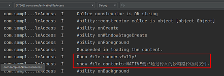


### 方案二：Native侧直接拼接沙箱路径访问文件

**图3** Native侧直接拼接沙箱路径访问文件示意图  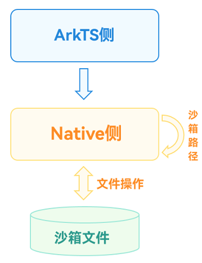


**实现方案**


这里同样以访问沙箱文件并写入文本的场景为例，实现方案分为Native侧定义操作文件的方法和ArkTS侧调用该方法两部分。


第一部分：在Native侧定义一个方法，用于拼接沙箱路径并将文本写入到文件中。


1. 根据实际文件位置[拼接沙箱路径](https://developer.huawei.com/consumer/cn/doc/harmonyos-guides/app-sandbox-directory#%E5%BA%94%E7%94%A8%E6%B2%99%E7%AE%B1%E8%B7%AF%E5%BE%84%E5%92%8C%E7%9C%9F%E5%AE%9E%E7%89%A9%E7%90%86%E8%B7%AF%E5%BE%84%E7%9A%84%E5%AF%B9%E5%BA%94%E5%85%B3%E7%B3%BB)。
  
  
  

```cpp
1. char pathBuf[READ_SIZE] = {0};
2. strncpy(pathBuf,FILE_PATH,READ_SIZE);

```
  [FileAccessMethods.cpp](https://gitcode.com/harmonyos_samples/NativeFileAccess/blob/master/entry/src/main/cpp/FileAccessMethods.cpp#L71-L72)

2. 将要写入文本的内容通过Node-API接口传递到Native侧。
  
  
  

```cpp
1. napi_get_value_string_utf8(env, argv[0], contentsBuf, sizeof(contentsBuf), &contentsSize);

```
  [FileAccessMethods.cpp](https://gitcode.com/harmonyos_samples/NativeFileAccess/blob/master/entry/src/main/cpp/FileAccessMethods.cpp#L78-L78)

3. 通过指定的路径打开文件。
  
  
  

```cpp
1. //Open the file through the specified path.
2. FILE *fp;
3. fp = fopen(pathBuf, "w");

```
  [FileAccessMethods.cpp](https://gitcode.com/harmonyos_samples/NativeFileAccess/blob/master/entry/src/main/cpp/FileAccessMethods.cpp#L82-L84)

4. 使用C标准库的文件操作函数写入文件。
  
  
  

```cpp
1. //Write a file using the file operation function of the C standard library.
2. fprintf(fp, "%s", contentsBuf);

```
  [FileAccessMethods.cpp](https://gitcode.com/harmonyos_samples/NativeFileAccess/blob/master/entry/src/main/cpp/FileAccessMethods.cpp#L92-L93)

5. 完整代码如下所示：
  
  
  

```cpp
1. static napi_value SplicePath(napi_env env, napi_callback_info info) {
2.  size_t argc = 1;
3.  napi_value argv[1] = {nullptr};
4.  napi_get_cb_info(env, info, &argc, argv, nullptr, nullptr);
5.  //Splice the sandbox path according to the actual file location.
6.  size_t contentsSize;
7.  char pathBuf[READ_SIZE] = {0};
8.  strncpy(pathBuf,FILE_PATH,READ_SIZE);
9.  //Convert the contents of the text to be written into C-side variables through the Node-API interface.
10.  char contentsBuf[BUFFER_SIZE];
11.  napi_get_value_string_utf8(env, argv[0], contentsBuf, sizeof(contentsBuf), &contentsSize);
12.  //Open the file through the specified path.
13.  FILE *fp;
14.  fp = fopen(pathBuf, "w");
15.  if (fp == nullptr) {
16.  OH_LOG_Print(LOG_APP, LOG_ERROR, DOMAIN, TAG, "Open file error!");
17.  return nullptr;
18.  }
19.  OH_LOG_Print(LOG_APP, LOG_INFO, DOMAIN, TAG, "Open file successfully!");
20.  //Write a file using the file operation function of the C standard library.
21.  fprintf(fp, "%s", contentsBuf);
22.  fclose(fp);
23.  return nullptr;
24. }

```
  [FileAccessMethods.cpp](https://gitcode.com/harmonyos_samples/NativeFileAccess/blob/master/entry/src/main/cpp/FileAccessMethods.cpp#L64-L97)

6. 将该[C++接口与ArkTS接口进行绑定和映射](https://developer.huawei.com/consumer/cn/doc/harmonyos-guides/use-napi-process#native%E4%BE%A7%E6%96%B9%E6%B3%95%E7%9A%84%E5%AE%9E%E7%8E%B0)，同时在index.d.ts文件中，提供该接口方法。
  
  
  

```typescript
1. export const splicePath: (contents: string) => void;

```
  [Index.d.ts](https://gitcode.com/harmonyos_samples/NativeFileAccess/blob/master/entry/src/main/cpp/types/libfile_access/Index.d.ts#L23-L23)


第二部分：Native侧访问沙箱文件写数据的功能实现后，在ArkTS侧调用该方法。


1. 引用Native侧相应的so库。
  
  
  

```typescript
1. import FileAccess from 'libfile_access.so';

```
  [Index.ets](https://gitcode.com/harmonyos_samples/NativeFileAccess/blob/master/entry/src/main/ets/pages/Index.ets#L22-L26)

2. 在ArkTS侧调用该接口实现文件写入的操作。
  
  
  

```typescript
1. FileAccess.splicePath(content);

```
  [Index.ets](https://gitcode.com/harmonyos_samples/NativeFileAccess/blob/master/entry/src/main/ets/pages/Index.ets#L84-L84)


通过上述步骤，实现了在Native侧通过拼接沙箱路径访问与操作应用沙箱文件的方案。


**效果展示**


**图4** Native侧拼接沙箱路径方案效果展示  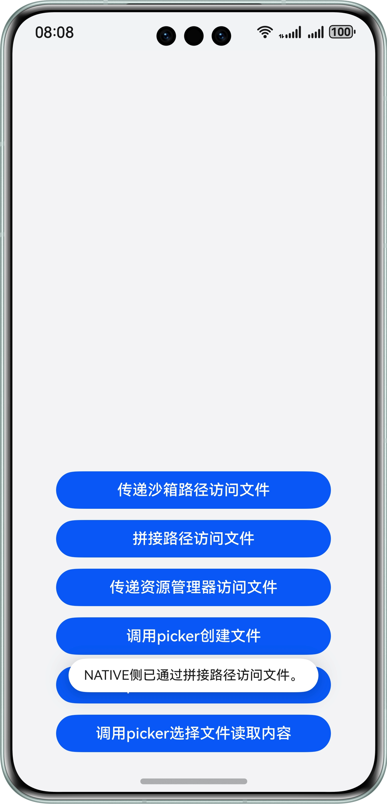


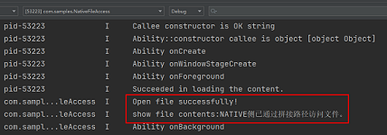


## 访问应用包内资源文件

Native侧可以通过Resource Manager[操作应用资源文件中的Rawfile目录和文件](https://developer.huawei.com/consumer/cn/doc/harmonyos-guides/rawfile-guidelines)，这里以Native侧读取Rawfile文件内容的场景为例介绍该方案。


**图5** Native侧访问应用资源文件方案示意图  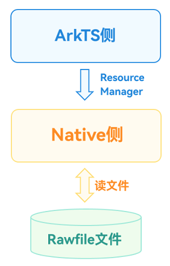


**实现方案**


实现方案分为Native侧定义操作文件的方法和ArkTS侧调用该方法两部分。


第一部分：在Native侧定义一个读取文件的方法，注意使用Resource Manager需要引用头文件rawfile/raw_file_manager.h，并在工程的cmakelists.txt文件中链接动态库librawfile.z.so。


1. 将传入的Resource Manager对象转换为Native对象。
  
  
  

```cpp
1. //Convert the incoming resource manager object into a Native object.
2. NativeResourceManager *mNativeResMgr = OH_ResourceManager_InitNativeResourceManager(env, argv[0]);

```
  [FileAccessMethods.cpp](https://gitcode.com/harmonyos_samples/NativeFileAccess/blob/master/entry/src/main/cpp/FileAccessMethods.cpp#L105-L106)

2. 将传入的文件名通过Node-API接口传递到Native侧。
  
  
  

```cpp
1. //Convert the passed-in file name into a C-side variable through the Node-API interface.
2. napi_get_value_string_utf8(env, argv[1], fileNameBuf, sizeof(fileNameBuf), &fileNameSize);

```
  [FileAccessMethods.cpp](https://gitcode.com/harmonyos_samples/NativeFileAccess/blob/master/entry/src/main/cpp/FileAccessMethods.cpp#L111-L112)

3. 通过资源对象打开文件。
  
  
  

```cpp
1. //Open a file through a resource object
2. RawFile *rawFile = OH_ResourceManager_OpenRawFile(mNativeResMgr, fileNameBuf);

```
  [FileAccessMethods.cpp](https://gitcode.com/harmonyos_samples/NativeFileAccess/blob/master/entry/src/main/cpp/FileAccessMethods.cpp#L115-L116)

4. 通过资源对象读取文件内容。
  
  
  

```cpp
1. //Read the file content through the resource object
2. long len = OH_ResourceManager_GetRawFileSize(rawFile);
3. std::unique_ptr<char[]> data = std::make_unique<char[]>(len);
4. OH_ResourceManager_ReadRawFile(rawFile, data.get(), len);

```
  [FileAccessMethods.cpp](https://gitcode.com/harmonyos_samples/NativeFileAccess/blob/master/entry/src/main/cpp/FileAccessMethods.cpp#L122-L125)

5. 完整代码如下所示。
  
  
  

```cpp
1. static napi_value TransferResourceMgr(napi_env env, napi_callback_info info) {
2.  size_t argc = 2;
3.  napi_value argv[2] = {nullptr};
4.  napi_get_cb_info(env, info, &argc, argv, nullptr, nullptr);
5.  //Convert the incoming resource manager object into a Native object.
6.  NativeResourceManager *mNativeResMgr = OH_ResourceManager_InitNativeResourceManager(env, argv[0]);
7.  size_t fileNameSize;
8.  char fileNameBuf[BUFFER_SIZE];
9.  //Convert the passed-in file name into a C-side variable through the Node-API interface.
10.  napi_get_value_string_utf8(env, argv[1], fileNameBuf, sizeof(fileNameBuf), &fileNameSize);
11.  //Open a file through a resource object
12.  RawFile *rawFile = OH_ResourceManager_OpenRawFile(mNativeResMgr, fileNameBuf);
13.  if (rawFile != nullptr) {
14.  OH_LOG_Print(LOG_APP, LOG_INFO, DOMAIN, TAG, "OH_ResourceManager_OpenRawFile success.");
15.  }
16.  //Read the file content through the resource object
17.  long len = OH_ResourceManager_GetRawFileSize(rawFile);
18.  std::unique_ptr<char[]> data = std::make_unique<char[]>(len);
19.  OH_ResourceManager_ReadRawFile(rawFile, data.get(), len);
20.  OH_ResourceManager_CloseRawFile(rawFile);
21.  OH_ResourceManager_ReleaseNativeResourceManager(mNativeResMgr);
22.  napi_value contents;
23.  napi_create_string_utf8(env, data.get(), len, &contents);
24.  return contents;
25. }

```
  [FileAccessMethods.cpp](https://gitcode.com/harmonyos_samples/NativeFileAccess/blob/master/entry/src/main/cpp/FileAccessMethods.cpp#L100-L132)

6. 将该[C++接口与ArkTS接口进行绑定和映射](https://developer.huawei.com/consumer/cn/doc/harmonyos-guides/use-napi-process#native%E4%BE%A7%E6%96%B9%E6%B3%95%E7%9A%84%E5%AE%9E%E7%8E%B0)，同时在index.d.ts文件中，提供该接口方法。
  
  
  

```typescript
1. export const transferResourceMgr: (resMgr: resourceManager.ResourceManager, path: string) => string;

```
  [Index.d.ts](https://gitcode.com/harmonyos_samples/NativeFileAccess/blob/master/entry/src/main/cpp/types/libfile_access/Index.d.ts#L26-L26)


第二部分：Native侧访问Rawfile文件读数据的功能实现后，在ArkTS侧调用该方法。


1. 引用Native侧相应的so库。
  
  
  

```typescript
1. import FileAccess from 'libfile_access.so';

```
  [Index.ets](https://gitcode.com/harmonyos_samples/NativeFileAccess/blob/master/entry/src/main/ets/pages/Index.ets#L22-L26)

2. 在ArkTS侧获取Resource Manager。
  
  
  

```typescript
1. private resMgr: resourceManager.ResourceManager = this.getUIContext().getHostContext()!.resourceManager;

```
  [Index.ets](https://gitcode.com/harmonyos_samples/NativeFileAccess/blob/master/entry/src/main/ets/pages/Index.ets#L40-L40)

3. 在ArkTS侧调用该接口传递Resource Manager和文件名并读取返回的文件内容。
  
  
  

```typescript
1. let rawfileContext = FileAccess.transferResourceMgr(this.resMgr, FileNameList[2]);

```
  [Index.ets](https://gitcode.com/harmonyos_samples/NativeFileAccess/blob/master/entry/src/main/ets/pages/Index.ets#L93-L93)


通过上述步骤，实现了在Native侧通过ArkTS侧传递的Resource Manager访问与读取应用资源文件的方案。


**效果展示**


**图6** ArkTS侧传递resource manager到Native侧方案效果展示  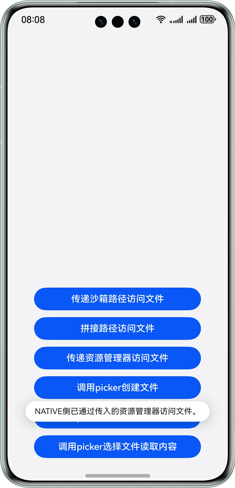


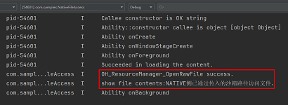


## 访问公共目录文件

系统公共目录下储存的是[用户文件](https://developer.huawei.com/consumer/cn/doc/harmonyos-guides/user-file-overview)，应用对用户文件的操作需要提前获取用户授权，或由用户操作完成。可以通过系统预置的[文件选择器（FilePicker）](https://developer.huawei.com/consumer/cn/doc/harmonyos-guides/select-user-file#%E9%80%89%E6%8B%A9%E6%96%87%E6%A1%A3%E7%B1%BB%E6%96%87%E4%BB%B6)实现该能力，目前主要有创建文件、写入和读取三类操作，[创建文件](https://developer.huawei.com/consumer/cn/doc/harmonyos-references/js-apis-file-picker#save)可以直接使用picker，针对Native侧，有如下两种场景：


- 场景一：写数据到公共目录文件。
- 场景二：从公共目录文件中读取数据。


### 场景一：写数据到公共目录文件

**场景描述**


ArkTS侧通过文件picker在公共目录下创建文件，并传递文件描述符到Native侧，Native侧通过文件描述符打开文件并将数据写入到文件中。


**图7** Native侧写入公共目录文件场景示意图  


**实现方案**


实现方案分为Native侧定义操作文件的方法和ArkTS侧调用该方法两部分。


第一部分：在Native侧定义一个方法，用于接收文件描述符并将数据写入到文件中，注意使用文件描述符操作文件需要引用头文件unistd.h。


1. 将传入的文件描述符和要写入文件的内容通过Node-API接口传递到Native侧。
  
  
  

```cpp
1. //Convert the incoming file descriptor and the contents to be written into the file into C-side variables.
2. napi_get_value_uint32(env, argv[0], &fd);
3. napi_get_value_string_utf8(env, argv[1], contentsBuf, sizeof(contentsBuf), &contentsSize);

```
  [FileAccessMethods.cpp](https://gitcode.com/harmonyos_samples/NativeFileAccess/blob/master/entry/src/main/cpp/FileAccessMethods.cpp#L144-L146)

2. 使用C标准库的文件操作函数写入文件。
  
  
  

```cpp
1. //Write a file using the file operation function of the C standard library.
2. size_t buffSize = write(fd, contentsBuf, contentsSize);

```
  [FileAccessMethods.cpp](https://gitcode.com/harmonyos_samples/NativeFileAccess/blob/master/entry/src/main/cpp/FileAccessMethods.cpp#L150-L151)

3. 根据write函数的返回值判断操作是否成功。
  
  
  

```cpp
1. std::string res;
2. //According to the return value of the write function, judge whether the operation returns the result successfully.
3. napi_value contents;
4. if (buffSize == -1) {
5.  res = "Write File Failed!";
6.  OH_LOG_Print(LOG_APP, LOG_ERROR, DOMAIN, TAG, "%s", res.c_str());
7. } else {
8.  res = "Write File Successfully!!!";
9.  OH_LOG_Print(LOG_APP, LOG_INFO, DOMAIN, TAG, "%s", res.c_str());
10. }
11. napi_create_string_utf8(env, res.c_str(), sizeof(res), &contents);
12. return contents;

```
  [FileAccessMethods.cpp](https://gitcode.com/harmonyos_samples/NativeFileAccess/blob/master/entry/src/main/cpp/FileAccessMethods.cpp#L154-L165)

4. 完整代码如下所示：
  
  
  

```cpp
1. static napi_value WriteFileUsingPickerFd(napi_env env, napi_callback_info info) {
2.  size_t argc = 2;
3.  napi_value argv[2] = {nullptr};
4.  napi_get_cb_info(env, info, &argc, argv, nullptr, nullptr);
5.
6.  unsigned int fd = -1;
7.  size_t contentsSize;
8.  char contentsBuf[BUFFER_SIZE];
9.  //Convert the incoming file descriptor and the contents to be written into the file into C-side variables.
10.  napi_get_value_uint32(env, argv[0], &fd);
11.  napi_get_value_string_utf8(env, argv[1], contentsBuf, sizeof(contentsBuf), &contentsSize);
12.  ftruncate(fd, 0);
13.  //Write a file using the file operation function of the C standard library.
14.  size_t buffSize = write(fd, contentsBuf, contentsSize);
15.  std::string res;
16.  //According to the return value of the write function, judge whether the operation returns the result successfully.
17.  napi_value contents;
18.  if (buffSize == -1) {
19.  res = "Write File Failed!";
20.  OH_LOG_Print(LOG_APP, LOG_ERROR, DOMAIN, TAG, "%s", res.c_str());
21.  } else {
22.  res = "Write File Successfully!!!";
23.  OH_LOG_Print(LOG_APP, LOG_INFO, DOMAIN, TAG, "%s", res.c_str());
24.  }
25.  napi_create_string_utf8(env, res.c_str(), sizeof(res), &contents);
26.  return contents;
27. }

```
  [FileAccessMethods.cpp](https://gitcode.com/harmonyos_samples/NativeFileAccess/blob/master/entry/src/main/cpp/FileAccessMethods.cpp#L135-L167)

5. 将该[C++接口与ArkTS接口进行绑定和映射](https://developer.huawei.com/consumer/cn/doc/harmonyos-guides/use-napi-process#native%E4%BE%A7%E6%96%B9%E6%B3%95%E7%9A%84%E5%AE%9E%E7%8E%B0)，同时在index.d.ts文件中，提供该接口方法。
  
  
  

```typescript
1. export const writeFileUsingPickerFd: (fd: number, contents: string) => string;

```
  [Index.d.ts](https://gitcode.com/harmonyos_samples/NativeFileAccess/blob/master/entry/src/main/cpp/types/libfile_access/Index.d.ts#L29-L29)


第二部分：Native侧访问公共目录文件写数据的功能实现后，在ArkTS侧调用该方法。


1. 引用Native侧相应的so库。
  
  
  

```typescript
1. import FileAccess from 'libfile_access.so';

```
  [Index.ets](https://gitcode.com/harmonyos_samples/NativeFileAccess/blob/master/entry/src/main/ets/pages/Index.ets#L22-L26)

2. 在ArkTS侧拉起picker选择文件并将文件描述符传入Native接口中。
  
  
  

```typescript
1. async function WriteFileByPicker(contents: string): Promise<string> {
2.  //Configure picker Selection Information
3.  const documentSelectOptions = new picker.DocumentSelectOptions();
4.  documentSelectOptions.maxSelectNumber = 1;
5.  documentSelectOptions.fileSuffixFilters = ['.txt'];
6.
7.  let uris: Array<string> = [];
8.  const documentViewPicker = new picker.DocumentViewPicker();
9.  //Pull up the picker selection file
10.  return await documentViewPicker.select(documentSelectOptions).then((documentSelectResult: Array<string>) => {
11.  uris = documentSelectResult;
12.  let uri: string = uris[0];
13.  let path: string = new fileUri.FileUri(uri).path;
14.  Logger.info(`Open The File path is [${uri}]`);
15.  let file = fs.openSync(path, fs.OpenMode.WRITE_ONLY);
16.  //Call the native method to write a file
17.  let res = FileAccess.writeFileUsingPickerFd(file.fd, contents);
18.  fs.closeSync(file.fd);
19.  return res;
20.  }).catch((error: BusinessError) => {
21.  Logger.error(`Open The file failed, error code is [${error.code}], error message is [${error.message}]`);
22.  return 'Write Failed by Picker';
23.  })
24. }

```
  [FileOperate.ets](https://gitcode.com/harmonyos_samples/NativeFileAccess/blob/master/entry/src/main/ets/common/utils/FileOperate.ets#L36-L59)


通过上述步骤，实现了在Native侧通过ArkTS侧picker传递的文件资源描述符访问公共目录文件并写入内容的方案。


**效果展示**


**图8** Native侧写公共目录文件场景方案效果展示  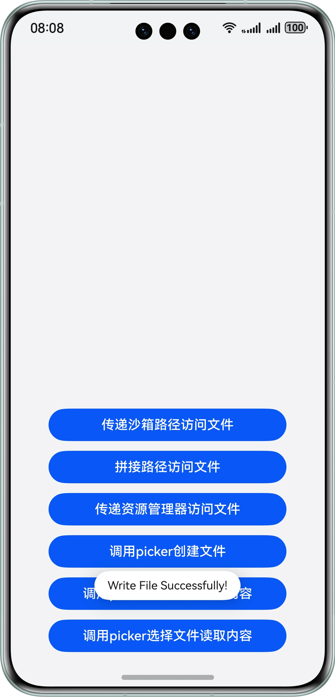


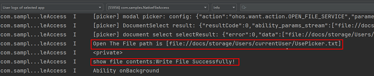


### 场景二：从公共目录文件中读取数据

**场景描述**


ArkTS侧通过文件picker选择文件，并传递文件描述符到Native侧，Native侧通过文件描述符打开文件并读取文件数据。


**图9** Native侧读取公共目录文件场景示意图  


**实现方案**


实现方案分为Native侧定义操作文件的方法和ArkTS侧调用该方法两部分。


第一部分：在Native侧定义一个方法，用于接收文件描述符并将数据写入到文件中，注意使用文件描述符操作文件需要引用头文件unistd.h。


1. 将传入的文件描述符通过Node-API接口传递到Native侧。
  
  
  

```cpp
1. //Convert the incoming file descriptor into a C-side variable.
2. napi_get_value_uint32(env, argv[0], &fd);

```
  [FileAccessMethods.cpp](https://gitcode.com/harmonyos_samples/NativeFileAccess/blob/master/entry/src/main/cpp/FileAccessMethods.cpp#L178-L179)

2. 使用C标准库的文件操作函数读取文件。
  
  
  

```cpp
1. //Use the file operation function of the C standard library to read the file.
2. char buff[READ_SIZE];
3. size_t buffSize = read(fd, buff, sizeof(buff));

```
  [FileAccessMethods.cpp](https://gitcode.com/harmonyos_samples/NativeFileAccess/blob/master/entry/src/main/cpp/FileAccessMethods.cpp#L182-L184)

3. 判断读取是否成功并返回文件内容。
  
  
  

```cpp
1. //Judge whether the reading is successful or not and return the file content.
2. napi_value contents;
3. if (buffSize == -1) {
4.  OH_LOG_Print(LOG_APP, LOG_ERROR, DOMAIN, TAG, "Read File Failed!!!");
5. } else {
6.  OH_LOG_Print(LOG_APP, LOG_INFO, DOMAIN, TAG, "Read File Successfully!!!");
7.  napi_create_string_utf8(env, buff, buffSize, &contents);
8. }
9. return contents;

```
  [FileAccessMethods.cpp](https://gitcode.com/harmonyos_samples/NativeFileAccess/blob/master/entry/src/main/cpp/FileAccessMethods.cpp#L187-L195)

4. 完整代码如下所示：
  
  
  

```cpp
1. // entry/src/main/cpp/FileAccessMethods.cpp
2. static napi_value ReadFileUsingPickerFd(napi_env env, napi_callback_info info) {
3.  size_t argc = 1;
4.  napi_value argv[1] = {nullptr};
5.  napi_get_cb_info(env, info, &argc, argv, nullptr, nullptr);
6.
7.  unsigned int fd = -1;
8.  //Convert the incoming file descriptor into a C-side variable.
9.  napi_get_value_uint32(env, argv[0], &fd);
10.  //Use the file operation function of the C standard library to read the file.
11.  char buff[READ_SIZE];
12.  size_t buffSize = read(fd, buff, sizeof(buff));
13.  //Judge whether the reading is successful or not and return the file content.
14.  napi_value contents;
15.  if (buffSize == -1) {
16.  OH_LOG_Print(LOG_APP, LOG_ERROR, DOMAIN, TAG, "Read File Failed!!!");
17.  } else {
18.  OH_LOG_Print(LOG_APP, LOG_INFO, DOMAIN, TAG, "Read File Successfully!!!");
19.  napi_create_string_utf8(env, buff, buffSize, &contents);
20.  }
21.  return contents;
22. }

```
  [FileAccessMethods.cpp](https://gitcode.com/harmonyos_samples/NativeFileAccess/blob/master/entry/src/main/cpp/FileAccessMethods.cpp#L170-L197)

5. 将该[C++接口与ArkTS接口进行绑定和映射](https://developer.huawei.com/consumer/cn/doc/harmonyos-guides/use-napi-process#native%E4%BE%A7%E6%96%B9%E6%B3%95%E7%9A%84%E5%AE%9E%E7%8E%B0)，同时在index.d.ts文件中，提供该接口方法。
  
  
  

```typescript
1. export const readFileUsingPickerFd: (fd: number) => string;

```
  [Index.d.ts](https://gitcode.com/harmonyos_samples/NativeFileAccess/blob/master/entry/src/main/cpp/types/libfile_access/Index.d.ts#L32-L32)


第二部分：Native侧访问公共目录文件读数据的功能实现后，在ArkTS侧调用该方法。


1. 引用Native侧相应的so库。
  
  
  

```typescript
1. import FileAccess from 'libfile_access.so';

```
  [Index.ets](https://gitcode.com/harmonyos_samples/NativeFileAccess/blob/master/entry/src/main/ets/pages/Index.ets#L22-L26)

2. 在ArkTS侧拉起picker选择文件并将文件描述符传入Native接口中。
  
  
  

```typescript
1. async function ReadFileByPicker(): Promise<string> {
2.  //Configure picker Selection Information
3.  const documentSelectOptions = new picker.DocumentSelectOptions();
4.  documentSelectOptions.maxSelectNumber = 1;
5.  documentSelectOptions.fileSuffixFilters = ['.txt'];
6.  //Pull up the picker selection file
7.  let uris: Array<string> = [];
8.  const documentViewPicker = new picker.DocumentViewPicker();
9.  return await documentViewPicker.select(documentSelectOptions).then((documentSelectResult: Array<string>) => {
10.  uris = documentSelectResult;
11.  let uri: string = uris[0];
12.  let path: string = new fileUri.FileUri(uri).path;
13.  Logger.info(`The Opened File path is [${uri}]`);
14.  let file = fs.openSync(path, fs.OpenMode.READ_ONLY);
15.  //Call the native method to read the file.
16.  let res = FileAccess.readFileUsingPickerFd(file.fd);
17.  fs.closeSync(file.fd);
18.  return res;
19.  }).catch((error: BusinessError) => {
20.  Logger.error(`Open The file failed, error code is [${error.code}], error message is [${error.message}]`);
21.  return 'Read Failed by Picker!';
22.  })
23. }

```
  [FileOperate.ets](https://gitcode.com/harmonyos_samples/NativeFileAccess/blob/master/entry/src/main/ets/common/utils/FileOperate.ets#L62-L84)


通过上述步骤，实现了在Native侧通过ArkTS侧picker传递的文件资源描述符访问公共目录文件并读取内容的方案。


**效果展示**


**图10** Native侧读公共目录文件场景方案效果展示  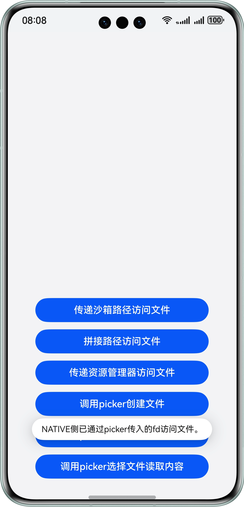


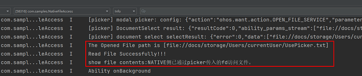


## 示例代码

- [实现Native侧文件访问](https://gitcode.com/harmonyos_samples/NativeFileAccess)
