# 音乐服务卡片

## 概述

服务卡片，简称“卡片”，是系统一种呈现信息和交互操作的载体，在应用或元服务中提取关键信息和核心操作，以卡片的形式展示在桌面上，用户通过与服务卡片交互即可实现服务直达，减少交互层级，提升用户体验。


典型的服务卡片使用场景有音乐服务卡片。音乐服务卡片将音乐应用的重要信息与核心功能操作前置到卡片上，以卡片的形式呈现给用户，如音乐播控、歌单推荐、心动歌词、动态歌词等。用户可通过音乐服务卡片快速访问音乐应用的核心功能，无需打开完整的应用界面。


**图1** 音乐服务卡片场景效果图  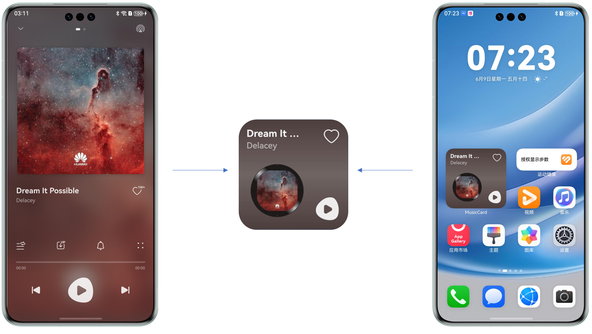


本文将以音乐服务卡片场景为例，分别介绍音乐播控、歌单推荐、心动歌词、动态歌词四种服务卡片的实现，包括卡片设计和功能开发，以及开发中常见的一些问题。通过本案例，开发者可以更加深入的了解服务卡片与应用的交互和卡片的数据更新机制，快速高效的进行精美的服务卡片开发。


## 场景介绍


### 音乐播控

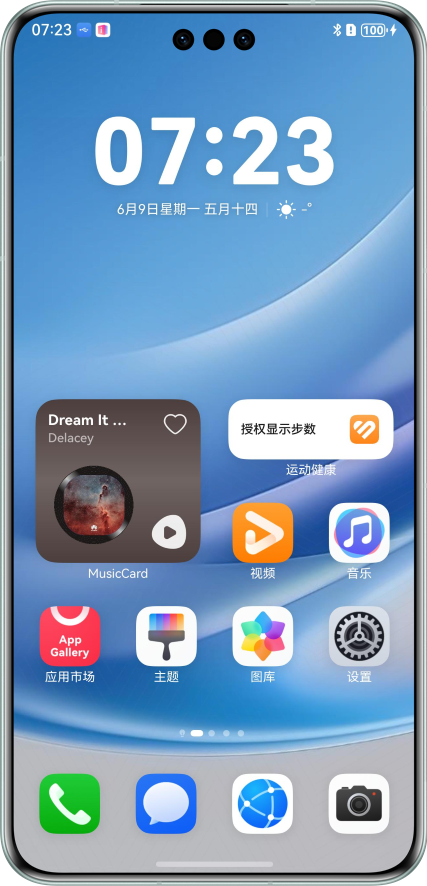


场景定义：


- 体验：用户无需打开应用，直接在卡片上就能控制基本的音乐播放功能操作，节省操作步骤，提升用户体验。


- 功能：用户可以通过服务卡片直接实现音乐播放，包括播放、暂停、上一首、下一首、收藏等操作。


### 动态歌词

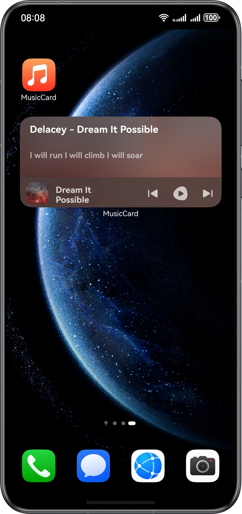


场景定义：


- 体验：用户不仅可以播放音乐，还可以看到与当前播放进度实时匹配的歌词内容，增强用户体验。


- 功能：用户可以通过服务卡片直接实现音乐播放并实时显示歌词，包括播放、暂停、上一首、下一首、根据播放进度显示歌词等操作。


### 歌单推荐

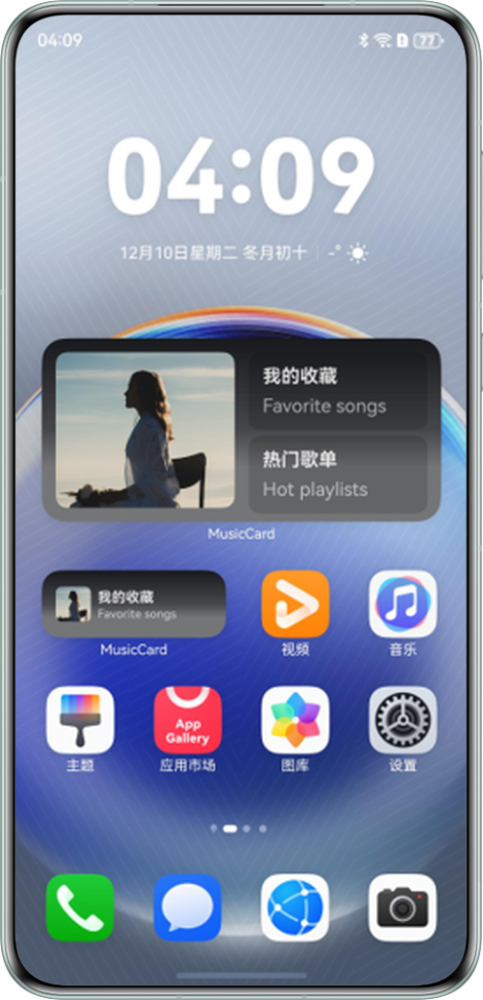


场景定义：


- 体验：用户在播放音乐时，可以直接在卡片上看到推荐的歌曲列表，点击即可切换和收藏，增强用户对音乐选择的便捷性和个性化体验。
- 功能：服务卡片可以根据用户的音乐偏好和当前播放内容，实时推荐相关歌曲或歌单。点击“我的收藏”跳转到应用收藏列表；点击“热门歌单”，跳转到歌单列表。


### 心动歌词

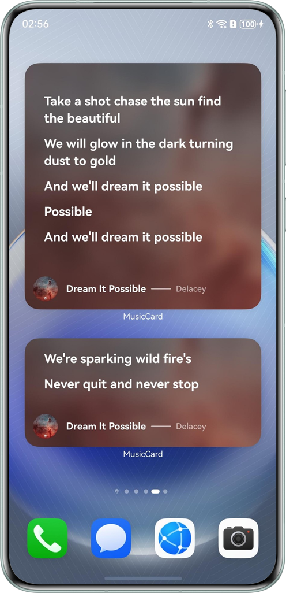


场景定义：


- 体验：以用户个性化互动为核心，通过歌词内容增强用户情感共鸣和音乐体验，通过技术创新深度链接用户情感，提供更加富有个性化的音乐体验。


- 功能：根据用户的听歌历史和偏好，推荐与其喜好相符的歌词卡片。


### 场景互动卡片

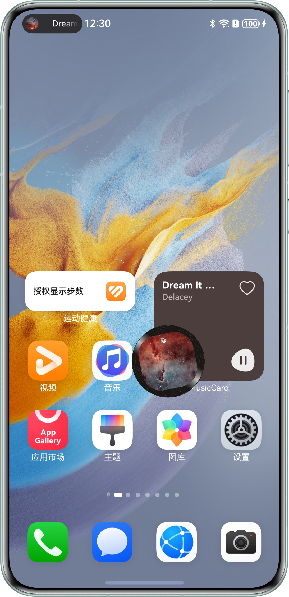


场景定义：


- 体验：客户可以通过点击卡片，卡片展示溢出屏幕的动效，提供技术创新提供富有趣味的用户体验。
- 功能：提供富有趣味的用户互动。


## 卡片设计

在设计方面，服务卡片需要遵循突出服务内容、明确划分有限的操作空间、展示必要的信息和图片以及轻量交互[体验原则](https://developer.huawei.com/consumer/cn/doc/design-guides/system-features-service-widget-0000002087671904#section111mcpsimp)，关于卡片内容设计遵循[卡片内容设计](https://developer.huawei.com/consumer/cn/doc/design-guides/system-features-service-widget-0000002087671904#section248mcpsimp)规范，例如卡片沉浸式体验设计，包含图片和用色丰富的沉浸式卡片，背景色提取内容图中的色彩。


**图2** 音乐服务卡片沉浸效果图  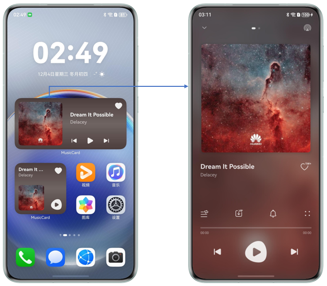


音乐播控、歌单推荐、心动歌词和动态歌词卡片设计效果如下所示：


**表1** 音乐卡片设计效果

展开

| 卡片名称 | 卡片规格 | 功能简介 | 卡片效果1 | 卡片效果2 | 桌面效果 |
| --- | --- | --- | --- | --- | --- |
| 音乐播控 | [2x2] [2x4] | 音乐播放控制，点击上一曲/下一曲，音乐封面会跟随歌曲切换。音乐收藏/取消收藏功能 |  | 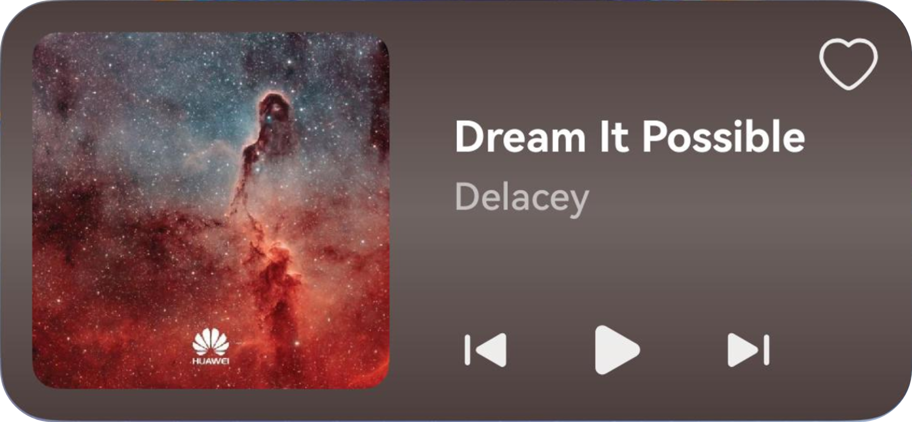 | 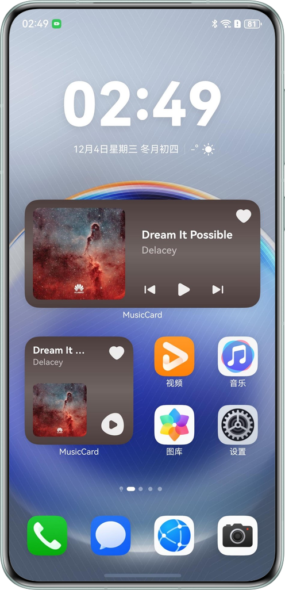 |
| 歌单推荐 | [1x2] [2x4] | 点击我的收藏跳转到应用收藏列表。点击热门歌单，跳转到歌单列表。 |  |  |  |
| 心动歌词 | [2x4] [4x4] | 展示心动歌词，以及歌曲信息。点击卡片拉起对应歌曲播放页面。 |  |  |  |
| 动态歌词 | [2x4] | 音乐播放控制，点击上一曲/下一曲，音乐封面会跟随歌曲切换。当前音乐歌词会跟随播放进度，显示对应歌词。 |  | 暂无 |  |


## 实现方案


### 整体方案

音乐应用作为[卡片提供方](https://developer.huawei.com/consumer/cn/doc/harmonyos-guides/formkit-overview#%E6%9C%8D%E5%8A%A1%E5%8D%A1%E7%89%87%E6%9E%B6%E6%9E%84)，提供音乐服务卡片的内容显示、控件布局和卡片交互处理逻辑。桌面作为[卡片使用方](https://developer.huawei.com/consumer/cn/doc/harmonyos-guides/formkit-overview#%E6%9C%8D%E5%8A%A1%E5%8D%A1%E7%89%87%E6%9E%B6%E6%9E%84)，即卡片的宿主应用，控制卡片在桌面中展示的位置和内容。卡片框架管理卡片生命周期和刷新机制，负责卡片页面的渲染。关于卡片提供方、使用方和卡片框架的详细内容可参考[ArkTS卡片实现原理](https://developer.huawei.com/consumer/cn/doc/harmonyos-guides/arkts-form-overview#%E5%AE%9E%E7%8E%B0%E5%8E%9F%E7%90%86)。


**图3** 音乐服务卡片运行机制  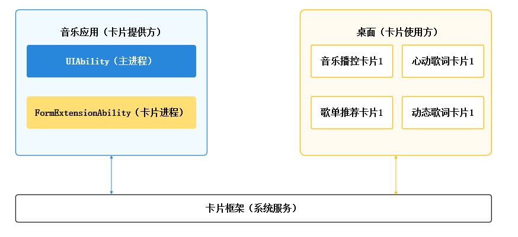


音乐应用包含[UIAbility](https://developer.huawei.com/consumer/cn/doc/harmonyos-references/js-apis-app-ability-uiability)（主进程）和[FormExtensionAbility](https://developer.huawei.com/consumer/cn/doc/harmonyos-references/js-apis-app-form-formextensionability)（卡片进程）两个进程。其中，主进程包含音乐播控、收藏、热门歌单、以及歌词处理等功能模块；卡片进程是卡片业务逻辑模块，提供卡片创建、刷新、销毁等生命周期回调。如下图所示：


**图4** 音乐应用进程结构  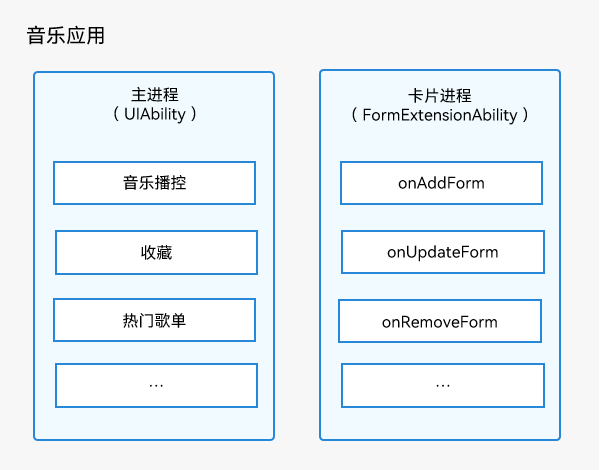


开发者可以根据FormExtensionAbility生命周期回调，在对应回调方法中处理卡片数据持久化、卡片数据更新等操作，FormExtensionAbility生命周期回调时机和功能实现说明如下表所示：


**表2** 卡片生命周期说明

展开

| 生命周期 | 回调时机 |
| --- | --- |
| [onAddForm](https://developer.huawei.com/consumer/cn/doc/harmonyos-references/js-apis-app-form-formextensionability#formextensionabilityonaddform) | 长按APP图标/卡片后，点击“服务卡片”拉起卡片视图后 |
| [onUpdateForm](https://developer.huawei.com/consumer/cn/doc/harmonyos-references/js-apis-app-form-formextensionability#formextensionabilityonupdateform) | 定时更新、定点更新、卡片使用方主动请求更新时执行回调 |
| [onFormEvent](https://developer.huawei.com/consumer/cn/doc/harmonyos-references/js-apis-app-form-formextensionability#formextensionabilityonformevent) | 用户触发了卡片上的postCardAction或FormLink中的message事件 |
| [onRemoveForm](https://developer.huawei.com/consumer/cn/doc/harmonyos-references/js-apis-app-form-formextensionability#formextensionabilityonremoveform) | 长按卡片选择“移除”后 |


### 互动卡片

场景类型互动卡片在定位上是对普通卡片能力的增强，因此开发者需首先完成普通卡片的业务开发。之后在特定业务环节通过接口请求，触发互动卡片特有的动态效果。开发者可参考[互动卡片开发](https://developer.huawei.com/consumer/cn/doc/harmonyos-guides/arkts-ui-liveform)。


### 关键技术

在服务卡片开发中，会使用多种关键技术共同来实现不同类型的卡片，比如卡片规格的选择、卡片的沉浸式效果、卡片的更新以及数据持久化等。具体关键技术介绍如下：


1. **卡片的选择**
  - 动态卡片支持通用事件能力和自定义动效能力，适用于有复杂业务逻辑和交互的场景，功能丰富但内存开销较大。
  - 静态卡片支持UI组件和布局能力，不支持通用事件和自定义动效能力，卡片内容以静态图显示，可以通过[FormLink](https://developer.huawei.com/consumer/cn/doc/harmonyos-references/ts-container-formlink)组件跳转到指定的UIAbility，适用于展示类卡片（UI相对固定），功能简单但可以有效控制内存开销。

     音乐播控卡片和动态歌词卡片具有播放/暂停、上一曲/下一曲、收藏等功能，需较强的播控逻辑和交互处理，更适合选择动态卡片；歌单推荐和心动歌词仅需要页面跳转功能，业务逻辑和交互都比较简单，选择静态卡片更合适。

2. **沉浸式卡片**     沉浸式卡片设计能给用户带来更好的视觉体验，开发者可以使用[@ohos.effectKit](https://developer.huawei.com/consumer/cn/doc/harmonyos-references/js-apis-effectkit)模块的ColorPicker的[getMainColor()](https://developer.huawei.com/consumer/cn/doc/harmonyos-references/js-apis-effectkit#getmaincolor)方法获取歌曲封面图像主色，作为卡片的背景色，使卡片和歌曲封面融为一体达到卡片沉浸效果。此外，在一些场景下，还可以给卡片添加背景图片，使用Image组件的blur属性或者@ohos.effectKit模块的[blur()](https://developer.huawei.com/consumer/cn/doc/harmonyos-references/js-apis-effectkit#blur)方法给图片做模糊化处理，来达到卡片沉浸效果。

3. **卡片更新与数据交互**     针对音乐服务卡片这种多类型多规格的卡片场景，推荐使用关系型数据库[relationalStore](https://developer.huawei.com/consumer/cn/doc/harmonyos-references/js-apis-data-relationalstore)进行卡片数据持久化存储。

     应用主进程通过FormProvider的[updateForm()](https://developer.huawei.com/consumer/cn/doc/harmonyos-references/js-apis-app-form-formprovider#formproviderupdateform)方法实现卡片的主动刷新，例如更新歌曲信息、歌词信息等；在FormExtensionAbility的onUpdateForm()生命周期回调方法中实现卡片被动刷新逻辑，例如定时和定点刷新。

     关于服务卡片的数据交互和更新机制，具体可以参考：[卡片更新与数据交互](https://developer.huawei.com/consumer/cn/doc/best-practices/bpta-card-update-and-data-interaction)。


### 卡片实现方案

**音乐播控卡片**


- 音乐播控卡片具有播放/暂停、上一曲/下一曲、收藏等功能，需较强的播控逻辑和交互处理，选择动态卡片实现。
- 音乐播控卡片和应用之间存在较多的交互，选择使用动态卡片来实现。动态卡片支持通用事件能力和自定义动效能力，适用于有复杂业务逻辑和交互的场景。动态卡片的创建可以参考：[创建ArkTS卡片](https://developer.huawei.com/consumer/cn/doc/harmonyos-guides/arkts-ui-widget-creation)**。**
- 卡片与应用主进程之间通过call事件进行交互，比如播放、暂停、收藏等。call事件的发送和订阅可以参考：[通过router或call事件刷新卡片内容](https://developer.huawei.com/consumer/cn/doc/harmonyos-guides/arkts-ui-widget-event-overview)。
- 本示例音乐播放功能使用的是AVPlayer，具体实现可以参考[使用AVPlayer播放音频(ArkTS)](https://developer.huawei.com/consumer/cn/doc/harmonyos-guides/using-avplayer-for-playback)。为保证音乐能在后台播放或熄屏播放，需要接入[AVSession（媒体会话）](https://developer.huawei.com/consumer/cn/doc/harmonyos-guides/avsession-access-scene)和[申请长时任务](https://developer.huawei.com/consumer/cn/doc/harmonyos-guides/continuous-task)，避免播放被系统强制中断。
- 场景动效类型互动卡片采用的是LiveFormExtensionAbility完成其页面的布局和渲染。


**动态歌词卡片**


- 该卡片支持切换歌曲、播控、跳转功能，可参考前面[音乐播控卡片](https://developer.huawei.com/consumer/cn/doc/best-practices/bpta-music-card#section1889820381498)相关介绍。
- 动态歌词可实时显示与当前播放进度匹配的歌词内容。切换歌曲时，除更新歌曲基本信息外，歌词部分会同步更新并从头开始跟随播放进度显示，需要开发者在实际开发中获取相应歌曲的歌词信息。歌词在播放期间以及切换不同歌曲的时候，需要通过动画实现歌词的平滑[过渡效果](https://developer.huawei.com/consumer/cn/doc/harmonyos-references/ts-transition-animation-component)。在卡片初始化的时候，需要预处理好歌词数组，在音频进度回调中，需根据当前时间匹配对应歌词，并更新卡片。
- 应用内添加卡片到桌面功能。在应用内长按指定元素，将弹出包含"添加至桌面"选项的菜单，点击后弹出应用支持的卡片。长按添加至桌面菜单可以参考：[FormMenu](https://developer.huawei.com/consumer/cn/doc/harmonyos-references/ohos-arkui-advanced-formmenu)组件。


**歌单推荐卡片**


- 歌单推荐卡片没有复杂的业务逻辑和数据交互，选择使用静态卡片来实现，歌单推荐的交互动作主要是点击卡片对应组件之后，拉起应用主进程进行页面跳转。
- 页面跳转通过[FormLink](https://developer.huawei.com/consumer/cn/doc/harmonyos-references/ts-container-formlink)组件router类型事件来实现。
- 卡片创建的时候会加载网络图片，网络图片的刷新可以参考：[刷新本地图片和网络图片](https://developer.huawei.com/consumer/cn/doc/harmonyos-guides/arkts-ui-widget-image-update)。


**心动歌词卡片**


- 心动歌词卡片和应用主进程之间交互逻辑比较简单，仅有点击卡片跳转到应用播放页面的交互，所以选择静态卡片实现，通过FormLink组件实现点击卡片跳转。
- 心动歌词卡片内容主要是通过被动刷新的方式进行卡片数据刷新，在FormExtensionAbility的onUpdateForm()回调方法中，对卡片数据进行刷新，在卡片配置文件form_config中配置updateDuration参数实现定时刷新。具体实现可以参考：[卡片定时刷新和定点刷新](https://developer.huawei.com/consumer/cn/doc/harmonyos-guides/arkts-ui-widget-passive-refresh)。


## 场景实现


### 音乐播控卡片

**实现步骤**


音乐播控卡片的主要实现步骤如下：


其中“实现音乐播控功能”需要通过卡片、数据库、媒体播放等多个模块之间的数据交互来实现，音乐播控功能实现时序图如下：

**图5** 卡片音乐播控时序图  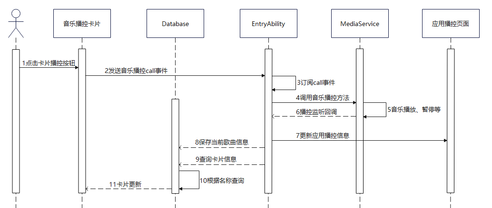


音乐播控卡片的详细开发流程如下：


1. **开发卡片UI布局**
  **图6** 音乐播控卡片效果图  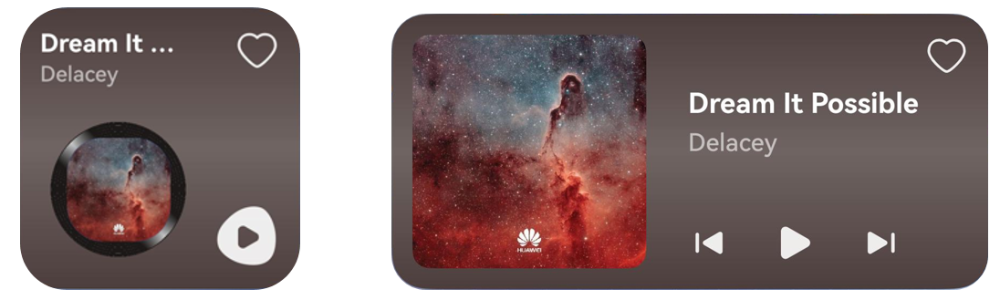
     分别创建2x2和2x4两个规格的动态卡片，动态卡片的创建可以参考[创建ArkTS卡片](https://developer.huawei.com/consumer/cn/doc/harmonyos-guides/arkts-ui-widget-creation)。对于比较复杂的布局，优先考虑使用相对布局 [RelativeContainer](https://developer.huawei.com/consumer/cn/doc/harmonyos-guides/arkts-layout-development-relative-layout)来减少性能开销。由于2x4卡片包含了2x2卡片的功能，下面将以2x4卡片为例介绍音乐播控卡片的实现。

     在卡片布局文件中定义卡片所需要的变量信息，使用[@LocalStorageProp](https://developer.huawei.com/consumer/cn/doc/harmonyos-guides/arkts-localstorage#localstorageprop)装饰器修饰，用于接收应用侧传递过来的数据，其中isPlay与isCollected分别表示歌曲的播放和收藏状态，根据状态的不同展示不同的图标，示例代码如下：


  
  
  

```typescript
1. // src/main/ets/widget/pages/PlayControlCard2x4.ets
2. let storageUpdateCall = new LocalStorage();
3.
4. @Entry(storageUpdateCall)
5. @Component
6. struct PlayControlCard2x4 {
7.  @LocalStorageProp('formId') formId: string = '';
8.  @LocalStorageProp('isNeedRequestUpdate') @Watch('requestData') isNeedRequestUpdate: boolean = false;
9.  @LocalStorageProp('isPlay') isPlay: boolean = false;
10.  @LocalStorageProp('title') title: string = 'SongName';
11.  @LocalStorageProp('isCollected') isCollected: boolean = false;
12.  @LocalStorageProp('musicCover') musicCover: Resource = $r('app.media.ic_dream');
13.  @LocalStorageProp('singer') singer: string = 'Singer';
14.  @LocalStorageProp('songId') songId: string = '';
15.  @LocalStorageProp('imageColor') imageColor: string = 'rgba(76, 72, 68, 1)';
16.  @LocalStorageProp('imageColorHex') imageColorHex: string = '18191d';
17.
18.  requestData() {
19.  ActionUtils.updateControlCardAction(this, this.formId);
20.  }
21.
22.  build() {
23.  RelativeContainer() {
24.  Image(this.musicCover)
25.  // ...
26.  SymbolGlyph(this.isCollected ? $r('sys.symbol.heart_fill') : $r('sys.symbol.heart'))
27.  // ...
28.  Row() {
29.  SymbolGlyph($r('sys.symbol.backward_end_fill'))
30.  // ...
31.  SymbolGlyph(this.isPlay ? $r('sys.symbol.pause') : $r('sys.symbol.play_fill'))
32.  // ...
33.  SymbolGlyph($r('sys.symbol.forward_end_fill'))
34.  // ...
35.  }
36.  // ...
37.  }
38.  // ...
39.  }
40. }


```
  [PlayControlCard2x4.ets](https://gitcode.com/harmonyos_samples/MusicCard/blob/master/entry/src/main/ets/widget/pages/PlayControlCard2x4.ets#L38-L239)

2. **卡片数据初始化**
  用户长按桌面应用图标，桌面弹出卡片添加弹窗时，需要对卡片数据进行初始化，能让用户直观的理解到卡片所提供的服务内容、功能和样式。同时，音乐播控卡片的预览数据和应用当前播放歌曲应该保持一致。
  **图7** 音乐播控卡片预览效果  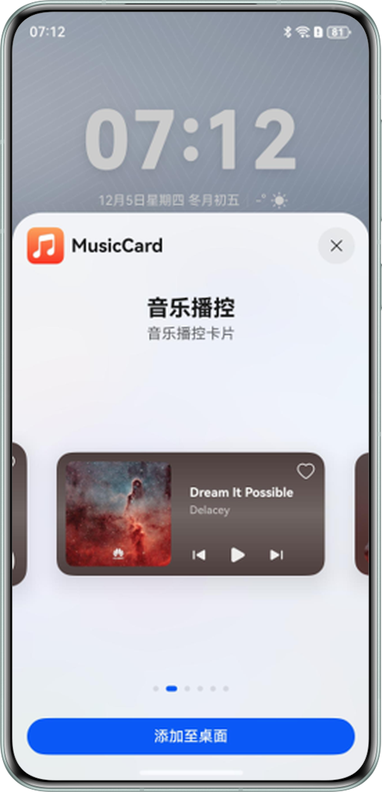
     在音乐应用中，EntryFormAbility继承了FormExtensionAbility类并实现了其生命周期回调方法。当预览卡片时，会触发EntryFormAbility的onAddForm()回调方法，在此方法中可以获取卡片名称、卡片ID等信息。开发者可以根据卡片名称判断是否为音乐播控卡片，如果是，则调用FormUtils.updateMusicControlCard()方法更新卡片数据。FormUtils是卡片管理工具类，封装了卡片添加、删除、更新等相关功能。示例代码如下：


  
  
  

```typescript
1. export default class EntryFormAbility extends FormExtensionAbility {
2.  onAddForm(want: Want) {
3.  // ...
4.  if (want.parameters) {
5.  let formId = want.parameters['ohos.extra.param.key.form_identity'] as string;
6.  let formName = want.parameters['ohos.extra.param.key.form_name'] as string;
7.  // ...
8.  this.trigger3DLiveRequest(formId);
9.
10.  if (formName.includes('PlayControlCard')) {
11.  FormUtils.updateMusicControlCard(formId, true);
12.  }
13.  // ...
14.  }
15.  return formBindingData.createFormBindingData('');
16.  }
17.
18.  // ...
19. }


```
  [EntryFormAbility.ets](https://gitcode.com/harmonyos_samples/MusicCard/blob/master/entry/src/main/ets/entryformability/EntryFormAbility.ets#L38-L210)
     由于在卡片进程FormExtensionAbility中无法直接获取歌曲播放状态，需要应用主进程来主动更新卡片播放状态。可以通过FormExtensionAbility给卡片传递一个isNeedRequestUpdate标识，当卡片收到该标识后，给应用主进程发送call事件主动更新卡片信息。


  
  
  

```typescript
1. // src/main/ets/utils/FormUtils.ets
2. class FormUtils {
3.  // ...
4.  public updateMusicControlCard(formId: string, needUpdate: boolean) {
5.  Logger.info(TAG, `updateMusicControlCard formId:${formId},needUpdate:${needUpdate}`);
6.  let updateData: UpdateData = {
7.  isNeedRequestUpdate: needUpdate,
8.  formId: formId,
9.  };
10.  this.updateForm(formId, updateData);
11.  }
12.
13.  // ...
14.
15.  private updateForm(formId: string, updateData: object) {
16.  Logger.info(TAG, `updateForm updateData: ${JSON.stringify(updateData)}}`);
17.  let formMsg: formBindingData.FormBindingData = formBindingData.createFormBindingData(updateData);
18.  formProvider
19.  .updateForm(formId, formMsg)
20.  .then(() => {
21.  Logger.info(TAG, `updateForm success formId: ${formId}}`);
22.  })
23.  .catch((error: BusinessError) => {
24.  Logger.error(TAG, `updateForm failed: ${JSON.stringify(error)}`);
25.  });
26.  }
27.
28.
29.
30. }


```
  [FormUtils.ets](https://gitcode.com/harmonyos_samples/MusicCard/blob/master/entry/src/main/ets/utils/FormUtils.ets#L44-L449)
     音乐播控卡片订阅到isNeedRequestUpdate变化后，发送call事件请求卡片更新。


  
  
  

```typescript
1. // src/main/ets/widget/pages/PlayControlCard2x4.ets
2. let storageUpdateCall = new LocalStorage();
3.
4. @Entry(storageUpdateCall)
5. @Component
6. struct PlayControlCard2x4 {
7.  @LocalStorageProp('formId') formId: string = '';
8.  @LocalStorageProp('isNeedRequestUpdate') @Watch('requestData') isNeedRequestUpdate: boolean = false;
9.  // ...
10.  requestData() {
11.  ActionUtils.updateControlCardAction(this, this.formId);
12.  }
13.
14.  // ...
15. }


```
  [PlayControlCard2x4.ets](https://gitcode.com/harmonyos_samples/MusicCard/blob/master/entry/src/main/ets/widget/pages/PlayControlCard2x4.ets#L39-L240)

  
  
  

```typescript
1. // src/main/ets/widget/model/ActionUtils.ets
2. public updateControlCardAction(component: Object, formId: string) {
3.  postCardAction(component, {
4.  action: FormCarAction.CALL,
5.  abilityName: ENTRY_ABILITY,
6.  params: {
7.  method: CallMethod.REQUEST_UPDATE_CARD,
8.  formId: formId,
9.  },
10.  });
11. }


```
  [ActionUtils.ets](https://gitcode.com/harmonyos_samples/MusicCard/blob/master/entry/src/main/ets/widget/model/ActionUtils.ets#L47-L58)
     应用主进程EntryAbility收到call事件后，根据卡片ID对卡片数据进行更新。


  
  
  

```typescript
1. // src/main/ets/entryability/EntryAbility.ets
2. export default class EntryAbility extends UIAbility {
3.  // ...
4.  requestUpdatePlayCard = (data: rpc.MessageSequence) => {
5.  try {
6.  Logger.info(TAG, 'requestUpdatePlayCard');
7.  let params: Record<string, string> = JSON.parse(data.readString());
8.  let formId = params.formId;
9.  if (formId) {
10.  FormUtils.updateMusicControlSingle(context, formId);
11.  }
12.  } catch (err) {
13.  let error = err as BusinessError;
14.  Logger.error(TAG, `requestUpdatePlayCard err, code: ${error.code}, mesage: ${error.message}`);
15.  }
16.  return null;
17.  };
18.  // ...
19.  onCreate(want: Want, launchParam: AbilityConstant.LaunchParam) {
20.  // ...
21.  this.callee.on('requestUpdatePlayCard', this.requestUpdatePlayCard);
22.  // ...
23. }


```
  [EntryAbility.ets](https://gitcode.com/harmonyos_samples/MusicCard/blob/master/entry/src/main/ets/entryability/EntryAbility.ets#L42-L479)
     在卡片更新前需要获取卡片更新的相关数据，获取音乐播放状态isPlay、播放的歌曲信息songItem以及从数据库中获取歌曲的收藏状态，然后调用FormUtils的updateForm()方法更新卡片。


  
  
  

```typescript
1. // src/main/ets/utils/FormUtils.ets
2. class FormUtils {
3.  // ...
4.
5.  // src/main/ets/utils/FormUtils.ets
6.  public async updateMusicControlSingle(context: Context, formId: string) {
7.  let isPlay = AppStorage.get('isPlay') as boolean;
8.  let songItem: SongItem = AppStorage.get('currentSong') as SongItem;
9.  // ...
10.  let collectedSongList: Array<SongItem> = await SongRdbHelper.getInstance(context).queryCollectedSongs();
11.  // ...
12.  let formData = new FormControlData();
13.  formData.isPlay = isPlay;
14.  formData.formId = formId;
15.  formData.singer = songItem.singer;
16.  formData.title = songItem.title;
17.  formData.songId = songItem.id;
18.  formData.musicCover = songItem.label;
19.  formData.isCollected = collectedSongList.findIndex((item) => item.id === songItem.id) >= 0;
20.  // ...
21.  this.updateForm(formData.formId, formData);
22.  }
23.
24.  // ...
25. }


```
  [FormUtils.ets](https://gitcode.com/harmonyos_samples/MusicCard/blob/master/entry/src/main/ets/utils/FormUtils.ets#L45-L450)

3. **卡片信息持久化**     音乐播控卡片有2x2和2x4两种规格，每种规格都可创建多个卡片。为确保切换歌曲时所有相关卡片的信息能够同步更新，需根据每个卡片的唯一ID和类型进行统一管理。因此，应将这些信息持久化存储，以便在需要时查询并准确刷新卡片内容，保持数据一致性。

     当用户长按桌面应用图标以展示卡片列表时，会触发EntryFormAbility的生命周期方法onAddForm()。在此回调函数中，可以利用关系型数据库relationalStore保存卡片的相关信息，如卡片ID、名称等。而当卡片被移除时，则应在onRemoveForm()回调函数中同步删除数据库中的相应记录，示例代码如下：


  
  
  

```typescript
1. export default class EntryFormAbility extends FormExtensionAbility {
2.  onAddForm(want: Want) {
3.  hilog.info(0x0000, TAG, 'onAddForm');
4.  if (want.parameters) {
5.  let formId = want.parameters['ohos.extra.param.key.form_identity'] as string;
6.  let formName = want.parameters['ohos.extra.param.key.form_name'] as string;
7.  let formDimension = want.parameters['ohos.extra.param.key.form_dimension'] as string;
8.
9.  let formInfo = new FormInfo();
10.  formInfo.formId = formId;
11.  formInfo.formDimension = formDimension;
12.  formInfo.formName = formName;
13.  hilog.info(0x0000, TAG, `onAddForm formInfo: ${JSON.stringify(formInfo)}`);
14.  FormRdbHelper.getInstance(this.context).insertForm(formInfo);
15.  // ...
16.  }
17.  return formBindingData.createFormBindingData('');
18.  }
19.
20.  // ...
21.  onRemoveForm(formId: string) {
22.  hilog.info(0x0000, TAG, 'onRemoveForm');
23.  // Called to notify the form provider that a specified form has been destroyed.
24.  FormRdbHelper.getInstance(this.context).deleteForm(formId);
25.  }
26.
27.  // ...
28. }


```
  [EntryFormAbility.ets](https://gitcode.com/harmonyos_samples/MusicCard/blob/master/entry/src/main/ets/entryformability/EntryFormAbility.ets#L39-L211)

4. **实现卡片播控功能**     为了确保卡片和应用的播放状态始终保持同步，无论是在音乐应用的播放页面还是在桌面卡片上点击播放、暂停、上一首或下一首按钮，都应即时更新卡片和应用的播放界面信息。


  1. 发送音乐播控相关的call事件。         给“播放/暂停”等播控相关的组件绑定onClick事件，调用[postCardAction](https://developer.huawei.com/consumer/cn/doc/harmonyos-references/js-apis-postcardaction)接口触发call事件，向音乐应用发送音乐播控信息。postCardAction方法封装在ActionUtils里面，参数action为事件类型，值为FormCarAction.CALL（枚举值为“call”）；method为方法名，用于触发UIAbility中对应的方法；type为播控操作类型，例如PlayActionType.PLAY表示播放。


  
  
  

```typescript
1. // src/main/ets/widget/pages/PlayControlCard2x4.ets
2. let storageUpdateCall = new LocalStorage();
3.
4. @Entry(storageUpdateCall)
5. @Component
6. struct PlayControlCard2x4 {
7.  @LocalStorageProp('formId') formId: string = '';
8.  // ...
9.  @LocalStorageProp('isPlay') isPlay: boolean = false;
10.  // ...
11.  build() {
12.  RelativeContainer() {
13.  // ...
14.  Row() {
15.  SymbolGlyph($r('sys.symbol.backward_end_fill'))
16.  .fontSize(24)
17.  .fontColor(['#E5FFFFFF'])
18.  .onClick(() => {
19.  ActionUtils.playByAction(this, PlayActionType.PREVIOUS, this.formId);
20.  })
21.  SymbolGlyph(this.isPlay ? $r('sys.symbol.pause') : $r('sys.symbol.play_fill'))
22.  // ...
23.  .onClick(() => {
24.  if (this.isPlay) {
25.  ActionUtils.playByAction(this, PlayActionType.PAUSE, this.formId);
26.  } else {
27.  ActionUtils.playByAction(this, PlayActionType.PLAY, this.formId);
28.  }
29.  })
30.  SymbolGlyph($r('sys.symbol.forward_end_fill'))
31.  // ...
32.  .onClick(() => {
33.  ActionUtils.playByAction(this, PlayActionType.NEXT, this.formId);
34.  })
35.  }
36.  // ...
37.
38.  }
39.  // ...
40.  }
41. }


```
    [PlayControlCard2x4.ets](https://gitcode.com/harmonyos_samples/MusicCard/blob/master/entry/src/main/ets/widget/pages/PlayControlCard2x4.ets#L44-L245)

  
  
  

```typescript
1. // src/main/ets/widget/model/ActionUtils.ets
2. public playByAction(component: Object, type: PlayActionType, formId: string) {
3.  postCardAction(component, {
4.  action: FormCarAction.CALL,
5.  abilityName: ENTRY_ABILITY,
6.  params: {
7.  method: CallMethod.PLAY_BY_ACTION,
8.  playActionType: type,
9.  formId: formId,
10.  },
11.  });
12. }


```
    [ActionUtils.ets](https://gitcode.com/harmonyos_samples/MusicCard/blob/master/entry/src/main/ets/widget/model/ActionUtils.ets#L26-L43)

  2. 订阅和处理卡片发送的call事件。         在EntryAbility（即应用主进程的入口UIAbility）的onCreate方法中，使用callee.on()方法订阅卡片发送的call事件。当EntryAbility接收到call事件后，根据事件类型playActionType，调用MediaService中的playByAction()方法来控制音乐播放。MediaService封装了[AVPlayer](https://developer.huawei.com/consumer/cn/doc/harmonyos-guides/media-kit-intro#avplayer)的媒体播放功能，如歌曲资源加载、播放/暂停等，具体实现可以参考[音乐服务卡片](https://gitcode.com/harmonyos_samples/MusicCard)示例代码中的MediaService.ets源码。


  
  
  

```typescript
1. // src/main/ets/entryability/EntryAbility.ets
2. export default class EntryAbility extends UIAbility {
3.  playByActionCall = (data: rpc.MessageSequence) => {
4.  try {
5.  let params: Record<string, string> = JSON.parse(data.readString());
6.  Logger.info(TAG, `playByActionCall playActionType:${params.playActionType}`);
7.  if (params.playActionType) {
8.  let playActionType: PlayActionType = params.playActionType as PlayActionType;
9.  if (isInitSuccess) {
10.  MediaService.getInstance().playByAction(playActionType);
11.  } else {
12.  this.initSongData().then(() => {
13.  MediaService.getInstance().playByAction(playActionType);
14.  });
15.  }
16.  }
17.  } catch (err) {
18.  let error = err as BusinessError;
19.  Logger.error(TAG, `playByActionCall err, code: ${error.code}, mesage: ${error.message}`);
20.  }
21.  return null;
22.  };
23.
24.  // ...
25.  onCreate(want: Want, launchParam: AbilityConstant.LaunchParam) {
26.  // ...
27.  try {
28.  this.callee.on('playByAction', this.playByActionCall);
29.  // ...
30.  } catch (error) {
31.  Logger.error(TAG, `playByAction register failed with error ${JSON.stringify(error)}`);
32.  }
33.  // ...
34.  onDestroy() {
35.  try {
36.  Logger.info(TAG, 'Ability onDestroy');
37.  this.callee.off('playByAction');
38.  // ...
39.  } catch (err) {
40.  let error = err as BusinessError;
41.  Logger.error(TAG, `onDestroy err, code: ${error.code}, mesage: ${error.message}`);
42.  }
43.  }
44.
45.  // ...
46. }


```
    [EntryAbility.ets](https://gitcode.com/harmonyos_samples/MusicCard/blob/master/entry/src/main/ets/entryability/EntryAbility.ets#L43-L480)

  
  
  

```typescript
1. // src/main/ets/utils/MediaService.ets
2. public playByAction(action: PlayActionType): void {
3.  switch (action) {
4.  case PlayActionType.PAUSE:
5.  this.pause();
6.  break;
7.  case PlayActionType.PLAY:
8.  this.isFirstLoadAsset = false;
9.  this.play();
10.  break;
11.  case PlayActionType.PREVIOUS:
12.  this.playPrevious();
13.  break;
14.  case PlayActionType.NEXT:
15.  this.playNext();
16.  break;
17.  default:
18.  break;
19.  }
20. }


```
    [MediaService.ets](https://gitcode.com/harmonyos_samples/MusicCard/blob/master/entry/src/main/ets/utils/MediaService.ets#L390-L409)

  3. 根据媒体播放状态更新卡片和应用播放界面信息。         点击卡片的播放/暂停等按钮，拉起EntryAbility至后台播放/暂停歌曲时，卡片上的播放状态需要同步更新。

         在EntryAbility的onCreate方法中，调用MediaService的setOnPlayStateCall()方法监听播放状态（如播放/暂停、上一曲/下一曲）变化。在setOnPlayStateCall()回调函数中，将播放状态isPlay和歌曲信息保存到AppStorage，以同步刷新应用界面。然后调用FormUtils的updateMusicControlCards()方法更新卡片数据，示例代码如下：


  
  
  

```typescript
1. // src/main/ets/entryability/EntryAbility.ets
2. export default class EntryAbility extends UIAbility {
3.  // ...
4.  onCreate(want: Want, launchParam: AbilityConstant.LaunchParam) {
5.  // ...
6.  MediaService.getInstance().setOnPlayStateCall(async (data: SongChangedData) => {
7.  // ...
8.  AppStorage.setOrCreate('isPlay', data.isPlay);
9.  AppStorage.setOrCreate('selectIndex', data.selectIndex);
10.  AppStorage.setOrCreate('currentSong', data.songItem);
11.  PreferencesUtil.getInstance().putCurrentSong(context, data.songItem);
12.  FormUtils.updateMusicControlCards(this.context, data.songItem, data.isPlay);
13.
14.  // ...
15.  });
16.
17.  // ...
18. }


```
    [EntryAbility.ets](https://gitcode.com/harmonyos_samples/MusicCard/blob/master/entry/src/main/ets/entryability/EntryAbility.ets#L44-L481)
         卡片的更新需要根据卡片的ID进行更新，通过调用formProvider.updateForm()方法来实现。所以在更新卡片之前，需先从数据库中获取所有待更新的卡片集合，随后遍历该集合，依据formId批量更新2x2和2x4两种规格的所有相关音乐播控卡片，确保它们的数据一致性。更新的内容包括播放状态（isPlay）、歌手名（singer）和歌曲封面（musicCover）等。


  
  
  

```typescript
1. // src/main/ets/utils/FormUtils.ets
2. class FormUtils {
3.  // ...
4.
5.  public async updateMusicControlCards(context: Context, songItem: SongItem, isPlay: boolean) {
6.  // ...
7.  let formList: Array<FormInfo> = await FormRdbHelper.getInstance(context).queryFormByName('PlayControlCard');
8.  let formData = new FormControlData();
9.  formData.isPlay = isPlay;
10.  formData.singer = songItem.singer;
11.  formData.title = songItem.title;
12.  formData.songId = songItem.id;
13.  formData.musicCover = songItem.label;
14.  formData.isCollected = isCollected;
15.  formData.imageColor = imageDealData.imageColor;
16.  formData.imageColorHex = imageDealData.imageColorHex;
17.
18.  formList.forEach((formInfo) => {
19.  this.updateForm(formInfo.formId, formData);
20.  });
21.  }
22.
23.
24.
25.  // ...
26.
27.  private updateForm(formId: string, updateData: object) {
28.  Logger.info(TAG, `updateForm updateData: ${JSON.stringify(updateData)}}`);
29.  let formMsg: formBindingData.FormBindingData = formBindingData.createFormBindingData(updateData);
30.  formProvider
31.  .updateForm(formId, formMsg)
32.  .then(() => {
33.  Logger.info(TAG, `updateForm success formId: ${formId}}`);
34.  })
35.  .catch((error: BusinessError) => {
36.  Logger.error(TAG, `updateForm failed: ${JSON.stringify(error)}`);
37.  });
38.  }
39.
40.
41.
42. }


```
    [FormUtils.ets](https://gitcode.com/harmonyos_samples/MusicCard/blob/master/entry/src/main/ets/utils/FormUtils.ets#L46-L451)

  
    **表3** 音乐播控卡片更新效果图
  
  
    展开
      | 批量更新卡片 | 通过卡片切换歌曲，卡片和应用均更新数据 | 通过应用切换歌曲，卡片和应用均更新数据 |
      | --- | --- | --- |
      | 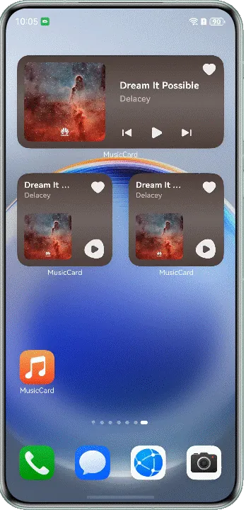 | 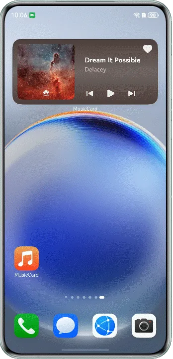 | 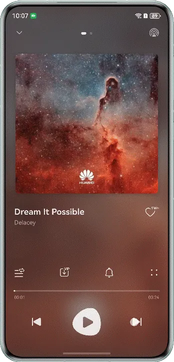 |

  4. 应用进程被销毁前更新播放状态。         当应用进程被销毁的时候，如果此时音乐卡片处于播放状态（显示暂停图标），应用应该更新卡片为未播放的状态（显示播放图标），并将状态更新同步到卡片UI。应用主进程被销毁前会触发EntryAbility里面的onDestroy()生命周期回调方法，在此方法中执行卡片更新逻辑，更新卡片播放状态isPlay为false。示例代码如下：


  
  
  

```typescript
1. // src/main/ets/entryability/EntryAbility.ets
2. export default class EntryAbility extends UIAbility {
3.  // ...
4.  onDestroy() {
5.  try {
6.  // ...
7.  let isPlay = AppStorage.get('isPlay') as boolean;
8.  // ...
9.  if (isPlay) {
10.  FormUtils.updateCardPlayStatus(this.context, false);
11.  // ...
12.  }
13.  } catch (err) {
14.  let error = err as BusinessError;
15.  Logger.error(TAG, `onDestroy err, code: ${error.code}, mesage: ${error.message}`);
16.  }
17.  }
18.
19.  // ...
20. }


```
    [EntryAbility.ets](https://gitcode.com/harmonyos_samples/MusicCard/blob/master/entry/src/main/ets/entryability/EntryAbility.ets#L45-L482)

  
  
  

```typescript
1. public async updateCardPlayStatus(context: Context, isPlay: boolean) {
2.  class CardUpdateData {
3.  isPlay: boolean = isPlay;
4.  }
5.
6.  let data = new CardUpdateData();
7.  let formList: Array<FormInfo> = await FormRdbHelper.getInstance(context).queryFormByName('PlayControlCard');
8.  Logger.info(TAG, `updateCardPlayStatus formList length: ${formList.length}`);
9.  formList.forEach((formInfo) => {
10.  this.updateForm(formInfo.formId, data);
11.  });
12. }


```
    [FormUtils.ets](https://gitcode.com/HarmonyOS_Samples/MusicCard/blob/master/entry/src/main/ets/utils/FormUtils.ets#L113-L126)

5. **实现卡片收藏功能**     收藏功能和音乐播控的实现方式相同，都是通过call事件拉起应用主进程至后台，应用主进程通过callee.on()监听到收藏的call事件后，进行收藏业务处理，然后更新卡片。


  1. 卡片发送收藏call事件给应用。         首先在卡片侧给收藏图标添加onClick事件，绑定postAction事件，发送收藏操作call事件。变量isCollected表示收藏状态，用于接收应用更新的收藏状态数据。


  
  
  

```typescript
1. // src/main/ets/widget/pages/PlayControlCard2x4.ets
2. let storageUpdateCall = new LocalStorage();
3.
4. @Entry(storageUpdateCall)
5. @Component
6. struct PlayControlCard2x4 {
7.  @LocalStorageProp('formId') formId: string = '';
8.  // ...
9.  @LocalStorageProp('isPlay') isPlay: boolean = false;
10.  // ...
11.  @LocalStorageProp('isCollected') isCollected: boolean = false;
12.  @LocalStorageProp('musicCover') musicCover: Resource = $r('app.media.ic_dream');
13.  @LocalStorageProp('singer') singer: string = 'Singer';
14.  @LocalStorageProp('songId') songId: string = '';
15.  // ...
16.  // ...
17.  build() {
18.  RelativeContainer() {
19.  Image(this.musicCover)
20.  // ...
21.  SymbolGlyph(this.isCollected ? $r('sys.symbol.heart_fill') : $r('sys.symbol.heart'))
22.  // ...
23.  .onClick(() => {
24.  if (this.isCollected) {
25.  ActionUtils.collectAction(this, CollectAction.UNCOLLECTED, this.formId, this.songId);
26.  } else {
27.  ActionUtils.collectAction(this, CollectAction.COLLECTED, this.formId, this.songId);
28.  }
29.  })
30.  // ...
31.  Row() {
32.  // ...
33.  }
34.  // ...
35.
36.  }
37.  // ...
38.  }
39. }


```
    [PlayControlCard2x4.ets](https://gitcode.com/harmonyos_samples/MusicCard/blob/master/entry/src/main/ets/widget/pages/PlayControlCard2x4.ets#L41-L242)

  
  
  

```typescript
1. // src/main/ets/widget/model/ActionUtils.ets
2. collectAction(component: Object, type: string, formId: string, songId: string) {
3.  postCardAction(component, {
4.  action: FormCarAction.CALL,
5.  abilityName: ENTRY_ABILITY,
6.  params: {
7.  method: CallMethod.COLLECT_ACTION,
8.  collectActionType: type,
9.  formId: formId,
10.  songId: songId,
11.  },
12.  });
13. }


```
    [ActionUtils.ets](https://gitcode.com/harmonyos_samples/MusicCard/blob/master/entry/src/main/ets/widget/model/ActionUtils.ets#L69-L82)

  2. 订阅和处理卡片发送的收藏call事件。         在EntryAbility的onCreate方法中订阅卡片发送的收藏call事件，获取call事件携带的参数collectActionType，collectActionType为CollectAction.COLLECTED的时候表示收藏操作，为CollectAction.UNCOLLECTED的时候，表示取消收藏。根据collectActionType的值更新数据库中的收藏状态数据，再更新卡片的收藏状态。


  
  
  

```typescript
1. // src/main/ets/entryability/EntryAbility.ets
2. export default class EntryAbility extends UIAbility {
3.  // ...
4.
5.  collectActionCall = (data: rpc.MessageSequence) => {
6.  try {
7.  let params: Record<string, string> = JSON.parse(data.readString());
8.  if (params.collectActionType) {
9.  let songRdbHelper = SongRdbHelper.getInstance(context);
10.  if (params.collectActionType === CollectAction.COLLECTED) {
11.  songRdbHelper.updateCollected(params.songId, CollectAction.COLLECTED);
12.  FormUtils.updateCardCollectStatus(context, true);
13.  context.eventHub.emit('collected', params.songId, CollectAction.COLLECTED);
14.  } else {
15.  songRdbHelper.updateCollected(params.songId, CollectAction.UNCOLLECTED);
16.  FormUtils.updateCardCollectStatus(context, false);
17.  context.eventHub.emit('collected', params.songId, CollectAction.UNCOLLECTED);
18.  }
19.  }
20.  } catch (err) {
21.  let error = err as BusinessError;
22.  Logger.error(TAG, `collectActionCall err, code: ${error.code}, mesage: ${error.message}`);
23.  }
24.  return null;
25.  };
26.  // ...
27.  onCreate(want: Want, launchParam: AbilityConstant.LaunchParam) {
28.  // ...
29.  try {
30.  // ...
31.  this.callee.on('collectAction', this.collectActionCall);
32.  // ...
33.  } catch (error) {
34.  Logger.error(TAG, `playByAction register failed with error ${JSON.stringify(error)}`);
35.  }
36.  // ...
37.  onDestroy() {
38.  try {
39.  // ...
40.  this.callee.off('collectAction');
41.  // ...
42.  } catch (err) {
43.  let error = err as BusinessError;
44.  Logger.error(TAG, `onDestroy err, code: ${error.code}, mesage: ${error.message}`);
45.  }
46.  }
47.
48.  // ...
49. }


```
    [EntryAbility.ets](https://gitcode.com/harmonyos_samples/MusicCard/blob/master/entry/src/main/ets/entryability/EntryAbility.ets#L46-L483)

  3. 批量更新卡片。         卡片的收藏状态更新，和播控状态更新逻辑相同，同样需要批量更新多个播控卡片，在更新前需要在数据库中查询所有桌面上的音乐播控卡片，然后遍历更新。


  
  
  

```typescript
1. // src/main/ets/utils/FormUtils.ets
2. class FormUtils {
3.  // ...
4.
5.  public async updateCardCollectStatus(context: Context, isCollected: boolean) {
6.  let updateData: UpdateData = {
7.  isCollected: isCollected,
8.  };
9.  let formList: Array<FormInfo> = await FormRdbHelper.getInstance(context).queryFormByName('PlayControlCard');
10.  formList.forEach((formInfo) => {
11.  this.updateForm(formInfo.formId, updateData);
12.  });
13.  }
14.
15.
16.  // ...
17. }


```
    [FormUtils.ets](https://gitcode.com/harmonyos_samples/MusicCard/blob/master/entry/src/main/ets/utils/FormUtils.ets#L48-L453)
         同理应用主进程进行收藏/取消收藏操作时，也需要更新卡片，使卡片和应用主进程收藏状态保持一致。给歌曲列表项的收藏图标，绑定onClick事件，调用FormUtils工具类的updateCardCollectStatus()方法更新卡片收藏状态。


  
  
  

```typescript
1. @Reusable
2. @Component
3. export struct SongListItem {
4.  // ...
5.
6.  async collected() {
7.  let context = this.getUIContext().getHostContext()!
8.  let songRdbHelper = SongRdbHelper.getInstance(context);
9.  if (this.item.isCollected) {
10.  await songRdbHelper.updateCollected(this.item.id, '0');
11.  FormUtils.updateCardCollectStatus(context, false);
12.  this.item.isCollected = false;
13.  context.eventHub.emit('collected', this.item.id, '0');
14.  } else {
15.  await songRdbHelper.updateCollected(this.item.id, '1');
16.  FormUtils.updateCardCollectStatus(context, true);
17.  this.item.isCollected = true;
18.  context.eventHub.emit('collected', this.item.id, '1');
19.  }
20.  }
21.
22.  build() {
23.  Row() {
24.  // ...
25.  Image(this.item.isCollected ? $r('app.media.ic_item_collected') :
26.  $r('app.media.ic_item_uncollected'))// ...
27.  .onClick(() => {
28.  this.collected();
29.  })
30.  }
31.  }
32.  // ...
33.  }
34. }


```
    [SongListItem.ets](https://gitcode.com/harmonyos_samples/MusicCard/blob/master/entry/src/main/ets/components/SongListItem.ets#L22-L110)

6. **实现沉浸式卡片效果**     整个卡片的色调跟随歌曲封面图片来进行变化，这种沉浸式效果会给用户不断变化的视觉感受，防止了固定的UI色彩造成用户的审美疲劳。可以利用[effectKit](https://developer.huawei.com/consumer/cn/doc/harmonyos-references/js-apis-effectkit)图像效果的智能取色[ColorPicker](https://developer.huawei.com/consumer/cn/doc/harmonyos-references/js-apis-effectkit#colorpicker)取出歌曲封面图片的主颜色，以实现沉浸式UI效果。当歌曲切换的时候，可以先对歌曲封面图片进行取色，将歌曲封面图片的颜色imageColorHex更新给卡片。


  
  
  

```typescript
1. // src/main/ets/utils/FormUtils.ets
2. class FormUtils {
3.  // ...
4.
5.  public async updateMusicControlCards(context: Context, songItem: SongItem, isPlay: boolean) {
6.  let isCollected = await SongRdbHelper.getInstance(context).isCollected(songItem.id);
7.  let imageDealData = await ImageUtils.getImageDealData(context, songItem.label);
8.  let formList: Array<FormInfo> = await FormRdbHelper.getInstance(context).queryFormByName('PlayControlCard');
9.  let formData = new FormControlData();
10.  // ...
11.  formData.imageColorHex = imageDealData.imageColorHex;
12.
13.  formList.forEach((formInfo) => {
14.  this.updateForm(formInfo.formId, formData);
15.  });
16.  }
17.
18.
19.
20.  // ...
21. }


```
  [FormUtils.ets](https://gitcode.com/harmonyos_samples/MusicCard/blob/master/entry/src/main/ets/utils/FormUtils.ets#L49-L454)
     使用effectKit模块的colorPicker.getMainColorSync()方法，获取封面图片主要颜色，转化为十六进制格式数据。


  
  
  

```typescript
1. class ImageUtils {
2.  // ...
3.  public getImageDealData(context: Context, imgRes: Resource): Promise<ImageDealData> {
4.  return new Promise(async (resolve, reject) => {
5.  try {
6.  let value = context.resourceManager.getMediaContentSync(imgRes.id);
7.  let imageData = await this.getImageDealDataByArr(value.buffer as ArrayBuffer);
8.  resolve(imageData);
9.  } catch (err) {
10.  Logger.info(TAG, `getImageDealData err :${JSON.stringify(err)}`);
11.  reject(err);
12.  }
13.  });
14.  }
15.
16.  // ...
17.  public getImageDealDataByArr(buffer: ArrayBuffer): Promise<ImageDealData> {
18.  return new Promise(async (resolve, reject) => {
19.  try {
20.  let pixelMap = image.createImageSource(buffer).createPixelMapSync();
21.  if (buffer.byteLength > 2048 * 1024) {
22.  pixelMap = await this.compressImage(pixelMap, 2048);
23.  }
24.  let imageData = new ImageDealData();
25.  let colorPicker = await effectKit.createColorPicker(pixelMap);
26.  let mainColor = colorPicker.getMainColorSync();
27.  let colorArr = this.dealColor(mainColor.red, mainColor.green, mainColor.blue);
28.  let imageColor = `rgba(${colorArr[0]}, ${colorArr[1]}, ${colorArr[2]}, 1)`;
29.  let imageColorHex = `${colorArr[0].toString(16)}${colorArr[1].toString(16)}${colorArr[2].toString(16)}`;
30.  // ...
31.  imageData.imageColorHex = imageColorHex;
32.  // ...
33.  resolve(imageData);
34.  } catch (err) {
35.  Logger.info(TAG, `getImageDealDataByArr err :${JSON.stringify(err)}`);
36.  reject(err);
37.  }
38.  });
39.  }
40. }


```
  [ImageUtils.ets](https://gitcode.com/harmonyos_samples/MusicCard/blob/master/entry/src/main/ets/utils/ImageUtils.ets#L35-L212)
     卡片侧获取到图片颜色imageColorHex后  ，颜色的数据格式为rgb，可以使用linearGradient属性，给imageColorHex设置不同的透明度，做渐变色处理，使卡片背景平滑过渡自然。


  
  
  

```typescript
1. // src/main/ets/widget/pages/PlayControlCard2x4.ets
2. let storageUpdateCall = new LocalStorage();
3.
4. @Entry(storageUpdateCall)
5. @Component
6. struct PlayControlCard2x4 {
7.  // ...
8.  @LocalStorageProp('imageColorHex') imageColorHex: string = '18191d';
9.
10.  // ...
11.  build() {
12.  RelativeContainer() {
13.  // ...
14.  }
15.  .height('100%')
16.  .width('100%')
17.  .padding(12)
18.  .onClick(() => {
19.  ActionUtils.jumpPlayPage(this);
20.  })
21.  // ...
22.  }
23. }


```
  [PlayControlCard2x4.ets](https://gitcode.com/harmonyos_samples/MusicCard/blob/master/entry/src/main/ets/widget/pages/PlayControlCard2x4.ets#L42-L243)

  效果图如下：
  **图8** 卡片沉浸效果图

  
  
  
  说明
      智能取色Picker目前支持取出PixelMap图片中的主要颜色、平均颜色、饱和度最高、以及占比靠前的颜色。在沉浸式UI中应避免出现纯白色或者纯黑色的色调背景，防止服务卡片的其他组件及内容受到影响。

7. **从播控卡片拉起播放页面**     当用户点击卡片播控组件（“播放/暂停”等播控相关组件）以外的区域时，可以通过router事件来实现，拉起应用主进程的EntryAbility。

     给卡片最外层布局RelativeContainer绑定onClick事件，通过postCardAction发送router事件，设置参数type的值为RouterType.PLAYER，表示该router事件的目的是拉起播放页面。


  
  
  

```typescript
1. // src/main/ets/widget/pages/PlayControlCard2x4.ets
2. let storageUpdateCall = new LocalStorage();
3.
4. @Entry(storageUpdateCall)
5. @Component
6. struct PlayControlCard2x4 {
7.  // ...
8.  @LocalStorageProp('songId') songId: string = '';
9.  // ...
10.  build() {
11.  RelativeContainer() {
12.  // ...
13.  }
14.  .height('100%')
15.  .width('100%')
16.  .padding(12)
17.  .onClick(() => {
18.  ActionUtils.jumpPlayPage(this);
19.  })
20.  // ...
21.  }
22. }


```
  [PlayControlCard2x4.ets](https://gitcode.com/harmonyos_samples/MusicCard/blob/master/entry/src/main/ets/widget/pages/PlayControlCard2x4.ets#L43-L244)

  
  
  

```typescript
1. // src/main/ets/widget/model/ActionUtils.ets
2. jumpPlayPage(component: Object) {
3.  postCardAction(component, {
4.  action: FormCarAction.ROUTER,
5.  abilityName: ENTRY_ABILITY,
6.  params: {
7.  type: RouterType.PLAYER,
8.  },
9.  });
10. }


```
  [ActionUtils.ets](https://gitcode.com/harmonyos_samples/MusicCard/blob/master/entry/src/main/ets/widget/model/ActionUtils.ets#L86-L96)
     如果EntryAbility未在后台运行，拉起UIAbility的时候会触发onCreate生命周期回调；如果EntryAbility已在后台运行，会触发onNewWant()生命周期回调。可以分别在EntryAbility的onCreate和onNewWant中获取卡片传递过来的router事件参数type。当type为RouterType.PLAYER时，使用AppStorage设置isShowPlay为true，用来拉起播放界面。


  
  
  

```typescript
1. // src/main/ets/entryability/EntryAbility.ets
2. export default class EntryAbility extends UIAbility {
3.  // ...
4.  onCreate(want: Want, launchParam: AbilityConstant.LaunchParam) {
5.  // ...
6.  this.handleParams(want);
7.  // ...
8.  }
9.
10.
11.  onNewWant(want: Want, launchParam: AbilityConstant.LaunchParam): void {
12.  this.handleParams(want);
13.  }
14.
15.
16.  handleParams(want: Want) {
17.  Logger.info(TAG, 'handleParams');
18.  if (want?.parameters?.params) {
19.  let params: Record<string, Object> = JSON.parse(want.parameters.params as string);
20.  let type = params.type as string;
21.  // ...
22.  if (type === RouterType.PLAYLISTS) {
23.  AppStorage.setOrCreate('isToHotPlaylist', true);
24.  }
25.
26.  if (type === RouterType.COLLECTED) {
27.  AppStorage.setOrCreate('mainTabIndex', 1);
28.  AppStorage.setOrCreate('isShowPlay', false);
29.  }
30.  }
31.  }
32.
33.
34.  // ...
35. }


```
  [EntryAbility.ets](https://gitcode.com/harmonyos_samples/MusicCard/blob/master/entry/src/main/ets/entryability/EntryAbility.ets#L48-L485)
     播放页面是通过bindContentCover方法绑定的一个弹窗，通过状态变量isShowPlay来控制其显示和隐藏，isShowPlay使用@StorageLink装饰器修饰用于接收EntryAbility中isShowPlay的值，示例代码如下：


  
  
  

```typescript
1. // src/main/ets/components/PlayController.ets
2. @Component
3. export struct PlayController {
4.  // ...
5.  @StorageLink('isShowPlay') isShowPlay: boolean = false;
6.  // ...
7.
8.  build() {
9.  Row() {
10.  Row() {
11.  // ...
12.  .onClick(() => {
13.  this.isShowPlay = true;
14.  })
15.  // ...
16.  }
17.
18.  @Builder
19.  MusicPlayBuilder() {
20.  PlayerView({ isShowPlay: this.isShowPlay })
21.  .height('100%')
22.  .width('100%')
23.  // ...
24.  }
25. }


```
  [PlayController.ets](https://gitcode.com/harmonyos_samples/MusicCard/blob/master/entry/src/main/ets/components/PlayController.ets#L24-L188)

  效果图如下：
  **图9** 点击卡片跳转到播放页面  


### 动态歌词卡片

**动态歌词场景实现步骤**


动态歌词卡片的主要实现步骤如下：


动态歌词目前支持2*4规格的卡片，效果图如下：


**图10** 动态歌词卡片效果图  


动态歌词卡片的**播控**相关内容，具体实现请参考[音乐播控卡片](https://developer.huawei.com/consumer/cn/doc/best-practices/bpta-music-card#section13895124019481)的详细开发流程。


动态歌词卡片的**歌词切换功能**开发流程如下：

1. 动态歌词卡片更新，具体请参考音乐播控卡片的[卡片数据初始化](https://developer.huawei.com/consumer/cn/doc/best-practices/bpta-music-card#section13895124019481)内容。

2. 更新动态歌词卡片时，需要处理歌词相关的数据，在音乐播控卡片的[卡片数据初始化](https://developer.huawei.com/consumer/cn/doc/best-practices/bpta-music-card#section13895124019481)基础上，新增getSongLyricsArray()方法获取当前歌曲的歌词数组lrcArray，通过调用FormUtils的updateForm()方法更新卡片。
  
  
  

```typescript
1. // src/main/ets/utils/FormUtils.ets
2. public async updateMusicControlSingle(context: Context, formId: string) {
3.  let isPlay = AppStorage.get('isPlay') as boolean;
4.  let songItem: SongItem = AppStorage.get('currentSong') as SongItem;
5.  // ...
6.  let dynamicLrcStr = getSongLyricsArray(context, songItem);
7.  let formData = new FormControlData();
8.  formData.isPlay = isPlay;
9.  formData.formId = formId;
10.  // ...
11.  formData.lrcArray = dynamicLrcStr;
12.  // ...
13.  this.updateForm(formData.formId, formData);
14. }


```
  [FormUtils.ets](https://gitcode.com/harmonyos_samples/MusicCard/blob/master/entry/src/main/ets/utils/FormUtils.ets#L253-L303)

3. 卡片页面使用页面级的UI状态存储[LocalStorage](https://developer.huawei.com/consumer/cn/doc/harmonyos-guides/arkts-localstorage)接收onAddForm()接口传递的数据，参考音乐播控卡片的[卡片数据初始化](https://developer.huawei.com/consumer/cn/doc/best-practices/bpta-music-card#section13895124019481)内容。使用装饰器@LocalStorageProp装饰的状态变量接收数据类的详细信息，装饰器@LocalStorageProp(key)中的key值需与数据类的键值一一对应。动态歌词卡片展示歌词的时候，用的就是更新卡片所新增的lrcArray歌词数组字段，用户点击播放歌曲后，就会根据播放进度显示对应歌词信息。
  
  
  

```typescript
1. @Entry(storageUpdateCall1)
2. @Component
3. struct DynamicLyrics {
4.  @LocalStorageProp('lrcArray') lrcArray: Array<string> =
5.  ['This is lyrics sample', 'This is lyrics sample', 'This is lyrics sample', 'This is lyrics sample'];
6.  @LocalStorageProp('formId') formId: string = '';
7.  @LocalStorageProp('isPlay') isPlay: boolean = false;
8.  // ...
9. }


```
  [DynamicLyrics.ets](https://gitcode.com/harmonyos_samples/MusicCard/blob/master/entry/src/main/ets/widget/pages/DynamicLyrics.ets#L40-L209)

4. 为了实现歌词上一句与下一句之间平滑的切换效果，使用ForEach新增/删除组件结合[组件内转场](https://developer.huawei.com/consumer/cn/doc/harmonyos-references/ts-transition-animation-component)给每一行歌词Text组件绑定transition属性，实现歌词之间显示的过渡效果。
  
  
  

```typescript
1. Column() {
2.  ForEach(this.lrcArray.slice(0, 2), (item: string, index: number) => {
3.  Text(item)
4.  .fontSize(index <= this.currentLyricIndex ? 16 : 13)
5.  .fontWeight(700)
6.  .fontColor(index <= this.currentLyricIndex ? Color.White : '#99FFFFFF')
7.  .lineHeight(30)
8.  .margin({ top: index === 0 ? 0 : 12 })
9.  .displayPriority(this.lrcArray.length - index)
10.  .transition(TransitionEffect.OPACITY.animation({ duration: 200, curve: Curve.Smooth,tempo:2 }))
11.  }, (item: string, index: number) => (item + index))
12. }


```
  [DynamicLyrics.ets](https://gitcode.com/harmonyos_samples/MusicCard/blob/master/entry/src/main/ets/widget/pages/DynamicLyrics.ets#L89-L100)
     动态歌词最终效果图如下：


  **图11** 动态歌词最终效果图  


**应用内添加卡片到桌面场景实现步骤**


应用内**添加卡片到桌面**功能开发流程如下：


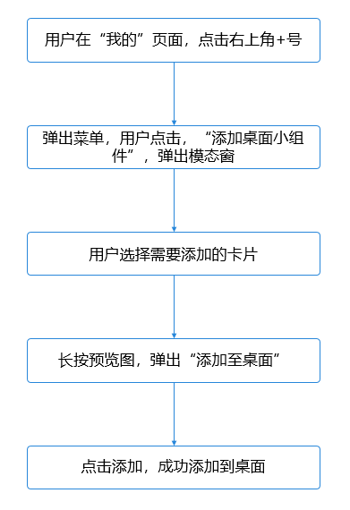


1. 配置好添加卡片的相关数据（ cardRealName：卡片名称；cardDimension：卡片类型； displayName：显示名称； description：卡片描述； url：预览图），已完成卡片布局开发。
  
  
  

```typescript
1. @Component
2. export struct MenuComp {
3.  // ...
4.  @State card: CardInfo = new CardInfo();
5.  @State cardInfos: CardInfo[] = [{
6.  cardRealName: 'PlayControlCard2x2',
7.  cardDimension: 2,
8.  displayName: 'app.string.widget_display_name_control',
9.  description: 'app.string.widget_desc_control',
10.  url: 'app.media.PlayControlCard2x2'
11.  },
12.  // ...
13.  ]
14.  // ...
15. }


```
  [MenuComp.ets](https://gitcode.com/harmonyos_samples/MusicCard/blob/master/entry/src/main/ets/components/MenuComp.ets#L64-L318)

2. 在实现添加至桌面功能时，需要用到[FormMenu](https://developer.huawei.com/consumer/cn/doc/harmonyos-references/ohos-arkui-advanced-formmenu)菜单组件。首先需要导入[AddFormMenuItem](https://developer.huawei.com/consumer/cn/doc/harmonyos-references/ohos-arkui-advanced-formmenu#addformmenuitem)模块，在AddFormMenuItem里面配置好相关参数，在其中的参数options回调中，获取添加是否成功的信息，提示用户，以便用户感知。最后在应用内点击按钮后显示交互菜单。
  
  
  

```typescript
1. import { AddFormMenuItem } from '@kit.ArkUI';
2. // ...
3.
4.  @Builder
5.  MyMenu() {
6.  Menu() {
7.  AddFormMenuItem(
8.  {
9.  bundleName: 'com.huawei.music.card', // Package Name
10.  abilityName: 'PhoneFormAbility', // Module Capability Name
11.  parameters: {
12.  'ohos.extra.param.key.form_dimension': this.card.cardDimension, // Card size, 1 represents 1*2 card, 2 represents 2*2 card, 3 represents 2*4 card, 4 represents 4*4 card, 7 represents 6*4 card, 6 represents 1*1 card
13.  'ohos.extra.param.key.form_name': this.card.cardRealName, // Card Name
14.  'ohos.extra.param.key.module_name': 'entry' // Module name to which the card belongs
15.  },
16.  },
17.  this.compId,
18.  {
19.  formBindingData: formBindingData.createFormBindingData({}),
20.  callback: (error, formId) => {
21.  hilog.info(0x3900, tag, `callback info：error = ${JSON.stringify(error)}, formId = ${formId}`);
22.  if (error?.code === 0) {
23.  this.getUIContext().getPromptAction().showToast({
24.  message: $r('app.string.successfully_added_to_desktop'),
25.  duration: 1000
26.  });
27.  this.isShow = false
28.  } else {
29.  this.getUIContext().getPromptAction().showToast({
30.  message: $r('app.string.error_added_to_desktop'),
31.  duration: 1000
32.  });
33.  }
34.  },
35.  style: {}
36.  }
37.  )
38.  }
39.  }


```
  [MenuComp.ets](https://gitcode.com/harmonyos_samples/MusicCard/blob/master/entry/src/main/ets/components/MenuComp.ets#L16-L259)

3. 在"我的"tab 页面，右上角点击"+"号，触发下拉菜单，点击选项："添加桌面小组件"。
  
  
  

```typescript
1. build() {
2.  Column() {
3.  Text('+')
4.  .height(40)
5.  .fontSize(30)
6.  .textAlign(TextAlign.Center)
7.  .lineHeight(40)
8.  .fontWeight(300)
9.  .bindSheet($$this.isShow, this.SheetModal(), {
10.  detents: [600, SheetSize.MEDIUM, SheetSize.LARGE],
11.  backgroundColor: '#ededeb',
12.  dragBar: true,
13.  title: { title: $r('app.string.add_desktop_widget'), subtitle: "" },
14.  onDisappear: () => {
15.  this.isShow = false
16.  }
17.  })
18.  }


```
  [MenuComp.ets](https://gitcode.com/harmonyos_samples/MusicCard/blob/master/entry/src/main/ets/components/MenuComp.ets#L287-L304)

4. 弹出模态窗。     在[模态窗](https://developer.huawei.com/consumer/cn/doc/harmonyos-references/ts-universal-attributes-sheet-transition)组件中，通过[Menu](https://developer.huawei.com/consumer/cn/doc/harmonyos-references/ts-basic-components-menu)结合[FormMenu](https://developer.huawei.com/consumer/cn/doc/harmonyos-references/ohos-arkui-advanced-formmenu)组件生成可选的卡片类型列表。通过前置条件配置好的信息，拿到所有卡片预览图，采用[轮播图](https://developer.huawei.com/consumer/cn/doc/harmonyos-references/ts-container-swiper)的方式，提供给用户选择不同的卡片预览图，给每一个预览图绑定[bindContextMenu](https://developer.huawei.com/consumer/cn/doc/harmonyos-references/ts-universal-attributes-menu#bindcontextmenu8)属性，预览图支持长按后，添加到桌面。

     用户通过轮播图选择需要添加的卡片之后，也可以通过模态窗下方“添加到桌面”按钮，把卡片添加到桌面。


  
  
  

```typescript
1. @Builder
2. SheetModal() {
3.  Column() {
4.  // ...
5.
6.  Button($r('app.string.long_pressc_btn'))
7.  .fontSize(16)
8.  .width(328)
9.  .height(40)
10.  .bindContextMenu(this.MyMenu(), ResponseType.LongPress, {
11.  placement: Placement.TopLeft
12.  })
13.  }
14.  .alignItems(HorizontalAlign.Center)
15.  .width('100%')
16.  .height('100%')
17. }


```
  [MenuComp.ets](https://gitcode.com/harmonyos_samples/MusicCard/blob/master/entry/src/main/ets/components/MenuComp.ets#L135-L219)
     应用内添加到桌面效果图如下：


  **图12** 应用内添加到桌面  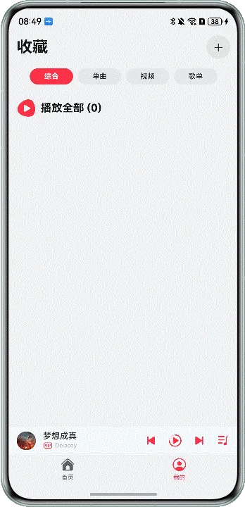


### 音乐播控互动卡片

/


**实现步骤**


1. 用户点击普通卡片播放按钮，卡片会通过FormExtensionAbility的onFormEvent()方法触发溢出接口。
  
  
  

```typescript
1. onFormEvent(formId: string, message: string) {
2.  // Called when a specified message event defined by the form provider is triggered.
3.  let shortMessage: string = JSON.parse(message)['message'];
4.  hilog.info(0x0000, TAG, 'onFormEvent');
5.  if (shortMessage === 'requestOverFlow') {
6.  this.trigger3DLiveRequest(formId);
7.  }
8. }


```
  [EntryFormAbility.ets](https://gitcode.com/harmonyos_samples/MusicCard/blob/master/entry/src/main/ets/entryformability/EntryFormAbility.ets#L173-L180)
     请求溢出接口如下


  
  
  

```typescript
1. private trigger3DLiveRequest(formId: string) {
2.  formProvider.getFormRect(formId).then((data: formInfo.Rect) => {
3.  let cardWidth = data.width * CommonConstants.LIVE_CARD_RATIO;
4.  let cardHeight = data.height * CommonConstants.LIVE_CARD_RATIO;
5.  let leftOffset = (data.width - cardWidth) / 2;
6.  let topOffset = (data.height - cardHeight) / 2;
7.  formProvider.requestOverflow(formId, {
8.  area: {
9.  left: leftOffset,
10.  top: topOffset,
11.  width: cardWidth,
12.  height: cardHeight
13.  },
14.  duration: 3500
15.  }).then(() => {
16.  hilog.info(0x0000, TAG, 'requestOverflow result succeed');
17.  }).catch((error: BusinessError) => {
18.  hilog.error(0x0000, TAG, `requestOverflow catch error, code: ${error.code}, message: ${error.message}`)
19.  })
20.  }).catch((error: BusinessError) => {
21.  hilog.error(0x0000, TAG, `getFormRect catch error, code: ${error.code}, message: ${error.message}`)
22.  })
23.  return;
24. }


```
  [EntryFormAbility.ets](https://gitcode.com/harmonyos_samples/MusicCard/blob/master/entry/src/main/ets/entryformability/EntryFormAbility.ets#L146-L169)

2. LiveFormExtensionAbility中配置卡片激活态ui文件，并设置背景图。
  
  
  

```typescript
1. export default class UIExtensionAbility extends LiveFormExtensionAbility {
2.  async onLiveFormCreate(liveFormInfo: LiveFormInfo, session: UIExtensionContentSession) {
3.  hilog.info(0x0000, TAG, `onLiveFormCreate, liveformInfo: ${JSON.stringify(liveFormInfo)}`);
4.
5.  let storage: LocalStorage = new LocalStorage();
6.  storage.setOrCreate('context', this.context);
7.
8.  let formId: string = liveFormInfo.formId;
9.  AppStorage.setOrCreate('formId', formId);
10.  storage.setOrCreate('formId', formId);
11.
12.  let formRect: formInfo.Rect = liveFormInfo.rect;
13.  storage.setOrCreate('formRect', formRect);
14.
15.  let borderRadius: number = liveFormInfo.borderRadius;
16.  storage.setOrCreate('radius', borderRadius);
17.
18.  try {
19.  session.loadContent('uiextensionability/pages/Index', storage);
20.  } catch (error) {
21.  hilog.error(0x0000, TAG, `loadContent catch error, code: ${error.code}, message: ${error.message}`)
22.  }
23.
24.  let songRdbHelper = SongRdbHelper.getInstance(this.context);
25.  let initSongs: Array<SongItem> = await songRdbHelper.queryAllSongs();
26.  if (initSongs.length <= 0) {
27.  initSongs = getSongListData(this.context);
28.  songRdbHelper.insertSongs(initSongs);
29.  }
30.  AppStorage.setOrCreate('songList', initSongs);
31.  let currentSong = await PreferencesUtil.getInstance().getCurrentSong(this.context);
32.  if (!currentSong) {
33.  currentSong = initSongs[0];
34.  PreferencesUtil.getInstance().putCurrentSong(this.context, currentSong);
35.  }
36.  AppStorage.setOrCreate('currentSong', currentSong);
37.  }
38.
39.  onLiveFormDestroy(liveFormInfo: LiveFormInfo): void {
40.  hilog.info(0x0000, TAG, `onLiveFormDestroy, liveFormInfo: ${JSON.stringify(liveFormInfo)}`);
41.  }
42. }


```
  [UIExtensionAbility.ets](https://gitcode.com/harmonyos_samples/MusicCard/blob/master/entry/src/main/ets/uiextensionability/UIExtensionAbility.ets#L27-L68)

  
  
  
  说明
      设置背景图的目的是为了盖住普通卡片的布局，重新绘制激活态卡片。

3. 在激活态UI文件中绘制与普通卡片文件相同的ui布局，并描绘溢出动效。
  
  
  

```typescript
1. build() {
2.  Stack({ alignContent: Alignment.BottomStart }) {
3.  RelativeContainer() {
4.  // ...
5.  }
6.  .height(this.formHeight)
7.  .width(this.formWidth)
8.  .borderRadius(this.formRadius)
9.  .padding(12)
10.  .linearGradient({
11.  direction: GradientDirection.Bottom,
12.  repeating: false,
13.  colors: [[`#ff${this.imageColorHex}`, 0.0], [`#ff${this.imageColorHex}`, 0.5],
14.  [`#ff${this.imageColorHex}`, 1.0]]
15.  })
16.  .margin({
17.  left: this.formLeft,
18.  bottom: this.formBottom
19.  })
20.
21.  Stack({ alignContent: Alignment.Center }) {
22.  Image($r('app.media.blackVinyl'))
23.  .height(88)
24.  .width(88)
25.
26.  Button()
27.  .backgroundImage(this.currentSong.label)
28.  .backgroundImageSize(ImageSize.Cover)
29.  .height(58)
30.  .width(58)
31.  .backgroundColor($r('sys.color.titlebar_icon_background_color'))
32.  }
33.  .alignRules(CoverAlignRules)
34.  .margin({
35.  left: CommonConstants.ANIMATE_COMPONENT_LEFT,
36.  bottom: CommonConstants.ANIMATE_COMPONENT_BOTTOM
37.  })
38.  .scale({
39.  x: this.columnScale,
40.  y: this.columnScale
41.  })
42.  .translate({
43.  x: this.columnTranslate,
44.  y: this.rowTranslate
45.  })
46.  .rotate({
47.  x: 0,
48.  y: 0,
49.  z: 1,
50.  angle: this.rotateAngle
51.  })
52.  .onAppear(() => {
53.  this.runEnlargeAnimation();
54.  })
55.  }
56.  .width('100%')
57.  .height('100%')
58. }


```
  [Index.ets](https://gitcode.com/harmonyos_samples/MusicCard/blob/master/entry/src/main/ets/uiextensionability/pages/Index.ets#L110-L197)


### 歌单推荐卡片

歌单推荐有1x2和2x4两个规格的卡片，效果图如下：


**图13** 歌单推荐卡片效果图


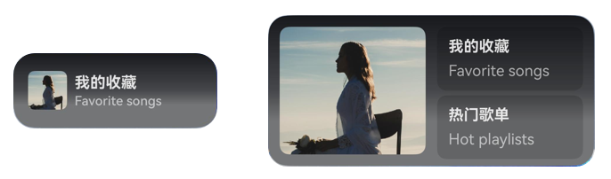


**实现步骤**


1. **更新卡片图片**     歌单推荐封面图片加载的是网络图片，加载网络图片需要申请ohos.permission.INTERNET权限。在卡片预览的时候会下载网络图片，并更新到卡片。网络图片的下载以及如何更新到卡片，开发者可以参考：[刷新本地图片和网络图片](https://developer.huawei.com/consumer/cn/doc/harmonyos-guides/arkts-ui-widget-image-update)。


  1. 首先在EntryFormAbility的onAddForm()方法中，调用FormUtils的updateRecommendedCard()方法更新卡片，示例代码如下。
  
  
  

```typescript
1. export default class EntryFormAbility extends FormExtensionAbility {
2.  onAddForm(want: Want) {
3.  hilog.info(0x0000, TAG, 'onAddForm');
4.  if (want.parameters) {
5.  let formId = want.parameters['ohos.extra.param.key.form_identity'] as string;
6.  let formName = want.parameters['ohos.extra.param.key.form_name'] as string;
7.  // ...
8.
9.  if (formName === 'RecommendedMusic1x2' || formInfo.formName === 'RecommendedMusic2x4') {
10.  FormUtils.updateRecommendedCard(this.context, formInfo.formId, IMAGE_URL1);
11.  }
12.  }
13.  return formBindingData.createFormBindingData('');
14.  }
15.
16.  // ...
17. }

```
    [EntryFormAbility.ets](https://gitcode.com/harmonyos_samples/MusicCard/blob/master/entry/src/main/ets/entryformability/EntryFormAbility.ets#L40-L215)

  2. 然后通过updateRecommendedCard()方法下载网络图片，并将图片添加到缓存中，接着调用updateForm()方法更新卡片。
  
  
  

```typescript
1. // src/main/ets/utils/FormUtils.ets
2. class FormUtils {
3.  // ...
4.  public async updateRecommendedCard(context: Context, formId: string, imageUrl: string) {
5.  try {
6.  let tempDir = context.getApplicationContext().tempDir;
7.  let fileName = 'file' + Date.now();
8.  let tmpFile = tempDir + '/' + fileName + '.jpg';
9.  let httpRequest = http.createHttp();
10.  let data = await httpRequest.request(imageUrl);
11.  let imgMap: Record<string, number> = {};
12.
13.  class FormDataClass {
14.  imgBg: string = fileName;
15.  formImages: Record<string, number> = imgMap;
16.  isLoaded: boolean = true;
17.  imageColorHex: string = '';
18.  }
19.
20.  if (data.responseCode === http.ResponseCode.OK) {
21.  let imgFile = fileIo.openSync(tmpFile, fileIo.OpenMode.READ_WRITE | fileIo.OpenMode.CREATE);
22.  imgMap[fileName] = imgFile.fd;
23.  try {
24.  let imageBuffer: ArrayBuffer = data.result as ArrayBuffer;
25.  let writeLen: number = fileIo.writeSync(imgFile.fd, imageBuffer);
26.  let imageDealData = await ImageUtils.getImageDealDataByArr(imageBuffer);
27.  Logger.info(TAG, `write data to file succeed and size is: ${writeLen}`);
28.  Logger.info(TAG, `ArkTSCard download complete: ${tmpFile}`);
29.  let formData = new FormDataClass();
30.  formData.imageColorHex = imageDealData.imageColorHex;
31.  this.updateForm(formId, formData);
32.  } catch (err) {
33.  Logger.error(TAG, `write data to file failed with error: ${JSON.stringify(err)}`);
34.  } finally {
35.  fileIo.closeSync(imgFile);
36.  httpRequest.destroy();
37.  }
38.  } else {
39.  Logger.error(TAG, `ArkTSCard download task failed`);
40.  }
41.  } catch (err) {
42.  let error = err as BusinessError;
43.  Logger.error(TAG, `updateRecommendedCard err, code: ${error.code}, mesage: ${error.message}`);
44.  }
45.  }
46.
47.
48.  // ...
49. }

```
    [FormUtils.ets](https://gitcode.com/harmonyos_samples/MusicCard/blob/master/entry/src/main/ets/utils/FormUtils.ets#L50-L455)

  3. 最后Image组件通过入参(memory://fileName)的方式来进行加载缓存中的图片。
  
  
  

```typescript
1. // src/main/ets/widget/pages/RecommendedMusic2x4.ets
2. @Entry(storageUpdateCall2)
3. @Component
4. struct RecommendedMusic2x4 {
5.  readonly ABILITY_NAME: string = 'EntryAbility';
6.  readonly ACTION_TYPE: string = 'router';
7.  @LocalStorageProp('imgBg') imgBg: ResourceStr = '';
8.  @LocalStorageProp('isLoaded') isLoaded: boolean = false;
9.  // ...
10.
11.  build() {
12.  FormLink({
13.  action: this.ACTION_TYPE,
14.  abilityName: this.ABILITY_NAME,
15.  }) {
16.  Row() {
17.  Image(this.isLoaded ? `memory://${this.imgBg}` : $r('app.media.ic_avatar16'))
18.  .height('100%')
19.  .borderRadius(10)
20.  .layoutWeight(1)
21.  .margin({ right: 6 })
22.  // ...
23.  }
24.  // ...
25.  }
26.  }
27. }

```
    [RecommendedMusic2x4.ets](https://gitcode.com/harmonyos_samples/MusicCard/blob/master/entry/src/main/ets/widget/pages/RecommendedMusic2x4.ets#L21-L150)


  
  
  说明
      卡片加载的图片过大可能会导致卡片白屏，建议卡片加载的图片大小不超过2M，在加载卡片图片前需要判断下图片是否过大，如果过大可以采取压缩的方案，图片压缩可以参考FAQ：[如何将PixelMap压缩到指定大小以下](https://developer.huawei.com/consumer/cn/doc/harmonyos-faqs/faqs-image-16)。

2. **卡片跳转功能实现**     下面将以2x4卡片实现为例进行介绍，歌单推荐卡片使用的是静态卡片，通过[FormLink](https://developer.huawei.com/consumer/cn/doc/harmonyos-references/ts-container-formlink)组件进行跳转，有以下三种跳转场景。


  - 点击“我的收藏”方块跳转到收藏页面。
  - 点击“热门歌单”跳转到热门歌单页面。
  - 点击其他区域直接拉起应用。


  1. 在卡片中使用FormLink组件绑定router事件。
  
  
  

```typescript
1. // src/main/ets/widget/pages/RecommendedMusic2x4.ets
2. @Entry(storageUpdateCall2)
3. @Component
4. struct RecommendedMusic2x4 {
5.  readonly ABILITY_NAME: string = 'EntryAbility';
6.  readonly ACTION_TYPE: string = 'router';
7.  // ...
8.
9.  build() {
10.  FormLink({
11.  action: this.ACTION_TYPE,
12.  abilityName: this.ABILITY_NAME,
13.  }) {
14.  Row() {
15.  Image(this.isLoaded ? `memory://${this.imgBg}` : $r('app.media.ic_avatar16'))
16.  // ...
17.  Column() {
18.  FormLink({
19.  action: this.ACTION_TYPE,
20.  abilityName: this.ABILITY_NAME,
21.  params: {
22.  type: RouterType.COLLECTED
23.  }
24.  }) {
25.  Column() {
26.  Text($r('app.string.my_collect'))
27.  // ...
28.  Text('Favorite songs')
29.  // ...
30.  }
31.  // ...
32.  }
33.
34.  FormLink({
35.  action: this.ACTION_TYPE,
36.  abilityName: this.ABILITY_NAME,
37.  params: {
38.  type: RouterType.PLAYLISTS
39.  }
40.  }) {
41.  Column() {
42.  Text($r('app.string.hot_playlists'))
43.  // ...
44.  Text('Hot playlists')
45.  // ...
46.  }
47.  // ...
48.  }
49.  }
50.  .layoutWeight(1)
51.  .margin({ left: 6 })
52.  }
53.  // ...
54.  }
55.  }
56. }


```
    [RecommendedMusic2x4.ets](https://gitcode.com/harmonyos_samples/MusicCard/blob/master/entry/src/main/ets/widget/pages/RecommendedMusic2x4.ets#L22-L151)

  2. 在EntryAbility的生命周期中处理跳转事件。         通过router事件拉起应用后，在应用侧EntryAbility的onCreate和onNewWant中接收到这三个事件以及事件携带的参数，为了区分，此处新增一个参数type，根据type，应用侧收到事件后可以做相应的业务处理。此处最外层的FormLink仅仅是拉起应用，不需要处理。后续处理“跳转收藏页面”和“跳转热门歌单”两个事件，示例代码如下：


  
  
  

```typescript
1. // src/main/ets/entryability/EntryAbility.ets
2. export default class EntryAbility extends UIAbility {
3.  // ...
4.  onCreate(want: Want, launchParam: AbilityConstant.LaunchParam) {
5.  // ...
6.  this.handleParams(want);
7.  // ...
8.  }
9.
10.
11.  onNewWant(want: Want, launchParam: AbilityConstant.LaunchParam): void {
12.  this.handleParams(want);
13.  }
14.
15.
16.  handleParams(want: Want) {
17.  Logger.info(TAG, 'handleParams');
18.  if (want?.parameters?.params) {
19.  let params: Record<string, Object> = JSON.parse(want.parameters.params as string);
20.  let type = params.type as string;
21.  // ...
22.  if (type === RouterType.PLAYLISTS) {
23.  AppStorage.setOrCreate('isToHotPlaylist', true);
24.  }
25.
26.  if (type === RouterType.COLLECTED) {
27.  AppStorage.setOrCreate('mainTabIndex', 1);
28.  AppStorage.setOrCreate('isShowPlay', false);
29.  }
30.  }
31.  }
32.
33.
34.  // ...
35. }


```
    [EntryAbility.ets](https://gitcode.com/harmonyos_samples/MusicCard/blob/master/entry/src/main/ets/entryability/EntryAbility.ets#L48-L485)

  3. 在MainPage中根据参数跳转收藏页和热门歌单页面。         在音乐应用中，“我的收藏”页面是首页Tabs的一个页签。通过更新AppStorage中的mainTabIndex值来切换页面，其中1表示“我的收藏”标签页。首页通过@StorageLink监听mainTabIndex的变化以实现页面切换。


  
  
  

```typescript
1. // src/main/ets/pages/MainPage.ets
2. @Entry
3. @Component
4. struct MainPage {
5.  @StorageLink('mainTabIndex') currentIndex: number = 0;
6.  @Provide('pageStack') pageStack: NavPathStack = new NavPathStack();
7.  // ...
8.  build() {
9.  Navigation(this.pageStack) {
10.  Column() {
11.  Tabs({ index: this.currentIndex, barPosition: BarPosition.End }) {
12.  TabContent() {
13.  RecommendedMusic()
14.  }
15.
16.  TabContent() {
17.  CollectedMusic()
18.  }
19.  }
20.  // ...
21.  .onChange((index) => {
22.  this.currentIndex = index;
23.  })
24.
25.  // ...
26.  }
27.  .padding({
28.  top: AppStorage.get<number>('statusBarHeight') ?? 0,
29.  bottom: AppStorage.get<number>('naviIndicatorHeight') ?? 0
30.  })
31.  .backgroundColor('#F1F3F5')
32.
33.  }
34.  .hideTitleBar(true)
35.  .navDestination(this.PageMap)
36.  .mode(NavigationMode.Stack)
37.  }
38. }


```
    [MainPage.ets](https://gitcode.com/harmonyos_samples/MusicCard/blob/master/entry/src/main/ets/pages/MainPage.ets#L26-L107)
         跳转热门歌单，是当用户点击卡片上的“热门歌单”拉起应用后，音乐应用会从首页自动跳转到热门歌单列表页面。这一过程通过在MainPage的onPageShow回调函数中判断isToPlaylists参数来实现，如果该参数为true，则使用pageStack.pushPathByName()方法跳转到热门歌单页面。示例代码如下：


  
  
  

```typescript
1. // src/main/ets/pages/MainPage.ets
2. @Entry
3. @Component
4. struct MainPage {
5.  @StorageLink('mainTabIndex') currentIndex: number = 0;
6.  @Provide('pageStack') pageStack: NavPathStack = new NavPathStack();
7.  @StorageLink('isToHotPlaylist') isToHotPlaylist: boolean = false;
8.  // ...
9.
10.  @Builder
11.  PageMap(name: string) {
12.  if (name === 'Playlists') {
13.  HotPlaylist()
14.  }
15.  }
16.
17.  onPageShow(): void {
18.  if (this.isToHotPlaylist) {
19.  this.isToHotPlaylist = false;
20.  // ...
21.  if (stackIndexArray.length > 0 && stackIndexArray[stackIndexArray.length-1] === 'Playlists') {
22.  this.pageStack.replacePathByName('Playlists', this.playlistsTitle);
23.  } else {
24.  this.pageStack.pushPathByName('Playlists', this.playlistsTitle);
25.  }
26.  }
27.  }
28.
29.  build() {
30.  Navigation(this.pageStack) {
31.  // ...
32.  }
33.  .hideTitleBar(true)
34.  .navDestination(this.PageMap)
35.  .mode(NavigationMode.Stack)
36.  }
37. }


```
    [MainPage.ets](https://gitcode.com/harmonyos_samples/MusicCard/blob/master/entry/src/main/ets/pages/MainPage.ets#L27-L108)


  
  
  说明
      在通过卡片多次拉起应用进行页面路由时，可能会导致页面栈中同一页面出现多次，从而使得返回操作需要执行多次。为了避免这种情况，应对页面跳转逻辑进行优化，具体处理方法可以参考：[多次点击服务卡片拉起应用指定页面后，该页面在路由栈内存在多个，导致返回上一面需要多次返回操作](https://developer.huawei.com/consumer/cn/doc/best-practices/bpta-music-card#section11706154125217)。

  

     跳转效果如下图所示：


  **图14** 点击卡片跳转效果图  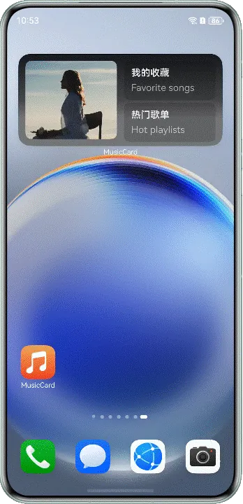


### 心动歌词卡片

本章将介绍心动歌词卡片的两大核心功能：歌词卡片数据更新和沉浸式卡片设计。歌词卡片数据通过定时刷新来更新卡片数据，而沉浸式卡片则通过设置背景色和背景图片来增强视觉体验。


**实现步骤**


1. 歌词卡片数据更新实现。     本示例中歌词卡片是通过定时刷新的方式进行刷新，首先需要在卡片配置文件form_config中进行配置，设置updateEnabled参数的值为true，表示卡片支持周期性刷新（包含定时刷新和定点刷新），设置updateDuration参数的值为1，表示每隔30分钟会进行刷新卡片，参数配置如下：


  
  

```json
1. // src/main/resources/base/profile/form_config.json
2. {
3.  "forms": [
4.  // ...
5.  {
6.  "name": "LyricsCard",
7.  // ...
8.  "updateDuration": 1,
9.  "defaultDimension": "2*4",
10.  "supportDimensions": [
11.  "2*4",
12.  "4*4"
13.  ]
14.  }
15.  ]
16. }


```
     接着在EntryFormAbility的onUpdateForm()回调方法中，对卡片数据进行刷新。由于onUpdateForm()方法中的参数只有formId，而本示例涉及三种类型的卡片（音乐播控、歌单推荐和心动歌词），因此需要依据formId查询数据库以获取卡片的具体信息。若查询到卡片的formName为"LyricsCard"，则执行相应的数据更新操作。示例代码如下：


  
  
  

```typescript
1. export default class EntryFormAbility extends FormExtensionAbility {
2.  // ...
3.
4.  onUpdateForm(formId: string) {
5.  // ...
6.  FormRdbHelper.getInstance(this.context)
7.  .queryFormById(formId)
8.  .then((formInfo) => {
9.  // ...
10.  if (formInfo.formName === 'LyricsCard') {
11.  FormUtils.updateLyricsCard(this.context, formInfo.formId);
12.  }
13.  // ...
14.  });
15.  }
16.  // ...
17. }


```
  [EntryFormAbility.ets](https://gitcode.com/harmonyos_samples/MusicCard/blob/master/entry/src/main/ets/entryformability/EntryFormAbility.ets#L41-L216)

  
  
  

```typescript
1. // src/main/ets/utils/FormUtils.ets
2. class FormUtils {
3.  // ...
4.  public async updateLyricsCard(context: Context, formId: string) {
5.  let songData = getRandomLyrics(context);
6.  let songItem: SongItem = songData.songItem as SongItem;
7.  let imageDealData = await ImageUtils.getImageDealData(context, songItem.label);
8.
9.  class CardUpdateData {
10.  lrcArray: Array<string> = songData.randomLrcStr as Array<string>;
11.  formId: string = formId;
12.  singer: string = songItem.singer;
13.  title: string = songItem.title;
14.  songId: string = songItem.id;
15.  musicCover: Resource = songItem.label;
16.  imageColor = imageDealData.imageColor;
17.  }
18.
19.  this.updateForm(formId, new CardUpdateData());
20.  }
21.  // ...
22. }


```
  [FormUtils.ets](https://gitcode.com/harmonyos_samples/MusicCard/blob/master/entry/src/main/ets/utils/FormUtils.ets#L51-L456)

2. 卡片沉浸式方案实现。     使用Stack堆叠布局，将歌曲封面作为底部背景图，设置图片大小'200%'、透明度0.5、以及模糊度100，开发者可以根据设计自行调节。使用歌曲封面图片的颜色imageColor作为卡片背景色，imageColor的获取可参考[音乐播控](https://developer.huawei.com/consumer/cn/doc/best-practices/bpta-music-card#section29858211157)卡片章节。示例代码如下：


  
  
  

```typescript
1. // src/main/ets/widget/pages/LyricsCard.ets
2. @Entry(storageUpdateCall1)
3. @Component
4. struct LyricsCard {
5.  @LocalStorageProp('musicCover') musicCover: Resource = $r('app.media.ic_dream');
6.  @LocalStorageProp('imageColor') imageColor: string = 'rgba(76, 72, 68, 1)';
7.  // ...
8.  build() {
9.  FormLink({
10.  action: FormCarAction.ROUTER,
11.  abilityName: ENTRY_ABILITY,
12.  params: {
13.  songId: this.songId,
14.  type: RouterType.LYRICS
15.  }
16.  }) {
17.  Stack() {
18.  Image(this.musicCover)
19.  .height('200%')
20.  .width('200%')
21.  .objectFit(ImageFit.Cover)
22.  .opacity(0.5)
23.  .blur(100)
24.
25.  Column() {
26.  // ...
27.  }
28.  // ...
29.  }
30.  .backgroundColor(this.imageColor)
31.  }
32.  }
33. }


```
  [LyricsCard.ets](https://gitcode.com/harmonyos_samples/MusicCard/blob/master/entry/src/main/ets/widget/pages/LyricsCard.ets#L21-L126)
     效果图如下：


  **图15** 心动歌词卡片效果图     


## 常见问题


### 多次点击服务卡片拉起应用指定页面后，该页面在路由栈内存在多个，导致返回上一面需要多次返回操作。

应用在接收到对应的router跳转事件后，处理跳转的时候需要判断跳转的页面是否已经在路由栈的栈顶，如果在的话需要替换当前的页面，如果不在的话，重新push这个页面到栈。下面以Navigation跳转路由页面为例：


```typescript
1. let stackIndexArray = this.pageStack.getAllPathName();
2. if (stackIndexArray.length > 0 && stackIndexArray[stackIndexArray.length-1] === 'Playlists') {
3.  this.pageStack.replacePathByName('Playlists', this.playlistsTitle);
4. } else {
5.  this.pageStack.pushPathByName('Playlists', this.playlistsTitle);
6. }

```


[MainPage.ets](https://gitcode.com/harmonyos_samples/MusicCard/blob/master/entry/src/main/ets/pages/MainPage.ets#L52-L59)


### 手机重启/解锁后卡片内图片消失，出现白屏

该问题可能是卡片加载的图片过大导致的，在加载卡片图片前需要判断图片是否过大，如果过大可以采取压缩的方案，图片压缩可以参考FAQ：[如何将PixelMap压缩到指定大小以下](https://developer.huawei.com/consumer/cn/doc/harmonyos-faqs/faqs-image-16)。关于卡片图片加载规格限制说明可以参考：[刷新本地图片和网络图片](https://developer.huawei.com/consumer/cn/doc/harmonyos-guides/arkts-ui-widget-image-update)。


### 手机重启后卡片数据变回兜底内容

卡片框架在重启时是使用onAddForm()回调方法的返回值，若应用重启前调用updateForm()更新的数据和onAddForm()方法返回的数据不一致，可能导致设备重启前后卡片数据不一致，因此需要对数据做持久化处理。例如使用关系型数据库存储卡片最新数据，在FormExtensionAbility的onAddForm()生命周期回调中，获取数据库中的最新数据后，使用updateForm()方法更新卡片。


### 在卡片生命周期和应用UIAbility生命周期获取的temp目录不同，需要分别获取，不能一次存储两端使用。

卡片更新时图片存储在从UIAbility的context获取的temp路径下，与创建时拉起的FormExtensionAbility的temp路径不同。若直接用数据库取出的数据进行卡片更新，会导致图片不能加载。因此，如果在FormExtensionAbility中，从数据库中取到卡片最新数据后，需要再次获取FormExtensionAbility下的temp路径打开本地/网络图片，获取到对应的fd之后再进行数据绑定刷新。


### 如何进行卡片渲染问题定位？

可以在DevEco Studio中查看日志，选择“com.ohos.formrenderservice”卡片渲染服务，通过error日志查看具体卡片渲染报错原因。


## 示例代码

- [基于Form Kit实现音乐服务卡片](https://gitcode.com/harmonyos_samples/MusicCard)
