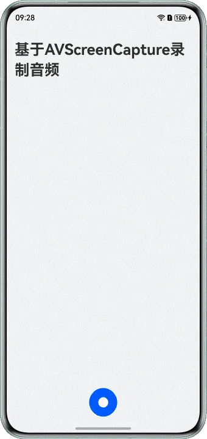

# 基于AVScreenCapture录制音频

## 概述

AVScreenCapture具备采集设备内部音频和麦克风音频的能力，可以录制设备内播放的音频或者麦克风的音频。本文适用于音频录制类应用的开发，针对市场上主流音频录制类应用的常见场景，介绍了如何基于AVScreenCapture录制音频，指导开发者实现基础录制。


基于AVScreenCapture录制音频实现的功能效果如下：





本文的主要内容如下：


[基础录制](https://developer.huawei.com/consumer/cn/doc/best-practices/bpta-audio-record-base-on-avscreencapture#section20569101215108)：介绍在C/C++侧基于AVScreenCapture录制音频，包括开始录制、结束录制。


## 基础录制


### 实现原理

开发者可以调用C/C++侧屏幕录制[AVScreenCapture](https://developer.huawei.com/consumer/cn/doc/harmonyos-guides/media-kit-intro#avscreencapture)模块的接口，完成屏幕录制，采集设备内部音频和麦克风等的音视频源数据。通过AVScreenCapture可以实现单独录制音频文件的功能，在录制音频文件时，支持录制m4a的音频格式，关键流程包括开始录制、停止录制、释放资源等。


### 开发步骤

1.在CMake脚本中链接动态库libnative_avscreen_capture.so、libnative_media_core.so等。


```scss
1. target_link_libraries(entry PUBLIC libace_napi.z.so libace_ndk.z.so libjsvm.so libhilog_ndk.z.so libnative_avscreen_capture.so libuv.so libnative_media_core.so)

```


[CMakeLists.txt](https://gitcode.com/HarmonyOS_Samples/avscreen-capture-record-system-audio-arkts/blob/master/entry/src/main/cpp/CMakeLists.txt#L16-L16)


2.配置音频录制相关参数。


- 设置视频录制相关参数OH_VideoInfo，包括OH_VideoCaptureInfo和OH_VideoEncInfo。


说明

AVScreenCapture用于实现屏幕录制。当OH_VideoCaptureInfo的videoFrameWidth和videoFrameHeight设置为0时，AVScreenCapture会忽略视频相关参数，不录制屏幕数据。


- 设置音频相关参数OH_AudioInfo，包括音频采集信息OH_AudioCaptureInfo、音频编码信息OH_AudioEncInfo。


```cpp
1. // Configuration parameters
2. void AVScreenCapture::SetConfig(OH_AVScreenCaptureConfig &config) {
3.  OH_RecorderInfo recorderInfo;
4.  recorderInfo.fileFormat = OH_ContainerFormatType::CFT_MPEG_4A;
5.  // Config VideoCaptureInfo
6.  OH_VideoCaptureInfo videoCapInfo = {
7.  .videoFrameWidth = 0, .videoFrameHeight = 0, .videoSource = OH_VIDEO_SOURCE_SURFACE_RGBA};
8.  // Config VideoEncInfo
9.  OH_VideoEncInfo videoEncInfo = {
10.  .videoCodec = OH_VideoCodecFormat::OH_H264, .videoBitrate = 2000000, .videoFrameRate = 30};
11.  // Config VideoInfo
12.  OH_VideoInfo videoInfo = {.videoCapInfo = videoCapInfo, .videoEncInfo = videoEncInfo};
13.
14.  // Config Mic Capture Info
15.  OH_AudioCaptureInfo micCapInfo = {.audioSampleRate = 48000, .audioChannels = 2, .audioSource = OH_MIC};
16.  // Config inner Capture Info
17.  OH_AudioCaptureInfo innerCapInfo = {.audioSampleRate = 48000, .audioChannels = 2, .audioSource = OH_ALL_PLAYBACK};
18.  // Config Audio Encoder Info
19.  OH_AudioEncInfo audioEncInfo = {.audioBitrate = 96000, .audioCodecformat = OH_AudioCodecFormat::OH_AAC_LC};
20.  // Config Audio Info
21.  OH_AudioInfo audioInfo = {.micCapInfo = micCapInfo, .innerCapInfo = innerCapInfo, .audioEncInfo = audioEncInfo};
22.
23.  config.captureMode = OH_CAPTURE_HOME_SCREEN; // screen capture mode
24.  config.dataType = OH_CAPTURE_FILE; // data type
25.  config.audioInfo = audioInfo; // audio info
26.  config.videoInfo = videoInfo; // video info
27.  config.recorderInfo = recorderInfo; // recorder info
28. }

```


[AVScreenCapture.cpp](https://gitcode.com/HarmonyOS_Samples/avscreen-capture-record-system-audio-arkts/blob/master/entry/src/main/cpp/capabilities/AVScreenCapture.cpp#L137-L164)


3.启动音频录制。


- 在调用[OH_AVScreenCapture_Create()](https://developer.huawei.com/consumer/cn/doc/harmonyos-references/capi-native-avscreen-capture-h#oh_avscreencapture_create)创建录制对象后，通过环境配置OH_AVScreenCaptureConfig初始化该对象。
- 然后，调用OH_AVScreenCapture_StartScreenRecording()启动音频录制。


```cpp
1. OH_AVSCREEN_CAPTURE_ErrCode AVScreenCapture::StartScreenCaptureToFile(int32_t outputFd) {
2.  if (avScreenCapture != nullptr) {
3.  StopScreenCaptureRecording(avScreenCapture);
4.  OH_AVScreenCapture_Release(avScreenCapture);
5.  }
6.  avScreenCapture = OH_AVScreenCapture_Create();
7.  if (avScreenCapture == nullptr) {
8.  OH_LOG_ERROR(LOG_APP, "AVScreenCapture create screen capture failed");
9.  }
10.  OH_AVScreenCaptureConfig config_;
11.  SetConfig(config_);
12.  std::string fileUrl = "fd://" + std::to_string(outputFd);
13.  config_.recorderInfo.url = const_cast<char *>(fileUrl.c_str());
14.
15.  OH_AVScreenCapture_SetMicrophoneEnabled(avScreenCapture, true);
16.  OH_AVScreenCapture_SetErrorCallback(avScreenCapture, OnErrorSaveFile, nullptr);
17.  OH_AVScreenCapture_SetStateCallback(avScreenCapture, OnStateChangeSaveFile, nullptr);
18.
19.  OH_AVSCREEN_CAPTURE_ErrCode result = OH_AVScreenCapture_Init(avScreenCapture, config_);
20.
21.  if (result != AV_SCREEN_CAPTURE_ERR_OK) {
22.  OH_LOG_INFO(LOG_APP, "AVScreenCapture ScreenCapture OH_AVScreenCapture_Init failed %{public}d", result);
23.  }
24.  OH_LOG_INFO(LOG_APP, "AVScreenCapture ScreenCapture OH_AVScreenCapture_Init succ %{public}d", result);
25.
26.  result = OH_AVScreenCapture_StartScreenRecording(avScreenCapture);
27.  if (result != AV_SCREEN_CAPTURE_ERR_OK) {
28.  OH_LOG_INFO(LOG_APP, "AVScreenCapture ScreenCapture Started failed %{public}d", result);
29.  OH_AVScreenCapture_Release(avScreenCapture);
30.  }
31.  OH_LOG_INFO(LOG_APP, "AVScreenCapture ScreenCapture Started succ %{public}d", result);
32.  isRunning = true;
33.  return result;
34. }

```


[AVScreenCapture.cpp](https://gitcode.com/HarmonyOS_Samples/avscreen-capture-record-system-audio-arkts/blob/master/entry/src/main/cpp/capabilities/AVScreenCapture.cpp#L195-L228)


4.停止音频录制。


```cpp
1. OH_AVSCREEN_CAPTURE_ErrCode AVScreenCapture::StopScreenCaptureToFile() {
2.  OH_AVSCREEN_CAPTURE_ErrCode result = AV_SCREEN_CAPTURE_ERR_OPERATE_NOT_PERMIT;
3.
4.  if (isRunning && avScreenCapture != nullptr) {
5.  OH_LOG_INFO(LOG_APP, "AVScreenCapture ScreenCapture File Stop");
6.  result = OH_AVScreenCapture_StopScreenRecording(avScreenCapture);
7.  if (result != AV_SCREEN_CAPTURE_ERR_BASE) {
8.  OH_LOG_ERROR(LOG_APP,
9.  "AVScreenCapture StopScreenCapture OH_AVScreenCapture_StopScreenRecording Result: %{public}d",
10.  result);
11.  } else {
12.  OH_LOG_INFO(LOG_APP, "AVScreenCapture StopScreenCapture OH_AVScreenCapture_StopScreenRecording");
13.  }
14.  result = OH_AVScreenCapture_Release(avScreenCapture);
15.  if (result != AV_SCREEN_CAPTURE_ERR_BASE) {
16.  OH_LOG_ERROR(LOG_APP, "AVScreenCapture StopScreenCapture OH_AVScreenCapture_Release: %{public}d", result);
17.  } else {
18.  OH_LOG_INFO(LOG_APP, "AVScreenCapture OH_AVScreenCapture_Release success");
19.  }
20.  isRunning = false;
21.  avScreenCapture = nullptr;
22.  }
23.  return result;
24. }

```


[AVScreenCapture.cpp](https://gitcode.com/HarmonyOS_Samples/avscreen-capture-record-system-audio-arkts/blob/master/entry/src/main/cpp/capabilities/AVScreenCapture.cpp#L168-L191)


5.释放音频录制资源。


```cpp
1. void AVScreenCapture::ReleaseAVScreenCapture(struct OH_AVScreenCapture *capture) {
2.  StopScreenCaptureRecording(capture);
3.  if (capture != nullptr) {
4.  OH_LOG_INFO(LOG_APP, "AVScreenCapture ScreenCapture ReleaseSCInstanceWorker S");
5.  OH_AVScreenCapture_Release(capture);
6.  isRunning = false;
7.  avScreenCapture = nullptr;
8.  }
9. }

```


[AVScreenCapture.cpp](https://gitcode.com/HarmonyOS_Samples/avscreen-capture-record-system-audio-arkts/blob/master/entry/src/main/cpp/capabilities/AVScreenCapture.cpp#L54-L62)


## 示例代码

- [基于AVScreenCapture录制音频（C++）](https://gitcode.com/HarmonyOS_Samples/avscreen-capture-record-system-audio-arkts)
