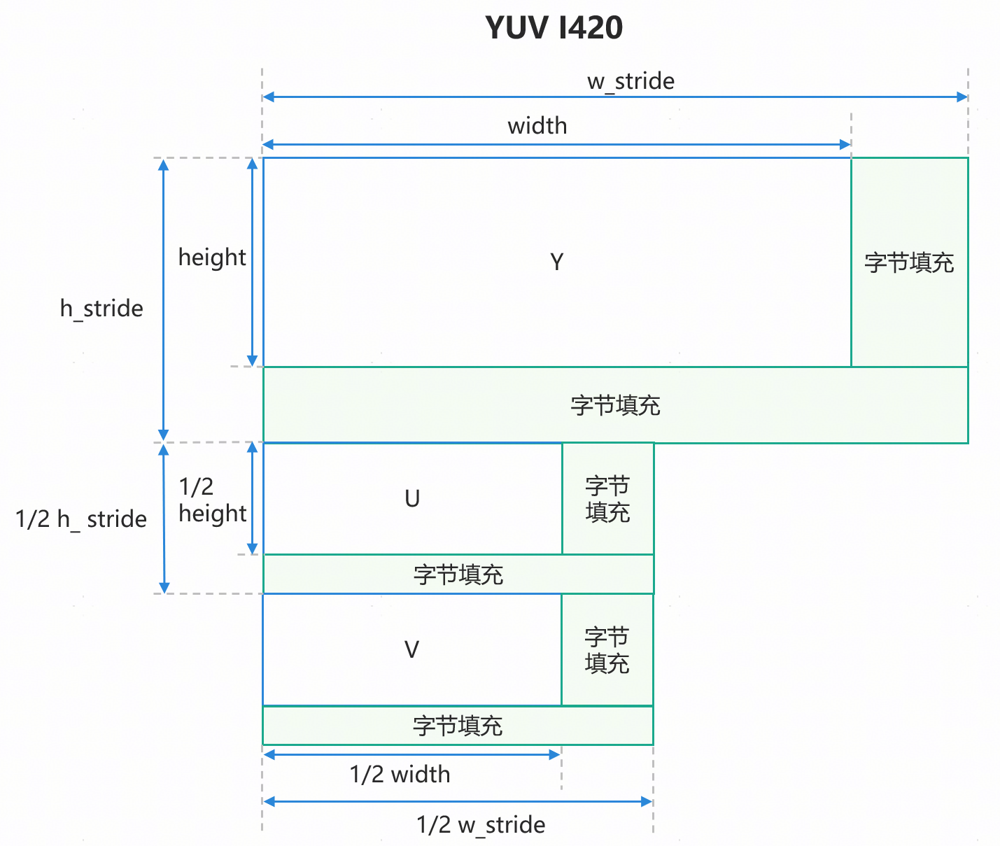
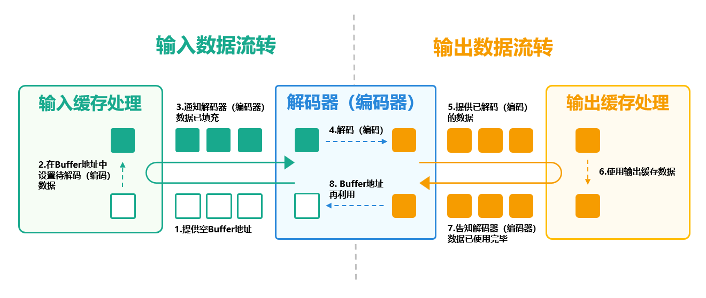
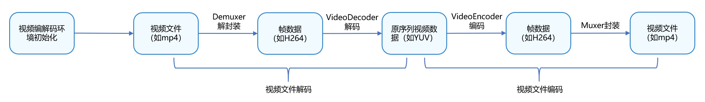
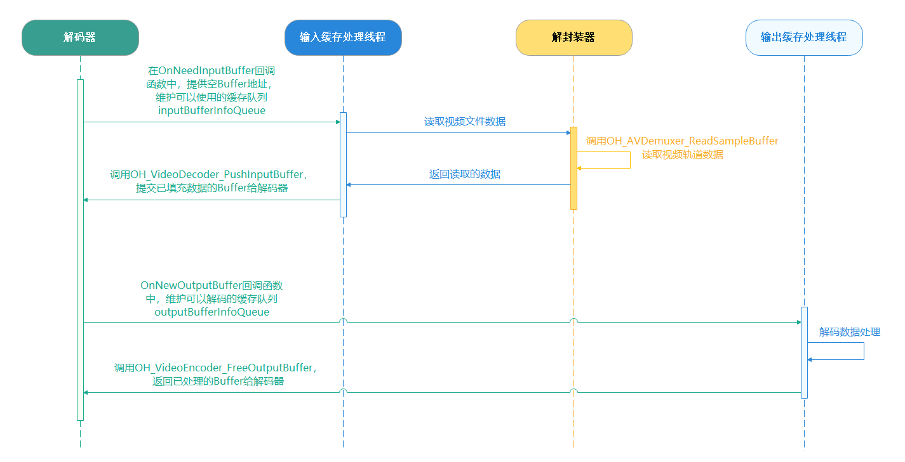

# 基于Buffer模式进行视频转码

## 概述


视频转码是指通过调整编码、比特率等参数将视频文件从一种格式转换为另一种格式的过程。Buffer模式是系统提供的一种视频编解码的方式，是媒体子系统的核心能力。在Buffer模式中，编码或解码完成的数据会以共享内存的方式输出，开发者可以获取共享内存的地址和数据信息，适用于视频转码、编辑等场景。


本文主要介绍了视频编解码的基本概念、Buffer模式下的视频编解码原理，并详细介绍了视频转码的实现方案和开发步骤。


## 实现原理


### 基本概念

视频文件格式是视频保存的格式，常见的格式有MP4、AVI等。在视频文件（以MP4文件解码为例）解码时，首先需要将视频进行解封装，解封装会将一个封装好的音视频文件（如MP4、FLV等）中的音频和视频数据流分离出来。然后，从数据流中取出视频的媒体样本sample，通过视频解码器将媒体数据解码成YUV数据，流程如下所示。


在视频文件编码（以MP4文件编码为例）时，首先会通过视频编码器对YUV数据进行编码，将未压缩的视频数据YUV压缩成视频码流H.264，然后，将编码后的媒体数据按一定的格式封装存储到MP4文件里，流程如下所示。


关于视频文件编解码支持的格式，详情请参考[AVCodec支持的格式](https://developer.huawei.com/consumer/cn/doc/harmonyos-guides/avcodec-support-formats)。


### YUV跨距对齐

YUV是编译true-color颜色空间（color space）的种类，Y'UV、YUV等专有名词都可以称为YUV。I420、NV12、NV21等是YUV具体的存储格式。I420和YV12属于YUV420P格式，NV12 和NV21属于YUV420SP格式。


由于硬件内存访问对齐要求，YUV图像数据在写入内存缓冲区时，其每行数据的存储长度会被硬件或底层驱动自动扩展至规定的对齐粒度（例如16/32/64字节），即YUV跨距对齐。在YUV跨距对齐时，会对每行有效像素数据进行边界填充（Padding），导致Stride值大于图像的有效像素宽度（以字节计算）。


以I420格式为例，其跨距对齐后的格式如下所示。其中，w_stride是数据填充后的宽跨距，h_stride是数据填充后的高跨距，height是实际的高度，width是实际的宽度。





### 视频编解码原理

视频编解码器的原理和实现机制是一样的，区别是处理的数据有所不同。在编码时，输入数据是原始数据（YUV），输出数据是视频数据（如H.264），解码的过程与编码相反。这里以视频解码的过程进行原理说明。


在视频解码的过程中，主要包含两个部分，分别为输入数据流转和输出数据流转。开发者需要通过输入数据流转将需要解码的数据填充给解码器，解码器再进行解码处理。在输出数据流转中，解码器会将解码完成的数据返回给开发者使用，在开发者使用完毕后，需要通知解码器释放视频数据，从而实现整体的Buffer循环，详细原理流程如下图所示。





输入数据流转的步骤如下所示。


1. 解码器提供空的Buffer地址，该地址用于填充需要解码的视频数据。
2. 将解封装后的视频数据（如H.264）填充到解码器提供的Buffer地址中。
3. 通知解码器，当前Buffer地址已完成视频数据填充。
4. 当解码器收到通知后，会对数据进行解码操作。


输出数据流转的步骤如下所示。


1. 在完成输出数据流转后，解码器会提供已解码的数据。
2. 获取数据后，开发者可以根据实际业务使用视频数据，如送显到屏幕。
3. 使用完毕后，开发者需要将Buffer的使用权移交给解码器。
4. 解码器会循环再利用Buffer地址。Buffer内的视频数据不会被释放或者清零，而是在下一次循环中，将解码好的数据直接覆盖写入到已经空闲的Buffer地址里。


## 视频转码


### 场景描述

不同的设备和平台支持视频格式各有不同，通过转码可以将视频转化成设备或平台适配的格式，从而确保视频能够正确地播放与观看，提高视频的兼容性和可播放性。例如，部分平台仅支持特定的视频格式。在相同的视频格式下，其分辨率、帧率、比特率等参数也各有不同，通过改变相应的参数，可以缩小视频文件的大小，从而节省视频的存储空间。


在ArkTS侧，系统提供了转码的相关接口AVTranscoder，可以实现简单的视频转码操作。而在复杂的场景下，如视频裁剪等场景，则需要调用系统的视频编解码的相关能力进行实现。在Buffer模式下的视频转码，可以对视频数据进行读写操作，能够满足更加灵活多变的场景需求。


### 开发步骤

在视频转码的场景中，视频文件会经历解封装、视频解码、视频编码和视频封装的步骤，如下图所示。





其主要包含三个大步骤。


**1. 视频编解码环境初始化**：为后续视频编码、解码提前创建好对应的实例，并设置编解码所需要的参数。


**2. 视频文件解码**：视频文件解码包含了视频解封装、视频解码的操作，最后生成解码后的视频数据。


**3. 视频文件编码**：将解码后的数据进行拷贝处理，并通过编码器进行编码，最后封装到对应的视频文件中。


**视频编解码环境初始化**开发步骤如下所示。


1.1 创建与配置解封装器。


1.2 创建与配置解码器，并注册解码器的回调函数。其中，回调函数OnNeedInputBuffer()提供了解码空Buffer地址，回调函数OnNewOutputBuffer()提供了解码后的视频数据。


1.3 创建与配置封装器。


1.4 创建与配置编码器，并注册编码器的回调函数，回调函数需要配置的内容与解码器相同。


在视频文件解码中，主要包含两个步骤，输入缓存处理、输出缓存处理。在OnNeedInputBuffer()回调函数中，维护了一个空Buffer的缓存队列，在实现输入缓存处理时，需要解封装、填充视频数据。在OnNewOutputBuffer()回调函数中，维护了一个已解码视频数据的缓存队列，在实现输出缓存处理时，需要处理视频数据，其调用顺序如下所示。





**视频文件解码**开发步骤如下所示。


2.1 通过inputBufferInfoQueue获取视频缓存空地址。


2.2 通过Demuxer读取媒体数据，即视频码流数据及其格式。


2.3 在OH_VideoDecoder_PushInputBuffer()中设置对应的视频缓存数据。


2.4 在解码完成后，通过outputBufferInfoQueue获取视频缓存数据。


2.5 处理缓存数据，最后通过OH_VideoDecoder_FreeOutputBuffer()刷新缓存，将缓存资源返回给解码器。


**视频文件编码**开发步骤如下所示。在视频文件编码中，大致的处理流程与视频文件解码类似，而编码的输入缓存的数据来源于解码的输出缓存，所以，可以在解码的输出缓存处理子线程中同步处理编码的输入缓存数据。


3.1 通过inputBufferInfoQueue获取视频缓存地址。


3.2 将解码的输出缓存数据拷贝到编码的输入缓存中。


3.3 通过OH_VideoEncoder_PushInputBuffer()将已填充的输入缓存提交给编码器。


3.4 在编码完成后，通过outputBufferInfoQueue获取视频缓存数据。


3.5 通过Muxer将编码完成的视频数据写入到视频文件中


### 代码实现

1. 视频编解码环境初始化。
  - 初始化视频解码环境。
  
  
  

```cpp
1. int32_t Transcoding::InitDecoder() {
2.  CHECK_AND_RETURN_RET_LOG(!isStarted_, AVCODEC_SAMPLE_ERR_ERROR, "Already started.");
3.  CHECK_AND_RETURN_RET_LOG(demuxer_ == nullptr && videoDecoder_ == nullptr,
4.  AVCODEC_SAMPLE_ERR_ERROR, "Already started.");
5.
6.  videoDecoder_ = std::make_unique<VideoDecoder>();
7.  demuxer_ = std::make_unique<Demuxer>();
8.
9.  isReleased_ = false;
10.  int32_t ret = demuxer_->Create(sampleInfo_);
11.
12.  if (ret == AVCODEC_SAMPLE_ERR_OK) {
13.  ret = CreateVideoDecoder();
14.  } else {
15.  AVCODEC_SAMPLE_LOGE("Create audio decoder failed");
16.  }
17.  return ret;
18. }

```
    [Transcoding.cpp](https://gitcode.com/harmonyos_samples/avcodec-buffer-mode/blob/master/entry/src/main/cpp/sample/transcoding/Transcoding.cpp#L76-L93)

  - 创建解封装器。在创建解封装器时，需要根据需要解码的视频文件fd创建对应的OH_AVSource对象，再根据该对象创建对应的解码器。
  
  
  

```cpp
1. int32_t Demuxer::Create(SampleInfo &info) {
2.  source_ = OH_AVSource_CreateWithFD(info.inputFd, info.inputFileOffset, info.inputFileSize);
3.  CHECK_AND_RETURN_RET_LOG(source_ != nullptr, AVCODEC_SAMPLE_ERR_ERROR,
4.  "Create demuxer source failed, fd: %{public}d, offset: %{public}" PRId64
5.  ", file size: %{public}" PRId64,
6.  info.inputFd, info.inputFileOffset, info.inputFileSize);
7.  demuxer_ = OH_AVDemuxer_CreateWithSource(source_);
8.  CHECK_AND_RETURN_RET_LOG(demuxer_ != nullptr, AVCODEC_SAMPLE_ERR_ERROR, "Create demuxer failed");
9.
10.  auto sourceFormat = std::shared_ptr<OH_AVFormat>(OH_AVSource_GetSourceFormat(source_), OH_AVFormat_Destroy);
11.  CHECK_AND_RETURN_RET_LOG(sourceFormat != nullptr, AVCODEC_SAMPLE_ERR_ERROR, "Get source format failed");
12.
13.  int32_t ret = GetTrackInfo(sourceFormat, info);
14.  CHECK_AND_RETURN_RET_LOG(ret == AVCODEC_SAMPLE_ERR_OK, AVCODEC_SAMPLE_ERR_ERROR, "Get video track info failed");
15.
16.  return AVCODEC_SAMPLE_ERR_OK;
17. }

```
    [Demuxer.cpp](https://gitcode.com/harmonyos_samples/avcodec-buffer-mode/blob/master/entry/src/main/cpp/capbilities/Demuxer.cpp#L24-L40)

  - 创建完解封装器后，可以通过解封装器获取视频对应的参数，如视频的宽高、帧率等信息。
  
  
  

```cpp
1. int32_t Demuxer::GetTrackInfo(std::shared_ptr<OH_AVFormat> sourceFormat, SampleInfo &info) {
2.  int32_t trackCount = 0;
3.  OH_AVFormat_GetIntValue(sourceFormat.get(), OH_MD_KEY_TRACK_COUNT, &trackCount);
4.  for (int32_t index = 0; index < trackCount; index++) {
5.  int trackType = -1;
6.  auto trackFormat =
7.  std::shared_ptr<OH_AVFormat>(OH_AVSource_GetTrackFormat(source_, index), OH_AVFormat_Destroy);
8.  OH_AVFormat_GetIntValue(trackFormat.get(), OH_MD_KEY_TRACK_TYPE, &trackType);
9.  if (trackType == MEDIA_TYPE_VID) {
10.  OH_AVDemuxer_SelectTrackByID(demuxer_, index);
11.  OH_AVFormat_GetIntValue(trackFormat.get(), OH_MD_KEY_WIDTH, &info.videoWidth);
12.  OH_AVFormat_GetIntValue(trackFormat.get(), OH_MD_KEY_HEIGHT, &info.videoHeight);
13.  OH_AVFormat_GetDoubleValue(trackFormat.get(), OH_MD_KEY_FRAME_RATE, &info.frameRate);
14.  OH_AVFormat_GetLongValue(trackFormat.get(), OH_MD_KEY_BITRATE, &info.bitrate);
15.  OH_AVFormat_GetIntValue(trackFormat.get(), OH_MD_KEY_ROTATION, &info.rotation);
16.  char *videoCodecMime;
17.  OH_AVFormat_GetStringValue(trackFormat.get(), OH_MD_KEY_CODEC_MIME,
18.  const_cast<char const **>(&videoCodecMime));
19.  info.videoCodecMime = videoCodecMime;
20.  OH_AVFormat_GetIntValue(trackFormat.get(), OH_MD_KEY_PROFILE, &info.hevcProfile);
21.  videoTrackId_ = index;
22.
23.  AVCODEC_SAMPLE_LOGI("====== Demuxer Video config ======");
24.  AVCODEC_SAMPLE_LOGI("Mime: %{public}s", videoCodecMime);
25.  AVCODEC_SAMPLE_LOGI("%{public}d*%{public}d, %{public}.1ffps, %{public}" PRId64 "kbps", info.videoWidth,
26.  info.videoHeight, info.frameRate, info.bitrate / 1024);
27.  AVCODEC_SAMPLE_LOGI("====== Demuxer Video config ======");
28.  } else if (trackType == MEDIA_TYPE_AUD) {
29.  OH_AVDemuxer_SelectTrackByID(demuxer_, index);
30.  OH_AVFormat_GetIntValue(trackFormat.get(), OH_MD_KEY_AUDIO_SAMPLE_FORMAT, &info.audioSampleForamt);
31.  OH_AVFormat_GetIntValue(trackFormat.get(), OH_MD_KEY_AUD_CHANNEL_COUNT, &info.audioChannelCount);
32.  OH_AVFormat_GetLongValue(trackFormat.get(), OH_MD_KEY_CHANNEL_LAYOUT, &info.audioChannelLayout);
33.  OH_AVFormat_GetIntValue(trackFormat.get(), OH_MD_KEY_AUD_SAMPLE_RATE, &info.audioSampleRate);
34.  char *audioCodecMime;
35.  OH_AVFormat_GetStringValue(trackFormat.get(), OH_MD_KEY_CODEC_MIME,
36.  const_cast<char const **>(&audioCodecMime));
37.  uint8_t *codecConfig = nullptr;
38.  OH_AVFormat_GetBuffer(trackFormat.get(), OH_MD_KEY_CODEC_CONFIG, &codecConfig, &info.codecConfigLen);
39.  if (info.codecConfigLen > 0 && info.codecConfigLen < sizeof(info.codecConfig)) {
40.  memcpy(info.codecConfig, codecConfig, info.codecConfigLen);
41.  AVCODEC_SAMPLE_LOGI(
42.  "codecConfig:%{public}p, len:%{public}i, 0:0x%{public}02x 1:0x:%{public}02x, bufLen:%{public}u",
43.  info.codecConfig, (int)info.codecConfigLen, info.codecConfig[0], info.codecConfig[1],
44.  sizeof(info.codecConfig));
45.  }
46.  OH_AVFormat_GetIntValue(trackFormat.get(), OH_MD_KEY_AAC_IS_ADTS, &info.aacAdts);
47.
48.  info.audioCodecMime = audioCodecMime;
49.  audioTrackId_ = index;
50.
51.  AVCODEC_SAMPLE_LOGI("====== Demuxer Audio config ======");
52.  AVCODEC_SAMPLE_LOGI(
53.  "audioMime:%{public}s sampleForamt:%{public}d "
54.  "sampleRate:%{public}d channelCount:%{public}d channelLayout:%{public}d adts:%{public}i",
55.  info.audioCodecMime.c_str(), info.audioSampleForamt, info.audioSampleRate, info.audioChannelCount,
56.  info.audioChannelLayout, info.aacAdts);
57.  AVCODEC_SAMPLE_LOGI("====== Demuxer Audio config ======");
58.  }
59.  }
60.
61.  return AVCODEC_SAMPLE_ERR_OK;
62. }

```
    [Demuxer.cpp](https://gitcode.com/harmonyos_samples/avcodec-buffer-mode/blob/master/entry/src/main/cpp/capbilities/Demuxer.cpp#L65-L126)

  - 创建视频解码器。
  
  
  

```cpp
1. int32_t Transcoding::CreateVideoDecoder() {
2.  AVCODEC_SAMPLE_LOGW("video mime:%{public}s", sampleInfo_.videoCodecMime.c_str());
3.  int32_t ret = videoDecoder_->Create(sampleInfo_.videoCodecMime);
4.  if (ret != AVCODEC_SAMPLE_ERR_OK) {
5.  AVCODEC_SAMPLE_LOGW("Create video decoder failed, mime:%{public}s", sampleInfo_.videoCodecMime.c_str());
6.  } else {
7.  videoDecContext_ = new CodecUserData;
8.  ret = videoDecoder_->Config(sampleInfo_, videoDecContext_);
9.  CHECK_AND_RETURN_RET_LOG(ret == AVCODEC_SAMPLE_ERR_OK, ret, "Video Decoder config failed");
10.  }
11.  return AVCODEC_SAMPLE_ERR_OK;
12. }

```
    [Transcoding.cpp](https://gitcode.com/harmonyos_samples/avcodec-buffer-mode/blob/master/entry/src/main/cpp/sample/transcoding/Transcoding.cpp#L34-L45)

  - 配置视频解码器，包括视频的宽、高、分辨率等基础信息和解码器的回调函数。
  
  
  

```cpp
1. // Setting the callback function
2. int32_t VideoDecoder::SetCallback(CodecUserData *codecUserData) {
3.  int32_t ret = AV_ERR_OK;
4.  ret = OH_VideoDecoder_RegisterCallback(decoder_,
5.  {SampleCallback::OnCodecError, SampleCallback::OnCodecFormatChange,
6.  SampleCallback::OnNeedInputBuffer, SampleCallback::OnNewOutputBuffer},
7.  codecUserData);
8.  CHECK_AND_RETURN_RET_LOG(ret == AV_ERR_OK, AVCODEC_SAMPLE_ERR_ERROR, "Set callback failed, ret: %{public}d", ret);
9.
10.  return AVCODEC_SAMPLE_ERR_OK;
11. }
12.
13. int32_t VideoDecoder::Configure(const SampleInfo &sampleInfo) {
14.  OH_AVFormat *format = OH_AVFormat_Create();
15.  CHECK_AND_RETURN_RET_LOG(format != nullptr, AVCODEC_SAMPLE_ERR_ERROR, "AVFormat create failed");
16.
17.  OH_AVFormat_SetIntValue(format, OH_MD_KEY_WIDTH, sampleInfo.videoWidth);
18.  OH_AVFormat_SetIntValue(format, OH_MD_KEY_HEIGHT, sampleInfo.videoHeight);
19.  OH_AVFormat_SetDoubleValue(format, OH_MD_KEY_FRAME_RATE, sampleInfo.frameRate);
20.  OH_AVFormat_SetIntValue(format, OH_MD_KEY_PIXEL_FORMAT, sampleInfo.pixelFormat);
21.  OH_AVFormat_SetIntValue(format, OH_MD_KEY_ROTATION, sampleInfo.rotation);
22.
23.  AVCODEC_SAMPLE_LOGI("====== VideoDecoder config ======");
24.  AVCODEC_SAMPLE_LOGI("%{public}d*%{public}d, %{public}.1ffps", sampleInfo.videoWidth, sampleInfo.videoHeight,
25.  sampleInfo.frameRate);
26.  AVCODEC_SAMPLE_LOGI("====== VideoDecoder config ======");
27.  int ret = OH_VideoDecoder_Configure(decoder_, format);
28.  OH_AVFormat_Destroy(format);
29.  format = nullptr;
30.  CHECK_AND_RETURN_RET_LOG(ret == AV_ERR_OK, AVCODEC_SAMPLE_ERR_ERROR, "Config failed, ret: %{public}d", ret);
31.  return AVCODEC_SAMPLE_ERR_OK;
32. }
33.
34. int32_t VideoDecoder::Config(const SampleInfo &sampleInfo, CodecUserData *codecUserData) {
35.  CHECK_AND_RETURN_RET_LOG(decoder_ != nullptr, AVCODEC_SAMPLE_ERR_ERROR, "Decoder is null");
36.  CHECK_AND_RETURN_RET_LOG(codecUserData != nullptr, AVCODEC_SAMPLE_ERR_ERROR, "Invalid param: codecUserData");
37.
38.  // Configure video decoder
39.  int32_t ret = Configure(sampleInfo);
40.  CHECK_AND_RETURN_RET_LOG(ret == AVCODEC_SAMPLE_ERR_OK, AVCODEC_SAMPLE_ERR_ERROR, "Configure failed");
41.
42.  // SetCallback for video decoder
43.  ret = SetCallback(codecUserData);
44.  CHECK_AND_RETURN_RET_LOG(ret == AVCODEC_SAMPLE_ERR_OK, AVCODEC_SAMPLE_ERR_ERROR,
45.  "Set callback failed, ret: %{public}d", ret);
46.
47.  // Prepare video decoder
48.  ret = OH_VideoDecoder_Prepare(decoder_);
49.  CHECK_AND_RETURN_RET_LOG(ret == AV_ERR_OK, AVCODEC_SAMPLE_ERR_ERROR, "Prepare failed, ret: %{public}d", ret);
50.
51.  return AVCODEC_SAMPLE_ERR_OK;
52. }

```
    [VideoDecoder.cpp](https://gitcode.com/harmonyos_samples/avcodec-buffer-mode/blob/master/entry/src/main/cpp/capbilities/VideoDecoder.cpp#L36-L87)

  - 初始化视频编码环境，包括创建配置视频编码器、视频封装器。
  
  
  

```cpp
1. int32_t Transcoding::InitEncoder() {
2.  CHECK_AND_RETURN_RET_LOG(!isStarted_, AVCODEC_SAMPLE_ERR_ERROR, "Already started.");
3.  CHECK_AND_RETURN_RET_LOG(muxer_ == nullptr && videoEncoder_ == nullptr,
4.  AVCODEC_SAMPLE_ERR_ERROR, "Already started.");
5.
6.  videoEncoder_ = std::make_unique<VideoEncoder>();
7.  muxer_ = std::make_unique<Muxer>();
8.
9.  int32_t ret = muxer_->Create(sampleInfo_.outputFd);
10.  CHECK_AND_RETURN_RET_LOG(ret == AVCODEC_SAMPLE_ERR_OK, ret, "Create muxer with fd(%{public}d) failed",
11.  sampleInfo_.outputFd);
12.  ret = muxer_->Config(sampleInfo_);
13.
14.  CHECK_AND_RETURN_RET_LOG(ret == AVCODEC_SAMPLE_ERR_OK, ret, "Create audio encoder failed");
15.
16.  ret = CreateVideoEncoder();
17.  CHECK_AND_RETURN_RET_LOG(ret == AVCODEC_SAMPLE_ERR_OK, ret, "Create video encoder failed");
18.
19.  AVCODEC_SAMPLE_LOGI("Succeed");
20.  return AVCODEC_SAMPLE_ERR_OK;
21. }

```
    [Transcoding.cpp](https://gitcode.com/harmonyos_samples/avcodec-buffer-mode/blob/master/entry/src/main/cpp/sample/transcoding/Transcoding.cpp#L108-L128)

  - 创建视频编码器。
  
  
  

```cpp
1. // Create a video coder and initialize it
2. int32_t VideoEncoder::Create(const std::string &videoCodecMime) {
3.  encoder_ = OH_VideoEncoder_CreateByMime(videoCodecMime.c_str());
4.  CHECK_AND_RETURN_RET_LOG(encoder_ != nullptr, AVCODEC_SAMPLE_ERR_ERROR, "Create failed");
5.  return AVCODEC_SAMPLE_ERR_OK;
6. }

```
    [VideoEncoder.cpp](https://gitcode.com/harmonyos_samples/avcodec-buffer-mode/blob/master/entry/src/main/cpp/capbilities/VideoEncoder.cpp#L24-L29)

  - 配置视频编码器。
  
  
  

```cpp
1. int32_t VideoEncoder::Config(SampleInfo &sampleInfo, CodecUserData *codecUserData) {
2.  CHECK_AND_RETURN_RET_LOG(encoder_ != nullptr, AVCODEC_SAMPLE_ERR_ERROR, "Encoder is null");
3.  CHECK_AND_RETURN_RET_LOG(codecUserData != nullptr, AVCODEC_SAMPLE_ERR_ERROR, "Invalid param: codecUserData");
4.
5.  // Configure video encoder
6.  int32_t ret = Configure(sampleInfo);
7.  CHECK_AND_RETURN_RET_LOG(ret == AVCODEC_SAMPLE_ERR_OK, AVCODEC_SAMPLE_ERR_ERROR, "Configure failed");
8.
9.  // SetCallback for video encoder
10.  ret = SetCallback(codecUserData);
11.  CHECK_AND_RETURN_RET_LOG(ret == AVCODEC_SAMPLE_ERR_OK, AVCODEC_SAMPLE_ERR_ERROR,
12.  "Set callback failed, ret: %{public}d", ret);
13.
14.  // Prepare video encoder
15.  ret = OH_VideoEncoder_Prepare(encoder_);
16.  CHECK_AND_RETURN_RET_LOG(ret == AV_ERR_OK, AVCODEC_SAMPLE_ERR_ERROR, "Prepare failed, ret: %{public}d", ret);
17.
18.  return AVCODEC_SAMPLE_ERR_OK;
19. }
20.
21. // ...
22.
23. int32_t VideoEncoder::Configure(const SampleInfo &sampleInfo) {
24.  OH_AVFormat *format = OH_AVFormat_Create();
25.  CHECK_AND_RETURN_RET_LOG(format != nullptr, AVCODEC_SAMPLE_ERR_ERROR, "AVFormat create failed");
26.
27.  OH_AVFormat_SetIntValue(format, OH_MD_KEY_WIDTH, sampleInfo.videoWidth);
28.  OH_AVFormat_SetIntValue(format, OH_MD_KEY_HEIGHT, sampleInfo.videoHeight);
29.  OH_AVFormat_SetDoubleValue(format, OH_MD_KEY_FRAME_RATE, sampleInfo.outputFrameRate);
30.  OH_AVFormat_SetIntValue(format, OH_MD_KEY_PIXEL_FORMAT, sampleInfo.pixelFormat);
31.  OH_AVFormat_SetIntValue(format, OH_MD_KEY_VIDEO_ENCODE_BITRATE_MODE, sampleInfo.bitrateMode);
32.  OH_AVFormat_SetLongValue(format, OH_MD_KEY_BITRATE, sampleInfo.outputBitrate);
33.  OH_AVFormat_SetIntValue(format, OH_MD_KEY_PROFILE, sampleInfo.hevcProfile);
34.  // Setting HDRVivid-related parameters
35.  if (sampleInfo.isHDRVivid) {
36.  OH_AVFormat_SetIntValue(format, OH_MD_KEY_I_FRAME_INTERVAL, sampleInfo.iFrameInterval);
37.  OH_AVFormat_SetIntValue(format, OH_MD_KEY_RANGE_FLAG, sampleInfo.rangFlag);
38.  OH_AVFormat_SetIntValue(format, OH_MD_KEY_COLOR_PRIMARIES, sampleInfo.primary);
39.  OH_AVFormat_SetIntValue(format, OH_MD_KEY_TRANSFER_CHARACTERISTICS, sampleInfo.transfer);
40.  OH_AVFormat_SetIntValue(format, OH_MD_KEY_MATRIX_COEFFICIENTS, sampleInfo.matrix);
41.  }
42.  AVCODEC_SAMPLE_LOGI("====== VideoEncoder config ======");
43.  AVCODEC_SAMPLE_LOGI("%{public}d*%{public}d, %{public}.1ffps", sampleInfo.videoWidth, sampleInfo.videoHeight,
44.  sampleInfo.frameRate);
45.  // 1024: ratio of kbps to bps
46.  AVCODEC_SAMPLE_LOGI("BitRate Mode: %{public}d, BitRate: %{public}" PRId64 "kbps", sampleInfo.bitrateMode,
47.  sampleInfo.bitrate / 1024);
48.  AVCODEC_SAMPLE_LOGI("====== VideoEncoder config ======");
49.
50.  // Setting the Encoder
51.  int ret = OH_VideoEncoder_Configure(encoder_, format);
52.  OH_AVFormat_Destroy(format);
53.  format = nullptr;
54.  CHECK_AND_RETURN_RET_LOG(ret == AV_ERR_OK, AVCODEC_SAMPLE_ERR_ERROR, "Config failed, ret: %{public}d", ret);
55.  return AVCODEC_SAMPLE_ERR_OK;
56. }

```
    [VideoEncoder.cpp](https://gitcode.com/HarmonyOS_Samples/avcodec-buffer-mode/blob/master/entry/src/main/cpp/capbilities/VideoEncoder.cpp#L33-L147)

  - 配置视频封装器。在配置视频封装器时，需要设置视频封装的格式，包括视频宽高、帧率、编码格式等。
  
  
  

```cpp
1. int32_t Muxer::Config(SampleInfo &sampleInfo) {
2.  CHECK_AND_RETURN_RET_LOG(muxer_ != nullptr, AVCODEC_SAMPLE_ERR_ERROR, "Muxer is null");
3.  OH_AVFormat *formatVideo =
4.  OH_AVFormat_CreateVideoFormat(sampleInfo.outputVideoCodecMime.data(), sampleInfo.videoWidth, sampleInfo.videoHeight);
5.  CHECK_AND_RETURN_RET_LOG(formatVideo != nullptr, AVCODEC_SAMPLE_ERR_ERROR, "Create video format failed");
6.
7.  OH_AVFormat_SetDoubleValue(formatVideo, OH_MD_KEY_FRAME_RATE, sampleInfo.outputFrameRate);
8.  OH_AVFormat_SetIntValue(formatVideo, OH_MD_KEY_WIDTH, sampleInfo.videoWidth);
9.  OH_AVFormat_SetIntValue(formatVideo, OH_MD_KEY_HEIGHT, sampleInfo.videoHeight);
10.  OH_AVFormat_SetStringValue(formatVideo, OH_MD_KEY_CODEC_MIME, sampleInfo.outputVideoCodecMime.data());
11.  if (sampleInfo.isHDRVivid) {
12.  OH_AVFormat_SetIntValue(formatVideo, OH_MD_KEY_VIDEO_IS_HDR_VIVID, 1);
13.  OH_AVFormat_SetIntValue(formatVideo, OH_MD_KEY_RANGE_FLAG, sampleInfo.rangFlag);
14.  OH_AVFormat_SetIntValue(formatVideo, OH_MD_KEY_COLOR_PRIMARIES, sampleInfo.primary);
15.  OH_AVFormat_SetIntValue(formatVideo, OH_MD_KEY_TRANSFER_CHARACTERISTICS, sampleInfo.transfer);
16.  OH_AVFormat_SetIntValue(formatVideo, OH_MD_KEY_MATRIX_COEFFICIENTS, sampleInfo.matrix);
17.  }
18.
19.  int32_t ret = OH_AVMuxer_AddTrack(muxer_, &videoTrackId_, formatVideo);
20.  OH_AVFormat_Destroy(formatVideo);
21.  formatVideo = nullptr;
22.  OH_AVMuxer_SetRotation(muxer_, sampleInfo.rotation);
23.  CHECK_AND_RETURN_RET_LOG(ret == AV_ERR_OK, AVCODEC_SAMPLE_ERR_ERROR, "AddTrack failed");
24.  return AVCODEC_SAMPLE_ERR_OK;
25. }

```
    [Muxer.cpp](https://gitcode.com/harmonyos_samples/avcodec-buffer-mode/blob/master/entry/src/main/cpp/capbilities/Muxer.cpp#L37-L61)

2. 视频文件解码。
  - 启动视频转码，包括视频解码输入缓存处理线程、输出缓存处理线程、编码输出缓存处理线程。
  
  
  

```cpp
1. int32_t Transcoding::Start() {
2.  std::unique_lock<std::mutex> lock(mutex_);
3.  int32_t ret;
4.  CHECK_AND_RETURN_RET_LOG(!isStarted_, AVCODEC_SAMPLE_ERR_ERROR, "Already started.");
5.  CHECK_AND_RETURN_RET_LOG(demuxer_ != nullptr, AVCODEC_SAMPLE_ERR_ERROR, "Already started.");
6.  if (videoDecContext_) {
7.  ret = videoDecoder_->Start();
8.  if (ret != AVCODEC_SAMPLE_ERR_OK) {
9.  AVCODEC_SAMPLE_LOGE("Video Decoder start failed");
10.  lock.unlock();
11.  StartRelease();
12.  return AVCODEC_SAMPLE_ERR_ERROR;
13.  }
14.  isStarted_ = true;
15.  videoDecInputThread_ = std::make_unique<std::thread>(&Transcoding::VideoDecInputThread, this);
16.  videoDecOutputThread_ = std::make_unique<std::thread>(&Transcoding::VideoDecOutputThread, this);
17.
18.  if (videoDecInputThread_ == nullptr || videoDecOutputThread_ == nullptr) {
19.  AVCODEC_SAMPLE_LOGE("Create thread failed");
20.  lock.unlock();
21.  StartRelease();
22.  return AVCODEC_SAMPLE_ERR_ERROR;
23.  }
24.  }
25.
26.  if (videoEncContext_) {
27.  CHECK_AND_RETURN_RET_LOG(videoEncoder_ != nullptr && muxer_ != nullptr, AVCODEC_SAMPLE_ERR_ERROR,
28.  "Already started.");
29.  int32_t ret = muxer_->Start();
30.  CHECK_AND_RETURN_RET_LOG(ret == AVCODEC_SAMPLE_ERR_OK, ret, "Muxer start failed");
31.  ret = videoEncoder_->Start();
32.  CHECK_AND_RETURN_RET_LOG(ret == AVCODEC_SAMPLE_ERR_OK, ret, "Encoder start failed");
33.  videoEncOutputThread_ = std::make_unique<std::thread>(&Transcoding::VideoEncOutputThread, this);
34.  if (videoEncOutputThread_ == nullptr) {
35.  AVCODEC_SAMPLE_LOGE("Create thread failed");
36.  StartRelease();
37.  return AVCODEC_SAMPLE_ERR_ERROR;
38.  }
39.  }
40.
41.  AVCODEC_SAMPLE_LOGI("Succeed");
42.  doneCond_.notify_all();
43.  return AVCODEC_SAMPLE_ERR_OK;
44. }

```
    [Transcoding.cpp](https://gitcode.com/harmonyos_samples/avcodec-buffer-mode/blob/master/entry/src/main/cpp/sample/transcoding/Transcoding.cpp#L132-L175)

  - 视频解码输入缓存处理。
  
  
  

```cpp
1. void Transcoding::VideoDecInputThread() {
2.  while (true) {
3.  CHECK_AND_BREAK_LOG(isStarted_, "Decoder input thread out");
4.  std::unique_lock<std::mutex> lock(videoDecContext_->inputMutex);
5.  bool condRet = videoDecContext_->inputCond.wait_for(
6.  lock, 5s, [this]() { return !isStarted_ || !videoDecContext_->inputBufferInfoQueue.empty(); });
7.  CHECK_AND_BREAK_LOG(isStarted_, "Work done, thread out");
8.  CHECK_AND_CONTINUE_LOG(!videoDecContext_->inputBufferInfoQueue.empty(),
9.  "Buffer queue is empty, continue, cond ret: %{public}d", condRet);
10.
11.  CodecBufferInfo bufferInfo = videoDecContext_->inputBufferInfoQueue.front();
12.  videoDecContext_->inputBufferInfoQueue.pop();
13.  videoDecContext_->inputFrameCount++;
14.  lock.unlock();
15.
16.  demuxer_->ReadSample(demuxer_->GetVideoTrackId(), reinterpret_cast<OH_AVBuffer *>(bufferInfo.buffer),
17.  bufferInfo.attr);
18.
19.  int32_t ret = videoDecoder_->PushInputBuffer(bufferInfo);
20.  CHECK_AND_BREAK_LOG(ret == AVCODEC_SAMPLE_ERR_OK, "Push data failed, thread out");
21.
22.  CHECK_AND_BREAK_LOG(!(bufferInfo.attr.flags & AVCODEC_BUFFER_FLAGS_EOS),
23.  "VideoDecInputThread Catch EOS, thread out");
24.  }
25. }

```
    [Transcoding.cpp](https://gitcode.com/harmonyos_samples/avcodec-buffer-mode/blob/master/entry/src/main/cpp/sample/transcoding/Transcoding.cpp#L275-L299)

  - 视频解码输出缓存处理。
  
  
  

```cpp
1. void Transcoding::VideoDecOutputThread() {
2.  sampleInfo_.frameInterval = MICROSECOND / sampleInfo_.frameRate;
3.  while (true) {
4.  CHECK_AND_BREAK_LOG(isStarted_, "Decoder output thread out");
5.  std::unique_lock<std::mutex> lock(videoDecContext_->outputMutex);
6.  bool condRet = videoDecContext_->outputCond.wait_for(lock, 5s, [this]() {
7.  return !isStarted_ ||
8.  !(videoDecContext_->outputBufferInfoQueue.empty() && videoEncContext_->inputBufferInfoQueue.empty());
9.  });
10.  CHECK_AND_BREAK_LOG(isStarted_, "Decoder output thread out");
11.  CHECK_AND_CONTINUE_LOG(!videoDecContext_->outputBufferInfoQueue.empty(),
12.  "Buffer queue is empty, continue, cond ret: %{public}d", condRet);
13.  CHECK_AND_CONTINUE_LOG(!videoEncContext_->inputBufferInfoQueue.empty(),
14.  "Buffer queue is empty, continue, cond ret: %{public}d", condRet);
15.
16.  CodecBufferInfo bufferInfo = videoDecContext_->outputBufferInfoQueue.front();
17.  videoDecContext_->outputBufferInfoQueue.pop();
18.  videoDecContext_->outputFrameCount++;
19.  AVCODEC_SAMPLE_LOGW("Out buffer count: %{public}u, size: %{public}d, flag: %{public}u, pts: %{public}" PRId64,
20.  videoDecContext_->outputFrameCount, bufferInfo.attr.size, bufferInfo.attr.flags,
21.  bufferInfo.attr.pts);
22.  lock.unlock();
23.
24.  // get Buffer from inputBufferInfoQueue
25.  CodecBufferInfo encBufferInfo = videoEncContext_->inputBufferInfoQueue.front();
26.  videoEncContext_->inputBufferInfoQueue.pop();
27.  videoEncContext_->inputFrameCount++;
28.
29.  AVCODEC_SAMPLE_LOGW(
30.  "Out bufferInfo flags: %{public}u, offset: %{public}d, pts: %{public}u, size: %{public}" PRId64,
31.  bufferInfo.attr.flags, bufferInfo.attr.offset, bufferInfo.attr.pts, bufferInfo.attr.size);
32.
33.
34.  encBufferInfo.bufferAddr = OH_AVBuffer_GetAddr(reinterpret_cast<OH_AVBuffer *>(encBufferInfo.buffer));
35.  bufferInfo.bufferAddr = OH_AVBuffer_GetAddr(reinterpret_cast<OH_AVBuffer *>(bufferInfo.buffer));
36.  CopyStrideYUV420SP(encBufferInfo, bufferInfo);
37.
38.  AVCODEC_SAMPLE_LOGW(
39.  "Out encBufferInfo flags: %{public}u, offset: %{public}d, pts: %{public}u, size: %{public}d" PRId64,
40.  encBufferInfo.attr.flags, encBufferInfo.attr.offset, encBufferInfo.attr.pts, encBufferInfo.attr.size);
41.
42.  OH_AVBuffer_SetBufferAttr(reinterpret_cast<OH_AVBuffer *>(encBufferInfo.buffer), &encBufferInfo.attr);
43.
44.  // Free Decoder's output buffer
45.  int32_t ret = videoDecoder_->FreeOutputBuffer(bufferInfo.bufferIndex, false);
46.  CHECK_AND_BREAK_LOG(ret == AVCODEC_SAMPLE_ERR_OK, "Decoder output thread out");
47.
48.  // Push input buffer to Encoder
49.  videoEncoder_->PushInputBuffer(encBufferInfo);
50.
51.  if (bufferInfo.attr.flags & AVCODEC_BUFFER_FLAGS_EOS) {
52.  AVCODEC_SAMPLE_LOGW("VideoDecOutputThread Catch EOS, thread out" PRId64);
53.  break;
54.  }
55.  }
56. }

```
    [Transcoding.cpp](https://gitcode.com/HarmonyOS_Samples/avcodec-buffer-mode/blob/master/entry/src/main/cpp/sample/transcoding/Transcoding.cpp#L303-L358)

3. 视频文件编码。
  - 在解码输出缓存子线程中，将解码输出缓存同步拷贝AVBuffer。同时，需要注意的是解码的数据中会进行YUV跨距对齐，需要专门处理对应的跨距，偏移填充的数据，才能正确的进行视频编码。
  
  
  

```cpp
1. void Transcoding::CopyStrideYUV420SP(CodecBufferInfo &encBufferInfo, CodecBufferInfo &bufferInfo) {
2.  int32_t videoWidth = videoDecContext_->width;
3.  int32_t &stride = videoDecContext_->widthStride;
4.  int32_t size = 0;
5.  uint8_t *tempBufferAddr = encBufferInfo.bufferAddr;
6.
7.  size += videoDecContext_->height * videoWidth * 3 / 2;
8.  if (videoWidth == videoDecContext_->widthStride && videoDecContext_->heightStride == videoDecContext_->height) {
9.  std::memcpy(tempBufferAddr, bufferInfo.bufferAddr, size);
10.  } else {
11.  // copy Y
12.  for (int32_t row = 0; row < videoDecContext_->height; row++) {
13.  std::memcpy(tempBufferAddr, bufferInfo.bufferAddr, videoWidth);
14.  tempBufferAddr += videoWidth;
15.  bufferInfo.bufferAddr += stride;
16.  }
17.  bufferInfo.bufferAddr += (videoDecContext_->heightStride - videoDecContext_->height) * stride;
18.
19.  // copy U/V
20.  for (int32_t row = 0; row < (videoDecContext_->height / 2); row++) {
21.  std::memcpy(tempBufferAddr, bufferInfo.bufferAddr, videoWidth);
22.  tempBufferAddr += videoWidth;
23.  bufferInfo.bufferAddr += stride;
24.  }
25.  }
26.
27.  encBufferInfo.attr.size = size;
28.  encBufferInfo.attr.flags = bufferInfo.attr.flags;
29.  encBufferInfo.attr.offset = bufferInfo.attr.offset;
30.  encBufferInfo.attr.pts = bufferInfo.attr.pts;
31.
32.  tempBufferAddr = nullptr;
33.  delete tempBufferAddr;
34. }

```
    [Transcoding.cpp](https://gitcode.com/HarmonyOS_Samples/avcodec-buffer-mode/blob/master/entry/src/main/cpp/sample/transcoding/Transcoding.cpp#L238-L271)

  - 同时，拷贝的AVBuffer内存需要通过OH_AVBuffer_SetBufferAttr()设置对应的属性，其中，size属性为当前数据的大小，是实际AVBuffer的数据大小。最后，通过OH_VideoEncoder_PushInputBuffer()将填充的输入缓存数据提交给编码器。
  
  
  

```cpp
1. int32_t VideoEncoder::PushInputBuffer(CodecBufferInfo &info) {
2.  CHECK_AND_RETURN_RET_LOG(encoder_ != nullptr, AVCODEC_SAMPLE_ERR_ERROR, "Decoder is null");
3.  int32_t ret = OH_VideoEncoder_PushInputBuffer(encoder_, info.bufferIndex);
4.  CHECK_AND_RETURN_RET_LOG(ret == AV_ERR_OK, AVCODEC_SAMPLE_ERR_ERROR, "Push input data failed");
5.  return AVCODEC_SAMPLE_ERR_OK;
6. }

```
    [VideoEncoder.cpp](https://gitcode.com/harmonyos_samples/avcodec-buffer-mode/blob/master/entry/src/main/cpp/capbilities/VideoEncoder.cpp#L151-L156)

  - 在编码输出处理中，获取已编码的视频数据。
  
  
  

```cpp
1. void Transcoding::VideoEncOutputThread() {
2.  while (true) {
3.  std::unique_lock<std::mutex> lock(videoEncContext_->outputMutex);
4.  bool condRet = videoEncContext_->outputCond.wait_for(
5.  lock, 5s, [this]() { return !isStarted_ || !videoEncContext_->outputBufferInfoQueue.empty(); });
6.  CHECK_AND_BREAK_LOG(isStarted_, "Work done, thread out");
7.  CHECK_AND_CONTINUE_LOG(!videoEncContext_->outputBufferInfoQueue.empty(),
8.  "Buffer queue is empty, continue, cond ret: %{public}d", condRet);
9.
10.  CodecBufferInfo bufferInfo = videoEncContext_->outputBufferInfoQueue.front();
11.  videoEncContext_->outputBufferInfoQueue.pop();
12.  CHECK_AND_BREAK_LOG(!(bufferInfo.attr.flags & AVCODEC_BUFFER_FLAGS_EOS),
13.  "VideoEncOutputThread Catch EOS, thread out");
14.  lock.unlock();
15.  if ((bufferInfo.attr.flags & AVCODEC_BUFFER_FLAGS_SYNC_FRAME) ||
16.  (bufferInfo.attr.flags == AVCODEC_BUFFER_FLAGS_NONE)) {
17.  videoEncContext_->outputFrameCount++;
18.  bufferInfo.attr.pts = videoEncContext_->outputFrameCount * MICROSECOND / sampleInfo_.frameRate;
19.  } else {
20.  bufferInfo.attr.pts = 0;
21.  }
22.  AVCODEC_SAMPLE_LOGW("Out buffer count: %{public}u, size: %{public}d, flag: %{public}u, pts: %{public}" PRId64,
23.  videoEncContext_->outputFrameCount, bufferInfo.attr.size, bufferInfo.attr.flags,
24.  bufferInfo.attr.pts);
25.
26.  muxer_->WriteSample(muxer_->GetVideoTrackId(), reinterpret_cast<OH_AVBuffer *>(bufferInfo.buffer),
27.  bufferInfo.attr);
28.  int32_t ret = videoEncoder_->FreeOutputBuffer(bufferInfo.bufferIndex);
29.  CHECK_AND_BREAK_LOG(ret == AVCODEC_SAMPLE_ERR_OK, "Encoder output thread out");
30.  }
31.  AVCODEC_SAMPLE_LOGI("Exit, frame count: %{public}u", videoEncContext_->outputFrameCount);
32.  StartRelease();
33. }

```
    [Transcoding.cpp](https://gitcode.com/harmonyos_samples/avcodec-buffer-mode/blob/master/entry/src/main/cpp/sample/transcoding/Transcoding.cpp#L362-L394)

  - 通过OH_AVMuxer_WriteSampleBuffer方法，将编码完成的数据写入到视频文件中，从而完成视频转码。
  
  
  

```cpp
1. int32_t Muxer::WriteSample(int32_t trackId, OH_AVBuffer *buffer, OH_AVCodecBufferAttr &attr){
2.  std::lock_guard<std::mutex> lock(writeMutex_);
3.
4.  CHECK_AND_RETURN_RET_LOG(muxer_ != nullptr, AVCODEC_SAMPLE_ERR_ERROR, "Muxer is null");
5.  CHECK_AND_RETURN_RET_LOG(buffer != nullptr, AVCODEC_SAMPLE_ERR_ERROR, "Get a empty buffer");
6.
7.  int32_t ret = OH_AVBuffer_SetBufferAttr(buffer, &attr);
8.  CHECK_AND_RETURN_RET_LOG(ret == AV_ERR_OK, AVCODEC_SAMPLE_ERR_ERROR, "SetBufferAttr failed");
9.
10.  ret = OH_AVMuxer_WriteSampleBuffer(muxer_, trackId, buffer);
11.  CHECK_AND_RETURN_RET_LOG(ret == AV_ERR_OK, AVCODEC_SAMPLE_ERR_ERROR, "Write sample failed");
12.  return AVCODEC_SAMPLE_ERR_OK;
13. }

```
    [Muxer.cpp](https://gitcode.com/harmonyos_samples/avcodec-buffer-mode/blob/master/entry/src/main/cpp/capbilities/Muxer.cpp#L73-L85)


## 常见问题


### 通过Buffer模式进行编解码，视频出现花屏或者绿边


可能的原因是在视频编解码的过程中没有考虑YUV跨距的问题，需要注意宽高对齐，处理对应的跨距，关于跨距的原理，请参考[YUV跨距对齐](https://developer.huawei.com/consumer/cn/doc/best-practices/bpta-buffer-mode-transcoding#section39419315541)。在视频编码时，跨距可以在编码的回调函数EncOnNeedInputBuffer()中进行获取，其中，OH_MD_KEY_VIDEO_PIC_WIDTH和OH_MD_KEY_VIDEO_PIC_HEIGHT分别是视频图片的宽和高，OH_MD_KEY_VIDEO_STRIDE和OH_MD_KEY_VIDEO_SLICE_HEIGHT分别是字节填充后的宽和高。在视频解码时，跨距可以在解码的回调函数OnNewOutputBuffer()中进行获取，参考代码如下。


```cpp
1. void SampleCallback::OnNewOutputBuffer(OH_AVCodec *codec, uint32_t index, OH_AVBuffer *buffer, void *userData) {
2.  if (userData == nullptr) {
3.  return;
4.  }
5.  CodecUserData *codecUserData = static_cast<CodecUserData *>(userData);
6.  if(codecUserData->isDecFirstFrame) {
7.  OH_AVFormat *format = OH_VideoDecoder_GetOutputDescription(codec);
8.  OH_AVFormat_GetIntValue(format, OH_MD_KEY_VIDEO_PIC_WIDTH, &codecUserData->width);
9.  OH_AVFormat_GetIntValue(format, OH_MD_KEY_VIDEO_PIC_HEIGHT, &codecUserData->height);
10.  OH_AVFormat_GetIntValue(format, OH_MD_KEY_VIDEO_STRIDE, &codecUserData->widthStride);
11.  OH_AVFormat_GetIntValue(format, OH_MD_KEY_VIDEO_SLICE_HEIGHT, &codecUserData->heightStride);
12.  OH_AVFormat_Destroy(format);
13.  codecUserData->isDecFirstFrame = false;
14.  }
15.  std::unique_lock<std::mutex> lock(codecUserData->outputMutex);
16.  codecUserData->outputBufferInfoQueue.emplace(index, buffer);
17.  codecUserData->outputCond.notify_all();
18. }
19.
20. void SampleCallback::EncOnNeedInputBuffer(OH_AVCodec *codec, uint32_t index, OH_AVBuffer *buffer, void *userData) {
21.  if (userData == nullptr) {
22.  return;
23.  }
24.  CodecUserData *codecUserData = static_cast<CodecUserData *>(userData);
25.  if (codecUserData->isEncFirstFrame) {
26.  OH_AVFormat *format = OH_VideoDecoder_GetOutputDescription(codec);
27.  OH_AVFormat_GetIntValue(format, OH_MD_KEY_VIDEO_PIC_WIDTH, &codecUserData->width);
28.  OH_AVFormat_GetIntValue(format, OH_MD_KEY_VIDEO_PIC_HEIGHT, &codecUserData->height);
29.  OH_AVFormat_GetIntValue(format, OH_MD_KEY_VIDEO_STRIDE, &codecUserData->widthStride);
30.  OH_AVFormat_GetIntValue(format, OH_MD_KEY_VIDEO_SLICE_HEIGHT, &codecUserData->heightStride);
31.  OH_AVFormat_Destroy(format);
32.  codecUserData->isEncFirstFrame = false;
33.  }
34.  std::unique_lock<std::mutex> lock(codecUserData->inputMutex);
35.  codecUserData->inputBufferInfoQueue.emplace(index, buffer);
36.  codecUserData->inputCond.notify_all();
37. }

```


[SampleCallback.cpp](https://gitcode.com/harmonyos_samples/avcodec-buffer-mode/blob/master/entry/src/main/cpp/common/SampleCallback.cpp#L47-L83)


说明

在处理跨距时，需要注意size属性的计算与设置，如果size的大小和设置buffer的大小不一致，视频编解码时会出现buffer数据丢失。


### 在视频编解码中，Surface模式和Buffer模式的区别是什么


视频编解码包含两种方式，分别是Surface模式和Buffer模式。在Surface模式下，会通过window对象对接其他模块，如相机、屏幕录制等模块。相对于Surface模式，Buffer模式对于视频数据处理更加灵活，也更为复杂。关于Surface模式和Buffer模式的区别可以参考[Surface输入与Buffer输入](https://developer.huawei.com/consumer/cn/doc/harmonyos-guides/video-encoding#surface%E8%BE%93%E5%85%A5%E4%B8%8Ebuffer%E8%BE%93%E5%85%A5)、[Surface输出与Buffer输出](https://developer.huawei.com/consumer/cn/doc/harmonyos-guides/video-decoding#surface%E8%BE%93%E5%87%BA%E4%B8%8Ebuffer%E8%BE%93%E5%87%BA)。


## 示例代码

- [基于Buffer模式进行视频转码](https://gitcode.com/harmonyos_samples/avcodec-buffer-mode)
