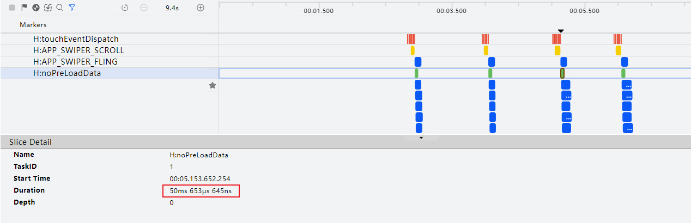
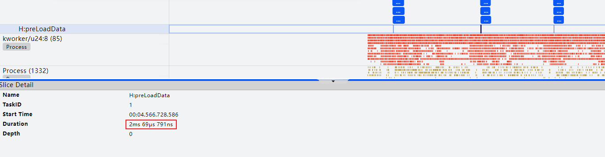
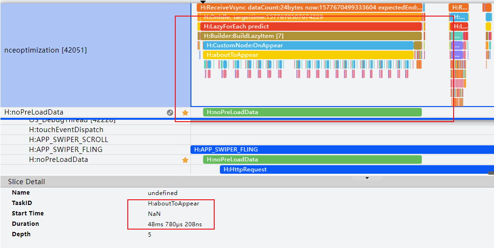

# Swiper组件加载丢帧优化

## 概述

在应用开发中，Swiper组件适用于翻页场景，如桌面和图库等应用。当Swiper组件滑动切换页面时，基于按需加载原则，通常在下一个页面即将显示时才进行加载和布局绘制。对于复杂页面场景，该过程可能需要较长时间，导致滑动过程中出现卡顿，影响滑动体验，甚至成为整个应用的性能瓶颈。


本文主要介绍Swiper性能优化的相关方法。


## 懒加载


### 原理介绍


懒加载从提供的数据源按需迭代数据，并在每次迭代过程中创建相应的组件，Swiper采用懒加载进行数据懒加载，在布局时会根据可视区域按需创建Swiper子组件，并在Swiper子组件滑出可视区域外时销毁以降低内存占用。Swiper组件的开发，属于滑动容器加载的一种场景，其LazyForEach懒加载原理可参考：[《长列表加载性能优化-懒加载》](https://developer.huawei.com/consumer/cn/doc/best-practices/bpta-best-practices-long-list#section182645364229)。


### 场景案例

为了展示Swiper使用ForEach与LazyForEach加载的性能差异，本地模拟答题场景进行测试。


Swiper子组件核心代码如下：


```typescript
1. @Reusable
2. @Component
3. struct QuestionSwiperItem {
4.  @State itemData: Question | null = null;
5.
6.  aboutToReuse(params: Record<string, Object>): void {
7.  this.itemData = params.itemData as Question;
8.  }
9.
10.  build() {
11.  Column() {
12.  Text(this.itemData?.title)
13.  // ...
14.  Image(this.itemData?.image)
15.  // ...
16.
17.  Column({ space: 16 }) {
18.  // ...
19.  }
20.  .width('100%')
21.  .alignItems(HorizontalAlign.Start)
22.  }
23.  // ...
24.  }
25. }

```


[LazyForEachSwiper.ets](https://gitcode.com/harmonyos_samples/SwiperPerformance/blob/master/entry/src/main/ets/pages/LazyForEachSwiper.ets#L20-L71)


Swiper主页面核心代码如下：


- 使用ForEach加载页面
  
  
  

```typescript
1. aboutToAppear(): void {
2.  for (let i = 0; i < 1000; i++) {
3.  this.list.push(i);
4.  this.data.addData(i, i);
5.  }
6. }
7.
8. build() {
9.  Column() {
10.  Swiper(this.swiperController) {
11.  ForEach(this.list, (item: number, index: number) => {
12.  SwiperItem({ myIndex: index })
13.  .width('100%')
14.  .height("100%")
15.  }, (item: string) => item)
16.  }
17.  // ...
18.  }
19.  .width('100%')
20.  .margin({ top: 5 })
21. }

```
  [SwiperCoreCode.ets](https://gitcode.com/harmonyos_samples/SwiperPerformance/blob/master/entry/src/main/ets/pages/SwiperCoreCode.ets#L12-L32)


- 使用LazyForEach加载页面
  
  
  

```typescript
1. Swiper(this.swiperController) {
2.  LazyForEach(this.dataSource, (item: Question) => {
3.  QuestionSwiperItem({ itemData: item })
4.  }, (item: Question) => item.id)
5. }

```
  [LazyForEachSwiper.ets](https://gitcode.com/harmonyos_samples/SwiperPerformance/blob/master/entry/src/main/ets/pages/LazyForEachSwiper.ets#L93-L97)


**表1** 当总题量为1000时，ForEach与LazyForEach的性能对比

展开

| 加载方式 | 完全显示所用时间 | 丢帧率 | 独占内存 |
| --- | --- | --- | --- |
| ForEach | 951ms | 8.5% | 200MB |
| LazyForEach | 280.6ms | 0.0% | 25.18MB |


根据实验数据，当Swiper的子组件数量超过100个时，采用懒加载可以提升帧率30%以上，并且减少内存占用20%以上。


## 缓存数据项


### 原理介绍

LazyForEach懒加载可以通过设置[cachedCount](https://developer.huawei.com/consumer/cn/doc/harmonyos-references/ts-container-swiper#cachedcount8)来指定缓存数量，详细原理参考：[《长列表加载性能优化-缓存列表项》](https://developer.huawei.com/consumer/cn/doc/best-practices/bpta-best-practices-long-list#section11667144010222)。


### 使用场景

如果开发者的应用场景属于加载耗时的场景，尤其是以下场景，推荐使用。


- Swiper的子组件具有复杂的动画；
- Swiper的子组件加载时需要执行网络请求等耗时操作；
- Swiper的子组件包含大量需要渲染的图像或资源。


### 场景案例

案例模拟Swiper子组件包含大量图像资源，前置条件如下：


- Swiper的子组件包含50个ListItem的List组件；
- 每个ListItem加载网络图片；
- Swiper组件共有20个ListItem子组件；
- 一屏显示一个Swiper子组件。


Swiper子组件核心代码如下：


```typescript
1. @Component
2. struct SwiperItem {
3.  private data: number[] = [];
4.  private myIndex: number = 0;
5.  // Construct data
6.  private imgURL: string[] = Constant.imgURL;
7.
8.  aboutToAppear(): void {
9.  for (let i = 0; i < 50; i++) {
10.  this.data.push(i);
11.  }
12.  }
13.
14.  build() {
15.  Column() {
16.  List({ space: 20 }) {
17.  ForEach(this.data, (index: number) => {
18.  ListItem() {
19.  Image(this.imgURL[this.myIndex * 50 + index])
20.  .objectFit(ImageFit.Contain)
21.  .width("100%")
22.  .height("100%")
23.  }
24.  .aspectRatio(1)
25.  .border({ width: 2, color: Color.Green })
26.  }, (index: number) => index.toString());
27.  }
28.  // ...
29.  }
30.  // ...
31.  }
32. }

```


[SwiperCoreCode.ets](https://gitcode.com/harmonyos_samples/SwiperPerformance/blob/master/entry/src/main/ets/pages/SwiperCoreCode.ets#L43-L74)


Swiper主页面核心代码如下：


```typescript
1. @Component
2. struct TestCodeTwo {
3.  private dataSrc: NumberDataSource = new NumberDataSource();
4.
5.  aboutToAppear(): void {
6.  for (let i = 0; i < 20; i++) {
7.  this.dataSrc.addData(i, i);
8.  }
9.  }
10.
11.  build() {
12.  Column({ space: 5 }) {
13.  Swiper() {
14.  LazyForEach(this.dataSrc, (item: number, index: number) => {
15.  SwiperItem({
16.  myIndex: index
17.  });
18.  }, (item: number) => item.toString());
19.  }
20.  .cachedCount(1)
21.  .autoPlay(true)
22.  .interval(1000)
23.  .duration(100)
24.  // ...
25.  }.width('100%')
26.  .margin({ top: 5 })
27.  }
28. }

```


[SwiperCoreCode.ets](https://gitcode.com/harmonyos_samples/SwiperPerformance/blob/master/entry/src/main/ets/pages/SwiperCoreCode.ets#L82-L109)


为了测试不同缓存数量对性能的影响，将 `cachedCount` 的值分别设置为 1、2、4、8。基于案例程序，测试不同缓存数量对帧率和内存占用的影响。


**表2** 不同cachedCount数量下的性能数据对比

| 缓存数量 | 1 | 2 | 4 | 8 |
| --- | --- | --- | --- | --- |
| 丢帧率 | 3.0% | 3.3% | 3.1% | 3.0% |
| 独占内存 | 64.36MB | 117.39MB | 214.32MB | 377.38MB |


根据测试结果，随着cachedCount的增加，应用的内存占用呈线性增长，但帧率没有显著提升。


在一屏显示一个Swiper子组件的连续滑动场景中，将cachedCount值设置为1或2。


说明

缓存数量仅供参考，不同的应用程序设置的最佳缓存数量不一致，需要针对应用程序测试得出最佳缓存数量。


## 提前加载数据


在抛滑场景时，Swiper组件有个[onAnimationStart()](https://developer.huawei.com/consumer/cn/doc/harmonyos-references/ts-container-swiper#onanimationstart9)回调接口，切换动画开始时触发该回调。此时，切换动画的逻辑在渲染线程中执行，主线程则可以利用这段时间加载子组件所需的资源，如图像和网络资源，减少后续cachedCount范围内的节点预加载耗时。跟手滑动阶段不会触发onAnimationStart回调，只有在离手后进行切换动画时才会触发。


### 场景案例

Swiper子组件：在子组件首次构建(生命周期执行到[aboutToAppear()](https://developer.huawei.com/consumer/cn/doc/harmonyos-references/ts-custom-component-lifecycle#abouttoappear))时，先判断Swiper数据中图片资源是否已经存在，若不存在则先下载图片资源，再构建节点。


```typescript
1. @Reusable
2. @Component
3. struct PreloadSwiperItem {
4.  // ...
5.
6.  aboutToAppear(): void {
7.  hiTraceMeter.startTrace('preloadData', 1);
8.  // ...
9.  if (!this.swiperData.pixelMap) {
10.  ImageUtils.getPixelMap(IMAGE_URL, (pixelMap: PixelMap) => {
11.  this.swiperData.pixelMap = pixelMap;
12.  });
13.  }
14.  // ...
15.  }
16.
17.  onDidBuild(): void {
18.  hiTraceMeter.finishTrace('preloadData', 1);
19.  }
20.
21.  build() {
22.  Grid() {
23.  LazyForEach(this.gridDataSource, (item: string) => {
24.  GridItem() {
25.  ImageItem({ item: item, swiperData: this.swiperData })
26.  }
27.  }, (item: string): string => item.toString())
28.  }
29.  .columnsTemplate('1fr 1fr 1fr 1fr')
30.  // ...
31.  }
32. }

```


[PreloadDataSwiper.ets](https://gitcode.com/harmonyos_samples/SwiperPerformance/blob/master/entry/src/main/ets/pages/PreloadDataSwiper.ets#L37-L85)


说明

打点事件说明，当SwiperItem发生预加载时，会先进入[自定义组件生命周期](https://developer.huawei.com/consumer/cn/doc/harmonyos-guides/arkts-page-custom-components-lifecycle)回调aboutToAppear，在aboutToAppear回调中使用startTrace开启打点跟踪，随后会进入build渲染组件，build函数执行完成后进入onDidBuild回调，在该回调中使用finishTrace停止打点追踪。分别使用“noPreLoadData”，“preLoadData”标签统计两种场景下的SwiperItem预加载耗时，关于本例中使用性能打点的介绍，请参考[性能打点](https://developer.huawei.com/consumer/cn/doc/harmonyos-references/js-apis-hitracemeter)。


Swiper主页面核心代码：


- 不提前加载数据
  
  
  

```typescript
1. @Entry
2. @Component
3. struct NoPreLoadData {
4.  private dataSrc: PixelMapDataSource = new PixelMapDataSource();
5.
6.
7.  aboutToAppear(): void {
8.  for (let i = 0; i < 20; i++) {
9.  this.dataSrc.addData(i, []);
10.  }
11.  }
12.
13.
14.  build() {
15.  Column({ space: 5 }) {
16.  Swiper() {
17.  LazyForEach(this.dataSrc, (item: PixelMap[], index: number) => {
18.  SwiperItem({
19.  myIndex: index,
20.  dataSource: this.dataSrc
21.  });
22.  }, (item: number, index: number) => index.toString());
23.  }
24.  // ...
25.  }
26.  .width('100%')
27.  .margin({ top: 5 })
28.  }
29. }

```
  [SwiperCoreCodeNoPreLoadData.ets](https://gitcode.com/harmonyos_samples/SwiperPerformance/blob/master/entry/src/main/ets/pages/SwiperCoreCodeNoPreLoadData.ets#L15-L43)


- 提前加载数据
  
  
  

```typescript
1. Swiper() {
2.  LazyForEach(this.swiperDataSource, (item: SwiperData) => {
3.  PreloadSwiperItem({ swiperData: item })
4.  }, (item: SwiperData) => item.index.toString())
5. }
6. .cachedCount(1)
7. // ...
8. .onAnimationStart((index: number, targetIndex: number) => {
9.  if (targetIndex < this.swiperDataSource.totalCount() - 2) {
10.  let swiperData = this.swiperDataSource.getData(targetIndex + 2);
11.  if (swiperData.pixelMap) {
12.  return;
13.  } else {
14.  // Simulation data download
15.  ImageUtils.getPixelMap(IMAGE_URL, (pixelMap: PixelMap) => {
16.  swiperData.pixelMap = pixelMap;
17.  });
18.  }
19.  }
20. })

```
  [PreloadDataSwiper.ets](https://gitcode.com/harmonyos_samples/SwiperPerformance/blob/master/entry/src/main/ets/pages/PreloadDataSwiper.ets#L104-L131)


性能分析：


如图1所示，不使用onAnimationStart回调提前加载数据，通过自定义打点标签“H:noPreLoadData”，可以看出SwiperItem节点的构建耗时50ms左右。


**图1** 没有提前加载数据的打点信息  


如图2所示，采用onAnimationStart回调提前加载数据，通过自定义打点标签“H:preLoadData”，可以看出SwiperItem节点的构建耗时2ms左右。


**图2** 使用了提前加载数据的打点信息  


观察“H:noPreLoadData”时间段的详细trace图，可以发现预加载构建SwiperItem时，aboutToAppear生命周期回调加载图片资源占用48毫秒。


**图3** “H:noPreLoadData”时间段的trace详细信息  


使用onAnimationStart回调接口提前加载后续范围内子组件所需资源，能够减少cachedCount范围内子组件节点的加载时间。


## 组件复用

在Swiper翻页场景中，子组件频繁创建和销毁。将子组件封装为自定义组件，并使用@Reusable装饰器修饰，以减少ArkUI框架内部反复创建和销毁节点的开销。


详细原理及性能分析参考：[《长列表加载性能优化-组件复用》](https://developer.huawei.com/consumer/cn/doc/best-practices/bpta-best-practices-long-list#section36781044162218)。


## 总结

本文介绍Swiper在复杂页面场景下的注意事项和性能优化方法。


- 使用LazyForEach懒加载，可以针对大量数据实现快速渲染显示，并减少内存占用。
- 合理设置cachedCount缓存数据项，预先加载屏幕可视区外的数据缓存。
- 在抛滑场景中，可以利用渲染线程和主线程分离，在onAnimationStart接口回调中提前加载子组件所需资源，从而减少后续预加载所需时间。
- 使用@Reusable复用组件，借助RecycleManager从复用池中取出的视图对象，快速绑定新的数据，减少创建、销毁视图带来的性能损耗。


## 示例代码

- [实现Swiper组件加载慢丢帧优化](https://gitcode.com/harmonyos_samples/SwiperPerformance)
