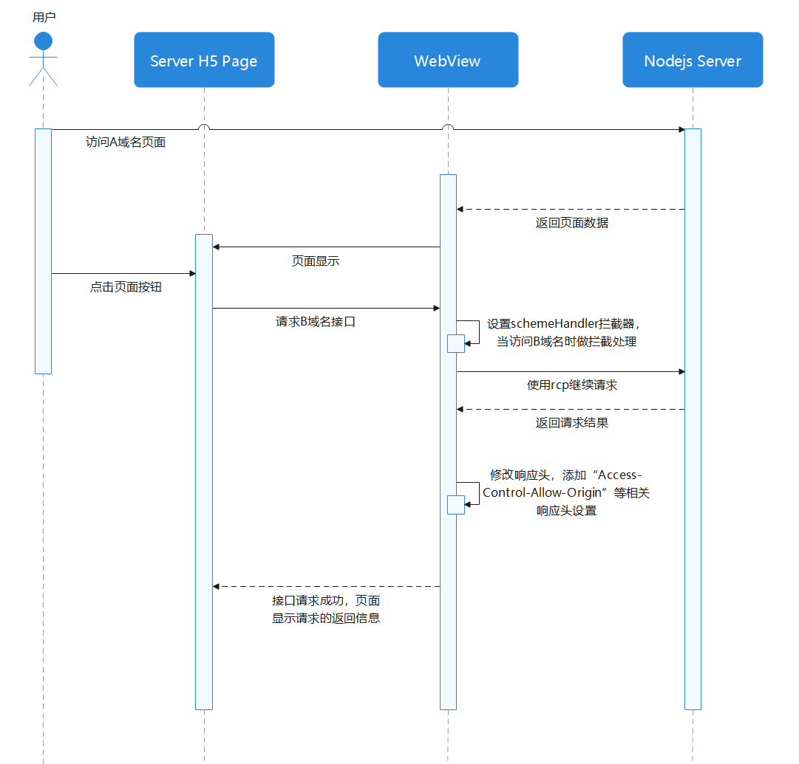

# Web页面跨域解决方案

## 概述


在Web开发领域，跨域资源共享是浏览器为保障用户信息安全而实施的一种安全策略，它限制了不同源（协议、域名、端口任意一项存在差异）的网页之间进行资源交互。对于依赖多源数据交互的Web应用而言，有效的跨域解决方案是确保业务数据正常传输与交互的关键，能够减少因跨域限制导致的功能阻塞，防止恶意网站通过脚本窃取用户数据或进行未授权操作，进而提升应用的兼容性和用户体验。


结合实际应用，本文将分为以下几种场景介绍Web页面跨域解决方案：


- [本地资源跨域](https://developer.huawei.com/consumer/cn/doc/best-practices/bpta-cross-domain-solutions-for-web-pages#section6164167185112)：当Web页面访问本地文件系统资源时，由于本地文件协议与网页协议不同而引发的跨域问题。
- [远程请求跨域](https://developer.huawei.com/consumer/cn/doc/best-practices/bpta-cross-domain-solutions-for-web-pages#section1281615241211)：Web页面向不同域名、端口或协议的远程服务器发送请求（如API接口调用）时，因源的不同而受到的跨域限制。
- [跨域请求的Cookie设置](https://developer.huawei.com/consumer/cn/doc/best-practices/bpta-cross-domain-solutions-for-web-pages#section1081074115327)：在跨域请求过程中，需要传递Cookie等身份凭证时，因浏览器安全策略的限制，导致Cookie无法正常携带或读取的问题。
- [自定义协议跨域](https://developer.huawei.com/consumer/cn/doc/best-practices/bpta-cross-domain-solutions-for-web-pages#section47286466323)：应用通过自定义协议（如app://）与本地服务或其他应用进行通信时，由于协议存在差异而导致的跨域交互问题。


## 本地资源跨域


### 场景描述


在Web开发与调试工作中，经常会出现通过本地文件系统直接打开HTML页面，并访问同目录下的本地脚本、样式或图片等资源的情况。这时，浏览器会因为协议不同而判定为跨域，从而触发安全限制，导致资源加载失败。


本地资源跨域具体的安全限制表现如下：


- AJAX（XMLHttpRequest/Fetch）：无法向另一个本地文件发送请求，会遇到经典的CORS(跨域资源共享)错误。
- 访问iframe内容：如果一个file://协议页面通过<iframe>嵌入另一个本地文件，父页面无法使用JavaScript读取或操作iframe内部的内容。
- Web Workers：可能无法从本地文件启动。
- 某些HTML5 API：如localStorage和sessionStorage的访问可能会受到更严格的限制，甚至在某些情况下不可用。
- CSS和JavaScript模块：使用import、@import或<link rel="modulepreload">引用其他本地模块文件时，可能会失败。


本节以“WebView 加载本地H5离线包（file://协议），且该离线H5发起HTTP请求”的场景举例，介绍file协议下不同源跨域问题的解决方案。


### 实现原理


通过[setPathAllowingUniversalAccess()](https://developer.huawei.com/consumer/cn/doc/harmonyos-references/arkts-apis-webview-webviewcontroller#setpathallowinguniversalaccess12)设置一个路径列表。当使用file协议访问该列表中的资源时，允许进行跨域访问本地文件。此外，一旦设置了路径列表，file协议将仅限于访问列表内的资源（此时，[fileAccess](https://developer.huawei.com/consumer/cn/doc/harmonyos-references/arkts-basic-components-web-attributes#fileaccess)的行为将会被此接口行为覆盖）。


### 开发步骤

[setPathAllowingUniversalAccess()](https://developer.huawei.com/consumer/cn/doc/harmonyos-references/arkts-apis-webview-webviewcontroller#setpathallowinguniversalaccess12)设置的路径列表中的路径应符合以下任一路径格式：


1. 应用文件目录通过[Context.filesDir()](https://developer.huawei.com/consumer/cn/doc/harmonyos-references/js-apis-inner-application-context#context)获取，其子目录示例如下：
  - /data/storage/el2/base/files/example
  - /data/storage/el2/base/haps/entry/files/example
2. 应用资源目录通过[Context.resourceDir()](https://developer.huawei.com/consumer/cn/doc/harmonyos-references/js-apis-inner-application-context#context)获取，其子目录示例如下：
  - /data/storage/el1/bundle/entry/resources/resfile
  - /data/storage/el1/bundle/entry/resources/resfile/example


当路径列表中的任一路径不满足上述条件时，系统将抛出异常码401，并判定路径列表设置失败。如果路径列表设置为空，file协议的可访问范围将遵循[fileAccess](https://developer.huawei.com/consumer/cn/doc/harmonyos-references/arkts-basic-components-web-attributes#fileaccess)规则。


在当前示例中，本地H5页面存放在工程的resfile目录下，通过setPathAllowingUniversalAccess()设置resfile目录，将本地H5及其引用资源文件都放在允许跨域访问的路径列表中，解决页面发起http请求跨域问题。


```typescript
1. Web({ src: 'resource://resfile/LocalResource/dist/index.html', controller: this.controller })
2.  .onControllerAttached(() => {
3.  try {
4.  // Set the list of paths that allow cross-origin access
5.  this.controller.setPathAllowingUniversalAccess([
6.  this.uiContext.getHostContext()!.resourceDir + '/LocalResource',
7.  ])
8.  } catch (error) {
9.  Logger.error(`ErrorCode: ${(error as BusinessError).code}, Message: ${(error as BusinessError).message}`);
10.  }
11.  })

```


[LocalResource.ets](https://gitcode.com/HarmonyOS_Samples/WebCrossDomain/blob/master/entry/src/main/ets/views/LocalResource.ets#L34-L44)


说明

使用setPathAllowingUniversalAccess需确保该路径可信任，并与用户文件隔离。


## 远程请求跨域


### 场景描述

在Web应用中，当前端页面向不同源的远程服务器发送请求以获取数据时，浏览器会因为同源策略而拦截响应，导致请求失败。这种场景在前后端分离架构中十分常见，例如前端应用部署在http://***a.com，而后端 API 部署在http://***b.com（域名不同），或者调用第三方服务（如http://www.***thirdparty.com）时，都会触发远程请求跨域问题。


### 实现原理

远程请求跨域的解决方案基于浏览器的跨域资源共享（CORS）机制或间接代理方式，其核心是通过服务器配置或中间层转发来消除源的差异：


- CORS（跨域资源共享）：由服务器端进行响应头配置，明确允许特定源的请求访问资源。服务器通过设置Access-Control-Allow-Origin指定允许的源，Access-Control-Allow-Methods指定允许的请求方法，Access-Control-Allow-Headers指定允许的请求头，使浏览器认可跨域请求的合法性。在ArkWeb中发起请求时，无需特殊配置，只需服务器正确设置CORS即可。
- 代理请求：在WebView中设置拦截器拦截Web页面发起的跨域请求，使用[RCP请求](https://developer.huawei.com/consumer/cn/doc/harmonyos-references/remote-communication-rcp)代理请求到目标远程服务器。[RCP请求](https://developer.huawei.com/consumer/cn/doc/harmonyos-references/remote-communication-rcp)与远程服务器的通信不受浏览器限制，因此可以接收到服务器的响应结果，但将结果传回WebView时仍需配置跨域响应头来解决跨域问题。
  **图1** 代理请求方案流程图  


### 开发步骤

开发者进行跨域访问远程服务器时，首选方案为在远程服务器端配置跨域相关响应头，包括Access-Control-Allow-Origin、Access-Control-Allow-Methods、Access-Control-Allow-Headers等关键字段；其次，可根据实际需求在WebView中通过代理请求并修改响应头，以保障请求顺利完成。两种方案任选其一即可。


**方案一 服务器端CORS设置**


将Access-Control-Allow-Origin、Access-Control-Allow-Methods、Access-Control-Allow-Headers等配置根据自身开发的实际情况设置在响应头上。需要注意的是，修改跨域头Access-Control-Allow-Origin时需要匹配具体域名，避免使用通配符“*”。


```typescript
1. appB.use(cors({
2.  origin: 'http://www.a.harmonyos:8080',
3.  methods: ['GET', 'POST', 'PUT', 'DELETE', 'OPTIONS'],
4.  allowedHeaders: ['Content-Type', 'Authorization'],
5.  credentials: true
6. }));

```


[app.js](https://gitcode.com/HarmonyOS_Samples/WebCrossDomain/blob/master/LocalServer/app.js#L68-L73)


**方案二 代理请求**

1. 在WebView中设置请求拦截器时，可通过[onLoadIntercept()](https://developer.huawei.com/consumer/cn/doc/harmonyos-references/arkts-basic-components-web-events#onloadintercept10)、[onInterceptRequest()](https://developer.huawei.com/consumer/cn/doc/harmonyos-references/arkts-basic-components-web-events#oninterceptrequest9)、[WebSchemeHandler.onRequestStart()](https://developer.huawei.com/consumer/cn/doc/harmonyos-references/arkts-apis-webview-webschemehandler#onrequeststart12)三种常用方法实现。下文以WebSchemeHandler.onRequestStart()方法为例，说明具体拦截逻辑的实现方式：     通过[setWebSchemeHandler()](https://developer.huawei.com/consumer/cn/doc/harmonyos-references/arkts-apis-webview-webviewcontroller#setwebschemehandler12)为当前Web组件配置拦截器，专门用于拦截HTTP协议请求。当拦截到请求后，可在WebSchemeHandler的onRequestStart()回调中编写跨域请求的具体处理逻辑；回调中需返回true，以此告知Web组件“该请求已被拦截，无需继续执行默认请求流程”。


  
  
  

```typescript
1. Web({ src: 'http://www.a.harmonyos:8080/RemoteRequest/dist/index.html', controller: this.controller })
2.  .onControllerAttached(() => {
3.  try {
4.  // Using interceptor to intercept requests
5.  this.schemeHandler.onRequestStart((request: webview.WebSchemeHandlerRequest, resourceHandler: webview.WebResourceHandler) => {
6.  Logger.info('[schemeHandler] onRequestStart');
7.  if (request.getRequestUrl().includes('www.c.harmonyos')) {
8.  // Through proxy request server
9.  this.httpProxy.get(request.getRequestUrl(), resourceHandler, {
10.  mimeType: 'application/json',
11.  requestOrigin: 'http://www.a.harmonyos:8080'
12.  })
13.  return true;
14.  } else {
15.  return false;
16.  }
17.  })
18.
19.  // Bind an interceptor to the HTTP protocol.
20.  this.controller.setWebSchemeHandler('http', this.schemeHandler);
21.  } catch (error) {
22.  Logger.error(`ErrorCode: ${(error as BusinessError).code}, Message: ${(error as BusinessError).message}`);
23.  }
24.  })


```
  [RemoteRequest.ets](https://gitcode.com/HarmonyOS_Samples/WebCrossDomain/blob/master/entry/src/main/ets/views/RemoteRequest.ets#L47-L70)

2. 使用[RCP](https://developer.huawei.com/consumer/cn/doc/harmonyos-references/remote-communication-rcp)请求作为跨域请求的代理请求。


  
  
  

```typescript
1. export class HttpProxy {
2.  session?: rcp.Session;
3.
4.  constructor(sessionConfiguration?: rcp.SessionConfiguration | undefined) {
5.  try {
6.  this.session = rcp.createSession(sessionConfiguration);
7.  } catch (error) {
8.  Logger.error(`ErrorCode: ${(error as BusinessError).code}, Message: ${(error as BusinessError).message}`);
9.  }
10.  }
11.
12.  // ...
13.  public get(request: string, resourceHandler: webview.WebResourceHandler, options: HttpProxyOptions): void {
14.  try {
15.  this.session?.get(request).then((res) => {
16.  this.handleResponse(res, resourceHandler, options)
17.  }).catch((error: BusinessError) => {
18.  Logger.error(`ErrorCode: ${error.code}, Message: ${error.message}`);
19.  })
20.  } catch (error) {
21.  Logger.error(`ErrorCode: ${(error as BusinessError).code}, Message: ${(error as BusinessError).message}`);
22.  }
23.  }
24.
25.  // ...
26. }


```
  [HttpProxy.ets](https://gitcode.com/HarmonyOS_Samples/WebCrossDomain/blob/master/entry/src/main/ets/common/HttpProxy.ets#L22-L83)

3. 新建响应头，将跨域响应头配置到新响应头上，将新响应头和RCP请求的结果都放到拦截器的[resourceHandler](https://developer.huawei.com/consumer/cn/doc/harmonyos-references/arkts-apis-webview-webresourcehandler)中，通知Web组件被拦截的请求已经完成。
  
  
  

```typescript
1. private handleResponse(res: rcp.Response, resourceHandler: webview.WebResourceHandler,
2.  options: HttpProxyOptions): void {
3.  let response = new webview.WebSchemeHandlerResponse();
4.  response.setStatus(200)
5.  response.setStatusText('OK')
6.  response.setMimeType(options.mimeType || 'application/json')
7.  response.setEncoding('utf-8')
8.  response.setNetErrorCode(WebNetErrorList.NET_OK)
9.  response.setHeaderByName('Access-Control-Allow-Origin', options.requestOrigin, true);
10.  response.setHeaderByName('Access-Control-Allow-Credentials', 'true', true);
11.  response.setHeaderByName('Access-Control-Allow-Methods', 'GET, POST, PUT, DELETE', true);
12.  response.setHeaderByName('Access-Control-Allow-Headers', 'Content-Type, Authorization', true);
13.  try {
14.  resourceHandler.didReceiveResponse(response);
15.  resourceHandler.didReceiveResponseBody(res.body);
16.  resourceHandler.didFinish();
17.  } catch (error) {
18.  Logger.error(`ErrorCode: ${(error as BusinessError).code}, Message: ${(error as BusinessError).message}`);
19.  }
20. }


```
  [HttpProxy.ets](https://gitcode.com/HarmonyOS_Samples/WebCrossDomain/blob/master/entry/src/main/ets/common/HttpProxy.ets#L35-L54)


## 跨域请求的Cookies设置


### 场景描述


在跨域请求中，当需要携带Cookie时，浏览器会因为安全策略默认阻止Cookie的发送或接收。例如，前端请求需要携带www.***a.com的Cookie到www.***b.com，会因跨域被拦截，导致基于Cookie的身份验证失败。在ArkTS应用中，跨域请求时Cookie的设置和传递也会受到类似的限制。


### 实现原理

跨域请求的Cookie设置需要同时满足前端请求配置与服务器响应头要求，核心是通过显式声明允许Cookie跨域传输，消除浏览器的安全限制。


- 前端配置：在发送跨域请求时，需设置credentials: 'include'（Fetch API）或withCredentials: true（XMLHttpRequest），告知浏览器允许携带Cookie。
- WebView配置：调用[WebCookieManager.putAcceptCookieEnabled()](https://developer.huawei.com/consumer/cn/doc/harmonyos-references/arkts-apis-webview-webcookiemanager#putacceptcookieenabled)接口以允许携带Cookie。
- 服务器配置：响应头需包含Access-Control-Allow-Credentials: true，明确允许跨域请求携带Cookie；同时Access-Control-Allow-Origin不能为通配符“*”，必须指定具体的前端源（如http://www.***a.com），确保权限可控。
- Cookie属性：根据业务开发需要，设置合适的允许携带的Cookie属性。


### 开发步骤


1. 在Web前端访问服务器时，设置withCredentials: true。
  
  
  

```typescript
1. const response = await axios.post('http://www.b.harmonyos:8080/api/getCookies', {}, {
2.  withCredentials: true
3. });

```
  [CookiesSettingsB.vue](https://gitcode.com/HarmonyOS_Samples/WebCrossDomain/blob/master/LocalVue/src/components/CookiesSettingsB.vue#L53-L55)

2. 在ArkWeb中，使用[WebCookieManager](https://developer.huawei.com/consumer/cn/doc/harmonyos-references/arkts-apis-webview-webcookiemanager)的相关接口，完成允许携带Cookie、获取A域名下的Cookie、将Cookie设置到B域名下的操作。
  
  
  

```typescript
1. webview.WebCookieManager.putAcceptCookieEnabled(true);
2. webview.WebCookieManager.putAcceptThirdPartyCookieEnabled(true)
3. let value = webview.WebCookieManager.fetchCookieSync('http://www.a.harmonyos');
4. webview.WebCookieManager.configCookieSync('http://www.b.harmonyos',
5.  value + '; PATH=/; Max-Age=900000; HttpOnly; SameSite=Lax');

```
  [CookiesSettings.ets](https://gitcode.com/HarmonyOS_Samples/WebCrossDomain/blob/master/entry/src/main/ets/views/CookiesSettings.ets#L53-L57)

3. 服务器端在响应头中添加Access-Control-Allow-Credentials: true，将Access-Control-Allow-Origin设置为具体域名（非通配符“*”）。
  
  
  

```typescript
1. appB.use(cors({
2.  origin: 'http://www.a.harmonyos:8080',
3.  methods: ['GET', 'POST', 'PUT', 'DELETE', 'OPTIONS'],
4.  allowedHeaders: ['Content-Type', 'Authorization'],
5.  credentials: true
6. }));

```
  [app.js](https://gitcode.com/HarmonyOS_Samples/WebCrossDomain/blob/master/LocalServer/app.js#L68-L73)


## 自定义协议跨域


### 场景描述

开发者为避免拦截所有请求，可让前端使用自定义协议标识需要转发的请求。本节通过拦截自定义协议（app://）来展现自定义协议跨域，主要分为两个功能点：拦截页面加载时的自定义协议请求，替换为本地资源加载；点击页面按钮后拦截其发起的自定义协议请求，调用系统弹窗进行提示。


### 实现原理

- 拦截自定义协议替换为本地资源加载：通过[WebSchemeHandler](https://developer.huawei.com/consumer/cn/doc/harmonyos-references/arkts-apis-webview-webschemehandler)拦截器，在WebView加载页面资源时，对自定义协议的资源进行拦截，返回读取的本地资源。
- 拦截自定义协议调用系统弹窗：通过[WebSchemeHandler](https://developer.huawei.com/consumer/cn/doc/harmonyos-references/arkts-apis-webview-webschemehandler)拦截器，拦截自定义协议接口，调用系统弹窗提示“已拦截自定义协议”。


### 开发步骤


1. 为自定义协议app://设置拦截器。
  
  
  

```typescript
1. this.schemeHandler.onRequestStart((request: webview.WebSchemeHandlerRequest,
2.  resourceHandler: webview.WebResourceHandler) => {
3.
4.  // ...
5.  return true;
6. })
7.
8. // Bind an interceptor to the app protocol
9. this.controller.setWebSchemeHandler('app', this.schemeHandler);

```
  [CustomProtocol.ets](https://gitcode.com/HarmonyOS_Samples/WebCrossDomain/blob/master/entry/src/main/ets/views/CustomProtocol.ets#L64-L111)

2. 拦截WebView组件加载页面资源时的自定义协议资源，读取对应的本地资源文件进行替换，创建响应头，将响应头和读取的本地资源设置到拦截器的resourceHandler中。
  
  
  

```typescript
1. let pathArray = request.getRequestUrl().split('app://');
2. let filePath = this.uiContext.getHostContext()!.resourceDir + '/CustomProtocol/dist/' +
3. pathArray[pathArray.length-1];
4. let file = fs.readTextSync(filePath);
5.
6. let response = new webview.WebSchemeHandlerResponse();
7. response.setNetErrorCode(WebNetErrorList.NET_OK);
8. response.setStatus(200);
9. response.setStatusText('OK');
10. response.setMimeType(getContentType(filePath));
11. response.setEncoding('utf-8');
12.
13. // Convert to buffer type
14. let buf = buffer.from(file)
15. try {
16.  if (buf.length === 0) {
17.  resourceHandler.didFail(WebNetErrorList.ERR_FAILED);
18.  } else {
19.  resourceHandler.didReceiveResponse(response);
20.  resourceHandler.didReceiveResponseBody(buf.buffer);
21.  resourceHandler.didFinish();
22.  }
23. } catch (error) {
24.  Logger.error(`[schemeHandler] ErrorCode: ${(error as BusinessError).code}, Message: ${(error as BusinessError).message}`);
25. }

```
  [CustomProtocol.ets](https://gitcode.com/HarmonyOS_Samples/WebCrossDomain/blob/master/entry/src/main/ets/views/CustomProtocol.ets#L80-L104)

3. 拦截自定义协议接口，调用显示系统弹窗接口，提示自定义协议已被拦截，返回true拦截该请求。
  
  
  

```typescript
1. if (request.getRequestUrl().includes('openDialog')) {
2.  this.promptAction.showToast({
3.  message: $r('app.string.CustomProtocol_toast'),
4.  duration: 3000,
5.  })
6.  return true;
7. }

```
  [CustomProtocol.ets](https://gitcode.com/HarmonyOS_Samples/WebCrossDomain/blob/master/entry/src/main/ets/views/CustomProtocol.ets#L70-L76)


## 示例代码

- [基于ArkWeb拦截器和Cookies管理能力实现Web页面跨域](https://gitcode.com/harmonyos_samples/WebCrossDomain)
