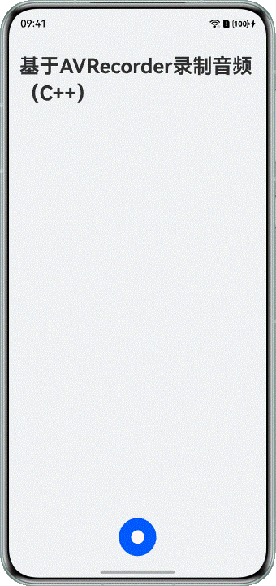
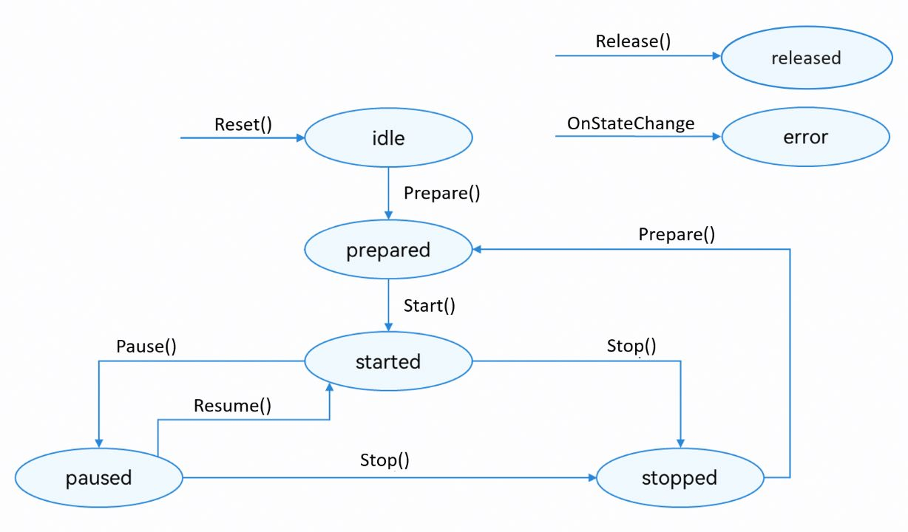

# 基于AVRecorder录制格式化音频（C++）

## 概述

AVRecorder提供了Native API，可以快速实现音频录制，支持m4a、mp3等格式。本文适用于音频录制类应用的开发，针对市场上主流音频录制类应用的常见场景，介绍了在C/C++侧基于AVRecorder如何录制格式化音频，指导开发者实现基础录制。


基于AVRecorder录制格式化音频（C++）实现的功能效果如下：





本文的主要内容如下：


[基础录制](https://developer.huawei.com/consumer/cn/doc/best-practices/bpta-audio-record-base-on-avrecorder#section20569101215108)：介绍了在C/C++侧基于AVRecorder录制格式化音频，包括开始录制、暂停录制和结束录制。


## 基础录制


### 实现原理

除了ArkTS语言版本外，HarmonyOS还提供了C/C++语言版本的AVRecorder录制器，用于在C/C++侧进行音频数据采集、音频编码以及音频文件封装等端到端一体化音频录制。C/C++侧AVRecorder的功能和开发流程与ArkTS侧基本一致。


**图1** 录制状态变化示意图




### 开发步骤

1.在CMake脚本中链接动态库libavrecorder.so、libnative_media_core.so等。


```scss
1. target_link_libraries(entry PUBLIC libace_napi.z.so libavrecorder.so libnative_media_core.so libhilog_ndk.z.so)

```


[CMakeLists.txt](https://gitcode.com/HarmonyOS_Samples/avrecorder-record-formatted-audio-cpp/blob/master/entry/src/main/cpp/CMakeLists.txt#L16-L16)


2.在Native侧，配置AVRecorder。


- 创建OH_AVRecorder_Config对象，并设置音频录制的相关配置，包括音频采样率、音频格式、采样通道等。
- 根据实际需要，设置音频录制的回调函数，如错误回调函数OH_AVRecorder_SetErrorCallback()等。
- 调用OH_AVRecorder_Prepare()接口，让AVRecorder进入prepare状态。


```cpp
1. // Set AVRecorder Config
2. void SetConfig(OH_AVRecorder_Config &config) {
3.  config.audioSourceType = AVRECORDER_MIC;
4.  // Set media config
5.  config.profile.audioBitrate = 96000; // Set audio bitrate
6.  config.profile.audioChannels = 2; // Set audio channels
7.  config.profile.audioCodec = AVRECORDER_AUDIO_MP3; // Set audio codec
8.  config.profile.audioSampleRate = 48000; // Set audio sampleRate
9.  config.profile.fileFormat = AVRECORDER_CFT_MP3; // Set fileFormat
10.  config.fileGenerationMode = AVRECORDER_APP_CREATE; // Set FileGenerationMode
11. }
12.
13. // Prepare AVRecorder
14. napi_value AVRecorder::PrepareAVRecorder(napi_env env, napi_callback_info info) {
15.  size_t argc = 1;
16.  napi_value args[1] = {nullptr};
17.  napi_get_cb_info(env, info, &argc, args, nullptr, nullptr);
18.
19.  napi_get_value_int32(env, args[0], &g_outputFd);
20.  if (g_outputFd <= 0) {
21.  napi_value res;
22.  napi_create_int32(env, -1, &res);
23.  return res;
24.  }
25.  OH_LOG_INFO(LOG_APP, "PrepareAVRecorder in!");
26.  g_avRecorder = OH_AVRecorder_Create();
27.  OH_LOG_INFO(LOG_APP, "AVRecorder Create ok! g_avRecorder: %{public}p", g_avRecorder);
28.  if (g_avRecorder == nullptr) {
29.  OH_LOG_ERROR(LOG_APP, "AVRecorder Create failed!");
30.  }
31.  OH_AVRecorder_Config *config = new OH_AVRecorder_Config();
32.  SetConfig(*config);
33.
34.  // Set url
35.  std::string fileUrl = "fd://" + std::to_string(g_outputFd);
36.  config->url = const_cast<char *>(fileUrl.c_str());
37.  OH_LOG_INFO(LOG_APP, "config.url is: %s", const_cast<char *>(fileUrl.c_str()));
38.
39.  // Set State Callback
40.  OH_AVRecorder_SetStateCallback(g_avRecorder, OnStateChange, nullptr);
41.  // Set Error Callback
42.  OH_AVRecorder_SetErrorCallback(g_avRecorder, OnError, nullptr);
43.  // Set recorder configuration
44.  OH_AVRecorder_SetWillMuteWhenInterrupted(g_avRecorder, true);
45.
46.  // Prepare
47.  int result = OH_AVRecorder_Prepare(g_avRecorder, config);
48.  if (result != AV_ERR_OK) {
49.  OH_LOG_ERROR(LOG_APP, " AVRecorder Prepare failed %{public}d", result);
50.  }
51.  napi_value res;
52.  napi_create_int32(env, result, &res);
53.  return res;
54. }

```


[AVRecorder.cpp](https://gitcode.com/HarmonyOS_Samples/avrecorder-record-formatted-audio-cpp/blob/master/entry/src/main/cpp/capabilities/AVRecorder.cpp#L68-L121)


3.启动音频录制。


```cpp
1. // Start AVRecorder
2. napi_value AVRecorder::StartAVRecorder(napi_env env, napi_callback_info info) {
3.  (void)info;
4.  OH_LOG_INFO(LOG_APP, " g_avRecorder start: %{public}p", g_avRecorder);
5.  int result = OH_AVRecorder_Start(g_avRecorder);
6.  if (result != AV_ERR_OK) {
7.  OH_LOG_ERROR(LOG_APP, " AVRecorder Start failed %{public}d", result);
8.  }
9.  napi_value res;
10.  napi_create_int32(env, result, &res);
11.  return res;
12. }

```


[AVRecorder.cpp](https://gitcode.com/HarmonyOS_Samples/avrecorder-record-formatted-audio-cpp/blob/master/entry/src/main/cpp/capabilities/AVRecorder.cpp#L125-L136)


4.暂停音频录制。


```cpp
1. // Pause AVRecorder
2. napi_value AVRecorder::PauseAVRecorder(napi_env env, napi_callback_info info) {
3.  (void)info;
4.  int result = OH_AVRecorder_Pause(g_avRecorder);
5.  if (result != AV_ERR_OK) {
6.  OH_LOG_ERROR(LOG_APP, " AVRecorder Pause failed %{public}d", result);
7.  }
8.  napi_value res;
9.  napi_create_int32(env, result, &res);
10.  return res;
11. }

```


[AVRecorder.cpp](https://gitcode.com/HarmonyOS_Samples/avrecorder-record-formatted-audio-cpp/blob/master/entry/src/main/cpp/capabilities/AVRecorder.cpp#L140-L150)


5.继续音频录制。


```cpp
1. // Resume AVRecorder
2. napi_value AVRecorder::ResumeAVRecorder(napi_env env, napi_callback_info info) {
3.  (void)info;
4.  int result = OH_AVRecorder_Resume(g_avRecorder);
5.  if (result != AV_ERR_OK) {
6.  OH_LOG_ERROR(LOG_APP, " AVRecorder Resume failed %{public}d", result);
7.  }
8.  napi_value res;
9.  napi_create_int32(env, result, &res);
10.  return res;
11. }

```


[AVRecorder.cpp](https://gitcode.com/HarmonyOS_Samples/avrecorder-record-formatted-audio-cpp/blob/master/entry/src/main/cpp/capabilities/AVRecorder.cpp#L154-L164)


6.停止音频录制。


```cpp
1. // Stop AVRecorder
2. napi_value AVRecorder::StopAVRecorder(napi_env env, napi_callback_info info) {
3.  (void)info;
4.  int result = OH_AVRecorder_Stop(g_avRecorder);
5.  if (result != AV_ERR_OK) {
6.  OH_LOG_ERROR(LOG_APP, " AVRecorder Stop failed %{public}d", result);
7.  }
8.  close(g_outputFd);
9.  napi_value res;
10.  napi_create_int32(env, result, &res);
11.  return res;
12. }

```


[AVRecorder.cpp](https://gitcode.com/HarmonyOS_Samples/avrecorder-record-formatted-audio-cpp/blob/master/entry/src/main/cpp/capabilities/AVRecorder.cpp#L168-L179)


7.释放音频录制资源。


```cpp
1. // Release AVRecorder
2. napi_value AVRecorder::ReleaseAVRecorder(napi_env env, napi_callback_info info) {
3.  (void)info;
4.  if (g_avRecorder == nullptr) {
5.  OH_LOG_ERROR(LOG_APP, " g_avRecorder is nullptr!");
6.  napi_value res;
7.  napi_create_int32(env, AV_ERR_INVALID_VAL, &res);
8.  return res;
9.  }
10.
11.  int result = OH_AVRecorder_Release(g_avRecorder);
12.  g_avRecorder = nullptr;
13.
14.  if (result != AV_ERR_OK) {
15.  OH_LOG_ERROR(LOG_APP, " AVRecorder Release failed %{public}d", result);
16.  }
17.  napi_value res;
18.  napi_create_int32(env, result, &res);
19.  return res;
20. }

```


[AVRecorder.cpp](https://gitcode.com/HarmonyOS_Samples/avrecorder-record-formatted-audio-cpp/blob/master/entry/src/main/cpp/capabilities/AVRecorder.cpp#L204-L223)


## 常见问题


### 设置静音打断模式

通过调用[OH_AVRecorder_SetWillMuteWhenInterrupted()](https://developer.huawei.com/consumer/cn/doc/harmonyos-references/capi-avrecorder-h#oh_avrecorder_setwillmutewheninterrupted)接口设置是否开启静音打断模式。


### 设置回声消除

通过将[OH_AVRecorder_AudioSourceType](https://developer.huawei.com/consumer/cn/doc/harmonyos-references/capi-avrecorder-base-h#oh_avrecorder_audiosourcetype)值指定为AVRECORDER_VOICE_COMMUNICATION即可。


## 示例代码

- [基于AVRecorder录制音频（C++）](https://gitcode.com/HarmonyOS_Samples/avrecorder-record-formatted-audio-cpp)
