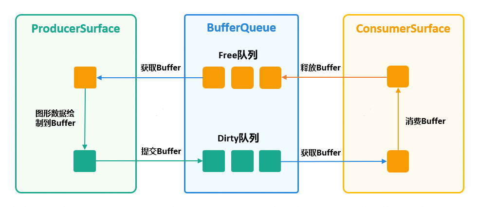
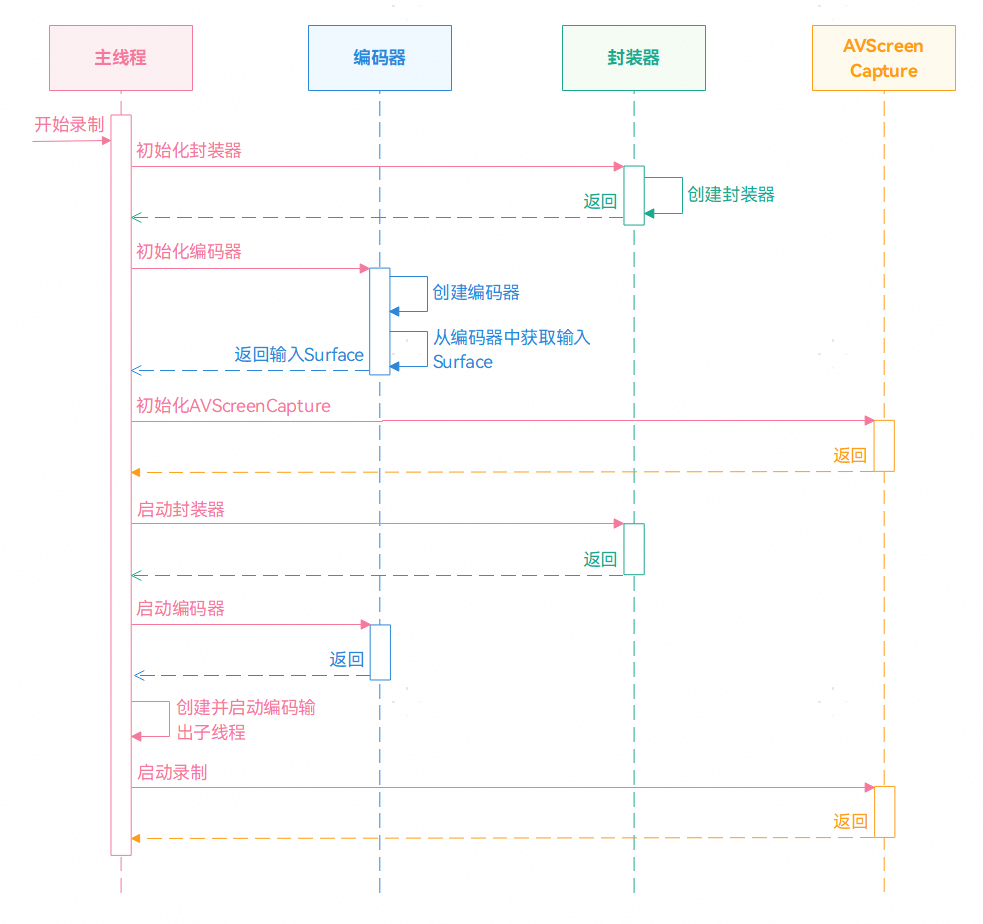
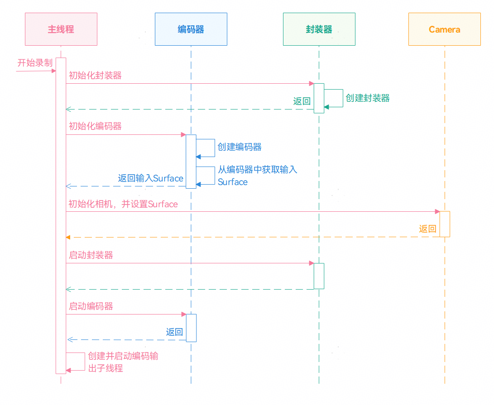

# 基于Surface模式进行视频编码

## 概述

视频编码是指通过压缩技术，将原始视频数据转换成压缩数据的过程。HarmonyOS提供了媒体文件的解析和封装、音视频的编解码。基于[Surface模式](https://developer.huawei.com/consumer/cn/doc/harmonyos-guides/video-encoding#surface%E6%A8%A1%E5%BC%8F)进行视频编码指通过NativeWindow来传递编码的输入数据，使用AVCodec提供的视频编码能力实现视频编码的过程。开发者可以通过OHNativeWindow与其他模块进行对接，如相机模块、屏幕录制模块等。


## 实现原理


### Surface轮转原理

在Surface模式下，视频编码依赖NativeWindow传递编码数据。其中，NativeWindow是本地平台化窗口，表示图形队列的生产者端，包含了Surface对象。


Surface主要是用于管理、传递图形和媒体的共享内存，具体场景如图形的生产、消费、合成，媒体的播放、录制等。Surface通过共享内存的方式传递图形/媒体数据，避免了进程之间图形/媒体数据的拷贝，减少了进程之间数据传递的开销。


Surface分为生产者ProducerSurface和消费者ConsumerSurface。NativeWindow依赖生产者ProducerSurface，所以表示图形队列的生产者端。


说明

相对于Buffer模式，Surface模式避免了进程之间的媒体数据拷贝，所以Surface模式的性能会更高。


Surface轮转流程如下所示，生产者先申请到一块Buffer，填充数据后将Buffer返回给BufferQueue。在触发回调函数后，通知消费者Buffer已经被生产者填充好数据。之后，消费者可以获取填充好数据的Buffer，直到不再需要该Buffer后，释放对应的Buffer。





视频编码器提供了获取NativeWindow的接口，通过NativeWindow可以将相机产生的数据与视频编码器进行对接。视频编码器作为消费者，将Buffer数据进行消费编码，从而实现视频编码的操作。下面我们将通过相机录制和屏幕录制，介绍基于Surface模式进行视频编码。


## 使用AVScreenCapture+AVCodec进行视频编码


### 场景描述

系统中提供了AVScreenCapture用于屏幕录制，AVScreenCapture可以支持屏幕录制并直接保存到视频文件中，还可以将录制的数据通过NativeWindow对接编码器进行数据编码。在基于Surface实现屏幕录制的方案中，开发者可以根据自己的需求保存对应的格式。


### 实现原理

Surface模式是通过NativeWindow包含的Surface传递录屏数据进行视频编码。在使用AVScreenCapture实现屏幕录制的场景中，开发者需要提前在编码器中获取NativeWindow对象，然后将获取的NativeWindow设置到AVScreenCapture中实现屏幕录制。具体开发步骤如下所示。


1. 初始化视频封装器，创建并配置视频封装器。
2. 初始化视频编码器，创建并配置视频编码器，并从编码器中获取NativeWindow对象。
3. 初始化AVScreenCapture，创建并配置AVScreenCapture。
4. 启动视频封装器。
5. 启动视频编码器。
6. 创建并启动编码输出子线程。
7. 将从编码器中获取的NativeWindow对象设置给AVScreenCapture，启动屏幕录制。





### 开发步骤

1. 初始化视频封装器，创建并配置视频封装器。
  
  
  

```cpp
1. int32_t Muxer::Create(int32_t fd) {
2.  muxer_ = OH_AVMuxer_Create(fd, AV_OUTPUT_FORMAT_MPEG_4);
3.  if (muxer_ == nullptr) {
4.  return -1;
5.  }
6.  return 0;
7. }
8.
9. int32_t Muxer::Config(SampleInfo &sampleInfo) {
10.  OH_AVFormat *formatAudio = OH_AVFormat_CreateAudioFormat(sampleInfo.audioCodecMime.data(),
11.  sampleInfo.audioSampleRate, sampleInfo.audioChannelCount);
12.
13.  OH_AVFormat_SetIntValue(formatAudio, OH_MD_KEY_PROFILE, AAC_PROFILE_LC);
14.
15.  int32_t ret = OH_AVMuxer_AddTrack(muxer_, &audioTrackId_, formatAudio);
16.  OH_AVFormat_Destroy(formatAudio);
17.
18.  OH_AVFormat *formatVideo =
19.  OH_AVFormat_CreateVideoFormat(sampleInfo.videoCodecMime.data(), sampleInfo.videoWidth, sampleInfo.videoHeight);
20.
21.  OH_AVFormat_SetDoubleValue(formatVideo, OH_MD_KEY_FRAME_RATE, sampleInfo.frameRate);
22.  OH_AVFormat_SetIntValue(formatVideo, OH_MD_KEY_WIDTH, sampleInfo.videoWidth);
23.  OH_AVFormat_SetIntValue(formatVideo, OH_MD_KEY_HEIGHT, sampleInfo.videoHeight);
24.  OH_AVFormat_SetStringValue(formatVideo, OH_MD_KEY_CODEC_MIME, sampleInfo.videoCodecMime.data());
25.
26.  ret = OH_AVMuxer_AddTrack(muxer_, &videoTrackId_, formatVideo);
27.  if (ret != AV_ERR_OK) {
28.  OH_LOG_ERROR(LOG_APP, "AddTrack failed");
29.  }
30.  OH_AVFormat_Destroy(formatVideo);
31.  formatVideo = nullptr;
32.  return ret;
33. }

```
  [Muxer.cpp](https://gitcode.com/harmonyos_samples/avscreen-capture-screen-record/blob/master/entry/src/main/cpp/CAVScreenCaptureToStream/Muxer.cpp#L30-L62)

2. 初始化视频编码器，创建并配置视频编码器，并从编码器中获取NativeWindow对象。
  
  
  

```cpp
1. int32_t VideoEncoder::Create(const std::string &videoCodecMime) {
2.  encoder_ = OH_VideoEncoder_CreateByMime(videoCodecMime.c_str());
3.  if (encoder_ == nullptr) {
4.  return -1;
5.  }
6.  return 0;
7. }
8.
9. int32_t VideoEncoder::Config(SampleInfo &sampleInfo, CodecUserData *codecUserData) {
10.  // Configure video encoder
11.  OH_AVFormat *format = OH_AVFormat_Create();
12.
13.  OH_AVFormat_SetIntValue(format, OH_MD_KEY_WIDTH, sampleInfo.videoWidth);
14.  OH_AVFormat_SetIntValue(format, OH_MD_KEY_HEIGHT, sampleInfo.videoHeight);
15.  OH_AVFormat_SetDoubleValue(format, OH_MD_KEY_FRAME_RATE, sampleInfo.frameRate);
16.  OH_AVFormat_SetIntValue(format, OH_MD_KEY_PIXEL_FORMAT, sampleInfo.pixelFormat);
17.  OH_AVFormat_SetIntValue(format, OH_MD_KEY_VIDEO_ENCODE_BITRATE_MODE, sampleInfo.bitrateMode);
18.  OH_AVFormat_SetLongValue(format, OH_MD_KEY_BITRATE, sampleInfo.bitrate);
19.  OH_AVFormat_SetIntValue(format, OH_MD_KEY_PROFILE, sampleInfo.hevcProfile);
20.
21.  int ret = OH_VideoEncoder_Configure(encoder_, format);
22.  if (ret != AV_ERR_OK) {
23.  OH_LOG_ERROR(LOG_APP, "Config failed, ret: %{public}d", ret);
24.  }
25.  OH_AVFormat_Destroy(format);
26.  format = nullptr;
27.
28.  // GetSurface from video encoder
29.  OH_VideoEncoder_GetSurface(encoder_, &sampleInfo.window);
30.
31.  // SetCallback for video encoder
32.  OH_VideoEncoder_RegisterCallback(encoder_,
33.  {VideoEncoder::OnCodecError, VideoEncoder::OnCodecFormatChange,
34.  VideoEncoder::OnNeedInputBuffer, VideoEncoder::OnNewOutputBuffer},
35.  codecUserData);
36.  // Prepare video encoder
37.  OH_VideoEncoder_Prepare(encoder_);
38.
39.  return 0;
40. }

```
  [VideoEncoder.cpp](https://gitcode.com/harmonyos_samples/avscreen-capture-screen-record/blob/master/entry/src/main/cpp/CAVScreenCaptureToStream/VideoEncoder.cpp#L20-L59)

3. 初始化AVScreenCapture，创建并配置AVScreenCapture。
  
  
  

```cpp
1. void CAVScreenCaptureToStream::InitAVScreenCapture(int32_t videoWidth,
2.  int32_t videoHeight) {
3.  if (g_avCapture != nullptr) {
4.  StopScreenCaptureRecording(g_avCapture);
5.  }
6.
7.  g_avCapture = OH_AVScreenCapture_Create();
8.  if (g_avCapture == nullptr) {
9.  OH_LOG_ERROR(LOG_APP, "create screen capture failed");
10.  }
11.  OH_LOG_INFO(LOG_APP, "ScreenCapture after create sc");
12.
13.  // Set callback
14.  OH_AVScreenCapture_SetErrorCallback(g_avCapture, OnErrorToStream, nullptr);
15.  OH_AVScreenCapture_SetStateCallback(g_avCapture, OnSurfaceStateChangeToStream, nullptr);
16.
17.  OH_AVScreenCapture_SetMicrophoneEnabled(g_avCapture, true);
18.  OH_AVScreenCapture_SetCanvasRotation(g_avCapture, true);
19.
20.  // Initialize configuration information
21.  OH_AVScreenCaptureConfig config;
22.  OH_AudioCaptureInfo micCapInfo = {.audioSampleRate = 48000, .audioChannels = 2, .audioSource = OH_SOURCE_DEFAULT};
23.  OH_AudioCaptureInfo innerCapInfo = {.audioSampleRate = 48000, .audioChannels = 2, .audioSource = OH_ALL_PLAYBACK};
24.  OH_AudioEncInfo audioEncInfo = {.audioBitrate = 96000, .audioCodecformat = OH_AudioCodecFormat::OH_AAC_LC};
25.  OH_AudioInfo audioInfo = {.micCapInfo = micCapInfo, .innerCapInfo = innerCapInfo, .audioEncInfo = audioEncInfo};
26.
27.  OH_VideoCaptureInfo videoCapInfo = {
28.  .videoFrameWidth = videoWidth, .videoFrameHeight = videoHeight, .videoSource = OH_VIDEO_SOURCE_SURFACE_RGBA};
29.
30.  OH_VideoEncInfo videoEncInfo = {
31.  .videoCodec = OH_VideoCodecFormat::OH_H264, .videoBitrate = 10000000, .videoFrameRate = 30};
32.
33.  OH_VideoInfo videoInfo = {.videoCapInfo = videoCapInfo, .videoEncInfo = videoEncInfo};
34.
35.  config = {
36.  .captureMode = OH_CAPTURE_HOME_SCREEN,
37.  .dataType = OH_ORIGINAL_STREAM,
38.  .audioInfo = audioInfo,
39.  .videoInfo = videoInfo,
40.  };
41.
42.  int result = OH_AVScreenCapture_Init(g_avCapture, config);
43.  if (result != AV_SCREEN_CAPTURE_ERR_OK) {
44.  OH_LOG_INFO(LOG_APP, "ScreenCapture OH_AVScreenCapture_Init failed %{public}d", result);
45.  }
46.  OH_LOG_INFO(LOG_APP, "ScreenCapture OH_AVScreenCapture_Init %{public}d", result);
47. }

```
  [CAVScreenCaptureToStream.cpp](https://gitcode.com/harmonyos_samples/avscreen-capture-screen-record/blob/master/entry/src/main/cpp/CAVScreenCaptureToStream/CAVScreenCaptureToStream.cpp#L131-L177)

4. 启动视频封装器。
  
  
  

```cpp
1. int32_t Muxer::Start() {
2.  int ret = OH_AVMuxer_Start(muxer_);
3.  return ret;
4. }

```
  [Muxer.cpp](https://gitcode.com/harmonyos_samples/avscreen-capture-screen-record/blob/master/entry/src/main/cpp/CAVScreenCaptureToStream/Muxer.cpp#L66-L69)

5. 启动视频编码器。
  
  
  

```cpp
1. int32_t VideoEncoder::Start() {
2.  int ret = OH_VideoEncoder_Start(encoder_);
3.  return ret;
4. }

```
  [VideoEncoder.cpp](https://gitcode.com/harmonyos_samples/avscreen-capture-screen-record/blob/master/entry/src/main/cpp/CAVScreenCaptureToStream/VideoEncoder.cpp#L68-L71)

6. 创建并启动编码输出子线程。
  
  
  

```cpp
1. void CAVScreenCaptureToStream::EncOutputThread() {
2.  while (true) {
3.  if (!isStarted_) {
4.  OH_LOG_ERROR(LOG_APP, "Work done, thread out");
5.  break;
6.  }
7.  std::unique_lock<std::mutex> lock(videoEncContext_->outputMutex);
8.  bool condRet = videoEncContext_->outputCond.wait_for(
9.  lock, 5s, [this]() { return !isStarted_ || !videoEncContext_->outputBufferInfoQueue.empty(); });
10.  if (!isStarted_) {
11.  OH_LOG_ERROR(LOG_APP, "Work done, thread out");
12.  break;
13.  }
14.  if (videoEncContext_->outputBufferInfoQueue.empty()) {
15.  OH_LOG_ERROR(LOG_APP, "Buffer queue is empty, continue, cond ret: %{public}d", condRet);
16.  continue;
17.  }
18.
19.  CodecBufferInfo bufferInfo = videoEncContext_->outputBufferInfoQueue.front();
20.  videoEncContext_->outputBufferInfoQueue.pop();
21.
22.  if (bufferInfo.attr.flags & AVCODEC_BUFFER_FLAGS_EOS) {
23.  OH_LOG_ERROR(LOG_APP, "Catch EOS, thread out");
24.  break;
25.  }
26.  lock.unlock();
27.  if ((bufferInfo.attr.flags & AVCODEC_BUFFER_FLAGS_SYNC_FRAME) ||
28.  (bufferInfo.attr.flags == AVCODEC_BUFFER_FLAGS_NONE)) {
29.  videoEncContext_->outputFrameCount++;
30.  // if first Frame, last frame info not init, Set pts directly to 0
31.  if (lastFrameTimestampPts_ == 0) {
32.  lastFrameTimestampPts_ = bufferInfo.attr.pts;
33.  bufferInfo.attr.pts = 0;
34.  } else {
35.  // calc cur frame pts and last pts diff, get cur frame encode pts
36.  lastFrameEncodePts_ += (bufferInfo.attr.pts - lastFrameTimestampPts_) / 1000;
37.  // record last frame pts info
38.  lastFrameTimestampPts_ = bufferInfo.attr.pts;
39.  // set cur frame encode pts.
40.  bufferInfo.attr.pts = lastFrameEncodePts_;
41.  }
42.  } else {
43.  bufferInfo.attr.pts = 0;
44.  }
45.
46.  muxer_->WriteSample(muxer_->GetVideoTrackId(), reinterpret_cast<OH_AVBuffer *>(bufferInfo.buffer),
47.  bufferInfo.attr);
48.  int32_t ret = videoEncoder_->FreeOutputBuffer(bufferInfo.bufferIndex);
49.
50.  if (ret) {
51.  OH_LOG_ERROR(LOG_APP, "Encoder output thread out");
52.  break;
53.  }
54.  }
55.  StartRelease();
56.  OH_LOG_INFO(LOG_APP, "Exit, frame count: %{public}u", videoEncContext_->outputFrameCount);
57. }

```
  [CAVScreenCaptureToStream.cpp](https://gitcode.com/harmonyos_samples/avscreen-capture-screen-record/blob/master/entry/src/main/cpp/CAVScreenCaptureToStream/CAVScreenCaptureToStream.cpp#L212-L268)

7. 将从编码器中获取的NativeWindow对象设置给AVScreenCapture，启动屏幕录制。
  
  
  

```cpp
1. void CAVScreenCaptureToStream::StartScreenCapture(int32_t outputFd, int32_t videoWidth, int32_t videoHeight) {
2.  InitMuxerAndEncoder(outputFd, videoWidth, videoHeight);
3.
4.  InitAVScreenCapture(videoWidth, videoHeight);
5.
6.  m_IsRunning = true;
7.
8.  StartMuxerAndEncoder();
9.
10.  int result = OH_AVScreenCapture_StartScreenCaptureWithSurface(g_avCapture, sampleInfo_.window);
11.  OH_LOG_INFO(LOG_APP, "OH_VideoEncoder_Start Started 2 %{public}d", result);
12.  if (result != AV_SCREEN_CAPTURE_ERR_OK) {
13.  OH_LOG_INFO(LOG_APP, "ScreenCapture Started failed %{public}d", result);
14.  OH_AVScreenCapture_Release(g_avCapture);
15.  }
16. }

```
  [CAVScreenCaptureToStream.cpp](https://gitcode.com/harmonyos_samples/avscreen-capture-screen-record/blob/master/entry/src/main/cpp/CAVScreenCaptureToStream/CAVScreenCaptureToStream.cpp#L350-L365)


## 使用Camera+AVCodec进行视频编码


### 场景描述

在相机录制的场景中，可以Camera相机对接AVRecorder实现录制，还可以通过Surface将相机与视频编码器进行对接，从而实现视频录制。在基于Surface实现相机录制的场景中，开发者可以自行配置对应的格式，如录制HDR视频。


### 实现原理

在使用Camera实现相机录制中，需要通过NativeWindow传递相机数据。开发者需要提前从视频编码器中获取NativeWindow，并从NativeWindow中获取对应的surfaceId。最后，在相机配置时，通过surfaceId创建相机输出流。具体开发步骤如下所示。


1. 初始化视频封装器，创建并配置视频封装器。
2. 初始化视频编码器，创建并配置视频编码器，从编码器中获取NativeWindow对象。从NativeWindow对象获取对应的surfaceId。
3. 初始化相机配置，并通过createVideoOutput接口创建相机输出流。
4. 在开启相机时，启动视频封装器。
5. 启动视频编码器。
6. 创建并启动编码输出子线程。





### 开发步骤


1. 初始化视频封装器，创建并配置视频封装器。（此代码与屏幕录制一致）

2. 初始化视频编码器，创建并配置视频编码器，从编码器中获取NativeWindow对象。
  
  
  

```cpp
1. int32_t VideoEncoder::GetSurface(SampleInfo &sampleInfo) {
2.  int32_t ret = OH_VideoEncoder_GetSurface(encoder_, &sampleInfo.window);
3.  CHECK_AND_RETURN_RET_LOG(ret == AV_ERR_OK && sampleInfo.window, AVCODEC_SAMPLE_ERR_ERROR,
4.  "Get surface failed, ret: %{public}d", ret);
5.  return AVCODEC_SAMPLE_ERR_OK;
6. }


```
  [VideoEncoder.cpp](https://gitcode.com/harmonyos_samples/AVCodecVideo/blob/master/entry/src/main/cpp/capbilities/VideoEncoder.cpp#L164-L169)
     从NativeWindow对象获取对应的surfaceId。


  
  
  

```cpp
1. void NativeInit(napi_env env, void *data) {
2.  AsyncCallbackInfo *asyncCallbackInfo = static_cast<AsyncCallbackInfo *>(data);
3.  int32_t ret = Recorder::GetInstance().Init(asyncCallbackInfo->sampleInfo);
4.  if (ret != AVCODEC_SAMPLE_ERR_OK) {
5.  SetCallBackResult(asyncCallbackInfo, -1);
6.  }
7.
8.  uint64_t id = 0;
9.  ret = OH_NativeWindow_GetSurfaceId(asyncCallbackInfo->sampleInfo.window, &id);
10.  if (ret != AVCODEC_SAMPLE_ERR_OK) {
11.  SetCallBackResult(asyncCallbackInfo, -1);
12.  }
13.  asyncCallbackInfo->surfaceId = std::to_string(id);
14.  SurfaceIdCallBack(asyncCallbackInfo, asyncCallbackInfo->surfaceId);
15. }


```
  [RecorderNative.cpp](https://gitcode.com/harmonyos_samples/AVCodecVideo/blob/master/entry/src/main/cpp/sample/recorder/RecorderNative.cpp#L56-L70)

3. 初始化相机配置，并通过createVideoOutput接口创建相机输出流。
  
  
  

```typescript
1. // Add the encoder video stream to the session.
2. try {
3.  videoSession.addOutput(encoderVideoOutput);
4. } catch (error) {
5.  let err = error as BusinessError;
6.  Logger.error(TAG, `Failed to add encoderVideoOutput. error: ${JSON.stringify(err)}`);
7. }


```
  [Recorder.ets](https://gitcode.com/harmonyos_samples/AVCodecVideo/blob/master/entry/src/main/ets/pages/Recorder.ets#L313-L321)
     点击相机录制时，启动相机输出流。


  
  
  

```typescript
1. // Start the video output stream
2. encoderVideoOutput.start((err: BusinessError) => {
3.  if (err) {
4.  Logger.error(TAG, `Failed to start the encoder video output. error: ${JSON.stringify(err)}`);
5.  return;
6.  }
7.  Logger.info(TAG, 'Callback invoked to indicate the encoder video output start success.');
8. });


```
  [Recorder.ets](https://gitcode.com/harmonyos_samples/AVCodecVideo/blob/master/entry/src/main/ets/pages/Recorder.ets#L351-L360)

4. 在开启相机时，启动视频封装器。
  
  
  

```cpp
1. int32_t Muxer::Start() {
2.  CHECK_AND_RETURN_RET_LOG(muxer_ != nullptr, AVCODEC_SAMPLE_ERR_ERROR, "Muxer is null");
3.
4.  int ret = OH_AVMuxer_Start(muxer_);
5.  CHECK_AND_RETURN_RET_LOG(ret == AV_ERR_OK, AVCODEC_SAMPLE_ERR_ERROR, "Start failed, ret: %{public}d", ret);
6.  return AVCODEC_SAMPLE_ERR_OK;
7. }


```
  [Muxer.cpp](https://gitcode.com/harmonyos_samples/AVCodecVideo/blob/master/entry/src/main/cpp/capbilities/Muxer.cpp#L74-L80)

5. 启动视频编码器。
  
  
  

```cpp
1. // Start Encoder
2. int32_t VideoEncoder::Start() {
3.  CHECK_AND_RETURN_RET_LOG(encoder_ != nullptr, AVCODEC_SAMPLE_ERR_ERROR, "Encoder is null");
4.
5.  int ret = OH_VideoEncoder_Start(encoder_);
6.  CHECK_AND_RETURN_RET_LOG(ret == AV_ERR_OK, AVCODEC_SAMPLE_ERR_ERROR, "Start failed, ret: %{public}d", ret);
7.  return AVCODEC_SAMPLE_ERR_OK;
8. }


```
  [VideoEncoder.cpp](https://gitcode.com/harmonyos_samples/AVCodecVideo/blob/master/entry/src/main/cpp/capbilities/VideoEncoder.cpp#L57-L64)

6. 创建并启动编码输出子线程。
  
  
  

```cangjie
1. void Recorder::EncOutputThread() {
2.  while (true) {
3.  CHECK_AND_BREAK_LOG(isStarted_, "Work done, thread out");
4.  std::unique_lock<std::mutex> lock(encContext_->outputMutex);
5.  bool condRet = encContext_->outputCond.wait_for(
6.  lock, 5s, [this]() { return !isStarted_ || !encContext_->outputBufferInfoQueue.empty(); });
7.  CHECK_AND_BREAK_LOG(isStarted_, "Work done, thread out");
8.  CHECK_AND_CONTINUE_LOG(!encContext_->outputBufferInfoQueue.empty(),
9.  "Buffer queue is empty, continue, cond ret: %{public}d", condRet);
10.
11.  CodecBufferInfo bufferInfo = encContext_->outputBufferInfoQueue.front();
12.  encContext_->outputBufferInfoQueue.pop();
13.  CHECK_AND_BREAK_LOG(!(bufferInfo.attr.flags & AVCODEC_BUFFER_FLAGS_EOS), "Catch EOS, thread out");
14.  lock.unlock();
15.  if ((bufferInfo.attr.flags & AVCODEC_BUFFER_FLAGS_SYNC_FRAME) ||
16.  (bufferInfo.attr.flags == AVCODEC_BUFFER_FLAGS_NONE)) {
17.  encContext_->outputFrameCount++;
18.  bufferInfo.attr.pts = encContext_->outputFrameCount * MICROSECOND / sampleInfo_.frameRate;
19.  } else {
20.  bufferInfo.attr.pts = 0;
21.  }
22.  AVCODEC_SAMPLE_LOGW("Out buffer count: %{public}u, size: %{public}d, flag: %{public}u, pts: %{public}" PRId64,
23.  encContext_->outputFrameCount, bufferInfo.attr.size, bufferInfo.attr.flags,
24.  bufferInfo.attr.pts);
25.
26.  muxer_->WriteSample(muxer_->GetVideoTrackId(), reinterpret_cast<OH_AVBuffer *>(bufferInfo.buffer),
27.  bufferInfo.attr);
28.  int32_t ret = videoEncoder_->FreeOutputBuffer(bufferInfo.bufferIndex);
29.  CHECK_AND_BREAK_LOG(ret == AVCODEC_SAMPLE_ERR_OK, "Encoder output thread out");
30.  }
31.  AVCODEC_SAMPLE_LOGI("Exit, frame count: %{public}u", encContext_->outputFrameCount);
32.  StartRelease();
33. }


```
  [Recorder.cpp](https://gitcode.com/harmonyos_samples/AVCodecVideo/blob/master/entry/src/main/cpp/sample/recorder/Recorder.cpp#L112-L144)


## 示例代码

- 使用AVScreenCapture+AVCodec进行视频编码参考代码：[基于AVScreenCapture实现录屏功能](https://gitcode.com/harmonyos_samples/avscreen-capture-screen-record)
- 使用Camera+AVCodec进行视频编码参考代码：[基于AVCodec能力的视频编解码](https://gitcode.com/harmonyos_samples/AVCodecVideo)
