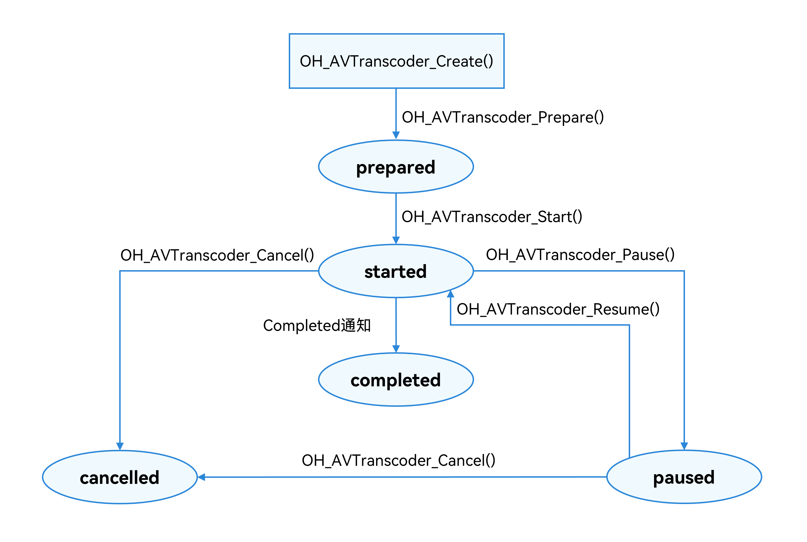

# HDR Vivid视频转码SDR视频开发实践

## 概述

随着视频技术的发展，HDR（高动态范围）视频逐渐成为主流，其中HDR Vivid作为一种先进的HDR标准，能够提供更丰富的色彩和更广泛的亮度范围。然而，许多设备和平台仍然只支持SDR（标准动态范围）视频。因此，将HDR Vivid视频转码为SDR视频的需求日益增加，以确保内容在更多设备上能够正常播放。将HDR Vivid视频转码成SDR视频是一个涉及多个技术要点的复杂过程。通过合理的转码处理，可以确保视频内容在不同设备上都能呈现出更佳的效果，不仅优化了视频的播放体验，还能满足更广泛受众的需求，提高市场影响力。


目前系统只支持从HDR Vivid类型转码为SDR视频，其他诸如HDR HLG或HDR 10类型的视频，要通过系统色彩空间转换能力将其转换为HDR Vivid类型后，才可进而转码为SDR类型视频。


本文主要面向所有开发者。在开始之前，建议已了解视频解码的[Surface模式](https://developer.huawei.com/consumer/cn/doc/harmonyos-guides/video-decoding#surface%E6%A8%A1%E5%BC%8F)、[视频色彩空间转换](https://developer.huawei.com/consumer/cn/doc/harmonyos-guides/video-csc)。


本文提供如下开发场景，以帮助开发者解决HDR视频转码SDR视频的问题：


- [基于AVTranscoder模块实现HDR Vivid视频到SDR视频转码](https://developer.huawei.com/consumer/cn/doc/best-practices/bpta-hdrtosdr#section27410119279)
- [基于AVCodec模块实现HDR Vivid视频到SDR视频转码](https://developer.huawei.com/consumer/cn/doc/best-practices/bpta-hdrtosdr#section93022418321)
- [基于VideoProcessing模块实现HDR Vivid视频到SDR视频转码](https://developer.huawei.com/consumer/cn/doc/best-practices/bpta-hdrtosdr#section64161017191119)
- [基于VideoProcessing模块转换HDR色彩空间](https://developer.huawei.com/consumer/cn/doc/best-practices/bpta-hdrtosdr#section184641629165414)


## 基于AVTranscoder模块实现HDR Vivid视频到SDR视频转码


### 实现原理


使用[AVTranscoder](https://developer.huawei.com/consumer/cn/doc/harmonyos-guides/media-kit-intro#avtranscoder)可以实现视频转码功能，从API 20开始支持视频转码的C/C++开发，转码功能可在手机、平板、PC/2in1设备上作为系统提供的基础能力使用。可以通过调用[canIUse()](https://developer.huawei.com/consumer/cn/doc/harmonyos-references/js-apis-syscap#caniuse)接口来判断当前设备是否支持AVTranscoder，当canIUse("SystemCapability.Multimedia.Media.AVTranscoder")的返回值为true时，表示可以使用转码能力。转码步骤如下：初始化与准备阶段，调用[OH_AVTranscoder_Create()](https://developer.huawei.com/consumer/cn/doc/harmonyos-references/capi-avtranscoder-h#oh_avtranscoder_create)创建`OH_AVTranscoder` 对象；启动与运行阶段，调用OH_AVTranscoder_Start()启动转码任务，此时可调用[OH_AVTranscoder_Pause()](https://developer.huawei.com/consumer/cn/doc/harmonyos-references/capi-avtranscoder-h#oh_avtranscoder_pause)暂停任务。在暂停状态下，可调用[OH_AVTranscoder_Resume()](https://developer.huawei.com/consumer/cn/doc/harmonyos-references/capi-avtranscoder-h#oh_avtranscoder_resume)恢复任务；任务进行时，若想取消该任务，可调用[OH_AVTranscoder_Cancel()](https://developer.huawei.com/consumer/cn/doc/harmonyos-references/capi-avtranscoder-h#oh_avtranscoder_cancel)终止转码任务。





### 开发步骤

具体开发步骤，可参考[使用AVTranscoder实现视频转码(C/C++)](https://developer.huawei.com/consumer/cn/doc/harmonyos-guides/using-ndk-avtranscoder-for-transcodering)。


关键点：调用[OH_AVTranscoderConfig_SetDstVideoType()](https://developer.huawei.com/consumer/cn/doc/harmonyos-references/capi-avtranscoder-h#oh_avtranscoderconfig_setdstvideotype)设置输出视频的编码格式为“video/avc”。


```cpp
1. OH_AVTranscoderConfig_SetDstVideoType(config, "video/avc");

```


[AVTranscoder.cpp](https://gitcode.com/HarmonyOS_Samples/hdr2sdr/blob/master/entry/src/main/cpp/sample/transcoder/AVTranscoder.cpp#L51-L51)


1. 创建默认AVTranscoder配置，并设置输出视频的编码格式为“video/avc”。
  
  
  

```cpp
1. void AVTranscoder::CreateDefaultTransCoderConfig(int32_t dstFd) {
2.  config = OH_AVTranscoderConfig_Create();
3.  OH_AVTranscoderConfig_SetDstFD(config, dstFd);
4.  OH_AVTranscoderConfig_SetDstFileType(config, AV_OUTPUT_FORMAT_MPEG_4);
5.  OH_AVTranscoderConfig_SetDstVideoType(config, "video/avc");
6.  OH_AVTranscoderConfig_SetDstAudioType(config, "audio/mp4a-latm");
7.  OH_AVTranscoderConfig_SetDstAudioBitrate(config, 200000);
8.  OH_AVTranscoderConfig_SetDstVideoBitrate(config, 3000000);
9. }

```
  [AVTranscoder.cpp](https://gitcode.com/harmonyos_samples/hdr2sdr/blob/master/entry/src/main/cpp/sample/transcoder/AVTranscoder.cpp#L46-L56)

2. 进行AVTranscoder转码，并返回转码结果。
  
  
  

```cpp
1. int32_t AVTranscoder::StartAVTranscoder(const SampleInfo &sampleInfo) {
2.  result = 0;
3.  sampleInfo_ = sampleInfo;
4.  transcoder = OH_AVTranscoder_Create();
5.  CreateDefaultTransCoderConfig(sampleInfo.outputFd);
6.  OH_AVTranscoder_SetStateCallback(transcoder, AvTranscoderStateChangeCb, nullptr);
7.  OH_AVTranscoder_SetErrorCallback(transcoder, OnErrorCb, nullptr);
8.  OH_AVErrCode result =
9.  OH_AVTranscoderConfig_SetSrcFD(config, sampleInfo.inputFd, 0, sampleInfo.inputFileSize);
10.  if (result != AV_ERR_OK) {
11.  AVCODEC_SAMPLE_LOGI("Transcoder setSrcFD failed, ret %{public}d", result);
12.  }
13.  result = OH_AVTranscoder_Prepare(transcoder, config);
14.  if (result != AV_ERR_OK) {
15.  AVCODEC_SAMPLE_LOGI("Transcoder prepare failed, ret %{public}d", result);
16.  }
17.  result = OH_AVTranscoder_Start(transcoder);
18.  return result;
19. }

```
  [AVTranscoder.cpp](https://gitcode.com/harmonyos_samples/hdr2sdr/blob/master/entry/src/main/cpp/sample/transcoder/AVTranscoder.cpp#L22-L42)

3. 定义AVTranscoder状态改变函数，当状态为“AVTRANSCODER_COMPLETED”时，释放AVTranscoder。
  
  
  

```cpp
1. void AVTranscoder::AvTranscoderStateChangeCb(OH_AVTranscoder *transcoder, OH_AVTranscoder_State state, void *userData) {
2.  if (transcoder == nullptr) {
3.  return;
4.  }
5.  switch (state) {
6.  case AVTRANSCODER_COMPLETED: {
7.  AVTranscoder::GetInstance().result = 1;
8.  AVTranscoder::GetInstance().ReleaseAVTranscoder();
9.  break;
10.  }
11.  default:
12.  break;
13.  }
14. }

```
  [AVTranscoder.cpp](https://gitcode.com/harmonyos_samples/hdr2sdr/blob/master/entry/src/main/cpp/sample/transcoder/AVTranscoder.cpp#L60-L73)

4. 在[OH_AVTranscoder_SetStateCallback()](https://developer.huawei.com/consumer/cn/doc/harmonyos-references/capi-avtranscoder-h#oh_avtranscoder_setstatecallback)中设置AvTranscoder状态改变监听。
  
  
  

```cpp
1. OH_AVTranscoder_SetStateCallback(transcoder, AvTranscoderStateChangeCb, nullptr);

```
  [AVTranscoder.cpp](https://gitcode.com/harmonyos_samples/hdr2sdr/blob/master/entry/src/main/cpp/sample/transcoder/AVTranscoder.cpp#L28-L28)

5. 转码成功后，释放AVTranscoder。
  
  
  

```cpp
1. int32_t AVTranscoder::ReleaseAVTranscoder() {
2.  int ret = 0;
3.  AVCODEC_SAMPLE_LOGI("OH_AVTranscoder_Release ret:%{public}d", ret);
4.  if (transcoder != nullptr) {
5.  ret = OH_AVTranscoder_Release(transcoder);
6.  AVCODEC_SAMPLE_LOGI("OH_AVTranscoder_Release ret:%{public}d", ret);
7.  transcoder = nullptr;
8.  }
9.  if (config != nullptr) {
10.  ret = OH_AVTranscoderConfig_Release(config);
11.  AVCODEC_SAMPLE_LOGI("OH_AVTranscoderConfig_Release ret:%{public}d", ret);
12.  config = nullptr;
13.  }
14.  return ret;
15. }

```
  [AVTranscoder.cpp](https://gitcode.com/harmonyos_samples/hdr2sdr/blob/master/entry/src/main/cpp/sample/transcoder/AVTranscoder.cpp#L94-L108)


## 基于AVCodec模块实现HDR Vivid视频到SDR视频转码


### 实现原理

在视频分享或者编辑场景时，开发者有时需要将HDR Vivid视频转换为SDR视频，可以调用AVCodec原生能力实现该功能。


### 开发步骤

使用AVCodec原生转码能力，主要的开发步骤为（详细开发步骤可参考[视频解码支持HDRVivid2SDR](https://developer.huawei.com/consumer/cn/doc/harmonyos-guides/hdrvivid2sdr)）：


1. 创建解码器实例，查询系统支持的解码器能力，根据查询结果基于name创建硬解码器。
  
  
  

```cpp
1. class VideoDecoder {
2. // ...
3. private:
4.  // ...
5.  OH_AVCodec *decoder_ = nullptr;
6. };

```
  [VideoDecoder.h](https://gitcode.com/HarmonyOS_Samples/hdr2sdr/blob/master/entry/src/main/cpp/capbilities/include/VideoDecoder.h#L24-L44)

  
  
  

```cpp
1. int32_t VideoDecoder::Create(SampleInfo &sampleInfo) {
2.  // ...
3.  OH_AVCapability *capability =
4.  OH_AVCodec_GetCapabilityByCategory(OH_AVCODEC_MIMETYPE_VIDEO_HEVC, false, HARDWARE);
5.  CHECK_AND_RETURN_RET_LOG(capability != nullptr, AVCODEC_SAMPLE_ERROR,
6.  "OH_AVCodec_GetCapabilityByCategory failed");
7.  const char *name = OH_AVCapability_GetName(capability);
8.  decoder_ = OH_VideoDecoder_CreateByName(name);
9.  // ...
10.  CHECK_AND_RETURN_RET_LOG(decoder_ != nullptr, AVCODEC_SAMPLE_ERROR, "Create VideoDecoder failed");
11.  return AVCODEC_SAMPLE_OK;
12. }

```
  [VideoDecoder.cpp](https://gitcode.com/HarmonyOS_Samples/hdr2sdr/blob/master/entry/src/main/cpp/capbilities/VideoDecoder.cpp#L35-L52)

2. 调用[OH_VideoDecoder_RegisterCallback()](https://developer.huawei.com/consumer/cn/doc/harmonyos-references/capi-native-avcodec-videodecoder-h#oh_videodecoder_registercallback)设置回调函数。
  
  
  

```cpp
1. int32_t VideoDecoder::SetCallback(CodecUserData *codecUserData) {
2.  int32_t ret =
3.  OH_VideoDecoder_RegisterCallback(decoder_,
4.  {SampleCallback::OnCodecError, SampleCallback::OnCodecFormatChange,
5.  SampleCallback::OnNeedInputBuffer, SampleCallback::OnNewOutputBuffer},
6.  codecUserData);
7.  CHECK_AND_RETURN_RET_LOG(ret == AV_ERR_OK, AVCODEC_SAMPLE_ERROR, "Create SetCallback failed");
8.  return AVCODEC_SAMPLE_OK;
9. }

```
  [VideoDecoder.cpp](https://gitcode.com/harmonyos_samples/hdr2sdr/blob/master/entry/src/main/cpp/capbilities/VideoDecoder.cpp#L117-L125)

3. 调用[OH_VideoDecoder_Configure()](https://developer.huawei.com/consumer/cn/doc/harmonyos-references/capi-native-avcodec-videodecoder-h#oh_videodecoder_configure)配置解码器。必选配置项有：视频帧宽度、视频帧高度、视频像素格式、指定输出为SDR。
  
  
  

```cpp
1. int32_t VideoDecoder::Configure(const SampleInfo &sampleInfo) {
2.  OH_AVFormat *format = OH_AVFormat_Create();
3.  CHECK_AND_RETURN_RET_LOG(format != nullptr, AVCODEC_SAMPLE_ERROR, "Create AVFormat failed");
4.  OH_AVFormat_SetIntValue(format, OH_MD_KEY_WIDTH, sampleInfo.videoWidth);
5.  OH_AVFormat_SetIntValue(format, OH_MD_KEY_HEIGHT, sampleInfo.videoHeight);
6.  OH_AVFormat_SetDoubleValue(format, OH_MD_KEY_FRAME_RATE, sampleInfo.frameRate);
7.  OH_AVFormat_SetIntValue(format, OH_MD_KEY_PIXEL_FORMAT, sampleInfo.pixelFormat);
8.  OH_AVFormat_SetIntValue(format, OH_MD_KEY_ROTATION, sampleInfo.rotation);
9.  // ...
10.  // Key configuration: HDR to SDR conversion
11.  OH_AVFormat_SetIntValue(format, OH_MD_KEY_VIDEO_DECODER_OUTPUT_COLOR_SPACE, OH_COLORSPACE_BT709_LIMIT);
12.  OH_AVFormat_SetIntValue(format, OH_MD_KEY_VIDEO_ENABLE_LOW_LATENCY, 1);
13.  // ...
14.  int ret = OH_VideoDecoder_Configure(decoder_, format);
15.  OH_AVFormat_Destroy(format);
16.  format = nullptr;
17.  CHECK_AND_RETURN_RET_LOG(ret == AV_ERR_OK, AVCODEC_SAMPLE_ERROR, "VideoDecoder Configure failed");
18.  return AVCODEC_SAMPLE_OK;
19. }

```
  [VideoDecoder.cpp](https://gitcode.com/harmonyos_samples/hdr2sdr/blob/master/entry/src/main/cpp/capbilities/VideoDecoder.cpp#L129-L151)

4. 目前仅Surface模式支持该能力，后续步骤具体可参考：视频解码的[Surface模式](https://developer.huawei.com/consumer/cn/doc/harmonyos-guides/video-decoding#surface%E6%A8%A1%E5%BC%8F)。


## 基于VideoProcessing模块实现HDR Vivid视频到SDR视频转码


### 实现原理

开发者可以调用[VideoProcessing](https://developer.huawei.com/consumer/cn/doc/harmonyos-references/capi-videoprocessing)模块提供的C API接口，实现HDR2SDR的色彩空间转换。支持的转码范围如下：


| 输入ColorSpace | OH_COLORSPACE_BT2020_PQ_LIMIT | OH_COLORSPACE_BT2020_HLG_LIMIT |
| --- | --- | --- |
| 输入MetadataType | OH_VIDEO_HDR_VIVID | OH_VIDEO_HDR_VIVID |
| 输入pixelFormat | NATIVEBUFFER_PIXEL_FMT_YCBCR_P010,<br>NATIVEBUFFER_PIXEL_FMT_YCRCB_P010,<br>NATIVEBUFFER_PIXEL_FMT_RGBA_1010102 | NATIVEBUFFER_PIXEL_FMT_YCBCR_P010,<br>NATIVEBUFFER_PIXEL_FMT_YCRCB_P010,<br>NATIVEBUFFER_PIXEL_FMT_RGBA_1010102 |
| 输出ColorSpace | OH_COLORSPACE_BT709_LIMIT | OH_COLORSPACE_BT709_LIMIT |
| 输出MetadataType | OH_VIDEO_NONE | OH_VIDEO_NONE |
| 输出pixelFormat | NATIVEBUFFER_PIXEL_FMT_YCBCR_420_SP,<br>NATIVEBUFFER_PIXEL_FMT_YCRCB_420_SP,<br>NATIVEBUFFER_PIXEL_FMT_RGBA_8888 | NATIVEBUFFER_PIXEL_FMT_YCBCR_420_SP,<br>NATIVEBUFFER_PIXEL_FMT_YCRCB_420_SP,<br>NATIVEBUFFER_PIXEL_FMT_RGBA_8888 |


### 开发步骤

HarmonyOS提供了Native侧的[VideoProcessing](https://developer.huawei.com/consumer/cn/doc/harmonyos-references/capi-videoprocessing)模块，可以将HDR Vivid视频转码成SDR视频，主要的开发步骤为（详细开发步骤可参考[视频色彩空间转换](https://developer.huawei.com/consumer/cn/doc/harmonyos-guides/video-csc)）：


1. 调用[OH_VideoProcessing_Create()](https://developer.huawei.com/consumer/cn/doc/harmonyos-references/capi-video-processing-h#oh_videoprocessing_create)创建视频处理实例。
  
  
  

```cpp
1. void VideoProcessing::SetProcessingSurface(SampleInfo &sampleInfo) {
2.  VideoProcessing_ErrorCode ret = OH_VideoProcessing_Create(&processor, VIDEO_PROCESSING_TYPE_COLOR_SPACE_CONVERSION);
3.  ret = OH_VideoProcessing_GetSurface(processor, &sampleInfo.inWindow);
4.  CHECK_AND_RETURN_LOG(ret == VIDEO_PROCESSING_SUCCESS, "OH_VideoProcessing_GetSurface failed");
5. }


```
  [VideoProcessing.cpp](https://gitcode.com/harmonyos_samples/hdr2sdr/blob/master/entry/src/main/cpp/capbilities/VideoProcessing.cpp#L77-L81)
     调用[OH_VideoProcessing_GetSurface()](https://developer.huawei.com/consumer/cn/doc/harmonyos-references/capi-video-processing-h#oh_videoprocessing_getsurface)在视频处理启动之前创建输入surface。


  
  
  

```cpp
1. int32_t VideoEncoder::GetSurface(SampleInfo &sampleInfo) {
2.  int32_t ret;
3.  if (sampleInfo.processType > 1) {
4.  ret = OH_VideoEncoder_GetSurface(encoder_, &sampleInfo.outWindow);
5.  } else {
6.  ret = OH_VideoEncoder_GetSurface(encoder_, &sampleInfo.window);
7.  }
8.  CHECK_AND_RETURN_RET_LOG(ret == AV_ERR_OK, AVCODEC_SAMPLE_ERROR, "Get surface failed, ret: %{public}d", ret);
9.  return AVCODEC_SAMPLE_OK;
10. }


```
  [VideoEncoder.cpp](https://gitcode.com/HarmonyOS_Samples/hdr2sdr/blob/master/entry/src/main/cpp/capbilities/VideoEncoder.cpp#L169-L178)

2. 调用[OH_VideoProcessing_SetSurface()](https://developer.huawei.com/consumer/cn/doc/harmonyos-references/capi-video-processing-h#oh_videoprocessing_setsurface)设置surface。
  
  
  

```cpp
1. int32_t err = 0;
2. err = OH_NativeWindow_SetMetadataValue(sampleInfo.outWindow, OH_HDR_METADATA_TYPE, sizeof(uint8_t),
3.  (uint8_t *)&sampleInfo.outputFormat.metadataType);
4. CHECK_AND_RETURN_LOG(err == 0, "SetMetadataValue BT2020_PQ_LIMIT failed");
5. err = OH_NativeWindow_NativeWindowHandleOpt(sampleInfo.outWindow, SET_FORMAT, sampleInfo.outputFormat.pixelFormat);
6. CHECK_AND_RETURN_LOG(err == 0, "NativeWindowHandleOpt BT2020_PQ_LIMIT failed");
7. err = OH_NativeWindow_SetColorSpace(sampleInfo.outWindow,
8.  OH_NativeBuffer_ColorSpace(sampleInfo.outputFormat.colorSpace));
9. CHECK_AND_RETURN_LOG(err == 0, "SetColorSpace failed");
10.
11. ret = OH_VideoProcessing_SetSurface(processor, sampleInfo.outWindow);
12. CHECK_AND_RETURN_LOG(ret == VIDEO_PROCESSING_SUCCESS, "SetSurface failed");


```
  [VideoProcessing.cpp](https://gitcode.com/harmonyos_samples/hdr2sdr/blob/master/entry/src/main/cpp/capbilities/VideoProcessing.cpp#L48-L59)

3. 调用[OH_VideoProcessing_RegisterCallback()](https://developer.huawei.com/consumer/cn/doc/harmonyos-references/capi-video-processing-h#oh_videoprocessing_registercallback)等函数创建并绑定回调函数。
  
  
  

```cpp
1. ret = OH_VideoProcessingCallback_Create(&callback);
2. CHECK_AND_RETURN_LOG(ret == VIDEO_PROCESSING_SUCCESS, "OH_VideoProcessingCallback_Create failed");
3. ret = OH_VideoProcessingCallback_BindOnError(callback, OnError);
4. CHECK_AND_RETURN_LOG(ret == VIDEO_PROCESSING_SUCCESS, "OH_VideoProcessingCallback_BindOnError failed");
5. ret = OH_VideoProcessingCallback_BindOnState(callback, OnState);
6. CHECK_AND_RETURN_LOG(ret == VIDEO_PROCESSING_SUCCESS, "OH_VideoProcessingCallback_BindOnState failed");
7. ret = OH_VideoProcessingCallback_BindOnNewOutputBuffer(callback, OnNewOutputBuffer);
8. CHECK_AND_RETURN_LOG(ret == VIDEO_PROCESSING_SUCCESS, "OH_VideoProcessingCallback_BindOnNewOutputBuffer failed");
9. ret = OH_VideoProcessing_RegisterCallback(processor, callback, nullptr);
10. CHECK_AND_RETURN_LOG(ret == VIDEO_PROCESSING_SUCCESS, "OH_VideoProcessing_RegisterCallback failed");


```
  [VideoProcessing.cpp](https://gitcode.com/harmonyos_samples/hdr2sdr/blob/master/entry/src/main/cpp/capbilities/VideoProcessing.cpp#L62-L71)

4. 调用[OH_VideoProcessing_Start()](https://developer.huawei.com/consumer/cn/doc/harmonyos-references/capi-video-processing-h#oh_videoprocessing_start)启动色彩空间转换处理。
  
  
  

```cpp
1. void VideoProcessing::StartProcessing() {
2.  VideoProcessing_ErrorCode ret = OH_VideoProcessing_Start(processor);
3.  CHECK_AND_RETURN_LOG(ret == VIDEO_PROCESSING_SUCCESS, "OH_VideoProcessing_Start failed");
4. }


```
  [VideoProcessing.cpp](https://gitcode.com/harmonyos_samples/hdr2sdr/blob/master/entry/src/main/cpp/capbilities/VideoProcessing.cpp#L92-L95)

5. 调用[OH_VideoProcessing_Stop()](https://developer.huawei.com/consumer/cn/doc/harmonyos-references/capi-video-processing-h#oh_videoprocessing_stop)停止色彩空间转换处理。
  
  
  

```cpp
1. void VideoProcessing::StopProcessing() {
2.  VideoProcessing_ErrorCode ret = OH_VideoProcessing_Stop(processor);
3.  CHECK_AND_RETURN_LOG(ret == VIDEO_PROCESSING_SUCCESS, "OH_VideoProcessing_Stop failed");
4.  DestroyProcessing();
5. }


```
  [VideoProcessing.cpp](https://gitcode.com/harmonyos_samples/hdr2sdr/blob/master/entry/src/main/cpp/capbilities/VideoProcessing.cpp#L115-L119)

6. 调用[OH_VideoProcessing_Destroy()](https://developer.huawei.com/consumer/cn/doc/harmonyos-references/capi-video-processing-h#oh_videoprocessing_destroy)及[OH_VideoProcessing_DeinitializeEnvironment()](https://developer.huawei.com/consumer/cn/doc/harmonyos-references/capi-video-processing-h#oh_videoprocessing_deinitializeenvironment)释放处理实例和资源。
  
  
  

```cpp
1. void VideoProcessing::DestroyProcessing() {
2.  CHECK_AND_RETURN_LOG(processor != nullptr, "processor is nullptr");
3.  OH_LOG_Print(LOG_APP, LOG_INFO, LOG_PRINT_DOMAIN, LOG_TAG, "start DestroyProcessing");
4.  VideoProcessing_ErrorCode ret = OH_VideoProcessing_Destroy(processor);
5.  CHECK_AND_RETURN_LOG(ret == VIDEO_PROCESSING_SUCCESS, "OH_VideoProcessing_Destroy failed");
6.  processor = nullptr;
7.  CHECK_AND_RETURN_LOG(callback != nullptr, "callback is nullptr");
8.  ret = OH_VideoProcessingCallback_Destroy(callback);
9.  CHECK_AND_RETURN_LOG(ret == VIDEO_PROCESSING_SUCCESS, "OH_VideoProcessingCallback_Destroy failed");
10.  callback = nullptr;
11.  OH_LOG_Print(LOG_APP, LOG_INFO, LOG_PRINT_DOMAIN, LOG_TAG, "Destroy And Callback_Destroy succeed");
12.  OH_VideoProcessing_DeinitializeEnvironment();
13. }


```
  [VideoProcessing.cpp](https://gitcode.com/harmonyos_samples/hdr2sdr/blob/master/entry/src/main/cpp/capbilities/VideoProcessing.cpp#L99-L111)


## 基于VideoProcessing模块转换HDR色彩空间


### 实现原理

开发者可以调用[VideoProcessing](https://developer.huawei.com/consumer/cn/doc/harmonyos-references/capi-videoprocessing)模块提供的C API接口，实现HDR2HDR的色彩空间转换。支持的转码范围如下：


| 输入ColorSpace | OH_COLORSPACE_BT2020_PQ_LIMIT | OH_COLORSPACE_BT2020_PQ_LIMIT | OH_COLORSPACE_BT2020_PQ_LIMIT | OH_COLORSPACE_BT2020_PQ_HLG_LIMIT |
| --- | --- | --- | --- | --- |
| 输入MetadataType | OH_VIDEO_HDR_VIVID | OH_VIDEO_HDR_HLG | OH_VIDEO_HDR_HLG | OH_VIDEO_HDR_VIVID |
| 输入pixelFormat | NATIVEBUFFER_PIXEL_FMT_YCBCR_P010,<br>NATIVEBUFFER_PIXEL_FMT_YCRCB_P010,<br>NATIVEBUFFER_PIXEL_FMT_RGBA_1010102 | NATIVEBUFFER_PIXEL_FMT_YCBCR_P010,<br>NATIVEBUFFER_PIXEL_FMT_<br>YCRCB_P010,<br>NATIVEBUFFER_PIXEL_FMT_RGBA_1010102 | NATIVEBUFFER_PIXEL_FMT_YCBCR_P010,<br>NATIVEBUFFER_PIXEL_FMT_<br>YCRCB_P010,<br>NATIVEBUFFER_PIXEL_FMT_RGBA_1010102 | NATIVEBUFFER_PIXEL_FMT_YCBCR_P010,<br>NATIVEBUFFER_PIXEL_FMT_<br>YCRCB_P010,<br>NATIVEBUFFER_PIXEL_FMT_RGBA_1010102 |
| 输出ColorSpace | OH_COLORSPACE_BT2020_HLG_LIMIT | OH_COLORSPACE_BT2020_HLG_LIMIT | OH_COLORSPACE_BT2020_HLG_LIMIT | OH_COLORSPACE_BT2020_PQ_HLG_LIMIT |
| 输出MetadataType | OH_VIDEO_HDR_VIVID | OH_VIDEO_HDR_HDR10 | OH_VIDEO_HDR_VIVID | OH_VIDEO_HDR_VIVID |
| 输出pixelFormat | NATIVEBUFFER_PIXEL_FMT_YCBCR_P010,<br>NATIVEBUFFER_PIXEL_FMT_YCRCB_P010,<br>NATIVEBUFFER_PIXEL_FMT_RGBA_1010102 | NATIVEBUFFER_PIXEL_FMT_YCBCR_P010,<br>NATIVEBUFFER_PIXEL_FMT_<br>YCRCB_P010,<br>NATIVEBUFFER_PIXEL_FMT_RGBA_1010102 | NATIVEBUFFER_PIXEL_FMT_YCBCR_P010,<br>NATIVEBUFFER_PIXEL_FMT_<br>YCRCB_P010,<br>NATIVEBUFFER_PIXEL_FMT_RGBA_1010102 | NATIVEBUFFER_PIXEL_FMT_YCBCR_P010,<br>NATIVEBUFFER_PIXEL_FMT_<br>YCRCB_P010,<br>NATIVEBUFFER_PIXEL_FMT_RGBA_1010102 |


### 开发步骤

具体开发步骤，可参考[视频色彩空间转换](https://developer.huawei.com/consumer/cn/doc/harmonyos-guides/video-csc)。


1. 初始化环境并查询是否支持视频颜色空间转换。
  
  
  

```cpp
1. bool VideoProcessing::IsColorSpaceConversionSupported(SampleInfo &sampleInfo) {
2.  OH_VideoProcessing_InitializeEnvironment();
3.  return OH_VideoProcessing_IsColorSpaceConversionSupported(&sampleInfo.inputFormat, &sampleInfo.outputFormat);
4. }


```
  [VideoProcessing.cpp](https://gitcode.com/harmonyos_samples/hdr2sdr/blob/master/entry/src/main/cpp/capbilities/VideoProcessing.cpp#L85-L88)

2. 设置输入输出的值。
  
  
  

```cpp
1. sampleInfo.inputFormat.metadataType = OH_VIDEO_HDR_VIVID;
2. sampleInfo.inputFormat.colorSpace = OH_COLORSPACE_BT2020_HLG_LIMIT;
3. sampleInfo.inputFormat.pixelFormat = NATIVEBUFFER_PIXEL_FMT_YCRCB_P010;
4. sampleInfo.outputFormat.metadataType = OH_VIDEO_NONE;
5. sampleInfo.outputFormat.colorSpace = OH_COLORSPACE_BT709_LIMIT;
6. sampleInfo.outputFormat.pixelFormat = NATIVEBUFFER_PIXEL_FMT_YCBCR_420_SP;


```
  [TranscoderNative.cpp](https://gitcode.com/HarmonyOS_Samples/hdr2sdr/blob/master/entry/src/main/cpp/sample/transcoder/TranscoderNative.cpp#L130-L135)

3. 创建色彩空间转换模块，并获取Surface。
  
  
  

```cpp
1. void VideoProcessing::SetProcessingSurface(SampleInfo &sampleInfo) {
2.  VideoProcessing_ErrorCode ret = OH_VideoProcessing_Create(&processor, VIDEO_PROCESSING_TYPE_COLOR_SPACE_CONVERSION);
3.  ret = OH_VideoProcessing_GetSurface(processor, &sampleInfo.inWindow);
4.  CHECK_AND_RETURN_LOG(ret == VIDEO_PROCESSING_SUCCESS, "OH_VideoProcessing_GetSurface failed");
5. }


```
  [VideoProcessing.cpp](https://gitcode.com/harmonyos_samples/hdr2sdr/blob/master/entry/src/main/cpp/capbilities/VideoProcessing.cpp#L77-L81)

4. 配置异步回调函数。
  
  
  

```cpp
1. void OnError(OH_VideoProcessing *videoProcessor, VideoProcessing_ErrorCode error, void *userData) {
2.  (void)videoProcessor;
3.  (void)error;
4.  (void)userData;
5.  OH_LOG_Print(LOG_APP, LOG_ERROR, LOG_PRINT_DOMAIN, LOG_TAG, "OnError: %{public}d", error);
6. }
7.
8. void OnState(OH_VideoProcessing *videoProcessor, VideoProcessing_State state, void *userData) {
9.  (void)videoProcessor;
10.  (void)state;
11.  (void)userData;
12. }
13.
14. void OnNewOutputBuffer(OH_VideoProcessing *videoProcessor, uint32_t index, void *userData) {
15.
16.  OH_VideoProcessing_RenderOutputBuffer(videoProcessor, index);
17.  (void)userData;
18. }


```
  [VideoProcessing.cpp](https://gitcode.com/harmonyos_samples/hdr2sdr/blob/master/entry/src/main/cpp/capbilities/VideoProcessing.cpp#L25-L42)

  
  
  

```cpp
1. ret = OH_VideoProcessingCallback_Create(&callback);
2. CHECK_AND_RETURN_LOG(ret == VIDEO_PROCESSING_SUCCESS, "OH_VideoProcessingCallback_Create failed");
3. ret = OH_VideoProcessingCallback_BindOnError(callback, OnError);
4. CHECK_AND_RETURN_LOG(ret == VIDEO_PROCESSING_SUCCESS, "OH_VideoProcessingCallback_BindOnError failed");
5. ret = OH_VideoProcessingCallback_BindOnState(callback, OnState);
6. CHECK_AND_RETURN_LOG(ret == VIDEO_PROCESSING_SUCCESS, "OH_VideoProcessingCallback_BindOnState failed");
7. ret = OH_VideoProcessingCallback_BindOnNewOutputBuffer(callback, OnNewOutputBuffer);
8. CHECK_AND_RETURN_LOG(ret == VIDEO_PROCESSING_SUCCESS, "OH_VideoProcessingCallback_BindOnNewOutputBuffer failed");
9. ret = OH_VideoProcessing_RegisterCallback(processor, callback, nullptr);
10. CHECK_AND_RETURN_LOG(ret == VIDEO_PROCESSING_SUCCESS, "OH_VideoProcessing_RegisterCallback failed");


```
  [VideoProcessing.cpp](https://gitcode.com/harmonyos_samples/hdr2sdr/blob/master/entry/src/main/cpp/capbilities/VideoProcessing.cpp#L62-L71)

5. 设置Surface。
  
  
  

```cpp
1. int32_t err = 0;
2. err = OH_NativeWindow_SetMetadataValue(sampleInfo.outWindow, OH_HDR_METADATA_TYPE, sizeof(uint8_t),
3.  (uint8_t *)&sampleInfo.outputFormat.metadataType);
4. CHECK_AND_RETURN_LOG(err == 0, "SetMetadataValue BT2020_PQ_LIMIT failed");
5. err = OH_NativeWindow_NativeWindowHandleOpt(sampleInfo.outWindow, SET_FORMAT, sampleInfo.outputFormat.pixelFormat);
6. CHECK_AND_RETURN_LOG(err == 0, "NativeWindowHandleOpt BT2020_PQ_LIMIT failed");
7. err = OH_NativeWindow_SetColorSpace(sampleInfo.outWindow,
8.  OH_NativeBuffer_ColorSpace(sampleInfo.outputFormat.colorSpace));
9. CHECK_AND_RETURN_LOG(err == 0, "SetColorSpace failed");
10.
11. ret = OH_VideoProcessing_SetSurface(processor, sampleInfo.outWindow);
12. CHECK_AND_RETURN_LOG(ret == VIDEO_PROCESSING_SUCCESS, "SetSurface failed");


```
  [VideoProcessing.cpp](https://gitcode.com/harmonyos_samples/hdr2sdr/blob/master/entry/src/main/cpp/capbilities/VideoProcessing.cpp#L48-L59)

6. 调用[OH_VideoProcessing_Start()](https://developer.huawei.com/consumer/cn/doc/harmonyos-references/capi-video-processing-h#oh_videoprocessing_start)启动色彩空间转换处理。
  
  
  

```cpp
1. void VideoProcessing::StartProcessing() {
2.  VideoProcessing_ErrorCode ret = OH_VideoProcessing_Start(processor);
3.  CHECK_AND_RETURN_LOG(ret == VIDEO_PROCESSING_SUCCESS, "OH_VideoProcessing_Start failed");
4. }


```
  [VideoProcessing.cpp](https://gitcode.com/harmonyos_samples/hdr2sdr/blob/master/entry/src/main/cpp/capbilities/VideoProcessing.cpp#L92-L95)

7. 调用[OH_VideoProcessing_Stop()](https://developer.huawei.com/consumer/cn/doc/harmonyos-references/capi-video-processing-h#oh_videoprocessing_stop)停止色彩空间转换处理。
  
  
  

```cpp
1. void VideoProcessing::StopProcessing() {
2.  VideoProcessing_ErrorCode ret = OH_VideoProcessing_Stop(processor);
3.  CHECK_AND_RETURN_LOG(ret == VIDEO_PROCESSING_SUCCESS, "OH_VideoProcessing_Stop failed");
4.  DestroyProcessing();
5. }


```
  [VideoProcessing.cpp](https://gitcode.com/harmonyos_samples/hdr2sdr/blob/master/entry/src/main/cpp/capbilities/VideoProcessing.cpp#L115-L119)
     调用[OH_VideoProcessing_Destroy()](https://developer.huawei.com/consumer/cn/doc/harmonyos-references/capi-video-processing-h#oh_videoprocessing_destroy)销毁视频处理实例。


  
  
  

```cpp
1. void VideoProcessing::DestroyProcessing() {
2.  CHECK_AND_RETURN_LOG(processor != nullptr, "processor is nullptr");
3.  OH_LOG_Print(LOG_APP, LOG_INFO, LOG_PRINT_DOMAIN, LOG_TAG, "start DestroyProcessing");
4.  VideoProcessing_ErrorCode ret = OH_VideoProcessing_Destroy(processor);
5.  CHECK_AND_RETURN_LOG(ret == VIDEO_PROCESSING_SUCCESS, "OH_VideoProcessing_Destroy failed");
6.  processor = nullptr;
7.  CHECK_AND_RETURN_LOG(callback != nullptr, "callback is nullptr");
8.  ret = OH_VideoProcessingCallback_Destroy(callback);
9.  CHECK_AND_RETURN_LOG(ret == VIDEO_PROCESSING_SUCCESS, "OH_VideoProcessingCallback_Destroy failed");
10.  callback = nullptr;
11.  OH_LOG_Print(LOG_APP, LOG_INFO, LOG_PRINT_DOMAIN, LOG_TAG, "Destroy And Callback_Destroy succeed");
12.  OH_VideoProcessing_DeinitializeEnvironment();
13. }


```
  [VideoProcessing.cpp](https://gitcode.com/harmonyos_samples/hdr2sdr/blob/master/entry/src/main/cpp/capbilities/VideoProcessing.cpp#L99-L111)


## 示例代码

- [实现HDR视频转码SDR视频功能](https://gitcode.com/harmonyos_samples/hdr2sdr/tree/master/)
